

<a name=list><h3><a href="https://">中国禁闻 时时更新 请随时关注 並记下短连结 https://git.io/DWDW </a></h3>

<table>
  <tr>
    <td width=680><a href=#1>1.安徽猪瘟泛滥 民众普遍不知情 猪肉仍流通</a> </td>
    <td width=200 ><a href=#1>大纪元新闻</a> </td>
 </tr>
  
  <tr>
    <td width=680><a href=#2>2.河南疫苗受害家庭的苦难历程（一）</a> </td>
    <td width=200 ><a href=#2>大纪元新闻</a> </td>
 </tr>
   
   <tr>
    <td width=680><a href=#3>3.河南疫苗受害家庭的苦难历程（二）</a> </td>
    <td width=200 ><a href=#3>大纪元新闻</a> </td>
 </tr>
 
 <tr>
    <td width=680><a href=#4>4.大陆8月天灾人祸不断 社会危机重重</a> </td>
    <td width=200 ><a href=#4>大纪元新闻</a> </td>
 </tr>
   
   <tr>
    <td width=680><a href=#5>5.马三家酷刑受害者：我要站出来说话(1)</a> </td>
    <td width=200 ><a href=#5>大纪元新闻</a> </td>
 </tr>
   
   <tr>
    <td width=680><a href=#6>6.马三家酷刑受害者：我要站出来说话(2)</a> </td>
    <td width=200 ><a href=#6>大纪元新闻</a> </td>
 </tr>
 
  <tr>
    <td width=680><a href=#7>7.马三家酷刑受害者：我要站出来说话(3)</a> </td>
    <td width=200 ><a href=#7>大纪元新闻</a> </td>
 </tr>
 
 <tr>
    <td width=680><a href=#8>8.马三家酷刑受害者：我要站出来说话(4)</a> </td>
    <td width=200 ><a href=#8>大纪元新闻</a> </td>
 </tr>
 
   <tr>
    <td width=680><a href=#9>9.马三家幸存者：认识的10位法轮功学员被迫害死</a> </td>
    <td width=200 ><a href=#9>大纪元新闻</a> </td>
 </tr>
   
  <tr>
    <td width=680><a href=#10>10.来自马三家的无声咆哮——孙毅的故事 </a> </td>
    <td width=200 ><a href=#10>大纪元新闻</a> </td>
 </tr>
   
   <tr>
    <td width=680><a href=#11>11.北京娱乐圈高层：范冰冰很惨 回不来了！ </a> </td>
    <td width=200 ><a href=#11>希望之声</a> </td>
 </tr>
   
<tr>
    <td width=680><a href=#12>12.打压宗教自由再升级 中共祭出新招近变态 </a> </td>
    <td width=200 ><a href=#12>希望之声</a> </td>
 </tr>
   
   
   
  </table> 
   

   
   
 
 
 <a href=#list><h6 align="right">回目錄</h6></a>
     
   

  
    
   

     
<a name=12><h2>打压宗教自由再升级 中共祭出新招近变态 </a>  </h2>
  

  
 
中共正在焚烧一座教堂顶端的十字架 
 
       
 
 <b>【希望之声2018年9月11日】（本台记者杨正综合报导）</b>
   
   中共政府法制信息网昨日（10日）发布中共国家宗教事务局关于《互联网宗教信息服务管理办法（征求意见稿）》公开征求意见的通知，显示中共再度加强对宗教的严控。
  管理办法规定，境外组织或个人及其在境内成立的组织不得在境内从事互联网宗教信息服务。

取得《互联网宗教信息服务许可证》的宗教团体、宗教院校和宗教活动场所，可以且仅限于在其自建的网络平台上由宗教教职人员讲经讲道，讲经讲道实行实名制管理，其他任何组织或者个人不得在互联网上讲经讲道或者转发、链接相关内容。

任何组织或者个人不得在互联网上以文字、图片、音视频等方式直播或者录播拜佛、烧香、受戒、诵经、礼拜、弥撒、受洗等宗教活动等等。

今年以来，中共已采取多项措施加强对宗教的打压限制。

2月1日实施的新修订的《宗教事务条例》规定“宗教场所之外不得进行宗教活动”。

8月印发的《中国共产党纪律处分条例》，新增加了对信仰宗教的党员，“经党组织帮助教育仍没有转变的，应当劝其退党；劝而不退的，予以除名”的规定。

全国多地还发生取缔家庭教会、拆除十字架等事件，在河南、安徽等地还传出，中共强迫村民签署“不再信仰基督教，坚决听党的话，跟党走”的承诺书，并要求当事人亲友作证监督。

而新疆更被爆出超过百万人被关押在所谓“再教育营”，他们被强迫放弃信仰，不准读可兰经，强迫吃猪肉等。

对此多名美国国会议员上月联署呼吁川普政府，对参与迫害的官员及公司实施制裁。一旦实施，因贸易战和朝鲜问题而日趋紧张的中美关系将雪上加霜。

责任编辑：林莉
  
 
  <a href=#list><h6 align="right">回目錄</h6></a>
     
   

  
    
  
   
     
<a name=11><h2>北京娱乐圈高层：范冰冰很惨 回不来了！ </a>  </h2>
  

  
 
种种迹象显示，范冰冰似乎凶多吉少。 
 
       
 
 <b>【希望之声2018年9月9日】（本台记者杨正综合报导）</b>

 中国女星范冰冰因涉阴阳合同、逃税风波两个多月前消失于公众视野后，其下落一直是各界关注的话题。期间种种传言不断。近日，台媒引述北京知情高层指，范冰冰已入狱1个月，回不来了。
 台湾ETtoday新闻云前日（7日）报道称，知情北京娱乐圈高层透露，范冰冰6月底被公安带回到案说明，2天后的确一度被放回，但8月初再度被捕，一直关押至今。

该高层表示，“范冰冰，很惨，回不来了。”演艺生涯也就这样了。

报道称，这次官方大动作制裁范冰冰，据传是为了让外界见证“扫贪反腐”的决心。

日前中共国务院中央直属党报《经济日报》旗下的《证券日报》转发文章称，除涉偷税漏税外，范冰冰还涉嫌参与有关银行违规放贷及腐败案件。文章强调，范冰冰目前已被有关机构控制，并接受调查，未来最大可能是面临法律制裁。

虽然报道很快被删除，但该媒体的官方背景，还是使得相关消息引发了极大的关注。

9月7日，有网友在微博爆料称范冰冰不仅仅是偷税漏税，还涉嫌某家和融创、碧桂园、万科相同级别的私营房地产企业的贷款诈骗有关。总部在北京的《多维》认为，这间接证明了官方报道的真实性。不过，和官方媒体转载文章被删一样，该网友微博也很快被删除。

该微博虽然被删，但下面的评论显示，“某家和融创、碧桂园、万科相同级别的私营房地产企业”指的是恒大。对此，恒大方面并未给予回应。

报道指，范冰冰是恒大活动中的常客，恒大老板许家印和范冰冰早有绯闻传出。有消息称，范冰冰工作室就是恒大投资的。

范冰冰主演的《武媚娘传奇》、《赢天下》、《日月人鱼》、《画框里的女人》出品方或联合出品方都是恒大影视。 2011年时，范冰冰曾被传怀孕，绯闻对象便是恒大老板许家印。

有网友为范冰冰担忧，“完了，涉及贪腐就完了。”“冰冰凉凉了。”

此外，大陆网络近日还传出，央视广告部审查科已发出通知，由范冰冰作为代言人的广告一律禁播。

种种迹象显示，范冰冰似乎凶多吉少。

责任编辑：韩梅
 
  <a href=#list><h6 align="right">回目錄</h6></a>
     
   

  
    
 
 
     
<a name=10><h2>来自马三家的无声咆哮——孙毅的故事 </a>  </h2>
  
 
 多次揭马三家真相 50岁孙毅“病逝”于印尼  
  
   

  
 
孙毅2016年在北京。（作者提供） 
 
       
 【大纪元2017年12月27日讯】在那个必须蹲著与警察说话的地方，他平躺着，虽然四肢都被捆绑得不能动弹，却让最凶残的警察感到了恐惧……
 看守他的人满怀敬佩地回忆他，“受刑时从没有因为疼痛而喊叫”……

2017年中秋节这一天，流亡在远离祖国的一个小岛上，他默默地离开了这个世界，留下了他的故事。

他五十岁的人生堪称传奇，就像“黑暗里的一道闪电”，他的故事告诉人们，即使深陷一个发出声音都危险的“地狱”，人仍然可以为自己的尊严呼喊；一个血肉之躯，仍然能以无论如何也摧毁不了的信念，守住自己的“道”。

 
 <b>远在9000公里以外的求救</b>

 住在美国俄勒冈的朱莉‧凯斯女士，没想到自己拆开的一封信会震惊世界。信藏匿在两块泡沫墓碑之间，这是一套中国制造的万圣节装饰品。远在9000公里以外的东半球，写信人夹杂着中文词的英文向她求救：

“如果您偶然购买了这个产品，请帮忙转送这封信给世界人权组织。这里处在中共政府迫害之下的数千人将永远感谢并记住您。……”
 
 

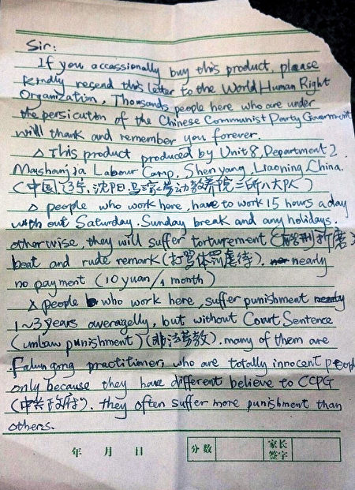

  
 
被叠了三折的求救信。（朱莉‧凯斯提供） 
 
   
 
 这封注明来自中国马三家劳教所的求救信，迅速成为国际新闻的头条之一，写信人“勇敢的行为”被称为“了不起的壮举”。

那是2012年10月底，凯斯本来想用这套装饰品增添女儿节日派对的喜乐气氛，但信的内情“吓著了”她，她担忧写信人是否还能活着。

写信人此时已走出了劳教所，默默无闻地生活在北京。后来他接受了CNN的采访，为了安全，他没有公开自己的真实身份。

“像个理工男”，他戴着一副细边近视镜，目光清澈，看起来柔弱温和，甚至有些腼腆，他说话平淡，慢条斯理。他说，“我曾经是一个懦弱又贪生怕死”的人，之所以能够无惧中共的迫害，“是因为修炼法轮功，所以内心变得无比强大”。
 
 

  
 
孙毅2016年在沈阳。（作者提供） 
 
   
 
 他经常一大早就出门了，在北京的各个地铁、公交站辗转倒车，背著电脑包，拎着各种配件，他几乎每天都要跨越大半个北京城，为一些想学电脑的人上门提供服务，帮助年龄大的人学会翻墙、打印。很少人知道他的真实姓名，都叫他“小方”。有了技术故障，就说“等小方来吧” 。在他们眼里，小方“最耐心”，“没有脾气”。

他靠微薄的一点积蓄过活，因修炼失去工作后，再没有想过挣钱的事。“大陆太需要像我这样做技术支持的人了”， 这是“反抗迫害的基础性建设”，为此他付出了所有的时间和精力。“吃饱就行”，他没有一点休闲享乐，但一双廉价的皮鞋，“总是擦得干干净净”。

2013年4月，大陆杂志《lens》也曝光了记录马三家劳教所奴工劳动与酷刑迫害的字条，那是经由女所的劳教人员藏在阴道里艰难传出来的。曾被关押在那里的人说，“笔和纸都是违禁品，偶尔允许家信，只能写你好我好身体好，干活儿的种类、人数是绝对不允许写的，否则就是‘泄漏监管机密’”。

那么，这封求救信怎么从东半球传到了西半球？

在生前的最后三年，他录制了大量的音频视频，详细讲述了他自己与求救信有关的事情。本文细节均选自他及劳教所相关人士的口述。

<b>被卖到马三家劳教所做“鬼活儿”</b>

2008年正月，因为一些打印机耗材和不被中共允许的宣传品，他在北京被绑架。没有任何法律程序，他被劳教二年半，罪名是“扰乱社会秩序”。当时北京创建“绿色平安奥运”，很多异议人士、法轮功信仰者、家庭教会成员及上访者都被判了劳教，北京劳教所人满为患。

很快，他从北京调遣处被卖到了东北辽宁的沈阳马三家劳教所。警察私下透露，一个人的价格大概是八百到一千元人民币左右，“青壮劳力会贵一些”。

成立于1957年的辽宁马三家劳教所，是仿效前苏联劳改营建立的，曾经关押过“反革命”、“六四动乱分子”和“严打分子”。1999年以后，它更多关押的是法轮功信仰者。因为劳教所是在坟包、荆棘之上开垦出来的，马三家警察自称是“地狱里的小鬼儿”。

当时中国三百多个劳教所里，马三家劳教所以“人间地狱”著称。一些人至今心有余悸：“下次劳教，如果知道是去马三家，在路上我就一头撞死”，因为“在马三家，想死都难！”

奥运前夕，他被分在马三家劳教所二所八大队，制作泡沫墓碑和塑料“小鬼”，劳教们叫“鬼活儿”，就是生产万圣节装饰品。他在求救信里记述：“在这里工作的人们不得不一天工作15个小时，没有周六周日休息和任何节假日。否则，他们就将遭到酷刑、殴打和粗暴的话语。……”

“说是给工资，但从来没拿到过，有的上厕所都没有手纸！”曾经给“小鬼”穿灰纱衣服的一个劳教人员证实：“很多人做梦都在做‘小鬼儿’！那时候，我们与世隔绝一样，不知道能否活着出来，而“‘哭’在劳教所是被禁止的。”

除了纸和笔，表也是违禁品。警察发现，如果看着表干活儿，快吃饭或收工时，劳教们就会放慢速度，工作效率就会降低。

没有表的日子更显得漫长。他常常望着堆在院子里的墓碑原料，紧靠高墙的垛子一层层码放着，他幻想：如果踩着垛子翻墙跳出去就好了。

他观察到，这批万圣节装饰品将出口到以英语为母语的国家。在包装墓碑的过程中，他萌生了一个计划——写求救信，然后想办法塞进去，让世人知道这里的情况。一个贿赂过警察的吸毒犯从办公室偷出一只钢笔，送给了他。平时抄作业时，他也偷偷从本上撕下来一些作业纸。

凌晨三、四点钟，在架子床的上铺，他面对墙壁侧躺着，悄悄把藏好的纸笔从枕套中抽出，把纸在枕边展开，然后用右手小指压住纸，一边斜着眼，拿笔在纸上写，一边耸著耳朵，屏住呼吸，凝听周围的动静。看管的犯人随时都可能走近他的床边，他必须保持身体不动，用后背挡住看管犯人的视线……

就这样，在监室的长明灯下，他躺着写过20多封求救信，成功放进了包装箱。

看着装满“鬼活儿”的集装箱一车车驶出了劳教所的大门，他盼望藏在里面的信能闯过海关的重重检查：“万鬼节有人能收到信就好了。”小时候，他就梦想过航海探险、环游世界。
 
 

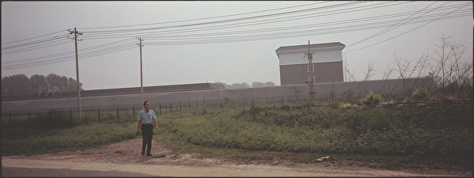

  
 
2016年7月30日，孙毅在马三家男子劳教所一所高墙的外面。这个所的三大队（法轮功专管大队）是他遭受严厉酷刑之地。（杜斌摄） 
 
   
 
 <b>比活摘还要残酷的“精神摘除”</b>
 

 他被送进马三家法轮功专管大队是2008年的冬天。万圣节已经过去，他没想到自己被抛进了“地狱的最底层”。

马克思和毛泽东的挂像被高悬在专管大队大厅，中间是一个宣誓栏，每个法轮功学员都被要求在宣誓栏上签名，必须宣誓与法轮功决裂，宣誓坚决拥护中国共产党。一段时间，这成了三大队每天都要重复的“仪式”。

不断说假话，不断背叛，在这里成为唯一安全的生存方式 。“千万别把自己当人”，成了劳教们的口头禅。蹲著与警察说话，被逼说谎，被逼辱骂自己的师父、父母，被逼唱红歌，被逼背诵监规直至疯癫……

但他认为，这是比活摘还要残酷的“精神摘除”，他拒绝这种毁灭灵魂的自辱自毁。专管大队便开始对他实施酷刑，警察声称：“政法委给我们特批了两个死亡名额。”

酷刑的目的是“精神摘除”，并不想让他死，他甚至有专门医生的“看护”，随时被检查身体。医生向警察提供他的各项身体指标，避免发生意外，使酷刑顺利进行。

没有想像中的刑具，任何一件东西都可以成为刑具。
 
  

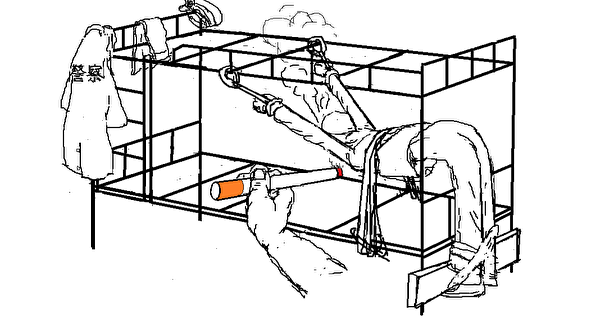

  
 
马三家劳教所酷刑：“抻床”。（孙毅手绘亲身经历） 
 
   
 一个普通架子床，卸下床板，就成了刑具：“抻床”。警察认为，“抻床”避免了电击的疤痕，能使人痛苦，不容易留下明显外伤。当痛感减轻或麻木时，他就会被迅速卸下——上抻床就不起作用了，恢复知觉后，再继续上刑。他回忆当时的心态，“意志必须像一根擎天立柱，决不能有一丝一毫偏移，否则就会立即被巨难压垮，只有最正、最直的角度，才能刺穿这万斤闸门。”

他曾连续不间断被挂168小时，期间被剥夺睡眠。
 
 

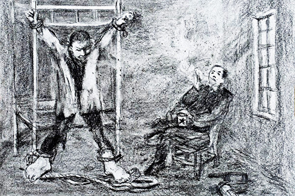

  
 
马三家劳教所酷刑：上大挂。（作者提供） 
 
   
 医疗用开口器也成刑具。长时间戴开口器，拿下来嘴就闭不上了，下巴也合拢不回去。看管他的人往他嘴里吐痰、掸烟灰 ……

普通的医用护理床，被劳教人员叫做“死人床”。
 
  

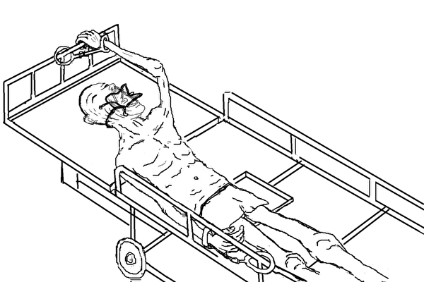

  
 
马三家劳教所酷刑组合：“死人床”与“上开口器”。（孙毅手绘亲身经历） 
 
  
 逃跑是不可能的了，呼喊都是不可能的。当上面来人参观时，他被牢牢铐在“死人床”上，嘴还被用胶带一圈一圈缠上，只留鼻孔呼吸。

半夜被冻醒，铁铐子的寒凉刺痛全身，他用牙齿，一点点把被子咬著拽上来。看着天花板，他想着那二十多封求救信，一封都没被收到吗？大超市的仓库里，一层层压着的货品，谁会把带他信的玩具买走？什么时候能把信打开？会有人把它交给人权组织吗？……

他曾经寄望求救信在海外被发现后能改变处境，后来他才明白：“真正的力量只能来源于自己，一个人的力量就足够强大。”看守他的人满怀敬佩地回忆说：“受刑时他从没有因为疼痛而喊叫。”

胳膊韧带被拉伤，腿部肌肉萎缩，他的身体愈来愈虚弱，却感觉离神性更近了，“一种非常强大的力量，从生命的深层涌出”。

在这个必须蹲著与警察说话的地方，他平躺着，虽然四肢都被捆绑得不能动弹，却让最凶残的警察感到了恐惧。

他发现：外部的邪恶其实没有那么强大，它不过是利用你的弱点逼迫你自己就范。如果一个人能战胜自己，那就没有任何外在的东西能够战胜你，超越一切高墙铁网和酷刑的力量，就在自己内心的深处。

专管大队不久就解体了。

2010年8月25日，警察把他衣服的边边角角都捏了个遍，确保没有夹带任何东西，才让他走出劳教所的大门。他穿着一条灰色秋裤和旧背心，连条外裤都没有。因为不认罪，他被加刑二十天。
 
  

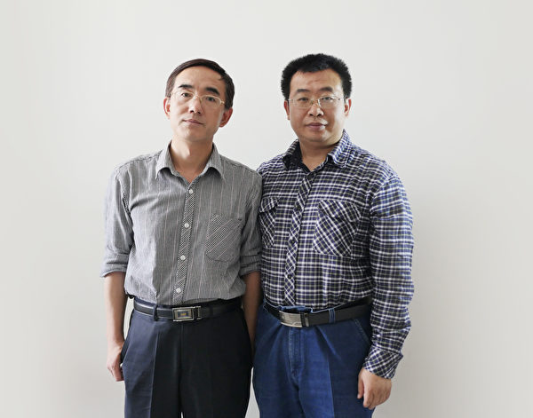

  
 
2016年6月，孙毅与代理律师江天勇合影。（孙毅提供） 
 
  
 
<b> 家已经是最不安全的地方了</b>

45岁的他从马三家回到北京的家，头发和胡子基本都白了，看起来就“像一个小老头”。他从不与妻子说里面的遭遇。妻子关心的是：你后面有没有跟踪？这次回来还能在家里住吗？

对妻子来说，他关在马三家，心是落地的，因为人已经在里面了。而回到家里，只要他不放弃信仰，不肯说假话，就随时会被抓走。一张光盘，一包复印纸，一封信，很小的一件事都可能是“罪证”。家门随时都能被砸开，进门就能抓人，跑都跑不掉。家已经是最不安全的地方了。1999年以后，大部分时间他都是流离失所。不修炼的妻子曾被抓去“洗脑”，多年来，为了避免被株连，妻子在街上与他同行，都一前一后，在任何地方，她都会下意识寻找有没有监控摄像头。

求救信被曝光后，妻子更加恐慌，夜里经常做噩梦，“他们会不会来抓你？”

<b>逃出中国</b>

《美国法典》19章第1,307款规定，禁止进口“‘来自外国罪犯劳动、强迫劳动和（或）契约劳工’的产品”。

中国《lens》杂志报导：“高峰时期，马三家的劳教人员超过五千人，无偿劳动产生出庞大的效益。……（包括那些出口奴工产品在内，）总产值一年近1亿元。”但中共官方始终否认在劳教所和监狱生产加工奴工产品。而2012年被凯斯公开的这封求救信，就成为当时中国劳教罪恶的一个最有力的见证之一，中国劳教制度引起了世界性关注。

2013年11月，在国内外压力下，劳动教养制度被废止，马三家劳教所变成了轻型监狱。

他没有松懈，依然致力于电脑翻墙技术，传播研制可以翻墙、防止监控的手机。在写给凯斯的信中，他写道：

“虽然我自己暂时脱离了地狱最底层的迫害环境，但仍在共产制度的阴影下生活，中共统治下的中国就像一座大劳教所，而劳教所则像是这个大劳教所中的小号。

“虽然相对于劳教所来说，外面的环境好像是有了一些的宽松，但实际上极权专制的摄像头时时刻刻像幽灵一样暗藏在你生活的周围环境、电话背后、网络监察之中。”

2016年4月，警察再次抄家，他再次有家难回。因为不知会在何处借住，他每天随身背着刮胡刀和牙刷。为避免被定位跟踪，他只能在行进的汽车里打开网络与人联系。妻子如果没有收到报平安的信息，就会彻夜难眠。她已经开始憧憬美国的自由了：“在美国就好了，我俩可以手拉手走在大街上。”

2016年11月，他因办理旁听朋友开庭的手续，再次被绑架。几天后妻子被警察通知，把绝食抗议的丈夫接回了家。她已经记不起他被绑架多少次了，几次都是这样被警察通知：“人不行了，你接走吧，我们概不负责。”

妻子再次崩溃，紧张得几乎神经质，她担心窃听，甚至在家里都不让他大声说话。他终于决定尽快逃出中国。

2016年12月6日，在一个雾霾天，他离开了北京，顺利出关后，他居然奢侈地给自己买了一个甜筒来庆贺：“我终于从这个无形的监狱逃出来了！”

2017年2月，他在印度尼西亚接受了海外媒体的采访，终于公开了自己的真实姓名：孙毅，1966年10月9日出生在山西太原，大连理工大学毕业，曾是北京一家公司的工程师。因修炼法轮功，他先后八次被关押在中共的洗脑班、看守所、劳教所等强制场所。

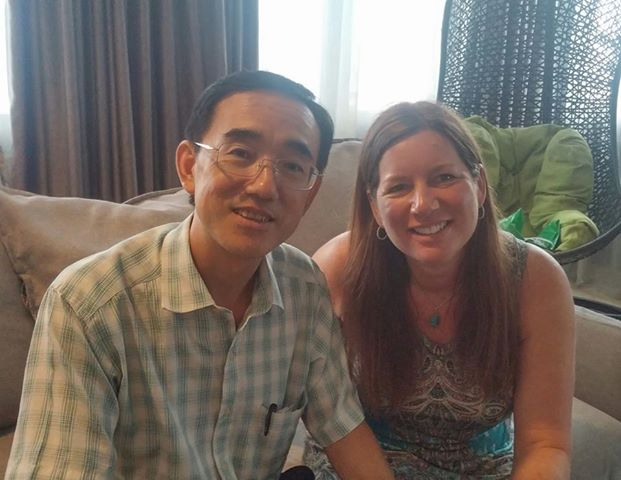

  
 
3月3日，孙毅与凯斯在印尼见面。 
 
  
10月1日晚上，在印尼巴厘岛的医院，孙毅突然离世。那个夜晚，在他的祖国，中共正为自己庆生，大大小小的电视台都在“讴歌伟大的中国梦”。

医院说他死于肾衰竭。孙毅的家人和朋友几经努力，都没能够进行尸检，无法不质疑他的死，认为诸多疑点表明，他被中共渗透在海外的特工暗害。

家人说，“他没有肾脏问题。”而且，家属“没有得到具体通知”，“不知道为什么他的遗体被匆匆火化”。孙毅的朋友回忆，8月还请孙毅校订以他为主人公的一本书，几天后他就突然失忆了，不知发生了什么……

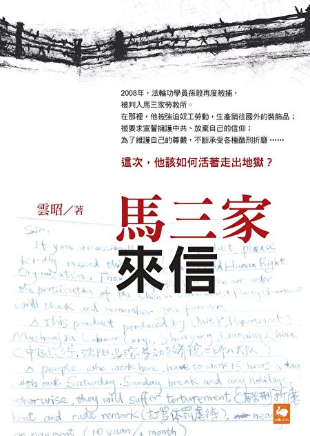

  
 
《马三家来信》书封，白象文化，2017年10月版。（白象文化提供） 
 
  

他的求救信如同漂流瓶，闯过数不清的浪礁险滩，奇迹般穿越了太平洋，但他却没有能像这封信一样，抵达那个自由的国家。

流亡在远离祖国的一个小岛上，没有家，没有亲人的注视，孙毅在中秋节默默离开了这个世界，留下了他的故事。

他五十岁的人生堪称传奇，就像“黑暗里的一道闪电”，他的故事告诉人们，即使深陷于一个发出声音都危险的地狱里，人仍然可以为自己的尊严呼喊；一个血肉之躯，仍然能以无论如何也摧毁不了的信念，守住自己的“道”。他名字里的“毅”，涵义就是：志向坚定而不动摇。@*  #

撰文：云昭，责任编辑：苏明真

  <a href=#list><h6 align="right">回目錄</h6></a>
     
   

  
    
 
 
     
<a name=9><h2>马三家幸存者：认识的10位法轮功学员被迫害死 </a>  </h2>
  

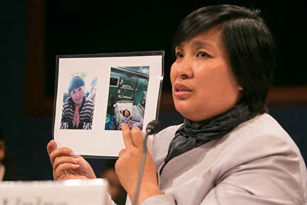

  
 
尹丽萍认识的十位法轮功学员被迫害致死。图为2016年4月14日，尹丽萍在美国国会作证，她手中的照片是沈阳的法轮学员王杰。（李莎／大纪元） 
 
       
  
 【大纪元2018年02月06日讯】我叫尹丽萍，来自中国辽宁。 
  
  在中国，因为信仰，我七次被抓捕，六次被迫害得奄奄一息抬回家，三次被劳教，三次被关押在马三家，经历了九个月的奴隶般的奴工迫害。因为不放弃信仰，我被秘密转押六个劳教所、一个地下监狱医院和一所黑监狱。

在被关押期间，我经历了昼夜被洗脑、体罚、手背被指甲掐，腕下被针扎、关禁闭室被超音倍声音迫害，野蛮窒息性灌食、电棍电击、被禁止见家人，被注射不明药物导致我一度丧失记忆、眼睛暂短失明，被野蛮灌食时把病人吓坏、心脏病人吓得紧急抢救。

九个月的超负荷奴工让我累到吐血，胳膊被铁条划得鲜血直流，我的手指扎花扎得血肉模糊都看不到指纹。

因拒绝穿劳教服装，我被一群男女警察和男犯人扒光衣服，任由男犯人观看。

我的腰骨被警察郭勇打错位，导致我下肢习惯性瘫痪、大小便失禁。头发被警察剪得乱七八糟的同时，造谣说我练功练的得了精神病。

在这十八年的迫害中，我认识的十位法轮功学员被迫害致死：邹桂荣离开我家不到十天被迫害致死；沈阳的王杰死在了我的怀里；我家乡的两位法轮功学员崔振环、李春兰被马三家劳教所迫害得精神失常……

2001年3月中旬，外媒记者进入马三家。在距离外国记者离开后只有一个月的4月19日，我就被马三家秘密转押到了一所黑监狱，被群体性迫害的同时还被录了像。

2001年的9月中旬，我到北京状告多家教养院对我的犯罪行为。北京警察把我移交给当地公安局，公安局把我押送到我状告的劳教所。一星期后，被迫害得奄奄一息抬回家。

2002年10月8日，法轮功学员李伟勋的哥哥李伟继，为了营救我和其他法轮功学员出国办理护照的过程中，被铁岭公安局抓捕，李伟继的胳膊被打折、判刑八年。王杰、蔡绍杰被判刑七年，我被判三年劳教再次送到马三家。七个月后，我被马三家迫害得奄奄一息抬回家。

我还活着，我想控告迫害我的劳教所和警察，可是我们当地没有律师敢为我辩护。

2014年4月20日，黑龙江全省抓捕了八十多位法轮功学员，江天勇、唐吉田、张俊杰、王成四位中国律师勇敢地站了出来关注法轮功案件，我看到了希望。

没有想到，在这些律师高度关注这起群体绑架案件的过程中，这四位律师的肋骨被警察打折24根（唐吉田10根、江天勇8根、王成3根、张俊杰3根）。

同年7月9日，我的电报群里就传来了王宇律师被抓捕的消息。当天晚上，全国范围大抓捕律师和维权人士。我两天两夜没有睡觉，见证这一切的发生。我仅有的一点希望破灭了。

因为全国遭受迫害的法轮功学员都在起诉江泽民，警察就全国范围内抓捕律师、抓捕诉江的法轮功学员。

我家乡的法轮功学员李忠渊因起诉江泽民被判刑七年半，还有两位因起诉江泽民被分别判刑三年和三年半。

法轮功学员在中国被迫害了十八年，至今没有结束。而这场迫害延伸到了海外。

仅2014年至2016年，先后有23位法轮功学员在泰国被抓捕，关押在移民拘留中心和移民监狱，在国际社会的紧急关注和营救下他们才幸免被遣返。

2017年10月1日，逃亡到印尼的中国劳教所奴工产品的证人孙毅离奇死在了印尼。

2017年10月26日，逃亡到俄罗斯的法轮功学员李丹在申请庇护的过程中被抓捕。2018年1月13日被遣返回中国。

更多残酷的迫害还在发生著，我希望全世界更多的人们关注这场残酷的迫害。#

责任编辑：肖琳
  
    
 <a href=#list><h6 align="right">回目錄</h6></a>
     
   

  
      
    
 
     
<a name=8><h2>马三家酷刑受害者：我要站出来说话(4) </a>  </h2>
  

  刘华自述；郑容记录整理 

 

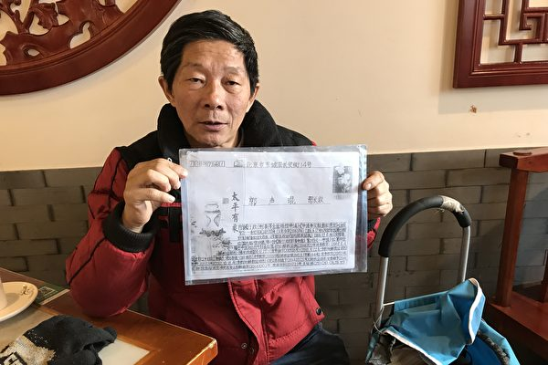

  
 
刘华的丈夫申请了国家赔偿，但目前没有任何回应。（刘华提供）
 
       
 【大纪元2018年08月23日讯】编者按：刘华，一个普通中国农民，曾因上访被关押在马三家劳教所中，期间想尽办法偷偷记下《劳教日记》，后用各种方式包括用女性身体将日记秘密带出，这些高墙内原生态的散乱信息，拼凑出来的内容震惊中外，揭开了劳教所的黑幕一角，成为当年推动劳教制度废除的关键案例之一。 

    （接前文）

<b>八、我是人哪，我长嘴就是说话的，我就是要说</b>

   
   
上访熬了我十六年，太累了，熬你、玩你、耍你！信访口就是哄你、骗你！你去天安门、中南海、久敬庄、马家楼，一圈进去你就出不来，截访的抓你、关你，拿你做生意，倒来倒去的，向地方政府要钱。老百姓就是案板上的一块肉，想剁哪块是哪块，你怎么告哇？最后告的是自己，越告越坐牢，越告越坐牢！

信访局养很多人，省委给他们钱，让他们把上访人申诉登记的材料从网络删光了，删东西不白删，不给他们钱能删吗？他们都肥透了！

现在，截访的也开始贿赂访民了。只要你去上访，他就悄悄塞给你五百块，甚至一千块，让你赶紧回家，给你点小钱儿，就是不让你上访。他给我钱我就攘大道上，我说这点钱你们就想收买我，权利是靠钱能买的吗？剥夺我的权利，还要贿赂我！

他要继续截访，我就打110报警，截访就是犯罪，哪条法律允许截访？打110，我先问是哪个派出所的，再问接警是多少号？他不出警，我就去派出所找，问他：“为什么不出警？截访有理，还是我上访有理？”我把这个过程写下来，然后打公安部纪委电话投诉他。

上访的现在不许进天安门，身份证都被当地公安部记录了信息，被刑拘过的，包括信访的、法轮功、吸毒的，你过去一刷身份证，信息就出来了，不许进！他们说：“你是怎么回事你自己不知道？你是没犯法！但你上访就不让你来这个地方！”

那回我走到天安门，两个武警堵住我，“查证件”。我说：“我也不是罪犯，脑门上也没写我犯法，凭什么查我身份证？你拿出法律依据！”他们说，“那你走吧。”

就这一毛钱的权利，你自己都要去争取，争不争出来是另外一回事，但一定要争取！

有一次我上公安部，警察说上边有“精神”，不让进。我说：“你的‘精神’大，还是《宪法》大？你给我写上，你要说你的‘精神’大，《宪法》咱不要了。”他说：“你们搞串联。”我说：“嗨！文革词上来了，你还想当红卫兵造反派？谁串联？俺手里拿着诉状，有理有据，你那小嘴一张就‘串联’哪？你嘴大还是法大呀？”他说，你不要参与政治。我说：“老百姓不存在政治，老百姓就是要公民的权利，独裁国家才说老百姓参与政治，说真话，要公民的权利，就是参与政治了？有这说法吗？你翻翻《宪法》，有没有这条。”他说：“那你不能说政府坏话啊！”我说：“你们80后的小孩，你懂历史吗？你知道共产党都干了什么？你脑袋进水了？人家把你卖了你还帮人家数钱！”他不吱声了。

我上大连参加儿子的婚礼，地方政府把我绑架了，还造成我心脏病突发，躺在沈阳火车站站台上，躺了两个半小时，然后一帮人不穿警服不带警官证的，没有任何法律依据，就强行抬着我送进了苏家屯办案中心。

警察说：“两个月你不参加集体上访行吗？”我说：“我凭什么呀？”他说，“你要是不上访，我们陆续给你钱。”我说：“我不要钱，我就让他们都进监狱。”他说：“你配合点，然后我们动车给你送回去。”我说：“我为什么要配合你？我配合你就是纵容你，我愿意跟你走，是我愿意，我不愿意跟你走，就是你绑架！”

他们把我抬到车上，我就站起来，跟周围旅客讲，讲马三家劳教所的邪恶，怎么样抓女人白干活，而且还做武警服装！跟着我的所长不让我说：“你嘴上积点德好不好啊！”我大声说：“哎！所有的旅客大家听着，他还叫我积德，上国家信访局绑架回去就劳教，劳教出来还不让告，告了还要强行配合他，所谓的积德就是配合你，让你随便强奸我的权利呗？这就是积德呗？你家女人是女人，别人家女人就随便绑架去当劳工，这就是你们共产主义的积德？”我告诉大家：“你们把手机打开，百度搜：马三家刘华，你们看看我讲的劳教所是不是人间地狱？那《新闻联播》都是假的，天天说共产党好，全是假的，咱就是最好的一个见证，这个国家是靠欺骗来维持的！”我问车上的旅客：你们谁是公民？你们谁有选票？从国家领导人到一个村的村长，谁选过？你们告诉我！”

有几个女的说，“哎呀妈呀！大姐，我真爱听你讲，讲得真是太好了，可是我到站了。”车上的小孩也都拿手机给我拍照！

警察抓我时还说，“你给国家造成负面影响，你向着法轮功说话。”我不怕，在微信群里我讲马三家、讲良心犯，他们就问我是不是法轮功？我就说，“法轮功确实不错，只是我没学进去。但在马三家我和她们一起生活，我知道。”他们说，“哎呦！以前就说法轮功是瞎说，现在你一讲，真有这么一个鬼地方！”我的微信号被封了好几个了。我老上外媒，天天转发，我不怕，我是人哪，我长嘴就是说话的，我就是要说。

<b>九、因为我们上访，他们剥夺我们在北京的生存权</b>

就因为我们上访，他们剥夺我们在北京的生存权。2013年到2015年，我们在北京买过六辆电动车想拉脚谋生，都被丰台警察带着交警抢走了，他们以各种理由抢，我丈夫是残疾人，残联下函让他们还车都不还！

2016年他们还把我身份证扣了，狗有狗证，猫有猫证，死人有死人证，就我没证？！这是什么国家呀？你所有的权利，包括你从生到死，包括你住到吃，都是掌握在它的手心里，它想怎么攥你就怎么攥你，活在中国真是一种悲哀。这十几年来，我们夫妻连个低保都没有，我们得活下去啊。

上次我和我丈夫给北京大兴百荣的一个饭馆做早点，就因为我们是上访的，警察让老板辞退我们。老板30多岁，他说：“我是老板，我让你走你就得走。”他手指着我：“你去告去！”我说：“好，冲你这句话，我就得去告你。你缺乏教养，做人都不会，你跟谁比比划划的？”完事我丈夫就给监察大队写信，举报他“三证”无有，占地证没有，工商、税务、卫生、食品证全都没有，不光他没有，整个百荣那地方都没有。

两个月后，这老板开车找到俺家，说：“百荣历来就是这么干的，十年没人敢告，昨天监察大队来查证，你把百荣整的震动了。”他就问我要赔多少钱，我让他按照《劳动法》给，他不同意，威胁我：“你家老人要注意安全！”我说，“你干啥？要恐吓我呀？你刚才说百荣这么干了十几年，从来就是这样干的，我全做录音了，这就是律师取证的证据！我也没有犯错，你说解雇我就解雇我，那还要《劳动法》干嘛？你没有‘三证’，我要求你停业整顿怎么了？”他傻了：“啊，我在百荣干了十多年，在北京还没遇到过你这样式的。”我告诉他：“我讲的是道理，你不懂法，你是法盲，我不是法盲，我要维护我的合法权利！”

我说，你别看我穷，给人打工，但是我有良知、有尊严！后来那个小孩就差给我下跪了：“大姨，我错了，您说的对，应该提前一个月告诉您。”接着他们就给了我补偿。

后来我在一个养老院又找了个活，开“十九”大，老板又辞退了我，说我干活不好。我让他把我不好的证据拿出来，他拿不出，说：“公安局说让你走，你要是不走，他们就过来治安整治就把你请走。”“那我就等著，等着他们来抓我。”他说，“别呀大姐，您不怕，我怕呀！我挺佩服您，我就雇一个做饭的，哪知道还有案底。”“是谁的案底？是共产党的案底，不是我的案底，你听明白，我没有错！”我就讲马三家、讲法轮功。我说，“我一个家庭主妇、一个农村老太太，我有什么错？一抓就抓多少年，我在马三家吃不上喝不上，连卫生纸都没有，就搞布当卫生巾，搞布擦屁股，我过的什么生活呀？我不说给你听，你知道人间还有这么个地狱吗？”他掉眼泪了，“哎呀妈呀！我就找个做饭的，没想到找了您这么个大人物来！”我告诉他，别觉著挣钱了，你就有安全感了，在中国没有法治谁也没有安全感，挣钱多共产党说抢就抢了你。

我没有为难他，如果我不离开，他就要受影响，他也不容易，恶是恶在这个邪党，也不是恶在人家身上。

我上儿媳妇家，亲家母和我说：“俺闺女竞报喜不报忧，哪知道你家还有这么大事呀？要是知道有这么大的事，俺闺女就不能给你家。”我说，“怎的？我也没有偷、没有抢，也没接客，凭什么不给俺家呀？还是我儿子好，我儿子不好你闺女也不干。”我那亲家母就掉眼泪了，“我闺女多亏呀！连正经的婚礼都没有，婚纱都没有穿。”我说，“你不能那么自私，我救人了，你们干啥了？你还信耶稣呢！你是真正修炼吗？耶稣为了救人，拿身体去救人，最后他成了神，你们是没有寄托，把希望和寄托都给神，让神来承受，替你们承担，你如果真心信神，就要改变你的性格，积德做好事啊！”让我这一说，亲家母又掉眼泪了，“我知道了，我得好好祷告，让我下边的姐妹都祷告，在困难面前让主来恩赐你。”

<b>十、我为自己维权，老天就不会饿死我</b>

作为一个中国农民，土地被抢了，如果不像我这样坚持，也许命运不会像我这样吧，但你抢我地，你凭什么抢我地？你是人，我也是人，凭什么你享受人的待遇，对我像对动物一样？

我上访十六年，就感觉对着一群流氓讲道理。做梦都没想到，我们夫妻为整个村老百姓争取合法权利，为这点土地，去维权、去举报、去上访，却一直遭受打击报复！我就告一个大队书记，让他别卖地，他就故意陷害我丈夫，还把我打了两次，派出所不依法办案，还把法医鉴定给改了！而且，我和我丈夫八次被刑拘，我自己三次劳教四年，我丈夫两次劳教三年。我们的身体都被他们整垮了，现在一身病。

我们这一左一右的地方，都没土地了，唯一就我们张良堡有，就因为我们上访维权，土地都给老百姓保护下来了。现在别人家都装修得亮堂的，跟楼房一样，我们家就剩个空壳，房顶上的棚都掉下来了，地让老鼠钻的都是洞，老不在家住哇。

但是，2012年7月，后来经过我们告，张良堡村委会的17个干部终于都被罢免，整个村委会解散了。

我想，我儿子、儿媳妇都很好，这就是神给的。我为自己维权，老天就不会饿死我。我就是过穷日子，我也不怕，我没钱，一年到头我都不买菜，我可以去拣菜，一到新发地（菜市场），眼睛就像贼似的，专找倒垃圾的地方，拣，土豆、白菜、豆角、倭瓜，还有西瓜，都拣过，捡回来我削吧削吧，一样吃。我穿着别人给的衣服，人家不要的鞋，我也捡来穿，都挺好的。

谁都不站出来，这国家还有正义吗？我要站出来说话，人人都起来抗争，那这体制就完蛋了，就会解体。

我也很庆幸能到北京来，要不是上访我怎么能认识这么多的人，我认识的很多都是精英。2005年我见过高智晟，他为我呼吁过，那人才好哇。王宇律师我挺熟的，一起吃过饭，她人特朴素、特实在，在维权律师里面，王宇出类拔萃。王全璋也跟我认识，王全璋厚道、耿直，说话直截了当，没有废话。我和他们学到了坚强，听他们说话，就像一个指明灯一样，照亮了路程。

我丈夫还老是抱着希望，有一段时间天天出去邮信，告公务员违法程序，要求信息公开。2016年2月，公安部给了他回复，确定了他投诉上告的十几家单位，包括辽宁省公安厅、司法厅、马三家劳教所等，对我们有侵权违法行为，依照国家法律，他申请了对我们夫妇俩人的国家赔偿，但目前没有任何回应。（全文完）

责任编辑：李天琦   
     
   
 <a href=#list><h6 align="right">回目錄</h6></a>
     
   

  
       
   
 
     
<a name=7><h2>马三家酷刑受害者：我要站出来说话(3) </a>  </h2>
  

  刘华自述；郑容记录整理 

 

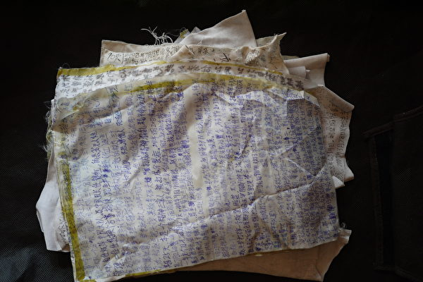

  
 
用身体带出的劳教日记。（刘华提供）
 
       
   
  【大纪元2018年08月23日讯】编者按：刘华，一个普通中国农民，曾因上访被关押在马三家劳教所中，期间想尽办法偷偷记下《劳教日记》，后用各种方式包括用女性身体将日记秘密带出，这些高墙内原生态的散乱信息，拼凑出来的内容震惊中外，揭开了劳教所的黑幕一角，成为当年推动劳教制度废除的关键案例之一。 

    （接前文）

<b>六、三次劳教</b>

  2006年2月20号，俺和我家那位刚从厕所出来，头就被头套套住了，警察背着胳膊就把俺俩塞进警车，弄进了右安门派出所地下室。又拍照、又拍桌子，吓得我躺地上就开始抽。心脏缺氧，从晚上8点一直抢救我到下半夜2点。

第二天我们当地派出所就来车了，市里还来了一个便衣，把我俩拉回沈阳，审了一天一宿，说我们“反党反社会主义，危害国家安全”。警察说：“你俩就别告了，承认你们错了，我们就不往看守所里送。”我俩也没有错呀，我一农民，一无枪、二无炮，我拿什么反党？送就送！结果我丈夫教养一年半，我给教养一年。

因为孩子小，我是管外教养。我就在外面当保姆、在饭店给人打工，我精神没有垮，我没有错，怎么苦，我都要坚强地活下去！

我丈夫蹲了一年半，他回来我就继续上北京国家信访局，继续举报。

2009年8月5号，我进信访局领表，到二楼202接待室，接待的人看到我，就拿手机发短信，通知外面截访的。结果我下楼刚出大门，就看见一个人带四个截访的上来了，架住我胳膊说：“我们是沈阳维稳工作组的。”手一背，我又被塞进车，押到白纸坊桥附近的一个酒店地下室，把我看住了。

我马上给国际人权组织打电话，告诉几点抓的我、现在我在什么方位。我还报110。110来了，我说：“他们非法绑架我。这是沈阳驻京办的黑监狱，我没有犯错，我上国家信访局上访有什么错？这是我的权利。”当时驻京办事处维稳工作组的组长叫张良，他对110警察说：“没事呀，我们回家给她解决问题。”谈了挺长时间，他把警察给支走了。

我被送回老家，直接拉进分局大院，不到10分钟，就被关进派出所，他们说，“你上了大纪元网站，你就是反党！”说了没两句，弄个手续就把我关进了马三家，我被劳动教养十个月，罪名是“扰乱社会秩序”。

2010年的5月我被放出来，上访的问题不解决，怎么在家待呀，我又去了北京。

2010年12月3日，我在北京地安门地铁站乘车，因身上只有五毛钱，就告诉地铁保安说我是上访的，因为当时是敏感时期（4号法制日，10号人权日），保安就通知了地铁警察，我身上带的上访材料被警察发现后，他们马上通知了苏家屯区分局，为稳定地方政绩，苏家屯红菱镇派出所把我送进了沈阳的棋盘山信访稳定分流调处中心。

我一看这不就是黑监狱吗？棋盘山老大一个平房，有个像马三家那样的大院，里头的设备、吃的、用的、整个和教养院一样一样的，床单都一样！我想办法偷偷跑出去，买了个充电器，把手机充上电，把里面的什么“维稳调处中心”、什么“为党解忧、为民解难”的牌子都拍了照！上网我就发给了国际人权观察员，连“陪护证”都叫我给照下发过去了。

两个女村民，戴个“陪护证”给我“陪护”，是我们村书记找的。我说我不是病号，陪什么护哇，她们就是监控我，再加上公安、保安，他们十一个人看着我一个！“陪护”的村民，村里给每人一天发100元钱，红菱镇政府每天还要向棋盘山交600元钱。

他们说：“刘华你比演员还牛呀，政府一天花二千多块钱雇这么多人看着你。”我说：“我没有任何违法行为，你们拿我整事，拿我挣钱了！”他们五天五夜不让我睡觉，折磨得受不了哇，就跟熬油似的，心觉得都熬干了。

那雪下得老厚了，屋里没有暖气，冰窖似的。看我的警察在门卫屋里睡觉，都插著电褥子。我冷，哆嗦呀，冻得我拉肚子，血压也上来了，量一回血压就50元，一宿到天亮，光量血压就花了500，也不给看病。我看也没的活了，到了晚上，我把衣服脱吧脱吧，弄了一个大条子围脖挂上暖气管，上吊。我死在这里，我要让全世界都知道！挂上后，我一蹬凳子，“哐”一声，“陪护”听到了，“哎呀妈呀”，就把我抱下来了，说“你要是上吊死了，我们全白忙活了”。他们说2008年有个男访民，就在我站的这个暖气管子上，上吊吊死了。这不是小鬼催的吗？我怎么也挂在这里了！

第二天他们赶紧把我送到看守所，看守所医生对警察说：10分钟一扒拉她！别让她死这里！她高压180、低压70，压差太大了，随时会死！关了十几天他们把我放了。

放了我就去北京公安部告他们，结果又把我给抓了，说我“扰乱社会秩序”，第二天又给送回沈阳，苏家屯分局又圈了我五天，三班有人看着我，不让我睡觉，我两腿水肿，双眼发直，心脏犯病了，送去抢救后弄回了看所守。

警察问我，“你是不是把棋盘山上网曝光了？”我说：“曝光你咋的呀？我说错了吗？你们是叫我上那学习法律吗？你们十几个人看着我一个人！那不就是黑监狱吗？”警察说，“只要你写保证，不告苏家屯公安局，保证不进京上访，就给你送家去，你两口子给低保。你再告公安局还劳教你，而且你丈夫也抓回来劳教！”我没有答应，又被劳教二年，我丈夫被劳教一年半。

2011年的1月，我又第二次给关进了马三家劳教所。

<b>七、在劳教所写劳教日记</b>

进了马三家劳教所，我就开始观察，我告诉自己：你记住，你什么都给我记住！

被关进马三家两次，我都记得特别清楚，有多少上访的、有多少法轮功、谁做多少活、谁谁谁挨打了、谁谁打人、怎么打的、谁花钱买减期、谁谁收贿赂，警察都是有名有姓的，连队长的警号、电话号码都记下了。劳教所干什么活？一个月多少产量？几点几点都干什么了。在劳教所里，只要你让我活着，我就天天写日记，每天吃什么饭、什么菜，鸭蛋卖2块钱一个，火腿肠10块钱，12个饺子15块钱等等，一天一天的，我收集，我都记下。 
   

  
 
用身体带出的劳教日记。（刘华提供）
 
   
第二次到马三家，第二天她们就让我下车间，那时我走路要两个人搀著，管教说，“你不认罪，就必须完成双倍生产定额。”每天我都要干四道工序，累得心脏抖搐，完不成定额就是一顿拳打脚踢。

我们做军队的武警服装，武警大衣什么的，消防队救火时穿的金黄色防火服，也是我们做的，那时一天要做240套，累死了，2009年到2010年那一套衣服就卖八百多（人民币）。

我们还做韩国的衬衣、汗衫，做了三万多。做了十万件出口意大利的鸭绒棉袄，生产商是捷克。鸭绒大衣的内胆，一天要做260件，装羽绒的时候，大热天不让开电扇，电扇一开，满屋子飞毛，活就干不了了。空气中的毛毛全吸到肺里去，眼睛感染，整个烂了。身上都是毛，裤衩里往外一拽都是毛。电机（缝纫机是由电机带动的）一天天地不停转，那个机器跑得快呀，刷刷的，缝纫针都是红的，都冒蓝烟，手碰到缝纫机的针，马上就一个大水泡。每天刷刷地干，劳教所挣老钱了。我们一天要工作10个小时甚至11个小时，完不成任务就加班。还干不完就是加期、体罚，晚上回来，体罚到半夜。

当时做军队大衣的，有个人叫王淑凤，本来是要解教了，但是她做的那道工序，没人能接替，劳教所就给她加期两个月，直到这批活全部干完才放她回家。王淑凤说，这么多人干活咋就差我一个？你们一个月给我开多少工资？牢头狱霸就把她脑袋放案板上，拿拳头打，后来六个队长又把她吊起来上大挂，那脸都被电棍过糊了，全是黑嘎巴。人也给打傻了，见警察她就哆嗦，后来只要看见穿黑衣服的，她就哆嗦；看见别人买的东西她就抢，都打成精神病了。

还有一位冯媛媛，因为盗窃二进宫了，才22岁。一回洗澡，我看她肚皮动弹，跟锅似的，锛亮。我就问她：“你还来例假吗？”她说七个月没来了，哎呀妈呀！这不怀孕了嘛！她穿的劳教运动服肥肥大大的，看不出来。

第二天从医院检查完了，劳教所直接就把她放了。怀孕那下黑还加班，还让她站岗，受那苦哇！她自己都不知道怀孕！进来时也没给她验尿，等她干活啊，两年前她在马三家待过，做的是军队迷彩服，她走以后，这活别人接就接不下来了，她那个活儿就是上大边，军服门襟的边。那孩子家里穷没钱，我有时给她点吃的用的，她们说我，一个小偷你搭理她干啥，唉，一个孩子，多可怜！别人谁给我的肥皂、洗衣粉我都攒著，都给她们穷人。

还有一个小偷，一点小事队长就打她，把面条倒地上，用脚踩吧踩吧，她抓起来就吃，用水龙头打她，尿包子都给踢碎了，盆腔出血，尿的都是血。

受苦最多的是法轮功，法轮功受的苦超过我们访民。

我两次在里面见过的法轮功学员加一起有六七百人吧，那时劳教所法轮功最多。我在那会儿，劳教所四百多人，法轮功就占了二百多。为了让她们做奴工，警察花钱分批买外地的法轮功劳教人员。第一批送进来50多法轮功，2008年3月18号抓的，第二批是“六四”抓的，60多人。我搜集了六批，包括法轮功的经历，后来我把这用匿名的方式给了国际人权组织。

我记法轮功的人数。2009年我数过，一大队、二大队，72个法轮功干活。三楼那层是210～220个人。每天上食堂吃饭，我们先吃完了，法轮功下去二楼站着，我就开始数，一个个数，一共有多少人，有多少人上食堂，经常后面的有那么十来个人，从她们走路的姿势看，是被上“大挂”了，因为上完“大挂”手都弯曲著，走路东歪西扭的，拉拉胯嘛。我一直在观察，下了很多功夫。法轮功穿黑色劳教服，包括她们穿的棉袄、戴的商标，我全记。

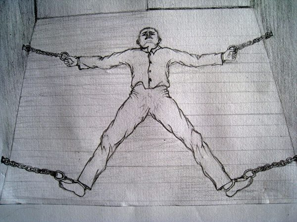

  
 
中共酷刑示意图：上大挂（明慧网）
 
   

法轮功学员顾新华做武警大衣，她的工序是上大衣胳肢窝里的透气圆，她干活时我给她画边，每天她做220件大衣，我就给她画440个圆。本来她劳教期满应该回家，车间那不是流水线干活嘛，她走了这个活就没人干了，队里培训了好几个，谁也拿不下这个活，队长就找个茬儿，说顾新华晚上写“心得体会”，叫人把她眼睛都给她打绿了，又加期两个月，继续干活，这批活结束才让她回家。

法轮功学员辛淑华，本溪人，原来得了肠癌，癌细胞扩散，人不行了，学大法病好了，所以她也为法轮功上访。警察电棍过她，她就发正念，结果那电棍把警察打倒好几回，后来警察说：“老辛你是上帝，服了你了！”从那开始，也不打老辛了。老辛天天炼功，盘腿发正念，一点活也不干，大法真厉害！我有手纸就给她一点，警察不许她有手纸，老辛只能洗一块小布当手纸反复用。我和刘霞也长期都用一块布当卫生巾用。

刘霞也是法轮功学员，写“心得体会”时说了真话，队长就把刘霞带走了。我就问大队长：“刘霞哪去了？”“你问这干哈呀？”她们把刘霞抓到东岗上大挂，挂了一天一宿。

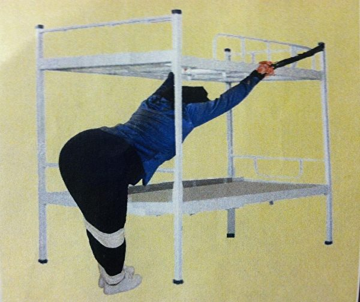

  
 
马三家教养院警察给法轮功学员上酷刑“上大挂”的演示图。（明慧网）
 
   
   我和法轮功学员苏南床挨床，苏南在四川监狱待了五年，出来在北京继续炼法轮功，又给关进了马三家。不到40的她像70岁老太太，例假折磨得都没有了，手一沾凉水，脸“唰”全白，一点血色都没有。每天我都多要一点热水给她。她挨着我干活，安排她递料，那活安排得满满的，哎呀！给苏南累得非常瘦，就像小鸡子那样，抖落抖落的。

法轮功学员王金凤的牙被她们用鞋底子抽掉了4颗，我告诉她应该把牙拿出去，那是最好的证据，后来她手纸一包就拿出去了。

我两次被关进马三家，都从里面带出了我写的《劳教日记》。有笔才能写啊，但笔在马三家是违禁品。一些好心人、法轮功学员我给点鸭蛋什么的，我就给管我们的“大四防”（由警察任命管理劳教人员的劳教人员），让她们给我偷圆珠笔芯，光笔芯我就用了一百多根，这些笔也不怎么好使，写字黑乎乎，平时还要仔细偷偷藏在鞋、衣服里。

下黑（晚上）我就蒙个被子，偷偷露个小缝，窝著在里面写，问起来就说是肚子痛。在车间我也偷偷写，有一次写东西被警察看见了，我赶紧卷起来，一下吞肚子里了。写完了先藏起来，塞进衣服案板的小缝里，或者缝纫机空心腿里，棉袄、裤衩里也塞。

后来因为纸张带不出劳教所了，我就用布写，衬裤或T恤绞下来的布，薄，稀软，还有做内胆的防雨布下脚料，一笔一笔写上去。第一批带出来时管理松，还可以把纸和布藏棉被、棉袄里，后来写字的布就只能从阴道带出来了，搁橡胶手套卷跟紧跟紧的，用手指慢慢弄进去。这是十几人的心血，我自己带出两批，还有上访的，还有法轮功学员，还有普教，都帮我带过，我说你们一定要把这东西捎出去，这不是我自己的事情，这是大家伙的事情，带出来她们再交给我。
   
 

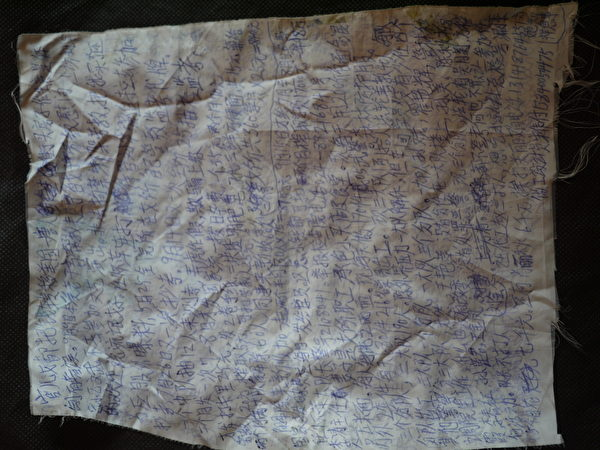

  
 
用身体带出的劳教日记。（刘华提供）
 
     
   开始阴道、肛门还不搜，后期阴道、肛门都搜，警察戴手套进去掏，她们专门掏卖淫的，她们哪敢掏上访的，那不等挨告哇。

在劳教所不签考核，就不给减期，签了就说明警察教育得好。不签，警察就拿不着奖金，我一回都不签。二大队大队长对我说：“我工作了这么多年，就算我求你了刘华，你给我画个圆满句号好不好？”我说：“我来不是给你画句号的，你以为我来是给你画句号的？我没犯法，我画就是纵容你，你才是罪犯，我凭什么给你画句号？”

2012年9月，司法局来人检查，我给他们翻出1991年司法部16号令，那是我在车间内干活时，从废纸蒌里拣到的，其中规定，不准虐待、体罚劳教学员；不准超负荷劳动；不准对劳教学员滥用刑具；不准关小号、关禁闭；不准收押丧失劳动能力的人；不能收押患有重大疾病如心脏病等的；不准收押聋哑人、孕妇等，但马三家劳教所全部违反啊，我就给揭发出来了。

上面一来检查，食堂就把菜谱牌子挂上，又是肉又是菜，搭配得可好了，参观的人一走就摘牌子。那会儿饿得哆嗦，抖哇，早上才9点半，腿就软了，什么也拿不起来，没劲，脚踩下去就像踩棉花球似的！到厕所偷吃点馒头才有些力气。

平时吃的馒头像是巧克力做的，黑一道，黄一道，陈苞米面，里面都发霉了，粉的啦的。2011年，我偷出了几个食堂的馒头，让马三家出来的人带出去了，拿到北京，我给她们一个电话，找人发网上去了。上网以后，我们就开始吃白面馒头了。

我关在里面，劳教所内部的东西就都上网了。我们给广州石狮做了三万件服装，做到四千件的时候，我就把消息捅出去了，我把商标缝在裤头里面，让人带出去，给捎信的一个电话号码，让她出去找谁谁，上网给报出去了。

我偷劳教所里的照片，一张张偷出来，卷在棉袄里捎出来。

我偷车间的生产表格、入库单，两万合同写的武警棉衣，可以清楚看到一天交多少件。我知道这是最好的证据。

商标也是最好的证据。我偷商标，拆开装被的大行李袋，把商标挤在边沿上，再用布遮上。带回家后我再带到北京，那时劳教所的被子还让往家带呢。

第一回偷的商标上网后，2010年我再进去，她们就不让我下打包间了，这下商标就偷不出来了。四个警察看着我，对“大四访”说：“看着她，第一别让她偷商标，第二别让她下打包间，上打包间（产品）往哪送，她都知道。”

50块钱一套的劳教服，我也穿回来了。警察开始不让带，我说，“抓我白干两三年活，我自己花钱买的衣服，我就得带走。”法轮功学员穿的黑色劳教服，我也带出了一套。我带出三套：一大队红的、二大队蓝的、三大队黑的。（待续）#

责任编辑：李天琦
      
<a href=#list><h6 align="right">回目錄</h6></a>
     
   

  
     
   
 
     
<a name=6><h2>马三家酷刑受害者：我要站出来说话(2) </a>  </h2>
  

  刘华自述；郑容记录整理 

 

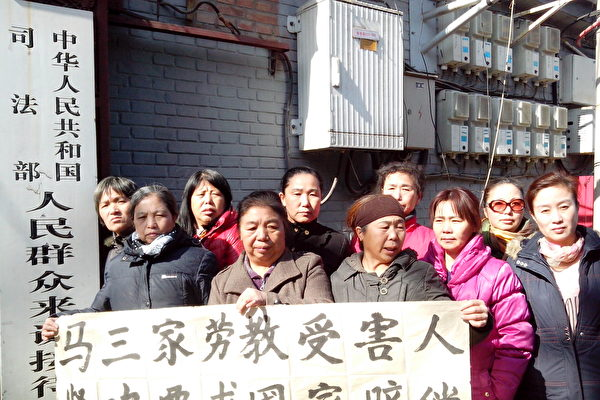

  
 
刘华和马三家劳教所受害人在司法部门前拉横幅。（本人提供）
 
    
  【大纪元2018年08月21日讯】编者按：刘华，一个普通中国农民，曾因上访被关押在马三家劳教所中，期间想尽办法偷偷记下《劳教日记》，后用各种方式包括用女性身体将日记秘密带出，这些高墙内原生态的散乱信息，拼凑出来的内容震惊中外，揭开了劳教所的黑幕一角，成为当年推动劳教制度废除的关键案例之一。

   （接前文）

<b>三、住桥洞太有趣了！</b>
   

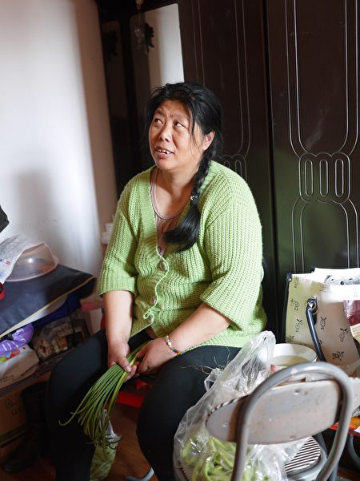

  
 
说起住桥洞子，刘华很兴奋。（本人提供）
 
       
   
   刚到北京上访住旅馆要20块钱，还能住得起，来来走走20块钱就觉得贵了，半年以后就住10块钱店，再半年以后就住3块钱店，后来3块钱的也住不起了。2003年8月，我背上家里的被褥坐火车到了北京，就住进了陶然亭大厦下的桥洞子。

住桥洞不花钱，省下3块钱够吃饭了。我住桥洞时孩子正在天津上大学。

住桥洞太有趣了！我拣了三个旧门板，钉了个床，把拣的碎海绵用针缝缝，再用碎布缝个单子包上，成了一个大床垫，又弄个大三叶板搭个小蒙古包，前面我还搁两个小窗，搁铁丝勒上，弄个小门，还弄个锁头鼻子。早上出去上访我就把它锁上。

一个姓张的新疆老头、广东韶关老朱俩口子，还有一个韶关的，共五个住我的床垫，韶关那女的挨着我，她家男的挨着她。桥洞里面人多了就热乎，一个挤一个，一个桥洞能住二百多人。一早上我就喊：“上班了！上班了！”喊上班就是上访。一天上访下来，累得傻子一样，躺那儿囫囵著就睡着了。下雪时，风飕飕的，下黑去撒尿，找个下水窟窿眼，蹲下就尿，完事都提不上裤子，因为手一时都暖和不过来。早上风一刮都熏鼻子，可骚了，味可大了。

我们洗脸、洗衣服，都从桥洞上的公共厕所弄水。喝厕所里的大凉水，还得跟看厕所的说好话。想喝热水就上老南站打。

韶关老朱跟我说：“大姐我们住你这个床，就省钱了，你也别花钱买菜买米了，我们买回来，你就烧饭、烧菜给我们吃就行了。”我就给他们烧饭。

我到收垃圾的地方用一块钱买个大勺，用三块小砖支起来，烧捡来的劈柴。有时到北京接济站领馒头，回来拿雪糕棍把馒头切开，沾点油，馒头炸得焦黄，他们爱吃。还熬粥，有时打个鸡蛋炒韭菜，要不黄瓜拌小咸菜，还做过鸡肉炖蘑菇，我还在桥洞里包过饺子呢，谁都说我会过日子。

冻得睡不着，我就坐在桥灯底下织毛衣，我织了两件毛衣，还是细线的。

在桥洞那会儿，我们村老百姓来了一百多人看我，都哭了。最大的老人85岁，儿女不让老人来，老人骗儿女“去上澡堂子洗澡”就跑来了，还有6岁的小孩，跟到北京来上访，为我抱打不平。一百多人分四批，我领他们先去中纪委、国家信访局一帮人，农业部、公安部一帮人，上天安门去一帮人、中南海去一帮人。然后我给他们买好面包、饮料，就给他们送进地铁，一天全在地下坐地铁咣当，坐到晚上几点他们才回来。截访的在地皮上找一天，溜死他们了，也没找到人。晚上，他们就2、3块一晚上，睡上访村。在北京待了一个礼拜，回家我们村的地就要回来了。

2004年2月17号，我和村民又到北京上访，举报村干部贪污水电费及书记对我打击报复的事。区里派出所来了两个公安，说给我回去解决，坐公安车我就从北京回到区里。他们先拿录音机给我录音，拿摄像机拍摄，让我举报村里的贪腐现象，我还讲了书记与公安权钱交易的事。说完了，六个公安把我按倒就送进了看守所，关了我22天。我们村小辈都说：“凭什么拘留我二婶，我二婶那么好的人，为整个村村民维权！”

以前村里一度电1块，一年浇一亩水稻的水电费就是200块，丈夫当村长时，一亩地才50多块钱，村民都拥护他。2004年4月，村委会换届选举，书记刘家安主持，连苏家屯组织部都出面了，用公款贿赂村民，还用威胁、恫吓和伪造选票等手段，让一个有犯罪前科的人当上了村长，连死人都有选票，把我丈夫弄下去了。

我们将他们暗箱操作选举的情况上诉到省里，无果。人家拿钱送礼呀，贪污公款的书记照样当书记，风风光光的一点事都没有，从村里被保护到省里。我们只好继续到北京上访。

<b>四、我开了个访民小旅馆</b>
   
   

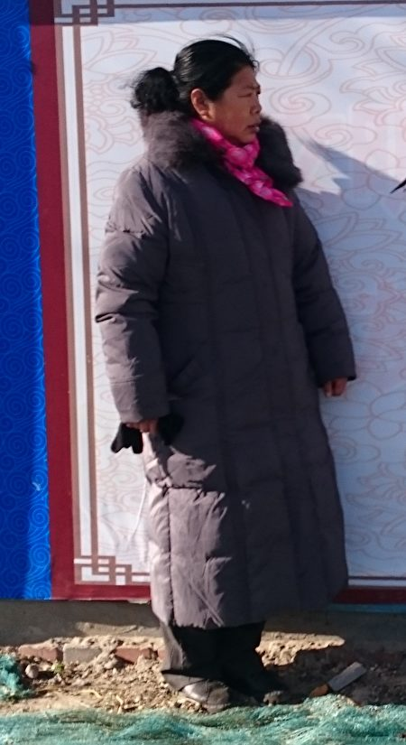

  
 
为村民维权的刘华（本人提供）
 
     
   
   开始上访的大多住北京丰台上访村，一个小屋三十多人，里面三层睡铺，第一层铺5块钱，第二层3块钱，最没有钱的，就钻到床底下贴地皮睡，1块钱，躺底下没有空气，夏天闷热闷热的。那屋里老脏老脏的，一股味，都是捡的破被子，直往外跑棉花。还在里面做饭呢，捡木头条烧火做饭，平时糊里八涂地拣点菜，上新发地农贸市场拣猪皮、鸡肠子，拣人家扔的肥油，再上久敬庄、马家楼要点馒头，也对付了。

后来我在北京南站铁路公寓里头开了个旅馆。一方面为了谋生，一方面也给访民提供方便。

我接待的访民也有上万了。那时家里每天都满满的，好几次回家我都没地方睡，床都卖给上访的了。访民说：“我就愿意在你家，在你家有保证，他们来抓，你能护着，上别人家他们都可能会把我们卖了，在你家不会卖俺们。”

看到谁揭发他们、抓他们，我就偷偷抢过来，掩到我家小旅馆。截访的来，我就说：“你们在北京横行霸道，想抓谁抓谁，就像抓猪似的，把人按倒，回去就给圈起来，多没有人性？为了挣点钱，你说你们干了多少损事？你要到这里截人，站着进来，躺着出去！你敢进来就行。”截访的就瞅着我，不敢。

我家可好了，上下两张床，四张大床睡十六个人，加上那边的床，正好就睡二十人。底下铺是女的，上头铺是男的。谁也不打架、不吵，到家就睡觉。我对他们说：“谁也不能大声说话，大声说话影响人家是吧？要说的话，就上大街树下面唠去。”

访民来了就要等一两个月，就住我这，住别的地方贵啊。他们说：“刘姐，今天不想去上访了，我去买点鱼，一会您给我们炖鱼。”那我就给他们炖鱼。也挺可怜的，在外面饥一顿饱一顿的。

2006年黄历新年，上访的都走光了，就剩一个四川小媳妇，不到1.5米的小个，领三个孩子，她自己的两个，还有她哥哥的一个，肚里还怀着一个。她弟弟被杀，哥哥去打官司，把她哥哥抓起来了，她丈夫又接着去打官司，她丈夫也给抓起来了。

我还收留过一个湖北王大妈。她儿子是税务局会计，领导让他造假账，王大妈说：“儿呀，别做，咱不能做，作假账害人。”她儿子就没做，后来他们就给他儿子弄到地下室，灌毒药把他药死了。这王大妈打官司，没钱，家里还有个残疾儿子呢。年三十那天我包饺子给她们吃。

初一，四川小媳妇自己去天安门上访，没想到孩子就生在天安门了，好心人帮她绞了脐带，孩子裹了围脖就抱回来了。她回来也没说，我听见小孩叫，一找，她棉袄里一个小孩！孩子才三斤多。抱回来你说这怎么弄？我去买点小米、买点鸡蛋，大家都吃一些。有人说：“刘华你胆真大，你让她在你家坐月子，人家都犯忌讳。”我说：“那大风大雪的，多可怜。咱也是女人，咱生孩子遇到这情况怎么办？抬头三尺有神灵，心正就得了，不想那么多。”我家成了幼儿园了，她领着三个，又生了一个，四个都放小床上。没办法，我和我家那位说：“你上铺上去吧。”

还收留一个上访的，他上哪住都不要他。第二天早上我给他叠被子，哎呀妈呀！什么黢黑的在被子上乱动？一看：妈呀！虱子！赶紧把被子拿外面扫。后来我说，下黑我给你烧两壶水，你就在厨房那小屋洗洗澡吧。

这个小旅馆给访民一个家的感觉。走投无路的、精神不好的、残疾人、找旅馆找不着的，我都给接我家去了。

<b>五、上访到北京，我就感觉这国家完了</b>

我家出门就是高法，访民天天看那大屏幕排号，上访还要排号，高法那号要一两个月才能排上。我说他们：“你们天天望眼欲穿吧！骗死你们！”那时我就跟他们主张：别上法院，法院和检察院是一家。一审、二审、三审都走完了，没程序了，就逼你去闯，上天安门、上中南海，你去了，当地政府就来了，来拿钱（交钱的意思）。中共上边罚下边，下边政绩受影响，就关你了。你的思想还不觉醒啊，你没看明白这社会呀？还把希望寄托在共产党身上？

上访的现场，人都排得满满的，那队老长了，能有二里路，挤栅栏里像关大笼子一样。每天都有上万人，有多少个部门呀？不是一个部门，很多部门。就是有钱的，上访也会把你上穷了，它老不解决，你老来，老来它老收拾你呀，你不服，你还要来，它再整你！上访的几乎没有成功的。

所有上访人最后付出的是什么？是生命。每天都是用生命抗争，从黑发给你拖到白发，给你从白发拖到全身枯竭，让你自动退出，你不退出就耗着你，它就要你的命。你能耗得起政府哇？最后把你拖死。长期上访的人被害得精神上都承受不了了。现在这么冷了，还有人住在高法附近桥洞子的下水道里，白天撵，下黑回去住，平时上车站、饭店，把人家吃剩下的饺子、米饭捡回去吃，就这样还要上访，大冷天趴在桥边的石头上写诉状！回当地就往死了整他们啊，没有出路啊。

当初我丈夫咽不下这口气，以为离开我们村，上北京就能改变命运。上访到北京，我就感觉这国家完了。你来上访，它去截访，它就是要禁止你说话啊，你要说真话，它就一次次把你关起来！我不把希望寄托它身上，别指望它给你解决问题。傻子都应该看清了，可惜现在大伙都不觉醒，被洗脑了。

到北京我就接触媒体。我一直走媒体，随时拿手机拍照上网，给它曝光，我不怕，这体制就是老百姓给它惯的。我走的媒体多了，我和家里的访民说，礼拜天就别瞎跑了，在家待着。待着也是这个媒体、那个媒体打电话，有大纪元、自由亚洲电台、美国之音、《纽约时报》、《华尔街日报》、《华盛顿邮报》什么的。

我领着马三家十几个人上司法部打横幅，司法部门口全是监控，我不怕。拉完横幅我就写材料，写完材料填完表，我把我们的身份证一个个摆在材料上，拍照、上网。你们登记不登记无所谓，我自己上网，它就受不了了。他们说：“刘华来上访就是走形式，上网是真的。”（待续）#

责任编辑：李天琦
   
<a href=#list><h6 align="right">回目錄</h6></a>
     
   

  
     
   
    
 
  
<a name=5><h2>马三家酷刑受害者：我要站出来说话(1) </a>  </h2> 

  刘华自述；郑容记录整理 

 

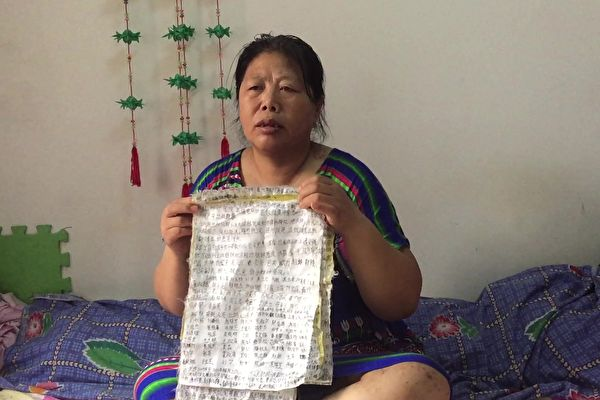

  
 
刘华写的劳教日记（本人提供）
 
     

【大纪元2018年08月19日讯】编者按：刘华，一个普通中国农民，曾因上访被关押在马三家劳教所中，期间想尽办法偷偷记下《劳教日记》，后用各种方式包括用女性身体将日记秘密带出，这些高墙内原生态的散乱信息，拼凑出来的内容震惊中外，揭开了劳教所的黑幕一角，成为当年推动劳教制度废除的关键案例之一。

*****

刘华与其丈夫岳永进2002年开始带领村民维权，揭发村党支书记非法转卖土地及贪腐，遭受到连番的打击报复，地方政府的官官相护，使他们不得不进京上访，期间，她和丈夫被多次抓捕、劳教，刘华还因与导演杜斌合作曝光马三家劳教所的纪录片《小鬼头上的女人》，遭受刑讯逼供。

这对年轻时就已经是农村万元户的夫妇，如今流落北京，被剥夺了基本的生存权。但疾病缠身的刘华说：“我为自己维权，老天就不会饿死我。我就是过穷日子，我也不怕，我没钱，一年到头我都不买菜，我可以去拣菜。谁都不站出来，还有正义吗？我要站出来说话！人人都起来抗争，那这体制就完蛋了，就会解体。”

<b>一、小时候我背一个小草蛇上学</b>

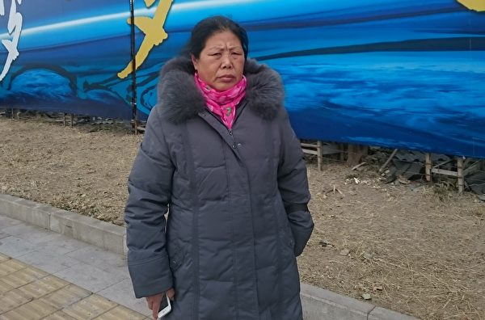

  
 
刘华（本人提供）
 
    

我妈说，我是庙里偷跑的花大姐托生的，不好养活。我出生在1963年黄历四月初八，这个生日大，是释迦牟尼佛生日，也是大庙开门的日子，这天生的人苦难多。后来我给村里老百姓维权，他们就特别恐惧嘛，镇里有个书记就拿我的生辰八字，找个女的算命，算命的说，“你别碰她，别跟她争，她绝对不会服，这个官司打到底也是你们输，她这个人特别有毅力，会坚持到底的。”这是后来算命人的姐姐传出来的。

小时候我家地不多，因房前屋后有点树，就给定了富农。我5岁那阵，吃集体大锅饭，贫农都上小队吃大锅饭，端个碗、盆，分一大锅粥。我们只能在小队铁门边，扒著小眼看。我也要进去，为什么他们吃，不让咱们吃？我妈拽着我，不让我去，我就哭闹，我妈说，“不懂事！咱家是富农，人家是贫农。”

我爸1.8米的大个儿，每天一样出工，在小队干活一点不差，只能挣二三等工分，就因为咱家是“富农”。

8岁时，小队秋天分笤帚草，扒堆，每家一堆，我家那堆小。我问：“干哈他们家大堆，我们家小堆呀？”我妈说：“你不懂，人家是队长。”“队长就要大堆？我也要大堆！”我就上小队队长家，抱一堆就走，小队长说：“这死丫头！为什么把我家的往你家抱！”我说：“你家堆大，我家堆小。”我哭，怎么富农就倒楣呀？为什么他贫农就多要？我妈说，“贫农是好人，这丫头从小就和别人不一样，这么厉害呢！”

小时不知道党不党的，就知道政府坏，那时目标就很明确了，知道一定要反抗，不反抗就受欺负。

我刚上学时，说咱是富农孩子，想戴红领巾都不给戴呀，走道都给你隔开，人家贫农走一伴，路上她们拦着我就打一顿，欺负我，回家还不敢告诉我妈。后来我就背一个小草蛇或者几个壁虎上学，装在一个罐头瓶子里。她们一打我，我就把蛇往她们身上扔，她们吓跑了，我再把蛇捡回来，第二天上学再背上，这样放学我就能一路畅通回家了。

全家七口人，吃不饱，我大哥上山东背猪大油、背大馒头、背地瓜干。二哥上黑龙江背黄豆，第一回背了50斤，到车站，人一搜是黄豆，说他“投机倒把”，车站就给截留了。本来就是借钱弄的黄豆，结果空手回来。

12岁时，我放学看游斗“四类分子”，一看那不是我二哥吗？让人剃秃了，挂个大牌子，写个“投机倒把”，上面还打个叉，就因为他把槐树干削吧削吧就做了铁锹把，就给抓了游斗！

<b>二、为村民的土地维权</b>

17岁我就下学了（毕业），然后在小队干了几年活。1984年我22岁结婚，然后一直在沈阳苏家屯红菱镇的张良村里做生意。

2002年的时候，村书记不告诉村民，就把村里一千亩地给卖了。

人家说：“看你们两口子，好赖还做点生意，比我们有能耐，就帮我们写点材料，往上反映反映呗。”我虽然不种地，但地也有咱的，他抢、他非法卖，咱是应该要回一点。不就是写点材料往上反映吗？我想得特别简单。

以前也有人到村委会那个大院反映过土地的事，被村书记打了好几个耳光，大伙都在怵他。

我觉得也没有什么可怕的。我就去找他，和他理论这个事。

书记说：“我当了24年的大队书记，我一个吐沫就是一个钉，我就是土皇上。”

“这回就不让你当钉！”我说，“把你这根针撅折了，你拿什么穿？我不路过你这针鼻儿，我告到联合国又怎样？”“你告吧，你告到联合国，也要穿过我这个小针鼻儿！”

我说：“我不穿，我越过你，我把你这个针撅折了，拿什么穿？你从开始卖地到现在，你有什么法律依据，土地局给你批条了吗？你拿得出来？没有，你就是抢！”书记的头低下来了。

我接着说：“高速公路拨下来这么多款，还有95年救灾款都哪去了？这二十多年，你们贪污这么多钱，老百姓都活不下去了，现在你卖地，也牵扯到我的地了，你要有个说法！还有《土地法》呐！”

村里老百姓就说，“噢，咋还有《土地法》呀？你咋知道有《土地法》呀？”

村里有文化的人太少，我在他们眼里就是有文化的了，虽然我初中没念满，但是我学习非常好，平时爱看书，愿意买书，什么《妇女杂志》啥的，都看。我上新华书店，买了一大摞《土地法》，村里一家发一本。我自己花钱买，让他们学。

那时候村书记他们已经卖了一块集体土地，都盖上房子了。我到市里上访要说法，说《土地法》怎么讲的，一条一条的，大队怎么违章的等等，他们认为我讲得有道理，就说：“回去你们扒房子吧，不犯法。”于是我回去我就组织村民，把《沈阳晚报》、《晨报》都给弄来了，把房子一天就扒完了。

扒完以后，区里和镇里的领导，天天穿个大风衣，戴个大口罩，上那地里挑小石头，因为要恢复成农田地，盖房的砖瓦块要挑出来嘛。

当时我脑子就有意识：查账。我去沈阳会计所问，他们说查账需要费用，于是我们就抬（村民集资）了6万块钱，二分钱利息抬的高利，让我丈夫代签借用。2002年时，村民已经选我丈夫当了村长，我丈夫是村长、法人，他有权利去审那个帐，所以说从头到尾我们都是公允的，是合法的。

还得把帐抢出来，会计师才能审查。曾经有的村去查账，大队叫人给打成植物人了。所以抢帐那天，他们说“刘华你可要掂量好，抢帐就是你拿人家脑袋，人家就会拿你脑袋的”。当时我就想，可不能出差错，出差错我不就废了，孩子还小呢。

我们先去跟他们要账，不给。我就让那书记坐在沙发上，让几个人看着他，我再把所有的电话全给薅下来了，让电话里外不通。

抢了帐，装上轿车，往村里小路上走，不上大道，转了几个地方，然后就又换面包车，一路换了四次车，才把这一车将近三十玻璃丝（塑料）袋子的账目，全部拿到了沈阳荣正会计所。十二个审计人员审了大半年，查出我们村干部出卖集体土地、违法摊派、侵吞村民水电费和侵占救灾款等，审计发现有问题的金额达260余万元，涉及前任书记王景财及现任书记刘家安等。列出审计报表报到公安部后，公安部就说要抓大队书记，但大队书记给公安送了一万斤大米及数万元钱，公安部就不了了之了。

但这块地没有让他卖成。俺们村靠法律维权，真的把官司给打赢了。

区里头还是不甘心，还要卖这块地，说不卖给老张，也要卖给老李，还要卖。公章在大队里，我半夜就去村委会，把公章偷回来，找个地方挖个坑埋起来了。我丈夫是村长，他们要是抢过公章，扣上公章把地就给卖了，我丈夫也有罪过啊。

哪想到他们会设计陷害我丈夫呢。2002年12月12号，那时下雪了，外面全上冻了。村里一个打更的，故意把村委办公室的地用湿拖布拖，之后把门窗打开，水磨石瓷砖的地，就冻上了薄薄一层冰。然后他打电话给我丈夫，说漏水让我丈夫赶去处理。我丈夫赶到大队，哪知道地上有冰，大步流星走过去，一兹溜腿就撞到大队一楼中间的柱子上，整个膝盖以下全部粉碎性骨折，三级残疾，左腿和右腿差2寸，不能长时间走路了。后来问那个打更的，为什么大冷天拖地还开窗？他说是书记让他干的。

书记还想要公章，说有个妇女要开流产介绍信，要用公章，让我上大队去。我去了说：“村里老百姓选的妇女主任不用，你大队书记又当妇女主任又当大队书记。你在违法。你看这个妇女要个避孕套哇、要流产哪、要带环，还要找你大队书记，多别扭哇。”我说“你要那些避孕套干哈呀”？他说我寒碜他，一拳把我打倒，当时我就昏过去了。醒过来我就去了他家，脱了外衣就上他家炕，躺下睡觉。我说：“我不走了，今天就跟你过了，你不是把我丈夫的腿害残了吗？我就跟你过了。”他一看确实把我给打伤了，他就报警。派出所来了，警察说：“刘华，走，上医院给你看病去，你不能在人家待着。”我说我丈夫让他害残了，他还把我打了，我就跟他过了，我就不跟我丈夫过了。他们傻了，都过来哄我上医院去看病。

一天半夜12点，我正睡觉呢，一个电话把我弄醒：“我告诉你刘华，你再告，我把你脑袋拿下来！”是大队书记的侄子张富强。我马上打了110，010-110，北京的110。北京转到了省公安厅。省公安厅的公安开着七八辆警车就去了他家。半夜1点，他家转圈全是警灯闪，张富强一下子就毛了。警察把门踢开，进门就拽他脖子：“你他妈大半夜去打恐吓电话，你知道刘华把电话打到哪了？打到北京，北京转到省公安厅了，我们还活不活了，为你小破事省公安厅都别睡觉！”霹雳吧啦把他揍了一顿。

后来书记又打了我一次，经过沈阳市法医鉴定“轻伤”，“轻伤”他就得坐牢啊，但官官相护，派出所所长包庇他，也不追究，就给他一个“警告”完事，还弄个笔误，说我把大队书记打了，我还得给大队书记拿二百块钱。这事谁能服哇，我被打了，我还要给他钱！我当然要告他！我就上北京告状。那时我丈夫正在当村长，到北京和我待了一个多月就回去了。#（待续）

责任编辑：李天琦

<a href=#list><h6 align="right">回目錄</h6></a> 

 

  
   
    
  
  
 <a name=4><h2>大陆8月天灾人祸不断 社会危机重重 </a>  </h2> 

 

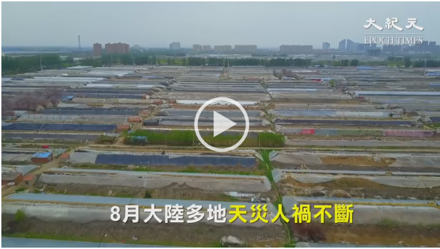

 
【大纪元2018年09月06日讯】（大纪元记者萧律生采访报导）8月，大陆多地天灾人祸不断，非洲猪瘟、炭疽病；寿光、潮汕洪灾、东北大旱；P2P、疫苗受害者维权等。时评人士表示，这些危机都有其各自爆发的原因，但是从发生、发展到最终造成难以挽回的损失，无一不是中共这个始作俑者造成的。

<b>疫情泛滥</b>

8月1日，沈阳沈北新区沈北街道发生非洲猪瘟疫情，存栏383头，发病47头，死亡47头。

随后中共官方共通报另外4起疫情涉及另外4省：河南郑州双汇屠宰厂30头感染死亡（8月17日陆媒报导）；江苏连云港发病615头，死亡88头（8月19日农业农村部公布）；浙江温州乐清发病430头，死亡340头（8月23日农业部通报）；安徽芜湖市南陵县185头发病，80头死亡（8月30日公布）。

进入9月份，疫情持续恶化，在安徽宣城（两起）、江苏无锡、黑龙江佳木斯、安徽滁州发现非洲猪瘟疫情。

时评人士唐靖远对大纪元表示，非洲猪瘟事实上已经令中共在动物疫情的管理上处于失控状态。

“猪瘟的出现，看起来是自然灾害，其实与人祸密切相关。”唐靖远说，中共与美国大打贸易战，为了报复美国农民，大量进口俄国昂贵的有疫情的猪肉。

他说：“病急乱投医，正是中共官场拍脑袋下决策的典型写照。这体现出中共就是只管保住政权稳定，无视民众生命健康及基本权利。”

不仅有非洲猪瘟，8月初，黑龙江省佳木斯市爆发羊炭疽疫情，已有14人感染。随后疫情蔓延黑龙江多个城市。

8月14日，中共官方称，内蒙古自治区通辽市科尔沁区大林镇胜利村发生畜间炭疽疫情，发病牛54头，死亡29头，20人感染皮肤炭疽。但坊间称实际数字比这个还要多。

8月15日，新疆维吾尔自治区巴州尉犁县，某养殖场的牛出现O型口蹄疫疫情，发病牛63头，死亡4头；8月29日消息，内蒙古自治区乌兰察布市兴和县发生同样疫情，36头牛发病，12头死亡。

<b>洪灾不断</b>

今年夏天大陆多地暴雨引发洪灾，造成严重灾情。

8月10日凌晨，甘肃省白银市白银区109国道考试中心洪涝，导致数十人被困，村庄部分房屋被山洪冲毁，至少6人遇难。

16日，四川省宜宾市屏山县突降大暴雨，截至8月17日12点，受大雨洪灾影响，宜宾屏山县有6人失联。

8月19日、20日，山东青州、临朐等地下起了大暴雨，当局让上游冶源、黑虎山、嵩山三座水库同时大量泄洪，导致中国蔬菜基地寿光市的多个村庄被淹，官方称至少13人死亡，有9999间房屋倒塌，5.47万头生猪死亡，20多万个蔬菜大棚受损，直接经济损失达92亿元（人民币）。

其中，官方报导的房屋倒塌数量，遭许多中国网民质疑，戏称中国的洪水也非常富有中共的“党性”。

而就此次暴雨，唐靖远分析说，从表面看，寿光当地遭遇了暴雨。“但寿光并非第一次遇到这样的大雨，历史上有过比这更大的暴雨，都没出现洪灾，为什么这次发生了？”

他说，追根溯源，是当地三个水库无预警同时泄洪，官方媒体却对真相进行封杀，“他们关心的只是不能让洪水冲垮水库堤坝影响政绩，是中共党性思维中的那种对生命漠视的残忍。”

8月29日，汕头市内普降暴雨到大暴雨。当夜，深圳19座水库陆续泄洪。8月30日，广东汕头市潮南区司马浦镇、谷饶镇、陈店镇等地遭遇特大洪灾，一周过去，大水仍未完全退去。

然而，在灾情发生之初，救援人员均是各界民众，4天后才见到政府人员。但到场的消防员并未进行更多的救援活动，而是为了作秀拍了几张照片。

随后，当地政府甚至禁止所有民间救援队进入灾区，还要收回所有的救援物资。

<b>人祸不断</b>

8月初，发生了两件波及全国千万民众的事情。一个是大陆各地P2P金融平台密集崩盘，千万投资人一夜之间血本无归，大批民众进京维权遭拦截；另一个是7月份疫苗事件的后续，即疫苗受害家属记者会受阻，受害家长遭当局非法抓捕。

8月6日，全国部分P2P金融受害者到北京银保监会前集会。这些P2P金融受害者中，不乏隐瞒家人将钱全部投入的，还有残疾人、老人把一生的积蓄投进去的。

据当时参与的民众描述，大量穿着灰黑色雨衣的警察在对行人进行盘问，“当时人很多，警察叫他们停下并出示身份证，并用手上的机器扫一下，很快就确定了对方是不是P2P上访黑名单的人，然后把上访者押到停靠在一旁的大巴上去。”

唐靖远表示，P2P爆雷的源头来自中共。当初正是中共官方大力鼓吹，喉舌媒体站台宣传，欺骗民众。“P2P事实上已经成为政府设套剪羊毛、割韭菜的工具。”他说，“因为中共垄断社会所有资源，它既是运动员又是裁判员。”

唐靖远表示，当民众的红利支付成为负担后，中共立即变脸成为事不关己的旁观者，把爆雷责任全部推给已经跑路的操盘手。

他说，中国社会的这些重大危机，其本质都是中共的邪恶制度造成。

除了P2P维权外，7月份曝出的长春长生制造假疫苗事件，在8月份有新的延续。在北京的疫苗受害者家属的媒体见面会因中共当局干扰被迫停止。此外，8月24日凌晨2点，安徽徐亚萍，广东曾江、白广杨、张加兵与重庆刘洋等5名疫苗受害家长和孩子被北京洋桥派出所强行带走。

中共官媒最新消息称，对全国现有45家疫苗生产企业（不含长春长生）进行风险排查，目前未发现影响疫苗质量安全问题。

然而，据大纪元记者跟踪报导的全国各地疫苗受害个案显示，不仅长春长生的疫苗导致孩子出现问题，武汉生物、北京天坛生物、辽宁成大生物等疫苗制造公司均有案例。

不少受害孩童家长们无奈喊道：“我们死了，孩子一个人怎办！”

唐靖远分析说，假、毒疫苗能够长时间在各地畅通无阻，没有官方的权力保驾是根本不可能的。而中共体制已经形成了极其残酷的报复机制，任何想要曝光丑闻的人，都会遭到中共的打压和报复。

“整个体制慢慢就变成丑闻越邪恶越要掩盖，越掩盖等于对邪恶行为的纵容和保护，最终造成更加邪恶的行为产生，这种恶性循环在中共体制各个领域不断发生。”唐靖远说，“如今已经走到了最后的极限，所以中国社会的各种危机，早已是病入膏肓，无药可治。”#

责任编辑：林琮文

<a href=#list><h6 align="right">回目錄</h6></a> 

 

  
    
   
   
  
  
 <a name=3><h2>河南疫苗受害家庭的苦难历程（二） </a>  </h2> 

 
  

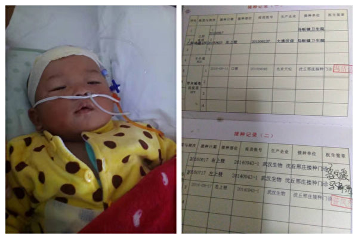

  
 
河南信阳邹万里的孩子接种了北京天坛和武汉生物的脊髓灰质炎疫苗，上下肢神经受损，两条腿不会动。（受访者提供） 
  
      
 【大纪元2018年08月10日讯】（大纪元记者顾晓华、李新安采访报导）疫苗安全触动了中国人的道德底线，疫苗事故给受害者家庭带来了毁灭性的打击。
      
他们的孩子因疫苗致残、瘫痪，有的获得了很少的补偿金，有的甚至还被没有确认赔偿，却不断遭到官方“维稳”。他们到北京给孩子治病，花费数十万，想尽一切办法给孩子做康复，有的实在撑不下去停止了治疗。

大纪元记者采访了多位疫苗受害者家庭，他们讲述了各自悲惨的遭遇。以下是三位家长的自述。     
<b>河南周口疫苗受害家长金丽丽</b>

2017年9月1日，满三周岁的儿子去周口项城王明口镇卫生院打流脑疫苗（云南玉溪霍森药厂生产）。9月5日上午，打完疫苗后第四天起，孩子上下肢瘫痪，大小便失禁了。完全不能走路，坐在轮椅上。

最开始孩子说腿疼，带他去医院没检查出什么病来。省城的医院说可能是脊髓炎，然后就住院了，看了三个月整，不见好转。2017年12月5日到的北京，一直在北京博爱医院住院。

北京的医院一个月大概要三万左右，还要租房，房租、水电费都很贵，在医院附近租的二室一厅，五千。

北京诊断也差不多，因为在郑州有片子，三甲医院都认可。还是上下肢瘫痪，没有感觉，大小便失禁。

大夫讲可能跟疫苗有关注，我们自己也查了，脊髓炎跟疫苗接种有关系，因为没有其它疾病原因，我们感觉疫苗的可能性是非常大的。

刚开始走了弯路，现在我们在协商各个部门给孩子做一个正规的调查诊断，还没有确认是不是疫苗造成的，已经向疾控申请了。

在北京花了好几十万的自治费，大部分靠自己。我们就是一个普通的农村家庭，和亲戚朋友借，都借了三十万了。从9月1日已经快一年，在郑州就是三万，还不包括吃住，我们中药、西药能用的都给孩子用上了。

我爱人也没有工作了。靠以前的积蓄，亲戚朋友的帮助，以及当地政府陆陆续续救助七八万元。

打算孩子康复两年，看有什么好效果，因为最佳康复期是两年，不行的话不能耽误孩子上小学，已经耽误上幼儿园，不能再耽误他上小学，让他回家上学。等到假期再带他进行康复。     
<b>河南信阳市疫苗受害家长邹万里</b>

我孩子是2016年8月份在周口市沈丘县邢庄乡卫生院接种的疫苗，然后浑身没劲，刚开始发烧，烧退掉后两条腿一点都不会动。带他到河南省人民医院去看，医生诊断是上下肢神经受损，后来专家诊断是脑脊髓炎，现在一直在北京按摩儿童医院做康复。

孩子打的是脊髓灰质炎疫苗，是北京天坛、武汉生物的。打的两针中间相隔四五天，都是国家强制性接种的，都是一类疫苗，国家免费的。打了疫苗过了十多天以后开始发烧、呕吐，浑身没力了。

孩子现在两岁多，打疫苗的时候是五个多月，这个疫苗应该三个月的时候打，当时没有疫苗，后来来了电话通知我，所以带孩子去打的。

我是河南信阳人，孩子出事是在周口，我们当时在周口做了小生意，所以把孩子都带过去了，我孩子是儿子，唯一的一个儿子，现在搞成这样。

疫苗出了很多事情，在河南省目前有三十多家，这是我所知道，还有好多出了事不知道是疫苗害的。

孩子现在的情况就是腿没劲，神经伤了，腿和脚萎缩得快，比较小，比较细，走路的姿势太难看了。刚开始发病的时候做了一个磁共振，感觉孩子大脑没什么问题。上下肢比较严重。

 

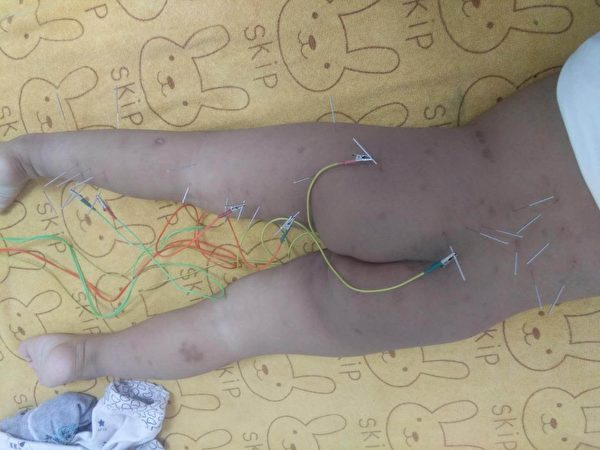

  
 
河南信阳邹万里的孩子接种了北京天坛和武汉生物的脊髓灰质炎疫苗，上下肢神经受损，两条腿不会动。（受访者提供） 
  
     
过完年一直在北京那边做康复，做了四个多月，效果比省内的好。今年开“两会”的时候我们去了，结果地方打电话，怕我们上访，出了事都是这样，他们都是“维稳”。

信阳这边“维稳”，周口那边不管不问。在北京看病在门诊看，在外面租房子住，每次有重要会的时候，地方政府打电话，不让我们去上访。

专家鉴定的伤残等级是二级乙等，按照我们河南的补偿办法，疫苗异常反应，领了一个省补24万元，再也没有了，今年开两会信阳这边求助了两万块钱。从孩子犯病到现在已经花了三四十万了，借都借不到，家都不像家了，家都快散了。

 

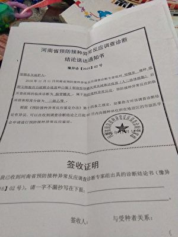

  
 
河南信阳邹万里的孩子接种了北京天坛和武汉生物的脊髓灰质炎疫苗，上下肢神经受损，被鉴定为“异常反应”二级乙等。（受访者提供） 
  
     
孩子好的时候我是开工厂加工大理石，在乡镇上做的。我爱人帮我干。孩子发病以后没有心情做了。

积蓄都花到孩子身上，都是为了孩子。现在经常不在家，别人来找的话不在家，别人也不做了。孩子发病后就基本没有收入了。

我四个小孩，三个姑娘，最小的就是这个儿子，想尽一切办法给做康复。孩子康复成正常人这样基本不可能，伤到神经了。

刚开始对疫苗都不了解，没有想到这么大的后遗症。北京每月治疗费用在3万元左右。

我心里恨，痛恨疫苗毁了我儿子，因为国家的疫苗牺牲了一生健康，却没有治疗费用，没人给孩子保障。整天想这事，死的心早有了。     
<b>河南新乡辉县疫苗受害家长张兰青</b>

孩子是2015年的时候吃的糖丸，没吃多久腿就瘫痪了。我儿子叫仁嘉新，他是2015年6月17日出生，出生三个月后9月10日服了脊灰质减毒活疫苗，22日孩子发烧出现症状，25号腿就瘫痪了，开始给孩子治，一直到现在，孩子三岁多了。

河南省就赔偿了三十万，当时鉴定报告是疫苗引起的异常反应，属一级一等伤残，都有鉴定报告。我们孩子一直在北京按摩医院治疗，治了将近三年，花了一百多万，现在家里是一贫如洗。

我两次去过中南海，市政府和信访局是多次跑，电话手机费都交不起，孩子被迫停止治疗从北京回家，一个月了，我现在还在找市政府。暂时还没有给结果。

一年在北京就得三十多万，连一年的费用都不够，三岁多了不能自己走路，成天在地上爬。

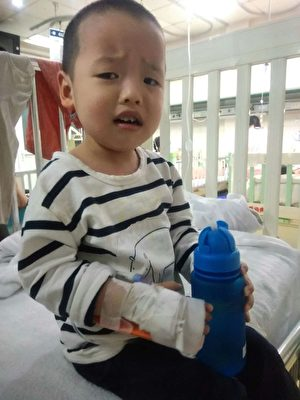

  
 
河南新乡辉县疫苗受害家长张兰青吃了脊灰质减毒活疫苗糖丸，双腿瘫痪，不会走路。（受访者提供）
 
     
在北京按摩医院这种糖丸事故的孩子有几十人。糖丸疫苗不是导致瘫痪，就是傻了，要么就是死了，没有轻的，都是挺严重。这种糖丸有风险的。

我和我爱人没有工作，开始是做个小生意，为了孩子在北京治疗，在北京租房子住，没有住院，在北京费用一个月三万多左右。

费用是卖房子，四处借钱。打算让政府给孩子治疗，让地方政府给一定的补偿，省里的三十万肯定不行，我孩子一生残疾，治不彻底，如果不治孩子更糟糕，治的话生活质量会好一些，能够自理，如果不治的话自理都不行。

肯定还得去北京，河南赔偿是最低的。我家庭非常困难，实在撑不下去停止了治疗。

我们整天骂那些人，恨他们，恨也没有用，中国的疫苗技术现在太落后，出事是早晚的事，我们也管不了这么多，已经出事了，国家应该保证我们孩子的治疗，家庭受到伤害，你要给一定的保障，国家没有给疫苗立法，我们维权路太难。#

责任编辑：李沐恩
<a href=#list><h6 align="right">回目錄</h6></a> 

 

  
      
     

  
 <a name=2><h2>河南疫苗受害家庭的苦难历程（一） </a>  </h2> 

 
 

 
疫苗事故频发，引发了公众对药品安全的担忧。(AFP/Getty Images)

      
      
 【大纪元2018年08月10日讯】（大纪元记者顾晓华、李新安采访报导）疫苗安全触动了中国人的道德底线，疫苗事故往往给受害者家庭带来毁灭性的打击。大纪元记者采访了多位疫苗受害者家庭，他们讲述了各自悲惨的遭遇。
 
 河南新郑疫苗受害家长王晓芳说，孩子从小身体素质特别好，对打疫苗针后发生的异常反应和孩子多次流鼻血并未在意，更不会联想到有可能孩子血液板减少。     
<b>打疫苗后大出血 艰难求医路</b>

王晓芳的儿子刘忠阳，2015年3月4日在郑州新郑县城关乡卫生院打的麻腮风疫苗。当时8岁的他打完疫苗后，牙龈出血，身上多发皮诊，拉完肚子就发烧，反复咳嗽，这些症状反反复复。

孩子最严重有两次大出血。2015年8月份孩子再次流鼻血后，身上出现多处大块紫癜，当时以为男孩淘气，磕绊造成的。后来身上满是出血点，在新郑中医院查血小板50（正常值为100到300），家人决定带孩子去河南医科大学附属医院（河医大）彻底检查。

当天是2015年9月7日，晚上家人一块商量准备第二天去河医大就诊，当晚十二点左右看孩子还没事，第二天五点左右起床发现孩子脸上、脖子、枕头及薄被上满是血，鼻孔血已凝固，身体非常虚弱。

他们赶到河医大，一查孩子血小板只有4，急诊入院，孩子一直说累，躺下就睡着了，脸色和嘴唇发白，奄奄一息，立即转入监护室。大夫让家属不停用棉签醮水抹孩子嘴唇，过一会叫叫孩子的名字。

医生几次建议转去北京儿童医院治疗。在监护室住院那段时间，王晓芳已经得知孩子得病与接种疫苗有关，只是很难想像孩子打疫苗针前参加学校长跑比赛，级段八九百名同学，孩子长跑成绩十三名，过了短短几个月孩子却不能正常行走，需要大人背着去求医。

在河医大监护室里住了二十来天，病情一直没有好转，用什么药物治疗，中医、西医、包括激素、丙球都用了，药效都不好，最后没办法，到北京儿童医院用化疗的药物。

2016年1月15日傍晚，孩子鼻孔又开始流血，医生开药后便吩咐让回家。回家后在床上吐了一大滩血，赶紧让孩子爸再背着孩子去医院，临走前又吐了一大滩血和血块。三岁女儿见状抱着妈妈哭闹不止，不让把她丢家里。王晓芳只得在家看女儿，望着一滩滩血，泪流满面，想到孩子能否度过晚上还是问题，她只能祈祷上天能拯救孩子，让孩子渡过难关。

孩子住院后流鼻血没断，两个鼻孔都被塞上了。第二天早上孩子不停去厕所大便，几次都是黑红色的水，医生确定是血水，说是肠胃出血了。

所有的治疗方案都用完了，没有什么好的办法，只好再次去北京。孩子爸背上生命垂危的孩子，连夜赶到北京。他们找到北京儿童医院的一位专家，“如果他要是不给我们收住院的话，我就给他跪下，所有的治疗方案都没效，只有跪求那个医生帮孩子住院治疗。”王晓芳说。

孩子鼻子还流着血，再血流不止孩子就没命了，医生一直说忙加不了号，最后看了她手里拿着化验单，直接开了住院证。

血小板减少治疗一般五天一个疗程，最多七天，治完就可以出院。化疗那段时间他们在北京住了两个月左右，害怕用完那个药没得救不敢回家，就在北京租房子，出院了再进医院，一个月当中多次住院。

王晓芳介绍，在北京住院贵，光丙球数一天就要六七千，孩子大了按体重算的，三五天就要几万块钱，到后来有专家说有不用药维持丙球的治疗方案，我们就用了这个方案，因为那个药太贵了，像我们农村人根本承担不起。

她说，现在已经用完化疗药物，不是说很好，病情得到了控制，没有病危住院的情况。现在定期去北京拿药，每个月去北京给孩子取药。以前连路都走不了，现在配上中医，病情好转，孩子也能上学了。但是这种病危险性高，孩子的血小板忽高忽低很不稳定，康复治疗一刻也不敢怠慢。
卫生局前募捐被打 去北京治病遭“维稳”

王晓芳说，孩子的病做过鉴定，医生也说是疫苗引起的。向疾控中心反映情况，他们说的是没关系，但是他们在诊断书上造假了，诊断书写的是“关联性不强”。王晓芳认为，关联性不强还是有关系，是他们在推诿。

他们的诊断书上，孩子牙龈出血、多发皮疹等症状（血小板减少的症状）都没写，只写了咳嗽发烧。日期也写错了，写的四月份。

给孩子治病没有政府的资助，王晓芳用“轻松筹”自己搞募捐。2016年9月9日，她在新郑市卫生局门口募捐的时候，卫生局的信访主任还出来打人。王晓芳住院十多天，头晕走不了路，还要带孩子看病，被迫出院。当时也报了案，但是至今没人给处理。

王晓芳说，后来政府给过十来万，因为打人的事，政府跟卫生部门协商，卫生部门给借了一万块钱，打了借条，后来他们再也没管过。“当地乡政府给了十万，拿过一张纸，让我不要再追究卫生部门的责任，当时我没有签字，我孩子是打疫苗得的这个严重的病，那个十万块钱够干吗的，他只是拿了一张纸，我没有给他们签。”

为了不让王晓芳去北京，当天政府天天看着她，有时还住到他们家里面。去年，孩子爸不在家，一群人住在她家里面。孩子的病情严重，他们会拖到过了那个敏感时间，重大会议的时候一般都不让去治病，要去他们就跟去。

王晓芳说，“这次（7月29日）也不让我去，说上面有指令。火车票买了都不让去，最后他们开着车带我老公和孩子去的，我在家里。”

王晓芳在幼儿园工作，丈夫做电焊，因为孩子的事丈夫也工作不了，有时成月成月地不让去上班，在家里面，生活补助什么都没有给过。遇敏感时期就没工作了，不让上班。     
<b>卫生部门鉴定不公 家长给残儿讨公道</b>

频繁住院，求医问诊于各大权威医院，四处走访于各个部门，王晓芳发现孩子疫苗接种后异常反应跟全国各地同病历异常反应及相关文献记载完全符合。她向多位权威专家求医咨询得知孩子患病跟疫苗有关。

王晓芳说，“为给孩子寻求公道，哪怕有一点希望我们都不会放弃，直到接触到全国各地疫苗受害家长，才发现不是想像中的那样。卫生部门诊断和鉴定不公，既当运动员又当裁判员，是否异常反应他们说了算，他们造假却得不到一点惩罚。多年来大家都在经受同样的痛苦和折磨，多少家庭因疫苗致残、致死而支离破碎，苦不堪言。残儿得不到及时有效的治疗，饱受疾病的折磨，为了给残儿讨公道，好多家长还要遭受非法打压拘留，有的甚至遭受刑拘。”

孩子的爷爷在孩子一度病危时，爷爷从邻居那里听说孩子病情严重，得不到控制，老人突然跌倒，被送医院抢救后，离开了人世。

王晓芳说，疫苗致残，孩子身心遭到了重创，严重影响了他的人生，家庭外债高筑，家人承受巨大的经济及精神压力，还要经受残暴，家中老人因此被活活气死。我们疫苗致残家庭希望得到国家的重视，减少疫苗伤害和家庭灾难，能够严惩造假生物企业和部门，建立公平公正的诊断及鉴定机构，让专家们敢于说真话，还疫苗致残儿童一个公道。#

责任编辑：李沐恩
 
<a href=#list><h6 align="right">回目錄</h6></a> 
 
  

  
         
     
      

     
<a name=1><h2>安徽猪瘟泛滥 民众普遍不知情 猪肉仍流通 </a>  </h2>
  
  
  

   

   【大纪元2018年09月08日讯】（大纪元记者萧律生采访报导）近期，非洲猪瘟在安徽省三地肆虐，民众对此却多不知情。瘟疫事发当地有民众表示，一个半月过后，猪肉会再次上市，目前仍有剩余猪肉在市场上销售。   
      
   中共农业农村部6日发布消息称，安徽滁州凤阳县发生非洲猪瘟疫情，该养殖场存有生猪886头，发病62头，死亡22头。3日消息称，安徽宣城宣州区金坝街道办事处某养殖场发生非洲猪瘟疫情，有生猪308头，152头发病，83头死亡。

2日，宣州区古泉镇一养殖场存栏生猪285头，40头死亡；五星乡一个养殖场存栏生猪440头，94头死亡。

8月30日，安徽芜湖市南陵县确诊发生非洲猪瘟疫情，养殖场内459头生猪，185头发病，80头死亡。

“在凤阳县大庙镇的养猪场，前两天，他们挖了大坑，把活猪给埋起来了，怕有病菌。”滁州凤阳县居民赵女士（化名）告诉大纪元记者，“这一阵子不吃猪肉了，今早在市场上还有人卖，但都是卖剩余的猪肉。”

她表示，虽然被告知非洲猪瘟不传染人，但是谁能保证吃了那样的猪肉就一定没病？赵女士对于此前大陆媒体声称“非洲猪瘟病毒不会感染人，猪肉可以放心吃”感到很是气愤。目前他们家不敢吃猪肉，改吃虾、鸡肉等，“也不敢下馆子”了。

尽管当地把不少生猪及病死的猪处理了，但是据赵女士所知，“一个半月以后，就可以卖猪肉”了。她还说，在凤阳县有不少卖猪肉的商户，“现在生意很冷淡，有的转向卖牛肉⋯⋯”

可是在滁州市的居民董先生（化名）却告诉大纪元记者，当地很多民众并不知晓非洲猪瘟疫情，市场上、超市里一直有卖猪肉。

“我们还能买到猪肉，跟平常一样。我前两天还买了。”董先生表示，当地并没有提醒民众注意猪瘟的通告，自己是通过翻墙看到消息的，更不知道“非洲猪瘟病毒在60摄氏度、30分钟条件下可杀死”的注意事项。

住在安徽淮南的刘先生（化名）也表示“市场没有什么反应”，还说，即使“我知道情况，我也不要说”。

安徽芜湖的郭先生（化名）对大纪元表示，自己对非洲猪瘟的事情也只是听说，什么时候传进芜湖的、怎么样传进中国的都不太清楚，网络封杀很严重，不了解实际情况等等。

美国农业部长珀杜（Sonny Perdue）8月30日表示，中国大陆爆发的非洲猪瘟疫情，可能比媒体报导的还要严重，“因为他们（中共）可以控制媒体。”“如果非洲猪瘟进入美国，后果将是‘灾难性的’。 ”#

责任编辑：林妍  
      

