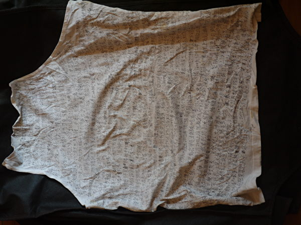

  <h3 align=center> 翻墙必看 视频 http://118.161.140.97 </h3>

 

  
 

 
 

<a name=list><h3><a href="https://">中国禁闻 时时更新 请随时关注 並记下短连结 【 https://git.io/DWDW 】</a></h3>

<table>
   <tr>
    <td width=440>

<a href="https://git.io/tgc">• 点阅《共产主义的终极目的》•</a>

</td>
  <td width=440>

<a href="https://git.io/sos">• 点阅《九评共产党》•</a>

</td>
  </tr> 
</table>

<table>
  <tr>
    <td width=680><a href=#◆◆◆4>◆ 【九评13周年】中共给中国带来了什么</a> </td>
    <td width=200 ><a href=#◆◆◆4>大纪元</a> </td>
 </tr> 
  
   <tr>
    <td width=680><a href=#◆◆◆3>◆ 陆媒罕见大尺度刊文：一场重大变革正席卷中国 </a> </td>
    <td width=200 ><a href=#◆◆◆3>新唐人</a> </td>
 </tr> 
  
   <tr>
    <td width=680><a href=#◆◆◆>◆ 中共悄悄送給越南的島 比釣魚島還大！ </a> </td>
    <td width=200 ><a href=#◆◆◆>新唐人</a> </td>
 </tr> 
  
   <tr>
    <td width=680><a href=#◆◆◆1>◆ 1949年后中国丢失多少国土？真实数据超想像 </a> </td>
    <td width=200 ><a href=#◆◆◆1>新唐人</a> </td>
 </tr> 
  
   <tr>
    <td width=680><a href=#◆◆2>◆ 中共严密封锁的信息：死亡职位（上） </a> </td>
    <td width=200 ><a href=#◆◆2>大纪元</a> </td>
 </tr> 
  
  <tr>
    <td width=680><a href=#◆◆3>◆ 中共严密封锁的信息：死亡职位（下） </a> </td>
    <td width=200 ><a href=#◆◆3>大纪元</a> </td>
 </tr> 
 
   <tr>
    <td width=680><a href=#◆◆>◆ 中共哈尔滨政法委“610”官员厄运缠身 </a> </td>
    <td width=200 ><a href=#◆◆>大纪元</a> </td>
 </tr> 
  
   <tr>
    <td width=680><a href=#◆>◆ 川人：中秋节话感恩，挡不住的良知回归潮</a> </td>
    <td width=200 ><a href=#◆>大纪元</a> </td>
 </tr>
 
  <tr>
    <td width=680><a href=#◆1>◆ 【特稿】感恩——亿万法轮功学员的心声</a> </td>
    <td width=200 ><a href=#◆1>大纪元</a> </td>
 </tr>
 
 
   </table> 
  
   <table> 
  <tr>
    <td width=680><a href=#1>1.安徽猪瘟泛滥 民众普遍不知情 猪肉仍流通</a> </td>
    <td width=200 ><a href=#1>大纪元</a> </td>
 </tr>
  
  <tr>
    <td width=680><a href=#2>2.河南疫苗受害家庭的苦难历程（一）</a> </td>
    <td width=200 ><a href=#2>大纪元</a> </td>
 </tr>
   
   <tr>
    <td width=680><a href=#3>3.河南疫苗受害家庭的苦难历程（二）</a> </td>
    <td width=200 ><a href=#3>大纪元</a> </td>
 </tr>
 
 <tr>
    <td width=680><a href=#4>4.大陆8月天灾人祸不断 社会危机重重</a> </td>
    <td width=200 ><a href=#4>大纪元</a> </td>
 </tr>
   
   <tr>
    <td width=680><a href=#5>5.马三家酷刑受害者：我要站出来说话(1)</a> </td>
    <td width=200 ><a href=#5>大纪元</a> </td>
 </tr>
   
   <tr>
    <td width=680><a href=#6>6.马三家酷刑受害者：我要站出来说话(2)</a> </td>
    <td width=200 ><a href=#6>大纪元</a> </td>
 </tr>
 
  <tr>
    <td width=680><a href=#7>7.马三家酷刑受害者：我要站出来说话(3)</a> </td>
    <td width=200 ><a href=#7>大纪元</a> </td>
 </tr>
 
 <tr>
    <td width=680><a href=#8>8.马三家酷刑受害者：我要站出来说话(4)</a> </td>
    <td width=200 ><a href=#8>大纪元</a> </td>
 </tr>
 
   <tr>
    <td width=680><a href=#9>9.马三家幸存者：认识的10位法轮功学员被迫害死</a> </td>
    <td width=200 ><a href=#9>大纪元</a> </td>
 </tr>
   
  <tr>
    <td width=680><a href=#10>10.来自马三家的无声咆哮——孙毅的故事 </a> </td>
    <td width=200 ><a href=#10>大纪元</a> </td>
 </tr>
   
   <tr>
    <td width=680><a href=#11>11.【新闻看点】手机出国仍被控 中共审查严厉 </a> </td>
    <td width=200 ><a href=#11>大纪元</a> </td>
 </tr>
   
  <tr>
  <td width=680><a href=#11-1>11-1.【2020中共全面监控农村 分析：监控不了民心 </a> </td>
    <td width=200 ><a href=#11-1>大纪元</a> </td>
 </tr>
   
   <tr>
    <td width=680><a href=#11-2>11-2.【新闻看点】遭全方位挤压 明星私企被“宰” </a> </td>
    <td width=200 ><a href=#11-2>大纪元</a> </td>
 </tr>
   
<tr>
    <td width=680><a href=#12>12.打压宗教自由再升级 中共祭出新招近变态 </a> </td>
    <td width=200 ><a href=#12>希望之声</a> </td>
 </tr>
   
<tr>
    <td width=680><a href=#13>13.绝处逢生的台湾保险业务菁英 </a> </td>
    <td width=200 ><a href=#13>明慧网</a> </td>
 </tr>   
   
   <tr>
    <td width=680><a href=#14>14.一位大陆学生的思考 </a> </td>
    <td width=200 ><a href=#14>明慧网</a> </td>
 </tr>   
   
   <tr>
    <td width=680><a href=#15>15.孙茜面临非法庭审　法轮功学员呼吁释放（图） </a> </td>
    <td width=200 ><a href=#15>明慧网</a> </td>
 </tr>  
   
<tr>
    <td width=680><a href=#16>16.曹长青：法轮功学员被摘器官是真的吗？ </a> </td>
    <td width=200 ><a href=#16>大纪元</a> </td>
 </tr>   
 
 <tr>
    <td width=680><a href=#17>17.“他还活着” 前中国医生追述强摘器官的恐怖 </a> </td>
    <td width=200 ><a href=#17>大纪元</a> </td>
 </tr>   
 
<tr>
    <td width=680><a href=#18>18.致青春——一位中国80后女生的故事（上） </a> </td>
    <td width=200 ><a href=#18>大纪元</a> </td>
 </tr>   
 
 <tr>
    <td width=680><a href=#19>19.致青春——一位中国80后女生的故事（中） </a> </td>
    <td width=200 ><a href=#19>大纪元</a> </td>
 </tr>   
   
   
   <tr>
    <td width=680><a href=#20>20.致青春——一位中国80后女生的故事（下） </a> </td>
    <td width=200 ><a href=#20>大纪元</a> </td>
 </tr>   
    
   <tr>
    <td width=680><a href=#21>21.军队与维权老兵有紧密联系 中共恐惧 </a> </td>
    <td width=200 ><a href=#21>大纪元</a> </td>
 </tr>   
   
 <tr>
    <td width=680><a href=#22>22.乌克兰媒体报道法轮功　曝光中共迫害（图） </a> </td>
    <td width=200 ><a href=#22>明慧网</a> </td>
 </tr>   
 
  <tr>
    <td width=680><a href=#23>23.新疆司法厅副厅长任杰灵遭恶报 </a> </td>
    <td width=200 ><a href=#23>明慧网</a> </td>
 </tr> 
 
  <tr>
    <td width=680><a href=#24>24.近三个月吉林省政法系统六人落马　610头目惨死 </a> </td>
    <td width=200 ><a href=#24>明慧网</a> </td>
 </tr> 
 
 <tr>
    <td width=680><a href=#25>25.“上级命令”是一把杀人不见血的刀 </a> </td>
    <td width=200 ><a href=#25>明慧网</a> </td>
 </tr> 
 
<tr>
    <td width=680><a href=#26>26.这些前中共纪检委官员为何控告江泽民（1） </a> </td>
    <td width=200 ><a href=#26>大纪元</a> </td>
 </tr>  
 
 <tr>
    <td width=680><a href=#27>27.这些前中共纪检委官员为何控告江泽民（2） </a> </td>
    <td width=200 ><a href=#27>大纪元</a> </td>
 </tr>  
 
 <tr>
    <td width=680><a href=#28>28.这些前中共纪检委官员为何控告江泽民（3） </a> </td>
    <td width=200 ><a href=#28>大纪元</a> </td>
 </tr>  
 
<tr>
    <td width=680><a href=#29>29.这些医生为何起诉江泽民？（1） </a> </td>
    <td width=200 ><a href=#29>大纪元</a> </td>
 </tr>   
 
 <tr>
    <td width=680><a href=#30>30.这些医生为何起诉江泽民？（2） </a> </td>
    <td width=200 ><a href=#30>大纪元</a> </td>
 </tr> 
 
 <tr>
    <td width=680><a href=#31>31.山东数百老兵木棍灭火器对抗千警 双方激战 </a> </td>
    <td width=200 ><a href=#31>大纪元</a> </td>
 </tr> 
 
 </table> 
 
 
  <table> 
 <tr>
    <td width=680><a href=#a>◎ 四川医生对天发誓退党 华人出国“三退”热 </a> </td>
    <td width=200 ><a href=#a>大纪元</a> </td>
 </tr> 
  
  <tr>
    <td width=680><a href=#b>◎ 收回曾在无知下发过的毒誓吧！ </a> </td>
    <td width=200 ><a href=#b>新唐人</a> </td>
 </tr> 
  
  <tr>
    <td width=680><a href=#c>◎ 中共体制催生毒药 退党自救乃上策 </a> </td>
    <td width=200 ><a href=#c>大纪元</a> </td>
 </tr> 
 
 <tr>
    <td width=680><a href=#d>◎ 三亿人三退 退役军人真名退党吁更多人站出来 </a> </td>
    <td width=200 ><a href=#d>大纪元</a> </td>
 </tr> 
 
  </table> 
  

  

<a href=#list><h6 align="right">回目錄</h6></a>
 

<a name=◆◆◆4><h2> 【九评13周年】中共给中国带来了什么 </a>  </h2>
 

《九评》十三周年 反思共产主义灾难（三）

作者：程晓容

 

 
中共68年的统治，给中国和中国人民带来了巨大的灾难。图为2016年12月15日，令人窒息的雾霾笼罩下的紫禁城。(WANG ZHAO/AFP/Getty Images) 
   
【大纪元2017年11月19日讯】华夏神州，曾经山灵水秀、美丽富饶。那里曾是人们世代栖息的美好故乡。然而，这个承传五千年辉煌文化的国度，却饱受蹂躏。统治六十八年之久的中共，究竟给中国和中国人民，带来了什么？

一本旷世奇书，揭示谜底。2004年11月，大纪元发表了系列社论《九评共产党》，结合历史与现实、深刻地揭露了共产党及中共的邪恶本质。《九评》这样论述：“纵观八十多年的中国共产党历史，其所到之处永远伴随着谎言、战乱、饥荒、独裁、屠杀和恐惧；传统的信仰和价值观被共产党强力破坏；原有的伦理观念和社会体系被强制解体；人与人之间的关爱与和谐被扭曲成斗争与仇恨；对天地自然的敬畏与珍惜变成妄自尊大的‘战天斗地’，由此带来的社会道德体系和生态体系的全面崩溃，将中华民族乃至整个人类拖向深重的危机。而这一切灾难都在共产党精密的策划、组织和控制下发生著。”

审视今日大陆，就会发现，《九评》的论断极为精准。山河满目疮痍，社会乱象丛生；官场贪腐，人心不古，危机四伏。中共体制内几乎无人相信共产主义，各界民众抛弃中共的民意汹涌沸腾。但是，中共还在拚命支撑著共产残局，继续鼓吹其96年的道路，标榜“伟光正”。同时，也有一些人对中共心存幻想，抱有改良的期望，或是因利益驱使而摇红旗助威。在这种情况下，我们需要冷静地思考：中共的本性和手法，改变了吗？

<b>一、相似的悲剧 不变的邪恶</b>

<b>1. 漠视生命 嗜杀成性</b>

1970年4月18日，大陆历史学界的奇才沈元，被以“反革命叛国罪”执行枪决，时年32岁。这位1955年的高考文科状元，曾被划为“极右分子”，文革时和妻子被红卫兵扫地出门。在走投无路之下，沈元铤而走险，闯入某外国驻华使馆欲求庇护，最后不幸惨遭杀害。

1980年，沈元的家人接获一张平反通知书。沈母痛哭：“我要人，我不要纸，不要纸啊！我送走的是一个活生生的人，一个聪明绝顶、才华横溢的儿子，为什么现在还给我一张纸？”

1995年，河北青年聂树斌被冤判死刑。2016年12月2日，大陆最高法院对聂树斌案再审宣判，推翻原审判决，改判聂树斌无罪。据媒体报导，在法庭的宣判时刻，聂树斌的母亲张焕枝起立听审，坐下后情绪崩溃、三次大喊：“我那孩子回不来了！”

沈元回不来了，聂树斌也回不来了，数以百万计、千万计被中共杀害的中国人再也回不来了。漠视生命、残害良善，是中共的暴力本性所致。为了维护其专制政权，中共在六十八年里不断地发起政治运动，打击异己，制造恐怖，以“阶级斗争”或“维稳”的名义，将一批批无辜的国民残酷地消灭。从杀AB团、土改杀地主、镇反和文革杀“反革命”、到“六四”杀手无寸铁的学生和市民，再到1999年开始镇压法轮功，中共的统治史就是一部血淋淋的杀人历史。

<b>2. 迫害信仰 因言治罪</b>

从成立之日起，中共就生存在恐惧中，恐惧失去权力，恐惧受到清算。中共宣扬无神论，以党性泯灭人性。因此它自建政后就开始有系统、有计划地消灭宗教，迫害信仰。中共压制人民的自由意志，愚民洗脑，企图把所有人都驯服为它的工具。从整风、反右，到文革、“六四”，再到镇压法轮功，迫害维权律师，中共对正义人士以言治罪，“反革命”、“攻击党的领导人”、“叛国投敌”、“煽动颠覆国家政权”、“泄露国家机密”、“反华”等罪名多变，迫害本质如一。

中共严控网络和媒体，封锁真相。近来，陆续发生了敢言的大学教授被处分、停职或解聘的事件。大陆网民的微博、微信被封号、遭删帖更是司空见惯。有人用“万马齐喑”形容舆论界的肃杀氛围。

北京一位大学教师王女士在受访时说：“只要你不听从，就让你连饭也吃不上。他们过去也是这样做。1957年打右派，一人是右派，全家受株连，不能上学，不能就职。学者现在更是这样。”

2016年底，新浪微博知名博主“华夏正道”、广东法轮功学员郑景贤在看守所写下辩护词。他说：“当一个人说真话而变成罪犯的时候，这不是我的耻辱，而是整个文明社会的耻辱。因言获罪，文字狱，侵害信仰自由是违反人类普世价值与中华人民共和国宪法，此案完全不成立……”

2015年的“709”大抓捕，震惊海外。据新唐人电视台报导，“中国维权律师关注组”统计显示，截至2015年7月6日下午6点，至少有320名律师、律所人员、人权捍卫者和家属被约谈、传唤、限制出境、软禁、监视居住、逮捕。两年来，当局对律师界的打压还在持续。多位律师被失踪、被认罪、被非法关押。当事人及其亲属的遭遇和抗争充分暴露了中共司法界的黑暗。

江天勇律师说过：“不过它越打压，也就让我们越认识到，这一套机制只要在，它就是一个惩善扬恶的世道，大家就没办法正常做人，这一切必须改变，必须结束！”

陈光诚律师曾就江天勇事件表态说：“只要你对中共抱有希望，就是错误的开始，并受到中共的愚弄。”“只要中共这个集团存在，中国就不会有法律和公平正义。”

2017年7月4日，高智晟律师发表《写在709事件两周年之际》。他在文中表示：“共产党绝不会依法治国。”

<b>3. 欺骗与谎言</b>

《九评》指出：“欺骗和谎言，是共产党的另一遗传基因。”“中国共产党承诺给农民土地、承诺给工人工厂、承诺给知识分子自由和民主、承诺和平，如今无一兑现。一代被骗的中国人死去了，另一代中国人继续对中共谎言着迷……”

为了维持和巩固政权，中共不断变化其立场和原则，暴力与欺骗并行。二者搭配的规律，体现在历次无情的政治运动中，其中著名的一例骗术是“反右阳谋”。1957年，中共号召知识分子给党提意见。《九评》里写道：“当时有几句鼓励人们鸣放的说词，叫做‘不揪辫子、不打棍子、不戴帽子、决不秋后算账’。结果一场反右斗争划定了55万名‘右派分子’，27万人失去公职，23万被定为‘中右分子’和‘反党、反社会主义分子’。”

为了将欺骗进行得彻底，中共喉舌媒体炮制了大量的谎言、歪曲历史。大纪元特稿《共产主义不是出路而是绝路》对此有如下小结：“之后中共开始系统地篡改历史，将‘万里大流窜’的败退逃跑，宣传为‘北上抗日’的长征；将躲在陕北坐视国民党抗日的共产党美化成‘抗日战争的中流砥柱’；将中国人自相残杀的内战改写为‘解放战争’；将饿死三千万人的人祸‘大饥荒’扭曲成‘三年自然灾害’；将十年文革的责任全部推到‘四人帮’的头上；将‘六四大屠杀’包装为‘平息反革命暴乱’；妖魔化修炼‘真、善、忍’的法轮功学员；将数十万甚至或达数百万人被劳教、被酷刑甚至被‘活摘器官’的人权灾难描绘成‘中国人权最好的时期’，并大言不惭地宣称‘中国是个法制国家’。”

<b>二、摧毁道德 颠覆传统</b>

中华民族五千年的文明长河中，闪耀着许多精深的内涵：“天人合一”、“善恶有报”、“忠孝节义”、“仁义礼智信”，这些观念和标准规范着人的道德基础，保障了家庭的稳定与社会的和谐。令人悲哀的是，中共自夺权后便开始摧毁传统文化：三教齐灭、毁坏文物，诋毁古代圣贤与传统价值观。同时，中共向百姓强制灌输“假、恶、斗”的无神论党文化，从精神上斩断了几代人的传统文化的根。

《九评共产党》论述：“中共除了要在物质层面毁灭宗教和文化之外，还尽其所能地在精神上摧毁人们对于信仰和文化的认同。”“历史上从来没有一个皇帝除了用暴力之外，还像中共一样用诋毁和谩骂的形式，从人心中根除人们认为最神圣和最美好的东西。意识形态上的消灭，有时候比单纯的物质消灭更加有效、更加持久。”

经过几十年的斗争扫荡，现在的中国人被迫面对与承担着道德覆灭后的严重后果：暴戾取代了仁爱，颓废取代了圣洁。人们普遍不再敬畏神明，而是放纵私欲，为所欲为。自毛时代起，以毛泽东为首的众多官员，便是骄奢荒淫之徒。到了江泽民时期，其推行的腐败治国更令贪官如鱼得水，将腐败推向极致。结果是：少数人暴富，而底层工人和农民却依旧贫苦不堪。

道德堕落的冲击波，延伸到社会生活的各个层面、无人可以幸免：有毒食品遍地，造假习以为常，暴力血案频发，诚信流失，爱情婚姻的庄严不再。教育界、医疗界同样是一片乱象，甚至出现了教师强奸学童、盗卖人体器官、活摘人体器官的人伦恶行。

魏则西、雷洋、李传星、有毒疫苗、上海虐童、江西南昌“圈养活人”卖肾案、日本留学生江歌遇害……接连不断的惨案、悲剧都指向“道德”二字。一个蔑视传统、摧毁道德、仇视“真、善、忍”的政党，将把国家带向何处？

有评论人士坦言：中共的统治导致了诸多人性问题的无解。

<b>三、破坏生态 污染环境</b>

《九评》指出：共产党是反宇宙的力量。中共“违背自然，其祸无穷”。中共“与天斗”、“与地斗”，以牺牲自然环境为代价、盲目地追求经济发展指标，造成环境重度污染，资源消耗殆尽。许多中国人被逼得逃离家园或是想逃也无处去，子孙后代的生存条件堪忧。

2005年8月15日，在北京举办的“财富”全球论坛上，时任中国国家环保总局副局长的潘岳表示：“中国的环境问题不是一个专业问题，而是一个政治问题，根源是我们扭曲的发展观。”他明确指出：“经济危机经过几年的宏观调控可以恢复，社会危机付出政治成本也可以平息，而环境危机一旦产生，就不可逆转，会成为民族灾难。”

潘岳在发言中披露说：“在过去的50年中，中国的人口增加了一倍，生存空间却减少了一半。1/3的国土被酸雨侵蚀，七大江河水系中劣五类水质占41%，沿海赤潮的年发生次数比20年前增加了3倍，1/4人口饮用不合格的水，1/3的城市人口呼吸著严重污染的空气，城市垃圾无害化处理不足20%，工业危险废物处置率仅为32%，全球污染最严重的10个城市中，中国占5个。”

“在人口远远超过土地承载力，资源极度短缺、环境容量极度狭小的情况下，中国经济不可救药地采取了一种高消耗、高污染的方式：单位产值的排污量是世界平均水平的十几倍，劳动效率仅为发达国家的几十分之一，经济不稳定的系数为世界平均值的4倍以上。与此同时，能源浪费消耗极大，1万美元消耗矿产资源是日本的7.1倍、美国的5.7倍，甚至是印度的2.8倍。这种增长方式必然导致生态环境的严重破坏。”

中国摄影师卢广曾经表示，中国污染问题主要是地方政府的利益驱使所致：“地方政府想发展经济，想扩大自己的实力，想要政绩，它就设法招商引资，欺上瞒下，不让上级知道要建设的真实项目。”

美国之音2013年5月22日报导，中国90%以上的地下水受到污染，其中64%受到严重污染，生命之源正成为绝命之源。

2014年，中共当局承认的“癌症村”有259个，而公益人士统计的“癌症村”多达459个。作家郑义长期研究调查大陆的环境污染问题。他说：“原先中国有良知的学者在统计癌症村，后来慢慢发现不是癌症村的问题了，是癌症河的问题了，大面积扩散，再统计已经没有意义了。”

大陆环境污染的源头在哪里？是中共的无神论，是中共藐视天地自然的斗争哲学，是中共牺牲百姓子孙利益的暴政思维。郑义说：“人类历史上从来没有这样一个邪恶政权，它不仅可以把当代，也可以把子孙万代的资源都给掠夺了，把中华民族赖以生存的根基都毁掉，把整个民族毁掉。”

 

 
图为2016年5月3日，黑龙江省甘南县一家奶牛场向附近的田地排放污水。(NICOLAS ASFOURI/AFP/Getty Images) 
   

 

 
图为2016年12月19日处在阴霾下的中国大连。(VCG/VCG via Getty Images) 
   
<b>四、朝鲜与中共</b>

今年6月19日，被朝鲜关押17个月的美国大学生奥托．瓦姆比尔获释返美，不到一周后死亡。瓦姆比尔在去年1月2日被朝鲜当局以涉嫌“从事反朝敌对活动”逮捕，3月被判处15年苦役，随后很快陷入昏迷，在美国政府的营救下才被释放。这一事件令举世哗然，充分暴露金氏政权的邪恶。川普总统谴责朝鲜是“野蛮的政权”。

小巫见大巫。中共的冷血、野蛮不但与朝鲜相似，实际上是有过之而无不及。屠杀、酷刑、囚禁、监控、株连、骚扰……各种迫害手段已经夺走了八千万中国人的生命，而且令数不清的受害者生不如死、如坠人间地狱。中共对法律的践踏、对人权的侵犯随处可见，公然而无耻。

众所周知，朝鲜人民被共产体制所奴役，在物质和精神的贫瘠中挣扎。不过有些中国人认为，中共的道路比朝鲜模式要来得成功。如今，中国已成为世界第二大经济体，有一些中国人致富生财，这些人的物质生活水准并不逊于西方发达国家。其实，几十年来的经济成就是中国人民的成果，并非中共的功绩。中国的人力资源、广大人民的勤劳和智慧，是创造物质与精神财富的主力，在几千年的历史中扮演着重要的角色。

中共不计一切后果地发展经济，在国内搭建了数个华丽的展示橱窗。然而，必须注意：在光鲜的背后，污染了水源、空气、土壤、河流，毁掉了子孙万代赖以生存的各类资源。即使是以如此惨痛代价换来的经济增长，也只是供极少数人先富起来。中国还有至少7000万的贫困人口，还有上亿人老无所养、病无所医，在为了温饱拼死拼活。

再看思想钳制。金正恩当局欺骗朝鲜民众，说99%的美国人都很穷困。朝鲜的网络只是区域网，和外界隔绝。而在大陆，十几亿中国人也被巨大的防火墙阻挡，不能自由地浏览信息、不能自由地表达观点；政治“红线”和“雷区”处处皆是，五毛大军24小时严防紧盯；谷歌、脸书和推特都被屏蔽。

至于洗脑，中共从未放松：从幼儿园、小学、中学一直到博士，马列毛思想的政治课程是重中之重。近些年，中共竟然开设了两百多所“红军小学”，赤裸裸地逼迫学生颂扬红军的“恩情”，令人啼笑皆非而又不寒而栗。

事实上，共产小兄弟、金家王朝是中共的学徒，拜中共所赐，才得以维系邪恶统治。谴责朝鲜，不应该忽视中共的更大罪恶。朝鲜的现状，就是中国的昨天和今天的镜像。

<b>五、结语</b>

今日中国，道德、法治、环境、自由，太多的问题令人沉痛、叹息。希望何在？

11年前，评论家胡平撰文谈到：“就在共产主义受难者的纪念碑即将在美国的华盛顿建立之时，那个有史以来杀害中国人最多的暴君毛泽东的遗体还安放在北京的天安门广场，还在继续接受千千万万中国人的朝拜瞻仰。对于我们中国人，这是何等的讽刺，何等的悲哀，何等的耻辱。”

胡平认为，结束共产专制在中国的统治是我们中国人不可推卸的责任和使命，也是中国人应该为人类做出的贡献。

对于未来的道路，《九评》提供了明确的方向：“从生命中清除中共灌输的一切邪说，看清中共十恶俱全的本质，复苏我们的人性和良知，是平顺过渡到非共产党社会的必经之路，也是必要的第一步。”

“这条道路是否能够走得平稳、和平，取决于每一个中国人发自内心的改变。虽然中共表面上拥有国家一切资源和暴力机器，但是如果我们每个人能够相信真理的力量，坚守我们的道德，中共邪灵将失去存身之处，一切资源都将有可能瞬间回到正义的手中，那也就是我们民族重生的时刻。”（《九评之九──评中国共产党的流氓本性》）#

责任编辑：高义

<a href=#list><h6 align="right">回目錄</h6></a>
 

<a name=d><h2> 三亿人三退 退役军人真名退党吁更多人站出来</a>  </h2>
 
 

 
7月30日，假疫苗受害儿童家长到北京集体抗议，要求就接种疫苗立法，追究法律和刑事责任，为假疫苗受害者讨公道。（推特图片） 
   
【大纪元2018年04月22日讯】（大纪元记者骆亚澳大利亚悉尼报导）4月21日悉尼著名景点海德公园内，全球退党服务中心悉尼分部举行了庆祝三亿人退出中共党团队获新生的活动。大陆退役军官胡伟在大纪元网站真名三退，并在退党集会上发言。

他表示，三退大潮是一个伟大的救赎运动，摆脱中共的控制，回归心灵的自由。他呼吁更多的大陆民众站出来告别中共，秉持正义良知。

胡伟很高兴参加这次三亿人三退集会活动。“这是非常有意义的一个伟大的救赎运动，是对人的心灵和思想的一次救赎，三亿人摆脱了中共邪灵的控制，获得心灵自由。”

他表示大家都知道共产主义理论是一个荒谬的、反人性的、反文明乌托邦理论，这个错误理论建立的社会主义制度在一个世纪以来释放了人性最丑恶、最黑暗的一面，压制了人性中光明的一面。

他强调，目前仍有很多的中国人在大陆环境下心灵被束博，做着身不由己的事情。并举例在2016年，大陆媒体上刊登一对夫妇在新婚之夜抄党章，以表达他们的感谢之情。“当时这个事情引起了我们很多人的嘲讽，把这个作为笑话听。”

他感叹：“因为中共这个邪恶政党，胁迫人们干坏事，并且是谎言加暴力，泯灭人性、摧残人的正义良知，导致大陆很多人没有完整的人性，甚至是半兽人。三退让我们摆脱了中共的控制和恐惧，能够回归一个自由人的心灵，这对大陆同胞是非常不容易的。”

他强调：“退出中共的党团队可以得到灵魂的安慰，心灵的平静，最重要的是实现了我们做人天赋人权──自由，包括言论自由、思想自由、信仰自由。”

他还表示，为何中共要迫害法轮功信仰团体？“就因为法轮功遵从真善忍，而中共是假恶暴，两者完全是对立不相容的。”

他强调，退党大潮下，已经有三亿人要求退出中共体系，“说明中共邪党已经走到了历史尽头，即将奔溃坍塌。在这历史的关键时刻，我呼吁所有的中国人都能站出来保持你的良知，保持你的尊严，追求人性的自由。”

在当天三退集会时，他也在大纪元网站上公开声明退出中共的党团队一切组织，之前举手“为共产主义奋斗终生的誓言”作废，决不做中共的陪葬品。

胡伟曾任银川市团委常委，1985年底入伍，在1987年考上西安陆军学院，1988年加入中共。曾当过排长、连长、陆军参谋处参谋等。

4月8日，悉尼大纪元报社举办共产主义终极目暨三亿人三退大潮研讨会上，胡伟也跟大家分享了从一名共产党员到与体制决裂并要求退党的心路历程。

“六四”中共开枪镇压是他第一次开始怀疑这个组织，并有点启蒙觉醒，而99年中共镇压法轮功是他第二次觉醒，他认为仅仅因为信仰不应当遭到如此迫害，对他的震撼很大。

他高中的一位英文老师，就是一名法轮功学员，先是被学校开除，后来再被抓了。“多年后，我询问同学，到处托人打听不见音讯。至今活不见人死不见尸，如果她健在今年应该有70岁了。”

他在国内也认识一些法轮功学员，“我非常佩服他们，他们非常了不起，非常勇敢。国内一元纸币上印有退党信息，经常打开门就看到门把上挂着法轮功资料。”

他早在2007年就看过国内法轮功学员散发的《九评共产党》的小册子和光盘，并受到很大影响。“我觉得九评是本全方位对中共邪党本质进行揭露的最早的一部作品、从各个层面、各方位总结了邪党的本质，写的非常好。九评对启蒙国内大众起到了至关重要的作用。”

他还提到自己了解到的情况，地方公安部门把抓捕法轮功学员当成一种生意来做，通过缴纳罚金将人释放。只要公安需要的时候，就再将人抓进去。他也因此了解不少国内法轮功学员遭受到的迫害。

他在军队有一段时间是搞军事历史研究，给部队当官的写军事论文，在过程中他发现很多的历史都被中共篡改了，中共完全根据它的统治需求去篡改历史，很难找出什么是真的。

后来转业到国企，2015年大陆发生了震惊中外的“709维权律师案”，被抓的律师中有他的朋友和同学，他觉得无法再容忍下去，然后坚决辞职和退党，跟这个体制划清界线，从此开始从事民主运动。

目前，胡伟是中国民阵悉尼分部主席，他表示，这个国家一定要有所改变，整个世界潮流都是追求自由、民主、法治的时代。中国人也有资格享受普世价值，不能让中共再祸害下去。这是他余生努力的方向。#

责任编辑：刘毅

<a href=#list><h6 align="right">回目錄</h6></a>
 

<a name=c><h2> 程晓容：中共体制催生毒药 退党自救乃上策 </a>  </h2>
 
 

 
7月30日，假疫苗受害儿童家长到北京集体抗议，要求就接种疫苗立法，追究法律和刑事责任，为假疫苗受害者讨公道。（推特图片） 
   
【大纪元2018年07月31日讯】疫苗乱象惊人。一位受害者家长的控诉，告诉人们，为何要退出中共、抛弃中共。

陕西病童的母亲雷霄说：“眼看着自己活泼可爱的孩子，被一针毒疫苗残害成了植物人，遭受这样的灭顶之灾，却连说真相的权利都没有，这就是我们所生存的这片土地！”

我们无法躲避，被迫面对着悲剧：一个个幼小的婴儿，被假疫苗夺去了生命、落下终生残疾，他们的父母哭天抢地，却投诉无门。还有数十万支、百万支、上亿支“问题”疫苗，已经或将要被注入人体；造假的流水线，还在生产，一如那个害人的巨型机器，仍在运转，在投射更多的毒液。

这个政党，在过去的69年里，滋生了多少毒药？它毒害了多少中国人？

历史的风沙，掩不住右派劳改营的尸骨、文革的疯狂、六四的枪声；新的罪恶，在“煽动颠覆”、“寻衅滋事”、“扰乱社会秩序”的大棒背后，一刻不停。

在反天、反地、反人的无神论号令下，传统被踩在脚下，人性的恶被放纵。“党性”基因被灌进亿万人的头脑，自由的意志被扼杀，山河变色，满目是哀。

伴随着谎言、暴力、镇压，伴随着金钱至上、物欲横流，不知不觉中，各种毒物此起彼伏，在世代共享的大地上滋生、肆虐。

于是，中国人陷入了有毒的世界——空气、土壤、水源全部严重污染，道德沦丧的利益链锁住了食物链、生物链、安全链——毒油、毒米、毒面、毒豆芽、毒奶粉、毒胶囊、毒疫苗，易毒而食，处处是毒。

与此同时，诈骗、凶杀、见死不救、投毒害命，冷漠、残忍、猖狂，构成了一张人心之毒的恐怖网。若要说真话、传真相，伸张正义，就会被绑架、关押，被强制喂药，甚至被注射毒针。

有形的毒，无形的毒，烈性和慢性的毒，把我们包围，侵蚀肉体和灵魂。这个“毒”，实实在在，渗透在社会的各个层面，真真地让你无处可逃！

“我们应该如何生存？”生态环境被毁，自然资源被毁，8000万人非正常死亡，癌症将爆发井喷，未来幼苗被注射问题疫苗，大批好人被当作罪犯，被侮辱和摧残。贪官恶官当道，欺压百姓，操控媒体和舆论。受迫害的人有苦不许说，有冤无处诉，活着真难。

一个催生贪腐、官商勾结、坐视国民被残害而无动于衷的政党，不配统治国家。一个剥夺人民所有权利的体制，不应继续存在。

越来越多的人已经彻悟，中共就是毒源。中共不除，毒害不止。这个毒罐子，要它做甚？

如何破解毒药？退出中共，退党、退团、退队，不听它的邪恶指令，不信它的欺骗宣传，不为它助长声势，不做它的同路人，把向它奉献生命的毒誓收回来。退党，就是拒绝毒药，就是拯救自己的生命，拯救今天、明天和永远。

美国资深国会议员罗拉巴克先生说过：“退党大潮是当今世界上推动和平的最伟大力量之一，退党大潮的成功，会让我自己的孩子也生活在一个更安全的世界。”

目前，已有超过三亿中国民众公开声明，退出曾经加入过的中共党、团、队组织。“三退”大潮，复苏良知，让心灵觉醒，正义的力量在汇聚，正在冲破邪恶的红墙。

中国人民有权利得到有效的疫苗，有权利查找真相、索赔问责，有权利表达心声、诉说冤屈。中国人民有权利享有健康、尊严、安全和自由。种种危机在堆积，在吞噬着生机和希望。形势日益严峻，为了自己和孩子，为了结束悲剧，我们需要展开自救，就在当下。

责任编辑：高义

<a href=#list><h6 align="right">回目錄</h6></a>
 

<a name=b><h2> 收回曾在无知下发过的毒誓吧！ </a>  </h2>
 
 

  
  
人在一生中要做很多的事情，其中有重要的，有不重要的。而当我们在繁杂的工作生活中，平静下来时，回首经历过的那些往事时，有很多是历历在目的，而有很多却随着时光流逝了。有句话叫往事不堪回首，所以还有一些是我们不想回忆的而却忘不掉的事，却总浮现在脑海里，一直在纠缠着你，时不时的会激起一阵阵心灵上的痛苦和苦涩的回忆。

也许你还记得第一天上学，第一次失恋，第一天坐在大学课堂里，第一天上班，升职、结婚、生子等等。我们有很多的第一次是会记忆由心的。那么在我们的生命中，什么事情对于人生来说是最最重要的呢？我们要拼尽一切去实现它，去完成它，去达到这个目标呢？可能有的人会说是〝理想〞。每天街上忙忙碌碌的人们，不都是为自己的理想在奔波吗。有的为上学学好习，有的为多挣钱养好家，有的为扩大企业的规模，还有的为给自己或老人治病而赚钱，都在为自己想做的事情而忙碌着。

理想是每个人都在追求的，都在为理想而奋斗着，其实在人的一生中还有一样东西也很重要，它要比人的理想还要重要，那就是我们发过的誓言。

我们可以想一下，人们在发誓的时候都是在人生最最重大的事情上才会发誓的。如有信仰的人他会向他信仰的主、他信仰的神发誓，他要按照神的教诲做一个好人；在结婚的时候要发誓，要忠于婚姻、忠于自己的爱人，不离不弃，相守一生；上法庭的时候要发誓，在法庭上说的话句句属实，每句话都具有法律效应；当然还有要报杀父之仇的也会发誓，誓为自己的亲人而讨公道。

人们发的誓言都是很神圣的、很严肃的。因为发过的誓言，就要去兑现，就要去实现，甚至不惜生命而为之。如果发过的誓言不去兑现，或者拿着誓言当儿戏，可以随便发，那这个人将来就会失信于所有人。一个连拿誓言都不当回事的人在他的生命里就不会再有能让他当回事的人了，他可以拿着誓言去欺骗任何人，承诺做任何事，而他却是在欺骗人，久而久之，周围的人就不会再相信他了，就会远离他，他将失去人们对他的信任，他在生活中将寸步难行。

现在我们回过头来，看看我们在一生中都发过什么样的誓约呢？我们是否实现了我们的誓约呢？我们当初发过的誓约有哪些是在意识清楚下发的，有哪些是随大流发的呢？说到这里，可能有的人问了，既然誓言那么重要，谁会随大流发誓呢？誓言有随大流发的吗？你这不前后矛盾吗？

我们在上小学时，你是否加入过少先队？我们在上中学时，你是否加入过共青团？我们在上大学或工作时，你是否加入过共产党？你在加入这些组织时，都是要宣誓的，那么这些誓言是不是你发自内心发的，还是随大流发的，走走形式而已。

不管是怎么发的，反正是当年入过的时候都发过誓。那么发过的誓言就会成为一种契约，它就会把你和它牢牢拴住，不管是真心的还是随和的，只要你发过誓，你动过嘴，它就会生效。在冥冥之中就会有一种无形的力量牵制着你，看管着你。如果你发誓的对象是好的，是对神、对佛、对道发誓，那么神会保护你，庇护你；相反如果你是对不好的对象发誓，对邪恶的组织或团体发誓，那么恶运将会永远纠缠着你，围绕着你，给你带来痛苦和难灾，直到有一天，它被消灭时，曾对它发过誓要追随它的人，就会成为它的陪葬！这样的事情在历史上也都发生过，第二次世界大战结束至今已有几十年的历史了，已经是上个世纪的事了，可是人们对二战战犯的缉拿到现在还没有终断过，还在进行着，因为当年纳粹犯下的是〝群体灭绝罪〞，屠杀了六百多万犹太人，所以当年参与过的人就成为了过后要清算的对象。因为对邪恶，对灭绝人性者的审判，是不会随着时光的推移而淡化的，这也印证了自然界的一个关键的法则，也是真理，就是善恶到头终会报的！

中国五千年的传统文化是神传文化，是信奉儒家、佛家、道家的。其文化的内含博大精深，其影响力源远流长，对世界的文化起到了很大的奠基和促进作用，是人类文明必不可少的，是人类生生不息的保障。然而在中国的近代史里，在中原的大地上，出现了一个否定神佛，推崇暴力，战天斗地，摧毁人类文明的邪恶组织团体，它就是现今在中国都万人唾弃的中国共产党。

让我们看看老一辈人，听听老一辈人当时不寒而栗的经历。在那个红色可怕的年代，极左的恐怖时期，有多少人被打倒、批斗、入狱、迫害致死。一个〝反革命〞的帽子就会让千千万万的中国同胞人头落地。在那个时期，人们为了生存，为了保住性命，背判了父母、子女，背判了人性、信仰，人们善良的思想被颠覆着，被扭曲着，使人们完全失去了理性、失去了人性，人们最基本的道德、事非观念也在共产党的洗脑与迫害中被摧毁掉了。一个个为了党的利益可以不顾善恶、不顾是非，无视生命的存在，无视道德与良知的约束，成为了中国历史上最悲惨的一页，中国人沦丧成了邪恶的奴隶，作恶者的工具。

再来看看今天，逢官必贪、物价高涨、假毒货遍地、政匪一家，欺压百姓，两性关系泛滥，吸毒等等。社会上各种败坏的现象层出不穷。人们能够维持人与人之间的自然关系，是因为过去的人们都去遵守道德的规范，都以人性为根本，以善恶来分辨是非，人们千百年来都接受着传统的良好教育，都相信善有善报，恶有恶报，人们也都会遵循大自然的规律，敬天敬地。所以人与人之间，人与自然之间是一个和谐、自然的相处关系。而被中共摧毁了人性的今天，人们失去了对道德的维系，失去了善恶的准则，失去了人与神、与天地、与自然万物的信仰与依赖，转而以党的利益大于一切，斩断了中国人最根本的维系于大自然的根源，致使现在失去道德约束的中国人什么坏事都敢做，什么恶事都敢干，道德是人能够做人的规范，人类遵守道德才会繁荣幸福，才会生生不息，所以任何一个国家的首领都会以道德教化万民为第一位的。相反人们如果不重德就会在自私与欲望中自相残杀，最后走向毁灭。然而党性正是斩断人类与道德的维系，从而让人们转向自私的权力与欲望的奢求，在对自私与欲望的追求中沦丧为中共的奴隶，从而犯下更大的罪恶。

在中国有一群信仰真善忍的法轮功群体，这些人平时都用真善忍的标准要求自己，善待他人，做一个无私无我、先他后我的好人。而这些人在当今的十五年里却遭受着有史以来最残酷的镇压与迫害。全国每天都有大量的法轮功学员因为信仰真善忍而被绑架、抄家、非法关押、非法判刑。在被非法关押期间又有大量的法轮功学员被酷刑虐待、强行洗脑、强迫把好人变成坏人。在中国大陆的监狱、劳教所、看守所、洗脑班等地迫害致死的法轮功学员有上百万之多，还有大量的法轮功学员被中共秘密活体摘取器官，牟取暴利。这就是被中共的党性取代人性后的人，被中共的谎言灌输洗脑的人，被权力、金钱、欲望所诱惑下成为邪恶奴隶的人所犯下的滔天罪恶。此事现已在世界各国引起震惊，许多国家也都在通过政府决议，颁布法案要求中共立即停止活体摘取法轮功学员器官的反人类罪行。

这一切可怕的行为难道不是共产社会下的产物吗？这共产邪党做了这么多的坏事，犯下了这么多的罪恶还不是一个大邪教吗？上面列举的只是冰山的一角而已，还有那些看不到的罪恶是更让人无法想象的。然而不管怎样，不管共产邪党怎样不可一世，不管它有多大的势力和权力，它也生活在大自然中，它也受制于大自然的规律，它也得听命于大自然的游戏法律，在大自然的善恶有报的法则中就要注定作恶者会自取灭亡，所以共产党也不例外，它也要在不久的将来毁灭掉，所以现今这个时期就是天灭中共的时期！

天意使然，必昭示于人。在中国的贵州省平墉县掌布乡的山上有一块巨石，巨石上面天然行成六个大字——中国共产党亡。这六个大字是经过中国权威的地质学家、考古学家们三次鉴定后的结果，认定是自然生成的，不是人为刻上去的。那么这六个大字也就告诉我们当今人类现在的天意了。

看了上面的内容，相信在读者的心里会有一些触动，半个多世纪的中国被这么大的一个大邪教所附体着，导置中国八千多万的人口非正常死亡，这个数字超过两次世界大战死亡人数的总和（两次世界大战共死亡六千多万人），而这八千多万人多数都是在非战争时期死亡的，多数在中共例次搞的各种运动中被迫害死的，事后又以各种谎言来掩盖其罪恶，或找一个替罪羊把罪则都推给他，然后再以平反，自我改进等方式向百姓炫耀其〝英明〞等无耻的做法来愚弄百姓。

我们现在回过头来，看看我们自己，我们曾经在无知下发毒誓加入中共的邪恶组织——党、团、队，对于我们来说是不是很可怕呢！中共犯下的滔天大罪在被清算时，由于你当时加入过党、团、队，而且还发过毒誓，那么你就是它的一份子，在销毁中共时那不可能不清算到你的头上，因为你加入过它，它犯下的罪恶就有你的一份，不管你干没干过，因为你发毒誓加入过它，它就会连带着你，纠缠着你，让你无法摆脱。

所以作为一名炎黄子孙的我们，作为华夏儿女的我们，作为一个真正的中国人，我们应该认清善恶是非，收回我们当初在无知下发过的毒誓，在《大纪元》网站声明退出曾经加入过的党、团、队等邪恶组织，摆脱中共的邪灵附件。放下本不该属于我们承担的罪恶的包袱，去拥有一个属于真正自己的幸福未来！

作者：净真

2014年11月23日

<a href=#list><h6 align="right">回目錄</h6></a>
 

<a name=◆◆◆3><h2> 陆媒罕见大尺度刊文：一场重大变革正席卷中国 </a>  </h2>
 
 

  

图：有大陆微信公号说，最近舆情一个接一个，风暴愈演愈烈，敏感事件越来越多，一场重大变革似乎正在席卷中国。( OLLI GEIBEL/AFP/Getty Images)  
  
  
【新唐人北京时间2018年08月08日讯】2018年被许多人认为是可能出现巨大变革的年份。值得关注的是，一直充当中共喉舌的陆媒，近日刊文披露大陆近期发生的敏感事件，尺度之大前所未见。文章说，最近舆情一个接一个，风暴愈演愈烈，敏感事件越来越多。失望、愤怒、焦虑、不安，一次次包围着中国，一场重大变革似乎正在席卷中国。

2018年是中国传统纪年黄历的戊戌年，被许多人认为可能出现巨大变革的年份，有预言称，中国2018将有大变动，且不论有关预言的准确性。大家知道，当某一事物发展到极点，就会发生质的变化，当国家到了内外交困，各种社会矛盾激化，政治经济体制病入膏肓、积重难返之时，就需要大的变革来疏通。

尤其最近一段时间以来，中共政权风雨飘摇、内外交困的危局之下，7月31日，中共高层不得不在政治局会议上提出〝六稳〞，先设法稳住自家阵脚，免得引发社会动荡，而导致中共政权崩溃。

同一天，大陆微信公号〝牛弹琴〞刊文说，中国大陆的舆论热点，最近在快速切换中。最让人气愤的，毫无疑问是假疫苗事件，全国的幼儿父母都焦虑得在翻找防疫本，中共领导人紧急发出指示和批示，以平息人们心头的恐惧和愤怒。

最让人吃惊的是米兔（Me too）事件，一个个前辈老师、教练被曝光出性侵女学生丑闻，甚至引发了网上骂战，让人震惊的是多位学术界、宗教界、文艺界名人也陆续爆出诱奸丑闻。

还有最让人惊诧的是江西推行的殡葬改革，在经历了长达一个半月的强制砸棺，甚至是挖坟抢尸之后，引发海内外舆论的高度关注，被认为〝丧尽天良〞，因为中国传统讲〝入土为安〞，挖人祖坟、抛棺焚尸，可以说是天下最恶毒的事情。

更让人忧心的是近期频传P2P网路融资平台〝爆煲〞，当中不乏规模大、有国企背景或形象不错的平台。数以万计血本无归的〝金融难民〞聚集北京，追讨损失，大批公安则在金融街一带布防，阻止示威者前往银监会维权。

最让人心凉则是北京南站，生生地沦落成了〝北京难站〞，本是北京门面的高大上高铁车站的凉水河边，狭窄的下水管道塞不进一张单人床，却能容下一个80多岁的上访老人度过了寒冷的冬天……

内忧一个接一个的爆发之际，本已硝烟弥漫的中美贸易战，也不断升温中，而这种决斗，还漫漫看不到尽头，双方都在排兵布阵。

更严重的问题还在后面，北京本指望拉拢同样遭美国加征钢铝税的欧盟，一道反击美国，但与美国有着同样价值观的欧美消解了贸易冲突，与美国重新变成合作伙伴，组成了一个新的〝经济北约〞……

〝牛弹琴〞称，舆情一个接一个，风暴愈演愈烈，敏感事件越来越多。失望、愤怒、焦虑、不安，一次次包围着中国，一场静悄悄的重大变革，似乎也正在席卷中国。

而这场变革，有着特殊的时代背景和紧迫性。最后牛弹琴总结了几点看法：

一，中国存在太多的积弊和问题。很多问题及时处理，不过小事一桩；但拖着拖着，都拖成了敏感事件。例如药品。

文章嘲讽：印度人把〝假药〞做成了真葯，中国人把真葯做成了假药，卖印度真葯的被抓了，卖中国假药的却发财了……

二，必须对不作为动真格了。假疫苗问题、北京南站问题、河北道路审批的问题、海南旅游的乱象，不是同一类的事情，但共同点都是不作为，一直要拖到舆情爆炸的时候才引起有关方面关注。

再有江西省粗暴地砸棺材，当地高层声称，殡葬改革是破千年旧俗等，但这既触犯法律也有违道德，伤害的是人心，人心散了，队伍就真不好带了。

三，改善营商环境已到了刻不容缓的地步。

中美贸易战开打导致中国经济增长进一步放缓，人民币急贬，股市暴跌，有专家说，中共当前面临的经济风险，不仅是中美贸易冲突，还有比贸易战更深的风险。

中国〝国家金融与发展研究所〞也在一份报告中警告，由于债券违约、人民币贬值、流动性紧张、美联储加息及中美贸易冲突等因素，中国经济极有可能进入金融恐慌。

北京当局试图以扩大内需，抵销外部压力，但美中贸易战，让中国已经危殆的经济，更加恶化，也正成为北京当局不得不面对的重大挑战。

针对中国目前面临的种种困境，〝牛弹琴〞表示，必须建立一套有效的制度，进一步深化改革，不改革，就是死路一条。

文章说，我们更知道改革的艰难，触动利益比触及灵魂还难，改革者往往都是悲壮的结局，但在中美贸易战大背景下，在一些领域道德溃烂的事实面前，再不改革，必然是新的危机。我们都是在一条船上。

（记者文馨报导/责任编辑：戴明）

发表时间: 2018-08-09 10:05 AM

本文网址: http://www.ntdtv.com/xtr/gb/2018/08/09/a1386665.html

<a href=#list><h6 align="right">回目錄</h6></a>
 

<a name=◆1><h2> 【特稿】感恩——亿万法轮功学员的心声 </a>  </h2>
 
 

  

图：大陆民众向李洪志大师恭贺中秋。（明慧网） 
  
  
【大纪元2017年11月23日讯】感恩的心，谱写最美的歌。每当温馨的节日来临，在互联网上，总会涌现一道奇观──成千上万的贺信、贺卡、诗歌、绘画、视频，来自亚洲、欧洲、北美、南美、大洋洲，来自都市、乡村、岛屿，向法轮功创始人李洪志大师表达感激、敬意、祝贺和问候。人们异口同声：叩谢师恩！李大师您辛苦了！

为什么，李洪志先生赢得了亿万名各族裔民众的尊敬和感恩？

 

  

图：2012年4月29日，七千四百名法轮功学员在台北自由广场，排出李洪志师父法像图形，宏伟壮观。（明慧网） 
  
  
<b>人间神话</b>

1992年5月13日，一扇通向美好的大门，向亿万苍生敞开了。在吉林省长春市第五中学的阶梯教室里，李洪志先生举办了首期法轮功学习班，公开传授上乘佛家修炼大法──法轮大法（也称法轮功）。法轮功一经传出，便展现了数不清的神奇：祛病健身、提升道德。人们奔走相告：这是神功、正法、大道，千载难逢啊。国内的报纸、电视、电台、杂志都报导过法轮功的超常奇效及广大群众的修炼热潮。

 

  

图：李洪志大师在1993年东方健康博览会上做报告。（明慧网） 
  
  
<b>1. 中原神功</b>

在长春的第四期学习班期间，李洪志大师为几个学员清理身体。有一个人的肚子里有个大肿瘤，经师父清理后，当时连脓带血顺着裤子往下淌，肿瘤消失了，肚子平复了，裤子一下子系不住了。

1994年4月29日至5月8日，长春市第七期法轮功传授班在吉林大学礼堂鸣放宫举办。就在这第七期班上，有两位脑血栓患者扔掉了拐杖。其中一位是退休高级工程师李凤鸣。

 

  

图：在长春第七期班上，脑血栓患者、退休高级工程师李凤鸣扔掉了拐杖。（明慧网） 
  
  
学员回忆说：“5月6日白班课结束后，在中午时，南湖炼功点学员来到礼堂门前等候与师父合影。其中有一位六十七岁的高级工程师，患脑血栓四年了，拄著拐杖坐在椅子上。师父来了，对他说：‘把拐杖扔掉，椅子撤下去。’老人听了，慢慢站起来，撤下椅子，扔掉拐杖。他试着迈出左脚，又迈出右腿，然后在礼堂门前走了几圈。他高兴地笑，又激动地哭。在场的人群目睹这神奇的一幕，无不惊叹：‘神了！’老人自己上台阶走进礼堂听课，从此不用拐杖，能自己走路了。他老伴当晚给师父写感谢信，代表全家感谢师父，决心炼好法轮功，报答师父的恩德。”

  

图：李凤鸣家属写来感谢信。（明慧网） 
  
  
为了支持国家的气功事业，李洪志先生带领弟子参加了1992年12月和1993年12月在北京举办的东方健康博览会。李大师当场为群众义诊，妙手回春，在首都引起轰动。法轮功被誉为“明星功派”，人们在法轮功的展位前排起三行长长的队列，等候李大师诊病、签名。

一位参加了1993年“东方健康博览会”的石家庄学员写道：“来找李洪志师父治病的大多是全国各地的疑难杂症，有轮椅推著的，有担架抬着的，还有一对农村来的夫妇用铁架子抬着孩子去的。不时从法轮功摊位拥挤的人群中传出‘法轮功能治病’、‘法轮功治病快’的惊叹声。不时地听到法轮功摊位的鼓掌声、喝采声、感激道谢声、哭声，‘（病）好了！（病）好了！’‘真神奇啊！’还看到了下跪的、磕头的喊‘恩人啊！恩人啊！’带着哭音喊：‘救命恩人啊！’这是我看到的一幕幕真实的情景。”

一位台湾学员也在这次博览会上目睹了奇迹的发生：“师父几乎是挥手之间就让一位70多岁、瘫痪了近20年、腿上的肌肉都萎缩了的老太太站了起来。当她重新迈出了渴望多年的那一步，她的儿女们都给师父跪下了，老奶奶也哭倒在师父的脚下。这一幕让我震惊了，站在医学角度上，这是不可思议的事情！我真的不敢相信自己的眼睛，可是它却真真实实展现在眼前。我感到这位李洪志师父是一位超人，这个功法是一个超常的功法。自那以后，我走上了修炼之路，也改变了我的人生。”

1994年3月，在天津第二期学习班期间，一位学员描述了这个片段：“给我印象最深的是那天师父正步入礼堂，忽然从人群里冲出来一个人，他一下子扑倒在师父的脚边连连磕头，眼泪顺着他的脸流淌。后来才知道他是一个癌症患者，因为在广播里听到师父宣传大法的节目，就试着跟师父通话，在短短几分钟的谈话中，他的病痛减轻了很多，激动之余竟找到讲课的地方，跪地叩头来表达自己对师父的感激之情。”

1994年3月27日，大连第一期法轮功学习班开班。这是一位大连科技工作者终生难忘的日子。当时她正受到手术后遗症的煎熬，行走困难。丈夫把她背进礼堂。她躺在第一排前自带的躺椅上，一看就是个重病人。李洪志大师走到她跟前，她就站了起来，李大师叫她坐下，并立即在她脖子上拍了两掌，又在头顶上拍了两下，接下来为她清理双肩和手臂，然后叫她站起来走。她在台前走了两圈，在场的很多学员都站起来鼓掌。

她回忆说：“当日课结束后，先生要背我。我站起来一走，两条腿轻快了，我就自己一直走出礼堂，乘汽车回家。到家门口，先生又要背我上楼，我说：‘不用，我自己走。’结果，我真的走上了三楼。当时我自己都不敢相信，眼前发生的这一切太神奇了，师尊神了！现代医学束手无策，连想都不敢想的事情，师尊瞬间就解决了，真是神迹！简直不可思议！”

1994年4月5日，锦州的法轮功面授班开课。据弟子记述，有一天，李老师在讲法之前，让一位驼背90度的瘦小老人上讲台。老人慢慢地走上讲台，来到师父面前。师父用一只手往上摆，让老人抬起腰，师父不断地往上摆，老人的腰就渐渐地往起抬。就这样，这位老人竟然慢慢地直起腰来了，高高兴兴地走下讲台。

<b>2. 第二次生命</b>

2016年7月1日，明慧网发表了一位湖南教师的投稿《我和孩子经历的神话》。2005年，作者8岁的儿子患上了儿童类风湿和严重的败血症，被医学专家宣判为“无法医治”。孩子每天高烧爆表，全身所有骨骼彻底变形，全身肌肉完全萎缩，体重只剩下20来斤，后来连嘴巴都打不开了，被院方强行要求出院。

2006年5月1日，有人向作者介绍法轮功。她当即决定要带孩子炼炼试试。于是，母子二人开始诚心地、不停地念“法轮大法好，真善忍好”。当天奇迹就出现了，孩子没有出现高烧，全身的疼痛也减轻了许多。“以后再未出现过高热症状了。这法轮大法也真是太神奇了！我由衷地感激！”

她继续争分夺秒地给孩子读《转法轮》，这样学法还不到一个星期，有一天上午，作者在似睡非睡中听到一个声音说“给孩子消业来了”，然后，“我清楚地看见一只大手握起孩子的右手，突然冒出一股像打火机发出的火焰，从孩子的手指尖一直烧到肩膀。火灭了，我一惊，醒了。我这一惊又把孩子弄得好疼。他醒来又要撒尿，并很自然地自己把裤头往下拉。我们母子俩都突然意识到，孩子的整个右手从手指到手臂到肩膀，全恢复了功能。他能够自己拉裤子提裤子大、小便了，能够自己喝水吃东西了。”

在孩子右手恢复功能的第二天下午，他感觉到他的右脚踝关节被一只温暖的大手抚摸了一下，这时“我们立刻看到那肿大变形的踝关节恢复正常了，形状功能都恢复正常了”。就这样，孩子一天天恢复健康，没有再吃过一粒药。他能跳能跑，乐观开朗，考入了理想的重点大学。

这位教师写道：“纵有蓝天大海般广阔深厚的母爱，在病魔和死神的疯狂肆虐中，是多么脆弱、多么渺小和多么苍白无力！是法轮大法，为我孩子创造了这个伟大的奇迹，撰写出了这个真实而美丽的神话！是法轮大法，给了孩子、给了我、给了我们全家第二次生命！”

马阿姨是《佛光普照无肺人》的主角。她的事例同样很“神”。她年轻时患上肺结核，后来发展到双侧肺叶烂掉，身体非常虚弱。1995年，修炼法轮功让马阿姨很快变得身轻体健。她说：“法轮大法把我从死神的身边拉回来了，十七年来我享有了梦寐以求的正常生活，自己骑自行车来回几十里地都不是问题，还可以出去打工改善家里生活质量。周围的亲戚、朋友、熟人看到我修炼法轮功前后的变化都说：“法轮功真好，你一分钱没花，又没见过你师父的面，就把病炼好了，还炼的这么年轻，你师父真是个神。”

2010年4月3日，《自由网路 让人找到希望》介绍了台湾女子廖佩茹的故事。2004年的新年刚过，正在美国普度大学读博士的廖佩茹患上了类风湿性关节炎。她的病情发展迅速，很快双脚渐渐不能行走，连筷子也拿不稳。她拚命地在网上寻找治疗办法，却没有收获。年仅25岁的廖佩茹不愿意拖累家人，她写下遗书，打算飞往大峡谷，从那里一跃而下。

就在她最后一次上网浏览时，忽然从明慧网上发现了“类风湿性关节炎奇迹似的痊愈”的病例。原来那是大陆法轮功学员炼功后的见证。廖佩茹下载了法轮功五套功法的教学录像，又通读了一遍《转法轮》。炼功后的第二天晚上，她感到全身发热。隔天，她不仅睡得着，还有了食欲。2004年4月13日晚，廖佩茹坐着轮椅回到台湾，这时她已经无法行走。第二天，廖佩茹对父母说：“我要炼法轮功！”佩茹开始认真地修炼法轮功，把专家开的药放在一边。半个月后，廖佩茹就可以迈开大步正常走路了，她绝处逢生的奇迹带动了很多亲朋好友修炼法轮功。

  

图：2017年，大陆民众向李洪志大师恭贺中秋。（明慧网）
  
  

<b>真正的礼物</b>

得遇大法的感动，永驻心间。师父的超凡气宇、无量慈悲，溶化了台下的听众。大法法理深邃博大、理白言明，通透心底。

一位参加过法轮功面授班的学员回忆说：“我记得师父对他所遇到的每一个人，都展现出极大的包容及谦逊。每当回忆起和师父相处的时光，就像一家人一样。沐浴在师父洪大的慈悲中，一切的愁苦都烟消云散，感到非常幸运、幸福！”

一位重庆法轮功学员说：“慈悲的李洪志师父将伟大的法轮佛法传给了我们，使我茅塞顿开，明白了做人的真谛、做人的道理、做人的目地，是伟大的佛法解开了我封尘已久的迷雾，化解了我心中的痼疾。是伟大的师父将我从地狱捞起、洗净……给了我崭新美好的人生，我从此再没有悲和苦、怨和恨。”

  

图：1995年4月在哥德堡举办讲法班期间，李洪志先生亲自教功。（明慧网）
  
  
1995年4月14日，李洪志先生在瑞典哥德堡举办了法轮功学习班。女护士琵丽尤‧斯文森回忆说：“我一看到师父就很高兴，就感觉到了一种希望。师父就是非常、非常的和蔼，让人能感觉到他的慈悲。他给我的感觉非常的温暖祥和。他本身就散射着他教导的‘真、善、忍’。”“我永远不会忘记师父传给我们大法时的那份仁慈和耐心。从那时起，大法的教诲指引着我人生的路。我的内心感到欣喜，只因找到了作为人的生命的真意。大法挽救了也更新了我的生命。”

前奥运游泳名将黄晓敏也是一名法轮功学员。她在学炼法轮功一周后，原来的心脏偷停等职业病症随即好转，从此身体逐渐恢复了正常。黄晓敏并且按照“真、善、忍”为人处事，从原来的自私自利转为更多地为他人着想。黄晓敏说，《转法轮》解开了自己多年的疑惑，即人为什么而活，能得到法轮大法真是太幸运了。

2017年10月25日，明慧网发表了文章《修大法 成为品学兼优的好青年》。作者一修说：“师父不仅给了我一个健康的好身体，也教给我修炼的真理，使我明白真相，从本质上升华上来，成为一个真真正正的好孩子，这是千金难求的，我怎能不颂师恩、谢师恩？谢谢师父！”

在比利时，贝纳斯父子三人共同修炼法轮大法。（《父子三位西方人的修炼故事》）最先得法的约翰曾经误入歧途，他接触毒品、喝酒、放纵自己，令家人失望。在十八九岁时，他甚至想结束生命。约翰说：“那时我经常用另外一双眼睛看我自己，看到的是一个失败并且没有希望的生命。”

后来经同事介绍，约翰开始阅读《转法轮》。他写道：“我清楚地记得我第一次读了《转法轮》时，刚读了50页，我就清楚地意识到这就是我长久等待的事情；那些深奥的法理能够如此简单地表述出来，非常简单明了。”约翰立刻按照法理的要求改变自己。“我剪去我的长发，我一次性地停止了吸烟、吸毒以及喝酒。我的外表、我的思想、我的行为，所有的一切。思想、言语、行为……一切都在短时间中改变着。”

约翰的变化令家人震惊，逐渐地，“他们意识到这对我以及我周围的每个人都是具有真正意义的事情。每个人都以一种积极的方式体验着法轮功的‘真、善、忍’，我的全家、我的朋友。”

约翰的兄弟尼克说：“我一直以来总是在寻找一种方式去理解我是谁？我在这里做什么？我在法轮大法中找到了答案。当我读完第一遍《转法轮》时，我对自己说：‘我想现在再读一遍，因为他对我来说就像一个导航器。’一开始我就知道，他将是我今后人生的指南。”

在《这是一份真正的礼物》里，一位德国学员讲述了她的修炼心路。她曾经被丈夫抛弃，每晚借助酒精麻醉自己。她期盼著脱离纷繁的人世迷乱，去寻找真正的自我。1998年，她第一次阅读了李洪志先生的著作《转法轮》，感到十分激动。她说：“我深信，这就是我一生中一直等待的。‘真、善、忍’──对我来说没有比这更了不起的了。如果我们所有的人都能如此生活的话，那么将会是另外一个世界。这该多好啊！”“我悟到，生活中要找到真正的自己，回归真正的自我，按照宇宙‘真、善、忍’的特性返本归真。”

这位德国学员还说：“我深信，每个修炼法轮大法的学员都知道，这是一份真正的礼物。我衷心地感谢师父的大恩，感谢我能得到法轮大法。”

  

图：2017年大陆佳木斯法轮功学员向李洪志大师恭贺新年。（明慧网）
  
  
<b>苦海明灯 赐予希望</b>

李洪志先生说过：“我这一生就是来传这部大法的。”当年李大师为了传法传功，不辞劳苦，奔波于大江南北。面对学员们的簇拥、爱戴、叩谢，李洪志先生总是保持着超然的淡泊与祥和。李大师生活俭朴，不求名、不求利，曾经多次将气功科学报告会的收入捐赠给中华见义勇为基金会。在法轮大法网站上，李洪志先生的著作、讲法音像资料和炼功音乐全部可以免费下载。师父的言传身教、觉者风范，深深地印在每一个弟子的心中。

红尘乱世。当天灾示警、人祸频传，当恐怖威胁和平、邪恶危及安宁时，人们越来越深刻地意识到：世界需要“真、善、忍”。

苦海迷离，法光照四方。李洪志大师带领弟子在受难中传真相、送福音，解救众生。冲破万千险阻，顶住邪恶谎言，坚守真理，风雨不动。

今年中秋节前，一位北京大法弟子的家属恭祝李洪志大师节日快乐。贺卡中写道：“大法师父您好！您辛苦了！

“谢谢您教出大法弟子这样一个让世人尊敬又羡慕的特殊群体，在中共长达十八年的迫害中，他们不顾自己的生命安危，义无反顾地向世人讲清真相，救度著众生，了不起。您才是众生的希望与依托。”

2009年“法轮大法日”之际，上海民主人士李国涛赞颂说：“我在这里以无比崇敬、无比谦卑的心情，向传授高德大法的李洪志大师表示恭贺和感恩。李大师和法轮大法给人类、给中国带来了无比美好、无比光明的前程。在道德下滑、腐臭丛中的当今社会，法轮大法使人身心受益，是真正解救人类的希望和福音所在。”

贵州学者陈西也表示，李先生将中华民族乃至全人类奇缺的、珍贵的、美好的信仰，传授给人，并且将其力量在人间展现，这是史无前例的贡献。

安徽省检察院原检察官沈良庆衷心祝贺李先生生日快乐！他说，李先生的慈悲与智慧，造福社会，造福人类，为中国人、为世界上的人，带来了无限美好的、不可估量的财富和精神。

2011年中国新年前夕，大陆海军某研究所部分技术人员致上感恩：“李大师辛苦了！在这滚滚红尘中，只有法轮大法这里是一片净土，中共邪党给世人灌输了一套邪恶的无神论，妄图把中国人拉入地狱作为它的陪葬，是慈悲的李大师给了世人一次选择自己未来的机会，只要接受法轮大法的福音，就可起死回生，免去灾难，这真是神佛对生命最大的慈悲！谢谢慈悲伟大的李大师！”

2016年5月13日，在纽约曼哈顿，近万名法轮功学员举行了盛大游行。来自大陆的徐先生为壮观的队伍所震撼，他说：“我感到，当人类败坏到如此地步的时候，只有法轮大法能够净化人类的心灵、拯救人类，法轮大法是人类的希望啊！”

大陆律师任全牛赞扬法轮功说：“法轮功信仰者是中国社会人的信仰方面最后的希望群体，是中国人的希望！”“这个群体挽救了中华民族的信仰没有陷于覆灭！拯救了许多的灵魂，社会需要信仰者，人类需要信仰！”

英国外交家福昂西斯爵士（Lord Francis）说过：“法轮功不仅是属于中国的，这是一项全球性的新文明精神运动，她代表了人类的未来，法轮功的精神力量和道德勇气，很快会传播给整个人类，并诞生出新的文明。”

在过去的二十五年里，世界见证了法轮功的辉煌：健康的奇迹、心灵的奇迹、信仰的奇迹。李洪志大师慈悲开示，力挽狂澜──道出了生命的真谛，破解了宇宙的迷题，恢复了人的尊严高贵，复兴中华民族的道德文化，赐予人类一条希望的路。

崭新的文明正在开创，光明正在荡涤尘埃。感恩的赞美诗，将永世传扬。

  

图：2016年5月13日，纽约近万名法轮功学员庆祝“法轮大法日”，向李洪志师父表达感恩。（马有志／大纪元）
  
  
参考资料：

1. 2012年6月11日，《说不尽师尊的慈悲，道不尽修炼的殊胜(1)》，法轮大法明慧网，美国。

2. 2012年6月11日，《说不尽师尊的慈悲，道不尽修炼的殊胜(2)》，法轮大法明慧网，美国。#

责任编辑：高义
http://cn.epochtimes.com/gb/17/11/22/n9880260.htm

<a href=#list><h6 align="right">回目錄</h6></a>
 

<a name=a><h2> 四川医生对天发誓退党 华人出国“三退”热 </a>  </h2>
 
 

  

图：法轮功学员在埃菲尔铁塔下向各国游客讲述真相。（明慧网）
  
  
【大纪元2018年08月30日讯】2018年7月20日，加拿大多伦多，市中心高楼林立。来自四川重庆的主治医生王先生放慢了脚步，他看到了一支以华人面孔为主的长长的游行队伍，他的目光紧紧追随着这群人——他们表情庄重祥和，安静地行进，手持横幅或展板，其中一面横幅上写着：“三亿人退出党团队 迎接新纪元”。

一位法轮功学员走上前，跟他说话，他回应说：“共产党的邪恶，我比你还清楚。”但是，他拒绝退党。那位学员继续耐心解释，也许是学员的真诚打动了他，当他明白了“三退”真的是关系到他未来的生死存亡时，他感动了。最后他抬起头，冲着天，用英文说了一段话，然后再用中文说了一遍：  
“我现在对天发誓，从现在开始，我跟共产党一刀两断，把当年加入这个邪党组织时发的誓言都废除！”

加拿大多伦多市中心发生的这一幕，是大陆客出国、纷纷退出中共党、团、队组织的一个缩影。截至8月29日，超过3.13亿华人在大纪元网站上登记“三退”（退出中共、党、团、队），汇入退党大潮。

<b>多伦多大游行 华人明真相“三退”</b>

2018年7月20日，加拿大部分法轮功学员在市中心举行反迫害19周年大游行。

中午十二点，游行队伍从市政府广场出发。正值午餐时间，街道上有很多上班族和过往行人，他们纷纷拿出手机拍照和录像。有观众流着泪说：我不知道法轮功学员是怎么样面对如此残酷的迫害，我真想帮他们；也有观众说，感谢游行给他们带来真相信息；不少华人当天“三退”，并表示感谢法轮功。

来自北京的吴先生是位基督徒，很认真地听完法轮功学员给他讲法轮功真相和“三退”的意义后，同意“三退”。他还把头上的帽子脱下，放在胸前，对着法轮功学员作了一个九十度的鞠躬，并说：“请代我向所有法轮功学员致敬！”

中共建政60多年来，系统地破坏人类传统文化，掀起各种运动，坏事做绝，夺走了八千万中国同胞的生命。

2004年11月19日，《九评》编辑部发表《九评共产党》。《九评共产党》历数中共自起家到建政后对中国及中国人民犯下的种种罪恶，从历史、文化及道德层面促使读者反思，从而引发中国民众“三退”大潮。

在多伦多大学就读博士的李先生，听完法轮功学员讲“三退”的意义后，说：“我之前都听说过法轮功的真相，我也一直没做‘三退’，今天就退了吧。非常感谢法轮功。”

大陆移民张先生一直兴高采烈地跟着法轮功游行队伍走，并不停地给队伍照相。

当了解到法轮功学员今天的活动是为了纪念反迫害19周年、曝光法轮功在中国大陆受迫害的真相后，他用真名退出了共青团和少先队组织。

<b>中共厅长、特务在美国退党</b>

美国芝加哥。法轮功学员张先生自2015年以来一直坚持在本地的中国城讲真相。他近日在美国中部的法轮功修炼心得交流会上，分享了这段经历。

一次在华埠广场遇见两个人，他笑着迎上去送他们真相材料，边走边给二人讲真相。

其中一人说：我是党支部书记，他是厅长，你给他讲。

张先生：现在中共上下昏庸无道，小官大贪，大官巨贪，无官不贪，司法腐败，吃了原告吃被告，处处以钱为标准办事。你是厅长，你知道的比我多，是不是这样？

张先生：法轮功是一种佛家信仰，以真善忍为宗旨做好人，可是那中共也不能容忍。中共制造“天安门自焚伪案”来陷害法轮功，让人们仇恨法轮功。天安门自焚录像经过联合国教科文组织鉴定是伪火，中共公然在世界人民面前造假，丢尽了面子。

张先生继续说，中共这些年还大规模活摘法轮功学员器官，用于移植，以牟取暴利。美国国会通过了343号决议案，反对中共强摘法轮功学员器官。中共就是魔鬼，做出了比纳粹还坏的坏事。

天安门自焚案，是指2001年1月23日（除夕）下午，天安门广场“突发”五人自焚事件。央视喉舌新华社报导此案称自焚者是法轮功学员。但是漏洞百出。十几年来，国际社会公认，此案是中共制造的一场世纪骗局。

法轮功是上乘佛家修炼大法，明确禁止杀生和自杀。真正的法轮功学员不会自焚。法轮功主要著作《转法轮》〈第七讲〉中专门有“杀生问题”一节，其中写道：“杀生这个问题很敏感，对炼功人来说，我们要求也比较严格，炼功人不能杀生。”

1996年法轮功创始人李洪志先生在《悉尼法会讲法》时，弟子问，“杀生是一种很大的罪业，一个人他自杀算不算罪呢？”李洪志先生回答：“算罪……所以自杀是有罪的。”

2018年6月2日，海外明慧网一篇中国投稿文章透露，天安门“自焚”案的前几天，大陆县以上的公安局长都被召集进京开会，并在“自焚”案发生的当天，收到紧急通知前往天安门；他们亲眼目睹了“自焚”这场戏。

听到张先生的有关讲解后，这位厅长感慨地说：共产党不行了，我退党。

张先生在中国城讲真相还碰到过一个特务。他给对方讲到中共活摘法轮功学员器官的真相。

对方说：我的国内朋友说，现在不敢活摘了。

张先生：现在还在干，他们没有把关押的法轮功学员放回来。中共坏事干绝。

张先生又继续讲了他家在文化大革命运动中的经历，以及他所知道的人遭受迫害的经历，劝他退出中共的党团队组织。

对方乐呵呵地同意退出。临走时，他自我介绍说：我就是特务。

张先生平静地说：不管你是什么职业，要行善才能走向未来。

<b>德国边陲城市信息日 大陆人欣然三退</b>

德国西南边陲Lörrach市。2018年7月7日，部分法轮功学员在商业步行街设立法轮功信息台，向中西方人士讲述真相。这里是通往总火车站的必经之路，人来人往，川流不息。

一位中年男访问学者对法轮功学员说：在国内见不到法轮功，出来到处可见。我发现你们的展台都设在城市中心最显眼最繁华的地方。

当听到中共活摘器官的暴行后，他皱着眉头说，“这真的是太出格了！没法让人接受啊。”

他表示，怪不得中共拚命封网，大概是怕中国人知道这类不利于共产党的坏消息。随后，他欣然同意退出中共组织。

这位男士还仔细询问了到哪里做“三退”，怎么退？他说回去帮家人、亲朋好友也“三退”保平安。

临走前，他接过一叠厚厚的真相资料，向法轮功学员微微躬身说：“谢谢您！也请您保重！”

一位出国30多年的北京人，指著真相点横幅上“真、善、忍”三个字说：“我就纳闷了，哪错了？都照着做，还有坏人吗？共产党打压你们，说明他们是坏人！”

她说，自己出身下中农，按照当时划分的成分，应该是中共依靠的对象，但是文革中，也未能幸免，只因为自幼能歌善舞，就被批判，视为有小资产阶级情调的坏学生，不准去建设兵团，怕投敌叛国，只能去农村插队。

她说，父亲被划为“下中农”成分，也极为可笑。老爷爷曾被召进皇宫做教书先生。因为学问好，受赏千亩良田。爷爷这辈人开始败家。到父亲这辈，还是不下地耕作，坐吃山空。共产党来了，因为家徒四壁，被划为下中农，摇身一变成了共产党的红人。农村的贫下中农都是怎么来的？我家几代人家史能告诉你这段历史真相。中共那套阶级论、阶级斗争学说有多荒谬！

她说，出国30年不能回家，当然有“乡愁”，可谓梦魂牵绕，那毕竟是祖国啊！但是，一想到可恶的共产党，想到它干的种种坏事，那宁可不回去！在不受中共管制的国家生活是幸福的，中国人对此最有感受。

她还表示，以前有人劝她“三退”，但是觉得出国多年，应该和中共没关系了，所以没当回事。现在听明白了，必须郑重声明作废发过的毒誓，才能保平安有未来。最后她欣然做了“三退”。

<b>法国“人权广场” 中国游客当即退出中共</b>

法国巴黎。2018年8月19日，当地部分法轮功学员和往常一样，来到埃菲尔铁塔西侧的“人权广场”，向游客展示法轮功五套功法、讲真相、征集反迫害签名。

一位从中国来的生物老师，很认真地看了展板，并和法轮功学员鑫女士交谈。

她说：“我一直相信法轮功是一个好的功法，所以才有这么多人坚持在炼。”但是她仍有一些疑问，比如天安门自焚案，“四二五”逾万名法轮功学员和平上访，对这些还不是很清楚。

所谓“四二五”，是指1999年4月25日，约一万名法轮功学员前往中南海信访办，要求释放被天津警察无故殴打的学员事件，被外界誉为开创中国历史上和平上访维权的先河。此事由时任总理朱镕基出面解决，和平落幕。

在听完鑫女士有关真相讲述后，这位老师表示，回去会上网去看“伪火”“四二五”等真相资料，并当即退出了共产党和共青团组织。

一位从大陆到德国留学的男学生，在展板前表现出又想看、又有些害怕的样子。

他告诉法轮功学员：以前听到的都是负面的东西，今天在铁塔这么重要的景点看到了法轮功，很受震动。他认同共产党不好，并说自己虽然早入过少先队，可是早就应该不是了。

法轮功学员孙女士和他解释：入队时发的誓也是要为邪党献身的，自己主动退出来才能保平安，用假名也行，因为神看的是你的心。

小伙子听后高兴地说，那就退吧。一开始怯生生的脸最终露出了喜悦的笑容。

一位从中国出来的留学生在展板前看了很久，并和法轮功学员鑫女士交谈，询问了为何共产主义不好呀等问题，鑫女士告诉他说，共产党自己的宣言里开篇就称它是一个西方幽灵，这位年轻人马上恍然大悟，说：“那我就明白了。”

<b>退党保平安</b>

共产党源自欧洲。《共产党宣言》在开篇中说：“一个幽灵，共产主义的幽灵，在欧洲游荡。”

“历史已经证明，共产主义不是出路，而是绝路。”大纪元特稿表示，“中共欠下累累血债，其罪行必将被清算。”

“只有从思想上认清邪恶，退出中共的相关组织，消除邪恶的符号，才能自我拯救，才能恢复做人的尊严，找回道德良知。”

（资料来源：明慧网、大纪元）#

文字整理：叶枫，责任编辑：高静

http://cn.epochtimes.com/gb/18/8/30/n10679097.htm

<a href=#list><h6 align="right">回目錄</h6></a>
 

<a name=◆◆◆1><h2> 1949年后中国丢失多少国土？真实数据超想像 </a>  </h2>
 
 

  

图：中国历代君王守疆卫国，而中共政权却大肆出卖国土，真相令人震惊！图为中国万里长城。（pixabay.com）
  
  

【新唐人北京时间2018年08月30日讯】中国历代君王守疆卫国，但自中共49年篡权后，其丧权辱国，出卖国家领土的罪恶，超出普通人的想像。

  

中华民国时期的地图。（网络图片）
  
  

  

中共49年篡权之后的地图。（网络图片）
  
  

中共常在官方教科书对民众洗脑说，中共废除了清朝以来中国政府与西方列强签订的不平等条约，取消了西方列强在华的一切特权等等。事实上，废除这些不平等条约的是中华民国政府，与中共没有任何关系。

对中国历史稍有了解的人们都知道，将49年之后的中国地图与清朝末年及民国时的地图相比，不难看出，民国时期中国的疆域变化不大，而当今的国土面积却是大幅缩水。

自1949年以来，中共主动放弃的领土多达数百万平方公里，除了毛泽东卖国外，堪比毛卖国行径的是中共另一任党魁江泽民。

<b>中共出卖国土</b>

据凤凰博刊载署名王培尧的博文〝1949年后中国丢失多少国土？〞对此列出了相关背景和数据。

1、缅甸：划走中国18万平方公里的江心坡、南坎。江心坡，相当于安徽省的面积。1956年中缅边界条约，做到了英国没能做到的事情：沿着麦克马洪线和1941年英军声称〝抗日〞而越界的占据线，把在清代属于云南省的18万平方公里的土地让给了缅甸，占缅甸现有国土面积67万平方公里的四分之一强。

2、越南：部分西沙群岛，28个岛礁，老山。1965年，为了支援越南的抗美战争，周恩来和越南总理范文同签署协议，将中国北部湾里的白龙尾岛（越南称夜莺岛），出借给越南政府。越南至今没有归还这个岛屿。

最近北部湾划界，白龙尾岛已经划到了越南海域内。1999年12月30日，江泽民签《中越陆地边界条约》，将当年对越战争时死了无数人才攻下的云南老山，和广西法卡山划归越南。

3、蒙古及周围：一直到到1949年，外蒙古都在中华民国的地图里。1947年行宪，国民党明确规定蒙古是中国的一部分。

1949年10月16日，毛泽东宣布与蒙古建立大使级的外交关系。当时只有苏联、中共和蒙古建交。1949年到1950年，毛和苏联签署新的友好协议。斯大林和毛共同宣称废除国民党的〝不平等条约〞。

毛告诉斯大林，他对于蒙古独立没有任何意见，但却又在国内欺骗中国人民，不把蒙古独立的文件写在中苏友好协议的条文中。之后在莫斯科发表了〝中苏蒙三国关于蒙古独立的联合公告〞，在此公告中毛宣称中华人民共和国无条件承认蒙古独立。

1950年10月，毛派周恩来去蒙古主持主权移交仪式。同年中共与蒙古交换地图，勘定边界。从1949年10月1日开始，中共就把外蒙古从中国的版图中去掉。

1950年，中共还多次公开发行邮票庆贺〝蒙古人民共和国成立〞(即独立)。1950年毛接见蒙古大使时公然声称，清政府对蒙古拥有主权是一种侵略，把国民党宣称对蒙古拥有主权，说成是〝大汉族霸权主义〞。

4、朝鲜：部分长白山和天池的一半。1962年，金日成以长白山是自己在曰本殖民时代打游击的地方，希望中国能尊重朝鲜人民感情，将长白山划给朝鲜。当时毛泽东反苏，在共产国际里很孤立，为争取朝鲜成为反苏盟友，居然同意把长白山的一角（有说是1/2，另个说法是53%）和8个山峰中的3个，划给了朝鲜。这是1962年中朝边界协议的来源。

5、尼泊尔：清康熙五十六年（1717年），清代三名官员绘制西藏地图时，把珠穆朗玛峰载入铜版《皇舆全览图》。据清代舆图，远在边界线之南的干城章嘉峰，也是中国的领土。

1962年，中尼谈判边界时，毛泽东说，珠峰举世闻名，中国和尼泊尔单独拥有都不好，一家一半，让它成为边界之峰。

巴基斯坦和中共谈判边界时，援引中尼珠穆朗玛峰谈判先例，把喀喇昆仑山主峰乔戈里峰（即西方登山界所称的K2，海拔8611米，世界第二高峰）割走了一半。中共让出200平方公里以上的地段有7块，最大的超过2000平方公里。

6、印度：大家都知道中印之战的结局。由于麦克马洪线，印度大概占领中国10多万平方公里的领土。

7、巴基斯坦：1955年，周恩来访问克什米尔，主动提出把新疆坎巨提地区让给巴基斯坦。

8、俄罗斯、哈萨克、塔吉克、吉尔吉斯斯坦：根据《中俄瑷珲条约》、《中俄北京条约》，俄国侵占中国150万平方公里，包括外兴安岭以南、黑龙江以北〝外兴地区〞60多万平方公里；乌苏里江以东即〝乌东地区〞40万平方公里；还有一块就是库页岛。

这些领土虽然被俄国侵占，但历届中国政府都没有放弃索回权利。然而1991年5月16日，时任中共党魁江泽民，主动放弃上述三大块领土，签订《五．一六协定》《中苏国界东段协定》。

<b>南沙群岛被瓜分</b>

著名的南沙群岛，它是中国南海诸岛四大群岛中位置最南、岛礁最多、散布最广的群岛。共由50几个大小岛屿组成，主要岛屿有太平岛、南威岛、中业岛、郑和群礁、万安滩等。

曾母暗沙是中国领土最南点，虽然曾被法国和日本侵占，但国民政府于1946年派员接收了南沙群岛，并立碑纪念和派兵驻守。

但中共篡权后，中国南沙群岛绝大多数岛礁被周边国家抢占，其中被越南侵占了29个，被菲律宾侵占了9个，被马来西亚侵占了9个，被印尼侵占了2个，被汶莱侵占了1个。

（责任编辑：唐颖）

本文网址: http://www.ntdtv.com/xtr/gb/2018/08/30/a1389512.html

<a href=#list><h6 align="right">回目錄</h6></a>
 

<a name=◆◆◆><h2> 中共悄悄送給越南的島 比釣魚島還大！ </a>  </h2>
 
 

  

图：在现在中国地图上，北部湾中心的那个小岛被标注为〝白龙尾岛〞，属于越南版图。不仅夜莺岛，中共送给朝鲜的中国领土也不少，有统计说有数千平方公里。1950年代之前，中朝边境都是以鸭绿江、图们江为界，但整个水面都是中国的，长白山天池也是中国的。如今的爱国愤青们动辄骂人〝卖国贼〞，殊不知〝卖国贼〞这三个字是不能随便骂的。〝卖国〞是需要资格、需要权力的。草民们连自己住的房子的土地产权，都不是自己的，只有七十年的使用权，有什么条件去〝卖国〞？（网络图片）
  
  
【新唐人北京时间2018年09月06日讯】在海南岛与越南海防市之间，有个比钓鱼岛还大的〝夜莺岛〞，自古以来就是属于中国的，岛上不仅有淡水，还有中国人的村庄、寺庙。但是，在1957年，夜莺岛却被中共秘密送给了越南，更名为〝白龙尾岛〞。而这一卖国事件，被中共掩盖多年，很少引起中国人关注。

夜莺岛位于北部湾西部，在红河口与琼州海峡的同纬度间，北纬20度08分，东经107度43分，又称浮水州岛，面积3.045平方公里。与其它南海诸岛不同的是，其他岛屿都是珊瑚岛，而夜莺岛是大陆岛，上面有山川河流，茂密的森林！相对于西沙，夜莺岛更适合人居住。

夜莺岛位于中国海南岛与越南海岸的中间，距海南岛120公里，距越南海防市也是120公里。该岛战略地位极其重要，海域渔业资源也非常丰富。

历史上，广东、海南的渔民一直把夜莺岛作为鲍鱼生产基地，一百多年前就有中国人在岛上定居。1887年（清光绪十三年），清朝与法国签订边界条约，划分中国与法属印度支那边界。

法国提出以北仑河河口所在的东经108度03分向南延伸，作为海上岛屿及北部湾的划分界线。根据这一划法，白龙尾岛将归法国所有，但这一分界方法没有被中国接受。在中华民国时期的中国及外国地图上（Goode's World Atlas,Rand McNally,1933），白龙尾岛仍在中国一侧。

据李德潮《白龙尾正名》一文记载：〝1955年，(岛上)有居民64户，249人(男127人，女122人)。居民全部是中国汉族人，讲澹州(海南澹县)话。岛上有庙宇一座，奉祀天妃娘娘和伏波将军(马援)。〞

〝岛上有两个村庄，大村名〝浮水洲村〞，小村名〝公司村〞。1955年，夜莺岛在行政上隶属广东省海南行政区儋县，设立区级行政单位——儋县政府浮水洲办事处。〞

然而，现在的中国地图上，北部湾中心的那个小岛被标注为〝白龙尾岛〞，属于越南版图。那么，夜莺岛是怎么变成白龙尾岛的呢？

1957年3月，中共领导人为中越两国〝同志加兄弟〞的革命友谊和反美共同目标，将位于海南岛以西北部湾中心的中国〝夜莺岛〞，作为礼物秘密送给了越共主席胡志明。

曹保健的《叩醒中国海》一书记载：越共中央委员会主席胡志明来到中国，通过周恩来向毛泽东请求，让中共把位于北部湾海域的夜莺岛，〝借〞给越南〝用〞一下，建一个前沿雷达站，用以监视美国飞机的行踪。几乎没费什么周折，胡志明的请求就得到了中共应允。

胡志明没想到中共如此大方，竟然将夜莺岛作为礼物送给越南，越南随即将中国夜莺岛改名为越南白龙尾岛。中共真可谓〝量中华之国土，结与国之欢心〞。

周恩来是〝借岛协议〞的签署者，而毛泽东则是〝借岛〞的拍板者。就这样，中国的夜莺岛，悄没声息地就变成了越南的白龙尾岛。

马白山将军是原海南军分区副司令，当时作为中方代表，前往夜莺岛与越南代表履行了〝移交〞手续。马白山说：〝1957年3月，上级指派我为代表，把浮水洲岛移交给越南，越南来的代表，也是一个军分区的副司令。当时有文件，说委任马白山作为移交浮水洲岛的全权代表，同去的还有当时的海南区党委的一位副书记。......移交时，部队撤，老百姓不动。〞

〝有的老百姓不高兴，说我们是中国人，为什么要变成越南人？其他设施，如商店等都移交。移交前，我去过这个岛，岛上渔民主要是捕捞近海的鲍鱼。他们捕来的鱼，卖给大陆，也贩运到越南去卖。......移交仪式在岛上举行，文件都准备好，履行签字手续就成。〞（事据马大正《海角寻古今》）

不要以为当时只是送掉了一个小岛，由于夜莺岛位于北部湾海域中心，越南既而以〝白龙尾岛〞是越南领土为由，〝对北部湾大面积海域和大陆架，提出主权要求，抓扣中国渔民，破坏中国数十万渔民的生计。〞(事据李德潮《白龙尾正名》)

有学者称，中共之所以毫不吝惜地把夜莺岛送给越南，是由于毛泽东当时正与赫鲁晓夫争当世界共产革命的领袖，而胡志明领导的北越又是共产国际中的一员，为争取越南的支持，中共把夜莺岛秘密送给了越南，而中国民众则被蒙在鼓里。

不仅夜莺岛，中共送给朝鲜的中国领土也不少，有统计说有数千平方公里。1950年代之前，中朝边境都是以鸭绿江、图们江为界，但整个水面都是中国的，长白山天池也是中国的。

为了巩固与朝鲜的〝友谊〞，50年代后，中朝边境以江中间为界，并将江中的岛屿全都白送给了朝鲜。金日成得陇望蜀，又派人到北京，说长白山天池是金太阳〝革命事业的发源地〞，希望中共能把天池的一角划给朝鲜，以便于朝鲜在那里搞个革命教育纪念基地。

毛大手一挥：什么一角？干脆一家一半嘛！于是就把天池的一半划给了朝鲜。这一划不要紧，连长白山的三座山峰也跟着一道送了出去，包括著名的白头峰。朝方接收后的第二天，便把白头峰改名〝将军峰〞。

如今的爱国愤青们动辄骂人〝卖国贼〞，殊不知〝卖国贼〞这三个字是不能随便骂的。〝卖国〞是需要资格、需要权力的。草民们连自己住的房子的土地产权，都不是自己的，只有七十年的使用权，有什么条件去〝卖国〞？

（责任编辑：唐颖）

http://cn.ntdtv.com/xtr/b5/2018/09/06/a1390424_p.html

<a href=#list><h6 align="right">回目錄</h6></a>
 

<a name=11-2><h2>【新闻看点】遭全方位挤压 明星私企被“宰” </a>  </h2>
 
 

  

范冰冰日前被重罚，让明星艺人各个形同惊弓之鸟，担心自己在哪一天被“割韭菜”。资料照（山水国际娱乐提供）
  
  
【大纪元2018年10月05日讯】大家好，欢迎大家订阅关注《新闻看点》，我是李沐阳。

中国收入最高的女演员范冰冰，从公众视线中消失了几个月后，再次成为人们关注的焦点。因为逃税被罚款，需要按时缴纳8.8亿人民币。如果在限期内不能交上罚款，说不准可能会成为阶下囚。

而曾说“跟政府可以恋爱但不要结婚”的阿里巴巴董事局主席马云，前不久宣布了退休计划，明年有可能去教书。这位在中国私营企业界有着相当影响力的人物，不仅要退下掌舵人的位置，还要交出阿里巴巴的股权。

<b>“第二次革命了”？</b>

这两个人的动态，引起了无数人的各种猜想。但最多的说法可能就是中共要搞“第二次社会主义革命”了。

香港《苹果日报》评论认为，从她的声明来看，范冰冰可能跟中共官方已经有了默契，只要交钱，演艺事业还有望恢复。

但问题是，被称为“范爷”的范冰冰已经被税务局和公检法盯上了，还会有人在这种“多事之秋”惹事、借钱给她吗？ 估计不太容易，大概只能动用自己的“老本儿”来凑数了。

文章特别指出，中共高调打击范冰冰逃税，并不是单一事件。名导演冯小刚也突然不知去向，像是在影视圈“蒸发”了一样。是不是也被中共找了个地方“特别照顾”，让他也体会一下范冰冰那种“从未有过的痛苦和煎熬”的滋味呢？

范冰冰被“祭旗”的事件已经让影视娱乐圈产生了“寒蝉效应”，“你缴税了吗”已经成了私下里的见面问候，中共在范冰冰身上“薅羊毛”，成功的起到了震摄作用，可以坐等明星艺人自己“割韭菜”送上门。

但影视娱乐圈或相关企业并不孤单，大陆所有重要私营企业恐怕也都在所难免。时评人士指出，北京正在大力开展“以党代私、集中权力行动”，重要企业不管国营私营，都得姓“党”。

阿里巴巴董事局主席马云在交出掌舵人的位置后，还得交出集团的股权利益。马云的退休，可谓是名副其实的“裸退”，足见这股姓“党”风暴的威力。

<b>“私有经济退场论”掀波</b>

前不久，网友有一个段子，问“2018年是什么年？”有的说是狗年，按照中国传统的天干地支的说法，今年是“戌狗”年。但网友开了个玩笑，给出的标准答案竟然是“小平年”。

网友解释说，今年是中共已故领导人邓小平力推的所谓改革开放40周年， 但并不是为了纪念邓小平。而是有另外两个“小平”公然渲染悖逆邓小平的言论，一个是“知名财经人士”吴小平提出“私有经济退场论”，另一个是中共人力资源和社保部副部长邱小平“民企利益共享论”。

这两个“小平”谈不上位高权重，但是他们的这番言论却激起了轩然大波，以至于习近平和李克强不得不出面发声。不过外界认为，北京派发的“定心丸”效果有限。香港《苹果日报》评论指出，对改革开放历史、成就的评价和未来方向的选择的困扰，不少问题都和北京有关。

文中表示，蛇口改革开放博物馆前厅原本展出邓小平视察深圳的群雕，8月变成了展出习近平语录；油画“早春”把习仲勋画成指点改革开放的决策者，邓小平、胡耀邦等只是仰望，这被指在撑吴小平和邱小平。

不仅导致“小平年”极左思潮泛滥成灾，而且让大陆当红影星范冰冰认罚钜款蒙上被“祭旗”，也让阿里巴巴董事局主席马云宣布退休计划蒙上被逼退的阴影。

<b>中共不忘初心“消灭私有制”？</b>

众所周知，中共所谓的改革开放尽管搞了40年，但它的核心依然是“权力金钱复合体”。时评人士指出，在中共的体制内，权力就是最重要的“资本”，“各种关系”是最有用的“货币”。

 

  

阿里巴巴创办人马云9月10日宣布1年后退休。阿里巴巴被视为大陆标志性民营企业。图为资料照。 (AFP)
  
  
无论是规模多大的私营企业，还是多有名气的明星大腕，都不可能跟党这个“权钱复合体”切割。只要在中共的体制当中，难免跟中共内部某高层、某派系有千丝万缕的关系。甚至有的成为派系当中的一员，成为它们调动大量金钱和洗钱的工具。

中共无官不贪已是人尽皆知的事，那些中共高官贪腐的钱以十亿计、百亿计。但把钱囤储在家里的人少之又少，多数是找各种渠道，把见不得光的黑钱变成正当的资金，也就是把钱洗白。

所以一些有规模的私营企业、科技企业、影视制作、房地产投资等等，就成了最好的洗钱渠道。可以轻易的把几十亿、几百亿、上千亿来路不明的钱，名正言顺转为了正当的资金，再回流到党官集团。

为什么那么多党官集团纷纷冲进影视圈和私营企业？因为上下都可以借此分一杯羹。利益分配没有太大争议时，明星、名导演、大企业家都能风光无限，洗钱渠道也顺畅。

但是现在中共没钱了，需要大把的“割韭菜”填充国库。所以明星艺人各个形同惊弓之鸟，担心自己在哪一天被“割韭菜”；而民营企业家则担心什么时候被中共“私企国有化”。

尤其是北京一系列向左转和经济思潮的回流，人们意识到“第二次社会主义革命”可能不远了，中共要再一次“打土豪”了。其实这种言论在大陆民间早已经成了共识，因为中共一直没忘初心“消灭私有制”。

感谢您关注《新闻看点》，再会。

<a href=#list><h6 align="right">回目錄</h6></a>
 

<a name=◆◆3><h2>中共严密封锁的信息：死亡职位（下） </a>  </h2>
 
 

  

中共“610” 职位是死亡职位。(Getty Images)
  
  
【大纪元2018年06月15日讯】2018年6月8日，吉林省政法系统官员、省“610”办公室主任孙恒山，被下属持刀杀死。孙恒山的下场再次应验中共“610” 职位是死亡职位。

“610”办公室是中共专门迫害法轮功的非法机构。1999年6月7日，江泽民宣布成立“中共中央处理法轮功问题领导小组”，下设“中央处理法轮功问题领导小组办公室”，该办公室又因成立时间是6月10日，而叫做“610办公室”。这一机构凌驾于一切法律之上。

19年来，大陆各地各级迫害法轮功的“610”办公室头目大量非正常死亡。尽管中共严密封锁，不少消息还是突破封锁，传到海外。法轮功是以“真、善、忍”为原则的身心修炼功法，包括五套功法动作。大陆修炼人数一度达到1亿人。

以下是明慧网报导的中共“610”人员离奇死亡、患癌、成植物人的部分案例：

（接上文）

2006年初，北京市公安局石景山分局“610”警察伏田有（音），死在工作岗位──石景山区鲁谷派出所。据说，死得很奇怪，坐那儿“好好的”就死了。

2005年12月25日，山东聊城市东昌府区“610”办公室副主任咸庆平，在家睡觉时死在床上，年仅47岁。一位老人听说后表示，这人早该死了，尽不干人事。

2005年8月末，榆树市育民乡“610”负责人邵奇，暴死家中。他曾经将法轮功学员姜玉兰强行绑架到长春洗脑班；在洗脑班不收的情况下，他托人强行往里送。

2005年8月下旬，安徽省合肥市“610”办公室主任鲍建高，患胃癌死亡。

2005年8月22日，吉林省洮南市“610”头目刘金伟，患淋巴癌死亡。至少有30多名法轮功学员被其劳教、判刑。

2005年7月25日，辽宁省营口市“610”主任李闻启，口喷鲜血死亡，时年52岁。

2005年7月15日，黑龙江省大庆市中共市委副书记、纪委书记、前“610”办公室主任司家祥，因车祸身亡。司家祥当天（前往）大庆市红岗区参加会议，途中车胎爆裂，车门甩开，将他甩出车外，车子倒向一边，正好砸在他身上。

2005年清明节的前三天，原湖北黄冈市第二任“610”办公室主任王克武，患肝癌死亡。

2005年2月13日，原湖北黄冈市委副秘书长兼第一任“610”办公室主任张石明，突发心肌梗塞死亡，时年48岁。

2005年2月8日，西安电力电容器厂社区“610”头子郭满利，患癌症死亡。

2004年11月底，内蒙古赤峰市元宝山区元宝山镇“610”头目张玉霞，栽到自己家的小三号水缸里淹死，死时51岁。当时水缸水深仅一尺多。

2004年11月8日，吉林省梅河口市“610”主任王福年和“610”成员周某、刘鹏等去抓捕法轮功学员。途中车翻入桥下，王福年、刘、周三人当场死亡。

2004年9月，天津中医学院“610”头目、原组织部长崔树平，突发脑溢血死亡，年仅47岁。 他生前不遗余力地迫害法轮功，致数位修炼法轮功的大学生、研究生被迫转学、休学、失去工作；数人被绑架到洗脑班、劳教所迫害。

2004年3月初，湖南怀化市会同县公安局副局长、“610”头目粟祚金，坐车途中猝死。

2004年1月21日，陕西省宝鸡市渭滨区“610”主任刘迪华，因一氧化碳中毒死亡。据称，他当时与情妇双双裸死在卫生间。中共渭滨区委、区政府掩盖丑闻，草草处理后事。由于他死得不光彩，葬礼那天，他儿子都不愿参加。

2004年初，山东省蒙阴县“610”办公室人员张继文，被车撞死，年仅23岁。张继文当天被当场撞死后，车主随即逃离现场。张继文暴尸街头，无人问津。

2004年，广西田阳县原“610”办公室负责人江朝强，患癌症死亡。其任职期间指挥抓捕了十多位法轮功学员。

2003年12月，湖北省武汉市江夏区法泗镇“610”专案组头目喻水斌，确诊患严重肝癌。

2003年8月24日，新疆阜康市“610”办公室主任张新国，患重疾死亡。生前，常半夜闯进法轮功学员家搜捕。

2003年6月22日，云南省红河州石屏县“610”办公室主任龙清福和副主任一起到州“610”参加部署迫害法轮功的会议，返回途中遇车祸，龙清福当场死亡，“610”副主任受重伤。

2003年6月，黑龙江省宝清县原党校副校长、“610”人员刘少国，患重疾死亡。

2003年5月，甘肃省山丹县“610”成员王新明，横遭车祸，死状凄惨，面目皆非。

2003年1月8日，甘肃省庆阳县“610”主任门懿镜和白维权，外出强制“转化”法轮功学员，途中翻车，双双身亡。

2002年9月10日，湖南省常德市草坪乡政法委书记、“610”办公室主任周艾军，车祸死亡。9月9日，周艾军坐大卡车亲自去抓捕法轮功学员。途中，车轮压到一块石头，石头反弹进车内，正好砸到周艾军的头，送医不治，9月10日身亡。

2002年5月初，黑龙江省大庆市“610”办公室组织迫害法轮功的骨干分子近30人，由林甸县政法委副书记隋某带队，到四川成都学习迫害“手段”。途中，在没有车辆拥挤的情况下，该车突然自行立起，完全失控，翻到几十米深的山涧中。带队主要负责人隋某当场死亡。

2002年4月12日凌晨，四川省“610”办副主任江朝林，因车祸惨死，而同车的司机只受轻伤。

2002年，长春市一汽“610”头目张林山，死于肝癌，时年40多岁。1999年中共迫害法轮功之初，他不听劝阻，常常污蔑法轮大法创始人。

2001年12月，湖北省蕲春县政法委书记、“610”总头目何立三，暴病身亡。

2001年9月18日，湖北省武汉市黄陂区公安局内保科“610”办胡礼贵（副科长）、李荣、吴志军、张富忠及冯长城等五人，奉命查抄该镇一村民鞭炮作坊，引发爆炸而身亡。一次事故，五人死亡，全国罕见。

2001年，河南淇县高村镇“610”头目张立新， 在一次迫害法轮功的会议上，张突感不适，口吐鲜血，栽倒在地，抢救无效死亡。

2000年10月17日，黑龙江省大庆市电泵公司纪检副书记、“610”办公室副主任袁炳军，被火车撞死。袁炳军当时开车路过火车道，汽车自动熄火，车上两人下来推车，但推不动。这时火车过来，他们闪到旁边。火车刮到汽车，汽车把袁炳军卷起来，又摔在火车上，再弹起又摔到地上。袁炳军当场死亡。

2000年，黑龙江省穆棱市下城子政法委书记、“610”头目孟庆林，绑架法轮功学员时破口大骂，并说，“不信遭报”；4天后，得脑血栓住院，成植物人。

2000年，重庆长安公司一厂公安分局“610”科长邓昌龙，死于肺癌。

<b>“希望所有人明辨善恶 看清方向”</b>

大纪元特稿评论说，“历史和现实已经给人类留下了很多深刻的教训：曾经强大的罗马帝国因为迫害基督徒长达三百年而遭受四次大瘟疫，最后灭国。北魏太武帝、北周武帝、唐武宗、后周世宗之‘三武一宗’的灭佛事件，令百姓受难，灭佛的皇帝都遭到恶报：或被宦官所杀，或遍体糜烂而死，或中毒身亡。史实表明，对修炼人的迫害会招致最严厉的天谴。”

“那些还在跟随中共迫害善良修炼者、尚未意识到严重后果的人，需要赶快警醒，反思发生在身边的恶报实例，并且以实际行动弥补以前犯下的错误。天理在衡定着世间的一切。希望所有的人都能够明辨善恶，看清方向，在这场前所未有的正邪较量中，做出正确的选择。”#

<a href=#list><h6 align="right">回目錄</h6></a>
 

<a name=◆◆2><h2>中共严密封锁的信息：死亡职位（上） </a>  </h2>
 
 

  

中共“610” 职位是死亡职位。(Getty Images)
  
  
【大纪元2018年06月15日讯】2018年6月8日，吉林省政法系统官员、省“610”办公室主任孙恒山，被下属持刀杀死。孙恒山的下场再次应验中共“610” 职位是死亡职位。

“610”办公室是中共专门迫害法轮功的非法机构。1999年6月7日，江泽民宣布成立“中共中央处理法轮功问题领导小组”，下设“中央处理法轮功问题领导小组办公室”，该办公室又因成立时间是6月10日，而叫做“610办公室”。这一机构凌驾于一切法律之上。

19年来，大陆各地各级迫害法轮功的“610”办公室头目大量非正常死亡。尽管中共严密封锁，不少消息还是突破封锁，传到海外。法轮功是以“真、善、忍”为原则的身心修炼功法，包括五套功法动作。大陆修炼人数一度达到1亿人。

以下是明慧网报导的中共“610”人员离奇死亡、患癌、成植物人的部分案例：

刘京，中共“610”办公室的第二任主任、前公安部副部长，多年前被确诊罹患喉癌，成了活死人。

2018年6月8日，吉林省政法系统官员、省“610”办公室主任孙恒山，被下属持刀杀死。

2018年3、4月，广东梅县政法委副书记兼“610”办头目钟其森，患肠癌。

2018年2月15日（皇历新年除夕），原河北省平山县“610”主任王根庭死亡。

2017年8月20日，黑龙江省密山市原“610”主任于晓峰，突发脑溢血死亡。

2016年5月22日，河北省唐山市曹妃甸区公安局副局长、“610”头目李福国，被入土埋葬。他从白血病发作到死亡，仅两个月左右时间。时年47岁。此前，海内外法轮功学员多次给他讲真相，他不但不听，还说，“你们说善恶有报，我这不是好好的？”

2015年10月23日，陕西西安市“610”处长李胜利，从市委办公院跳楼身亡。

2014年3月，内蒙古赤峰市“610”办公室主任杨春悦，死于癌症。其子杨志慧是“610”办公室司机，于2005年8月遇车祸惨死。当时，杨志慧开车钻入停放在前方的大货车底下，头盖骨被掀开，当场暴毙。杨春悦的妻子哭了一个多月，说：“我们缺了什么德啊，出了这样的惨事！”

2014年3月18日，浙江省金华市原“610”办主任吴建星，暴病身亡。

2013年11月初，原保定市博野县高中教师、“610”协警王庆发，猝死家中。

2013年6月25日，湖北省天门市皂市镇政法委“610”主任刘霞，双癌（卵巢癌和肝癌）死亡。

2013年3月23日，陕西省汉中市“610”主任、市委办公室副秘书长芦鹤鸣，因车祸死亡。当天他带上女儿、女婿、小外孙和秘书一行六人，乘三菱越野车外出，被两辆大货车夹撞，瞬间车被挤撞变形，车上四人惨死。芦鹤鸣坐在前排，一头撞击玻璃，头伸出窗外，玻璃割断脖动脉毙命；秘书被从腰部撞断死亡；女儿和司机被当场撞死；女婿撞断了四根肋骨；只有怀里抱的二岁小外孙发生车祸时，被放到了脚下，幸免于难。

2012年7月7日，黑龙江省齐齐哈尔市“610”主任李佳明，突发心梗死亡。时年49岁。

2012年6月17日，湖北省政法委书记、省首任“610”组长、省委副书记、省政协主席杨永良，因癌症死亡。时年68岁。

2012年2月，山东省栖霞市“610”副主任刘维东，因结肠癌扩散，痛苦死去，时年50岁左右。

2011年12月30日，内蒙古自治区“610”办公室主任白志明，被判死缓，缓期二年执行。

2011年12月23日，甘肃省宁县“610”办公室主任孟兆庆，车祸死亡。当天上午11时，孟兆庆乘坐宁县法院一辆警车，警车行驶时钻入一拖车前底部，油箱顿时起火。大火瞬间吞噬两辆车，孟当场死亡。

    
2011年10月4日，黑龙江省大庆油田井下作业分公司“610”办公室主任刘杰，因车祸死亡。当天，刘杰骑摩托车和朋友在路上兜风，客车拉着他们的家人，在后面跟着。刘杰骑着摩托车撞上一辆路边的大车。刘杰当时戴着防护帽，穿着防护衣，都是带气囊的现代化防护工具，但其脖子被某物件扎入，刘当场死亡。

2011年4月，山东莱阳“610”头目于跃进，内退不久即突发脑溢血死亡，年仅54岁。

2010年11月21日，山东省蒙阴县垛庄镇“610”办公室人员马龙臣，因车祸死亡。当天晚上，马龙臣被一辆疾驶的汽车撞倒，肇事车辆随即逃离，马龙臣又被后边的汽车碾轧，无人发现。知情人说，一夜不知有多少车辆从他身上碾过，第二天早晨有人发现时，马龙臣的尸体早成肉饼。

2010年8月25日，河南省洛阳市老城区“610”办公室主任杨宏伟，患怪病死亡。他因身体不适住进医院，出院后，他不思悔过，继续迫害法轮功学员。直到死，医院也没查出他得了什么病。

2010年6月10日，广东省广州市公安局“610”办副主任、市公安局国保支队副支队长王广平，倒地猝死，恰巧死在“6月10日”。中共媒体新华网称，王心脏病突发猝死。

2010年6月2日，吉林省长春市双阳区政法委副书记、“610”头目王舒涵（寒），因车祸身亡。此前，他曾叫嚣说：我送走（非法判刑）那么多法轮功学员，我应该第一个遭报啊。

2010年5月30日，河北沧州市盐山县“610”主任孙保元，因车祸死亡，时年44岁。

2010年5月14日，黑龙江省桦南县曙光农场“610”主任、政法委副书记宋晓文，与他人同乘一辆小车到桦南县城北共和水库游玩，返回途中与一大货车相撞，宋晓文当场死亡。

2010年，云南临沧市“610办公室”主任赵勇，因脑瘤死亡。

2009年4月30日，河北省高碑店市白沟镇副书记、“610”组长王彦斌，因车祸死亡。他当时的座车，追尾撞上一辆打井车，被三根铁管子分别插在嘴、喉咙、胸部，王彦斌当场死亡。

大概2007年底2008年初，云南省“610”主要成员杨兴源，暴病身亡。时年55岁。

2008年10月5日，黑龙江省双城市单城镇政法委书记、“610”头目姜文超，因车祸暴死。

2008年9月11日，黑龙江省建三江分局前进农场“610”主任王维伦，在山东老家去上坟的路上遇车祸暴死。他曾称：“我不怕遭报应，我就不信有报应。”而且他曾向一位对他讲真相的法轮功学员说：“我跟共产党跟定了。”

2008年元旦期间，吉林省梨树县“610”人员徐大勇，在车中与人通奸时死亡。当时当地爆出丑闻，影响很大。他用电棍电击、殴打法轮功学员，对梨树县法轮功学员蹲坑、跟踪，致使多人被捕、流离失所。

2008年10月23日，吉林蛟河市松江镇“610”办公室主任李德昌，因肺癌死亡。其在任期间，多名法轮功学员被拘留、关进洗脑班、劳教和非法判刑。

2008年3月11日，吉林公主岭市“610”办公室副主任栾华，跳楼身亡，时年45岁。他至少迫害致死8名法轮功学员，参与非法拘留、劳教、判刑、洗脑迫害法轮功学员达数百人次。

2007年7月29日，吉林省磐石市第一任“610”办公室主任李相库，被一小车撞死。目击者称，当时小车速度极快，直冲向李相库。撞车时，发出巨大响声，六楼都听得非常清楚，李相库被撞起3米多高，落地时七窍流血，当场死亡。

2007年7月25日，黑龙江友谊县“610”办公室主任吴相营，被车撞死。当晚7时左右，吴相营骑摩托车和一人外出钓鱼。回家路上，被后面一辆疾驶的车撞上，连人带车撞出十多米远。事出两个多小时，过往车辆无一人过问。等120救护车送到医院已不治。

2007年6月5日，天津政法委书记、“610”头目、公安局长、政协主席宋平顺，在办公楼内突然身亡。中共称其死因是“涉嫌受贿资金上亿元”。

2006年中国新年前，安徽省淮北市“610”头目贾守田舌癌死亡，死时脸部扭曲，人相皆无。

2006年11月，重庆市奉节县副县长兼政法委书记、“610”头目杨大才，突发脑溢血死亡。

2006年8月，原甘肃省庆阳市政法委书记、“610”主任刘五庆，癌症死亡。

2006年7月31日，云南建水县“610”主任彭中发，得癌症死亡。

2006年6月，黑龙江省大兴安岭市呼中区“610”主任梁兴，患喉癌身亡。他不听法轮功学员的善意忠告，曾高嚷：“我就狂，我就狂。”

2006年3月19日凌晨，四川省乐山市分管“610”办公室的公安局副局长杨晓江，因车祸死亡。他与眉山市国安局局长陈宏私驾公车在峨眉山市游玩，与一辆大卡车相撞，杨晓江当场死亡，头颅飞出车窗外。

<b>“希望所有人明辨善恶 看清方向”</b>

大纪元特稿评论说，“历史和现实已经给人类留下了很多深刻的教训：曾经强大的罗马帝国因为迫害基督徒长达三百年而遭受四次大瘟疫，最后灭国。北魏太武帝、北周武帝、唐武宗、后周世宗之‘三武一宗’的灭佛事件，令百姓受难，灭佛的皇帝都遭到恶报：或被宦官所杀，或遍体糜烂而死，或中毒身亡。史实表明，对修炼人的迫害会招致最严厉的天谴。”

“那些还在跟随中共迫害善良修炼者、尚未意识到严重后果的人，需要赶快警醒，反思发生在身边的恶报实例，并且以实际行动弥补以前犯下的错误。天理在衡定着世间的一切。希望所有的人都能够明辨善恶，看清方向，在这场前所未有的正邪较量中，做出正确的选择。”

<a href=#list><h6 align="right">回目錄</h6></a>
 

<a name=◆◆><h2>中共哈尔滨政法委“610”官员厄运缠身 </a>  </h2>
 
 

  

哈尔滨多位参与迫害法轮功的政法委和“610”系统官员遭到厄运。(Getty Images)
  
  
【大纪元2018年10月06日讯】2018年9月30日，明慧网发布黑龙江哈尔滨迫害法轮功而遭厄运者的真实案例，至少524人厄运缠身，其中包括多位政法委和“610”系统官员。

他们或车祸横死，或癌症死亡，或离奇暴死，或殃及家人……

“610”办公室是中共专门迫害法轮功的非法机构。1999年6月7日，江泽民宣布成立“中共中央处理法轮功问题领导小组”，下设“中央处理法轮功问题领导小组办公室”，该办公室又因成立时间是6月10日，而叫做“610办公室”。

“610”办公室常设于中共政法委系统之内。中共政法委掌控公安、检察、法院、司法、安全等系统，全面实施江泽民迫害法轮功的政策。政法委和“610”一样，凌驾于一切法律之上。

以下为哈尔滨政法委和“610”系统官员遭厄运的部分案例：

<b>哈尔滨松北区政法委书记贾岩被车撞死</b>

贾岩，哈尔滨市松北区区委常委、政法委书记，2015年8月，被轿车撞死，时年55岁。

知情人透露，区委领导的轿车当时突然失灵，撞到了站在台阶上的贾岩。更为蹊跷的是，事后对肇事车检查显示，车辆一切正常。

贾岩参与迫害法轮功。1999年7月至2002年7月，贾岩任靖宇街工委书记，参与了对辖区法轮功学员的摸底、登记和强迫转化工作；任松北区教育局局长期间，积极组织反×教签名等活动，毒害不明真相的学生及家长；任松北区政法委书记期间，在区政法委网站上开辟专栏毒害大众。

贾岩死亡前1个月，2015年7月20日，松北区委政法委“610”办公室，还把松北公安分局、松北镇、松浦镇、万宝镇、青山镇、乐业镇主管领导、各辖区派出所所长纠集到一起，召开专题会议、迫害法轮功。

<b>哈尔滨道里区榆树镇政法委书记赵国家车祸横死</b>

赵国家，哈尔滨市道里区榆树镇政法委书记，残酷迫害进京上访的法轮功学员，并把罚款据为己有。法轮功学员多次向他讲真相，但其不听劝告。

2003年9月24日，赵国家开车去甘南县途中遭遇车祸；赵多处骨折。

2004年9月7日，赵国家又开车去甘南县，在距上次肇事地点不到150米处，和一辆货车相撞；车祸致3死2伤，赵本人死亡。

<b>哈尔滨尚志市原政法副书记梁士彦肾坏死</b>

梁士彦，尚志市原政法副书记，1999年7月去哈尔滨非法抓捕法轮功学员；回尚志后，即发病。梁去哈尔滨看病，被确诊患脑病和一个肾坏。梁从此没能上班，直到退休。

<b>哈尔滨五常市原政法委副书记兼“610”办公室主任朱宪福肺癌死亡</b>

朱宪福，五常市原政法委副书记兼“610”办公室主任，2017年12月20日，患肺癌病亡，时年67岁。

朱宪福在任期间，命令、指使、部署迫害法轮功学员，致多人被迫害致死。其中，兴盛乡法轮功学员高秀凤、拉林镇西黄旗村法轮功学员张延超；五常运管站职工魏亚霞被逼坠楼身亡；另外，多人被非法判刑、劳教、敲诈勒索、流离失所。

<b>哈尔滨清河林业局政法委书记王军胰腺癌死亡</b>

王军，清河林业局邪党副书记、政法委书记，指使对法轮功学员实施抄家、绑架、判刑、决罚款等迫害，导致4名学员被迫流离失所，法轮功学员张春波被非法密判5年。2006年12月，王军患胰腺癌死亡。

<b>哈尔滨阿城市巨源镇政法委书记遭厄运</b>

曹云，巨源镇政法委书记，迫害法轮功。2001年1月，曹云前往各村法轮功学员家非法抄家途中，遭遇车祸，其座车与三轮车相撞。2002年，曹云得了一场大病，经抢救才生还。

<b>哈尔滨双城市单城政法委书记“610”头目姜文超车祸暴亡</b>

姜文超，双城市单城镇政法委书记、“610”头目，残酷迫害法轮功。2008年10月5日，姜文超等5人驾车去哈尔滨，与一大货车相撞，造成三死二重伤。

其中，单城镇中共领导班子“二把手”高志武（38岁）、“三把手”姜文超（32岁）、“四把手”副镇长薄建夫（34岁）当场暴亡；“一把手”关文良（48岁）失去一只眼睛、一条腿，一只胳膊被撞断；“五把手”副镇长陈超武（36岁）被撞成腿部粉碎性骨折。事后，二个残疾人被踢出领导班子。

关文良、高志武、姜文超、薄建夫、陈超武等人多次迫害法轮功。北京奥运前，关文良指使不明真相的村民和干部监视本镇法轮功学员。法轮功学员董连太被非法拘留、劳教，最后被迫害致死。就在董连太离世半个月后的10月5日，发生了这起重大车祸，车祸当时轰动黑龙江省。

<b>哈尔滨依兰县宏克力镇政法委书记付丽君遭厄运</b>

付丽君，哈尔滨依兰县宏克力镇政法委书记，迫害法轮功。

2003年正月的一天，付丽君，带领政法干事小杜去依兰县专门迫害法轮功“610”办公室开会。途中，遭遇车祸，其乘坐的轿车连翻数次翻到路下，四轮朝天。付丽君肋骨折断，脊柱挤压变形。治疗期间，付丽君自腰往下完全失去知觉，大小便失禁。

<b>哈尔滨宾县经建乡政法委书记蒋兆宾暴毙</b>

蒋兆宾，宾县经建乡政法委书记，公开诽谤法轮功，强迫其辖区法轮功学员放弃修炼。

2000年端午节那天，蒋兆宾骑摩托车去二龙山游玩；返回途中，撞到宾州城内的一座桥上，当场暴毙。

<b>哈尔滨双城市“610”头目作恶 殃及家人</b>

姜宏伟，哈尔滨市双城市610头目，指使绑架法轮功学员，并对学员实施酷刑、强制转化等迫害。

姜宏伟作恶，殃及家人，其妻遭遇车祸住院。

<b>哈尔滨依兰县“610”头目遭遇车祸</b>

杨晓清，依兰县“610”办公室主任，卖力迫害法轮功：利用洗脑班强迫法轮功学员放弃修炼；召开会议、部署迫害法轮功行动；张贴诽谤法轮功的标语和宣传画；组织群众观看诽谤法轮功的录像；指使他人撕毁法轮功真相标语。

2004年2月7日，杨晓清召开迫害法轮功的“610”会议后乘车外出。途中突然翻车，杨晓清断了两根肋骨。

<b>哈尔滨市轴承厂“610”头目车祸死亡</b>

王兆勋，哈尔滨市轴承厂“610”头目、公安处书记兼处长；张平，哈尔滨市轴承厂纪检委书记，两人均卖力迫害法轮功。

2007年9月15日，王兆勋和张平外出游玩；返回途中，其乘坐的金杯面包车钻进一辆大货车的尾部。王兆勋当场死亡；张平脑出血，瞎了一只眼睛。

<b>中煤龙化矿业公司“610”主任作恶 殃及妻子</b>

卢国成，原中煤龙化矿业公司“610”主任，积极迫害法轮功。中煤龙化矿业公司的法轮功学员遭其不同程度的迫害：或被非法劳教，或被拘留，或被罚款，或被开除等。

法轮功学员向卢国成讲真相，但其不听劝告，一意孤行。卢国成恶行殃及妻子，妻子后患癌症。

以上哈尔滨政法委和“610”官员们的遭遇只是一个缩影。江泽民迫害法轮功19年来，参与迫害的各级政法委和610高官厄运缠身。

<b>中共各级政法委和“610”高官厄运缠身</b>

周永康，中共政法委原书记，2015年6月11日，被判无期徒刑。

张越，原河北省政法委书记，2016年被“双开”。

杨焕宁，原黑龙江省政法委书记，2017年7月31日被立案审查。

丁世发，原辽宁省政法委书记，脑出血多年，目前呈植物人状态。

吴天君，前中共河南省委常委、政法委书记，2017年1月被双开。

朱明国，原广东省政法委书记，2016年11月11日被判死刑，缓刑2年，并处没收个人全部财产。

……

各级“610”系统高官亦恶运连连：

2016年1月12日，中央“610”办公室主任李东生，获刑15年。

2018年6月8日，吉林省省“610”办公室主任孙恒山，被下属持刀杀死。

2017年8月20日，黑龙江省密山市原“610”主任于晓峰，突发脑溢血死亡。

2015年10月23日，陕西西安市“610”处长李胜利，从市委办公院跳楼身亡。

以上案例只是冰山一角。明慧网收集到数以万计因迫害法轮功而遭到厄运的事例。

针对法轮功学员实施的抄家、绑架、判刑、洗脑、酷刑、不明药物迫害、强迫停职、巨额罚款…… 均指向中共政法委和“610”办公室。19年来，至少4,258位法轮功学员被迫害致死。

<b>“希望所有人明辨善恶 看清方向”</b>

“史实表明，对修炼人的迫害会招致最严厉的天谴。”大纪元特稿评论说，“历史和现实已经给人类留下了很多深刻的教训：曾经强大的罗马帝国因为迫害基督徒长达三百年而遭受四次大瘟疫，最后灭国。北魏太武帝、北周武帝、唐武宗、后周世宗之‘三武一宗’的灭佛事件，令百姓受难，灭佛的皇帝都遭到恶报：或被宦官所杀，或遍体糜烂而死，或中毒身亡。”

“那些还在跟随中共迫害善良修炼者、尚未意识到严重后果的人，需要赶快警醒，反思发生在身边的恶报实例，并且以实际行动弥补以前犯下的错误。”

“希望所有的人都能够明辨善恶，看清方向，在这场前所未有的正邪较量中，做出正确的选择。”

<a href=#list><h6 align="right">回目錄</h6></a>
 

<a name=31><h2>山东数百老兵木棍灭火器对抗千警 双方激战 </a>  </h2>
 
 

  
  
【大纪元2018年10月07日讯】10月6日，山东平度市警方武力镇压维权老兵，双方激战，老兵使用木棍、灭火器与警察对打，9名老兵受伤，其中2人重伤。

10月4日，山东平度市老兵进京旅游遭暴力截访，引发全国老兵聚集平度讨说法，10月6日，事件升级，当地警方出动上千名警力（其中包括全副武装的防暴警察）进行镇压。

老兵沈先生向大纪元记者透露，冲突事件发生在6日下午3时许，现场老兵季班长去迎接过来声援的老兵时，被外围的警察殴打，从而引发双方激烈冲突。

“季班长是第一个被打的，结果是手臂骨折。”沈先生说。

另一位被打伤的现场老兵张先生说：“我们听到在东侧的马路上有战友被打，去现场营救，发生冲突，场面非常混乱，我们当时跟警察交结在一起，分不出你我，焦灼的状态，一下午都在打，警察也有受伤。”

老兵们利用手中的木棍与头戴钢盔、手持盾牌的防暴警察对打，过程中有老兵被抓到大巴士上，老兵们将两辆大巴士逼停，用灭火器营救战友。

“那个烟雾是老兵放的，他们抓走老兵，我们把车逼停下来，喷了灭火粉之后，双方都不能打了，我们老兵也在救警察，把他们从车里拉出来。”张先生说。

 

  
 
10月6日，山东平度市警方武力镇压维权老兵，双方激战，老兵使用木棍、灭火器与警察对打，9名老兵受伤，其中2人重伤。（视频截图）
  
 
据老兵透露，冲突导致9名老兵受伤，其中2人重伤，全部都在平度市人民医院治疗。目前被抓走的老兵人数不详。

冲突发生之后，大部分老兵被冲散，沈先生说：“现场只剩下一百多人，与警察相差太悬殊，我们只能先撤离，警察也撤离了。”

据悉，冲突之后，老兵与平度市市长谈判，官方承诺受伤老兵政府负责救治，若有什么困难尽管提，一周后给出处理结果，对殴打老兵的人员进行处分。

沈先生表示，老兵对于官方的目前处理结果并不是完全满意，只是暂时撤离，老兵们是否彻底离开平度还要等后续声援的老兵到达之后再做决定。

<b>各地老兵持续前往平度声援</b>

大陆各地的老兵仍然在持续前往平度声援，当地警方如临大敌，6日，平度市周边许多高速处于临时关闭状态，许多老兵在途中被警察拦截。

张先生表示，老兵此次维权获得当地百姓的大力支持，百姓们也见证了警方的暴力“执法”，许多百姓为老兵们助威呐喊，表示对政府不满。

一位老兵王先生看到冲突的视频后感叹：“中共明目张胆地殴打老兵，已是无法无天了，离亡国亡党的时间越来越近了。”#

<a href=#list><h6 align="right">回目錄</h6></a>
 

<a name=◆><h2>川人：中秋节话感恩，挡不住的良知回归潮 </a>  </h2>
 
 

  
 
海内外的各界人士，在中秋佳节之际向法轮大法创始人李洪志师父表达感恩，这是一股挡不住的良知回归潮。（明慧网）
  
 

【大纪元2018年09月22日讯】据《明慧网》9月21日报道，中秋节来临，中国大陆各地民众纷纷向大洋彼岸的法轮大法（简称法轮功）创始人李洪志师父发来贺信，恭祝李洪志师父中秋节快乐！在这些祝贺的人中，不仅有坚守“真善忍”的法轮功学员，还有因支持大法及大法弟子，而得福报的普通百姓；还有在大法弟子的感化下明道义的村民；还有被医生认定医治无望，却在诚念“法轮大法好”后重获新生的老者；还有很多认同“真善忍”价值观的中国人。一位哈尔滨市市民在贺信中表示：“感谢大法师父给我们家带来幸福和美好！我也要按照‘真善忍’做个好人”。

法轮功，一个发源于中国长春的古老佛家气功，因其坚守“真善忍”价值观与炼功后祛病的奇效，受到了几千万人中国人的喜爱，同时也遭到了中共的妒嫉与迫害。1999年7月20日，中共下令镇压“真善忍”的法轮功，并对法轮功学员进行了惨绝人寰的迫害：抄家、绑架、酷刑折磨、非法判刑、群体灭绝，甚至是大规模活摘法轮功学员的器官。十九年过去了，中共对法轮功的迫害并没有停止或减弱，但很多法轮功学员毅然将个人生死置之度外，坚持把“真善忍”的美好传播到中国的每一个角落，希望救中国人于道德崩溃之中。与此同时，他们并没有忘记一直鼓励他们按照“真善忍”准则做好人的师父，于是贺信千里寄感恩就成了一道挡不住的风景。而这风景背后是一股挡不住的良知回归大潮。

在过去的十九年中，法轮功及其坚守的“真善忍”以极快的速度传遍了世界70多个国家和地区。鉴于法轮大法在个人祛病健身和道德升华上的巨大正面效果，全世界各级政府均纷纷致函、致信感谢褒奖法轮大法对人类文明所作出的独特贡献。2016年6月13日，美国国会众议院以“呼声表决”的方式一致通过了343号决议案，要求中共立即停止针对法轮功学员等良心犯的“强摘器官”行为。同年7月27日，超过半数以上的欧洲议会议员签署了《制止中共活摘器官的48号书面声明》。2018年7月24日，美国国务院主办的首届“促进宗教自由”部长级会议在华盛顿开幕，三位法轮功学员代表也应邀出席。可见中共丧心病狂的迫害时刻坚守“真善忍”信仰的法轮功学员的邪恶行径，正遭到巨大的外部压力，挡不住的良知回归潮正在席卷全球。

在法轮功及其坚守的“真善忍”极速的洪传全世界的同时，也引来了全世界各国政府及其情报机构的高度关注，很多国家纷纷派出秘密警察，去主动调查法轮功到底是不是如中共所言的X教。然而很多秘密警察却因调查法轮功而走上了一条坚信“真善忍”的光明大道。1999年，台北警察张永祥，奉台北市警察局指令秘密调查法轮功后，毅然决定修炼法轮功。2000年，台湾资深警官吴世泽也加入到法轮功修炼的行列。即使在中国大陆高压的环境，也有不少警察修炼法轮功。佳木斯市劳教所警察崔会芳，因劳教原因接触到大量法轮功学员，亲眼见证到法轮大法的超常，而修炼法轮功。四川攀枝花警察徐浪舟，因坚持修炼法轮功而被中共迫害致死。

2004年，秘鲁廉政公署的百名警官学炼法轮功。2009年4月，印度德里警察训练大学上千学生现场学炼法轮功。2011年中国新年，美国特种部队里炼法轮功的一批西方人给明慧网写贺信，他们在贺信中说：“我们当中有些是因为特种部队工作需要，是在接触到法轮功学员后，震惊于中共邪恶镇压，并见证了大法的神奇后，决定修炼的！”2013年7月7日，印度海得拉巴市300名特警学炼法轮功。2013年6月，加拿大警官马克·提克纳学炼法轮功。2014年10月，荷兰阿姆斯特丹执勤警察学炼法轮功。2017年8月，莫雷洛斯州联邦警察的宪兵团指挥官朱安·卡洛斯·雷伊斯现场学炼了法轮功，他表示：法轮功在中国遭到迫害，我们全部都站在法轮功一方，我们还会邀请法轮功学员到其它城市介绍法轮功……可见，世界各国警察纷纷学炼法轮功，这本身就是一股挡不住的良知回归潮！

从开始奉命调查法轮功，到后来毅然决定学炼法轮功，世界各国的警察言行充分说明了法轮大法是正法，法轮大法所信仰的“真善忍”准则正得到各国各国警察的支持，中共诬蔑法轮大法的各种谎言正被世界各国所一一揭穿，中共对付坚守“真善忍”群体的邪恶与残暴正被世界各国人所知晓，世界的正气正在回升，世界各国民众的良知也正在回归。

其实，对法轮功稍有了解的人都知道，法轮功没有任何政治上的诉求，法轮功多年反迫害所要求的只是一个不受骚扰、信仰自由的环境。并且法轮功以“真善忍”为准则，向内修炼，提高心性的要求，决定了这个团体不会对任何事物造成负面影响，而且法轮功要求每个学员到达“个人利益，淡然处之”、“无私无我，先他后我”的崇高境界，这本身对人类来说都是受益无穷的处世之道。

现在海内外的各界人士，在中秋佳节之际向法轮大法创始人李洪志师父表达感恩，这是一股挡不住的良知回归潮。如果每个人、每个团体、每个国家与民族，都能以“真善忍”为准则，在矛盾中多思考自己的错误，在利益面前退一步，放一放，很多矛盾都会得到圆满解决。“真善忍”真能给世界带来平和、稳定与希望，能带给每个人真正的幸福。我们坚信，随着“真善忍”的广泛传播，人类将出现一股挡不住的良知回归潮，届时人人都会感恩法轮大法及其“真善忍”对自己生命与良知的救赎。

责任编辑：高义

<a href=#list><h6 align="right">回目錄</h6></a>
 

<a name=30><h2>这些医生为何起诉江泽民？（2） </a>  </h2>
 

 

  
 
2015年7月18、19日，香港法轮功学员及支持团体举行反对迫害、声援起诉江泽民游行。（新唐人）
  
 
【大纪元2018年06月18日讯】她22岁时得了类风湿性关节炎，在床上瘫痪五年。关节肿大变形、僵直，疼痛难忍。年年住院，服用的药可用车拉，不幸又带来药物性肝炎：肝、脾肿大、胃炎等等。她每天都在病痛中煎熬，几次想自杀，看着熟睡的孩子又放弃了。

她是哈尔滨医生苏佳瑛，毕业于哈尔滨医科大学，深知此病在全世界都不能治愈，只能服用各种缓解疼痛的药、保肝药、中药、胃药……吃药比吃饭还多。

刘麦梅，武汉医生，患一身病：贫血、咽喉炎、心律失常、胃炎、胃溃疡、胆囊炎、结肠炎、非炎性双膝关节炎、子宫肌瘤等。上班时她为病人解除痛苦，回家后自己就卧倒在床。身心被疾病摧残著，给家人带来极大的精神压力和烦恼。

乌鲁木齐女医生王永光曾患肝硬化、进行性的腿肌肉萎缩和严重的痔疮等，常年服药无效，还要伺候一个在上学时就得了精神忧郁的儿子。生活对她来说太痛苦，让她有过轻生的念头。

这三位女医生都跌入过人生最低谷，在生死关头她们都有幸接触到法轮功并开始修炼，从此她们的人生发生巨变。然而在中共对法轮功的迫害中，她们的命运又发生了怎样的变化呢？

<b> 病都不翼而飞</b>

1996年末，经邻居介绍，苏佳瑛请了一本法轮功的主要著作《转法轮》。她把书从头到尾看完了一遍，觉得这本书太好了，是在告诉人怎样做个好人、做个更好的人，从此她走上了修炼法轮功之路。

修炼后，她按着法轮功师父教的如何做好人的道理去做人，她变得更加善良、宽容、诚实，看到别人丢掉的钱不捡，买东西多找的钱如数奉还，在家里干在前、吃在后。

不知不觉中她所有的病都不翼而飞了，夏天她再也不用穿厚衣、厚袜、棉拖鞋了，从此再也没过吃一片药。

<b> 让亲朋好友感叹 </b>

1995年9月，刘麦梅开始修炼法轮功，炼功不长时间，她的疾病就不药而愈，子宫肌瘤等全消失了。

神奇的效果让身边的人与认识她的病人都觉得不可思议，更让家人与亲朋感叹。真是：病愈体健心情舒畅，工作生活事半功倍。

她按法轮功“真、善、忍”的标准要求自己，处处与人为善，宽容、理解、帮助别人，与周围人和睦相处。

她的病人都很信任她，病人带病人或介绍亲朋邻里前来找她求医，都说炼法轮功的医师让人放心。

在中共迫害法轮功后，一次当公安局警察到单位来骚扰她、企图绑架她时，在场的多名患者斥责警察：“法轮功不犯法、不违法，你们凭什么？

<b> 心生善念 </b>

1994年年底，王永光有三天坐卧不安，不由自主地去了远方侄儿家。一进房，侄儿惊喜地说：“明天市里法轮功教功班要开班，二姑今夜来了，太巧了、太好了！”接着递给她一本法轮功的书。

她一口气看完了书，法轮功师父讲的句句话透露出真诚，让人信服。她高兴地说：“我学法轮功。”她把以前买的各种佛、道教的书全放下了，现在终于找到了明师。

修炼后不久，一个个疾病都远离了她。她按修炼人的标准要求自己，道德水准提高了，淡泊了名利情，了悟人生的真谛。

修炼前，在人与人利益冲突当中，她总要争个你对我错；修炼后，她修去了私心，萌生了善念，能宽容、善待他人。

她曾两次乘公交车下车时被摔成重伤，事故是司机的失误造成的，她考虑到对方的经济压力，拒绝了对方赔偿，而且没吃药，通过修炼身体恢复健康，让周围人惊叹不已。

当她拒绝公教车队长的赔款并说自己炼法轮功时，队长激动地大声说：“我谢谢了，谢谢了，我代表我全车队的职工谢谢了，谢谢了！”

<b> 再次被推向痛苦的深渊 </b>

1999年7月江泽民发动迫害法轮功以来，这三位女医生因不放弃修炼而惨遭迫害。

苏佳瑛四次被绑架，被非法劳教、被非法判刑各一次。家人多次被骚扰、跟踪，孩子被迫辍学。

刘麦梅被非法抄家多次、行政拘留三次、刑事拘留一次、劳教一次（一年）、洗脑两次；劳教期间，被停发全部工资，不让上班，累积被抢走11,000余元。

王永光被非法抄家、关押、强制洗脑，大儿子被非法劳教、判刑。

<b> 控告江泽民 </b>

1999年7月，前中共党魁江泽民滥用职权发起了对法轮功的血腥迫害。

2015年5月1日，中共最高法院宣布“有案必立，有诉必理”。明慧网消息，截至2015年年底，已有20万法轮功学员及其家属控告江泽民。

苏佳瑛医生于2015年6月向最高检察院和最高法院控告了江泽民。

同年6月28日，当时65岁的刘麦梅控告了江泽民。

同年8月17日，76岁的王永光控告了江泽民。

她们要求最高检察院追究江泽民迫害法轮功学员的刑事责任，还法轮功清白。在控告书中她们揭露了中共对她们的惨无人道的迫害。

<b> 冰天雪地里挨冻 </b>

2003年2月末的一天，苏佳瑛第四次被绑架，那时东北的小兴安岭正是冰天雪地，一片白雪皑皑。

约下午四点，她被带进伊春市美溪区美溪公安局。警察用扫帚疯狂地抽打她，以致他们中有的人看不下去了，从椅子上站起来喊“别打了”。

他们的领导来了，她说警察打人，领导说“谁看见打你了？”继而警察变本加厉地打她，用毛巾左右开弓抽脸，用打火机烧眉毛，用木板打背部、臀部。

警察往她脖子里一次又一次地灌凉水，水从衣服里流下来。她们再将她戴着手铐拉到室外挨冻，不许穿棉衣。警察都穿着厚棉大衣，披着棉被。

她要上厕所，不让，要上就在众目睽睽下小便。

  
 
中共酷刑示意图：浇凉水。（明慧网）
  
 
不知冻了多久，警察让她回屋，将窗户和门都敞开，把她铐在铁椅子上，戴着手铐继续挨冻。水从身上滴落到地上⋯⋯

  
 
中共酷刑演示：铁椅子。（明慧网）
  
 
大约半夜12点，国保大队长对她继续刑讯逼供，说：“你招了吧？”，见她没吱声，上来就狠狠地给她一个耳光，脸的左侧及眼睛立刻变青、瘀肿。

他们用绳子将她的两个胳膊绑住，再向背部提拉，致使两只手挨到头发，然后又往她两个腋下塞两个啤酒瓶子。两个人在左右分别压她的胳膊，累得直喘气。

最后绳子崩断，她才被放下来，被铐在铁椅子上。她刚一闭眼，一杯水就泼在她脸上，反复多次。

天快亮时，他们又找来绳子，准备再次对她动刑。一个警察说：“再不能了，再整，人就碎了。”对她说：“快说了吧！再不说，下一班的人比我们还狠。”交班后，她被送到美溪看守所。

在看守所里的板铺上，她和著湿透的衣服，直到用体温焐干。当天下午4点，她又被非法提审，直到第二天早上警察交班。

那年的7月份，她女儿去看她，女儿走后，国保大队一行五人围殴她，用拳头击打她的前胸、后背，用铁器和钢笔翘她的嘴。她满嘴都是血，右腮掉一块肉，牙齿被撬掉一块，前胸后背被打得青紫、淤血，疼痛难忍。

  
 
中共酷刑示意图：殴打。（明慧网）
  
 
最后，她被冤判四年，那时她已无法正常行走，两次被送往女子监狱，都被拒收，才被监外执行。

在她流离失所和被关押期间，家人担惊受怕，孩子无人照顾，中途被迫辍学，好端端的一个家支离破碎。

以上只是苏佳瑛遭受迫害的几个片段。

<b>被殴打 昏迷七八天</b>

2002年9月16日，刘麦梅因贴法轮功真相标语被便衣绑架到武汉市后湖派出所。一警察用拐杖指着她的鼻子骂：“老子枪毙了你！看你还信法轮功？”

深夜一点多钟，她被转送到武汉市第一看守所。一到看守所，她就被强迫脱光衣服、抱头面壁，被搜身，后被拍照、关进监号。

第二天早上，她要求无条件释放，被警察叫去，因不喊“报告”，警察和两个犯人狠命地打她的头部。对面一男警大喊：“是法轮功吗？往死里打！”她被殴打致晕厥，被抬回监号，昏迷七八天，不省人事。

20多天后，她被转到别的监号，她因在放风场上炼功被警察上“反背高位”（双手反铐在背后，被吊挂）一天一夜，致心慌而休克。

  
 
中共酷刑示意图：吊背铐。（明慧网）
  
 
几天后，因她不背监规，警察再度两次给她上“反背高位”，铐到三天二夜时，黄陂区公安分局来提审她，见她走路摇晃，才给她开铐。

在看守所被迫害80多天后，她又被送到何湾劳教所非法劳教。

在非法劳教期间，她的工资被单位扣除，工作职位被取消。

以上所述是刘麦梅身心遭受摧残的一部分。

<b>转化迫害</b>

中共迫害法轮功后，王永光的家也未能幸免。2001年7月，她大儿子（法轮功学员）王修被绑架，被非法判处两年劳教。2009年，大儿子再次被绑架，被冤判两年。

2002年3月，王永光在家属院发法轮功真相资料，被不明真相的人构陷，被非法关押在公安局一天一夜。第二天夜间，她被骗说送她回家，结果被劫持到了水磨沟看守所，被非法关押了10天。

同年4月、5月间，她被劫持到洗脑班遭受迫害45天。期间，几个人强行对她进行洗脑转化（放弃修炼）。在高压和欺骗下，在极其痛苦中，她违心地写了不修炼几个字。

之后，她嚎啕大哭，由于痛苦，头裂开般疼痛，心慌气短，夜间不能入睡。经检查，她患了高血压和冠心病。这是她从未得过的病。在洗脑班里，病痛折磨得她度日如年。

从洗脑班出来后，她继续修炼法轮功，还打电话给洗脑班，告诉那里她回来炼法轮功后，高血压和冠心病不治而愈。

后来，她常被当地办事处的干部骚扰，他们逼迫她放弃修炼，威胁她，一次还带来一帮人闯到她家，气势汹汹地要把她再度抓到洗脑班进行转化。她义正严辞地告诉他们：“我绝对不转化，无论你们怎么做⋯⋯”那帮人没达到目的，走了。#

资料来源：明慧网

文字整理：李洁思，责任编辑：高静

<a href=#list><h6 align="right">回目錄</h6></a>
 

<a name=29><h2>这些医生为何起诉江泽民？（1） </a>  </h2>
 

 

  
 
2015年7月18日，香港举行反迫害大游行，声援全球控告江泽民。从2015年五月底到同年年底，明慧网收到逾20万法轮功学员及家属递交给中国最高检察院、法院的实名诉讼状副本。（明慧网）
  
 
【大纪元2018年06月12日讯】为了治好他的眼睛，他在几年内跑遍了全国各大医院的中西医专家。诊断结果为：世界疑难病症，无药可治，终将会双目失明。他的脾气越来越大，母亲常常以泪洗面。

他是湖北武汉市的医生王家兴，1987年他的眼睛被人射伤。

陈天键，陕西省礼泉县医生，因创办股份医院失败，欠了巨债。讨债者每天登门，这还咋活？那是1997年，他正准备自杀。

河南省郑州市医生李妍慧，跑遍北京及省城多家医院她的女儿被诊断为“大脑发育迟缓”，单为这个孩子，她已身心交瘁，自己还患了多种疾病：乙肝、心动过速、血管硬化等，丈夫对她常发脾气。在她脑中生了一念“死”。

正当这三位医生处在生死关头之时，他们有幸接触了法轮功，从此他们的生活发生了巨变。然而在中共对法轮功发动的迫害中，他们的命运又如何呢？

<b>创造了奇迹</b>

以前王家兴一看书眼疼、头痛，看一会书就疼得看不下去了。

上大学前，专家医生给他建议：不要上大学，能维持现状已属奇迹，课业会加重眼睛的负担，身体会吃不消。

针对王家兴的病例，当时医生还对身边的研究生们说：“这是你们一生中难碰到的案例，快看看！”

1995年，王家兴与母亲相继走上修炼法轮功之路，结果他顺利地从繁重学业中走过来，成为一名医生。

<b>世界上最幸福的人</b>

正当陈天键欲自杀时，姐姐给他送来了一本书《转法轮》（法轮功的主要著作）。

他被李洪志先生的教导深深折服，其世界观发生了巨大的变化，明白了做好人的道理。书中讲的按“真、善、忍”要求自己道德回升，做事为别人着想，让他心里豁然开朗。

生性要强的他，以前有着太多的不如意，而今他觉得自己是世界上最幸福的人。

活了半辈子，终于明白了，从而他放弃了轻生的念头，勇于面对现实，承担起责任。

在金钱至上的今天还有人教人们做一个好人、做个无私的人，一个吃了亏还无怨无恨的人。他被法轮功师父的这种境界感动了，愿意做一个这样的人。

不知不觉中他的身体也发生了巨大的变化，困扰他多年的头疼病、胃病、神经衰弱、高血压和脑梗不治而愈，从此他再未进过医院。

<b> 给家庭带来生机 </b>

1997年7月，李妍慧开始修炼法轮功。

炼功后，她一身的病：乙肝、心动过速、血管硬化，还有左侧腿三度肌无力，左侧手感觉麻木异常，全不翼而飞。

她按照“真、善、忍”的标准要求自己，利益上不争不斗，无论什么事情首先考虑别人，工作兢兢业业。她的心胸开阔了，身体健康了。

法轮功给她的家庭也带来了生机。

<b> 疯狂的迫害</b>

1999年7月，中共江泽民集团对法轮功发动了前所未有的迫害，他们三位无一幸免地遭受劫难。

王家兴多次被绑架，四次被劫持到洗脑班。警察还搞株连迫害，致使他哥哥经营的餐厅倒闭，他母亲也在长期迫害中去世。

陈天键被非法拘禁三次、刑事拘留两次、劳教两年。

李妍慧被非法关押五次、非法劳教两年、非法判刑四年，遭酷刑折磨，被抄家、勒索钱财一万余元。

<b>起诉江泽民</b>

2015年5月1日，中共最高法院宣布“有案必立，有诉必理”。

同年7月27日，当年42岁的王家兴向最高检察院和最高法院邮寄控吿江泽民的“刑事控告书”。

同年8月5日，陈天键向最高检察院邮寄了诉江的诉状。

当年50岁的李妍慧于同年6月16日向最高检察院起诉了江泽民。

他们都控告江泽民发动对法轮功的迫害，导致他们及家人遭受牵连。他们要求最高检察院和最高法院追究江泽民的刑事罪责，将其绳之以法。

据明慧网消息，截至2015年年底，已有20万法轮功学员及其家属控告江泽民。

<b>母亲离世</b>

王家兴于2000年5月为法轮功鸣冤进京上访，被抓到北京天安门派出所。

几个警察围上来，将他双手上下背铐，狠命地将双臂往内挤压。双手一会儿就肿得很粗，痛得他冷汗直流。警察还故意将手铐往手腕中缩紧，使之嵌入肉中，手腕便肿起来。那之后的一个月里他双手无知觉，手不能拿东西。

第二天，一名警察用书拚命抽打他的脸，打得他的头、脸变形；还不解气，另一警察又冲过来，用拳头猛击他的心窝，将他打得气闭倒地，好半天才缓过气来。

他被劫持回武汉，被关进硚口区洗脑班继续受迫害。警察还闯到他哥哥开的餐厅里骚扰，没人敢来吃饭，导致经济损失巨大。

王家兴先后四次遭绑架，警察逼迫他放弃修炼。在洗脑班他被打得起不了床，血压降至四十多毫米汞柱。他绝食抗议，被放回家时已骨瘦如柴。

“610”（专门迫害法轮功的非法机构）人员威胁他不得将洗脑班里发生事情公布于世，回家后他被监控，他被迫离家。

家人仍不断被骚扰、恐吓。72岁的母亲身体每况愈下，一度送医抢救，于2007年底含冤离世。

<b>全家人遭受打击</b>

为了维持生活，陈天键借钱开了小诊所，警察三天两头突然闯入，孩子被吓得直哭，家人整天提心吊胆，病人大多不敢来看病，亲朋好友也避而远之。

2000年12月的一天，他在诊所正给病人看病，县卫生局副局长带人闯入，绑架了他，拘禁他近两个月，在那儿度过元旦和新年。家人年三十晚上以泪洗面。

一天下午，他正给一位患者挂吊针，警察又强拉他去洗脑班，给病人连第二瓶吊针都不让换。老伴见状惊恐万分，哭求他们：“你们把他带走，我咋活呢？”警察恶狠狠地说：“谁叫他炼法轮功？”

他被强拉上车，老伴抓住他不放，被警察一下摔倒在地，昏了过去。

他一走，诊所停了，果园荒了，老伴又病了，家无隔宿之粮。

老伴拖着病体来看他，他几乎认不出她了，骨瘦如柴，不像人样。她一来就昏倒在地。因他被强行带回洗脑班，老伴只有留给九旬岳母照顾。

当时他女儿在师范大学要毕业了，因交不起最后一年的学费而拿不到毕业证。每次给他打电话时，女儿泣不成声。

2002年过年不久，又传来要抓他的消息，他只好放弃诊所，抛家，流离失所。

2003年3月，他正在长安县一家诊所打工，再度被绑架。派出所还事先绑架了他的儿子和女儿。

女儿当时在“西安翻译学院”任教，正在上课，被京哈当着众学生教师的面强行抛上警车，造成不良影响，之后女儿被学校辞退。

2003年，他被关在一个宾馆，三天三夜不让睡觉，刑讯逼供。警察累了，就把他铐在暖气片上，随后他被劳教两年。

在陕西省枣子河劳教所的第一天，他被关进教育队的三楼的小号里。警察派了三个吸毒、盗窃人员来毒打、折磨他，逼他蹲兵马俑姿。

他一次最多蹲不到十分钟，他一动，三人就打他。前面一个人手里拿着个四棱棍猛击他的髁和双膝，后面两个人猛踢他的腰。

他只好又忍痛蹲著，不长时间倒下，又遭一阵猛打，遭次折磨整整四个小时。

他给他们讲法轮功真相，遭来的是谩骂：“不信你不转化。你转化了，我们就可减刑早出去；你不转化，我们打死你，把你的器官一卖，把你一火化。”

2008年6月30日晚，乡政府及派出所十多人闯进家又绑架了他。为了“奥运”，把他关押在县戒毒所。

<b>惨遭折磨</b>

2001年6月17日，李妍慧被非法劳教了两年，被送到郑州十八里河劳教所。

她绝食抗议迫害。警察李某值班，让四个犯人把她抬到饭厅去。在半路上，她们把她摔在水泥地上。

当时她头剧痛，捧著头在地上打滚。警察李某却说她是装的。后来她才知道头颅可能有骨折，直到现在她右侧头靠头顶的地方还凸出一块。

在绝食中她还被逼迫参加军训，因跟不上队，队长命令保安给她上绳（用绳子捆绑上刑）。

有一次给她上绳的时间很长，她的左侧肩关节被扭伤。5个小时后，她的左上臂、前臂青紫，血液循环受阻，他们这才住手。随后，她整个左胳膊、左手青紫、冰凉，水肿。如再长一点时间，胳膊可能就会坏死、锯掉。

  

 中共酷刑迫害示意图：“上绳”。（明慧网） 
 

2003年，她回家后，她丈夫由于听信了中共诬蔑法轮功的谎言，再加上孩子有病，造成他精神上的痛苦和名誉上的损失，经常对她拳脚相加，恶劣程度甚至超过劳教所的警察。

2008年8月21日，她又被绑架并被抄家。当时家里只有年迈的母亲和不能自理的女儿。母亲就吓得晕倒过去。她弟媳回到家看到此景说了警察几句，便被他们拉到政保大队非法关押了一天，弟媳手里当时还抱着刚满一岁的孩子。

她在周口市看守所绝食了11天。警察铐着她的双手到市医院，让给她下胃管灌食。急诊室的医护人员在警察的指使下下胃管时不往里下，故意捣她的鼻子，捣得鼻孔鲜血直流。

  

 绘画：中共的酷刑折磨——野蛮灌食。 
 

2009年3月15日，她被绑架到新乡市女子监狱。几天后，她丈夫强迫她离婚。丈夫把分给她的一套房子卖了，不给她钱。

2012年8月20日，出狱后她无家可归，只好流离失所。她和不能自理的女儿一起生活，靠打工为生。

有次她的儿子对她说：“妈，我都不想活了。”在电话里她苦苦地劝导孩子一个小时。她母亲对她说：“看见人家闺女逢年过节的去看娘，我就哭。”#

资料来源：明慧网

文字整理：李洁思，责任编辑：高静

 <a href=#list><h6 align="right">回目錄</h6></a>
 

<a name=28><h2>这些前中共纪检委官员为何控告江泽民（3） </a>  </h2>
 

 

  
 
包括原中共各级纪检官员在内的法轮功学员，在控告江泽民的诉状中，通过亲身遭遇将迫害的真实情况呈现在世人的面前。（大纪元）
  
   
【大纪元2018年09月13日讯】（大纪元记者章洪综合报导）由江泽民与共产党互相利用发动的对法轮功的迫害已经持续19年，包括原中共各级纪检官员在内的法轮功学员，在控告江泽民的诉状中，通过亲身遭遇将迫害的真实情况呈现在世人的面前。

法轮功学员在中国大陆控告江泽民，早在2000年8月已经出现。随后在国际上，海外法轮功学员逢江泽民出访，在其到访的国家或地区对他进行起诉。从2015年开始至今，更有逾20万法轮功学员在中国大陆再掀诉江大潮。

2018年5月29日，美国国务院发布年度《国际宗教自由报告》，其间也赫然出现“法办江泽民”相关信息。江泽民是首个在台上就被中国民众告上法庭的中共国家元首。

<b>遭游街和被输不明药物  原河北一纪检官员控告江泽民</b>

原河北省平山县纪检官员刘书元，2015年6月25日向最高检察院控告迫害法轮功的元凶江泽民。

在控告书中，刘书元简述了他一家遭受迫害的故事：

刘书元的妻子刘婷婷，1976年被逼做结扎手术后出现严重的后遗症，从此成了“药篓子”，在病痛折磨中耗日子。1997年5月，为了给妻子治病，刘书元陪同妻子参加了九天法轮大法录像传授班。奇迹出现了，刘婷婷一下子从一个病秧子成了一个无病一身轻的健康人，完全像变了一个人一样。此事当时轰动了她家所在的地区，几十人因此走入大法修炼。

见证奇迹的刘书元，也被法轮功的法理所吸引、折服，一直寻觅真理的他也加入修炼的行列，并义务当起了当地的法轮功辅导员。

<b>用妻儿威逼</b>

1999年7月20日，江泽民下令镇压法轮功。随着迫害法轮功的不断升级，刚刚调来的新县委书记赵新朝急于搞“政绩”，刘书元成了他的目标。刘书元数次被绑架、毒打、非法拘押、遭游街侮辱、非法判刑，公职被开除、房子被霸占。

2000年11月30日，刘书元被非法关押在县公安局。刘书元家、刘书元在县纪委的办公室、刘书元老家先后遭非法抄查。

在非法审问中，刘书元质问道：“我一生清廉，没有做过任何违法的事，让我说什么？”政保股的陈文进手里掂著电棍恐吓说：“你是不是想尝尝电棒的滋味？”

 

  
 
熬鹰酷刑。（明慧网）
  
  
刘书元说：“连续几天的审讯无果，他们就开始用熬夜手段对我进行迫害，连续三天三夜不让我睡觉，发现打盹，就用凉水往我头上浇。”

政保股股长封庆芳等人审讯无果后，把刘书元投入县看守所非法关押。

2000年12月8日，刘书元被叫到提审室，封庆芳带他的妻子进来，封说：“姓刘的，今天只问你一句话，你是按我们的要求把那天的笔录再重新做一个，还是把你老婆也塞进来，然后再判她几年劳教！”

在这样的胁迫之下，刘书元违心地答应了封庆芳。后来才知道，封庆芳实施株连，把妻子和儿子都抓到公安局，对他妻子威逼、恐吓，对儿子毒打逼供、又勒索二千元钱（无收据）。

<b>被当典型 游街示众</b>

时隔一周，在县城俱乐部广场召开的所谓的公捕大会。数九寒天，刘书元被剃了光头戴着手铐，两个警察抓押著，在大卡车上，从县城桥西到桥东，约三公里的长街挂牌游街示众、侮辱人格。

<b>证据造假 仍遭非法判刑</b>

后来，刘书元被实施非法审判，可是被当作证据的真相传单都是假的。

刘书元说：“验证在我家搜查出的物品时，法院拿出了一张法轮功真相传单让我辨认，我说‘这不是我的，大家看看，这传单背面还有浆糊和墙上的泥渣，难道我还把贴在外边墙上的传单揭下来放回自己家中吗？’引得哄堂大笑。审判长赶紧说‘弄错了，弄错了’。”

最后，刘书元仍被非法判刑五年，他绝食抗议并上诉。

石家庄中级法院来人核实，改判三年半。中院法警私下说道：这案子本不该判刑，是县里硬顶着，抓典型，不判不行。

<b>被输不明药物 身体严重受到伤害</b>

在河北省第一监狱（保定），刘书元曾被强行穿着单衣弄到寒风中冻，以致被冻得拉肚子，一直拉了七天。

过了一段时间，突然狱医来检查身体，说刘书元有病，派了两个人把刘书元送进监狱医院，强行输液。

输液后的第一天刘书元就感到浑身发冷，第二天就像得了感冒一样，第三天开始咳嗽、吐痰，第四天又拉脓便血，也不想吃饭了，而且还出虚汗。
 

  
 
不明药物酷刑。（明慧网）
  
  
他说：“我在潜意识中感觉到一种暗藏的杀机正悄然袭来，这些不正常的‘症状’是否注射了不明药物？”

回到原驻地后，同监室的人们看他的样子，大吃一惊：怎么好端端的人到医院“治疗”成了这个样子？

从医院出来后，刘书元留下了咳嗽、吐痰、出虚汗等后遗症。每晚要吐半方便面袋子的痰；出虚汗把被褥湿透，第二年春天晒被褥时，褥子和床板黏在了一起。由于身体虚弱，他曾经摔倒好几次。

<b>房被强占 被开除公职</b>

2001年从石家庄市调来的县纪委书记田振堂紧随江泽民迫害政策，强占了刘书元在纪委的集资房，并于2004年9月（出狱后三个月）宣布开除刘书元的公职。

刘书元曾经找到田振堂的办公室当面质问：“按纪委当时的规定，我完全符合各项条件，而且还按规定交了钱，为什么取消我的建房资格？”田说：“就是因为你炼法轮功。”

刘书元问：“有政策依据和具体规定吗？”田答：“没有，你炼了法轮功就应该这样。”

<b>遭追踪迫害 女儿女婿被骚扰</b>

刘书元在监狱期间，妻子经常受到平山县城关派出所杜新中等人的骚扰，有时直接进家，有时电话查问，几乎没有安稳日子。在所谓的“敏感日”，儿子多次被绑架到公安局，限制人身自由，甚至遭受毒打。

刘书元出狱后，由于生活所迫到石家庄市打工（两个女儿均在石家庄市居住）。平山县“六一零”（中共专职迫害法轮功的非法组织，现改称“防范办”）多次找他儿子和儿子的单位查问他的住址，封庆芳又去石市查找他的下落，在他女婿工作单位门前蹲坑，又骚扰他女婿单位的领导无果。

封庆芳还通过市“610”和派出所给刘书元的单位施加压力，让单位给他女婿施压，几乎天天上门或电话骚扰，搞得一家不得安宁。

临近2008年奥运，派出所又打电话，刘书元女儿在电话中质问他们：“都十年了，你们还是这么折腾，还让老百姓过日子吗？！”

2008年11月上旬，石家庄市公安局国保大队的邓方，通过西里派出所、居委会探听到了刘书元的住处，将他绑架到西里派出所非法审问，并非法送到石家庄市行政拘留所。

<b>纪检委副主任被迫害死 妻子控告江泽民</b>

今年76岁的河南省南阳市赵文秀女士于2015年7月1日向最高检察院邮寄控告状，控告迫害法轮功的元凶江泽民。赵文秀的丈夫、原南阳市卧龙区委机关党委副书记、纪检委副主任张全德被江泽民集团迫害致死。赵文秀本人被多次非法关押。

赵文秀在控告状中讲述了他家的遭遇。

<b>纪检委副主任修炼法轮功 没有医药费可报</b>

赵文秀体弱多病，1996年8月经人介绍开始修炼法轮功，炼功后她全身的疾病全部消失。1998年的一天，张全德突然得了脑血栓，全身不会动，赵文秀就给他播放法轮功创始人的讲法录音听，张全德一个星期就能下床活动了，因此他也开始学炼法轮功，很快恢复了健康，身心受益。

  
 
1999年4月初，大陆晨炼法轮功一景。（明慧网）
  
  
退休后，区委机关经常打电话，通知张全德去报销医药费，张全德表示没有医药费可报，他说：“我炼法轮功后，就没吃过药，我现在没有病了。”

1999年7月，江泽民发动对法轮功的疯狂迫害，张全德一家人平静美好的生活被彻底破坏了。

<b>因警察一次次的抓捕 被夺去了生命</b>

曾当过机关党委副书记、纪检委副主任的张全德成为打击对象之一。南阳卧龙公安分局、车站路派出所警察几乎天天来张全德家骚扰，全家昼夜不得安宁。

2001年腊月十五日晚上，张全德被南阳市车站派出所警察带走，随后被送到方成县看守所非法关押了一个月，后又被转送到南阳市第一看守所。子女们到处托关系找人活动，共花了一万多元钱，张全德被非法关押了两个多月才被放回。

  
 
警察骚扰。（明慧网）
  
  

张全德回家时，身上长了一身的癞癣，已经不能行走了，但车站派出所警察经常来家里骚扰。

2003年1月15日中午，张全德又被卧龙分局的警察带走，仍旧逼迫他放弃修炼法轮功，让他骂法轮大法，骂法轮功师父。张全德说：“我炼法轮功，有了一个好身体，师父让我们打不还手，骂不还口，处处事事考虑别人，哪错了？什么好，什么坏我自己清楚，法轮大法就是好！”

由于南阳卧龙公安分局的多次骚扰与非法关押迫害，张全德于2003年皇历四月初，突然昏迷倒地。张全德于16日含冤离世，终年67岁。

赵文秀说：“警察一次次的抓捕，夺去了我丈夫的健康身体，夺去了我丈夫的生命。”

<b>经常遭警方骚扰 被迫流失所</b>

赵文秀在控告状中说，在去北京上访回家后，警察经常到家中扰乱，无奈只好和丈夫流离失所。2001年刚回到家，张全德就被抓走了。

2014年，赵文秀在大街上向人们讲述法轮大法的美好和自己身心受益的情况，被警察非法抓捕。南阳市光武路派出所一个警察凶恶地威胁道：“这么大年纪不在家待着，出来干啥？共产党就得枪毙你们。”

<b>原山东边防总队纪检办主任告江</b>

原山东省边防总队纪检办主任周冬东女士在江氏集团对法轮功发起和维持的迫害中，多次遭非法关押、强制洗脑、并遭不明药物迫害。

周冬东2000年10月5日到北京上访，希望为法轮功说句公道话，在天安门被警察非法抓捕。随后周冬东被单位派来的人非法劫回济南，继续关押在总队的后勤基地，并派八九个人看管，逼迫周冬东放弃修炼，十五天后放回。此后，周冬东被迫搬到大办公室上班，让本处人员监视看着。

2001年1月临近过年，总队要求周冬东写保证不去北京上访，遭周冬东拒绝。腊月二十六日，周冬东被总队关押在综合楼五楼，窗户现钉的防盗网，布置通讯女兵看守，周冬东绝食绝水抗议七天后才被放回。当时担心在班上随时被押送到洗脑班，周冬东只好回家，无法上班。

2001年12月总队受公安部边防局，省公安厅等上级部门施压，打算把周冬东劫持到王村女子劳教所，对她进行强制转化，被周冬东拒绝。总队又把周的丈夫叫去，威胁其丈夫，扬言周冬东必须强制转化。12月26日，总队用依维柯并派出十余人，把周冬东押送到浆水泉女子劳教所，进行强制转化，次年3月20日放回。

在这之后，周冬东多次遭到绑架。2009年10月10日，周冬东在一位法轮功学员家时，遭历下区六一零、姚家派出所绑架，后被非法关押在济南看守所。

在此期间周冬东抵制迫害，绝食绝水三十天。周冬东说：“劳教所则每天对她进行两次暴力灌食，每次插管由四五个嫌疑犯强按著，那残酷场景让杀人犯都流泪。”

周冬东还被注射不明药物，身体受到及大摧残，很多器官已衰竭。

2011年2月28日，周冬东因张贴不干胶，来了三十多位警察非法抄家，但是周冬东没有被绑架走。

2014年2月，周冬东送人神韵光盘，被诬陷而非法拘留15天。2015年1月13日，张贴不干胶，遭人构陷被非法拘留十天。

<b>四川前县纪委副书记控告江泽民</b>

2015年6月16日，中共最高检察院和最高法院确认签收原四川省巴中县纪委副书记彭克敬控告前中共党魁江泽民的诉状。他是为其女儿彭桦英和其他法轮功学员控告江泽民设立迫害法轮功的非法组织“六一零”办公室，破坏法律，制造冤狱。

彭克敬的女儿彭桦英因工作拖垮身体而瘫痪，于2008年夏开始修炼法轮功。

1992年，四川巴中撤县建地区，彭桦英负责地、县两级统计局的财务会计事务，并代管地局的印鉴等工作。由于经常在高度紧张中工作，通宵达旦加班，彭桦英在2002年拖垮了身体。至2004年，彭桦英患颈椎变形、腰椎突出、腰管囊肿等疾病，此时她已经基本瘫痪、生活不能自理。

2008年夏，彭桦英经人介绍知道法轮功祛病健身的神奇效果后，开始躺在床上（因身体不便）阅读法轮功书籍《转法轮》和听录音。逐渐的，彭桦英能坐和下床行走了；一月后，彭桦英所有疾病痊愈，并能骑自行车上班。

2010年2月，当地一些机关干部和街道居民听说彭桦英一个基本瘫痪的人炼法轮功炼好了，前来问她，彭桦英如实告知对方真相。不想，彭桦英“因此”遭江北公安分局绑架、抄家、夺走现金两万元，被非法判劳教一年半（所外）。

  
 
非法抓捕。（明慧网）
  
  

当局还胁迫彭桦英所在单位对其降职、降级、降薪、开除公职、开除党籍，到退休年龄不予以退休，甚至停发每月仅仅700元生活费。彭桦英后来只能依靠父亲彭克敬微薄的养老金凄苦度日。

2012年5月，彭桦英在北门菜市场给了熟人一些法轮功遭受迫害真相资料，遭巴州区公安分局绑架、抄家，巴州区法院以所谓“组织利用邪教破坏法律实施”罪，非法判刑彭桦英三年，缓刑四年执行。

2014年9月，彭桦英向中共中央赴四川巡视组检举了江氏集团周永康在巴中政法系统里的代理人的劣迹。其中被检举人之一的巴州区法院刑庭庭长蒲申元与市、区政法系统相关领导和责任人相互串通，徇私枉法。以所谓不服从管教，将彭桦英抓到四川成都龙泉驿女子监狱服刑。

彭克敬在诉状里说：“法轮功使我那已经瘫痪的女儿彭桦英站起来了，重获新生，使我们一家解除了护理彭桦英的经济负担、人力负担和思想压力。法轮功创始人李洪志大师对彭桦英及我一家恩重如山，感恩之心无以言表。”

彭克敬说：女儿彭桦英重获新生后，严格按照法轮功“真、善、忍”的标准做好人，真诚处事，善心待人，遇到矛盾找自己的原因，做事不伤害他人。他在控告书中质问：法轮功哪一点不好？！“真、善、忍”又哪一点不好？！“真、善、忍”教导人做好人、说真话、做真事、做一个诚实守信的人，哪一点不好？！

他要求：清除江泽民挟持国家、政府的名义对法轮功所作出的一切不公正的定论、规定、禁令、限制和影响；立即释放所有被非法关押、被拘、被判刑的法轮功学员；依法恢复被害人名誉和赔偿一切经济损失等。

<b>人权律师：中共当局以国家名义在犯罪</b>

1999年7月，江泽民扬言“三个月消灭法轮功”，发动对法轮功的疯狂迫害，从开始就是一场政治迫害，没有法律依据。三个月后，消灭法轮功的目的没有达到，1999年10月8日最高检察院和最高法院才匆匆出台《关于办理组织和利用邪教组织犯罪案件具体应用法律若干问题的解释》，因这两个部门是执法机关，作出这样的解释是违反宪法的，立法权及其解释权只有全国人大；在“两高”的“解释”过去22天后，人大匆忙补充了《关于取缔邪教组织、防范和惩治邪教活动的决定》，但从头到尾都没有出现“法轮功”的字样。

人权律师彭永和表示，在当前法律体系下，“利用X教组织破坏法律实施罪给你定义，任何国家机关都无权界定的，包括最高院和最高检。但是现实中国就是这么一种状况，从第一个法轮功案到现在还没有结束，基本上都用这去定罪。”

他表示，“我们认为，没有任何法律依据的也定罪，是以国家的名义在犯罪。”#

责任编辑：高静

 <a href=#list><h6 align="right">回目錄</h6></a>
 

<a name=27><h2>这些前中共纪检委官员为何控告江泽民（2） </a>  </h2>
 

 

  
 
至今，海外明慧网已收到超过20万海内外法轮功学员及家人控告江泽民的诉讼状副本。（大纪元）
  
   

【大纪元2018年09月04日讯】（大纪元记者章洪综合报导）湖北武穴市农业局前纪委书记、法轮功学员廖元华遭受了近三十种酷刑折磨；原纪委主任、法轮功学员刘新年被20万伏的高压电棍电击生殖器官、酷刑折磨致死……一份份真名实姓控告江泽民的诉讼状中，讲述着他们十几年来的遭遇。

至今，海外明慧网已收到超过20万海内外法轮功学员及家人控告江泽民的诉讼状副本。

<b>遭受近三十种酷刑的前纪委书记</b>

湖北武穴市农业局纪委前书记、法轮功学员廖元华是2015年6月28日递交的控告江泽民的诉讼状。

在此之前的当年5月1日中共开始实行“有案必立，有诉必理”的立案登记制，而中国宪法第四十一条也规定，公民有控告国家公务员、国家工作人员的权利。

廖元华在诉状中讲述了他因向政府反映法轮功真实情况被非法关押、遭受近三十种酷刑的苦难经历，以及在央视上“被认错”更是带给他无以言表的精神痛苦。

廖元华1998年开始修炼法轮功，修炼法轮功后，按“真、善、忍”标准要求自己，严于律己，宽厚待人，不贪不占，廉洁奉公，在单位被评为先进工作者，在家庭中、在社会上是公认的孝子和好人。他的身心得到净化，久治不愈的神经衰弱也不翼而飞。

江泽民1999年发动对法轮功的迫害后，他因向政府反映法轮功的真实情况，遭到非法关押。

<b>遭火砖炮烙 昏死窑洞中</b>

  
 
高温窑洞折磨模拟。（明慧网）
  
   
2001年6月1日他被劫持到湖北沙洋范家台监狱，遭受近三十种残忍的酷刑折磨：火砖炮烙、架飞机、拖把棍戳、铁衣架打头、四肢吊铐推“荡秋千”、鞋底打面部抽耳光、辣椒糊涂眼睛、将头撞墙、往鼻子和嘴里灌医用酒精、关禁闭、用针状棕条猛砸烧伤的脚掌、注射不明药物、将药瓶塞进肛门踩出来、用蚊香贴近熏烤面部等。

在诉状中，他详细描述了他在高温的窑洞里被烫得昏死过去的经历。

2001年8月3日，廖元华被带到八队（砖瓦厂）劳动现场，被强迫将砖一块块捡下来码好。砖非常烫，根本不能沾手，任何人做这种事，手上必须戴皮垫子，否则手必然要烫伤，警察却不给廖元华皮垫子。这时廖元华刚好要上厕所，警察竟不由分说地将手铐甩过来，叫犯人把廖元华反铐起来推进了窑洞。

在高温的窑洞里，人穿着鞋都烫脚，打手们强行脱去廖元华的胶鞋，要求他光着脚站着。廖元华两只脚被烫得一上一下直跳，打手踩着他的双脚不让他动弹，五个犯人，每两人一班轮流这样折磨廖元华。廖元华双脚被烫得站不稳了，打手们用烧红的砖往廖元华的臀部垫。

当他支持不住的时候就把他拖出去，在外面负责指挥的队长史华平问他：“怎么样？答不答应转化（不修炼法轮功）？”他回答：“不可能！”他转向在场的犯人讲：“你们作为见证人，看看我是怎么样被迫害致死的！”史华平叫嚣：“不准他讲话，推进去！”就这样地推进去、拉出来不知多少次，直到他昏死在窑洞里。

廖元华在窑洞里昏死过去后，被送往监狱医院继续遭受非人折磨。打手野蛮地踩住廖元华的脚镣，用竹签使劲地在廖元华烫伤的脚面上刮。

夜晚，打手把烫伤不能行走的廖元华抬到走廊，让他坐着，不让他睡觉。廖元华烧伤的臀部被吊在后面，戴着脚镣的双脚悬空，烫伤的脚掌流着脓血，第二天脚都吊肿了。

2001年11月，打手又将廖元华送回入监大队，继续用罚站、不准睡觉、限制上厕所等办法折磨他。

一次廖元华要求上厕所，他们不同意，廖元华大声质问他们：“法轮功修炼者有什么罪，你们为什么要迫害我们？”这时五六个包夹犯人围上来将廖元华按倒在地，一阵疯狂的拳打脚踢，犯人潘光付拿起小板凳往廖元华背上砸，凳子都被砸破了。

热天，将小板凳绑在廖元华颈上，然后点上蚊香，烤廖元华面部。冷天，不让廖元华睡觉，一打瞌睡就往他身上浇冷水。

“我如果被折磨死了，请你们用良心作证，告诉我的家人和世人我是怎么死的；如果我能活着出去，我要做的第一件事，就是再次向世界曝光，法轮功学员是怎样被迫害的，让世人看看到底谁是正的？谁是邪的？”
<b>曝光迫害 遭报复陷害</b>

廖元华出狱后，于2004年9月把自己遭受的酷刑与演示图投稿到明慧网发表，令中共公安部高层震怒 。

为了掩盖犯罪事实，栽赃法轮功，从上到下各级“610”和公检法，对廖元华及配合他拍酷刑模拟照片的法轮功学员，进行了系列的报复陷害。廖元华再次遭非法抓捕，被强制洗脑，被欺骗“对外收回影响，对内实事求是”，以所谓维护国家形象为由要求他掩盖自己所遭受的酷刑折磨事实。

“廖元华案”也就这样在“作假、造谣”中出台了，由时任中共公安部长亲自督办，被命名为“930”案。

为防止造假消息外露，从2004年12月27日央视谎闻播出至今，廖元华一直遭到监禁。湖北省洗脑班转化科科长龚健告诉他：“你说的那些话，你对中央电视台说的那些话，再收回来，那影响就大了……就是后来你带得走，也只能带到土里去。”

廖元华表示，被央视利用带给他的精神痛苦，无以言表。

明慧发表评论表示，江氏集团和中共最有兴趣的，就是让当事人自己出来承认所谓的错误。镇压法轮功以来，形形色色弄出了很多人在媒体上声称他们是如何如何“要自焚”“要杀人”“要造谣”，借此攻击法轮功。

<b>石油管道公司前纪委书记</b>

石油管道公司前纪委书记兼处长胡忠杰，也控告迫害法轮功的元凶江泽民，向最高检察院申请对江泽民立案侦查并向最高法院提起公诉，要求追究其刑事责任、经济和精神赔偿责任。

胡忠杰在诉状中说：我退休时患有胆结石、美尼尔氏综合症、高血压、神经性耳鸣、脂肪肝、腰痛等多种疾病，一直治不好。1996年6月开始，炼法轮功时间不长，身上的疾病全好了。

他说：“我是炼法轮功的受益者，千千万万的法轮功修炼者都是受益者。我炼法轮功，只是想有一个好的身体，只是想做个好人，同时也想让别人知道‘法轮功好’，只因有这个想法，只因坚持了‘真、善、忍’的信仰，却遭到了迫害。”

胡忠杰曾经被殴打、剃光头、体罚洗脑、强制劳动等。他在诉状中说：“一关到监号，同监的犯人全部打你一遍。我当时被打得蹲不下站不起，臀部肿得穿不上裤子。”

  
 
中共酷刑示意图：殴打（明慧网）
  
   
揭火纸：就是剃光头，用手动推子推头发，推一下揭一下，推一下揭一下，直到把头发推光，头皮都揭破了，疼得很厉害。

强制劳动，一天干很长时间，每天糊火柴盒，完不成数量不让吃饭。

2002年3月26日，被送到“洗脑班”强制洗脑，强制在转化（不炼法轮功）证明书上签字、画押。自此以后长期遭监视、监听，警察常到家中骚扰。

胡忠杰去找单位要回被强扣的养老金，单位党委书记李松柏称：“你炼法轮功，给单位造成很大影响，也没怎么处理你，扣了就扣了吧！

<b>哈尔滨前纪检部门局级官员</b>

哈尔滨市前局级官员张志远，已将控告江泽民的刑事控告书邮寄给北京最高检察院。

退休前，张志远是哈尔滨市纪检部门公认的局级廉政干部，年年被评为廉政模范，按“真、善、忍”标准严格要求自己，每天都带饭盒上班，不吃请、不收礼、不受贿，公正搞项目咨询论证，对市长提出的项目也敢否定，避免了7.3亿元投资失误（新华社给予报导，1996年），是单位公认的好人。由于修炼后身体健康，病例上原有的心脏病、肝炎都没了，每年为单位节约上万元医疗费。

但从1999年“7·20”后，张志远因两次进京上访为法轮功说句公道话，遭到非法抓捕、关押、监禁、劳教以及经济勒索。

在1999年10月25日～2000年6月8日非法关押期间，道里公安分局、道里检察院还对张志远施行非法转化、拘留、批捕、审讯。由于精神和肉体折磨，张志远全身长疥疮、流黄水，长达四个多月。

期间，道里公安分局向张志远的工作单位勒索5000元，办案人孙振春勒索家属5000元。

黑龙江电视台、哈尔滨新晚报在1999年12月25日搞所谓的新闻报导，用漫画丑化张志远；当时在任的黑龙江省省长宋法棠在全省干部大会上对张志远点名诽谤。

由于张志远坚持修炼法轮功、拒绝强行转化，哈市纪检委于1999年12月给予张志远撤销副局级职务的处分。

2000年12月10日，张志远去北京上访，到天安门广场打横幅，被北京天安门分局非法抓捕，送顺义县看守所迫害。在摄氏零下5～6度的冬天，张志远被顺义公安一派出所警察扒光身子、光着脚到露天冷冻折磨长达一个多小时（当时60周岁）。

公安部门长达十年（2001～2010）没有给张志远落户口，不给办居民身份证，还搞株连打压，不给他大儿子（没有炼功）办理出国护照，哈尔滨工商行也取消他三儿子（没炼功）的后备干部资格，不予提拔。

<b>人保分公司前纪检主任被酷刑折磨致死 妻告江</b>

中国人民保险公司保定分公司纪检委前办公室主任、营职转业军官刘新年因修炼法轮功，多次被非法拘留、酷刑折磨，并被残忍地电击生殖器官。于2009年4月20日含冤离世，年仅57岁。

2015年7月4日，刘新年的妻子刘彦稳女士向中共最高检察院邮寄诉状，控告迫害法轮功的元凶江泽民。

刘彦稳在诉状中说：“刘新年1997年开始修炼法轮功，不到一年，严重的高原心脏病、胃下垂、十二指溃疡等病全都好了，真正体会到了‘无病一身轻’的美好。工作上，他自觉抵制贪腐之风，工作兢兢业业，连年受奖，从不以权谋私，和同事们的关系也非常好。”

<b>冬天被浇十几桶冷水</b>

2001年元旦，刘新年去北京上访，被非法关押在崇文区看守所，在警察指使下，遭犯人毒打、搧耳光。当时正是寒冬腊月，刘新年被扒光衣服，推进厕所，浇了十几桶冰冷的水，冻得他全身发抖，身体受到极大的伤害。半个月的时间，整个人一下就瘦下来，身体一天比一天弱。

转回保定后，刘新年又被关进涿州洗脑班，每天被强制洗脑、干体力活，吃不饱饭。三个半月的折磨后人脱了相。

  
 
中共酷刑示意图：浇冰水（明慧网）
  
  
<b>20万伏电击生殖器</b>

2003年6月，保定市清苑县公安局国保大队闯入家中绑架了刘新年，并抄走摩托车、复印机、电脑等价值数万元的私人物品，至今未还。公安局还派人在小区门口日夜蹲守，欲将其妻刘彦稳一起抓走，刘彦稳被迫在外流离失所一个多月。

刘新年被非法关押在清苑县看守所，屡遭殴打、刑讯逼供，被打得身上青一块紫一块的。身体状况迅速恶化，半个多月后被转入河北省保定劳教所。

在劳教所里，由于刘新年不放弃修炼，在队长李大勇、指导员刘越胜的指使下，开始对他动刑，膀大腰圆的警察张谦厉声吼著，“靠墙边站好喽！”并抄起桌子上最高伏数的电棍，二话不说，按下电棍的开关，20万伏的高压电棍顿时冒出蓝光的电火花，带着啪啪啪的放电声……任凭刘新年怎样的痛苦挣扎、呻吟、抽搐，张谦依然娴熟地挥舞著电棍，不停地电著。生殖器对疼痛的感受最敏感，成为被重点电击的部位……

    
这次电刑之后，刘新年全身疼痛、麻木，身体处于极度虚弱的状态，走路摇摇晃晃，尤其被长时间电击生殖器后，走路姿势都变了，弯著腰、叉开着腿走路，并完全丧失了性功能。但仍然被逼着值班、干活，许多人经常看到他捏腿、捶胸以减轻痛苦。

2004年从劳教所回来，刘新年身体虚弱到了极点，体重由炼功时的160斤，降到了100斤左右，成了一个废人。

因为进京上访以及不放弃修炼，所在单位强迫刘新年买断工龄（变相开除），并强行扣下3万元买断工龄的钱。刘新年没有了收入，尤其是从保定劳教所出来后，身体一直没能恢复，直至2009年4月20日含冤离世。

刘彦稳说，“江泽民不仅害死我丈夫，还给我和孩子在精神上造成了极大的伤害、在生活上造成了极大的困难。”

<b>江泽民所犯罪行多达几十种</b>

江泽民所犯的罪行，按照中共的法律衡量，就有几十种之多。如：故意杀人、故意伤害、非法拘禁、侮辱、诽谤、破坏法律实施、剥夺公民的宗教信仰自由、滥用职权、徇私枉法等等，按照国际法就是酷刑罪、反人类罪、群体灭绝罪等。

“《中华人民共和国宪法》第四十一条规定，公民有控告国家公务员、国家工作人员的权利，可以控告。”知名律师、东南大学法学教授张赞宁在为因控告江泽民而被抓的法轮学员做无罪辩护时说道。

美国纽约华府人权律师叶宁也认为，按照中共最高法院宣布的“有案必立”，凡是公民控告都要给予立案。但万人控告江泽民这件事，最高法院和检察院没有做出回应，可能是其不敢回答这个问题。因为一旦江泽民迫害法轮功的罪恶被公开，整个共产党的罪恶都会呈现在全人类面前。

在中国历史上从未有人被万人控告，江泽民是绝无仅有的特例。#

 <a href=#list><h6 align="right">回目錄</h6></a>
 

 
     
<a name=26><h2>这些前中共纪检委官员为何控告江泽民（1） </a>  </h2>
  
 

     
【大纪元2018年08月29日讯】（大纪元记者章洪综合报导）中共的最高党魁在中国大陆遭到逾20万人提起刑事控告，是前所未有的，这波诉江潮也反映了由江泽民发动的持续十九年对法轮功的残酷迫害的惨烈程度。控告的人群中有很多曾经是大陆各级纪检官员。

“像原胜军这样的（好）干部现在太少见了”，原胜军曾任河南景弘集团公司总经理助理、纪检书记、三分厂厂长、书记、济源市物资局局长，因修炼法轮功，被警察活活打死，时年42岁。其母为儿申冤，寄出了控告江泽民的诉状。

原中共中纪委监察部官员王友群于2015年6月26日向中共最高检察院寄出控告信，强烈要求逮捕江泽民，“它打压的是普世价值——‘真、善、忍’，镇压的是于国于民有百利而无一害的宇宙大法。”

原江苏教育学院纪委书记朱鹤飞在其控告江泽民的诉状中表示，“现在也该到了把江泽民押上审判台的时候了。”

<b>前中共中纪委监察部官员控告江泽民</b>

前中共中纪委监察部官员、中共中纪委书记尉健行的撰稿人之一王友群。（大纪元）
    
王友群说：“作为中纪委监察部的官员，我有很多机会捞钱，一个电话，10万、20万就可轻易到手，也有很多机会搞权色交易。但在修炼法轮功之后，我的世界观发生了根本转变，发自内心地做到了不贪一分钱的财、不好半分的色，学习勤奋，工作认真。”

王友群回忆说，一次，一个地方纪委的官员到王友群办公室给他送礼，他反复推辞说：“我是中纪委监察部的干部，真的不能收。”但对方执意让他收下。最后，王友群直说：“我是修炼法轮功的，这个礼品确实不能收。”这名官员才不再坚持。

王友群1999年就职于中纪委法规室，是时任中共中央政治局常委、中纪委书记尉健行的撰稿人之一，当时王友群已修炼法轮功四年。

1999年7月20日，江泽民发动了对法轮功的迫害，王友群被送到北京市大兴区的中纪委监察部培训中心进行“隔离审查”，随后，北京市公安局查抄了王友群的家和他在中纪委大院内的办公室。

王友群被“隔离审查”四个多月后，除了他在法轮功问题上表达了跟江泽民相反的意见外，并没有查出王友群的任何违纪违法问题。最后，王友群被开除中共党籍，并被辞退回家。

从此，王友群成了“公安部重点监控对象”，有专人天天蹲在他家门口对他进行监控，致使他无法正常工作，家庭矛盾不断被激化，王友群濒临妻离子散、家破人亡的危境。

2008年7月1日，王友群公开发表《江泽民是“分裂中国”的千古罪人——致中国国民党荣誉主席连战的一封公开信》，10天后，王友群被抓捕。2009年10月7日，王友群被非法判刑5年，2009年12月17日，王友群被押解到北京市监狱管理局清河分局前进监狱。

在被关押在看守所、监狱期间，王友群不断地写检举信、控告信，揭露公、检、法、司的违法犯罪行为，抗议中共当局对他的迫害。

王友群来到了美国后，于2015年6月26日向大陆最高检察院检察长曹建明寄出对江泽民的控告信，从邮局系统查询，该控告状已寄达。

<b>集团公司纪检书记被活活打死 老母控告江泽民</b>

河南省济源市法轮功学员原胜军，于2005年10月7日被当地法院非法判刑6年，然而仅仅两周左右（大约10月25日），原胜军就被“610”警察活活打死，身上遍体鳞伤，到处是瘀血，惨不忍睹。 

2015年7月7日，已76岁的张玉平老人为儿子的惨死，向最高检察院邮寄诉状，控告迫害法轮功的元凶江泽民。

  

原胜军曾任河南景弘集团公司总经理助理、纪检书记、三分厂厂长、书记、济源市物资局局长。（明慧网）
   
原胜军因患心脏病、高血压，1997年开始修炼法轮大法，很快困扰他多年的疾病痊愈。原胜军自修炼法轮功以后，严格用“真、善、忍”的法理要求自己，在任何单位工作都清正廉洁，不受贿赂，这些事迹在他工作过的地方有口皆碑。原胜军曾任河南景弘集团公司总经理助理、纪检书记、三分厂厂长、书记、济源市物资局局长。

人们评价原胜军：“一不喝酒，二不吸烟，三不跳舞，四不玩女人，五不打麻将”，“对人有礼貌，像原胜军这样的（好）干部现在太少见了。”

1999年7月，中共江泽民集团开始造谣迫害法轮功。2000年11月份，原胜军给江泽民写了一封公开信，讲述法轮功的真实情况。原胜军因此被非法拘捕， 诬判3年，先后被关押在济源看守所、郑州监狱（新密）。

期间，原胜军遭受毒打、电击、洗脑等酷刑折磨，并被单位开除公职。妻子王东玲也被监视居住。

2005年3月30日中午11点半，中共济源市国保支队队长王明丽、政委王国友伙同“610”（中共专门迫害法轮功的非法组织）人员，闯入原胜军家里强行抄家、抓人。

在济源市看守所，原胜军绝食抵制迫害。第八天，原胜军被劫持到第一人民医院野蛮灌食。

非法关押半年后，2005年9月22日，中共济源当局非法对原胜军秘密庭审。10月7日，原胜军被诬判6年。王东玲和原胜军母亲提出上诉。期间，原胜军因绝食抗议迫害被劫持到天坛医院。

2005年10月25日下午5点半，原胜军从天坛医院走脱，跑到济源市承留镇南桃村一村民家。之后原胜军被警察团团围住，警察强迫南桃村大小队干部，在原胜军还未死亡的情况下，签字证明原胜军已死亡。

警察当场将原胜军拉往火葬场。在路上，原胜军被警察活活打死。警察把原胜军冷冻在殡仪馆，写的名字是“无名氏”。

<b>原胜军遗体遍体鳞伤</b>

  

原胜军被毒打致死。（明慧网）
   
原胜军被毒打致死后，警方并未通知家人到现场，放在（火葬场）冰箱中冻了一夜，第二天9点多才通知妻子王冬玲去认领原胜军遗体。

当见到遗体时，王冬玲发现原胜军遗体遍体鳞伤，到处瘀血，两眼间最低处有很深的伤痕（呈条状），两眼皮都有伤，背上有多处黑紫色伤块，手指甲都是黑的。

张玉平老人说：“我儿原胜军是在这些恶人手中被活活折磨致死的，原胜军只是因为信仰‘真、善、忍’，被残忍虐杀，年仅42岁。其状惨不忍睹。”

之后，警察又在张玉平老人家周围布置大量便衣特务，给吊唁原胜军的亲友照相，企图威胁和迫害。

张玉平老人介绍：“儿子死后，每天有专车四个人监控我，整整看了我一个月，我去找他们讨说法，为驱赶我离开，把我的手都弄得鲜血淋漓。”

十多年间，张玉平老人一家遭监听、监视、跟踪、蹲坑，从未间断。

<b>原东风汽车公司纪委书记遭冤狱迫害 家人控告江泽民</b>

原东风汽车公司基层纪委书记张守凤女士（67岁），坚持修炼法轮大法“真、善、忍”，为官清正，在江泽民团伙迫害法轮大法后，不断遭受迫害，被非法关押、强制洗脑转化，于2003年11月中旬在浙江温州被非法判5年重刑，在浙江女子监狱遭受迫害。

张守凤女士的家人控告发起迫害的元凶江泽民。他们在诉状中列举了张守凤受到的酷刑折磨，包括毒打、剥夺睡眠持续若干天、强制洗脑、强制体罚、强制劳动等。

2000年12月中旬，十堰公安局驻京办事处沙姓科长，对依法进京上访的张守凤进行刑讯逼供。用大号警棍毒打，穿着皮鞋用脚猛踢，将张守凤与另一名法轮大法修炼者两人各铐一只手，合铐一只活手铐后强迫他们跑步500米，最后两人的手都被活铐铐到肉里面去了，致使张守凤手腕受伤，腰部以下到大腿全部青紫、变色，肿胀疼痛，坐下都难。

2000年12月21日～2001年1月21日，十堰市第一看守所，张守凤被辱骂、罚站、罚跪、身体伤害等。

2001年1月21日～2001年6月13日，十堰市公安局东岳分局非法办的洗脑班，张守凤遭受了强制跑步、强制罚站、强制走正步、铐地环一天一夜等虐待。

2001年11月5日～11月10日，十堰市公安东岳分局第五治安大队，由国安科裴姓科长和第五治安大队队长坐镇，三班倒的警察对张守凤进行24小时不间断地剥夺睡眠的酷刑方式，刑讯逼供，整整长达六日五夜，完全不让张守凤合眼，致使张守凤精神迷糊、头脑不清醒，走路要倒。

2003年8月31日晚8时左右，浙江省温州市龙湾区瑶溪派出所，7名警察对张守凤进行了长时间24小时不间断地剥夺睡眠的酷刑方式，刑讯逼供，整整长达两天三夜，完全不让合眼。期间非法强迫采集张守凤的两手指纹，非法强迫照相。

2003年9月3日～2004年4月7日，温州市第一看守所，张守凤遭受强制做奴工（生产发卡）的虐待。

2004年4月7日～2008年9月2日，浙江省女子监狱，张守凤遭受强制做奴工（生产指套）等的虐待。

仅因为张守凤合法修炼法轮功的行为，被那些抓捕她、将她送到洗脑班、看守所、劳教所和监狱的人员当作“罪犯”对待。在这些地方，她遭到了酷刑折磨以及其它身体上的痛苦与伤害、各类侮辱与羞辱人格的对待以及其它虐待。

2000年3月～2001年8月，张守凤被强行提前退休，共17个月不给发工资，只发给每月不到300元的基本生活费。当时单位领导实行的是拿年薪工资，17个月的工资额为8万元左右，此部分工资均被非法没收。

2001年1月21日～2001年6月13日，十堰市公安局东岳分局非法办的洗脑班，强迫张守凤丈夫支付1500元。

<b>江苏一纪委书记控告江泽民</b>

原江苏教育学院纪委书记朱鹤飞因为修炼法轮功而屡遭迫害。2015年5月16日，她向北京最高法院、最高检察院递交了刑事控告书，起诉制造和维持这场迫害的元凶江泽民。

朱鹤飞1996年开始修炼法轮功后，多种疾病不治而愈。1999年7月江泽民全面展开迫害法轮功的政治运动。江苏省要求各单位领导班子召开所谓的“民主生活会”，就法轮功问题人人“表态过关”。朱鹤飞以纯善之心，坦陈法轮功真相，指出对法轮功打压将会带来严重后果。为此她遭到单位及上级层层“帮教”，很快被省委免职。

此后她一次次无辜被非法抄家、绑架、非法关押、几天几夜不让睡觉、“车轮战”的洗脑迫害。并被劫持到南京精神病院遭受药物摧残。

2013年7月，年逾60的朱鹤飞女士再次被绑架。公安从抄走的电脑中窃取密码，发现了她写的长篇修炼体会，其中有对江泽民、周永康等的揭露。她被再次刑事拘留，非法关押在南京看守所。

其丈夫被逼迫交了5000元担保金，但看守所仍不放人，又将朱鹤飞非法关押在南京市鼓楼区的“洗脑班”里迫害。“洗脑班”人员声称，不写“三书”，就不放她出来。

她在控告书中写道：“其实从省、市到基层，他们也都承受着来自高层的压力，明知法轮功学员都是善良的好人，为了职务、为了饭碗、为了自保，昧著良心犯罪。”

朱鹤飞表示，“现在也该到了把江泽民押上审判台的时候了。”

2015年5月1日中共开始实行“有案必立，有诉必理”的立案登记制，给法轮功学员起诉迫害元凶江泽民提供了法律基础。

<b>诉江潮发生的必然性</b>

彭永峰律师谈到诉江大潮发展及影响时表示，中共及江氏集团倾全力利用其全球影响和控制力，对法轮功这个以出世为目的的修炼群体灭绝性的残酷迫害，使其非法性表现和对法律秩序及整个社会秩序的破坏达到了顶峰；法轮功的讲真相活动及后来的三退运动，纯粹应这场迫害而生，这三者就决定了诉江潮发生的必然性及发展方向。

他说，法轮功学员的讲真相活动，实际上是还给了国人法律知情权；三退运动，是在帮助国人实现法律选择权；而如今的诉江运动，则是在实际操作层面，给国人指出了一条实现法治国家的光明大道。#

 <a href=#list><h6 align="right">回目錄</h6></a>
 

 
     
<a name=25><h2>“上级命令”是一把杀人不见血的刀 </a>  </h2>
  
 【明慧网二零一八年九月七日】自一九九九年七.二零，江氏流氓集团迫害法轮功以来，中国大陆的各级人员在参与与实施迫害法轮功学员的违法犯罪行为时，都打着一个冠冕堂皇的旗号——执行“上级命令”。

今年八月以来，河北省廊坊市永清县的各级公安人员还是打着“上级命令”的旗号骚扰与绑架善良守法的法轮功学员。所有打着执行“上级命令”旗号，以工作的名义违法骚扰与绑架法轮功学员的各级公安人员，你们是否认真的思考过这“上级命令”是什么？到底来自哪里？对你们意味着什么？

依据《宪法》第三十六条中华人民共和国公民有宗教信仰自由。任何国家机关、社会团体和个人不得强制公民信仰宗教或者不信仰宗教，不得歧视信仰宗教的公民和不信仰宗教的公民。

依据《宪法》第五条第三款“一切法律、行政法规和地方性法规都不得同宪法相抵触。”第四款“一切国家机关和武装力量、各政党和各社会团体、各企业事业组织都必须遵守宪法和法律。一切违反宪法和法律的行为，必须予以追究。”第五款“任何组织或者个人都不得有超越宪法和法律的特权。”

依据《立法法》第八十七条宪法具有最高的法律效力，一切法律、行政法规、地方性法规、自治条例和单行条例、规章都不得同宪法相抵触。而且到今天为止，中国政府制定的一系列的有法律效应的法律与法规及文件都没有提及法轮功，这说明在中国大陆修炼法轮功在政府的法律条文下一直是合法的。那些对法轮功学员迫害的层层“上级命令”是胁迫下级违法犯罪的违法犯罪行为。

正因为如此，这种“上级命令”不是以文件形势下达，都是以电话或口头传达，害怕留下证据将来被清算。其实这是天真幼稚的想法。中共培养出来的官员素来都是为了保全自己不惜拿下级作为自己“替罪羊”，层层都是如此。而且新修订的《公务员法》又堵死了求得上级庇护的通道。执行违法的“上级命令”要自己承担法律责任的。希望那些曾经参与或还在参与迫害法轮功学员的各级执法人员，不要等到将来你受到法律追究时才明白这一点，那就太晚了，恐怕你哭都来不及了！

二零一一年三月一日，由柳斌杰签署的中华人民共和国新闻出版总署令第五十号文件，废止了一九九九年的两条有关法轮功书籍的禁令，明确地表明：在中国印刷、拥有法轮功相关书籍资料是合法的。

二零一三年十二月二十八日第十二届全国人民代表大会常务委员会第六次会议通过决议，废止一九五九年八月一日《国务院关于劳动教养问题的决定》和一九七九年十一月二十九日《国务院关于劳动教养的补充规定》，并明确规定了废止前作出的劳动教养决定有效，废止后对正在被执行劳动教养的人员，解除劳动教养剩余期限不再执行。这项举措，使大批法轮功学员获得了人身自由。

二零一五年五月一日，司法新政开始实行，北京最高法院发布了通告：有案必立，有诉必理。这一司法举措将为控告江泽民提供法律保护与支撑。到目前为止已有二十多万名法轮功修炼者和家人把控告元凶江泽民的刑事控告状邮寄到中国最高检察院、最高法院，要求最高检察院向最高法院对江泽民提起公诉。

从以上的分析我们可以看出，这种与现政府的政策与方针对着干的这种继续迫害法轮功的所谓“上级命令”绝不是现政府的指令。那么它来自哪里？毫无疑问这种迫害法轮功的“上级指令”来自政府高层中残存的几个江氏政治流氓集团的余孽。今天中共迫害法轮功与法轮功学员的真相已经大白天下，特别是“活摘法轮功学员器官”的惊天罪恶已经在全球曝光。震惊了国际社会。国际社会以及中国大陆要求现政府清算江氏流氓集团的呼声与正义大潮已经势不可挡。

我们再换一角度说，法轮功不是一般的气功，是佛家大法在世上的叫法。这样看来，今天的人对法轮功与法轮功学员的迫害都不是常人意义上的工作的概念，是在对佛法犯罪，是在阻挡佛法拯救世人（其中也包括你自己）。罪恶之大，地狱都装不下啊！这些年在中国大陆因为参与迫害法轮功遭恶报的人员数目是非常惊人的！你们想想，你们执行的所谓“上级命令”是不是一把杀害你们而看不见血的刀啊。看看你们身边那些忠实执行“上级命令”的同事或朋友得到的是什么？

<b>1.河北省永清县公安局长杨志远被免职</b>

杨志远，二零零八年任永清县公安局长。二零一六年一月任霸州市公安局长、副市长。他在任职期间，积极追随江氏流氓集团迫害法轮功学员，遭报应，于二零一六年八月被免职。

<b>2.河北省永清县610主任石焕瑾迫害法轮功 遭恶报殃及家人</b>

一九九九年七二零以前，石焕瑾在养马庄乡工作，江氏流氓集团自一九九九年七二零开始全面迫害法轮功后，他就开始参与迫害本乡法轮功学员。由于石焕瑾迫害好人，被提拔到县委办公室任610办公室（现在叫防范办）副主任，为迫害好人出谋划策。

法轮功学员多次和石焕瑾讲真相，都听不进去，后来，他自己腿痛得不能上班。好心的法轮功学员到家里和他讲真相。在病痛中，石焕瑾明白了大法好，慢慢腿痛好了。上班后，石焕瑾仍参与迫害法轮功学员，不断有法轮功学员被骚扰、绑架、抄家、送洗脑班、劳教、判刑、巨额罚款。如：石焕瑾曾使法轮功学员韩振巨被唐山劳教所折磨致死，法轮功学员邢伯峰多次被拘、被抄家、送洗脑班，并被判刑五年，儿子邢运生被送洗脑班，邢伯峰妻子王秀花两次被非法劳教，多次被抓，被罚款，送洗脑班。

石焕瑾又伙同不法人员在永清县汽车站旅馆二楼租用房间，开办洗脑班迫害法轮功学员。因此种种恶行，石焕瑾遭恶报，殃及其妻子患脑瘤，经手术等治疗，花去数万元医疗费，于二零一二年二月六日死亡。

<b>3.永清县公安局一科副科长张振清患脑瘤开颅</b>

永清县公安局一科（现改名为国保大队）副科长张振清，在九九年江氏流氓集团与中共邪党开始迫害法轮功时，积极执行所谓的“上级命令”，迫害法轮功学员。抄家，殴打法轮功学员。犯下罪恶。患上脑瘤，已开颅手术。

<b>4.永清县看守所长梁成山被吊灯砸死</b>

梁成山，永清县人，时年五十岁。一九九九年至二零零二年五月任后奕乡派出所所长。在他任职期间，绑架、关押、殴打法轮功学员并借机勒索钱财。据不完全统计，后奕乡被非法关押的法轮功学员有一百多人次，非法勒索法轮功学员钱财拾万多元。二零零二年五月下旬，梁成山调任永清县看守所所长，继续迫害法轮功学员。永清县看守所成了非法关押、强制转化法轮功学员的黑窝。梁成山对法轮功学员酷刑折磨野蛮灌食、拳打脚踢。他对法轮功学员犯下的罪恶真是罄竹难书。

二零零四年九月十七日，梁成山去舞厅胡闹时，被突然落下的吊灯砸死。当局为了掩盖真相，编造了其死亡在岗位上的谎言欺骗民众与下属。

<b>5.永清县看守所长韩秀文突然患心肌梗塞死亡</b>

韩文秀自二零零五年任看守所所长，他没有从梁成山的恶报中汲取教训。一意孤行继续迫害法轮功学员。在他任职的九年期间，永清县看守所成了非法关押迫害法轮功学员的黑窝。韩文秀多次被上级机关评为先进个人，受到表彰奖励。

中共的奖励成了韩文秀的“催命符”。二零一七年六月十三日十五时许，韩文秀在单位查岗时突感身体不适。十五时三十四分，韩文秀被紧急送往县医院抢救，确诊为急性心梗，当天下午转至廊坊市人民医院。六月十四日七时许抢救无效死亡。

<b>6.城关派出所教导员张海骄玩手机时猝死</b>

永清县城关派出所教导员张海骄执行所谓“上级命令”，参与迫害法轮功。在二零一五年，法轮功学员依据政府的司法新政“有案必立，有诉必理”，依法起诉迫害法轮功元凶江泽民。可是所谓上级部门违法的把法轮功学员的诉江状送到永清县公安局。在“上级命令”的驱使下，张海骄积极配合执行“上级命令”，全面骚扰法轮功学员。非法拘押法轮功学员刘宝良十五天。犯下罪恶。

不到一年后，他在北京学习、培训期间，几个人开车出去的时候，坐在后排座的张海骄在玩手机时突然死亡。

<b>7.曹家务派出所所长王文斌车祸离世</b>

王文斌在江氏流氓集团与中共开始迫害法轮功时，积极参与迫害法轮功学员。对法轮功学员蹲坑监视、抄家、殴打。因为表现积极，被提升为曹家务派出所所长。可是“好景”不长，报应如影随形，他在一次车祸中死亡。

<b>8.相信谎言，害了自己　刘街乡派出所所长张福泽病亡</b>

永清县刘街乡派出所所长张福泽，在江氏流氓集团迫害法轮功初期，被邪党的谎言欺骗，被动的执行江氏流氓集团的“上级命令”（迫害政策）。最终被江氏流氓集团推上了绝路，年仅50岁左右病亡离世。

<b>9 被邪党谎言欺骗，北辛六派出所所长李广安车祸离世</b>

永清县北辛六派出所所长李广安，被江氏流氓集团与邪党谎言欺骗，执行了邪恶的“上级命令”。一天晚上，他从韩村岳父家回家，路上被汽车撞死。肇事车辆当场逃逸，无法找到。

<b>10.养马庄派出所所长郑成方独子遇车祸</b>

原河北省永清县养马庄派出所所长郑成方，自1999年以来疯狂迫害本乡大法弟子，多次非法关押罚款，逼迫大法学员骂大法师父，踩师父像，更有甚者2001年为抓捕流落在外大法弟子，把其妻儿当人质扣留。在扣押人质期间，郑成方的独子被车撞伤。

<b>11.街道办宣委张殿军在打印邪党资料时猝死</b>

永清县街道办宣传委员张殿军，积极配合江氏流氓集团与中共邪党，执行“上级命令”，大肆造谣诽谤丑化法轮功，犯下了罪恶。在一次正在打印邪党资料时猝死。

<b>12.街道办邪党副书记刘希茂猝死</b>

永清县街道办邪党副书记刘希茂积极配合江氏流氓集团与中共邪党，参与迫害法轮功。每次有上级部门来检查，他都提前涂抹毁坏法轮功学员为了叫世人明真相粘贴的法轮功真相不干胶，造下罪恶。因他属于副科级，五十岁内退。他自内退后不到一年，在家中猝死。

<b>13.街道办书记付克新身体多处做支架</b>

永清县街道办书记付克新主管街道办期间，执行江氏流氓集团与中共邪党的迫害政策。命令他的手下人员对法轮功学员的住宅进行排查、登记，骚扰法轮功学员，造下罪业。疾病缠身，身体多处做支架，艰难度日。

<b>14.“610”充当打手侯景森</b>

侯景森，男，永清县人。自一九九九年江氏流氓集团对法轮功学员迫害以来，此人积极追随邪党参与迫害，被“610办公室”从永清县第一小学借调到“610”充当打手。为了贪小利，他让自己的妻子、表妹等亲属到洗脑班当陪教挣工资，也帮着迫害法轮功学员，只要“610”有迫害法轮功学员的活，他就雇妹妹一家来干，让女儿的丈夫（现已明白真相，不干了）撕大法真相挣钱。

二零一三年四月十六日，被车撞身亡。

<b>15.养马庄乡书记诸玉静遭报不能走路</b>

河北省永清县养马庄乡书记诸玉静，男，40多岁，自2000年开始迫害大法弟子，对大法弟子关押、敲诈、罚款、送转化班迫害，并恶言恶语谩骂大法与弟子。2003年遭报，脚不能走路，已动手术，很长时间卧床。

<b>16.养马庄乡校长郝卓云搬起石头砸了自己的脚</b>

原河北省永清县养马庄乡校长郝卓云，男，50多岁。在职期间紧紧追随江泽民迫害大法。1999年在全乡教师大会上咬牙切齿大骂法轮功。在2000年又在全乡教师会上命令每位教师用锥子扎大法师父的像，并记录在册。多次迫害大法弟子。2001年冬因泡小姐被抓，查出贪污问题，被撤职，经多方打点才保住党籍工职，自己骑电车撞在树上险些丧命，现在停止工作在家。知情的群众都说他搬起石头砸了自己的脚，迫害法轮功遭恶报了。

<b>17.拒绝真相，诬告法轮功学员村邪党书记王孝患食道癌离世</b>

永清县养马庄乡西义合后店村邪党书记王孝，相信邪党谎言，被邪党谎言欺骗。法轮功学员为了挽救他，亲自给他讲法轮功真相，他当时嘴上说的挺好的，可是心里并没有接受。法轮功学员一走，他就给派出所打电话诬告。结果讲真相的法轮功学员被绑架。

不长时间，王孝受到天惩，患了食道癌离世。

<b>18.苦口婆心不醒悟，原养马庄乡国太营村长周克清食道癌离世</b>

永清县养马庄乡国太营村村长周克清，被江氏流氓集团的谎言欺骗，诬告法轮功学员张振广。导致张振广在地里正在干活时被绑架，又被劫持到唐山劳教所迫害。周克清因为迫害法轮功学员受到天惩，患上食道癌，不能说话，不能进食。

一年半后，张振广从劳教所回来后，无怨无恨，抱着善心想再次给周克清讲真相，挽救这个生命。张振广去了周克清家，又一次苦口婆心告诉他法轮功真相，希望他不要相信江氏流氓集团的谎言，毁了自己。当时周克清明白了真相，他的病情开始好转，可以说话了，也能进食了。

可是，周克清中毒太深，后来他又迫害法轮功，最终失去被挽救的机会。在极度痛苦中，食道癌离世。

<b>19.养马庄乡东羊八庄村支书金树先遇劫匪儿子几乎丧命</b>

河北省永清县养马庄乡东羊八庄村支书金树先，几年来一直参与迫害大法弟子，2003年买了一辆面包车出租，在天津遭遇抢劫，车被抢走，其子被扎两刀几乎丧命。

<b>20.养马庄派出所联防队员马超被炉火烧伤被气罐把脸炸伤</b>

河北省永清县原养马庄派出所联防队员马超，2000年左右受养马庄乡副书记郭永利唆使，对中国新年期间被非法拘禁在乡财政所的大法弟子谩骂殴打，并扬言不怕雷劈遭恶报。第二天早晨在烧锅炉时，被喷出的炉火烧伤舌头，眉毛。睫毛、毛衣均被烧焦。同年又被爆炸的气罐把脸炸伤留下很大的疤痕。

<b>21.相信邪党 监视法轮功学员财尽病亡</b>

永清县王佃庄村张××在县公安局当协警期间，听信邪党谎言，执行“上级命令”非法监视法轮功学员。法轮功学员给他讲真相他也不听，他还经常喊“毛××万岁，共产邪党万岁。”

不久，他患上疾病，到各大医院去治疗，花掉了100多万也没有治好，最终在疾病的痛苦中离世，年仅30多岁。

<b>22.公开诋毁法轮功 养马庄乡国太营村三村民遭恶报</b>

河北省永清县养马庄乡国太营村村民程春如、张维新、张维会在县电视台进行造谣采访时，公开诋毁法轮功，给大法弟子造谣。2001年均遭恶报，程春如妻得癌症死亡，张维新妻也得病身亡，张维会则大病一场花去医药费一万余元，住院多日差点丧命。

<b>23.养马庄乡韩城村民李凯军家破人亡</b>

河北省永清县养马庄乡韩城村农民李凯军，40多岁，平时为人不善。2000年他一家人伙同乡政法书记石焕瑾等恶人迫害大法和大法弟子。他十多岁的儿子李伟突然得了白血病，在2001年8月死亡。他妻子得了一种怪病，满身到处窜着疼，不能走路。其母走路摔坏腿，其父李克敏得了脑出血，花了几万元医药费，差一点没了命。乡亲都说对大法行不善，现世现报，弄的家破人亡。

<b>24.养马庄乡女教师陈某家中从未太平过</b>

河北省永清县养马庄乡女教师陈某，30岁左右。为了完成上级交给的任务，违心的写了污蔑大法的演讲稿，让学生在乡演讲会上演讲。事后走亲戚，骑车在回来的路上有一小坑颠了一下。第二天觉身体不好受，到医院一查，发现胎盘已颠裂，使胎儿难以保住，只好堕胎。还祸及家人，身体健康的公、婆多次住院，花了很多钱。其丈夫撞车，从那时起家中从未太平过，总有灾难降临，她现有些醒悟，人们都说“怎这么多难，说不定是诽谤大法，遭恶报了。”

因为各级中共政府的隐瞒与刻意篡改，我们所得到的恶报案例只是实际中的一部份。那么中共为什么隐瞒与篡改恶报事实呢？如果是正常死亡与伤残，显然不用这样刻意封锁。就是那些“上级”们心里非常明白这些“下级”是因为参与迫害法轮功才遭到报应。如果“下级”知道这个参与迫害法轮功遭到恶报的真相，那谁还会去迫害法轮功！谁还会执行“上级命令”呢！这不是隐瞒，这是在把“下级”推向死亡的深渊啊！其实那些“上级”不明白，当他们胁迫“下级”迫害法轮功学员，把这些“下级”推入死亡的深渊的同时自己也被江氏余孽推进了深渊！

法轮功学员为什么要冒着中共与江氏流氓集团的残酷迫害去苦口婆心给你们讲法轮功真相，就是我们不愿看到你们走向那一步。其实中共的真实面目是个流氓帮派加邪教，它就是要把人推向深渊。它的手段就是诱骗人无知的对佛法犯下无法弥补的罪过，最终毁掉的这个生命不仅是肉体而是灵魂。也许你们被中共无神论邪教洗脑后认识不到这些，也不在乎，但是我们法轮功学员在呼唤你们！因为我们知道你们的生命有多珍贵！我们比你们自己更珍惜你们的可贵的生命！

真心希望那些曾经参与或还在参与迫害法轮功学员的广大公安警察能明白真相，真心希望你们都有一个美好未来！
 
<a href=#list><h6 align="right">回目錄</h6></a>
 

   
   
  
     
<a name=24><h2>近三个月吉林省政法系统六人落马　610头目惨死</a>  </h2>
 

【明慧网二零一八年九月十日】（明慧网通讯员吉林报道）自二零一八年六月以来，吉林省政法系统官员纷纷落马，其中法院院长四人，副院长一人，政法委书记一人，省610主任惨死，这些人无一例外都是迫害法轮功的直接责任人。

所谓的“610办公室”是人权恶棍江泽民于一九九九年六月十日纠集的非法组织，专门迫害法轮功，类似纳粹盖世太保。

1、二零一八年六月上旬，吉林省政法委610头目孙恒山在办公室遭下属狂砍数十刀，医治无效死亡。

孙恒山，男，一九六一年六月出生，五十八岁。曾任吉林省纪委驻高法纪检组长，自二零一五年十一月致死亡前任吉林省610办公室主任。

其在职期间，一直执行江氏犯罪集团和中共的迫害政策。在吉林省政法委610操纵下，根据明慧网记载，二零一六年吉林省法轮功学员至少有840人受到精神和肉体上的摧残，其中有8名法轮功学员在迫害中离世；66人被非法判刑；31人被非法庭审；22人被非法起诉；24人被非法批捕；8人取保候审；293名法轮功学员被非法抓捕、强制洗脑及超期关押；286人被非法行政拘留及刑事拘留；102人被骚扰及绑架未遂。被迫害的840名法轮功学员中，至少有140人被非法抄家，被抢走及勒索现金460308元。

二零一七年吉林省共有2446名法轮功学员遭到中共公检法司部门不同程度的迫害。其中：遭受各种经济迫害的法轮功学员72人次，迫害致死16人，失踪1人，非法判刑100人次，非法庭审17人次，非法起诉15人次，非法批捕22人次，绑架712人次，骚扰1441人次，强制洗脑39人 次，流离失所11人次。

2、二零一八年六月二十一日，长春市中级法院原中共党委书记兼院长张德友严重违纪被双开，七月二十日涉嫌受贿被起诉。

此前，张德友曾枉判法轮功学员孙景和。孙景和被非法判刑后，上诉到长春市中级法院刑事二庭，张德友亲自做了本案的审判长，在法律与正义面前做了邪恶选择，维持对孙景和的非法判决。孙景和修炼法轮功后，身体疾病不翼而飞，做人的陋习全部改正。此事在当地有口皆碑。四百多村民签名按手印支持释放好人孙景和。

3、二零一八年八月三十日：长春高新技术产业开发区法院院长张凤军涉嫌严重职务违法被调查。张凤军在法院任职期间，追随江泽民流氓集团迫害法轮功，二零一六年十一月十日，长春市高新区法院对法轮功学员王永青非法开庭。开庭前，法院违法拒绝辩护律师出庭。王永青被诬判五年，现已被劫持到吉林监狱。

4、二零一八年八月三十日，德惠市法院院长袁中山涉嫌严重职务违法被调查。袁中山从二零零二年三月至二零一八年，先后在长春市宽城区法院、长春市中级法院、长春经济技术开发区法院、长春市中级法院、德惠市法院任职。

任期积极追随江泽民流氓集团迫害法轮功，尤其在任德惠市法院党组书记、代理院长、审判委员会委员时更是肆无忌惮，早已在明慧网的恶人榜上被曝光。

二零一七年三月二十四日，吉林省长春市德惠市法院对被非法关押半年之久的法轮功学员崔涛、王成顺、郝杰、马宝舫、张凤秋、胡波、李瑞凤、李绍珍、杨金玉、杨金凤进行非法庭审，不让他们自己请辩护律师，都必须由法院自行指派律师。

构陷所谓的“证据”竟然是由国保大队制作的光盘，大约十盘左右，里面都是一些模糊不清的截图。开庭过程中公、检、法相关人员沆瀣一气，制造冤假错案。

法院通知每位当事人只允许两位家属出庭，但必须得是非法轮功学员。进庭前还必须得到国保的允许，崔涛的老伴被德惠国保大队娄兴岩当场强行推出门外，杨金玉的母亲被国保大队的指导员魏永生等人拖走不允许进入法庭。

5、二零一八年七月吉林市丰满区法院院长王君先被纪律审查和监察调查。王君先在法院任职期间追随中共江氏一伙竭力迫害法轮功，致使数十位法轮功学员被非法判刑。

王君先，男，一九六四年三月生，吉林桦甸人，二零零二年七月任吉林市桦甸市法院纪检组长，二零零三年十二月任副院长，二零零八年八月任副院长、邪党组副书记，二零一一年八月调蛟河市任院长、邪党组书记，二零一六年八月调任吉林市丰满区法院院长。

王君先在桦甸市法院任职期间，从二零零二年到二零一一年八月，桦甸法院至少对十五位以上法轮功学员非法判刑，刑期从三年到十二年不等。他们被劫持到监狱，均受到强制洗脑和酷刑迫害，有的被迫害致死。王君先作为桦甸市法院中共邪党组织的纪检组长、副书记、副院长，是邪党法院迫害法轮功的领导核心组成人员，对法院参与迫害法轮功学员所犯的罪恶负有责任。

王君先任吉林市丰满区法院院长职务期间，对吉林市部队转业军官法轮功学员白鹤，年轻的优秀女教师刘圣操、法轮功学员雷秀香、邢春荣（女）、邢春燕（女）等诬判负有罪责。

6、二零一八年七月二十五日，吉林省四平市中共邪党政法委书记孙艳军因严重违纪违法问题被开除公职，并以涉嫌犯罪问题及所涉款物被移送检察机关。

孙艳军从一个小小的梨树县委副书记，在几年之内官位升至四平市委常委、政法委书记，所有“政绩”只有一个，那就是追随中共江泽民残酷迫害法轮功。

四平地区是吉林省迫害法轮功学员较严重的地区，当地的610人员、公安局国保大队多次督促、胁迫、协同各市县迫害全地区的法轮功学员，迫害法轮功学员的石岭子监狱、公主岭监狱也在四平地区。四平市政法委书记孙艳军负有不可推卸的罪责。

7、二零一八年八月十五日，吉林省松原市乾安县法院副院长田博秋违纪被查。一个月前，该院已有四人被查：审委会委员、执行局长姚永德，执行监督庭庭长徐玖春，民一庭庭长张永民，审判员王清江。

田博秋，男，一九五八年八月生人，一九九七年十一月，从乾安县人大法制办主任（正科）职位上调入乾安县法院任副院长、审委会委员，一直到落马。从公开的消息看，他分管过立案、刑事审判、执行、法警等工作。

自江泽民邪恶犯罪集团迫害法轮功以来，田博秋就一直在追随江氏集团参与对法轮功学员的迫害。法院与公安、检察院及610邪恶组织（江泽民为迫害法轮功专门成立的非法机构）互相勾结，对多名法轮功学员非法判刑，加重迫害。其中，有两名法轮功学员遭非法判刑后，被迫害致死。

这些徇私枉法、草菅人命的案件在中国大陆时时都在发生，而中共邪党是始作俑者，可被卸磨杀驴的都是被邪党利用过的中共官员。奉劝那些还没认清中共卸磨杀驴的本性的官员，若还不金盆洗手，天要清算时，后悔晚矣。天理昭彰，善恶有报。

恶报，并不是法轮功学员希望看到的。希望仍在参与迫害者能够警醒，引以为戒，古人云；君子不立危墙之下，正视自己的危险处境，做出正确选择。  
  
<a href=#list><h6 align="right">回目錄</h6></a>
 

   

 
     
<a name=23><h2>新疆司法厅副厅长任杰灵遭恶报 </a>  </h2>
 

【明慧网二零一八年九月十四日】任杰灵，新疆维吾尔自治区司法厅原党委委员、副厅长，曾任自治区劳动教养管理局（戒毒管理局）、教育矫治管理局（戒毒管理局）局长，2017年9月被开除公职，涉嫌违法犯罪问题移送司法机关处理。据悉，任杰灵忏悔说，“我今天堕落成一名令人憎恨、令人唾弃、人人喊打的腐败分子，完全是咎由自取……”

任杰灵，男，汉族，河北南和人，1998年3月—2014年10月，历任中共新疆维吾尔自治区劳教局副局长；昌吉劳教所党委书记、政委；乌鲁木齐劳教所党委书记、政委；自治区劳动教养管理局党委委员、副局长、政委、中共党委书记、局长；2014年7月—2017年6月，自治区司法厅中共党委委员、自治区教育矫治局（戒毒管理局）党委书记、局长；自治区司法厅副厅长。

从1999年7月中共江泽民政治流氓集团发动对真善忍群体的迫害那天起，任杰灵就在新疆不同的劳教所、劳动教养管理局任局党委委员、副局长、中共党委书记、政委、局长等职务，在迫害法轮功的路上，一路狂奔至新疆维吾尔自治区司法厅党委委员、副厅长的位置上，手上沾满了法轮功学员的鲜血。

新疆玛纳斯县电厂法轮功学员樊大成，坚持修炼大法、说明真相，屡次遭受迫害，被非法劳教三年，在昌吉劳教所遭受了各种非人迫害，2004年6月下旬被折磨的奄奄一息后，不法人员这才让家人抬回家，樊大成于2004年9月13日含冤离开人世。

法轮功学员麻巨军，原系昌吉市法轮大法义务辅导站副站长，1999年10月被非法劳教两年，在昌吉劳教所遭到恶警张炎及顾建海、宁涛等人多次电击，因绝食抗议迫害、炼功，被铐在床上四个月，后被非法延期八个月。2002年5月回家后，又两次被绑架进洗脑班迫害。2004年3月4日被当地六一零绑架到乌鲁木齐市南山板房沟乡自治区洗脑班迫害，后劫持至乌鲁木齐市第四医院（精神病医院）遭受非人的折磨，于2004年9月27日被迫害致死，年仅41岁。

新疆青年法轮功学员葛利军，新疆大学中文系毕业，三次被绑架、非法劳教共六年，都在新疆昌吉劳教所，遭到各种残酷迫害，最后被打毒针，于2009年6月30日含冤离世，年仅33岁。

乌鲁木齐市有色冶金设计研究院退休高级工程师曹洪奇，新疆法轮大法义务辅导站副站长，遭非法判刑、劳教等迫害，在新疆第五监狱、昌吉劳教所受到非人的精神和肉体折磨。2008年9月再次被绑架，被非法判刑10年，于2012年11月在新疆第五监狱被迫害致死，终年76岁。

乌鲁木齐市69岁的法轮功学员孔秋阁，原来是石河子八一棉纺织厂医院儿科医生，2014年6月27日被闯入家中的警察绑架，不到两个月人已经瘦得皮包骨头，完全脱相，大小便失禁，双目几乎失明，无法下地行走，10月22日被迫害离世。孔秋阁在公安医院期间一直戴着沉重的脚镣，其女儿质问警察：“我妈连地都下不了，为何还戴着脚镣？”

1999年7月后，新疆各地法轮功学员被大量绑架至新疆各个劳教所、监狱。新疆劳教所和监狱与国际知名企业──新疆天山毛纺织股份有限公司、新疆昌吉特种变压器厂相互勾结，共同对法轮功学员进行了血腥的奴役和迫害。2000年8月，新疆被非法劳教的男法轮功学员被集中到昌吉劳教所六大队，六大队成为昌吉劳教所迫害法轮功学员的专业大队，也是新疆天山毛纺公司产品的主要生产、加工大队。新疆昌吉劳教所一大队很多人通常十天半月见不到自己的枕头，每天工作在二十个小时以上，干了一天一夜，在天亮的时候才能在毛衣案子上趴一会，拉机子时一站就是一天一夜，被奴役者天天双腿浮肿。干织毛衣活时睡着了警察就用电棍电，令车间大组长（由劳教人员担任）用砖头、木棍毒打，毛衣交工时，被奴役者没有完成任务，就被警察用手铐铐在暖气管上，扒光衣服，在脖子、腋下、小腹、下身、口腔及耳部猛烈电击，同时还被延期处罚。

桩桩件件的迫害事实，令人发指、罄竹难书，作为新疆劳教所主要负责人的任杰灵难辞其责、难逃其罪，忏悔只能向神忏悔，向上天忏悔，中共邪党是害你的根源。中共自建政以来，血雨腥风，运动不断，杀地主、杀资本家、杀中共自己队伍中还有良知的人、杀知识分子、杀学生，杀的都是精英，中国有三分之二以上的家庭遭受过中共迫害。

常言道：“宁搅千江水，不扰道人心。”迫害修炼者的罪行不仅仅是局限在人间法律的制裁，更有天理报应的严惩。古今中外，迫害正信的强权暴政从来没有一个成功过的，所有残害良善的元凶、爪牙没有一个善终的。
    
  <a href=#list><h6 align="right">回目錄</h6></a>
 

   

 
     
<a name=22><h2>乌克兰媒体报道法轮功　曝光中共迫害（图） </a>  </h2>
 
【明慧网二零一八年九月十四日】每年九月的第二个星期六，是乌克兰日托米尔市城市建立纪念日。二零一八年的纪念日庆祝期间，乌克兰基辅市法轮功（又称法轮大法）学员利用周末休息日，前往日托米尔市传递大法福音。该市信息港以题为《城市纪念日日托米尔市人结识真善忍》的文章报导了法轮功。

 

     
 

 

图1～2：法轮功学员在乌克兰日托米尔市向人们介绍功法 
  
文章中说：“据活动参与者安娜介绍，尽管法轮功起源于中国，但他和全世界的人民息息相关，不分种族、宗教信仰和社会地位。（这一功法）不仅对人的身体健康产生正面的影响，还包括对人的精神层面也产生积极影响。”

“按照法轮大法的基本原则真、善、忍（修炼）能够改善人的不良性格。在日常生活中，遵循真善忍原则的人，他能分析自身的行为，并纠正自己的思想。”

“今天，心理学家说，很多的疾病都是来自于神经。因此，当人们能够去除负面的思想，就能帮助人们改善身体健康。法轮大法功法携带的能量能够有效的清理身体，同时补充正面能量。”

这篇报导还讲到法轮大法弘传世界和中共迫害法轮功的情况。文中说：“法轮大法（也称法轮功）于一九九二年开始在中国广泛传播。现在世界上很多国家都有人修炼这一功法，其中包括乌克兰。”

“由于这一功法对祛病健身有着奇效，因此获得了许多奖项以及医疗研究组织的正面肯定。功法创始人李洪志先生为此曾获诺贝尔奖提名。他还获得萨哈罗夫奖自由奖项和其它许多的褒奖。”

许多日托米尔市居民对法轮功表现出很大的兴趣。一名有氧运动教练说，她想在自己的课堂中，用（法轮功）这一精力充沛的功法加强身体训练。她补充说，从内在改变自己是很重要的，因为大脑的冲击波能够带动全身。

也有不少市民表示，尽管以前练习过其它的气功和瑜伽，但是观看法轮功学员演示的功法后，他们也很想炼法轮功。

文章中说：“还有一则好消息，每一个爱好者都可以学炼（法轮功），可以登录大法网站falundafa.org，观看教功录像和这门功法的主要著作《转法轮》。书中讲到修炼的基本原理，疾病和人行为的相互关系，更重要的是，（通过炼功）还可以成为更好的人。”

“尽管世界（对法轮功）的支持很大，但是中共还是发起了对法轮功的残酷迫害。一九九九年，当时的中共总书记（江泽民）一意孤行宣布镇压法轮功。”

“因害怕失去对大众的意识形态控制权，他（江泽民）宣布：（对法轮功）名誉上搞臭，经济上截断，肉体上消灭。因这场迫害，许多无辜无罪的人被关进监狱，遭到酷刑折磨，导致许多人死亡，许多家庭被摧毁。对法轮功学员的屠杀和迫害引起世界各国政府的谴责。”

法轮大法，也称法轮功，由李洪志先生于一九九二年在中国传出，受到各界广泛欢迎。由于中共及其恶首害怕修炼法轮功的好人太多，于是出于妒嫉，一意孤行禁止人们修炼法轮功。

在中共残酷迫害法轮功期间，法轮功带给世界真善忍信仰的美好，反而传向了全球一百多个国家和地区，受到各族裔、各阶层民众的欢迎。法轮功创始人李洪志先生的主要著作《转法轮》从一九九四年十二月开始以中文出版发行至今，二十多年来，已被翻译成近四十种语言，而且教功录像和学功的书籍都可以在大法网站上免费下载。

  <a href=#list><h6 align="right">回目錄</h6></a>
 

    
  
 
     
<a name=21><h2>军队与维权老兵有紧密联系 中共恐惧 </a>  </h2>
 
  

     
  【大纪元2018年09月07日讯】近年来大陆退役军人维权运动风起云涌，几乎遍及全国各省。北戴河会议前后，老兵维权运动越演越烈，并呈现新趋势；一方面遍地开花，在地方省市级政府或民政厅前同步维权，或彼此声援，另一方面，不时地集中进京维权。

  
 另外，老兵维权组织性越来越强、规模越来越大，装备也在不断升级。比如，自从6月份爆发镇江暴力清场事件后，山西老兵维权都会头戴钢盔、手拿铁马扎子上场，加强防御性与抗争性。

  

  
 
 周三（29日），全国各地老兵为堵截中央督察组，分别在当地督察组所下榻的豪华宾馆外蹲守。（影片撷图） 
     
 老兵维权运动不仅获得地方百姓的支持与相助，更为敏感的是，退役老兵与现役军人有着紧密联系。有分析指，比如现在的一个老兵连长，他的上级老营长、团长还在部队里，而他的下级排长、士兵可能已经复员了，也就是说体制内和体制外，军营内军营外有一个常人所不能理解的紧密连系。老兵的维权对中共军队是巨大的心理上的冲击。

  

  
 
 老兵维权运动不仅获得地方百姓的支持与相助，更为敏感的是，退役老兵与现役军人有着紧密联系。(Getty Image)
      
 由于中共军队的现役军人对退役军人报有深切的同情状态，相互之间又有微妙的联系，中共不敢用军队直接去镇压这些退役老兵的维权。老兵维权的不断升级，对现役军人产生的影响也将不断加大，这将是军队哗变的可能诱因之一。#

撰文：卫晟 剪辑：朱迪 责任编辑：源直
 
  
  <a href=#list><h6 align="right">回目錄</h6></a>
     
   

  
     
   

     
<a name=20><h2>致青春——一位中国80后女生的故事（下） </a>  </h2>

 

  
      
【大纪元2018年08月18日讯】编者按：一段花样年华，被迫在黑牢和流离失所中度过。美国一位华裔专业人士回忆自己在中国大陆就读大学期间被中共非法关押的人生经历，以及来到美国后所遇到的挑战。以下是本文作者宇微的自述，分为上、中、下篇连载。

（接中篇）

<b>身陷名、利、情</b>

我的本科专业本来是有关工程的，在来美国之前，我根本没有听说过“精算师”这几个字。来到美国后，偶然一次，一位师姐提起来说精算师这个职业相当不错。之后，不知道哪里来的神秘力量推动我，我一头扎进精算师考试当中，当时甚至连一本参考书都没有。第一门精算考试是关于概率的，因为准备太不充分，我竟然第三次才考过。

后来知道每一门考试，都有一本专门针对这门考试的教材后，后面的考试就顺利多了。等我考完第三门的时候，在一家世界一百强的公司找到了一份初级精算师的工作。

之后的每一年，我都会考过一两门精算考试，每一年都会被公司提升，等我考完所有的精算考试，正式成为一名注册精算师的时候，已经升职到公司中层领导的职位。

这个时候我已经完全陷入名、利当中了，工作中努力的表现，和同事开始小的勾心斗角。下班后，努力与不同的同事保持良好的关系。同时开始关注名牌包包，嗜好逛街。活得不亦乐乎，很受领导赏识，觉得前途无量。

后来我的先生博士学位毕业后，在另外一个州找到了一份工作，因为这是他的第一份工作，找得相当不容易。而我已经有好几年的工作经验，相对来说换工作容易得多，所以我们决定由我从现在的公司辞职，换工作到他所在的州。

很快，我就被当地一家最大的保险公司录用了，而且这家公司给的薪水和我原来公司相差无几，我抱着对这家公司的美好期望就职了。

到了新公司之后，我才发现寿险根本不是这家公司的主要业务，银行和车险、房险才是它的核心业务。新公司所在的部门还没有我原来公司的百分之一大，完全没有任何“前途”可言，再加上地域文化的不同，我觉得备受排挤。

开始的一两个月，我每天下班，都是一边哭一边开着车回家，并埋怨先生，为什么因为他我要到这个鬼地方来。那时候觉得度日如年，在这个公司一分钟也待不下去了。

<b>法轮功再次把我洗净</b>

虽然我是那么的想尽快离开这家公司，可是，现实根本不允许。首先，先生和我都需要重新找工作，再其次，如果你的简历上在一家公司只干了几个月，看起来非常不好看。

我只好忍下来，同时开始再次认真地读法轮功的书籍，因为读这些书籍的时候，我的心会平静下来。

这就是法轮功著作和其它任何书籍不同的地方，也是其神奇所在。一些人为了鞭策自己，会记一些名人语录，可是那些名人语录并不能在真正困难的时候安抚人的心灵。但是，如果你静下来真正读法轮功著作的时候，你真的觉得你的心在升华，而那些纷纷扰扰都会离你而去。记得年幼的时候，因为一些事情，爷爷无法入睡的时候，就盘腿读佛经，我现在忽然明白他的感受。

通过不断的学习法轮功的著作，我对名、利的追求逐渐淡了下来，从当初的度日如年，到现在已经在这家公司工作了将近四年。

刚来公司的时候，我通过更有效的预测保单持有人弃保的概率，曾经给公司账面上创造了好几百万美金的收益，但是我并没有因此而得到应有的奖励，为此愤愤不平好久。直到现在，由我负责的项目，我都尽量给其他同事表现的机会，让他们去汇报结果，心里已经不再起一丝波澜。在遇到不公平的对待时，已经能够非常平静地对待。这巨大的变化，全部得益于认真地学习法轮功著作，我的心、我最本质的东西被净化，升华了。与此同时，我和同事之间的关系也更加融洽了。

如果您真的可以静下心来，去认认真真地读一下法轮功的著作，我相信您也会体会到我所说的那种心灵的升华所带来的安宁与平静。

<b>神、佛不是迷信</b>

文化大革命的时候，让本来很多相信神佛的人们不敢信佛。经过一代代无神论教育，现在中国的年轻人大多不信神、佛了。甚至谁说起来自己信佛信神，都会被看不起，甚至被排斥。

这种不加思考，不加判断，对神、佛油然而生的排斥，在中国绝大多数年轻人身上实在见怪不怪。可是，大家是否发现，在东方，无论泰国、印度、中国、韩国、日本，到处都是寺庙，而在西方，到处可见教堂。在交通不那么发达的古代，人们交换信息没有那么方便，但是不约而同的是，在世界各地艺术作品中的佛像、以及西方神的形象，看起来很多都大同小异，这本身就是很神奇的一件事情。

而在西方，基督教经过三百年迫害后，现在已经变成了全民宗教一样，没有人会因为信上帝而受到歧视，包括总统也在公开场合宣布自己的信仰。

我们生活在这个世界上，总是用自己现在的观念去衡量所见所想的一切事情。譬如有人做了坏事，但是还活得好好的，那么人们可能就会说“善有善报、恶有恶报”也不灵验啊。但是天法自然有其自己运行的道理，岂是由人的观念所决定的。下面这段历史故事很有意思，只是篇幅有些长。

清朝末年，在京东卢龙境内，有个老员外叫赵德芳，日子很好过，人旺财旺，富足丰食，老两口子有三个儿子，而且都娶了媳妇。

老员外六十大寿的时候，把三个儿子叫到跟前，说:“儿呀，你们都听着，当初我以坑人出身，昧心利己，白手起家，挣下了这份家业。我成家立业，就是凭一杆空心秤。秤杆里灌了水银，买人家的，能买二十两算一斤；(古代十六两为一斤)卖给人家，十四两算一斤。二十年前，我买了几千斤棉花，每一斤就多得四两，卖棉花的客人赔了老本，被气出病来，得伤寒病含恨而死了。对这事我心中一直抱愧难安。还有一个卖药材的，也被我算计坑害死了。还有……如今我不但有了这份家业，而且儿孙满堂。但我每想到被我坑害死的商人，就觉得如坐针毡、寝食难安。为了心灵的安宁，我决定从今以后要弃恶从善。现在我当着你们的面儿，把这杆空心害人秤砸了，再也不做坑害别人的坏事了!”

三个儿子听了都说:“爹爹早该如此，我们都支持你。”当下，老员外就三下五除二的把空心秤砸碎了。从此以后他说到做到，改恶行善，乐善好施，做了很多善事。

但似乎是天有不测风云，没想到赵员外自从砸了空心秤，乐行善事之后，家里却连遭不幸。不到一个月，大儿子得暴病死了，大儿媳妇改嫁他人；赵员外刚料理完大儿子的丧事，突然二儿子又得暴病死了，二儿媳也改嫁了；老员外刚把二儿子的丧事料理完，三儿子又得暴病死了，三儿媳妇因有孕在身，没能改嫁。

家里连遭丧事，使赵德芳很难过，他对人说:“我大秤进小秤出吃黑钱时反倒儿孙满堂发财致富，如今我积德行善，反倒丧门星进门，如此看来，这因果报应纯粹是子虚乌有的事。”邻居们听了，都说老天不开眼，办事不公平。

这一日，赵员外的三儿媳妇要生育临盆了，没想到连续三天三夜孩子也没能生下来。请了不少接生婆都束手无策。有的说保孩子不保大人，有的说保大人不保孩子。赵员外想到家中连遭不幸，心中烦躁得不知如何是好。

正在这时，一个游方的和尚到门前化缘。房门里出来一位管事的，说：“大师父，你要化缘到别处去吧，我家三少奶奶临盆三天三夜也生不下孩子，我家员外心里正烦着呢，没心思接待你，僧道无缘，一概不施舍了。”和尚说：“这不要紧，你回禀你家员外，就说和尚我有催生的良药，吃下去保管立时生下。”

管事的听了不敢怠慢，立即回禀。赵员外正在着急，听了管事的话，赶紧吩咐把和尚请进来。于是，将和尚让进书房请到上座，员外问大师父宝刹在何处？和尚说：“我乃云游之人，无有宝处，哪里有缘即到哪里。”当下，和尚取出药，赵员外赶紧让人送至产房，继续同和尚说话。正说着话，有家人来报，说三少奶奶吃了和尚的药就生下一个男孩。赵德芳听说自己得了孙子，大喜，对和尚说：“圣僧真是神仙。”言罢，立即吩咐手下的人花厅摆宴。说话的功夫，宴席摆好，赵员外请和尚入席。

席间，老员外说：“圣僧，我有一事不明，想向圣僧请教。”见和尚点头默许，又长叹一声说：“唉！说来惭愧，我以前是凭著一杆空心秤黑心害人起家的。年前，我把秤砸了，决心改恶从善，谁想不到半年，我的三个儿子都相继死了，两个儿媳改了嫁，我这三儿媳给我生了个孙子，总算使我没断根儿。我不明白，我作恶时发家致富、阖家团圆，我行善时为什么反遭恶报呢？善恶之报的说法令我费解。请圣僧赐教！”

和尚听后哈哈一笑，说：“你不必乱想，善恶因果的报应确实是如影随形、毫厘不差的。我明确地告诉你，你大儿子就是那个被你害死的卖药材的商人，你把他算计死了，他投生你家做你的大儿子来找你要账；你二儿子是那个被你坑害死的卖棉花的商人，转生到你家给你败家报仇来了；你三儿子也是你欠下的业债造成的孽缘，他要给你闯下塌天大祸，到你年老时准得让你病痛穷极饿死。你真要是做恶不改，断定就是这个下场。皆因你改恶行善改变了自己的命运，上天慈悲于你，先后把你三个败家儿子统统收去，你这才能逢凶化吉、遇难呈祥。”

赵德芳听了，如梦方醒，说：“多蒙圣僧指教，使我茅塞顿开，也更加明确了善恶果报的天理。现在我得了一个孙子，可能成立成人否？我真担心他步父辈的后尘，也是来向我讨债的。”和尚说：“不必担心，你的业报已经还完了。你这个孙子，将来能给你光宗耀祖，改换门庭。这是你行善积德得来的福报。”赵德芳听了甚为高兴，行善积德的信念也更加坚定。

<b>做一名真正的炎黄子孙</b>

中国有五千年的文明，而我们民族文化的灵魂一直都是儒、释、道。中共建政用马克思主义、共产主义洗脑中国人到现在还不过几十年，在这几十年中，在中共“与天斗、与地斗、与人斗”的斗争哲学下，历次的运动中不知道整死了多少人，文化大革命期间有多少文化、艺术、科技界精英被当做“臭老九”、“资本主义走狗”被残害。放眼世界，与中共为伍的共产主义国家还有几个？

清醒的中国人要有勇气、有清醒的头脑脱离共产主义，这不等于不爱国，这恰恰是最大的爱国，因为真的是时候摆脱这个“共产主义”─马克思自己都称为“西方的幽灵”的异物了。而在这过程中，你并不孤独，因为已经有将近3亿1千多万的中国人公开自愿脱离了中共的党、团、队组织。因为网络封锁，人们可能看不到这些消息。

而这也不是“搞政治”。首先，“搞政治”作为社会中的一员，本来就是正常的。在民主国家，就是全民政治，每个人都可以有自己的选择，自己的诉求，选举自己认为可以为民服务的好官，每个人到了一定年龄甚至都可以竞选总统。其次，这实在谈不上什么“搞政治”，你甚至不用告诉任何人，心里自己决定退出“中共党、团、队”，就已经算数了，因为三尺头上真的有神灵。

中共、以及其它国家的共产主义，有一天一定都会土崩瓦解，因为这个“幽灵”、异物，给人类带来了无数的灾难，看看现在北朝鲜的状况，足以让人心痛。那么当初对着血旗宣誓的人说“要为共产主义奋斗终生”的人，如果不和共产主义决裂，就会为这个誓言付出代价。当然现在的人，是不把誓言当回事了，出了什么事情，认为是偶然的。可是你不当回事，不等于老天不当回事。这里有一个历史上关于誓言的小故事：

隋朝末年的一天上午，表弟罗成正陪表兄秦琼在后花园练武，表兄弟二人便互相传授武艺。罗成笑着对表兄说：“表哥，您可要把秦家锏法好好传给我，我也要把罗家枪法毫不保留地都传授给您。如违此誓，必乱箭穿身而死。”秦琼听了很受感动，也随口接着说:“表弟放心，我会把秦家锏法如数传授给你，如违此约甘愿吐血而亡。”

但人心真是复杂的。罗成教秦琼前71路罗家枪法的时候，教得都很实在，剩下了一路绝招他犹豫了，最后经过思想斗争，把这个招数改动后才教给表哥，这个绝招叫“回马枪”。后来在战场上罗成使用这一招时被秦琼看到了，才明白自己当初学的这一招是假的。可他也没有什么可抱怨的，因为他当初教罗成时也留了一手绝招——杀手锏，也叫撒手锏。一次在战场上，罗成见秦琼同敌将交战时，趁敌将不备把一只锏撒开，然后用另一支锏在撒手的锏尾上一磕，被磕飞的锏便飞速的刺中敌将，敌将应声落马而死，罗成也高声称赞：“表哥好杀手锏！”二人又都不禁开怀大笑，丝毫没有责备对方违约行为的意思。人虽然没有抱怨，但天报却是如期而至。

罗成在和苏定方的一次交战中，中了苏定方的奸计，单人独骑陷在淤泥河内被乱箭活活射死。可叹百战百胜的常胜将军在23岁时就这样应誓死于非命！秦琼的应誓兑现来得晚一些，他在青、中年时都历任唐太宗李世民的兵马大元帅，可以说是大唐朝的开基立业元勋。但尽管这样，也没能逃脱自己誓言的兑现果报。他在晚年的时候，同尉迟恭比武夺帅印，在举千斤鼎时累得吐血而死。

表面看起来是因为年老力衰，用力过度吐血而死，实际上这只是个结果，前因就是他立誓言却又违背誓言的行为造成的。也就是说他即使不这样吐血而死也要那样吐血而死，因为吐血而死是他的誓言选择，也是上天鉴察、兑现的结果，这是天理，任何人也不能逾越。”

<b>结语</b>

我们几乎每时每刻都在做选择，人相信什么，不相信什么，也是由人自己决定。只是现在中国网络封锁严重，在信息严重失衡的情况下，人们也许因此被舆论宣传蒙蔽，从而做出错误的判断。那是很让人痛心的一件事。

我们都是彼此拥有黑头发、黄皮肤的兄弟姐妹、父老乡亲，骨子里都是很善良的人，真心希望我们都有个美好的未来。待共产主义从中华大地驱逐出去之后，道德标准回归之后，我们可以拾回那些父慈子孝、路不拾遗、夜不闭户的美好。#

（全文完）

责任编辑：李缘

   
   
   <a href=#list><h6 align="right">回目錄</h6></a>
     
   

  
     
   

     
<a name=19><h2>致青春——一位中国80后女生的故事（中） </a>  </h2>

 文／宇微

 

  
        

【大纪元2018年08月16日讯】编者按：一段花样年华，被迫在黑牢和流离失所中度过。美国一位华裔专业人士回忆自己在中国大陆就读大学期间被中共非法关押的人生经历，以及来到美国后所遇到的挑战。以下是本文作者宇微的自述，分为上、中、下篇连载。
 （接上篇）终究，他们没有带我去活埋。

后来他们看我在武警医院清醒了，就把我送回了看守所。

<b>走出看守所</b>

我被关押的地方是看守所，和​​监狱、劳教所不同，里面的人不用去劳动，每天就是坐在同时用来睡觉的一个木板上。在这里，我们每天放风一个小时，在这一个小时里，仅仅可以看到一平方米的天空。

在这里，对于我而言，最苦的不是没有好吃的，而是失去了自由。

回到看守所后，不知道怎么的，无论如何我都不愿意再说一句话，后来看守所觉得留着我在那里实在无用，又怕承担责任，便决定把我给放了。

在被释放的前一天晚上，不知道哪个刑事犯找到了一些热水，要给我洗个头。估计，这是对所有将要走出这个地方的人所举行的一个“仪式”吧，当然是否真的如此，我无从得知。

给我洗头的是一个比我还要小的刑事犯，因为协同一个男同学强奸了另外一个女同学，而被送到了这里。她说我来给你“干洗”一个头。所谓“干洗”，就是把头发弄潮湿一些，然后抹上洗发水一直搓一直搓，最后再用干净水把洗发水泡沫冲掉。不记得多久没有洗过头，洗完后，果真轻松不少。

第二天早晨，看守所的负责人叫了一辆出租车，对那个出租车司机说，“这是个炼法轮功的，精神有问题，你随便把她丢在火车站附近的地方吧。”等出租车司机把我丢下后，我终于又自由了！看着头顶上大片大片的蓝天，我觉得恍若隔世，而且我觉得自己的双腿已经不适应走路了。

在我临出看守所前，那个可以看到金色卍字符的刑事犯，塞到我衣服一张纸条，说可以找她的妹妹。我拨打了那个纸条上的电话号码，果然她的妹妹接待了我，吃上了监狱之外的第一餐饭。

那个时候，我根本不敢回家，因为回到家之后，学校、老师、派出所，都会找上我，会面临各种逼迫和威胁，来让我放弃法轮功修炼。

我决定去找被抓之前认识的另外一个阿姨，我打了电话后，她怕招惹麻烦告诉我不要进她家，而且派她上小学的女儿下楼告诉我，因为我被抓过，所以以后就不要联系她了。可见，当时环境下的恐怖气氛，真的让人不寒而栗。

后来我又打电话给在看守所认识的一位奶奶，她的女儿在北京开一家公司，因为她修炼法轮功之后身体和脾气都变好很多，所以她女儿非常支持她。几通电话之后，她女儿派来她家的保姆接到了我，从此我有了一个暂时的落脚之处。

虽然暂时有了睡觉的地方，但是白吃白喝人家始终不是长久之计，所以我开始出去找家教，那个时候哪家要找家教，就在一些公共信息栏贴个纸条，上面有电话号码和其它联系方式。这样，我还真的找到了愿意雇我的家长。

上了高中之后，堂兄弟姐妹再问我初中的题目，我很少有不会的，上了大学之后，再回头看高中的题目也变得很简单，再说，我本来在高中的时候全年级800多学生，每次考试都是数一数二的。因为我教的还不错，有时候家长们会把我推荐给他们的朋友，这样我可以同时做两三份家教，生活和房租都可以解决了。

可是，不知道其他人有没有过那种感觉，就是觉得自己不属于某个地方。站在街头，没有人认识你，你不在任何人的世界里，“孤独”、“孤单”之类的词都不足以形容那种空荡荡的感觉。

而且，我真的好想回去上大学，尤其看到背著书包走过我身边的学生，我都觉得我应该是她们中的一个。可是如果要回去上大学，我知道要面临的种种困难和压力，我尽量压制自己的念头。

终于有一天，我实在忍不住了，决定还是回家去上学。

<b>回家复学</b>

当我出现在家人面前的时候，我爷爷揉着眼睛说这不是做梦吧，我的奶奶抱着我大哭，说早知道应该把我绑起来的，这样子我就不会出事了。

过了几天，我的爸爸把我送到大学，一大堆带党委名号的人，开始和我谈话。我就跟他们讲我经历了怎样的遭遇，但是我现在想回来上学。他们说，“觉得你还会修炼法轮功，所以学校不会再收你。”

冥冥之中，在每个危机时刻，我都会遇到一个贵人。我重新回到学校，成了一件大事。我认识的一位阿姨也知道了，她的丈夫在我们学校是一名中高层领导干部，她让她的丈夫去帮我找学校领导，她的丈夫不想影响自己的前途拒绝了。

后来她直接去找了她认识的校领导，那个领导说，要想让我回去上学，必须写一篇揭批法轮功的文章才可以。阿姨满怀希望地回家，开始盯着我写揭批文章，可是写来写去，她发现我都没有写法轮功不好，她气得哭了起来，大声说:“你这样是没法回去上学的！要写狠点儿。”

实在没法，她盯着我的脸说“你看起来不像是个没福的人，我带你去找xxx吧。”xxx是当时学校党委副书记的名字，阿姨觉得只有他可以让我复学了。

于是阿姨通过关系，打听好这个书记什么时间在哪个楼开会，就领着我在楼下等著截住他，要他帮助我。后来我们还真的找到了这个书记，从此事情有了转机。

人与人之间真的是一种缘分，匆匆见过一面后，这个党委书记就决定帮我复学了。他带着我找到学校的党委宣传部长，说我写得够深刻了，不用写揭批了，可以回去上学了。因为他的职位更高，宣传部长也不好再坚持，这件事就过去了。

当时我和爸爸住在校园内部的招待所里，一天大概一百块钱，这个党委书记还用自己的钱帮我交了招待所的住宿费，并安排学院领导把我转回到学生宿舍去。

回到学校后，因为课程落下太多，已经不能回去原来班级了，插班到了低班级。这期间，我原来的老师、同学、朋友，没有一个因为我修炼法轮功，被关过看守所，而对我另眼相待，反而给我非常多的关心和帮助。世界上真的好人更多。

原来班级的同学还对我新班级的同学说“请照顾她一些。”在学校超市门口，同学买饮料出来，遇见我，一定要塞给我几瓶。一些同学会记着在我过生日的时候，买礼物给我。最后他们即将毕业了，大家聚在一起吃最后一顿饭，也把我一起请过去。还有我的一个老乡，原来寒假一起搭车回家，知道我又重新回来上学，开心的不得了。

<b>毕业找工作受挫 准备出国</b>

我当时所学的专业是非常热门的，毕业后根本不愁找工作，华为和中兴之类的大公司每年都从我们专业招很多人。

大四的时候，中兴来校园面试并和学生直接签工作合同。我也去面试了，面试进行的很顺利，再加上我的成绩也不错，我以为肯定没问题的，可后来复试的时候没有通知我。后来听说，因为其他同学面试的时候，透露给面试官我是个法轮功，所以公司压根就不会考虑我，不管多优秀。

因为那位党委副书记经常关心我的学习和生活，所以我和他的秘书已经很熟悉了，就对他的秘书讲了这件事。

秘书把这件事情汇报给党委书记后，书记亲自请中兴负责招聘的人吃了一顿饭，中兴的人答应的好好的，可是终究还是没有给我机会。

那时，我觉得，这么大的一个中国，竟然容不下小小的一个我。所以决定出国留学，着手准备GRE和托福。

在毕业前，万分忐忑的去办了护照，因为我的经历，如果公安局有记录，估计不会发我护照，但是好像学校并没有把我的记录提交给公安局，结果我顺利的拿到了护照。

<b>申请出国 初遇先生</b>

GRE和托福考完后，开始申请大学，最后拿到一所新加坡大学、一所香港大学、两所美国大学的全额奖学金。

其中在邮寄一个学校的申请表格的时候，偶遇了现在的先生。当时为了省邮费，学生们都在校园论坛上发帖子，说我要邮寄哪所大学的申请材料，有没有一起的，这样一个包裹寄到学校的研究生院，分摊邮费，可以省不少钱。当时我的先生、他的同学和我，约在大学校园一起把材料寄出去，就这样偶然相遇了。

说实话，当日先生并没有给我留下什么印象，但是先生觉得我就是他要找的那个人。之后便是寒假了，我们也偶尔通个短信，说自己又拿到了哪所大学的通知。

寒假过后，我们都确定了再过半年就要来美国读书，先生想尽办法来追求我，我们一起准备去美国大使馆办签证，两个人都顺利的拿到美国签证，并订了同一班飞机飞美国。

<b>初到美国 告知先生我修炼法轮功</b>

来到美国后，人生地不熟，自然有很多困难，有了彼此的照应还是好很多，我们很快就决定结婚了。

我决定告诉他我修炼法轮功，他自然很吃惊，但是因为彼此都已经很了解了，我们还是结婚了。

记得我来美国后第一次参加当地的法轮功游行，我的先生一定要跟着我，因为要“保护”我。到了游行地点，他看到了很多其他修炼法轮功的人，觉得大家人都很好，他主动要求给这次游行拍照，大家很开心他愿意帮忙。结果，出于安全考虑，他故意每一张照片都没有拍到我。

这次活动之后，虽然他对法轮功的看法没有大的改观，但是他确实觉得修炼法轮功的人真的都太好了，每一个都和和善善，没有一个像是坏人。

<b>法拉盛事件 先生决定退党并开始修炼法轮功</b>

法拉盛事件对先生的震撼，远远的大于我，可能因为我在中国的时候已经见过更残酷的场面了吧。

当时，面相和善的法轮功学员，和中共大使馆雇佣来的满面狰狞、眼神歹毒的帮凶打手，形成鲜明的对比，孰正孰邪，一目了然，连三岁孩童都可以看得出来。时至今日，谈起来当时的正邪对比，先生仍然认为那是他认识法轮功的转折点。他在那一天认定法轮功一定是正的。

2008年5月12日，四川汶川发生8.2级地震，而5月17日是法轮功在法拉盛游行的日子，这时，中共驻纽约领馆花钱雇来的一些不明真相的围观民众不断搅乱集会，他们打着红旗，喊著“统一”的口号，甚至在法轮功学员提议为四川死难民众默哀时，高声谩骂，有意冲撞、殴打法轮功学员。中国在海外的媒体那天也来了不少人，在现场发“消息”说法轮功学员“幸灾乐祸”。

可是在美国，游行是要提前很久申请的，只有被批准了才能举行的。也就是说5月17日的游行，是早在汶川地震发生前就申请好了的，和汶川地震毫无瓜葛。

当时攻击法轮功的人远远的超过了来参加法拉盛游行的法轮功学员，不知道哪里忽然冒出来这么多攻击法轮功的人，气氛恐怖而压抑，站在那里的时候，感觉下一个被打的就是自己。

有了这次“凶险”的经历，看到了正、邪的鲜明对比，先生决定研究一下法轮功，并因此也走入了法轮功修炼者的行列，并退出了他在大学时稀里糊涂加入的共产党组织 。#

责任编辑：李缘  
 
   
 <a href=#list><h6 align="right">回目錄</h6></a>
     
   

  
    
 
 
     
<a name=18><h2>致青春——一位中国80后女生的故事（上） </a>  </h2>

 文／宇微

 

  
     
  【大纪元2018年08月11日讯】编者按：一段花样年华，被迫在黑牢和流离失所中度过。美国一位华裔专业人士回忆自己在中国大陆就读大学期间被中共非法关押的人生经历，以及来到美国后所遇到的挑战。以下是本文作者宇微的自述，分为上、中、下篇连载。
   
  我是一名80后，在中国一所著名的大学毕业后，来美国读研究生，现在是一名北美注册精算师，先后任职于世界一百强、两百强的大型保险公司，年薪近20万美金。与此同时，我还有一个身份，那就是，我是一名法轮功修炼者。

<b>修炼之初</b>

我的修炼缘起于家人，在我还在上中学的时候，当时法轮功传遍中国的大江南北、街头巷尾，我在大学读书的叔叔，在一年的寒假，背回来一包法轮功的书籍，家里人由此走入了法轮功的修炼行列，虽然我那个时候，还很懵懂，只是跟着家人炼功而已。

我的爷爷是一名老中医，15岁开始行医看病，《本草纲目》烂熟于胸。在90年代，气功盛行时候，他老人家曾经接触过很多气功，其中包括“元极功”等。在更早时候，他还自己研究《奇门遁甲》、《易经》等，可谓“见多识广”。但是自从接触法轮功后，认定这才是真正的正法真道，将之前所学全部扔掉，专门修炼法轮功。

我的奶奶是最典型的那种传统的贤妻良母，好吃的总是留给家人，自己宁愿吃剩菜剩饭。多年来她饱受肝病折磨。奶奶的母亲因为乙肝肝癌去世，但是这种病通过血液遗传，不仅我的奶奶有乙肝，我的父辈无一例外最轻的也是乙肝病毒携带者，这种乙肝的遗传甚至延续到了我这一代，我自己也是乙肝病毒携带者，还有我的一个弟弟也同样是乙肝病毒携带者。

记忆中，我的奶奶经常躺在床上，痛苦不堪，我的爷爷虽然是远近闻名的中医，可是也没有办法终止奶奶的病痛，所幸我的爷爷有自己的诊所，看病吃药到是方便。

爷爷奶奶子女很多，在那个艰苦的年代，咬紧牙关让几个儿子都上了大学，但是独独没有让小姑姑上学，也许是重男轻女的原因吧。所以小姑姑一直靠在菜市场早市卖猪肉为生。但是在早市卖肉，每年都要体检，拿到健康证才可以卖，为了生存，小姑姑每年都要找人替她去体检，因为她本人也有乙肝。

修炼法轮功后，不知道几年之后，奇迹出现了，一次偶然的体检，我的乙肝病毒携带不见了，乙肝五项变得像正常人一样，而且产生了抗体。将信将疑地，去了市里大医院复检，发现我的乙肝五项的确正常了！同样的事情发生在了我的姑姑和我奶奶身上，我的奶奶再没吃过一粒药，鹤发童颜。

乙肝病毒携带是血液上的病毒，中国现在还有几亿人是乙肝病毒携带，目前根本没有药物可以根治，而且就业和升学都要因此受到歧视。可是，我奶奶、小姑姑和我的乙肝竟然这样不翼而飞了，这绝对是医学史上的奇迹！而从此小姑姑每年的体检，不再需要找人替她了。

其实法轮功可以祛病健身并没有什么难以理解的，当一个人可以静下心来，完全静下来，所有身体的器官都得以最充分的休息和修养，时间久了，自然可以强身健体。但是，怎么样静下心来，就是大学问了，很多信徒嘴里一遍一遍地念著阿弥陀佛，但是脑子里什么都想，甚至什么坏事都想，肯定不行。而法轮功要求所有的修炼者——修心，直指人心，做一个好人、更好的人，渐渐地打坐的时候心就变得空了，静下来了。

有的时候我上学考试压力很大，回去后就和爷爷奶奶炼炼法轮功，心理和身体的压力少了很多。修炼法轮功，全家因此而笼罩在一片祥和之中，记得当时一个10岁出头的堂弟在一个晚上和我们一起读了《转法轮》后，第二天跟大家说：昨天晚上，姑姑想看一个电视节目，而他想看另外一个，他本来想抢遥控器，但是他想到《转法轮》中说要“真、善、忍”，所以他忍住了，没有像平时那样去抢遥控器看自己喜欢的节目，大家都夸他做得好。

日子就这样一天一天平静地过去了，或者说，本来日子可以这样一天天平静地过下去。可是在1999年7月，天突然间变了，法轮功变成了万人之敌，电视、报纸、广播全部都在说法轮功的坏话。爷爷变得非常紧张，把关于法轮功的书籍都藏了起来。因为爷爷在文化大革命期间险些丧命，他觉得这次运动又要开始了。

1999年7月22日下午，记忆中那是个非常炎热的下午，我拿着我的小收音机，独自一个人在房间里听着广播，我问自己相不相信法轮功是坏的，相不相信师父是坏的？收音机继续在身边开着，可是我发现广播里的内容和我平时在法轮功书籍里学到的完全不符，而且感觉翻来覆去都在说那几句什么法轮功不让人看病、法轮功师父敛财之类的。读过法轮功书籍的人都知道，法轮功根本没有要求人不去看病，包括你炼不炼法轮功本身都是自由的，今天你想炼你就炼，明天你不想炼了，你就走，没人强迫你做任何事情。至于敛财之说，反正我们全家没人交过一分钱。

在那个下午，辨别真伪后，我决定要继续修炼法轮功，那一年我还是一个十几岁的少年。为了这个决定，在之后的日子里，我经历了很多困难，其中包括身陷囹圄、失学、复学、毕业找工作被公司拒绝等等，但这些从未动摇过我的本心。

至于后来央视播出的“天安门自焚”，更是只能蒙蔽不了解法轮功的人，而真正了解法轮功的人一眼就看穿那就是导演出来的，演员还没找好。王进东自焚时候喊的口号、盘腿的方式、双手结印的方式，完全和法轮功一点儿边都不沾。但是这种公然的、大张旗鼓地对法轮功栽赃陷害，就像当年文化大革命的斗争手段一样，显然要不置人于死地，不罢休。

虽然整个青春期——人生最美好的阶段，因为修炼法轮功，我经历了种种困难，却是仍然如此地庆幸自己是一名法轮功修炼者。在这个充满竞争的世界里，我也很多次为了名、利、情而苦而忧，可是每次我的信仰，都把我的心从歧途中拉回来，使其归于平静、宠辱不惊，让我变得更加智慧，这是千金、万金都买不来的。

<b>进京说句公道话</b>

法轮功被污蔑，法轮功的师父被谩骂，还有一些法轮功修炼者被关押、判刑。更有一些勇敢的人，到北京信访办去为法轮功说句公道话，后来信访办这条路行不通了，一到那里人就被抓起来，人们无奈之下就去天安门喊出自己的心声，虽然一声“法轮大法好”会让人身陷囹圄，但是一批又一批的法轮功修炼者无畏无惧地出现在那里。

我决定也要去北京为法轮功说句公道话，理由也很简单。譬如你有一个好朋友，你一直受惠于他，但是他有难了，你不但不去帮他，反而心安理得地继续享受他带给你的恩惠。我们全家包括我自己都受益于修炼法轮功，如果我们继续修炼下去，会接着受益，但是当法轮功蒙受不白之冤的时候，很多人都在说出公道话，但是我们还坐在家里心安理得的，至少我自己不想那样。

我自然知道此行的危险，在我的成长中我奶奶起到了很重要的作用，我想在出发前去看看她，报答她这些年对我的付出，并准备把自己平时攒下的一点儿钱孝顺她。可在坐车回去看奶奶的路上，我装钱的小包不知道是掉了还是被人偷了，反正钱是丢了，我只好用仅剩的一点儿零钱买了两袋苹果给她，便头也不回地走了。

到了北京两眼一抹黑，但是很巧的是我遇见了一位正在看《转法轮》的阿姨，我告诉她我来北京为法轮功说句公道话，她看我还那么小，就把我带到了另一位法轮功修炼者的家里，后来又辗转了一个地方，我们开始晚上出去在北京的大街小巷挂“法轮大法好”的条幅，并印刷一些关于法轮功真相的小册子，告诉人们法轮功并非媒体所宣传的那样。

后来，在一天的半夜，有人敲门，我们问是谁，门外的人说“修水管”，我们打开门后，看到一个走廊都是警察。警察把我们全部带走了，其中一个警察给了我一记耳光、我人生中的第一记耳光。

我们住在一起的所有人在那个寒风刺骨的夜晚，都被带到了北京市朝阳区看守所。

<b>在狱中</b>

进牢房的第一件事情，就是扒光衣服搜身，这其实是很屈辱的一件事情。我进去的时候，那个牢房已经关押了很多来北京为法轮功说公道话的法轮功修炼者。看我那么小，被关了进来，很多人就围着我，当时法轮功师父刚刚写了一篇文章，我就背给她们听，一边背一边哭。

谁知因为我背文章这件事，导致牢头极其不满，又或者是管教很不满，总之我为此吃了很多苦头。当夜，就让我两手背在背后，面墙蹲在地上，不让睡觉，蹲了不知道有多久，反正腿又痛又麻，我不知道哪来的勇气，站起来说：你们再继续让我蹲在这里，我就把头撞墙上，后来牢头怕承担责任，就没再继续让我站了。

可是折磨又换了一个方式，她们不让我上厕所，时至今日，我已经忘记后来怎么样我已经可以上厕所了。总之一个小小的我，感觉像个大人物一样，吃饭都有人看着。

大概两三天后的一个深夜里，牢房里除了我之外的所有其他法轮功学员都被要求收拾行李，要把她们全部运走。最后，整个牢房里只剩下了我一个法轮功修炼者，其他的都是刑事犯，说实话，我心里有些孤单。

后来又进来一位年轻的姐姐，她和她的婆婆带着很小的女儿来北京为法轮功说句公道话，警察把她的婆婆和女儿放了，她被抓了。我们俩决定开始绝食反迫害，大概绝食了两三天的样子，犯人把我们举报给了管教，我们两个就被分开了，我被转移到了另外一间牢房里。

这间牢房的刑事犯的态度好很多，在这里又遇到了一些其他的法轮功修炼者。为了不给工作单位、家人带来麻烦，同时抵制非法的迫害，法轮功学员们被抓后一般拒绝说出名字，所以为了方便，看守所就给每个人编了号，来代替名字，我当时的代号是“3749”，牢房里的法轮功学员叫我“小9儿”或者“9儿”。当时来北京的法轮功学员真的很多，看守所装满了人，晚上睡觉的时候有人需要睡在地下，睡在板上的也要一个人抱着另外一个人的脚睡。

在这个牢房里，法轮功学员之间可以互相讲话，也可以背《转法轮》，甚至一些刑事犯也觉得我们是很难得的好人，开始和我们一起学《转法轮》。其实一些刑事犯一时糊涂，做了错事，真的不一定是坏人。在那里的时候，我忽然想起了语文课上学的一篇文章：欧·亨利的《警察与赞美诗》，当时学习这篇课文的时候，我一定是不懂作者的真正用意的，在这里我忽然明白了。

当人们做了错事、坏事，被关到监狱系统里之后，在这个没有尊重、充满谩骂和弱肉强食的环境里，充其量起到了一些震慑的作用，根本改变不了人心。可是，只有人心变好，才会真正变成一个好人。

其中一个刑事犯女孩，和我们学了法轮功后，就可以看到金色的卍字符，她本来非常地沮丧，逐渐变得开朗起来。还有一个刑事犯，本来是个记者，因为盗窃被关了进来。她的家人给她送进来一本《新概念英语》，自由活动的时候，她便让我教她英语，并把她的衣服送给我穿，分东西给我吃。

在那里，每天吃玉米面的窝窝头，还有非常清的白菜汤，有些家人给存了钱的，就可以买几包方便面，就是那种超市里卖的最便宜的那种。有人过生日的时候，大家会做一个“蛋糕”。什么样的蛋糕呢？就是把方便面捏碎，把玉米窝窝头也捏碎，然后把碎的方便面、窝窝头还有白糖拌在一起，然后在一个饭盒里压实。说实话，那真是我在看守所里吃到的最美味的东西。

在那一年过年的时候，终于得以吃上了一顿肉，印象中有肉、粉条、蔬菜都炖在一起，那天打了饭菜之后，我只吃了一半或者三分之一，不知道为什么就被管教提了出去。

<b>被提审</b>

我被拷上手铐，带入车里，拉到了一个派出所，我至今也不知道是哪个派出所。年关到，据说哪个派出所能够问出法轮功学员的姓名地址，哪个派出所就能够拿到一笔奖金。那为什么挑了我呢？估计觉得我小一些更容易对付吧。

到了派出所，那些人首先说，你快说名字地址吧，这样我们好回家过年。我说，你们关押我本身就是违法的，我也没有做什么坏事呀，你们不如把我们放了。这样几个回合过后，他们终于变得不耐烦了。

开始用筷子夹我的手指，用打火机烧我的眉毛，还有用什么重物把我打昏了，后来觉得身上一凉，醒了过来，原来他们泼了凉水在我身上。就这样来来回回不知道多久，我又昏过去了，他们害怕了，急急忙忙把我送回了看守所。

经过这些折磨后，派出所的人把我送回到监室，大家发现一个活蹦乱跳的小姑娘变成了这样，包括刑事犯都觉得太可惜了，大家赶紧给我洗澡换衣服。她们又把我带到狱医那里检查，狱医确定我真的被打坏了。

中间过程我不甚清楚，但是看守所显然怕承担责任又把我送回到了派出所，后来派出所的人拉我到一个武警医院，给我挂了记不清几天的吊瓶，即便挂吊瓶的时候，也是把我的双手拷到床架上的。期间为了避免麻烦，那几天没有给我吃过一口饭，同时还插了导尿管。

在开去武警医院的路上还有一个细节，那就是，其中一个警察说：“她也没姓没名，我们把她拉到一个地方活埋了算了。”车里一阵沉默。#

责任编辑：李缘 
   
  <a href=#list><h6 align="right">回目錄</h6></a>
     
   

  
    
  

     
<a name=17><h2>曹长青：法轮功学员被摘器官是真的吗？ </a>  </h2>
    
   
   

  

      
  【大纪元2018年09月04日讯】（大纪元记者张小清综合报导）“流了很多血。他还活着。”在讲述亲身经历，指证中国医院和公安系统协作，从政治犯身上强摘器官牟利时，维族前外科医生安华托帝（Enver Tohti）如是说。

  
 <b> 专家小组力促政府禁“器官旅游”</b>

2017年7月6日，爱尔兰“外交事务、贸易和国防联合委员会”举行听证会，托帝作为器官移植专家小组成员提供了证词。加拿大人权律师大卫·麦塔斯（David Matas）和美国记者、中国问题专家伊森·葛特曼（Ethan Gutmann）也在会上发言，他们两人都因对中共强摘器官的调查而获诺贝尔和平奖提名。
  
  

  
 
2017年7月6日，爱尔兰议会举行“中共活摘器官”介绍会。（视频截图） 
 
   
  
  该专家小组向委员会提出了一系列建议，包括敦促政府禁止“器官旅游”——公民通过办理去中国旅游，支付费用在当地接受器官移植手术，已发展成利润巨大的产业。

作为器官供体的主要是修炼真、善、忍的法轮功学员。中共针对法轮功的残酷迫害自1999年延续至今，这个庞大的群体一旦进入监狱劳教所体系，就很容易进入器官供体数据库，成为按需杀人的对象。

葛特曼表示，2008年以色列立法禁止公民前往中国进行器官移植，之后西班牙、台湾、意大利也颁布相关法律。这些国家这样做是出于“清正廉洁”，以及从历史中借鉴到的智慧。
  
  他接着说，在这个极其关键的历史时期，当下是个极其关键的时刻，“是时候采取行动了”。

<b>一个中国医生的忏悔</b>

安华托帝医生说，他在20世纪90年代任职乌鲁木齐铁路局中心医院肿瘤外科门诊部时，进行过一次活摘器官的手术，当时他认为自己正在履行“消灭国家敌人”的职责。

“每次我追述这件事，都像是一次忏悔。”他的发言这样开头。

  

那是1995年，两位首席外科医生将他叫进办公室，让他立即组团队，准备做一台“最大的手术”。第二天早上，托帝带着护士和麻醉师，从医院被送到西山刑场，受命等待枪响。

“听到枪响后，我们冲进了刑场。”他说，“一名武警将我们带向右边远处的角落，我可以看到一名穿着便衣的男子躺在那儿，右胸中了一颗子弹。”

之后，两名首席外科医生下令并督导他摘取了肝脏和两个肾脏。他在缝合伤口时注意到，男子的血管在搏动，那是心跳的迹象。“那个男人还活着”，他说，伤者试图挣扎，但全无抵抗之力。

部署这次野外“作业”的上司随后叮嘱：“记住，什么事也没发生。”

  
 
托帝回忆，摘取的器官被装进了一个模样怪怪的盒子。(AFP) 
 
   

<b>独一无二的国家器官生意</b>

托帝接着说，在共产主义统治的中国，人会成为充满自豪感的奴隶，一个“完全程式化的社会成员，准备好不提问题而完成任务”。

在多数国家，一旦患者在器官移植名单上登记，可能要等上数月或数年，时间长短取决于移植哪个器官。研究者却发现，前往中国的患者可在几周、几天、甚至几小时内买到器官。

对器官的高需求，正是推动“器官旅游”生意高速发展的因素之一。

托帝引用了中国器官移植网站的宣传语“无限量供应”“包退包换”和“预约你的心脏移植手术”等，来说明器官产业的毫无人性。“在器官移植领域看到‘买一赠一’的购物模式，这是让人不能接受的。”他说。

<b>维族全民体检的真相</b>

他还提到，他看到很多报导，中共从2016年6月开始，以“提高维族人生活品质”为名，在新疆地区推行免费“全民健康体检工程”，只针对维族人抽血。维族人口约1500万至2000万，据葛特曼去年的调查，已有99.7%的维族人完成抽血。

“我们怀疑中共正在为国家器官贸易建立数据库。”托帝说，作为穆斯林少数民族的维族，也是中共迫害的目标和器官摘取的目标。

  
 
新疆当局疯狂迫害维族人和法轮功学员，街头警察林立。(Kevin Frayer/Getty Images) 
 
   
据他了解，中共以管束极端主义分子的名义，将四分之一维族人口送到所谓“学习班”，但被送去的人“很多都没回来”。在新疆某机场，还出现为特殊旅客、人体器官运输专门开辟的快速通道。

  
 
新疆某机场，出现为特殊旅客、人体器官运输专门开辟的快速通道。（安华托帝提供）
 
     
  中共为掩盖罪证，把抽血计划改名为DNA检测，托帝指出，做检测只要用棉棒擦过口腔即可。他认为中共就是在做器官移植的血液匹配。

2016年6月，葛特曼、麦塔斯和加拿大前亚太司司长大卫·乔高曾联合发表一份近700页的报告，指中国每年约进行“6万到10万例器官移植手术”。

今年8月10日，联合国消除种族歧视委员会指控中共在新疆秘密囚禁百万维族人。这只是中共集中营的冰山一角，多年以前，外媒报导中共集中营囚禁人数超过550万。
 
 

  
 
2015年9月2日，在伦敦的“真善忍”美展开幕式上，安华托帝（左）观看画作《活摘器官的罪恶》。（明慧网）
 
     
 
 安华托帝医生1999年流亡英国，找到了一份新工作——公交车司机，而那次手术的经历，他却始终无法忘记。多年之后，当说出埋在心底的忏悔，他的心灵也获得了自由。他是迄今唯一一位出面指证活摘器官的中国主刀医生。

责任编辑：高静
  
 <a href=#list><h6 align="right">回目錄</h6></a>
     
   

  
    
  
 
     
<a name=16><h2>曹长青：法轮功学员被摘器官是真的吗？ </a>  </h2>
    
   
   

  
 
中共不仅长期纵容非法摘取器官，更使中国人的道德沦丧登峰造极，只有结束专制，把中共这个毒瘤摘掉，中国才可能走向健康。（大纪元） 
 
    
   【大纪元2018年09月05日讯】美国人权作家葛特曼（Ethan Gutmann）调查法轮功学员在中国被摘器官的《屠杀》一书最近在台湾出了中文版，再次引起人们对中国器官移植黑幕的关注。
   
 对于法轮功学员器官被活摘的问题，西方一直有专家学者进行调查，那么从常识和事实这两个角度来看，这种事情是否有可能？

首先，从常识角度来看。中国自愿捐献器官的人很少，因中国文化有保留全尸、不愿身体被破坏的传统，所以很多人不愿捐器官。中国曾有统计，愿意捐献器官者只有一千万分之六，等于14亿人中只有一千多器官捐献者。而美国，每年有一万多人捐献器官，30%以上的美国人签了死后捐赠器官的同意书，等于美国三亿人，有一亿人签署了。中国那么少人捐献，哪来那么多可移植的器官呢？中国器官移植学会主任陈实2005年底说，中国无偿捐出的器官总共63个，可那一年中国器官移植有四千多例。中共当局自己的解释主要是来自死刑犯。

中国政府1984年通过法律，可以摘取死刑犯器官，由此把医院的器官移植，变成医院和司法部门联合进行的事情。虽说要经过死刑犯同意，可在中国那种没有法治的情形下，死刑犯的真实意愿如何，没人知道。而且有把犯人直接拉到医院，甚至活摘器官的做法。对这一点，今年7月15日中国官方电视台《央视》播出的《面对面》节目对中国前卫生部副部长、器官移植专家黄洁夫的采访也可证实。黄洁夫说，当年医院和监狱有个协定，我要器官移植，你那边就准备。他说，器官移植，要求很严格，枪毙犯人的法场环境不行；意思是，要把犯人拉到医院，和器官移植手术同时进行。

这个卫生部高官清清楚楚知道，中共当局政策，等于默许这种残忍摘取器官；而且他本人就有这种经验：2005年，黄洁夫副部长陪同当时的中共政法委书记罗干到乌鲁木齐参加新疆自治区成立50周年活动时，他想炫耀一下本事，因他是中国第一个做肝脏器官移植成功的专家，就在新疆医科大学附属医院做了一个肝癌病人的手术，打开一看，是个理想的可以进行肝脏移植的器官，所以他把肝脏摘出来，体外把癌细胞全部切除，再把那个肝脏放回去。但为了保险，不在罗干这种高官面前丢面子，他要求广州和重庆的两所大型医院送来两个肝脏作为备用。他的手术（从《乌鲁木齐在线》和《新浪网》都可查到报导）进行了15个小时，术后观察24个小时，总共39小时后宣布手术成功。那两个送来的肝脏就不需要了。由于肝脏在缺血15小时后就坏掉了，那就浪费了两个肝脏，太可惜了。可是，送来的不是肝脏，是两个大活人！在黄洁夫要求重庆和广州送来两个肝脏后，那两个城市就各自宣布一个犯人执行死刑，到新疆执行。如果黄洁夫的手术失败，那就得把犯人当场摘器官了。

这位中共卫生部高官黄洁夫之前说过，他去过一次那种摘取器官的场所，用他的话说，是“供体”方面，去了一次，就再也不去了。也许是那种现场的残忍，让他看不下去、不能忍受了。

这位黄洁夫副部长，2014年到了台湾，想建立所谓两岸器官移植合作中心，由中国方面提供器官。但遭到台湾医界的反对，认为中国的器官移植有问题，国际有广泛报导和批评，最后这个合作没有进行。

另外，从事实角度来看。那么中国那些器官移植中，有多少是来自法轮功学员的？多年前，加拿大人权律师大卫‧麦塔斯，前加拿大联邦部长大卫‧乔高，这次在台湾出版中文版的揭露中国器官黑幕的人权记者葛特曼，他们三人曾合写300页的调查报告：《血腥的器官摘取——大屠杀》，提出很多证据和质疑：

第一，时间点。中国大量器官移植，发生在中共领导人江泽民1999年下令镇压法轮功之后。在2000年之前的九年期间，中国肝脏移植手术全国不到200例。但在镇压法轮功之后，中国的器官移植就一路飙升，2005年一年超过4000例，后来移植手术冲到每年6万到10万例。他们认为，这些器官来源很多是法轮功学员。

第二，做出这种判断的一个根据是，据美国人权机构数字，中国强制关押了200万人，其中一半是法轮功学员。无论是前面讲的死刑犯，还有所谓无人认领尸体就可摘取器官等，都给中共当局摘取法轮功学员器官提供了便利，因为这个行业利润巨大，所以中共军方医院，武警医院，甚至监狱医院等，都纷纷做器官移植，他们“近水楼台”，摧残法轮功学员，然后用什么意外并病死等说法，进行器官移植。像山西一家医院，光是肾移植，年度获利就是二亿六千万元！

第三，上述几位西方律师记者等，以寻求器官的名义给中国57家医院等打电话，其中提到法轮功的人的器官是不是健康，医院回答说，他们练功，非常健康，质量好。这些录音记录证实，中国医院的器官来源有法轮功学员。

第四，据逃出中国的法轮功学员说，他（她）们被酷刑，但狱方却定期为他们检查身体和验血等。后来明白，这可能是为了活摘器官时保证指标正常。

第五，被强制关押的法轮功学员，很多宁死不屈，不提供自己的名字和家人朋友等。中共当局就用无人认领方式处理，摘取器官（当时中共法律允许）。在过去这些年，在中国失踪的法轮功人员很多，令人质疑这些人可能因器官移植需要而被害。

第六，不要说法轮功学员，就是一般人，也可能因医生要发财（一个肝脏价格18万美元）合作害人，摘取器官。近年就看到中国有两起杀人事件，都和医生有关。一起是杀人后，把器官卖给医院，三名医生参与牟利；一起是五个医生把一个流浪汉杀害，摘取了器官。

2015年，在国际舆论谴责和压力下，中国政府终于宣布，不再从死刑犯身上摘取器官。但是，中国没有法治，监狱和医院等都有黑幕，所以器官移植领域的非法活动仍然存在。

中共不仅长期纵容非法摘取器官，其更大罪恶是，统治近七十年，摘掉了太多中国人的良心，中国的道德沦丧登峰造极。只有结束专制，把中共这个毒瘤摘掉，中国才可能走向健康。#

（据2018年9月4日《政经看民视》节目上的谈话整理:

——原载台湾《读报》

  <a href=#list><h6 align="right">回目錄</h6></a>
     
   

  
   
    

     
<a name=15><h2>孙茜面临非法庭审　法轮功学员呼吁释放 </a>  </h2>
 
 
 <b>【明慧网二零一八年九月十一日】（明慧记者英梓、章韵报道）</b>

 据加拿大公民、法轮功学员孙茜家人透露，孙茜将于二零一八年九月二十日上午九点，在北京被非法庭审。消息传出后，加拿大各地法轮功学员聚集在当地使领馆前和平抗议，要求立即释放孙茜。

二零一八年九月十日，渥太华部份法轮功学员在中使馆前呼吁立即释放加拿大公民孙茜。同一天，九月十日下午一点半多伦多法轮功学员在中领馆前召开新闻发布会，抗议中共迫害法轮功，要求无条件立即释放孙茜。
 

  
 
图1：九月十日，渥太华部份法轮功学员在中使馆前呼吁立即释放加拿大公民孙茜 
 
   
 
 

  
 
 

  
 
图2～3：多伦多法轮功学员在中领馆前召开新闻发布会 
 
   
 
 加拿大前司法部长欧文·考特勒（Irwin Cotler）、大赦国际加拿大主席阿历克斯·尼夫（Alex Neve）纷纷声明谴责中共对加拿大人的信仰迫害和人权践踏。前亚太司司长大卫·乔高加入到渥太华中使馆前法轮功学员抗议集会中，要求立即释放孙茜。

<b>前司法部长：监禁孙茜是将无辜判有罪</b>

加拿大前司法部长、著名国际人权律师欧文·考特勒先生作为孙茜女士的法律顾问，九月十日发表声明称，对孙茜的监禁是将无辜定有罪，要求立刻释放孙茜。

他列举了中共对孙茜人权践踏的十各方面，包括：对良心和信仰基本自由进行刑事定罪；违反孙茜的言论、集会、结社自由的基本权利；任意和非法逮捕；长期和非法拘留；拘留期间的酷刑威胁其身心健康；撤销无罪推定；剥夺律师的权利；超过十一名试图接手其案件的律师等。
 

  
 
图4：加拿大前司法部长、著名国际人权律师欧文·考特勒先生的声明 
 
   

<b>前亚太司司长揭中共“庭审”实质</b>

前亚太司司长乔高在集会上说：“《环球邮报》详尽报道了，为了让其放弃法轮功信仰，中共司法系统对孙茜进行了虐待、酷刑和集中洗脑；为她辩护的律师受到压力而放弃。”

乔高援引加拿大资深人权律师、曾在上海从业十四年的克来夫·安世立（Clive Ansley）称：“在中国任何地方都没有法治，在其‘法院’中没有任何陈述都不会对判决或处罚产生任何影响。一组中共资深的‘法官’事先决定了如何定罪和量刑。”

  
 
图5：九月十日，前亚太司司长大卫·乔高加入到渥太华中使馆前法轮功学员抗议集会中，要求立即释放孙茜。 
 
  

对于十一名律师迫于压力，放弃为孙茜辩护，乔高说：“因为法轮功辩护的律师通常受到迫害。例如，因为法轮功辩护，北京律师高智晟被关在没有光的牢房里，长达三年，在狱中被拷打了七年。”乔高强调，孙茜遭遇的迫害违反了所有法治国家的原则。他呼吁立刻无条件释放孙茜，并呼吁加拿大政府尽最大努力营救孙茜。

<b>大赦国际加拿大主席：迫害规模巨大　也给加拿大人带来苦难</b>

大赦国际加拿大主席阿历克斯·尼夫在声明中说：“法轮功修炼者遭受的人权侵犯也对加拿大人造成了痛苦和影响。许多加拿大公民和永久居民非常担心仅仅因为遵循法轮功信仰被（非法）囚禁的亲人。“

他说：“在中共拒绝承认和尊重加拿大公民身份的情况下，加拿大公民自己也被（非法）关押和受到虐待。”

他表示，十九年来，对法轮功学员的残酷打压，在中国各地造成了无数的痛苦和广泛的侵犯人权行为。“包括任意逮捕、非法监禁、严重不公正审判、酷刑和虐待、恶劣的监狱条件和无数囚犯的死亡等问题引起广发关注。这些侵犯人权的行为规模巨大。大赦国际一再呼吁中国政府结束这场侵犯人权的运动，我们今天重复这一呼吁。”

他表示，对孙茜的“庭审”这将不可避免地、远远达不到国际法保证的公正审判的要求。“我们呼吁中国无条件释放被非法关押的孙茜和所有其他法轮功学员。现在是正义占上风的时候了。”

  
 
图6：大赦国际加拿大主席阿历克斯·尼夫的声明 
 
  

<b>法轮大法学会主席：迫害让加拿大更看清中共本质</b>

据法轮大法学会主席李迅介绍，抗议活动是全加拿大范围的，不只在渥太华，还包括温哥华，多伦多，卡尔加里，爱德蒙顿等城市，这次去的抗议活动，谴责中共，要求立即无条件释放加拿大公民法轮功学员孙茜。

他表示，中共迫害法轮功学员的做法是搬起石头砸自己的脚。他说：“对法轮功的迫害，特别是抓捕、拘留、酷刑、洗脑加拿大公民孙茜，多迫害一天，就会使加拿大民众多一天了解中共的本质。实际上，迫害使加拿大政府在过去几年里，进一步认清了中共的本质，他们在和中共打交道的过程中，也更加清醒了。我们已经看到了这些变化。”

“现在除了孙茜以外，还有九名加拿大人亲属也在被非法关押。所以我们在呼吁无条件释放孙茜的同时，释放所有加拿大的亲属，同时停止对法轮功的迫害，将江、罗、刘、曾绳之以法。”

多伦多法轮大法学会发言人爱丽丝（Alice），在新闻发布会上宣读了加拿大法轮大法学会的声明，她说：“今天我们在这里要求立即、无条件释放孙茜，因为修炼法轮功完全合法。孙茜告诉人们‘法轮功信仰真善忍，法轮功修炼者是真正的好人，法轮功正被中共残酷迫害’这些事实，绝非犯罪。’

声明中最后说：“中共对法轮功的迫害，不但违反了国际法，也违反了中共自己签署加入的《公民权利和政治权利国际公约》，同时也违反了中共自己的法律。我们要求停止对孙茜的权利和基本自由的非法剥夺，释放孙茜。”

<b>背景：</b>

现年五十二岁的加拿大公民孙茜是中国上市公司利德曼的创始人兼副总裁，二零一四年开始修炼法轮功。修炼法轮功后身体很快恢复健康。二零一七年二月十九日，数十名北京公安破门而入，将孙茜非法抓捕。她的家人找了几个星期才发现她被关押在北京第一看守所。

在被非法关押期间，孙茜名下资产被丈夫侵夺，家属陆续聘请了十三名律师，其中十一名因中共司法部门的施压，被迫先后退出代理。目前新聘任的两名律师也陆续受到压力。

过去一年多来，孙茜的遭遇引起加拿大民众、政要、媒体以及国际社会的广泛关注。孙茜的妹妹曾透露，二零一七年五月，加拿大驻中共大使馆派人到北京市第一看守所会见了孙茜，发现她有被施以酷刑。孙茜曾被四名男警察按在地上用辣椒水喷脸、坐铁椅子、二十四小时戴手铐脚镣、睡觉时每三十分钟被唤醒一次、六十天不能换衣服等非人道待遇。看守所连续十三天对孙茜上了“工字铐”（即两手固定在一起，没有链的刑具），无论吃饭、睡觉、走路、上厕所都戴着刑具。

<a href=#list><h6 align="right">回目錄</h6></a>
     
   

  
  

     
<a name=14><h2>一位大陆学生的思考 </a>  </h2>
  
【明慧网二零一八年九月十一日】也是惭愧，我作为一个长春人，这么久以来对法轮大法的了解却一直都是片面的。中共当局的各种宣传，以及从小到大所看到的政治教科书上，无不采用了同一种不容置疑的说法。那时候还小，也就没有深思地全盘接受了当局的宣传灌输。现在想来，或许从那时开始，思想就被无形枷锁束缚了。

就这样，某些从小就被潜移默化中养成的观念一直持续了很久，直到有一天和一个学法轮功的朋友交谈，才算真正意义上听到了不一样的声音。

在得知他是修炼人的时候，我的第一想法是恐惧，然后想要逃避。不过呢，朋友是那种三观很正的人，他平时的所作所为我都看在眼里，他是很好很好的一个人，我对他也一直存在一种敬仰。我那时候只是抱着一个想法，如他这般的人，断然不是邪恶。大概是这样的信念，才让我强行按捺住心中的不安，静静的听完了他的讲述。可能因为经常读历史的缘故，我倒也不认为政治立场的不同会导致朋友之间的反目。所以我们心平气和的探讨和沟通，他也拿出了大量的证据。然后我才发现，也许，有些事，我从一开始就想错了。

各种深植脑海的观念从来都不是一朝一夕间铸就而成的，所以说，突然一天被告知之前所信奉的一切全都是假相，世界观、人生观、价值观在一朝之间全部崩塌，那种绝望，那种无助，真的可以让一个人沉寂很长一段时间，甚至可能对一切都失去了信心的。

最开始的那段日子很黑暗。我用朋友给的途径开始浏览大量书籍，包括《九评共产党》和《马克思的成魔之路》等。然后又翻阅了其中各种引用段落的全文，包括《圣经·启示录》等。那时的我对一切都开始充满怀疑，泡图书馆，查资料，无论是海外还是国内的论述，企图通过逻辑思维来找出点谬论以安慰自己充满质疑的心。

最后，我叹息着承认，现如今世风日下人心不古，日益浮躁的现实无处不展现着这个时代确实是缺少了一种正念。法轮功当真如当局所说是所谓的反华势力吗，却不知，究竟何为华夏？千百年来，中华民族经历了朝代迭起，风云变幻，一个传承了千百年的民族灵魂岂是由某一个政权所控制的。我想，我忠于这个国家，忠于这个民族，但我，真的做不到盲目忠于某一个执政党。

然后我在朋友的劝说下开始阅读明慧网上的文章了，可是，就如同二维生物无法理解三维空间的存在一样，我的已有认知完全不能接受那些与修炼有关的信息，无论怎样，心里都拒绝相信。后来试图用网络上的修仙小说思想来代入，更是南辕北辙。朋友倒是很理解，无论我问出多么不经过大脑的愚蠢问题，朋友都耐心为我一一解答，并不时安慰我，给我指点前路。

当时也不是很在意那些的，只想着或许还是缘份不到吧，就这样怀揣着将信将疑的态度，算是勉强同意了三退。不过呢，当时并没有多少真心，还是抱着两不得罪的心态，想着反正是化名，也不怕什么。

后来有一天睡不着，夜里爬起来读了一会儿《转法轮》，然后又上了明慧网，不小心看到了李洪志先生的照片。他的眼睛似乎蕴藏了星辰大海，如同坐在对面看着我一样，不知为何心里一惊，竟不敢直视。偷眼瞄了好久，我突然醒悟过来，仅仅是靠朋友给我做所谓的三退是没有用的，只有我自己内心深处真正意识到了什么是正确的，什么是错误的，我才能算是真正从中逃离。

想着朋友以前一直跟我强调缘份的重要性，总是跟我交流沟通，费劲心力地想要救我出来，我却总是抱着无所谓的态度，难怪心性总是难以提高了。

我既然有幸得以窥到真相，就一定会珍惜这一切，才不辜负朋友的苦心，也不辜负李洪志先生的暗中关照。纵然人在迷中，也要上下求索，才能悟出宇宙间最朴素的道理。

 <a href=#list><h6 align="right">回目錄</h6></a>
     
   

  
  

     
<a name=13><h2>绝处逢生的台湾保险业务菁英 </a>  </h2>
  

  
 
图1：雅娟参加二零一七年MDRT百万圆桌年会。 
 
   

<b>【明慧网二零一八年九月十一日】（明慧记者沈容采访报道）</b>

连续四年站上寿险最高殿堂MDRT百万圆桌（Million Dollar Round Table）的舞台，杨雅娟想和大家分享的不只是出色专业的客户服务，更是绝处逢生的亲身经历，而这真实的生命故事要从十一年前开始讲起……

二零零七年，雅娟和先生步上红毯，幸福可期。然而，人生没有预警，当眼前一片晴空万里，你不会知道下一秒是否会风云变色。婚后半年，雅娟为尽快怀孕，到医院接受检查，却意外得知自己罹患了卵巢癌。手术一年后病情再度复发，这回妇产权科医师严肃地告诉她，癌细胞已扩散到肠子，卵巢子宫都须全部切除。

回忆当时情景，雅娟心有余悸，“我从内诊台下来后双脚无力，觉得天都要塌了！这么短的时间癌症从一期跑到三期，可是我才刚结婚，却被宣告不能有小孩。而且自己没有兄弟姊妹，如果死了，谁来照顾我的父母？！”无言问苍天的锥心之痛，让雅娟泣下如雨。

历经十几个小时的漫长手术，虚弱的生命象暴风雨中的破船，摇摇欲坠又无能为力。雅娟为自己请来看护，却没想到这名看护是一名法轮功学员，在悉心照顾她十几天后，和她讲述法轮大法带给人们的奇迹和美好。

雅娟摇头拒绝，她说：“我家就有一本《转法轮》，是第一次手术时表嫂寄给我的，我不相信一本书能有什么神奇效果。”看护知道雅娟尚存疑虑与成见，于是换个方式告诉她：“修炼没有那么困难，至少我们可以做一个好人。”

病痛折磨如乌云罩顶，死亡恐惧如影随形，然而“好人”这两个字，却触动了雅娟内心深处如金子般善良的心。“我永远记得是二零一零年五月十八日那一天，我出院回家了，那时没有去想病情，而是在抉择要不要修炼。就在此时，送书后从未和我联络的表嫂竟打电话给我，她在电话那头一边哭，一边问我要不要修？”雅娟说：“住院期间我听了讲法录音，觉得师父讲得很有道理，然后我就决心修炼了！”

“佛性一出，震动十方世界。”[1]当天晚上，雅娟做了一个清晰而深刻的梦。“我梦到原本像黑炭一样的右腿，在决心修炼后变得如琥珀般晶莹清透，金光闪闪。我知道师父管我了。”第一次化疗后，雅娟戴着整顶假发、装着人工造口上了九天班。此后，她成为了一名幸福的法轮功修炼者。雅娟自觉的用修炼人的心性标准要求自己，面对发生在身边的一切。

<b>生命被洗净捞起　焕然一新</b>

也就两个月的时间，一心向善的生命已在地狱中被洗净捞起，焕然一新。当雅娟再度回到医院时，熟稔的护士惊讶地说：“为什么你的面相整个不一样了，慈眉善目，和以前差好多啊！”连朝夕相处的先生也惊讶于妻子的个性变得和煦柔软、开朗乐观。

雅娟说：“化疗做完后，我就下定决心不要再来医院了。没想到当我把心一放到底，和医生如实说明原因后，他竟认同我的决定。医生告诉我：‘那你就好好炼功吧。你知道吗？我爸爸有四个儿子，都是不同科别的医生，我们都受过高等的医学教育，但我爸爸有很严重的糖尿病，怎么样吃药治疗都没有办法。可是，只要我爸爸出去炼法轮功，他的血糖就控制得很好，这是我们学科学的人无法理解的。’”

医生的回答出乎她的意料，也让雅娟恍然明白，修炼后的每一次选择、每一步思考，都在考验着人心，也都在前进与后退的道路中摆放着自己。

化疗结束后，对雅娟的考验并没有停止。她回忆道：“记得有两次，我的胃很不舒服，痛到简直想把手伸进去将胃抓出来。我躺在床上不停翻滚。但只要想到师父说：‘佛为度你们曾经在常人中要饭，我今天又开大门传大法度你们，我没有因为遭了无数的罪而觉的苦，而你们还有什么放不下的呢？’[2]我还记得师父说：‘你觉着“病”的怎么难过，希望你都坚持来，法难得。你越难受的时候说明物极必反，你整个身体要净化了，必须全部净化了。病根已经摘掉了，就剩这点黑气让它自己往出冒，让你承受那么一点难，遭一点罪，你一点不承受这是不行的。’[1]”

“我就想自己这点痛算得了什么呢？”就这样，疼痛中她不停想着师父的法，告诉自己绝不做不合格的弟子。没想到就这样一个念头，剧痛很快消失了。她说：“到现在为止，年轻时代的胃痛宿疾从未再犯过，真的完全好了。”

  
 
图2：修炼后的雅娟，身心有了天翻地覆的转变。 
 
   
<b>MDRT百万圆桌认证荣耀</b>

二零一四年，雅娟在休息两年后再度投入职场，选择的还是极具挑战性的南山人寿保险业务员。然而，让大家跌破眼镜的是，雅娟才入保险业四年，若包含今年，就已四度荣获MDRT的荣誉，成为国际公认的寿险顶尖菁英。

MDRT是国际性独立协会，包含来自七十九个国家、四百八十一家人寿保险公司的三万五千多位会员，均为世界一流的人寿保险和理财服务专业人士，而能获得此项殊荣的只占全球从业员人数的百分之一。很多人不解，没有背景财力的她究竟是如何办到的？

“其实当初选择保险业的初衷很简单，就是觉得可以和人见面聊天，告诉他们我的亲身经历，让他们知道法轮大法好。那既然我入行不是为了赚钱，所以一定是站在客户立场，介绍佣金很低、却给他们很好的产品。可能就是因为我一心为他的心态，客户会一直再转介绍客源给我。”

事实上，业务工作挑战性极高，抱着雄心壮志入行，却落得铩羽而归的例子比比皆是，而她自然也有遇到瓶颈的时候。“当我发现一个客户谈不来、两个客户拒绝你时，我就知道一定是自己的心态有问题。这时我会回想当初進来保险业的初衷，不是为名不是为利，而是为了在与社会连结的过程中，让有缘人了解真、善、忍的美好。”

“很神奇的是，每当我向内找后，就会有人主动打电话向我请教保险的事情。同事也会问我，为什么客户会自己来找你？为什么你总是谈一两次就可以成功。我想是因为自己没有想把对方钱财拿来的心态，我会依据对方的需求去设想，让他感受到法轮功学员的真诚与善良。”

不把客户当财源，不把成交当业绩，雅娟所做的只是很简单的“为他人着想，对每一个人好”。她说：“客户有任何困难，我一定亲自到现场帮忙解决，把他们的事当作自己的事。现在客户不只是保险会找我，很多其他问题都会找我。例如有些年长者不会使用手机，他不问小孩而是问我，我好像变成他的家人，让他不管什么事会第一个想到我。”

<b>因为修炼才能做到最好</b>

每年一度的百万圆桌年会是MDRT的巅峰会议，雅娟入行初始便因保险销售额达到美国百万圆桌对台湾会员的要求，得以至北美参加。相较于同事的艳羡，雅娟心中想的却是怎么样让其他会员得闻大法真相。

“在法中我理解到，无论在哪里，都是我修炼的环境，所遇到的每一个人，也是我应救度的有缘人！所以我参加的原因，就是想让大家知道我是因为修炼法轮大法，才能做到最好、最优秀。于是二零一六年我带着两套大法学员衣服、不同语言的简介、五十几朵水晶莲花和几百张真相书签前往温哥华参加年会。”

雅娟兴奋的说：“你知道吗？就在我还在思考要在什么地方发放资料时，竟然看到温哥华同修前来摆摊，那个兴奋激动的心情，简直难以言喻。原来师父一切都安排铺垫好了，就等着我们去做。我利用中午休息时间在摊位旁边炼功，当时世界各地的会员在身边川流不息、听闻真相，还有几位中国人在我发正念时，不断研究挂在我胸前的MDRT会员证。”

雅娟表示：“那几天在公司安排的洛矶山观光火车上，我很荣幸拿着麦克风对着全车寿险菁英讲述真相，我告诉他们：我本来是被医院判了死刑的人，但现在能白白胖胖、身体健康地站在这里，完全是因为法轮大法的缘故。”雅娟说完，全车响起热烈的掌声。

结语：境随心转，在生命之舟被疾风暴雨肆虐之际，雅娟却因珍贵的修炼之心，峰回路转驶进霞光瑞彩的新世界。从自私自我到无私无我，雅娟正以太阳般慈善温暖的实际言行，告诉身边的每一个人：“法轮大法好、真善忍好！”

注：

[1] 李洪志师父著作：《转法轮》

[2] 李洪志师父著作：《精進要旨》〈真修〉

 <a href=#list><h6 align="right">回目錄</h6></a>
     
   

  
    
   

     
<a name=12><h2>打压宗教自由再升级 中共祭出新招近变态 </a>  </h2>
  

  
 
中共正在焚烧一座教堂顶端的十字架 
 
       
 
 <b>【希望之声2018年9月11日】（本台记者杨正综合报导）</b>  
   中共政府法制信息网昨日（10日）发布中共国家宗教事务局关于《互联网宗教信息服务管理办法（征求意见稿）》公开征求意见的通知，显示中共再度加强对宗教的严控。
  管理办法规定，境外组织或个人及其在境内成立的组织不得在境内从事互联网宗教信息服务。

取得《互联网宗教信息服务许可证》的宗教团体、宗教院校和宗教活动场所，可以且仅限于在其自建的网络平台上由宗教教职人员讲经讲道，讲经讲道实行实名制管理，其他任何组织或者个人不得在互联网上讲经讲道或者转发、链接相关内容。

任何组织或者个人不得在互联网上以文字、图片、音视频等方式直播或者录播拜佛、烧香、受戒、诵经、礼拜、弥撒、受洗等宗教活动等等。

今年以来，中共已采取多项措施加强对宗教的打压限制。

2月1日实施的新修订的《宗教事务条例》规定“宗教场所之外不得进行宗教活动”。

8月印发的《中国共产党纪律处分条例》，新增加了对信仰宗教的党员，“经党组织帮助教育仍没有转变的，应当劝其退党；劝而不退的，予以除名”的规定。

全国多地还发生取缔家庭教会、拆除十字架等事件，在河南、安徽等地还传出，中共强迫村民签署“不再信仰基督教，坚决听党的话，跟党走”的承诺书，并要求当事人亲友作证监督。

而新疆更被爆出超过百万人被关押在所谓“再教育营”，他们被强迫放弃信仰，不准读可兰经，强迫吃猪肉等。

对此多名美国国会议员上月联署呼吁川普政府，对参与迫害的官员及公司实施制裁。一旦实施，因贸易战和朝鲜问题而日趋紧张的中美关系将雪上加霜。

责任编辑：林莉
  
  <a href=#list><h6 align="right">回目錄</h6></a>
     
   

  
    
 
  
     
<a name=11-1><h2>2020中共全面监控农村 分析：监控不了民心</a>  </h2>
  

  
 
中共中央政法委开会讨论用于农村的监视器“雪亮工程”进度，积极推动在2020年全面监控农村地区。但分析认为，中共监控的范围越来越广；但监控不了人民的内心世界。(Getty Images)
 
       
 【大纪元2018年06月23日讯】（大纪元记者梁欣采访报导）近日，中共中央政法委开会讨论用于农村的监视器“雪亮工程”进度，积极推动2020年在农村实现“全域覆盖、全网共享、全时可用、全程可控”目标。分析认为，中共监控的范围越来越广；但监控不了人民的内心世界。

 “雪亮工程”被舆论称为是大陆城市影像监控系统“天网工程”农村版。综合媒体报导，不同的是，其监视器可与农民家中的电视或手机连结，以监控周遭，有异状时可立即一键报警；成为全民参与的治安监控平台。

贵州毕节李先生向大纪元表示，摄像头很常见、到处都是。“当局安装摄像头当然是为了监控民众的行动；但它说是为了社会治安、稳定、为了你的安全。摄像头安（装）肯定是为政府（监控）用的，不可能是为百姓（安全）的。”

今年1月，“中央一号文件”正式宣示推进农村“雪亮工程”，以县、乡、村3级综合治理中心为指挥平台，透过监控来掌握群众治安。当局也表示，“雪亮工程”是为了治安。

但大陆民众可不这么想。有网友批评，表面上是用于治安、监视住家是否遭人入侵；但反过来公安亦可“全覆盖”的监控民众；异议、维权人士将成为中共暴力统治打击的目标；甚或让农民当上“眼睛雪亮”的“抓耙子”。

云南巧家县农民杨先生向大纪元表示：“装摄像头是好，但是现在‘法律’是对准老百姓（向着开发商）的。（记者问：是地方当局强征农民土地？）多喔！多～！抗议有什么法子？2013年到现在，还有老百姓关着没出来；还有监外执行的。”

杨先生说，地方当局勾结公检法，百姓无法抵抗！“公检法就是它们的打手啊！动不动就抓人。就是老百姓不接受、不同意、不签字就抓起来，铐起手铐逼你签字。装摄像头？现在法律是对着（对付）老百姓，（对）当官的不起作用，黑得很……”

原河北人民广播电台编辑、自由撰稿人朱欣欣分析，农村的整个社会矛盾比较多，爆发各种集体的、群体抗争越来越多。“雪亮工程”肯定是有用来监控、镇压百姓反抗的目的。“所以我就说，这种监控的设备是掌握在谁的手里？做什么用？这是最关键的。”

先前，中共推出的“天网”监控系统，在各大城市加装能识别人脸的监视器，瞬间可掌握路人的身份；现在推动“雪亮工程”掌控农村。事实上，据中共官媒报导，2003年9月，当局启动电讯监控“金盾工程”，已把大陆96%的人口资讯输入公安部门资料库中。截至2002年，初期工程已花掉64亿人民币。

朱欣欣认为，当局监控的范围越来越广、技术水平越来越提高。但这仅仅是加强社会的控制、在一定范围内压制社会的危机；推迟矛盾、危机的爆发而已；它不可能从根本上保证这个社会的健康和稳定。

“可能在某些程度对某一些人、某个地方、有限的一段时间起作用。当百姓忍无可忍的情况下，这所有的东西都毫无用处，它只是外在的监督人们的行为。它无法改变、不可能消除人们内心的思想和情感。”

朱欣欣表示：“物质手段是外在的、（作用）很有限。最根本的人的行为动力是来自于他的内心世界；外在的东西根本不可能改变（内心）。”

全中国各地都积极建设的“天网工程”，花费从数千万到数亿元不等。目前全中国已装置超过2000万台“天网”摄像头。据财务人员算的一笔账，未来“雪亮工程”在一个县的维护每年即需约6000万人民币。

四川省官方数据，截至去年底，该省已超过14000个村完成“雪亮工程”建设，新设超过4万1千个监视器。截至今年2月，临沂市累计安装36万个监视器，达到目标全覆盖、无缝隙。山东省总计安装公共安全摄录机293万台，建立监控中心近2500个。

中国被称为监控摄像头数量增长最快的国家。已有1.76亿个监控摄像头遍布各地，监视14亿公民的一举一动。#

责任编辑：林妍
 
 
  <a href=#list><h6 align="right">回目錄</h6></a>
     
   

  
    
  
   
     
<a name=11><h2>【新闻看点】手机出国仍被控 中共审查严厉</a>  </h2>
  

  
 
中国大陆的每一部电话、手机都处于当局监控之下，当然监控技术已经有了大幅提高，被窃听者从电话中是听不出来的。而出国仍在被监控中。(Getty Images) 
 
       
 【大纪元2018年07月06日讯】大家好，欢迎大家订阅关注新闻看点，我是李沐阳。

 到海外旅游的朋友越来越多了，人们在出行前，一般都会把手机开通“国际漫游”，便于跟家里随时保持联系。最近有这么一件事，一位到日本旅游的中国游客，花高价开通了中国移动的“国际漫游”服务，想访问平常在国内被屏蔽禁止的网站。但是他发现，到了日本却依然被“困在墙内”，还是无法登陆“脸书”，看不了YouTube，甚至连谷歌地图（Google Map）都用不了。

这位网友在网上怒吼“60块一天的高价我可以忍，不能忍的是今天发现访问因特网时，用的居然还是国内的局域网！”后来这位网友向中国移动的客服反映了这件事，中国移动退回了50%的漫游费作为补偿。

 网友的吐槽后面有很多网友跟帖，有的网友怪他“后知后觉”，因为中国三大电信运营商（中国移动、中国电信和中国联通）早就有同样的问题。有网友解释说“本来漫游就是传回运营商的”，“因为你的SIM看对应的密钥在移动那里，漫游地运营商没有”。

更有网友调侃“肉体在墙外，手机依然要翻墙”。不过马上有网友质疑“肉体自由”的说法，“导游和当地的特务在监视你，你的护照被控制在导游手里，哪里来的肉体自由？”

也有网友指出，“摆脱手机被监控，最有效的办法就是别购买在大陆销售的手机，也别用大陆SIM卡和邮箱注册任何账号，更别用大陆的浏览器和任何防毒杀毒软件。上网路就打开VPN全局代理，安全才有保障。”

VPN是很多人经常采用的翻墙方法，但是一位经常到美国出差的中国记者对《华盛顿邮报》表示，她有一次VPN坏了，费了好大一番周折才找到她在纽约布鲁克林的一位朋友，因为中国移动的漫游服务禁止她访问谷歌地图。

而据上海分析师孙梅（May Sun 音译）估计，中国移动大概从四五年前就开始了在美国的内容审查。《华盛顿邮报》的这篇文章题目叫“中国公司在美国审查网上内容”。

文中说“中国大陆居民长期以来受制于复杂而令人窒息的审查制度”，“作为中国（中共）崛起的后果，最近，在美国的中国公民，包括美国人，现在都面临更严厉的审查或自我审查的压力。”

大家知道，就在7月2日，中国移动开通国际通话的申请遭到了美国的拒绝。美国商务部担心美国的国家安全受到威胁，所以建议联邦通信委员会（FCC）禁止中国移动进入美国。

声明中指出“中国移动”容易被中共利用、影响和控制，中共可以利用这个公司建立的连接，进行经济间谍和情报搜集活动，对美国构成无法接受的国家安全和执法风险。因为这件事，美国的主流媒体才开始更多的审视中国移动。

然而，中国现在有一款覆盖最广的即时通讯软件“微信”，使用这款软件，无论身在大陆还是海外，中共的审查都会如影随形。

 

  
 
大陆社群平台微信（WeChat）。 （大纪元资料室）
 
      
 加拿大多伦多大学“公民实验室”（Citizen Lab）研究院阮洋对《美国之音》表示，“中国大陆用户即便到了海外，更换了绑定的手机号码，审查仍然会跟随他们到海外。”“公民实验室”根据长期对微信的研究，曾经发布了多份报告，披露微信的内容审查机制。

记者费希在《华盛顿邮报》撰文指出，“中共的威胁在于美国人会慢慢习惯生活在中国的世界。在那里，审查和限制言论表达自由是可以接受的常态。”中共在美国比任何一个国家的影响力都大，它“更难量化、更老练，也更具有危害”。《美国之音》指出，恐怕这正是中共的威胁所在。网友表示，“美国再不警惕，就可能亡于中共”。

时事评论员蓝述表示，中共的网络封锁控制已经成了一种病态，早就延伸到了海外，比真刀真枪更具有危险性。它是用“温水煮青蛙”的方式，慢慢的让美国人接受，渗透并且蚕食美国。当被监视监控成了人们接受的自然习惯，中共就会实施它更进一步的目的。

蓝述指出，中共威胁世界，中国移动就是推手。川普政府拒绝中国移动、中兴和华为等，就是在斩断它的一个个触手。
 感谢您关注新闻看点，再会。

大纪元《新闻看点》制作组 #

责任编辑：李昊
 

 
  <a href=#list><h6 align="right">回目錄</h6></a>
     
   

  
    
 
 
     
<a name=10><h2>来自马三家的无声咆哮——孙毅的故事 </a>  </h2>
  
 
 多次揭马三家真相 50岁孙毅“病逝”于印尼  
  
   

  
 
孙毅2016年在北京。（作者提供） 
 
       
 【大纪元2017年12月27日讯】在那个必须蹲著与警察说话的地方，他平躺着，虽然四肢都被捆绑得不能动弹，却让最凶残的警察感到了恐惧……
 看守他的人满怀敬佩地回忆他，“受刑时从没有因为疼痛而喊叫”……

2017年中秋节这一天，流亡在远离祖国的一个小岛上，他默默地离开了这个世界，留下了他的故事。

他五十岁的人生堪称传奇，就像“黑暗里的一道闪电”，他的故事告诉人们，即使深陷一个发出声音都危险的“地狱”，人仍然可以为自己的尊严呼喊；一个血肉之躯，仍然能以无论如何也摧毁不了的信念，守住自己的“道”。

 
 <b>远在9000公里以外的求救</b>

 住在美国俄勒冈的朱莉‧凯斯女士，没想到自己拆开的一封信会震惊世界。信藏匿在两块泡沫墓碑之间，这是一套中国制造的万圣节装饰品。远在9000公里以外的东半球，写信人夹杂着中文词的英文向她求救：

“如果您偶然购买了这个产品，请帮忙转送这封信给世界人权组织。这里处在中共政府迫害之下的数千人将永远感谢并记住您。……”
 
 

  
 
被叠了三折的求救信。（朱莉‧凯斯提供） 
 
   
 
 这封注明来自中国马三家劳教所的求救信，迅速成为国际新闻的头条之一，写信人“勇敢的行为”被称为“了不起的壮举”。

那是2012年10月底，凯斯本来想用这套装饰品增添女儿节日派对的喜乐气氛，但信的内情“吓著了”她，她担忧写信人是否还能活着。

写信人此时已走出了劳教所，默默无闻地生活在北京。后来他接受了CNN的采访，为了安全，他没有公开自己的真实身份。

“像个理工男”，他戴着一副细边近视镜，目光清澈，看起来柔弱温和，甚至有些腼腆，他说话平淡，慢条斯理。他说，“我曾经是一个懦弱又贪生怕死”的人，之所以能够无惧中共的迫害，“是因为修炼法轮功，所以内心变得无比强大”。
 
 

  
 
孙毅2016年在沈阳。（作者提供） 
 
   
 
 他经常一大早就出门了，在北京的各个地铁、公交站辗转倒车，背著电脑包，拎着各种配件，他几乎每天都要跨越大半个北京城，为一些想学电脑的人上门提供服务，帮助年龄大的人学会翻墙、打印。很少人知道他的真实姓名，都叫他“小方”。有了技术故障，就说“等小方来吧” 。在他们眼里，小方“最耐心”，“没有脾气”。

他靠微薄的一点积蓄过活，因修炼失去工作后，再没有想过挣钱的事。“大陆太需要像我这样做技术支持的人了”， 这是“反抗迫害的基础性建设”，为此他付出了所有的时间和精力。“吃饱就行”，他没有一点休闲享乐，但一双廉价的皮鞋，“总是擦得干干净净”。

2013年4月，大陆杂志《lens》也曝光了记录马三家劳教所奴工劳动与酷刑迫害的字条，那是经由女所的劳教人员藏在阴道里艰难传出来的。曾被关押在那里的人说，“笔和纸都是违禁品，偶尔允许家信，只能写你好我好身体好，干活儿的种类、人数是绝对不允许写的，否则就是‘泄漏监管机密’”。

那么，这封求救信怎么从东半球传到了西半球？

在生前的最后三年，他录制了大量的音频视频，详细讲述了他自己与求救信有关的事情。本文细节均选自他及劳教所相关人士的口述。

<b>被卖到马三家劳教所做“鬼活儿”</b>

2008年正月，因为一些打印机耗材和不被中共允许的宣传品，他在北京被绑架。没有任何法律程序，他被劳教二年半，罪名是“扰乱社会秩序”。当时北京创建“绿色平安奥运”，很多异议人士、法轮功信仰者、家庭教会成员及上访者都被判了劳教，北京劳教所人满为患。

很快，他从北京调遣处被卖到了东北辽宁的沈阳马三家劳教所。警察私下透露，一个人的价格大概是八百到一千元人民币左右，“青壮劳力会贵一些”。

成立于1957年的辽宁马三家劳教所，是仿效前苏联劳改营建立的，曾经关押过“反革命”、“六四动乱分子”和“严打分子”。1999年以后，它更多关押的是法轮功信仰者。因为劳教所是在坟包、荆棘之上开垦出来的，马三家警察自称是“地狱里的小鬼儿”。

当时中国三百多个劳教所里，马三家劳教所以“人间地狱”著称。一些人至今心有余悸：“下次劳教，如果知道是去马三家，在路上我就一头撞死”，因为“在马三家，想死都难！”

奥运前夕，他被分在马三家劳教所二所八大队，制作泡沫墓碑和塑料“小鬼”，劳教们叫“鬼活儿”，就是生产万圣节装饰品。他在求救信里记述：“在这里工作的人们不得不一天工作15个小时，没有周六周日休息和任何节假日。否则，他们就将遭到酷刑、殴打和粗暴的话语。……”

“说是给工资，但从来没拿到过，有的上厕所都没有手纸！”曾经给“小鬼”穿灰纱衣服的一个劳教人员证实：“很多人做梦都在做‘小鬼儿’！那时候，我们与世隔绝一样，不知道能否活着出来，而“‘哭’在劳教所是被禁止的。”

除了纸和笔，表也是违禁品。警察发现，如果看着表干活儿，快吃饭或收工时，劳教们就会放慢速度，工作效率就会降低。

没有表的日子更显得漫长。他常常望着堆在院子里的墓碑原料，紧靠高墙的垛子一层层码放着，他幻想：如果踩着垛子翻墙跳出去就好了。

他观察到，这批万圣节装饰品将出口到以英语为母语的国家。在包装墓碑的过程中，他萌生了一个计划——写求救信，然后想办法塞进去，让世人知道这里的情况。一个贿赂过警察的吸毒犯从办公室偷出一只钢笔，送给了他。平时抄作业时，他也偷偷从本上撕下来一些作业纸。

凌晨三、四点钟，在架子床的上铺，他面对墙壁侧躺着，悄悄把藏好的纸笔从枕套中抽出，把纸在枕边展开，然后用右手小指压住纸，一边斜着眼，拿笔在纸上写，一边耸著耳朵，屏住呼吸，凝听周围的动静。看管的犯人随时都可能走近他的床边，他必须保持身体不动，用后背挡住看管犯人的视线……

就这样，在监室的长明灯下，他躺着写过20多封求救信，成功放进了包装箱。

看着装满“鬼活儿”的集装箱一车车驶出了劳教所的大门，他盼望藏在里面的信能闯过海关的重重检查：“万鬼节有人能收到信就好了。”小时候，他就梦想过航海探险、环游世界。
 
 

  
 
2016年7月30日，孙毅在马三家男子劳教所一所高墙的外面。这个所的三大队（法轮功专管大队）是他遭受严厉酷刑之地。（杜斌摄） 
 
   
 
 <b>比活摘还要残酷的“精神摘除”</b>
 

 他被送进马三家法轮功专管大队是2008年的冬天。万圣节已经过去，他没想到自己被抛进了“地狱的最底层”。

马克思和毛泽东的挂像被高悬在专管大队大厅，中间是一个宣誓栏，每个法轮功学员都被要求在宣誓栏上签名，必须宣誓与法轮功决裂，宣誓坚决拥护中国共产党。一段时间，这成了三大队每天都要重复的“仪式”。

不断说假话，不断背叛，在这里成为唯一安全的生存方式 。“千万别把自己当人”，成了劳教们的口头禅。蹲著与警察说话，被逼说谎，被逼辱骂自己的师父、父母，被逼唱红歌，被逼背诵监规直至疯癫……

但他认为，这是比活摘还要残酷的“精神摘除”，他拒绝这种毁灭灵魂的自辱自毁。专管大队便开始对他实施酷刑，警察声称：“政法委给我们特批了两个死亡名额。”

酷刑的目的是“精神摘除”，并不想让他死，他甚至有专门医生的“看护”，随时被检查身体。医生向警察提供他的各项身体指标，避免发生意外，使酷刑顺利进行。

没有想像中的刑具，任何一件东西都可以成为刑具。
 
  

  
 
马三家劳教所酷刑：“抻床”。（孙毅手绘亲身经历） 
 
   
 一个普通架子床，卸下床板，就成了刑具：“抻床”。警察认为，“抻床”避免了电击的疤痕，能使人痛苦，不容易留下明显外伤。当痛感减轻或麻木时，他就会被迅速卸下——上抻床就不起作用了，恢复知觉后，再继续上刑。他回忆当时的心态，“意志必须像一根擎天立柱，决不能有一丝一毫偏移，否则就会立即被巨难压垮，只有最正、最直的角度，才能刺穿这万斤闸门。”

他曾连续不间断被挂168小时，期间被剥夺睡眠。
 
 

  
 
马三家劳教所酷刑：上大挂。（作者提供） 
 
   
 医疗用开口器也成刑具。长时间戴开口器，拿下来嘴就闭不上了，下巴也合拢不回去。看管他的人往他嘴里吐痰、掸烟灰 ……

普通的医用护理床，被劳教人员叫做“死人床”。
 
  

  
 
马三家劳教所酷刑组合：“死人床”与“上开口器”。（孙毅手绘亲身经历） 
 
  
 逃跑是不可能的了，呼喊都是不可能的。当上面来人参观时，他被牢牢铐在“死人床”上，嘴还被用胶带一圈一圈缠上，只留鼻孔呼吸。

半夜被冻醒，铁铐子的寒凉刺痛全身，他用牙齿，一点点把被子咬著拽上来。看着天花板，他想着那二十多封求救信，一封都没被收到吗？大超市的仓库里，一层层压着的货品，谁会把带他信的玩具买走？什么时候能把信打开？会有人把它交给人权组织吗？……

他曾经寄望求救信在海外被发现后能改变处境，后来他才明白：“真正的力量只能来源于自己，一个人的力量就足够强大。”看守他的人满怀敬佩地回忆说：“受刑时他从没有因为疼痛而喊叫。”

胳膊韧带被拉伤，腿部肌肉萎缩，他的身体愈来愈虚弱，却感觉离神性更近了，“一种非常强大的力量，从生命的深层涌出”。

在这个必须蹲著与警察说话的地方，他平躺着，虽然四肢都被捆绑得不能动弹，却让最凶残的警察感到了恐惧。

他发现：外部的邪恶其实没有那么强大，它不过是利用你的弱点逼迫你自己就范。如果一个人能战胜自己，那就没有任何外在的东西能够战胜你，超越一切高墙铁网和酷刑的力量，就在自己内心的深处。

专管大队不久就解体了。

2010年8月25日，警察把他衣服的边边角角都捏了个遍，确保没有夹带任何东西，才让他走出劳教所的大门。他穿着一条灰色秋裤和旧背心，连条外裤都没有。因为不认罪，他被加刑二十天。
 
  

  
 
2016年6月，孙毅与代理律师江天勇合影。（孙毅提供） 
 
  
 
<b> 家已经是最不安全的地方了</b>

45岁的他从马三家回到北京的家，头发和胡子基本都白了，看起来就“像一个小老头”。他从不与妻子说里面的遭遇。妻子关心的是：你后面有没有跟踪？这次回来还能在家里住吗？

对妻子来说，他关在马三家，心是落地的，因为人已经在里面了。而回到家里，只要他不放弃信仰，不肯说假话，就随时会被抓走。一张光盘，一包复印纸，一封信，很小的一件事都可能是“罪证”。家门随时都能被砸开，进门就能抓人，跑都跑不掉。家已经是最不安全的地方了。1999年以后，大部分时间他都是流离失所。不修炼的妻子曾被抓去“洗脑”，多年来，为了避免被株连，妻子在街上与他同行，都一前一后，在任何地方，她都会下意识寻找有没有监控摄像头。

求救信被曝光后，妻子更加恐慌，夜里经常做噩梦，“他们会不会来抓你？”

<b>逃出中国</b>

《美国法典》19章第1,307款规定，禁止进口“‘来自外国罪犯劳动、强迫劳动和（或）契约劳工’的产品”。

中国《lens》杂志报导：“高峰时期，马三家的劳教人员超过五千人，无偿劳动产生出庞大的效益。……（包括那些出口奴工产品在内，）总产值一年近1亿元。”但中共官方始终否认在劳教所和监狱生产加工奴工产品。而2012年被凯斯公开的这封求救信，就成为当时中国劳教罪恶的一个最有力的见证之一，中国劳教制度引起了世界性关注。

2013年11月，在国内外压力下，劳动教养制度被废止，马三家劳教所变成了轻型监狱。

他没有松懈，依然致力于电脑翻墙技术，传播研制可以翻墙、防止监控的手机。在写给凯斯的信中，他写道：

“虽然我自己暂时脱离了地狱最底层的迫害环境，但仍在共产制度的阴影下生活，中共统治下的中国就像一座大劳教所，而劳教所则像是这个大劳教所中的小号。

“虽然相对于劳教所来说，外面的环境好像是有了一些的宽松，但实际上极权专制的摄像头时时刻刻像幽灵一样暗藏在你生活的周围环境、电话背后、网络监察之中。”

2016年4月，警察再次抄家，他再次有家难回。因为不知会在何处借住，他每天随身背着刮胡刀和牙刷。为避免被定位跟踪，他只能在行进的汽车里打开网络与人联系。妻子如果没有收到报平安的信息，就会彻夜难眠。她已经开始憧憬美国的自由了：“在美国就好了，我俩可以手拉手走在大街上。”

2016年11月，他因办理旁听朋友开庭的手续，再次被绑架。几天后妻子被警察通知，把绝食抗议的丈夫接回了家。她已经记不起他被绑架多少次了，几次都是这样被警察通知：“人不行了，你接走吧，我们概不负责。”

妻子再次崩溃，紧张得几乎神经质，她担心窃听，甚至在家里都不让他大声说话。他终于决定尽快逃出中国。

2016年12月6日，在一个雾霾天，他离开了北京，顺利出关后，他居然奢侈地给自己买了一个甜筒来庆贺：“我终于从这个无形的监狱逃出来了！”

2017年2月，他在印度尼西亚接受了海外媒体的采访，终于公开了自己的真实姓名：孙毅，1966年10月9日出生在山西太原，大连理工大学毕业，曾是北京一家公司的工程师。因修炼法轮功，他先后八次被关押在中共的洗脑班、看守所、劳教所等强制场所。

  
 
3月3日，孙毅与凯斯在印尼见面。 
 
  
10月1日晚上，在印尼巴厘岛的医院，孙毅突然离世。那个夜晚，在他的祖国，中共正为自己庆生，大大小小的电视台都在“讴歌伟大的中国梦”。

医院说他死于肾衰竭。孙毅的家人和朋友几经努力，都没能够进行尸检，无法不质疑他的死，认为诸多疑点表明，他被中共渗透在海外的特工暗害。

家人说，“他没有肾脏问题。”而且，家属“没有得到具体通知”，“不知道为什么他的遗体被匆匆火化”。孙毅的朋友回忆，8月还请孙毅校订以他为主人公的一本书，几天后他就突然失忆了，不知发生了什么……

  
 
《马三家来信》书封，白象文化，2017年10月版。（白象文化提供） 
 
  

他的求救信如同漂流瓶，闯过数不清的浪礁险滩，奇迹般穿越了太平洋，但他却没有能像这封信一样，抵达那个自由的国家。

流亡在远离祖国的一个小岛上，没有家，没有亲人的注视，孙毅在中秋节默默离开了这个世界，留下了他的故事。

他五十岁的人生堪称传奇，就像“黑暗里的一道闪电”，他的故事告诉人们，即使深陷于一个发出声音都危险的地狱里，人仍然可以为自己的尊严呼喊；一个血肉之躯，仍然能以无论如何也摧毁不了的信念，守住自己的“道”。他名字里的“毅”，涵义就是：志向坚定而不动摇。@*  #

撰文：云昭，责任编辑：苏明真

  <a href=#list><h6 align="right">回目錄</h6></a>
     
   

  
    
 
 
     
<a name=9><h2>马三家幸存者：认识的10位法轮功学员被迫害死 </a>  </h2>
  

  
 
尹丽萍认识的十位法轮功学员被迫害致死。图为2016年4月14日，尹丽萍在美国国会作证，她手中的照片是沈阳的法轮学员王杰。（李莎／大纪元） 
 
       
  
 【大纪元2018年02月06日讯】我叫尹丽萍，来自中国辽宁。 
  
  在中国，因为信仰，我七次被抓捕，六次被迫害得奄奄一息抬回家，三次被劳教，三次被关押在马三家，经历了九个月的奴隶般的奴工迫害。因为不放弃信仰，我被秘密转押六个劳教所、一个地下监狱医院和一所黑监狱。

在被关押期间，我经历了昼夜被洗脑、体罚、手背被指甲掐，腕下被针扎、关禁闭室被超音倍声音迫害，野蛮窒息性灌食、电棍电击、被禁止见家人，被注射不明药物导致我一度丧失记忆、眼睛暂短失明，被野蛮灌食时把病人吓坏、心脏病人吓得紧急抢救。

九个月的超负荷奴工让我累到吐血，胳膊被铁条划得鲜血直流，我的手指扎花扎得血肉模糊都看不到指纹。

因拒绝穿劳教服装，我被一群男女警察和男犯人扒光衣服，任由男犯人观看。

我的腰骨被警察郭勇打错位，导致我下肢习惯性瘫痪、大小便失禁。头发被警察剪得乱七八糟的同时，造谣说我练功练的得了精神病。

在这十八年的迫害中，我认识的十位法轮功学员被迫害致死：邹桂荣离开我家不到十天被迫害致死；沈阳的王杰死在了我的怀里；我家乡的两位法轮功学员崔振环、李春兰被马三家劳教所迫害得精神失常……

2001年3月中旬，外媒记者进入马三家。在距离外国记者离开后只有一个月的4月19日，我就被马三家秘密转押到了一所黑监狱，被群体性迫害的同时还被录了像。

2001年的9月中旬，我到北京状告多家教养院对我的犯罪行为。北京警察把我移交给当地公安局，公安局把我押送到我状告的劳教所。一星期后，被迫害得奄奄一息抬回家。

2002年10月8日，法轮功学员李伟勋的哥哥李伟继，为了营救我和其他法轮功学员出国办理护照的过程中，被铁岭公安局抓捕，李伟继的胳膊被打折、判刑八年。王杰、蔡绍杰被判刑七年，我被判三年劳教再次送到马三家。七个月后，我被马三家迫害得奄奄一息抬回家。

我还活着，我想控告迫害我的劳教所和警察，可是我们当地没有律师敢为我辩护。

2014年4月20日，黑龙江全省抓捕了八十多位法轮功学员，江天勇、唐吉田、张俊杰、王成四位中国律师勇敢地站了出来关注法轮功案件，我看到了希望。

没有想到，在这些律师高度关注这起群体绑架案件的过程中，这四位律师的肋骨被警察打折24根（唐吉田10根、江天勇8根、王成3根、张俊杰3根）。

同年7月9日，我的电报群里就传来了王宇律师被抓捕的消息。当天晚上，全国范围大抓捕律师和维权人士。我两天两夜没有睡觉，见证这一切的发生。我仅有的一点希望破灭了。

因为全国遭受迫害的法轮功学员都在起诉江泽民，警察就全国范围内抓捕律师、抓捕诉江的法轮功学员。

我家乡的法轮功学员李忠渊因起诉江泽民被判刑七年半，还有两位因起诉江泽民被分别判刑三年和三年半。

法轮功学员在中国被迫害了十八年，至今没有结束。而这场迫害延伸到了海外。

仅2014年至2016年，先后有23位法轮功学员在泰国被抓捕，关押在移民拘留中心和移民监狱，在国际社会的紧急关注和营救下他们才幸免被遣返。

2017年10月1日，逃亡到印尼的中国劳教所奴工产品的证人孙毅离奇死在了印尼。

2017年10月26日，逃亡到俄罗斯的法轮功学员李丹在申请庇护的过程中被抓捕。2018年1月13日被遣返回中国。

更多残酷的迫害还在发生著，我希望全世界更多的人们关注这场残酷的迫害。#

责任编辑：肖琳
  
    
 <a href=#list><h6 align="right">回目錄</h6></a>
     
   

  
      
    
 
     
<a name=8><h2>马三家酷刑受害者：我要站出来说话(4) </a>  </h2>
  

  刘华自述；郑容记录整理 

 

  
 
刘华的丈夫申请了国家赔偿，但目前没有任何回应。（刘华提供）
 
       
 【大纪元2018年08月23日讯】编者按：刘华，一个普通中国农民，曾因上访被关押在马三家劳教所中，期间想尽办法偷偷记下《劳教日记》，后用各种方式包括用女性身体将日记秘密带出，这些高墙内原生态的散乱信息，拼凑出来的内容震惊中外，揭开了劳教所的黑幕一角，成为当年推动劳教制度废除的关键案例之一。 

    （接前文）

<b>八、我是人哪，我长嘴就是说话的，我就是要说</b>

   
   
上访熬了我十六年，太累了，熬你、玩你、耍你！信访口就是哄你、骗你！你去天安门、中南海、久敬庄、马家楼，一圈进去你就出不来，截访的抓你、关你，拿你做生意，倒来倒去的，向地方政府要钱。老百姓就是案板上的一块肉，想剁哪块是哪块，你怎么告哇？最后告的是自己，越告越坐牢，越告越坐牢！

信访局养很多人，省委给他们钱，让他们把上访人申诉登记的材料从网络删光了，删东西不白删，不给他们钱能删吗？他们都肥透了！

现在，截访的也开始贿赂访民了。只要你去上访，他就悄悄塞给你五百块，甚至一千块，让你赶紧回家，给你点小钱儿，就是不让你上访。他给我钱我就攘大道上，我说这点钱你们就想收买我，权利是靠钱能买的吗？剥夺我的权利，还要贿赂我！

他要继续截访，我就打110报警，截访就是犯罪，哪条法律允许截访？打110，我先问是哪个派出所的，再问接警是多少号？他不出警，我就去派出所找，问他：“为什么不出警？截访有理，还是我上访有理？”我把这个过程写下来，然后打公安部纪委电话投诉他。

上访的现在不许进天安门，身份证都被当地公安部记录了信息，被刑拘过的，包括信访的、法轮功、吸毒的，你过去一刷身份证，信息就出来了，不许进！他们说：“你是怎么回事你自己不知道？你是没犯法！但你上访就不让你来这个地方！”

那回我走到天安门，两个武警堵住我，“查证件”。我说：“我也不是罪犯，脑门上也没写我犯法，凭什么查我身份证？你拿出法律依据！”他们说，“那你走吧。”

就这一毛钱的权利，你自己都要去争取，争不争出来是另外一回事，但一定要争取！

有一次我上公安部，警察说上边有“精神”，不让进。我说：“你的‘精神’大，还是《宪法》大？你给我写上，你要说你的‘精神’大，《宪法》咱不要了。”他说：“你们搞串联。”我说：“嗨！文革词上来了，你还想当红卫兵造反派？谁串联？俺手里拿着诉状，有理有据，你那小嘴一张就‘串联’哪？你嘴大还是法大呀？”他说，你不要参与政治。我说：“老百姓不存在政治，老百姓就是要公民的权利，独裁国家才说老百姓参与政治，说真话，要公民的权利，就是参与政治了？有这说法吗？你翻翻《宪法》，有没有这条。”他说：“那你不能说政府坏话啊！”我说：“你们80后的小孩，你懂历史吗？你知道共产党都干了什么？你脑袋进水了？人家把你卖了你还帮人家数钱！”他不吱声了。

我上大连参加儿子的婚礼，地方政府把我绑架了，还造成我心脏病突发，躺在沈阳火车站站台上，躺了两个半小时，然后一帮人不穿警服不带警官证的，没有任何法律依据，就强行抬着我送进了苏家屯办案中心。

警察说：“两个月你不参加集体上访行吗？”我说：“我凭什么呀？”他说，“你要是不上访，我们陆续给你钱。”我说：“我不要钱，我就让他们都进监狱。”他说：“你配合点，然后我们动车给你送回去。”我说：“我为什么要配合你？我配合你就是纵容你，我愿意跟你走，是我愿意，我不愿意跟你走，就是你绑架！”

他们把我抬到车上，我就站起来，跟周围旅客讲，讲马三家劳教所的邪恶，怎么样抓女人白干活，而且还做武警服装！跟着我的所长不让我说：“你嘴上积点德好不好啊！”我大声说：“哎！所有的旅客大家听着，他还叫我积德，上国家信访局绑架回去就劳教，劳教出来还不让告，告了还要强行配合他，所谓的积德就是配合你，让你随便强奸我的权利呗？这就是积德呗？你家女人是女人，别人家女人就随便绑架去当劳工，这就是你们共产主义的积德？”我告诉大家：“你们把手机打开，百度搜：马三家刘华，你们看看我讲的劳教所是不是人间地狱？那《新闻联播》都是假的，天天说共产党好，全是假的，咱就是最好的一个见证，这个国家是靠欺骗来维持的！”我问车上的旅客：你们谁是公民？你们谁有选票？从国家领导人到一个村的村长，谁选过？你们告诉我！”

有几个女的说，“哎呀妈呀！大姐，我真爱听你讲，讲得真是太好了，可是我到站了。”车上的小孩也都拿手机给我拍照！

警察抓我时还说，“你给国家造成负面影响，你向着法轮功说话。”我不怕，在微信群里我讲马三家、讲良心犯，他们就问我是不是法轮功？我就说，“法轮功确实不错，只是我没学进去。但在马三家我和她们一起生活，我知道。”他们说，“哎呦！以前就说法轮功是瞎说，现在你一讲，真有这么一个鬼地方！”我的微信号被封了好几个了。我老上外媒，天天转发，我不怕，我是人哪，我长嘴就是说话的，我就是要说。

<b>九、因为我们上访，他们剥夺我们在北京的生存权</b>

就因为我们上访，他们剥夺我们在北京的生存权。2013年到2015年，我们在北京买过六辆电动车想拉脚谋生，都被丰台警察带着交警抢走了，他们以各种理由抢，我丈夫是残疾人，残联下函让他们还车都不还！

2016年他们还把我身份证扣了，狗有狗证，猫有猫证，死人有死人证，就我没证？！这是什么国家呀？你所有的权利，包括你从生到死，包括你住到吃，都是掌握在它的手心里，它想怎么攥你就怎么攥你，活在中国真是一种悲哀。这十几年来，我们夫妻连个低保都没有，我们得活下去啊。

上次我和我丈夫给北京大兴百荣的一个饭馆做早点，就因为我们是上访的，警察让老板辞退我们。老板30多岁，他说：“我是老板，我让你走你就得走。”他手指着我：“你去告去！”我说：“好，冲你这句话，我就得去告你。你缺乏教养，做人都不会，你跟谁比比划划的？”完事我丈夫就给监察大队写信，举报他“三证”无有，占地证没有，工商、税务、卫生、食品证全都没有，不光他没有，整个百荣那地方都没有。

两个月后，这老板开车找到俺家，说：“百荣历来就是这么干的，十年没人敢告，昨天监察大队来查证，你把百荣整的震动了。”他就问我要赔多少钱，我让他按照《劳动法》给，他不同意，威胁我：“你家老人要注意安全！”我说，“你干啥？要恐吓我呀？你刚才说百荣这么干了十几年，从来就是这样干的，我全做录音了，这就是律师取证的证据！我也没有犯错，你说解雇我就解雇我，那还要《劳动法》干嘛？你没有‘三证’，我要求你停业整顿怎么了？”他傻了：“啊，我在百荣干了十多年，在北京还没遇到过你这样式的。”我告诉他：“我讲的是道理，你不懂法，你是法盲，我不是法盲，我要维护我的合法权利！”

我说，你别看我穷，给人打工，但是我有良知、有尊严！后来那个小孩就差给我下跪了：“大姨，我错了，您说的对，应该提前一个月告诉您。”接着他们就给了我补偿。

后来我在一个养老院又找了个活，开“十九”大，老板又辞退了我，说我干活不好。我让他把我不好的证据拿出来，他拿不出，说：“公安局说让你走，你要是不走，他们就过来治安整治就把你请走。”“那我就等著，等着他们来抓我。”他说，“别呀大姐，您不怕，我怕呀！我挺佩服您，我就雇一个做饭的，哪知道还有案底。”“是谁的案底？是共产党的案底，不是我的案底，你听明白，我没有错！”我就讲马三家、讲法轮功。我说，“我一个家庭主妇、一个农村老太太，我有什么错？一抓就抓多少年，我在马三家吃不上喝不上，连卫生纸都没有，就搞布当卫生巾，搞布擦屁股，我过的什么生活呀？我不说给你听，你知道人间还有这么个地狱吗？”他掉眼泪了，“哎呀妈呀！我就找个做饭的，没想到找了您这么个大人物来！”我告诉他，别觉著挣钱了，你就有安全感了，在中国没有法治谁也没有安全感，挣钱多共产党说抢就抢了你。

我没有为难他，如果我不离开，他就要受影响，他也不容易，恶是恶在这个邪党，也不是恶在人家身上。

我上儿媳妇家，亲家母和我说：“俺闺女竞报喜不报忧，哪知道你家还有这么大事呀？要是知道有这么大的事，俺闺女就不能给你家。”我说，“怎的？我也没有偷、没有抢，也没接客，凭什么不给俺家呀？还是我儿子好，我儿子不好你闺女也不干。”我那亲家母就掉眼泪了，“我闺女多亏呀！连正经的婚礼都没有，婚纱都没有穿。”我说，“你不能那么自私，我救人了，你们干啥了？你还信耶稣呢！你是真正修炼吗？耶稣为了救人，拿身体去救人，最后他成了神，你们是没有寄托，把希望和寄托都给神，让神来承受，替你们承担，你如果真心信神，就要改变你的性格，积德做好事啊！”让我这一说，亲家母又掉眼泪了，“我知道了，我得好好祷告，让我下边的姐妹都祷告，在困难面前让主来恩赐你。”

<b>十、我为自己维权，老天就不会饿死我</b>

作为一个中国农民，土地被抢了，如果不像我这样坚持，也许命运不会像我这样吧，但你抢我地，你凭什么抢我地？你是人，我也是人，凭什么你享受人的待遇，对我像对动物一样？

我上访十六年，就感觉对着一群流氓讲道理。做梦都没想到，我们夫妻为整个村老百姓争取合法权利，为这点土地，去维权、去举报、去上访，却一直遭受打击报复！我就告一个大队书记，让他别卖地，他就故意陷害我丈夫，还把我打了两次，派出所不依法办案，还把法医鉴定给改了！而且，我和我丈夫八次被刑拘，我自己三次劳教四年，我丈夫两次劳教三年。我们的身体都被他们整垮了，现在一身病。

我们这一左一右的地方，都没土地了，唯一就我们张良堡有，就因为我们上访维权，土地都给老百姓保护下来了。现在别人家都装修得亮堂的，跟楼房一样，我们家就剩个空壳，房顶上的棚都掉下来了，地让老鼠钻的都是洞，老不在家住哇。

但是，2012年7月，后来经过我们告，张良堡村委会的17个干部终于都被罢免，整个村委会解散了。

我想，我儿子、儿媳妇都很好，这就是神给的。我为自己维权，老天就不会饿死我。我就是过穷日子，我也不怕，我没钱，一年到头我都不买菜，我可以去拣菜，一到新发地（菜市场），眼睛就像贼似的，专找倒垃圾的地方，拣，土豆、白菜、豆角、倭瓜，还有西瓜，都拣过，捡回来我削吧削吧，一样吃。我穿着别人给的衣服，人家不要的鞋，我也捡来穿，都挺好的。

谁都不站出来，这国家还有正义吗？我要站出来说话，人人都起来抗争，那这体制就完蛋了，就会解体。

我也很庆幸能到北京来，要不是上访我怎么能认识这么多的人，我认识的很多都是精英。2005年我见过高智晟，他为我呼吁过，那人才好哇。王宇律师我挺熟的，一起吃过饭，她人特朴素、特实在，在维权律师里面，王宇出类拔萃。王全璋也跟我认识，王全璋厚道、耿直，说话直截了当，没有废话。我和他们学到了坚强，听他们说话，就像一个指明灯一样，照亮了路程。

我丈夫还老是抱着希望，有一段时间天天出去邮信，告公务员违法程序，要求信息公开。2016年2月，公安部给了他回复，确定了他投诉上告的十几家单位，包括辽宁省公安厅、司法厅、马三家劳教所等，对我们有侵权违法行为，依照国家法律，他申请了对我们夫妇俩人的国家赔偿，但目前没有任何回应。（全文完）

责任编辑：李天琦   
     
   
 <a href=#list><h6 align="right">回目錄</h6></a>
     
   

  
       
   
 
     
<a name=7><h2>马三家酷刑受害者：我要站出来说话(3) </a>  </h2>
  

  刘华自述；郑容记录整理 

 

  
 
用身体带出的劳教日记。（刘华提供）
 
       
   
  【大纪元2018年08月23日讯】编者按：刘华，一个普通中国农民，曾因上访被关押在马三家劳教所中，期间想尽办法偷偷记下《劳教日记》，后用各种方式包括用女性身体将日记秘密带出，这些高墙内原生态的散乱信息，拼凑出来的内容震惊中外，揭开了劳教所的黑幕一角，成为当年推动劳教制度废除的关键案例之一。 

    （接前文）

<b>六、三次劳教</b>

  2006年2月20号，俺和我家那位刚从厕所出来，头就被头套套住了，警察背着胳膊就把俺俩塞进警车，弄进了右安门派出所地下室。又拍照、又拍桌子，吓得我躺地上就开始抽。心脏缺氧，从晚上8点一直抢救我到下半夜2点。

第二天我们当地派出所就来车了，市里还来了一个便衣，把我俩拉回沈阳，审了一天一宿，说我们“反党反社会主义，危害国家安全”。警察说：“你俩就别告了，承认你们错了，我们就不往看守所里送。”我俩也没有错呀，我一农民，一无枪、二无炮，我拿什么反党？送就送！结果我丈夫教养一年半，我给教养一年。

因为孩子小，我是管外教养。我就在外面当保姆、在饭店给人打工，我精神没有垮，我没有错，怎么苦，我都要坚强地活下去！

我丈夫蹲了一年半，他回来我就继续上北京国家信访局，继续举报。

2009年8月5号，我进信访局领表，到二楼202接待室，接待的人看到我，就拿手机发短信，通知外面截访的。结果我下楼刚出大门，就看见一个人带四个截访的上来了，架住我胳膊说：“我们是沈阳维稳工作组的。”手一背，我又被塞进车，押到白纸坊桥附近的一个酒店地下室，把我看住了。

我马上给国际人权组织打电话，告诉几点抓的我、现在我在什么方位。我还报110。110来了，我说：“他们非法绑架我。这是沈阳驻京办的黑监狱，我没有犯错，我上国家信访局上访有什么错？这是我的权利。”当时驻京办事处维稳工作组的组长叫张良，他对110警察说：“没事呀，我们回家给她解决问题。”谈了挺长时间，他把警察给支走了。

我被送回老家，直接拉进分局大院，不到10分钟，就被关进派出所，他们说，“你上了大纪元网站，你就是反党！”说了没两句，弄个手续就把我关进了马三家，我被劳动教养十个月，罪名是“扰乱社会秩序”。

2010年的5月我被放出来，上访的问题不解决，怎么在家待呀，我又去了北京。

2010年12月3日，我在北京地安门地铁站乘车，因身上只有五毛钱，就告诉地铁保安说我是上访的，因为当时是敏感时期（4号法制日，10号人权日），保安就通知了地铁警察，我身上带的上访材料被警察发现后，他们马上通知了苏家屯区分局，为稳定地方政绩，苏家屯红菱镇派出所把我送进了沈阳的棋盘山信访稳定分流调处中心。

我一看这不就是黑监狱吗？棋盘山老大一个平房，有个像马三家那样的大院，里头的设备、吃的、用的、整个和教养院一样一样的，床单都一样！我想办法偷偷跑出去，买了个充电器，把手机充上电，把里面的什么“维稳调处中心”、什么“为党解忧、为民解难”的牌子都拍了照！上网我就发给了国际人权观察员，连“陪护证”都叫我给照下发过去了。

两个女村民，戴个“陪护证”给我“陪护”，是我们村书记找的。我说我不是病号，陪什么护哇，她们就是监控我，再加上公安、保安，他们十一个人看着我一个！“陪护”的村民，村里给每人一天发100元钱，红菱镇政府每天还要向棋盘山交600元钱。

他们说：“刘华你比演员还牛呀，政府一天花二千多块钱雇这么多人看着你。”我说：“我没有任何违法行为，你们拿我整事，拿我挣钱了！”他们五天五夜不让我睡觉，折磨得受不了哇，就跟熬油似的，心觉得都熬干了。

那雪下得老厚了，屋里没有暖气，冰窖似的。看我的警察在门卫屋里睡觉，都插著电褥子。我冷，哆嗦呀，冻得我拉肚子，血压也上来了，量一回血压就50元，一宿到天亮，光量血压就花了500，也不给看病。我看也没的活了，到了晚上，我把衣服脱吧脱吧，弄了一个大条子围脖挂上暖气管，上吊。我死在这里，我要让全世界都知道！挂上后，我一蹬凳子，“哐”一声，“陪护”听到了，“哎呀妈呀”，就把我抱下来了，说“你要是上吊死了，我们全白忙活了”。他们说2008年有个男访民，就在我站的这个暖气管子上，上吊吊死了。这不是小鬼催的吗？我怎么也挂在这里了！

第二天他们赶紧把我送到看守所，看守所医生对警察说：10分钟一扒拉她！别让她死这里！她高压180、低压70，压差太大了，随时会死！关了十几天他们把我放了。

放了我就去北京公安部告他们，结果又把我给抓了，说我“扰乱社会秩序”，第二天又给送回沈阳，苏家屯分局又圈了我五天，三班有人看着我，不让我睡觉，我两腿水肿，双眼发直，心脏犯病了，送去抢救后弄回了看所守。

警察问我，“你是不是把棋盘山上网曝光了？”我说：“曝光你咋的呀？我说错了吗？你们是叫我上那学习法律吗？你们十几个人看着我一个人！那不就是黑监狱吗？”警察说，“只要你写保证，不告苏家屯公安局，保证不进京上访，就给你送家去，你两口子给低保。你再告公安局还劳教你，而且你丈夫也抓回来劳教！”我没有答应，又被劳教二年，我丈夫被劳教一年半。

2011年的1月，我又第二次给关进了马三家劳教所。

<b>七、在劳教所写劳教日记</b>

进了马三家劳教所，我就开始观察，我告诉自己：你记住，你什么都给我记住！

被关进马三家两次，我都记得特别清楚，有多少上访的、有多少法轮功、谁做多少活、谁谁谁挨打了、谁谁打人、怎么打的、谁花钱买减期、谁谁收贿赂，警察都是有名有姓的，连队长的警号、电话号码都记下了。劳教所干什么活？一个月多少产量？几点几点都干什么了。在劳教所里，只要你让我活着，我就天天写日记，每天吃什么饭、什么菜，鸭蛋卖2块钱一个，火腿肠10块钱，12个饺子15块钱等等，一天一天的，我收集，我都记下。 
   

  
 
用身体带出的劳教日记。（刘华提供）
 
   
第二次到马三家，第二天她们就让我下车间，那时我走路要两个人搀著，管教说，“你不认罪，就必须完成双倍生产定额。”每天我都要干四道工序，累得心脏抖搐，完不成定额就是一顿拳打脚踢。

我们做军队的武警服装，武警大衣什么的，消防队救火时穿的金黄色防火服，也是我们做的，那时一天要做240套，累死了，2009年到2010年那一套衣服就卖八百多（人民币）。

我们还做韩国的衬衣、汗衫，做了三万多。做了十万件出口意大利的鸭绒棉袄，生产商是捷克。鸭绒大衣的内胆，一天要做260件，装羽绒的时候，大热天不让开电扇，电扇一开，满屋子飞毛，活就干不了了。空气中的毛毛全吸到肺里去，眼睛感染，整个烂了。身上都是毛，裤衩里往外一拽都是毛。电机（缝纫机是由电机带动的）一天天地不停转，那个机器跑得快呀，刷刷的，缝纫针都是红的，都冒蓝烟，手碰到缝纫机的针，马上就一个大水泡。每天刷刷地干，劳教所挣老钱了。我们一天要工作10个小时甚至11个小时，完不成任务就加班。还干不完就是加期、体罚，晚上回来，体罚到半夜。

当时做军队大衣的，有个人叫王淑凤，本来是要解教了，但是她做的那道工序，没人能接替，劳教所就给她加期两个月，直到这批活全部干完才放她回家。王淑凤说，这么多人干活咋就差我一个？你们一个月给我开多少工资？牢头狱霸就把她脑袋放案板上，拿拳头打，后来六个队长又把她吊起来上大挂，那脸都被电棍过糊了，全是黑嘎巴。人也给打傻了，见警察她就哆嗦，后来只要看见穿黑衣服的，她就哆嗦；看见别人买的东西她就抢，都打成精神病了。

还有一位冯媛媛，因为盗窃二进宫了，才22岁。一回洗澡，我看她肚皮动弹，跟锅似的，锛亮。我就问她：“你还来例假吗？”她说七个月没来了，哎呀妈呀！这不怀孕了嘛！她穿的劳教运动服肥肥大大的，看不出来。

第二天从医院检查完了，劳教所直接就把她放了。怀孕那下黑还加班，还让她站岗，受那苦哇！她自己都不知道怀孕！进来时也没给她验尿，等她干活啊，两年前她在马三家待过，做的是军队迷彩服，她走以后，这活别人接就接不下来了，她那个活儿就是上大边，军服门襟的边。那孩子家里穷没钱，我有时给她点吃的用的，她们说我，一个小偷你搭理她干啥，唉，一个孩子，多可怜！别人谁给我的肥皂、洗衣粉我都攒著，都给她们穷人。

还有一个小偷，一点小事队长就打她，把面条倒地上，用脚踩吧踩吧，她抓起来就吃，用水龙头打她，尿包子都给踢碎了，盆腔出血，尿的都是血。

受苦最多的是法轮功，法轮功受的苦超过我们访民。

我两次在里面见过的法轮功学员加一起有六七百人吧，那时劳教所法轮功最多。我在那会儿，劳教所四百多人，法轮功就占了二百多。为了让她们做奴工，警察花钱分批买外地的法轮功劳教人员。第一批送进来50多法轮功，2008年3月18号抓的，第二批是“六四”抓的，60多人。我搜集了六批，包括法轮功的经历，后来我把这用匿名的方式给了国际人权组织。

我记法轮功的人数。2009年我数过，一大队、二大队，72个法轮功干活。三楼那层是210～220个人。每天上食堂吃饭，我们先吃完了，法轮功下去二楼站着，我就开始数，一个个数，一共有多少人，有多少人上食堂，经常后面的有那么十来个人，从她们走路的姿势看，是被上“大挂”了，因为上完“大挂”手都弯曲著，走路东歪西扭的，拉拉胯嘛。我一直在观察，下了很多功夫。法轮功穿黑色劳教服，包括她们穿的棉袄、戴的商标，我全记。

  
 
中共酷刑示意图：上大挂（明慧网）
 
   

法轮功学员顾新华做武警大衣，她的工序是上大衣胳肢窝里的透气圆，她干活时我给她画边，每天她做220件大衣，我就给她画440个圆。本来她劳教期满应该回家，车间那不是流水线干活嘛，她走了这个活就没人干了，队里培训了好几个，谁也拿不下这个活，队长就找个茬儿，说顾新华晚上写“心得体会”，叫人把她眼睛都给她打绿了，又加期两个月，继续干活，这批活结束才让她回家。

法轮功学员辛淑华，本溪人，原来得了肠癌，癌细胞扩散，人不行了，学大法病好了，所以她也为法轮功上访。警察电棍过她，她就发正念，结果那电棍把警察打倒好几回，后来警察说：“老辛你是上帝，服了你了！”从那开始，也不打老辛了。老辛天天炼功，盘腿发正念，一点活也不干，大法真厉害！我有手纸就给她一点，警察不许她有手纸，老辛只能洗一块小布当手纸反复用。我和刘霞也长期都用一块布当卫生巾用。

刘霞也是法轮功学员，写“心得体会”时说了真话，队长就把刘霞带走了。我就问大队长：“刘霞哪去了？”“你问这干哈呀？”她们把刘霞抓到东岗上大挂，挂了一天一宿。

  
 
马三家教养院警察给法轮功学员上酷刑“上大挂”的演示图。（明慧网）
 
   
   我和法轮功学员苏南床挨床，苏南在四川监狱待了五年，出来在北京继续炼法轮功，又给关进了马三家。不到40的她像70岁老太太，例假折磨得都没有了，手一沾凉水，脸“唰”全白，一点血色都没有。每天我都多要一点热水给她。她挨着我干活，安排她递料，那活安排得满满的，哎呀！给苏南累得非常瘦，就像小鸡子那样，抖落抖落的。

法轮功学员王金凤的牙被她们用鞋底子抽掉了4颗，我告诉她应该把牙拿出去，那是最好的证据，后来她手纸一包就拿出去了。

我两次被关进马三家，都从里面带出了我写的《劳教日记》。有笔才能写啊，但笔在马三家是违禁品。一些好心人、法轮功学员我给点鸭蛋什么的，我就给管我们的“大四防”（由警察任命管理劳教人员的劳教人员），让她们给我偷圆珠笔芯，光笔芯我就用了一百多根，这些笔也不怎么好使，写字黑乎乎，平时还要仔细偷偷藏在鞋、衣服里。

下黑（晚上）我就蒙个被子，偷偷露个小缝，窝著在里面写，问起来就说是肚子痛。在车间我也偷偷写，有一次写东西被警察看见了，我赶紧卷起来，一下吞肚子里了。写完了先藏起来，塞进衣服案板的小缝里，或者缝纫机空心腿里，棉袄、裤衩里也塞。

后来因为纸张带不出劳教所了，我就用布写，衬裤或T恤绞下来的布，薄，稀软，还有做内胆的防雨布下脚料，一笔一笔写上去。第一批带出来时管理松，还可以把纸和布藏棉被、棉袄里，后来写字的布就只能从阴道带出来了，搁橡胶手套卷跟紧跟紧的，用手指慢慢弄进去。这是十几人的心血，我自己带出两批，还有上访的，还有法轮功学员，还有普教，都帮我带过，我说你们一定要把这东西捎出去，这不是我自己的事情，这是大家伙的事情，带出来她们再交给我。
   
 

  
 
用身体带出的劳教日记。（刘华提供）
 
     
   开始阴道、肛门还不搜，后期阴道、肛门都搜，警察戴手套进去掏，她们专门掏卖淫的，她们哪敢掏上访的，那不等挨告哇。

在劳教所不签考核，就不给减期，签了就说明警察教育得好。不签，警察就拿不着奖金，我一回都不签。二大队大队长对我说：“我工作了这么多年，就算我求你了刘华，你给我画个圆满句号好不好？”我说：“我来不是给你画句号的，你以为我来是给你画句号的？我没犯法，我画就是纵容你，你才是罪犯，我凭什么给你画句号？”

2012年9月，司法局来人检查，我给他们翻出1991年司法部16号令，那是我在车间内干活时，从废纸蒌里拣到的，其中规定，不准虐待、体罚劳教学员；不准超负荷劳动；不准对劳教学员滥用刑具；不准关小号、关禁闭；不准收押丧失劳动能力的人；不能收押患有重大疾病如心脏病等的；不准收押聋哑人、孕妇等，但马三家劳教所全部违反啊，我就给揭发出来了。

上面一来检查，食堂就把菜谱牌子挂上，又是肉又是菜，搭配得可好了，参观的人一走就摘牌子。那会儿饿得哆嗦，抖哇，早上才9点半，腿就软了，什么也拿不起来，没劲，脚踩下去就像踩棉花球似的！到厕所偷吃点馒头才有些力气。

平时吃的馒头像是巧克力做的，黑一道，黄一道，陈苞米面，里面都发霉了，粉的啦的。2011年，我偷出了几个食堂的馒头，让马三家出来的人带出去了，拿到北京，我给她们一个电话，找人发网上去了。上网以后，我们就开始吃白面馒头了。

我关在里面，劳教所内部的东西就都上网了。我们给广州石狮做了三万件服装，做到四千件的时候，我就把消息捅出去了，我把商标缝在裤头里面，让人带出去，给捎信的一个电话号码，让她出去找谁谁，上网给报出去了。

我偷劳教所里的照片，一张张偷出来，卷在棉袄里捎出来。

我偷车间的生产表格、入库单，两万合同写的武警棉衣，可以清楚看到一天交多少件。我知道这是最好的证据。

商标也是最好的证据。我偷商标，拆开装被的大行李袋，把商标挤在边沿上，再用布遮上。带回家后我再带到北京，那时劳教所的被子还让往家带呢。

第一回偷的商标上网后，2010年我再进去，她们就不让我下打包间了，这下商标就偷不出来了。四个警察看着我，对“大四访”说：“看着她，第一别让她偷商标，第二别让她下打包间，上打包间（产品）往哪送，她都知道。”

50块钱一套的劳教服，我也穿回来了。警察开始不让带，我说，“抓我白干两三年活，我自己花钱买的衣服，我就得带走。”法轮功学员穿的黑色劳教服，我也带出了一套。我带出三套：一大队红的、二大队蓝的、三大队黑的。（待续）#

责任编辑：李天琦
      
<a href=#list><h6 align="right">回目錄</h6></a>
     
   

  
     
   
 
     
<a name=6><h2>马三家酷刑受害者：我要站出来说话(2) </a>  </h2>
  

  刘华自述；郑容记录整理 

 

  
 
刘华和马三家劳教所受害人在司法部门前拉横幅。（本人提供）
 
    
  【大纪元2018年08月21日讯】编者按：刘华，一个普通中国农民，曾因上访被关押在马三家劳教所中，期间想尽办法偷偷记下《劳教日记》，后用各种方式包括用女性身体将日记秘密带出，这些高墙内原生态的散乱信息，拼凑出来的内容震惊中外，揭开了劳教所的黑幕一角，成为当年推动劳教制度废除的关键案例之一。

   （接前文）

<b>三、住桥洞太有趣了！</b>
   

  
 
说起住桥洞子，刘华很兴奋。（本人提供）
 
       
   
   刚到北京上访住旅馆要20块钱，还能住得起，来来走走20块钱就觉得贵了，半年以后就住10块钱店，再半年以后就住3块钱店，后来3块钱的也住不起了。2003年8月，我背上家里的被褥坐火车到了北京，就住进了陶然亭大厦下的桥洞子。

住桥洞不花钱，省下3块钱够吃饭了。我住桥洞时孩子正在天津上大学。

住桥洞太有趣了！我拣了三个旧门板，钉了个床，把拣的碎海绵用针缝缝，再用碎布缝个单子包上，成了一个大床垫，又弄个大三叶板搭个小蒙古包，前面我还搁两个小窗，搁铁丝勒上，弄个小门，还弄个锁头鼻子。早上出去上访我就把它锁上。

一个姓张的新疆老头、广东韶关老朱俩口子，还有一个韶关的，共五个住我的床垫，韶关那女的挨着我，她家男的挨着她。桥洞里面人多了就热乎，一个挤一个，一个桥洞能住二百多人。一早上我就喊：“上班了！上班了！”喊上班就是上访。一天上访下来，累得傻子一样，躺那儿囫囵著就睡着了。下雪时，风飕飕的，下黑去撒尿，找个下水窟窿眼，蹲下就尿，完事都提不上裤子，因为手一时都暖和不过来。早上风一刮都熏鼻子，可骚了，味可大了。

我们洗脸、洗衣服，都从桥洞上的公共厕所弄水。喝厕所里的大凉水，还得跟看厕所的说好话。想喝热水就上老南站打。

韶关老朱跟我说：“大姐我们住你这个床，就省钱了，你也别花钱买菜买米了，我们买回来，你就烧饭、烧菜给我们吃就行了。”我就给他们烧饭。

我到收垃圾的地方用一块钱买个大勺，用三块小砖支起来，烧捡来的劈柴。有时到北京接济站领馒头，回来拿雪糕棍把馒头切开，沾点油，馒头炸得焦黄，他们爱吃。还熬粥，有时打个鸡蛋炒韭菜，要不黄瓜拌小咸菜，还做过鸡肉炖蘑菇，我还在桥洞里包过饺子呢，谁都说我会过日子。

冻得睡不着，我就坐在桥灯底下织毛衣，我织了两件毛衣，还是细线的。

在桥洞那会儿，我们村老百姓来了一百多人看我，都哭了。最大的老人85岁，儿女不让老人来，老人骗儿女“去上澡堂子洗澡”就跑来了，还有6岁的小孩，跟到北京来上访，为我抱打不平。一百多人分四批，我领他们先去中纪委、国家信访局一帮人，农业部、公安部一帮人，上天安门去一帮人、中南海去一帮人。然后我给他们买好面包、饮料，就给他们送进地铁，一天全在地下坐地铁咣当，坐到晚上几点他们才回来。截访的在地皮上找一天，溜死他们了，也没找到人。晚上，他们就2、3块一晚上，睡上访村。在北京待了一个礼拜，回家我们村的地就要回来了。

2004年2月17号，我和村民又到北京上访，举报村干部贪污水电费及书记对我打击报复的事。区里派出所来了两个公安，说给我回去解决，坐公安车我就从北京回到区里。他们先拿录音机给我录音，拿摄像机拍摄，让我举报村里的贪腐现象，我还讲了书记与公安权钱交易的事。说完了，六个公安把我按倒就送进了看守所，关了我22天。我们村小辈都说：“凭什么拘留我二婶，我二婶那么好的人，为整个村村民维权！”

以前村里一度电1块，一年浇一亩水稻的水电费就是200块，丈夫当村长时，一亩地才50多块钱，村民都拥护他。2004年4月，村委会换届选举，书记刘家安主持，连苏家屯组织部都出面了，用公款贿赂村民，还用威胁、恫吓和伪造选票等手段，让一个有犯罪前科的人当上了村长，连死人都有选票，把我丈夫弄下去了。

我们将他们暗箱操作选举的情况上诉到省里，无果。人家拿钱送礼呀，贪污公款的书记照样当书记，风风光光的一点事都没有，从村里被保护到省里。我们只好继续到北京上访。

<b>四、我开了个访民小旅馆</b>
   
   

  
 
为村民维权的刘华（本人提供）
 
     
   
   开始上访的大多住北京丰台上访村，一个小屋三十多人，里面三层睡铺，第一层铺5块钱，第二层3块钱，最没有钱的，就钻到床底下贴地皮睡，1块钱，躺底下没有空气，夏天闷热闷热的。那屋里老脏老脏的，一股味，都是捡的破被子，直往外跑棉花。还在里面做饭呢，捡木头条烧火做饭，平时糊里八涂地拣点菜，上新发地农贸市场拣猪皮、鸡肠子，拣人家扔的肥油，再上久敬庄、马家楼要点馒头，也对付了。

后来我在北京南站铁路公寓里头开了个旅馆。一方面为了谋生，一方面也给访民提供方便。

我接待的访民也有上万了。那时家里每天都满满的，好几次回家我都没地方睡，床都卖给上访的了。访民说：“我就愿意在你家，在你家有保证，他们来抓，你能护着，上别人家他们都可能会把我们卖了，在你家不会卖俺们。”

看到谁揭发他们、抓他们，我就偷偷抢过来，掩到我家小旅馆。截访的来，我就说：“你们在北京横行霸道，想抓谁抓谁，就像抓猪似的，把人按倒，回去就给圈起来，多没有人性？为了挣点钱，你说你们干了多少损事？你要到这里截人，站着进来，躺着出去！你敢进来就行。”截访的就瞅着我，不敢。

我家可好了，上下两张床，四张大床睡十六个人，加上那边的床，正好就睡二十人。底下铺是女的，上头铺是男的。谁也不打架、不吵，到家就睡觉。我对他们说：“谁也不能大声说话，大声说话影响人家是吧？要说的话，就上大街树下面唠去。”

访民来了就要等一两个月，就住我这，住别的地方贵啊。他们说：“刘姐，今天不想去上访了，我去买点鱼，一会您给我们炖鱼。”那我就给他们炖鱼。也挺可怜的，在外面饥一顿饱一顿的。

2006年黄历新年，上访的都走光了，就剩一个四川小媳妇，不到1.5米的小个，领三个孩子，她自己的两个，还有她哥哥的一个，肚里还怀着一个。她弟弟被杀，哥哥去打官司，把她哥哥抓起来了，她丈夫又接着去打官司，她丈夫也给抓起来了。

我还收留过一个湖北王大妈。她儿子是税务局会计，领导让他造假账，王大妈说：“儿呀，别做，咱不能做，作假账害人。”她儿子就没做，后来他们就给他儿子弄到地下室，灌毒药把他药死了。这王大妈打官司，没钱，家里还有个残疾儿子呢。年三十那天我包饺子给她们吃。

初一，四川小媳妇自己去天安门上访，没想到孩子就生在天安门了，好心人帮她绞了脐带，孩子裹了围脖就抱回来了。她回来也没说，我听见小孩叫，一找，她棉袄里一个小孩！孩子才三斤多。抱回来你说这怎么弄？我去买点小米、买点鸡蛋，大家都吃一些。有人说：“刘华你胆真大，你让她在你家坐月子，人家都犯忌讳。”我说：“那大风大雪的，多可怜。咱也是女人，咱生孩子遇到这情况怎么办？抬头三尺有神灵，心正就得了，不想那么多。”我家成了幼儿园了，她领着三个，又生了一个，四个都放小床上。没办法，我和我家那位说：“你上铺上去吧。”

还收留一个上访的，他上哪住都不要他。第二天早上我给他叠被子，哎呀妈呀！什么黢黑的在被子上乱动？一看：妈呀！虱子！赶紧把被子拿外面扫。后来我说，下黑我给你烧两壶水，你就在厨房那小屋洗洗澡吧。

这个小旅馆给访民一个家的感觉。走投无路的、精神不好的、残疾人、找旅馆找不着的，我都给接我家去了。

<b>五、上访到北京，我就感觉这国家完了</b>

我家出门就是高法，访民天天看那大屏幕排号，上访还要排号，高法那号要一两个月才能排上。我说他们：“你们天天望眼欲穿吧！骗死你们！”那时我就跟他们主张：别上法院，法院和检察院是一家。一审、二审、三审都走完了，没程序了，就逼你去闯，上天安门、上中南海，你去了，当地政府就来了，来拿钱（交钱的意思）。中共上边罚下边，下边政绩受影响，就关你了。你的思想还不觉醒啊，你没看明白这社会呀？还把希望寄托在共产党身上？

上访的现场，人都排得满满的，那队老长了，能有二里路，挤栅栏里像关大笼子一样。每天都有上万人，有多少个部门呀？不是一个部门，很多部门。就是有钱的，上访也会把你上穷了，它老不解决，你老来，老来它老收拾你呀，你不服，你还要来，它再整你！上访的几乎没有成功的。

所有上访人最后付出的是什么？是生命。每天都是用生命抗争，从黑发给你拖到白发，给你从白发拖到全身枯竭，让你自动退出，你不退出就耗着你，它就要你的命。你能耗得起政府哇？最后把你拖死。长期上访的人被害得精神上都承受不了了。现在这么冷了，还有人住在高法附近桥洞子的下水道里，白天撵，下黑回去住，平时上车站、饭店，把人家吃剩下的饺子、米饭捡回去吃，就这样还要上访，大冷天趴在桥边的石头上写诉状！回当地就往死了整他们啊，没有出路啊。

当初我丈夫咽不下这口气，以为离开我们村，上北京就能改变命运。上访到北京，我就感觉这国家完了。你来上访，它去截访，它就是要禁止你说话啊，你要说真话，它就一次次把你关起来！我不把希望寄托它身上，别指望它给你解决问题。傻子都应该看清了，可惜现在大伙都不觉醒，被洗脑了。

到北京我就接触媒体。我一直走媒体，随时拿手机拍照上网，给它曝光，我不怕，这体制就是老百姓给它惯的。我走的媒体多了，我和家里的访民说，礼拜天就别瞎跑了，在家待着。待着也是这个媒体、那个媒体打电话，有大纪元、自由亚洲电台、美国之音、《纽约时报》、《华尔街日报》、《华盛顿邮报》什么的。

我领着马三家十几个人上司法部打横幅，司法部门口全是监控，我不怕。拉完横幅我就写材料，写完材料填完表，我把我们的身份证一个个摆在材料上，拍照、上网。你们登记不登记无所谓，我自己上网，它就受不了了。他们说：“刘华来上访就是走形式，上网是真的。”（待续）#

责任编辑：李天琦
   
<a href=#list><h6 align="right">回目錄</h6></a>
     
   

  
     
   
    
 
  
<a name=5><h2>马三家酷刑受害者：我要站出来说话(1) </a>  </h2> 

  刘华自述；郑容记录整理 

 

  
 
刘华写的劳教日记（本人提供）
 
     

【大纪元2018年08月19日讯】编者按：刘华，一个普通中国农民，曾因上访被关押在马三家劳教所中，期间想尽办法偷偷记下《劳教日记》，后用各种方式包括用女性身体将日记秘密带出，这些高墙内原生态的散乱信息，拼凑出来的内容震惊中外，揭开了劳教所的黑幕一角，成为当年推动劳教制度废除的关键案例之一。

*****

刘华与其丈夫岳永进2002年开始带领村民维权，揭发村党支书记非法转卖土地及贪腐，遭受到连番的打击报复，地方政府的官官相护，使他们不得不进京上访，期间，她和丈夫被多次抓捕、劳教，刘华还因与导演杜斌合作曝光马三家劳教所的纪录片《小鬼头上的女人》，遭受刑讯逼供。

这对年轻时就已经是农村万元户的夫妇，如今流落北京，被剥夺了基本的生存权。但疾病缠身的刘华说：“我为自己维权，老天就不会饿死我。我就是过穷日子，我也不怕，我没钱，一年到头我都不买菜，我可以去拣菜。谁都不站出来，还有正义吗？我要站出来说话！人人都起来抗争，那这体制就完蛋了，就会解体。”

<b>一、小时候我背一个小草蛇上学</b>

  
 
刘华（本人提供）
 
    

我妈说，我是庙里偷跑的花大姐托生的，不好养活。我出生在1963年黄历四月初八，这个生日大，是释迦牟尼佛生日，也是大庙开门的日子，这天生的人苦难多。后来我给村里老百姓维权，他们就特别恐惧嘛，镇里有个书记就拿我的生辰八字，找个女的算命，算命的说，“你别碰她，别跟她争，她绝对不会服，这个官司打到底也是你们输，她这个人特别有毅力，会坚持到底的。”这是后来算命人的姐姐传出来的。

小时候我家地不多，因房前屋后有点树，就给定了富农。我5岁那阵，吃集体大锅饭，贫农都上小队吃大锅饭，端个碗、盆，分一大锅粥。我们只能在小队铁门边，扒著小眼看。我也要进去，为什么他们吃，不让咱们吃？我妈拽着我，不让我去，我就哭闹，我妈说，“不懂事！咱家是富农，人家是贫农。”

我爸1.8米的大个儿，每天一样出工，在小队干活一点不差，只能挣二三等工分，就因为咱家是“富农”。

8岁时，小队秋天分笤帚草，扒堆，每家一堆，我家那堆小。我问：“干哈他们家大堆，我们家小堆呀？”我妈说：“你不懂，人家是队长。”“队长就要大堆？我也要大堆！”我就上小队队长家，抱一堆就走，小队长说：“这死丫头！为什么把我家的往你家抱！”我说：“你家堆大，我家堆小。”我哭，怎么富农就倒楣呀？为什么他贫农就多要？我妈说，“贫农是好人，这丫头从小就和别人不一样，这么厉害呢！”

小时不知道党不党的，就知道政府坏，那时目标就很明确了，知道一定要反抗，不反抗就受欺负。

我刚上学时，说咱是富农孩子，想戴红领巾都不给戴呀，走道都给你隔开，人家贫农走一伴，路上她们拦着我就打一顿，欺负我，回家还不敢告诉我妈。后来我就背一个小草蛇或者几个壁虎上学，装在一个罐头瓶子里。她们一打我，我就把蛇往她们身上扔，她们吓跑了，我再把蛇捡回来，第二天上学再背上，这样放学我就能一路畅通回家了。

全家七口人，吃不饱，我大哥上山东背猪大油、背大馒头、背地瓜干。二哥上黑龙江背黄豆，第一回背了50斤，到车站，人一搜是黄豆，说他“投机倒把”，车站就给截留了。本来就是借钱弄的黄豆，结果空手回来。

12岁时，我放学看游斗“四类分子”，一看那不是我二哥吗？让人剃秃了，挂个大牌子，写个“投机倒把”，上面还打个叉，就因为他把槐树干削吧削吧就做了铁锹把，就给抓了游斗！

<b>二、为村民的土地维权</b>

17岁我就下学了（毕业），然后在小队干了几年活。1984年我22岁结婚，然后一直在沈阳苏家屯红菱镇的张良村里做生意。

2002年的时候，村书记不告诉村民，就把村里一千亩地给卖了。

人家说：“看你们两口子，好赖还做点生意，比我们有能耐，就帮我们写点材料，往上反映反映呗。”我虽然不种地，但地也有咱的，他抢、他非法卖，咱是应该要回一点。不就是写点材料往上反映吗？我想得特别简单。

以前也有人到村委会那个大院反映过土地的事，被村书记打了好几个耳光，大伙都在怵他。

我觉得也没有什么可怕的。我就去找他，和他理论这个事。

书记说：“我当了24年的大队书记，我一个吐沫就是一个钉，我就是土皇上。”

“这回就不让你当钉！”我说，“把你这根针撅折了，你拿什么穿？我不路过你这针鼻儿，我告到联合国又怎样？”“你告吧，你告到联合国，也要穿过我这个小针鼻儿！”

我说：“我不穿，我越过你，我把你这个针撅折了，拿什么穿？你从开始卖地到现在，你有什么法律依据，土地局给你批条了吗？你拿得出来？没有，你就是抢！”书记的头低下来了。

我接着说：“高速公路拨下来这么多款，还有95年救灾款都哪去了？这二十多年，你们贪污这么多钱，老百姓都活不下去了，现在你卖地，也牵扯到我的地了，你要有个说法！还有《土地法》呐！”

村里老百姓就说，“噢，咋还有《土地法》呀？你咋知道有《土地法》呀？”

村里有文化的人太少，我在他们眼里就是有文化的了，虽然我初中没念满，但是我学习非常好，平时爱看书，愿意买书，什么《妇女杂志》啥的，都看。我上新华书店，买了一大摞《土地法》，村里一家发一本。我自己花钱买，让他们学。

那时候村书记他们已经卖了一块集体土地，都盖上房子了。我到市里上访要说法，说《土地法》怎么讲的，一条一条的，大队怎么违章的等等，他们认为我讲得有道理，就说：“回去你们扒房子吧，不犯法。”于是我回去我就组织村民，把《沈阳晚报》、《晨报》都给弄来了，把房子一天就扒完了。

扒完以后，区里和镇里的领导，天天穿个大风衣，戴个大口罩，上那地里挑小石头，因为要恢复成农田地，盖房的砖瓦块要挑出来嘛。

当时我脑子就有意识：查账。我去沈阳会计所问，他们说查账需要费用，于是我们就抬（村民集资）了6万块钱，二分钱利息抬的高利，让我丈夫代签借用。2002年时，村民已经选我丈夫当了村长，我丈夫是村长、法人，他有权利去审那个帐，所以说从头到尾我们都是公允的，是合法的。

还得把帐抢出来，会计师才能审查。曾经有的村去查账，大队叫人给打成植物人了。所以抢帐那天，他们说“刘华你可要掂量好，抢帐就是你拿人家脑袋，人家就会拿你脑袋的”。当时我就想，可不能出差错，出差错我不就废了，孩子还小呢。

我们先去跟他们要账，不给。我就让那书记坐在沙发上，让几个人看着他，我再把所有的电话全给薅下来了，让电话里外不通。

抢了帐，装上轿车，往村里小路上走，不上大道，转了几个地方，然后就又换面包车，一路换了四次车，才把这一车将近三十玻璃丝（塑料）袋子的账目，全部拿到了沈阳荣正会计所。十二个审计人员审了大半年，查出我们村干部出卖集体土地、违法摊派、侵吞村民水电费和侵占救灾款等，审计发现有问题的金额达260余万元，涉及前任书记王景财及现任书记刘家安等。列出审计报表报到公安部后，公安部就说要抓大队书记，但大队书记给公安送了一万斤大米及数万元钱，公安部就不了了之了。

但这块地没有让他卖成。俺们村靠法律维权，真的把官司给打赢了。

区里头还是不甘心，还要卖这块地，说不卖给老张，也要卖给老李，还要卖。公章在大队里，我半夜就去村委会，把公章偷回来，找个地方挖个坑埋起来了。我丈夫是村长，他们要是抢过公章，扣上公章把地就给卖了，我丈夫也有罪过啊。

哪想到他们会设计陷害我丈夫呢。2002年12月12号，那时下雪了，外面全上冻了。村里一个打更的，故意把村委办公室的地用湿拖布拖，之后把门窗打开，水磨石瓷砖的地，就冻上了薄薄一层冰。然后他打电话给我丈夫，说漏水让我丈夫赶去处理。我丈夫赶到大队，哪知道地上有冰，大步流星走过去，一兹溜腿就撞到大队一楼中间的柱子上，整个膝盖以下全部粉碎性骨折，三级残疾，左腿和右腿差2寸，不能长时间走路了。后来问那个打更的，为什么大冷天拖地还开窗？他说是书记让他干的。

书记还想要公章，说有个妇女要开流产介绍信，要用公章，让我上大队去。我去了说：“村里老百姓选的妇女主任不用，你大队书记又当妇女主任又当大队书记。你在违法。你看这个妇女要个避孕套哇、要流产哪、要带环，还要找你大队书记，多别扭哇。”我说“你要那些避孕套干哈呀”？他说我寒碜他，一拳把我打倒，当时我就昏过去了。醒过来我就去了他家，脱了外衣就上他家炕，躺下睡觉。我说：“我不走了，今天就跟你过了，你不是把我丈夫的腿害残了吗？我就跟你过了。”他一看确实把我给打伤了，他就报警。派出所来了，警察说：“刘华，走，上医院给你看病去，你不能在人家待着。”我说我丈夫让他害残了，他还把我打了，我就跟他过了，我就不跟我丈夫过了。他们傻了，都过来哄我上医院去看病。

一天半夜12点，我正睡觉呢，一个电话把我弄醒：“我告诉你刘华，你再告，我把你脑袋拿下来！”是大队书记的侄子张富强。我马上打了110，010-110，北京的110。北京转到了省公安厅。省公安厅的公安开着七八辆警车就去了他家。半夜1点，他家转圈全是警灯闪，张富强一下子就毛了。警察把门踢开，进门就拽他脖子：“你他妈大半夜去打恐吓电话，你知道刘华把电话打到哪了？打到北京，北京转到省公安厅了，我们还活不活了，为你小破事省公安厅都别睡觉！”霹雳吧啦把他揍了一顿。

后来书记又打了我一次，经过沈阳市法医鉴定“轻伤”，“轻伤”他就得坐牢啊，但官官相护，派出所所长包庇他，也不追究，就给他一个“警告”完事，还弄个笔误，说我把大队书记打了，我还得给大队书记拿二百块钱。这事谁能服哇，我被打了，我还要给他钱！我当然要告他！我就上北京告状。那时我丈夫正在当村长，到北京和我待了一个多月就回去了。#（待续）

责任编辑：李天琦

<a href=#list><h6 align="right">回目錄</h6></a> 

 

  
   
    
  
  
 <a name=4><h2>大陆8月天灾人祸不断 社会危机重重 </a>  </h2> 

 

 
【大纪元2018年09月06日讯】（大纪元记者萧律生采访报导）8月，大陆多地天灾人祸不断，非洲猪瘟、炭疽病；寿光、潮汕洪灾、东北大旱；P2P、疫苗受害者维权等。时评人士表示，这些危机都有其各自爆发的原因，但是从发生、发展到最终造成难以挽回的损失，无一不是中共这个始作俑者造成的。

<b>疫情泛滥</b>

8月1日，沈阳沈北新区沈北街道发生非洲猪瘟疫情，存栏383头，发病47头，死亡47头。

随后中共官方共通报另外4起疫情涉及另外4省：河南郑州双汇屠宰厂30头感染死亡（8月17日陆媒报导）；江苏连云港发病615头，死亡88头（8月19日农业农村部公布）；浙江温州乐清发病430头，死亡340头（8月23日农业部通报）；安徽芜湖市南陵县185头发病，80头死亡（8月30日公布）。

进入9月份，疫情持续恶化，在安徽宣城（两起）、江苏无锡、黑龙江佳木斯、安徽滁州发现非洲猪瘟疫情。

时评人士唐靖远对大纪元表示，非洲猪瘟事实上已经令中共在动物疫情的管理上处于失控状态。

“猪瘟的出现，看起来是自然灾害，其实与人祸密切相关。”唐靖远说，中共与美国大打贸易战，为了报复美国农民，大量进口俄国昂贵的有疫情的猪肉。

他说：“病急乱投医，正是中共官场拍脑袋下决策的典型写照。这体现出中共就是只管保住政权稳定，无视民众生命健康及基本权利。”

不仅有非洲猪瘟，8月初，黑龙江省佳木斯市爆发羊炭疽疫情，已有14人感染。随后疫情蔓延黑龙江多个城市。

8月14日，中共官方称，内蒙古自治区通辽市科尔沁区大林镇胜利村发生畜间炭疽疫情，发病牛54头，死亡29头，20人感染皮肤炭疽。但坊间称实际数字比这个还要多。

8月15日，新疆维吾尔自治区巴州尉犁县，某养殖场的牛出现O型口蹄疫疫情，发病牛63头，死亡4头；8月29日消息，内蒙古自治区乌兰察布市兴和县发生同样疫情，36头牛发病，12头死亡。

<b>洪灾不断</b>

今年夏天大陆多地暴雨引发洪灾，造成严重灾情。

8月10日凌晨，甘肃省白银市白银区109国道考试中心洪涝，导致数十人被困，村庄部分房屋被山洪冲毁，至少6人遇难。

16日，四川省宜宾市屏山县突降大暴雨，截至8月17日12点，受大雨洪灾影响，宜宾屏山县有6人失联。

8月19日、20日，山东青州、临朐等地下起了大暴雨，当局让上游冶源、黑虎山、嵩山三座水库同时大量泄洪，导致中国蔬菜基地寿光市的多个村庄被淹，官方称至少13人死亡，有9999间房屋倒塌，5.47万头生猪死亡，20多万个蔬菜大棚受损，直接经济损失达92亿元（人民币）。

其中，官方报导的房屋倒塌数量，遭许多中国网民质疑，戏称中国的洪水也非常富有中共的“党性”。

而就此次暴雨，唐靖远分析说，从表面看，寿光当地遭遇了暴雨。“但寿光并非第一次遇到这样的大雨，历史上有过比这更大的暴雨，都没出现洪灾，为什么这次发生了？”

他说，追根溯源，是当地三个水库无预警同时泄洪，官方媒体却对真相进行封杀，“他们关心的只是不能让洪水冲垮水库堤坝影响政绩，是中共党性思维中的那种对生命漠视的残忍。”

8月29日，汕头市内普降暴雨到大暴雨。当夜，深圳19座水库陆续泄洪。8月30日，广东汕头市潮南区司马浦镇、谷饶镇、陈店镇等地遭遇特大洪灾，一周过去，大水仍未完全退去。

然而，在灾情发生之初，救援人员均是各界民众，4天后才见到政府人员。但到场的消防员并未进行更多的救援活动，而是为了作秀拍了几张照片。

随后，当地政府甚至禁止所有民间救援队进入灾区，还要收回所有的救援物资。

<b>人祸不断</b>

8月初，发生了两件波及全国千万民众的事情。一个是大陆各地P2P金融平台密集崩盘，千万投资人一夜之间血本无归，大批民众进京维权遭拦截；另一个是7月份疫苗事件的后续，即疫苗受害家属记者会受阻，受害家长遭当局非法抓捕。

8月6日，全国部分P2P金融受害者到北京银保监会前集会。这些P2P金融受害者中，不乏隐瞒家人将钱全部投入的，还有残疾人、老人把一生的积蓄投进去的。

据当时参与的民众描述，大量穿着灰黑色雨衣的警察在对行人进行盘问，“当时人很多，警察叫他们停下并出示身份证，并用手上的机器扫一下，很快就确定了对方是不是P2P上访黑名单的人，然后把上访者押到停靠在一旁的大巴上去。”

唐靖远表示，P2P爆雷的源头来自中共。当初正是中共官方大力鼓吹，喉舌媒体站台宣传，欺骗民众。“P2P事实上已经成为政府设套剪羊毛、割韭菜的工具。”他说，“因为中共垄断社会所有资源，它既是运动员又是裁判员。”

唐靖远表示，当民众的红利支付成为负担后，中共立即变脸成为事不关己的旁观者，把爆雷责任全部推给已经跑路的操盘手。

他说，中国社会的这些重大危机，其本质都是中共的邪恶制度造成。

除了P2P维权外，7月份曝出的长春长生制造假疫苗事件，在8月份有新的延续。在北京的疫苗受害者家属的媒体见面会因中共当局干扰被迫停止。此外，8月24日凌晨2点，安徽徐亚萍，广东曾江、白广杨、张加兵与重庆刘洋等5名疫苗受害家长和孩子被北京洋桥派出所强行带走。

中共官媒最新消息称，对全国现有45家疫苗生产企业（不含长春长生）进行风险排查，目前未发现影响疫苗质量安全问题。

然而，据大纪元记者跟踪报导的全国各地疫苗受害个案显示，不仅长春长生的疫苗导致孩子出现问题，武汉生物、北京天坛生物、辽宁成大生物等疫苗制造公司均有案例。

不少受害孩童家长们无奈喊道：“我们死了，孩子一个人怎办！”

唐靖远分析说，假、毒疫苗能够长时间在各地畅通无阻，没有官方的权力保驾是根本不可能的。而中共体制已经形成了极其残酷的报复机制，任何想要曝光丑闻的人，都会遭到中共的打压和报复。

“整个体制慢慢就变成丑闻越邪恶越要掩盖，越掩盖等于对邪恶行为的纵容和保护，最终造成更加邪恶的行为产生，这种恶性循环在中共体制各个领域不断发生。”唐靖远说，“如今已经走到了最后的极限，所以中国社会的各种危机，早已是病入膏肓，无药可治。”#

责任编辑：林琮文

<a href=#list><h6 align="right">回目錄</h6></a> 

 

  
    
   
   
  
  
 <a name=3><h2>河南疫苗受害家庭的苦难历程（二） </a>  </h2> 

 
  

  
 
河南信阳邹万里的孩子接种了北京天坛和武汉生物的脊髓灰质炎疫苗，上下肢神经受损，两条腿不会动。（受访者提供） 
  
      
 【大纪元2018年08月10日讯】（大纪元记者顾晓华、李新安采访报导）疫苗安全触动了中国人的道德底线，疫苗事故给受害者家庭带来了毁灭性的打击。
      
他们的孩子因疫苗致残、瘫痪，有的获得了很少的补偿金，有的甚至还被没有确认赔偿，却不断遭到官方“维稳”。他们到北京给孩子治病，花费数十万，想尽一切办法给孩子做康复，有的实在撑不下去停止了治疗。

大纪元记者采访了多位疫苗受害者家庭，他们讲述了各自悲惨的遭遇。以下是三位家长的自述。     
<b>河南周口疫苗受害家长金丽丽</b>

2017年9月1日，满三周岁的儿子去周口项城王明口镇卫生院打流脑疫苗（云南玉溪霍森药厂生产）。9月5日上午，打完疫苗后第四天起，孩子上下肢瘫痪，大小便失禁了。完全不能走路，坐在轮椅上。

最开始孩子说腿疼，带他去医院没检查出什么病来。省城的医院说可能是脊髓炎，然后就住院了，看了三个月整，不见好转。2017年12月5日到的北京，一直在北京博爱医院住院。

北京的医院一个月大概要三万左右，还要租房，房租、水电费都很贵，在医院附近租的二室一厅，五千。

北京诊断也差不多，因为在郑州有片子，三甲医院都认可。还是上下肢瘫痪，没有感觉，大小便失禁。

大夫讲可能跟疫苗有关注，我们自己也查了，脊髓炎跟疫苗接种有关系，因为没有其它疾病原因，我们感觉疫苗的可能性是非常大的。

刚开始走了弯路，现在我们在协商各个部门给孩子做一个正规的调查诊断，还没有确认是不是疫苗造成的，已经向疾控申请了。

在北京花了好几十万的自治费，大部分靠自己。我们就是一个普通的农村家庭，和亲戚朋友借，都借了三十万了。从9月1日已经快一年，在郑州就是三万，还不包括吃住，我们中药、西药能用的都给孩子用上了。

我爱人也没有工作了。靠以前的积蓄，亲戚朋友的帮助，以及当地政府陆陆续续救助七八万元。

打算孩子康复两年，看有什么好效果，因为最佳康复期是两年，不行的话不能耽误孩子上小学，已经耽误上幼儿园，不能再耽误他上小学，让他回家上学。等到假期再带他进行康复。     
<b>河南信阳市疫苗受害家长邹万里</b>

我孩子是2016年8月份在周口市沈丘县邢庄乡卫生院接种的疫苗，然后浑身没劲，刚开始发烧，烧退掉后两条腿一点都不会动。带他到河南省人民医院去看，医生诊断是上下肢神经受损，后来专家诊断是脑脊髓炎，现在一直在北京按摩儿童医院做康复。

孩子打的是脊髓灰质炎疫苗，是北京天坛、武汉生物的。打的两针中间相隔四五天，都是国家强制性接种的，都是一类疫苗，国家免费的。打了疫苗过了十多天以后开始发烧、呕吐，浑身没力了。

孩子现在两岁多，打疫苗的时候是五个多月，这个疫苗应该三个月的时候打，当时没有疫苗，后来来了电话通知我，所以带孩子去打的。

我是河南信阳人，孩子出事是在周口，我们当时在周口做了小生意，所以把孩子都带过去了，我孩子是儿子，唯一的一个儿子，现在搞成这样。

疫苗出了很多事情，在河南省目前有三十多家，这是我所知道，还有好多出了事不知道是疫苗害的。

孩子现在的情况就是腿没劲，神经伤了，腿和脚萎缩得快，比较小，比较细，走路的姿势太难看了。刚开始发病的时候做了一个磁共振，感觉孩子大脑没什么问题。上下肢比较严重。

 

  
 
河南信阳邹万里的孩子接种了北京天坛和武汉生物的脊髓灰质炎疫苗，上下肢神经受损，两条腿不会动。（受访者提供） 
  
     
过完年一直在北京那边做康复，做了四个多月，效果比省内的好。今年开“两会”的时候我们去了，结果地方打电话，怕我们上访，出了事都是这样，他们都是“维稳”。

信阳这边“维稳”，周口那边不管不问。在北京看病在门诊看，在外面租房子住，每次有重要会的时候，地方政府打电话，不让我们去上访。

专家鉴定的伤残等级是二级乙等，按照我们河南的补偿办法，疫苗异常反应，领了一个省补24万元，再也没有了，今年开两会信阳这边求助了两万块钱。从孩子犯病到现在已经花了三四十万了，借都借不到，家都不像家了，家都快散了。

 

  
 
河南信阳邹万里的孩子接种了北京天坛和武汉生物的脊髓灰质炎疫苗，上下肢神经受损，被鉴定为“异常反应”二级乙等。（受访者提供） 
  
     
孩子好的时候我是开工厂加工大理石，在乡镇上做的。我爱人帮我干。孩子发病以后没有心情做了。

积蓄都花到孩子身上，都是为了孩子。现在经常不在家，别人来找的话不在家，别人也不做了。孩子发病后就基本没有收入了。

我四个小孩，三个姑娘，最小的就是这个儿子，想尽一切办法给做康复。孩子康复成正常人这样基本不可能，伤到神经了。

刚开始对疫苗都不了解，没有想到这么大的后遗症。北京每月治疗费用在3万元左右。

我心里恨，痛恨疫苗毁了我儿子，因为国家的疫苗牺牲了一生健康，却没有治疗费用，没人给孩子保障。整天想这事，死的心早有了。     
<b>河南新乡辉县疫苗受害家长张兰青</b>

孩子是2015年的时候吃的糖丸，没吃多久腿就瘫痪了。我儿子叫仁嘉新，他是2015年6月17日出生，出生三个月后9月10日服了脊灰质减毒活疫苗，22日孩子发烧出现症状，25号腿就瘫痪了，开始给孩子治，一直到现在，孩子三岁多了。

河南省就赔偿了三十万，当时鉴定报告是疫苗引起的异常反应，属一级一等伤残，都有鉴定报告。我们孩子一直在北京按摩医院治疗，治了将近三年，花了一百多万，现在家里是一贫如洗。

我两次去过中南海，市政府和信访局是多次跑，电话手机费都交不起，孩子被迫停止治疗从北京回家，一个月了，我现在还在找市政府。暂时还没有给结果。

一年在北京就得三十多万，连一年的费用都不够，三岁多了不能自己走路，成天在地上爬。

  
 
河南新乡辉县疫苗受害家长张兰青吃了脊灰质减毒活疫苗糖丸，双腿瘫痪，不会走路。（受访者提供）
 
     
在北京按摩医院这种糖丸事故的孩子有几十人。糖丸疫苗不是导致瘫痪，就是傻了，要么就是死了，没有轻的，都是挺严重。这种糖丸有风险的。

我和我爱人没有工作，开始是做个小生意，为了孩子在北京治疗，在北京租房子住，没有住院，在北京费用一个月三万多左右。

费用是卖房子，四处借钱。打算让政府给孩子治疗，让地方政府给一定的补偿，省里的三十万肯定不行，我孩子一生残疾，治不彻底，如果不治孩子更糟糕，治的话生活质量会好一些，能够自理，如果不治的话自理都不行。

肯定还得去北京，河南赔偿是最低的。我家庭非常困难，实在撑不下去停止了治疗。

我们整天骂那些人，恨他们，恨也没有用，中国的疫苗技术现在太落后，出事是早晚的事，我们也管不了这么多，已经出事了，国家应该保证我们孩子的治疗，家庭受到伤害，你要给一定的保障，国家没有给疫苗立法，我们维权路太难。#

责任编辑：李沐恩
<a href=#list><h6 align="right">回目錄</h6></a> 

 

  
      
     

  
 <a name=2><h2>河南疫苗受害家庭的苦难历程（一） </a>  </h2> 

 
 

 
疫苗事故频发，引发了公众对药品安全的担忧。(AFP/Getty Images)

      
      
 【大纪元2018年08月10日讯】（大纪元记者顾晓华、李新安采访报导）疫苗安全触动了中国人的道德底线，疫苗事故往往给受害者家庭带来毁灭性的打击。大纪元记者采访了多位疫苗受害者家庭，他们讲述了各自悲惨的遭遇。
 
 河南新郑疫苗受害家长王晓芳说，孩子从小身体素质特别好，对打疫苗针后发生的异常反应和孩子多次流鼻血并未在意，更不会联想到有可能孩子血液板减少。     
<b>打疫苗后大出血 艰难求医路</b>

王晓芳的儿子刘忠阳，2015年3月4日在郑州新郑县城关乡卫生院打的麻腮风疫苗。当时8岁的他打完疫苗后，牙龈出血，身上多发皮诊，拉完肚子就发烧，反复咳嗽，这些症状反反复复。

孩子最严重有两次大出血。2015年8月份孩子再次流鼻血后，身上出现多处大块紫癜，当时以为男孩淘气，磕绊造成的。后来身上满是出血点，在新郑中医院查血小板50（正常值为100到300），家人决定带孩子去河南医科大学附属医院（河医大）彻底检查。

当天是2015年9月7日，晚上家人一块商量准备第二天去河医大就诊，当晚十二点左右看孩子还没事，第二天五点左右起床发现孩子脸上、脖子、枕头及薄被上满是血，鼻孔血已凝固，身体非常虚弱。

他们赶到河医大，一查孩子血小板只有4，急诊入院，孩子一直说累，躺下就睡着了，脸色和嘴唇发白，奄奄一息，立即转入监护室。大夫让家属不停用棉签醮水抹孩子嘴唇，过一会叫叫孩子的名字。

医生几次建议转去北京儿童医院治疗。在监护室住院那段时间，王晓芳已经得知孩子得病与接种疫苗有关，只是很难想像孩子打疫苗针前参加学校长跑比赛，级段八九百名同学，孩子长跑成绩十三名，过了短短几个月孩子却不能正常行走，需要大人背着去求医。

在河医大监护室里住了二十来天，病情一直没有好转，用什么药物治疗，中医、西医、包括激素、丙球都用了，药效都不好，最后没办法，到北京儿童医院用化疗的药物。

2016年1月15日傍晚，孩子鼻孔又开始流血，医生开药后便吩咐让回家。回家后在床上吐了一大滩血，赶紧让孩子爸再背着孩子去医院，临走前又吐了一大滩血和血块。三岁女儿见状抱着妈妈哭闹不止，不让把她丢家里。王晓芳只得在家看女儿，望着一滩滩血，泪流满面，想到孩子能否度过晚上还是问题，她只能祈祷上天能拯救孩子，让孩子渡过难关。

孩子住院后流鼻血没断，两个鼻孔都被塞上了。第二天早上孩子不停去厕所大便，几次都是黑红色的水，医生确定是血水，说是肠胃出血了。

所有的治疗方案都用完了，没有什么好的办法，只好再次去北京。孩子爸背上生命垂危的孩子，连夜赶到北京。他们找到北京儿童医院的一位专家，“如果他要是不给我们收住院的话，我就给他跪下，所有的治疗方案都没效，只有跪求那个医生帮孩子住院治疗。”王晓芳说。

孩子鼻子还流着血，再血流不止孩子就没命了，医生一直说忙加不了号，最后看了她手里拿着化验单，直接开了住院证。

血小板减少治疗一般五天一个疗程，最多七天，治完就可以出院。化疗那段时间他们在北京住了两个月左右，害怕用完那个药没得救不敢回家，就在北京租房子，出院了再进医院，一个月当中多次住院。

王晓芳介绍，在北京住院贵，光丙球数一天就要六七千，孩子大了按体重算的，三五天就要几万块钱，到后来有专家说有不用药维持丙球的治疗方案，我们就用了这个方案，因为那个药太贵了，像我们农村人根本承担不起。

她说，现在已经用完化疗药物，不是说很好，病情得到了控制，没有病危住院的情况。现在定期去北京拿药，每个月去北京给孩子取药。以前连路都走不了，现在配上中医，病情好转，孩子也能上学了。但是这种病危险性高，孩子的血小板忽高忽低很不稳定，康复治疗一刻也不敢怠慢。
卫生局前募捐被打 去北京治病遭“维稳”

王晓芳说，孩子的病做过鉴定，医生也说是疫苗引起的。向疾控中心反映情况，他们说的是没关系，但是他们在诊断书上造假了，诊断书写的是“关联性不强”。王晓芳认为，关联性不强还是有关系，是他们在推诿。

他们的诊断书上，孩子牙龈出血、多发皮疹等症状（血小板减少的症状）都没写，只写了咳嗽发烧。日期也写错了，写的四月份。

给孩子治病没有政府的资助，王晓芳用“轻松筹”自己搞募捐。2016年9月9日，她在新郑市卫生局门口募捐的时候，卫生局的信访主任还出来打人。王晓芳住院十多天，头晕走不了路，还要带孩子看病，被迫出院。当时也报了案，但是至今没人给处理。

王晓芳说，后来政府给过十来万，因为打人的事，政府跟卫生部门协商，卫生部门给借了一万块钱，打了借条，后来他们再也没管过。“当地乡政府给了十万，拿过一张纸，让我不要再追究卫生部门的责任，当时我没有签字，我孩子是打疫苗得的这个严重的病，那个十万块钱够干吗的，他只是拿了一张纸，我没有给他们签。”

为了不让王晓芳去北京，当天政府天天看着她，有时还住到他们家里面。去年，孩子爸不在家，一群人住在她家里面。孩子的病情严重，他们会拖到过了那个敏感时间，重大会议的时候一般都不让去治病，要去他们就跟去。

王晓芳说，“这次（7月29日）也不让我去，说上面有指令。火车票买了都不让去，最后他们开着车带我老公和孩子去的，我在家里。”

王晓芳在幼儿园工作，丈夫做电焊，因为孩子的事丈夫也工作不了，有时成月成月地不让去上班，在家里面，生活补助什么都没有给过。遇敏感时期就没工作了，不让上班。     
<b>卫生部门鉴定不公 家长给残儿讨公道</b>

频繁住院，求医问诊于各大权威医院，四处走访于各个部门，王晓芳发现孩子疫苗接种后异常反应跟全国各地同病历异常反应及相关文献记载完全符合。她向多位权威专家求医咨询得知孩子患病跟疫苗有关。

王晓芳说，“为给孩子寻求公道，哪怕有一点希望我们都不会放弃，直到接触到全国各地疫苗受害家长，才发现不是想像中的那样。卫生部门诊断和鉴定不公，既当运动员又当裁判员，是否异常反应他们说了算，他们造假却得不到一点惩罚。多年来大家都在经受同样的痛苦和折磨，多少家庭因疫苗致残、致死而支离破碎，苦不堪言。残儿得不到及时有效的治疗，饱受疾病的折磨，为了给残儿讨公道，好多家长还要遭受非法打压拘留，有的甚至遭受刑拘。”

孩子的爷爷在孩子一度病危时，爷爷从邻居那里听说孩子病情严重，得不到控制，老人突然跌倒，被送医院抢救后，离开了人世。

王晓芳说，疫苗致残，孩子身心遭到了重创，严重影响了他的人生，家庭外债高筑，家人承受巨大的经济及精神压力，还要经受残暴，家中老人因此被活活气死。我们疫苗致残家庭希望得到国家的重视，减少疫苗伤害和家庭灾难，能够严惩造假生物企业和部门，建立公平公正的诊断及鉴定机构，让专家们敢于说真话，还疫苗致残儿童一个公道。#

责任编辑：李沐恩
 
<a href=#list><h6 align="right">回目錄</h6></a> 
 
  

  
         
     
      

     
<a name=1><h2>安徽猪瘟泛滥 民众普遍不知情 猪肉仍流通 </a>  </h2>
  
  
  

   

   【大纪元2018年09月08日讯】（大纪元记者萧律生采访报导）近期，非洲猪瘟在安徽省三地肆虐，民众对此却多不知情。瘟疫事发当地有民众表示，一个半月过后，猪肉会再次上市，目前仍有剩余猪肉在市场上销售。   
      
   中共农业农村部6日发布消息称，安徽滁州凤阳县发生非洲猪瘟疫情，该养殖场存有生猪886头，发病62头，死亡22头。3日消息称，安徽宣城宣州区金坝街道办事处某养殖场发生非洲猪瘟疫情，有生猪308头，152头发病，83头死亡。

2日，宣州区古泉镇一养殖场存栏生猪285头，40头死亡；五星乡一个养殖场存栏生猪440头，94头死亡。

8月30日，安徽芜湖市南陵县确诊发生非洲猪瘟疫情，养殖场内459头生猪，185头发病，80头死亡。

“在凤阳县大庙镇的养猪场，前两天，他们挖了大坑，把活猪给埋起来了，怕有病菌。”滁州凤阳县居民赵女士（化名）告诉大纪元记者，“这一阵子不吃猪肉了，今早在市场上还有人卖，但都是卖剩余的猪肉。”

她表示，虽然被告知非洲猪瘟不传染人，但是谁能保证吃了那样的猪肉就一定没病？赵女士对于此前大陆媒体声称“非洲猪瘟病毒不会感染人，猪肉可以放心吃”感到很是气愤。目前他们家不敢吃猪肉，改吃虾、鸡肉等，“也不敢下馆子”了。

尽管当地把不少生猪及病死的猪处理了，但是据赵女士所知，“一个半月以后，就可以卖猪肉”了。她还说，在凤阳县有不少卖猪肉的商户，“现在生意很冷淡，有的转向卖牛肉⋯⋯”

可是在滁州市的居民董先生（化名）却告诉大纪元记者，当地很多民众并不知晓非洲猪瘟疫情，市场上、超市里一直有卖猪肉。

“我们还能买到猪肉，跟平常一样。我前两天还买了。”董先生表示，当地并没有提醒民众注意猪瘟的通告，自己是通过翻墙看到消息的，更不知道“非洲猪瘟病毒在60摄氏度、30分钟条件下可杀死”的注意事项。

住在安徽淮南的刘先生（化名）也表示“市场没有什么反应”，还说，即使“我知道情况，我也不要说”。

安徽芜湖的郭先生（化名）对大纪元表示，自己对非洲猪瘟的事情也只是听说，什么时候传进芜湖的、怎么样传进中国的都不太清楚，网络封杀很严重，不了解实际情况等等。

美国农业部长珀杜（Sonny Perdue）8月30日表示，中国大陆爆发的非洲猪瘟疫情，可能比媒体报导的还要严重，“因为他们（中共）可以控制媒体。”“如果非洲猪瘟进入美国，后果将是‘灾难性的’。 ”#

责任编辑：林妍  
      

