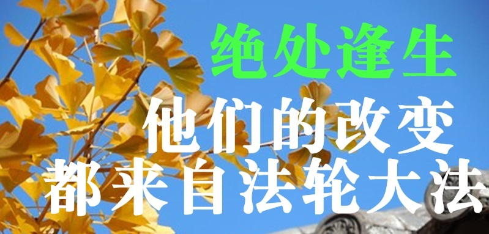

  <h3 align=center>翻墙必看 视频 http://61.228.117.175 </h3>

<a name=list><h4><a href="http://">目錄</a></h4>

<table>
<tr>
<td width=640><a href=#1>“三星”采购经理的故事</a></td>
<td width=240><a href=#1>希望之声</a></td>
</tr>

<tr>
<td width=640><a href=#2>中国大陆一位医学教授的自述</a></td>
<td width=240><a href=#2>希望之声</a></td>
</tr>

</table>

<a href=#list><h4 align="right">回目錄</h4></a>

<a href=#list><h4 align="right">回目錄</h4></a>

<a name=2><h2 align="center"><a href="http://">中国大陆一位医学教授的自述</a></h2>

人生苦短一场空 珍惜机缘到来时

【希望之声2018年10月26日】（本台记者慧光综合报导）

我出生在中国大陆，自幼喜欢读书，长大后考上了医科大学，毕业后留校并在省级三甲医院工作，是一名内科大夫。工作四年后又考上了国家重点医学院的研究生，读完硕士接着读博士，毕业后还是留在学校任教。三十二岁时晋升为副教授，是当时学院最年轻的副教授，被称为最有才华的教师。今年五十多岁了，早已升为医学教授。我从事过临床医学的实践和研究（包括对癌症的研究），以及处于现代医学科研尖端的分子细胞学研究，后来转为研究传统中医学。

我的一生比较顺利，工作、事业、家庭等方面都是风风光光。业余爱好也很多，琴、棋、书、画、武术等样样都会点儿，虽然不精，足以自乐。但我最大的爱好还是博览群书，古今中外，正史野史，只要能接触到的我都会研究。

虽然我是医生，可是对《易经》却十分投入，甚至达到如痴如醉的程度，购买了很多与此有关的书，而且预测越来越准，在当地颇有名气。突然有一天我被一个问题惊醒：既然人的一生、人的行为都能预测出来，说明这一切都是安排好的，那是谁安排了这些事情呢？难道人的命运真是天注定吗？难道真有“高级生命”存在？神佛真的存在吗？我从小就接受无神论教育，从心理上对这一切都是否定的，可无数的客观现实我又不能否认。我开始迷惘，也开始寻找答案。

当时国内还处在“气功热”，我就从气功中寻找出路。习练了多种气功，走访了不少民间“高人”，见过不少“奇人”，可没有一位能解开我心中诸多的“为什么”。后来我又研读了古代的佛道经典书籍，知道真正的正法大道都在深山里，所以就在心中发了一愿：等我儿子上了大学，我就远离世俗，进山寻道。

1996年，我来到北京读博士，在读书与科研之余，也留心观察着与修炼有关的事情。

1997年7月初的一天早晨，我在散步时，突然听到了一种祥和的音乐，循声找去，发现有一群人在双盘打坐，我被深深吸引。一位辅导员热心走过来向我介绍说这是法轮功，并无偿送我一本《转法轮》书，嘱咐我一定要一口气儿读完。

回到宿舍后，我迫不及待的开始读《转法轮》，读了几页我就明白了，这就是我一直苦苦追寻、发誓进山寻觅的大道正法，我当时激动的泪流满面。我用了一天的时间，一边看一边流泪，第一遍就是哭着读完的。书中的内容解开了我心中的一个个疑团，越读心里越豁亮。其中有关大周天、卯酉周天、元婴、性命双修、玄关设位、天目层次以及佛与道等法理，都是我闻所未闻的。我知道这就是高层次的修炼秘法，这是一部天书，我没有丝毫犹豫，当时就下决心走入修炼。

看书后的第三天，在夜晚入睡前的朦朦胧胧中，我看到有一个人影来到我的床边，似乎是依依不舍的在向我祈求着什么，把我吓醒了。我马上意识到这就是过去招惹的不好的灵体，它曾经在《易经》预测上帮过我，现在它当然不肯轻易离去。第二天，我焚烧了家里所有的与《易经》有关的书和那些假气功书，并烧了我亲自撰写的三十万字的《易医与人体科学》书稿。当天晚上我就做了一个梦，梦境至今仍然历历在目：成群的虎狼蛇等动物追我，跑着跑着我就飞了起来，越飞越高，越飞越高……，下面的动物变的越来越小。在空中我心生一念，不能让这些东西祸害人间，于是伸手发出功来，瞬间就将它们化为灰烬。我知道我过去读过的乱七八糟的书太多了，学过的东西太杂了，身体带的各种信息太乱了，如果不是师父把这些东西都给清理了，我可能永世都不能修炼了。

通过学法，我明白了修炼的真正内涵，时时刻刻按照“真、善、忍”的标准要求自己，从做好人做起，处处与人为善，工作兢兢业业，身体越来越强健，精神境界也得到不断升华。

修炼以后，大法也为我打开了一个全新的世界，使我对人体、生命等科学有了更深入的认识。

我是医学领域的专家，对现代医学的研究已经很深入了，可是面对众多的疾病仍然束手无策，甚至连它们的发病机理都只能推测，经常是眼睁睁的看着病人无奈的离去。

1998年，我参与了国内一万多人修炼法轮功后的祛病健身调查。我们按照现代科学研究方法设计量表、统计数据，得出的结论令人振奋。有很多癌症患者修炼后痊愈了，很多高血压患者血压正常了，有的是冠心病好了，有的是脑血栓后遗症痊愈了。更令我惊奇的是，几乎所有过了更年期的女士重新来了例假，出现了返老还童的变化。总的祛病有效率达到了百分之九十以上，一切都太令人惊奇了！

做医生的都知道，普通的发热、感冒属于自限性疾病，不治也能好，服药治疗只是缩短病程；对于常见的高血压、肝硬化、冠心病、糖尿病等，只能靠长期服药控制病情；对于像痛风、系统硬化病、红斑狼疮等疑难病，现代医学没有有效的治疗方法。至于说各种癌症，治疗的结果多半是人财两空。这些只有在“神话”中才能治好的人类疾病，作为一名医学教授，我却亲眼目睹了他们因修炼法轮功而恢复了健康。尤其是只要诚心念“法轮大法好，真善忍好”，同样能逢凶化吉，这是多大慈悲、多大机缘啊！

像冠心病、脑血栓、癌症等都能经CT、核磁共振、B超、化验等设备检查证实，都是肉眼可观察到的有形病，可是修炼大法后，这些病消失了，这难道不是现实版的“神话故事”吗？！

在修炼中，我还见证了许多修炼者遇难呈祥、车祸中平安无恙的实例，其中我儿子（当时是大二学生）也曾经遭遇车祸，那是一场不死也残废的车祸，在公路上被快速行驶的汽车迎面撞出去很远，头部又重重的摔在柏油马路上，结果是化险为夷。

在人生的长河中，很多人一直在寻找一种能解开人生之迷的“钥匙”，为此经历着生老病死的折磨，经历无数的精神痛苦和无奈选择。当遇到真正的机缘时，请千万别匆匆走过，认真读一读《转法轮》，一切答案尽在其中。他会掸去你数次轮回的封尘，唤醒你来世间的夙愿。

责任编辑：靳同

<a href=#list><h4 align="right">回目錄</h4></a>

<a name=1><h2 align="center"><a href="http://">“三星”采购经理的故事</a></h2>

三星集团越南采购部经理

【希望之声2018年10月23日】（本台记者慧光综合报导）她是国际著名的“三星”集团越南采购部经理，也称得上是“女强人”。但她的成功与家庭背景无关，而是源于她顽强的意志和倔强的性格，因为她从小就有远大的志向，渴望像男人一样做事，做成功人士。

她酷爱学习，毕业于越南岘港大学，这是越南中南部地区最大的高等学校。凭着优异的成绩，毕业后她进入一家属于新加坡财团的外国公司工作。之后她又到中国广东省的一家公司工作了两年，担任质量监督检验工程师。

在积累了丰富的专业知识和管理经验之后，她如愿进入“三星”集团工作。当事业稳定之后，她于2009年结婚成家，结束了漂泊生活，将自己安顿下来。

2012年，她进入公司管理层，之后工作越来越多，压力也越来越大，各种矛盾带来诸多烦恼，导致她疲惫不堪，脾气也变得暴躁，时常对员工进行责骂。即使回到家中，也时常与丈夫发生口角。她也意识到大多数情况下都是自己不对，可是不由自主，无法控制，最后总以工作繁忙为借口作为开脱的理由。

就在这一年，她怀孕了。虽然一切都在预料之中，没想到后来的情况是那样的错综复杂。怀孕六个月时她被任命为经理，怀孕八个月时却被诊断出患有妊娠期糖尿病，这一点也不奇怪，她的祖母和父亲都是糖尿病患者。

妊娠期糖尿病患者一般有多食、多饮、多尿的症状，可是她经常呕吐，厌倦饮食，但为了胎儿的营养而又不得不多吃。体内葡萄糖不能被很好利用同时分解过快，体能就无法得到充分补充，她时常感到很疲倦。更大的压力是对孩子出生后的发育会造成不良影响，使她忧心忡忡。

为了避免悲剧发生，她不得不遵照医生的嘱咐，每天要去健身房锻炼，然而这样做的结果并没有使身体变好，而是更加疲惫和虚弱。那期间她就是在极度痛苦中度过的。繁忙的工作并没有因她的情况特殊给她提供喘息的机会，而孩子的压力和越来越糟糕的身体状况也让她喘不过气来。

有一天她突然意识到，如果身体不行了，成功与否还有什么意义？财富多少有什么意义？于是她茫然了，不知道该怎么办。当她知道自己无法拯救自己时，她终于体会到，没有健康什么都谈不上。可是健康的出路在哪里？经多方努力和尝试之后，她一次又一次的失望了。

后来有一天，一个偶然的机会姨妈与她住在了一起。姨妈每天都练习一种气功，动作轻柔舒缓，优雅流畅，后来知道这是法轮功，她开始以为这是老人的一种锻炼方式，并没有引起重视。时间长了才发现，姨妈尽管年事已高，可是心态平和，精力充沛，健康开朗，这让她感到很好奇。

故事的主人公在阅读《转法轮》

在姨妈的推荐下，她开始阅读法轮功的主要指导书《转法轮》。她说：“读书过程中，自己有一种莫名其妙的感觉，就好像被淹没在波涛汹涌的大海中，突然遇到了救生圈一样。潜意识中告诉她，如果不抓住这个机会，就没有希望了。”这种奇妙的感觉促使她看了一遍又一遍。

非常神奇的是，一个月后，当她再去做健康检查时，被告知各项指标都正常了，糖尿病的症状消失了。这让她感到非常震惊，一直无法解决的痛苦和烦恼在不知不觉中就无影无踪了，一向善于思考的她被法轮功的强大内涵深深的吸引了。

故事主人公在练习法轮功第五套功法——静功

“修炼”对她来说本是一件陌生而又遥不可及的事情，而《转法轮》的神奇和“真、善、忍”的美好却让她看到了一个崭新的绚丽多彩的世界。当她用“真、善、忍”的原则指导自己的行为时，不仅仅是身体上出现了巨大变化，思想上的变化也出乎意料，而工作中也受益匪浅。

她说：“我的工作需要灵活的应急处理能力，从产品交付到空运、公路运输和海运，我必须确保采购和运输过程中的科学运筹管理都要做到最佳，而仅靠我一个人的力量是无法完成的，这需要一个强有力的团队。作为管理者，营造一个诚信的氛围和高效的工作环境就变得至关重要。”“多亏了大法给了我智慧，我感到我的思想是开放的，我可以忘我的工作而不感到疲倦，这在之前是做不到的。”

因为拥有健康的身体和旺盛的精力，后来她又生下了第二个孩子，同样是健康活泼，没有受到疾病的任何影响。

故事主人公的全家福合影，一家人其乐融融

她说：“当我放弃自私和自我时，我才明白真正的幸福是什么。法轮功将我从疾病和痛苦中解脱出来，并引导我走上了一条光明的人生旅途，我为我的余生感到幸运。”

“完全超出想象的是，大法修炼为我的工作和生活提供了一条完美和谐的解决方案。每天学法炼功，让我心态平和，平静宽容。而在修炼的同时，我仍然可以做一个敬业的管理者和一个拥有幸福家庭的女人。”

“在此分享个人的美好经历，就是想让世界上的善良人都知道，《转法轮》是一部无比珍贵的奇书，他能帮助人创造这个世界上的任何奇迹。”

（本文根据DKN.TV报道翻译整理）

b_ornament_24_0M.png
