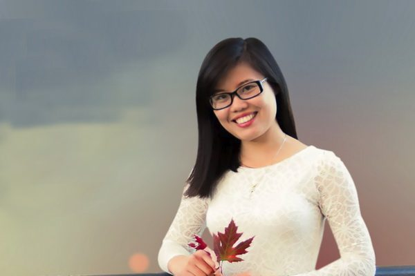

  <h3 align=center>——不期而遇的相逢，就是上天的有意安排。翻墙必看 视频 http://36.227.102.73 </h3>

<table>
<tr>
<td>
目前，虽然科技、医术高度发达，疗养保健条件特别优越，运动方式方法多种多样，可是，在很多疾病面前，依然是无能为力，很多人仍然生活在病魔缠身的悲苦之中。尤其是还有很多人因为贫穷治不起病，只能等死。

也可能有人会说，人各有命， 在现实社会中，常人也有长命百岁、绝处逢生的；在名山大川中，修炼人也有几百岁，甚至几千岁的。这的确是事实。但是，这毕竟为数甚少，屈指可数。

法轮大法（也称法轮功）不是专门治病的一般气功。法轮大法是真正性命双修的佛家修炼大法，以宇宙特性“真、善、忍”法理为指导，辅以简单优美的五套功法，可以使学炼者身心健康，道德回升，开智开慧，达到洞悉人生和宇宙奥秘的自在境界。

一九九二年至一九九九年，法轮大法（也称法轮功）传遍神州大地，“真、善、忍”法理使一亿修炼者身心净化，道德升华。一九九五年三月，李洪志先生应邀到法国传功讲法，开始了法轮大法在海外的传播。如今法轮大法已洪传世界一百多个国家和地区。

法轮功在祛病健身方面有着普遍的神奇的效果，早在一九九八年，大陆医学界就为此作过五次医学调查，其后，北美及台湾的医学工作者也做了相关的健康调查。结果显示，法轮功祛病健身总有效率高达98%。

明慧网等媒体报道中，有无数事例证实，法轮大法不但能使人祛病健身有奇效， 而且在常人看来不可思议不可理解的事情，在海内外亿万修炼者群体中可以说是比比皆是。这其中就有无数各界精英罹患顽疾和绝症，可是，他们因各种因缘际遇修炼法轮大法（也称法轮功）之后，都得以绝处逢生，获得了身心的健康。

（转载希望之声）

</td>
</tr>
</table>

<a name=list><h4><a href="http://">目錄</a></h4>

<table>
  <tr>
<td width=640><a href=#1-1>国保警察的觉醒：从参与迫害到修炼法轮功</a></td>
<td width=240><a href=#1-1>明慧网</a></td>
</tr>
  
 <tr>
<td width=640><a href=#1-2>被病折磨八年的我一个星期康复了</a></td>
<td width=240><a href=#1-2>明慧网</a></td>
</tr> 
  
 <tr>
<td width=640><a href=#1-3>百岁老人绝处逢生的故事（一）</a></td>
<td width=240><a href=#1-3>明慧网</a></td>
</tr>   
  
 <tr>
<td width=640><a href=#1-4>百岁老人绝处逢生的故事（二）</a></td>
<td width=240><a href=#1-4>明慧网</a></td>
</tr>  
  
<tr>
<td width=640><a href=#1-5>百岁老人绝处逢生的故事（三）</a></td>
<td width=240><a href=#1-5>明慧网</a></td>
</tr>    
  
<tr>
<td width=640><a href=#1>“三星”采购经理的故事</a></td>
<td width=240><a href=#1>希望之声</a></td>
</tr>

<tr>
<td width=640><a href=#2>中国大陆一位医学教授的自述</a></td>
<td width=240><a href=#2>希望之声</a></td>
</tr>

<tr>
<td width=640><a href=#3>【传奇人生】人生无悔 篮坛宿将(王金菊)的故事</a></td>
<td width=240><a href=#3>希望之声</a></td>
</tr>

<tr>
<td width=640><a href=#4>法国女博士找到了人生中的新答案</a></td>
<td width=240><a href=#4>希望之声</a></td>
</tr>

<tr>
<td width=640><a href=#5>最顶级的心脏病专家如何治好自己的心脏病</a></td>
<td width=240><a href=#5>希望之声</a></td>
</tr>

<tr>
<td width=640><a href=#6>从悲苦人生中走出来的白领</a></td>
<td width=240><a href=#6>希望之声</a></td>
</tr>

<tr>
<td width=640><a href=#7>优昙婆罗花开放在我家</a></td>
<td width=240><a href=#7>希望之声</a></td>
</tr>

<tr>
<td width=640><a href=#8>突遇绝症疑无路 起死回生话感恩</a></td>
<td width=240><a href=#8>希望之声</a></td>
</tr>

<tr>
<td width=640><a href=#9>一位职业赌徒和吸毒者的回归路</a></td>
<td width=240><a href=#9>希望之声</a></td>
</tr>

<tr>
<td width=640><a href=#10>一位奥地利吸毒女青年的新生</a></td>
<td width=240><a href=#10>希望之声</a></td>
</tr>

<tr>
<td width=640><a href=#11>半导体科技人为何走入修炼</a></td>
<td width=240><a href=#11>希望之声</a></td>
</tr>

<tr>
<td width=640><a href=#12>硅谷工程师对健康无病的体悟</a></td>
<td width=240><a href=#12>希望之声</a></td>
</tr>

<tr>
<td width=640><a href=#13>胰腺癌患者的新生</a></td>
<td width=240><a href=#13>希望之声</a></td>
</tr>

<tr>
<td width=640><a href=#14>一位女商人的自白：她曾为自己准备葬礼</a></td>
<td width=240><a href=#14>新生网</a></td>
</tr>

<tr>
<td width=640><a href=#15>女硕士绝处逢生的奇迹</a></td>
<td width=240><a href=#15>新生网</a></td>
</tr>

<tr>
<td width=640><a href=#16>一级残疾盲人重见光明</a></td>
<td width=240><a href=#16>新生网</a></td>
</tr>

<tr>
<td width=640><a href=#17>返老还童不是神话</a></td>
<td width=240><a href=#17>新生网</a></td>
</tr>

<tr>
<td width=640><a href=#18>癫痫儿成帅哥</a></td>
<td width=240><a href=#18>新生网</a></td>
</tr>

<tr>
<td width=640><a href=#19>走出“渐冻”绝境的生命奇迹</a></td>
<td width=240><a href=#19>新生网</a></td>
</tr>

<tr>
<td width=640><a href=#20>法轮大法将我从绝症的魔掌中救出</a></td>
<td width=240><a href=#20>新生网</a></td>
</tr>

<tr>
<td width=640><a href=#21>丢掉双拐 重返岗位</a></td>
<td width=240><a href=#21>新生网</a></td>
</tr>

<tr>
<td width=640><a href=#22>六十多年的皮肤顽疾根除</a></td>
<td width=240><a href=#22>新生网</a></td>
</tr>

</table>

<a href=#list><h4 align="right">回目錄</h4></a>

<a name=1-5><h2 align="center"><a href="http://">百岁老人绝处逢生的故事（三）</a></h2>
【明慧网二零一八年十月二十七日】（明慧网通讯员综合报道）目前，虽然科技、医术高度发达，疗养保健条件特别优越，各种体育锻炼运动方式多种多样，可是，在很多疾病面前，依然是无能为力，很多人仍然生活在病魔缠身的悲苦之中。尤其是还有很多人因为贫穷治不起病，只能等死。

一九九二年至一九九九年，法轮大法（也称法轮功）传遍神州大地，真、善、忍法理使一亿修炼者身心净化，道德升华。有无数事例证实，法轮大法祛病健身有奇效，而且出现许多在常人看来不可思议的奇迹。这里列举百岁老人罹患顽疾和绝症，因缘际遇修炼法轮大法或诚心敬念“法轮大法好，真善忍好”之后，都得以绝处逢生，获得了身心的健康。

法轮大法是真正性命双修的佛家修炼大法，以真、善、忍法理为指导，辅以简单优美的五套功法，可以使学炼者身心健康，道德回升，开智开慧，达到洞悉人生和宇宙奥秘的自在境界。早在一九九八年，大陆医学界就为此作过五次医学调查，其后，北美及台湾的医学工作者也做了相关的健康调查。结果显示，法轮功祛病健身总有效率高达98%。

<b>（十一）百岁老人告别沉疴返老还童</b>

有一位百病缠身的老人，自从一九九三年四月十三日开始修炼法轮大法后，告别了沉疴返老还童。

七十八岁开始修炼前，老人是一位体弱多病、百病缠身的残废人。

老人自婴儿八个月开始便生骨瘤，在当时缺医少药的情况下，家人用尖针这土办法，使左手的肘关节、右腿膝关节长出了骨头。老人还患过肾结石、肝硬化、风湿心脏病、眼动脉硬化、飞蚊症、多年顽固的胃病。在胃病发作痛得难以忍受时，曾经用鸦片止痛，第二次再用时已不见效了。老人因痛得不想活而上吊过，幸得及时发现，被儿子救活了。由于疾病的折磨，老人对人生都绝望了，很多次都想一死了之。

一九五八年老人的胃被切除了三分之一，前后共做过六次开刀手术。一九七八年又被自行车撞断了第四节腰椎，瘫痪了半年，长期住院。走路弯着腰，走两步要休息，走三步喘大气。经常要家人抬上楼或背下来。

一九七九年后气功开始兴起，老人为了祛病，什么功都去学，但都改变不大，无济于事。

一九九三年四月十三日是老人终生难忘的日子，李洪志老师把法轮大法传到老人所在的城市，老人第一个报名参加第一期学习班。李老师见到老人时，亲切地用手轻轻抚摸着老人的头和被风湿折磨得几乎不能活动的膝关节。李洪志老师慈祥地安慰老人，叫老人不要怕，不要总想着病，鼓励老人要坚持修炼……奇迹出现了，当时老人马上能站立起来，全身感到很轻松，突然变成了一个健康的人。老人知道这是他寻找多年的高德大法，真是太神奇了。

老人听了李老师的话后，明白了自己的病是因为自己生生世世造下的业。老人下定决心，通过修炼净化身心。从第一期到第五期学习班，老人都参加了。而且老人的身体也一期比一期好。从进班之日起，老人就甩掉了药包，与医院断绝了关系，坚持在家修炼功法，因家里四代同堂，家人要看电视，老人就在夜晚十二点以后才炼功，每天坚持学法和炼动功两个小时，炼静功一个半小时，每晚都是三点半以后才睡觉。

在修炼中老人经常看到老师法身来到身边，鼓励他，要按真、善、忍的宇宙特性修炼，返本归真。老人一心一意地专一修炼法轮大法，是法轮大法给了老人新的生命，也改变了他的性格。他从一个孤僻、小气、执著而又悲观的人，变的开朗、大方、乐观向上。老人以前烟吸得很厉害，修炼后全戒了。白头发也长出了黑头发。人轻松多了，家住在七楼，他独自上、下楼也不觉得累，家里人十分高兴，说法轮大法使老人返老还童了。

法轮大法多次给了老人生命，老人和法轮大法结下了良缘，老人要用洪扬大法的实际行动来报答李洪志老师的解救之恩。老人把自己修炼的体会和修炼后身体变化的好消息，告诉了远在美国的亲人，给他们寄去了法轮大法的宝书和学习资料，旅居美国的二十多位亲戚都积极投入法轮大法的修炼中了。在美国居住的孙婿的前列腺病，侄儿的心脏病，姨甥的胃出血等，都在修炼法轮大法后痊愈了。真是佛法无边，修者自得啊。

法轮大法使老人一家四代以及远在美国的亲戚都走上了修炼的道路，老人决心在有生之年努力精進，不断地洪扬大法，让法轮大法的光华照耀世间。

<b>（十二）百岁老人临终前起死回生</b>

天娇老人，出生于一九零七年六月，二零零九年时一百零二岁，历经满清、中华民国和中共邪党窃取政权后的三个朝代，已属三朝老人了。当年她膝下有一位八十岁的儿子、七十五岁的大女儿和七十二岁的小女儿。

小女儿一九九六年五月开始修炼法轮大法，在大法修炼过程中获益感慨万千，不言而喻。后来小女儿的哥哥和母亲也走进了修炼大门，每天他们炼功前，小女儿都先念《转法轮》给他们听。

有一天，天娇老人将自己身边携带的一个布旅行袋里的药品全部倒在脸盆里，只见红、黄、绿、蓝各种颜色的药丸，还有不知名的药一并掺进水，一股脑儿往厕所里倒去──用不着了。这时小女儿看到母亲要跟师父走修炼路的决心和坚定信念，感到由衷高兴。

在天娇老人消业过关时，小女儿经常念《转法轮》中“治病问题”[1]或念同修在修炼中勇闯病业关的事迹给她听，鼓励她，在消除生生世世的业力中，叫她念大法师父讲的话：“难忍能忍，难行能行”[1]。在老人以坚强的意志强忍着痛苦过业力关时，大法师父也在保护着她，使她能顺利的走过一关又一关，小女儿为母亲如此坚强能战胜病业所感动。

可是，九十多岁的老人学炼五套功法确实不易，教会后面的动作，忘了前面的动作，真是比教幼儿园的小朋友还难。小女儿花了一番功夫啊！小女儿初期教母亲学炼五套功法时，经常急的叫起来，不耐心。后来，着急也不叫了，只是背后流眼泪，求师父帮助。但是不管怎么样难，小女儿心里从来没有想放弃，坚定一念一定要教会母亲，几个月来她母亲每天坚持炼动作，终于九十多岁的母亲能自己听炼功音乐炼动作了！

后来，大女儿把老人接到她家住时，小女儿将师尊的宝书《转法轮》送给她，放在枕头下（母亲眼睛看不清字）并一再叮嘱要诚心默念“法轮大法好，真、善、忍好”。那段时期，小女儿忙也没经常去看望母亲。

一九九九年“七二零”，中共邪党铺天盖地的谎言造谣污蔑法轮大法。在江鬼邪党的淫威下，天娇老人被迫放弃了修炼，病又复发了。小女儿叮嘱她母亲心中牢记“法轮大法好，真、善、忍好”，她母亲能接受。

二零零六年三月，天娇老人住外甥女家，二十八日晚小女儿接到一个电话说母亲病危，可能要走了，明天见最后一面吧。放下电话，小女儿心里很沉稳拨个电话给同修珊，她们在约定的时间地点来到外甥女住处，见母亲已躺在地上，面目皆非，要走的前兆。小女儿没动心，珊搀扶着老人向她耳边呼唤：“我是珊，你念‘法轮大法好，真、善、忍好’。”小女儿面对母亲席地而坐，平静的发正念，感到整个空间场被“法-轮-大-法-好，真-善-忍-好”覆盖。

一秒一秒、一分一分，十分钟，二十分钟，四十分钟，终于，“真-善-忍-好”从老人紧闭的嘴唇慢慢的吐出，随着“法轮大法好”也从颤动的嘴唇说出来。渐渐的老人能发出比较清晰的声音：“法轮大法好”，“真、善、忍好”，声音也流畅了。凹下去的眼睛渐渐睁开了，知觉恢复了。几个小时后，她感觉饿能吃点稀饭了。小女儿与珊对师尊救命之恩充满无限感激！这不是伟大佛法救度众生在人间的展现吗？在场目睹这一切过程的还有大姐、姐夫、大外甥女。

当年六月底一个傍晚，珊又电话告之天娇老人病危，说老人瞳孔已扩大，舌头已萎缩二分之一，只见吸气不能呼气，情况十分危急。此时小女儿身处广州，飞机飞回去，飞行过程中，她心里坦然平静守住一念：一切求师尊安排。下机直向她母亲住所养老院奔去，时间是晚上九点三十，只见到母亲孤瘦的身体直直躺在床上，面目早已失去真容。

小女儿双手搂着母亲，嘴贴在她耳边大声喊：妈妈快念“真、善、忍好，法轮大法好”呀！她一个字一个字的对她耳边呼唤。她心中充满阳光，没有任何的畏惧胆怯，忘记了旅途的劳累、饥饿（还是上午吃的饭），只有一种强烈而坚定的信念：法轮大法一定能除尽一切邪恶，伟大的佛法一定能救母亲！她不停的呼唤：“法轮大法好！真、善、忍好！”一边给她母亲换尿湿的尿布，擦洗身体。也不知过了多少时间，终于“真、善、忍好”从母亲紧闭的嘴唇挤出来了，接着“法轮大法好”也一字一字吐出来了。此时，小女儿情不自禁的哭了，激动的搂着妈妈说：妈妈，又是大法师父救了你呀！

整个晚上小女儿就在母亲床前水泥地上度过的，只要她哪不舒服、叫痛，就用手抚摸她，并叫她一齐念：“法轮大法好！真、善、忍好！”时不时的尿湿了，又给她换尿布，擦洗，渴了喂点水，尽量使她感到身体舒服些。清晨六点她渐渐安静入睡了，醒来时眼睛也能睁开认识人了，早上也能吃一点稀饭了。

从高龄老人的生病──病危──救活，这是一个怎样的奇迹！不吃一粒药，当众好转过来了；几十年的脸部三叉神经痛的顽症不翼而飞了，从此也不感冒咳嗽了。这是伟大的佛法，伟大的师尊从一九九二年传法轮大法以来救度千千万万、万万千千生命中的一个真实事例啊！

在这所福利院里住着两百多名老人，天娇老人住的大房间内有十三位年龄不等的老人，还有每天三个轮班的服务员和出入的医务人员，养老院的几位领导以及闻讯从外地赶来看望母亲的大哥，他们都能作证，是法轮大法师父再次救了天娇老人的命！

从那以后，天娇老人每天诚心默念“法轮大法好，真、善、忍好”。她还有感而发，发出了来自内心的呼唤：法轮大法真正好！法轮大法救苦救难救人民！这是一位一百零二岁的老人心灵的呼唤啊，这是老人对无比伟大的师尊无上敬仰啊！是她源于心底对宇宙大法衷心歌颂啊！

如今，天娇老人在福利院内还能伴随着步行器每天慢步往返二百米。一边走，一边默念着“法轮大法好，真善忍好”。

注：
[1]李洪志师父著作：《转法轮》

<b>（十三）山东百岁老父起死回生的经过</b>

二零一四年七月二十二日傍晚，一位山东大法弟子冒着酷暑，千里迢迢赶回老家，进门见众亲属都在，且都是一脸的无奈。她便急速跑到近百岁的父亲房里，只见父亲安静的闭眼躺着，喊了几声“爸爸”也没回应，眼角却流泪了。这时老人女儿明白：父亲因她这个女儿，受到邪党恫吓、威胁、凌辱，同样经受着剜心透骨的苦痛。

这位百岁老人近两年来只是保持沉默，心中却时刻牵挂着他的掌上明珠。

百岁老人的女儿对众亲属说“大家辛苦了！我来照看老人，你们都回去休息吧。”

亲属们陆续的走出，只剩下百岁老人和女儿。女儿取出MP5开始播放大法师父在广州的讲法录像第一讲，并发出一念：“要让父亲再次证实大法的神奇！”

音乐响起，法轮转动，师父打起妙不可言的大莲花手印。霎时父亲睁开双眼，右手哆哆嗦嗦伸向床前，从女儿手中抓到了MP5，双手抱在胸前，紧紧贴在了心口上，激动的泪流不止。女儿想起父亲九十二岁那年秋天，他患脑血栓，住院半个月就全好了，也没留下任何后遗症。他开始信师信法，抱着师父的教功录像，念着自己的小名，真诚的退出了那个加入了近七十年的专门迫害好人的中共邪党，激动不已。

看完师父讲法的第一讲后，老人吃力的说“舌头不得劲”，女儿撑开他的嘴巴，看到舌面上有几粒干药片，就给他抠下来了。并给他喝了点水。这时父亲告诉女儿：“我看见咱家这几天来了个女菩萨，女菩萨说一切都安排好了。我是个凡人，不知道说啥好，有点儿害怕。”

晚饭后他们又听了师父在济南讲法录音的第一讲。随后父亲跟女儿说：“真没想到你今天赶回来看我，更没想到你身体越老越棒了。”女儿趁势说：“这都是师父安排的呀！你说好不好？”父亲又点了点头。女儿说：“咱们家人都是托师父的福才有今天，你一定要嘱咐咱们家人都积德行善，三退保命保平安！”父亲也点头应允。不一会儿父亲就静静的睡着了。后半夜，随着父亲的“哎哟”声，女儿看到他的左腿在一抻、一蜷的动。女儿明白这是师父在给他清理身体，消除病业。他一会儿让女儿把他倒向这边，一会儿倒向那边，在大床上转圈圈儿。喝水、倒尿、翻身，整整一夜没有合眼。

第二天早上，亲人们都来问候老人，女儿让父亲把腿伸直给大家看看。父亲用力一蹬，一缩，轻松自如的伸展着。大家半信半疑的说：“怎么好的这么快？！”女儿说：“是大法师父给他治好的。”女儿的弟弟还是不相信，他甩下一句话：“他九天没大便了，你看着办吧。”

女儿知道他是话中有话。父亲也说：“你让女菩萨给我顺顺肚子里的气吧？”女儿叫他快念“法轮大法好，真善忍好”，女儿明白自己干涉不了别人的生活，左右不了别人的命运，不停的在心里默念着师父的法：“难忍能忍，难行能行”[1]，旅途的困倦随之消失。

吃过早饭，女儿就坐在床前读《转法轮》第一讲、第二讲，下午又读了《转法轮》第三讲、第四讲。女儿坚信师父肯定为父亲净化身体了。就要把老人抱到坐便器上去，可怎么也抱不动。女儿就跟师父说：“师父啊，帮帮我把他抱起来。”再一用力就把他抱上去了。不一会儿大便轻松排出。女儿为父亲擦洗干净，再把他抱到床上。清理完毕，父亲就感动的说：“就是你最好，没有人能和你比，不怕脏，不嫌累，叫干啥就干啥，服务态度很好，给你添大麻烦了……”女儿回答：“这是我应该做的，师父教我这样做啊！你说这个功法好不好？”父亲不住的点头认可。

弟弟知道此事后，还是不相信，反复向父亲追问核实。父亲告诉他：“我的肚子里的气都排出去了，可通畅了。太神了！”一切都确认是真的以后，弟弟闭口不说话了，后来对姐姐的排斥、刁难、怨恨烟消云散了。

注：
[1] 李洪志师父著作：《转法轮》

<b>（十四）长沙百岁老人身心安康的秘诀</b>

湖南长沙地区有位一百零二岁（二零一二年）的老人，身体健康，头脑清晰，脸上光光的、白白的，家里洗洗涮涮的活，百岁老人都能干。人家说“家有老，是个宝。”老人的健康长寿真是儿女们的福气呀！若问她老人家有什么秘诀，其实就是老人家她相信法轮功好，诚念“法轮大法好”得的好。

常言道：老人摔不起。而这位老人曾有几次摔得够猛的，所幸每次都有惊无险，逢凶化吉。有一次，老人和女儿一起去超市买布鞋，不小心摔在地上，摔破了后脑勺，流了很多血，老人当时昏过去了。周围的人看见老人摔的这么狠，个个都在担心：这么大年纪，能受得了这一摔吗？一定是“凶多吉少”了。当时女儿急忙在母亲耳边说赶快念“法轮大法好，真善忍好！”这时，老人睁开眼，轻声对女儿说，她在念大法好，没事儿。很快，血止住了，老人说一点也不疼，还说要吃东西，象没事一样。

女儿领着母亲到社区医院包扎伤口。医生很惊讶，不停地说：“摔的这个地方好险啊，就是年轻人都危险的很哪，可现在这位百岁老人摔的这么重，怎么却没有事一样呢！”女儿告诉医生说：“我以前有严重的膀胱炎、子宫下垂，家务不能干，连个拖把也不能拿，得开刀治疗，这些病真让我受了不少罪，后来我炼了法轮功，全都好了。我觉得法轮大法太神奇了，便告诉我母亲诚念‘法轮大法好、真善忍好’，这次正是法轮功师父保护了母亲呀！”医生和很多在场的人听说后，都称法轮功真神奇！

还一次，是老人的侄儿二零零九年生日那天，他们一家人聚在一起庆贺，不料老人没踩稳脚，从六楼摔到四楼，当时她脸上摔青了，胳膊也扭伤了，但老人就是天天念着“法轮大法好！真善忍好！”九个字，很快就好了。

老人常常在李洪志师父的像前双手合十，感恩李大师多次救了她的命。老人还说，七八十年前她生孩子时得了腰痛病，自从她诚念“法轮大法好”以后再也没有痛过了。

老人对真相护身符也特别敬重，每次洗澡前，都要将护身符小心翼翼地取下来，洗完了，又恭恭敬敬地挂在脖子上。百岁老人对法轮功诚心相信和敬仰，这就是她身心安康的秘诀，全在这颗对大法的敬重之心上了！

善与恶，福与祸，就在一念之间。法轮大法是佛法，相信法轮大法好，就是人的“善念”。真心希望所有人都能了解真相，摒弃中共诬蔑之词，记住“法轮大法好、真善忍好”，保住这一善念，定会带给您无比的喜悦和幸福。

<b>（十五）青岛百岁老人喜得大法获新生</b>

山东青岛市北区有位老太太，八十六岁老人喜得大法获新生。

得法前，她患有脑梗塞，供血不足，多年来每年都得打十几个吊瓶，天天吃药维持。二零零三年七月份，老人突然头晕目眩，眼冒金花，不能动了，到医院紧急抢救，经做CT等多种检查，医生说脑血管大面积坏死，属老年病，也没有好办法。在医院治疗了一段时间后仍然不能动，紧接着八月份又一次发病更厉害，经紧急抢救治疗，就在医院也没有好办法的情况下，出院回家打吊瓶维持。老人整天躺在床上不能动，连坐也坐不起来，大小便在床上，饭也不能吃了，每顿只吃一口，心里想怎么能死了，死了就不用受罪了，整天唉声叹气。

这时修炼法轮功的大女儿跟她讲法轮功的真相，说只有法轮大法才能救你。老人因受电视宣传的毒害，开始是抵触不信。女儿告诉她，法轮功教人修心向善做好人，做事为别人着想，遇到矛盾找自己，祛病健身有奇效……渐渐老人明白了真相和一些法理，女儿就教她念“法轮大法好”、“真善忍好”，老人天天念，晚上睡不着觉也念。就这样一个星期后奇迹出现了，在床上躺了两个多月后，老人能下床站一会了，紧接着要饭吃，一气吃了十三个大水饺还要吃。女儿不让吃了，接着她走出了自己的房间（在老人病重期间，眼不能见光，耳朵不能听声音，整天拉着窗帘在黑黑的房间里躺着），十多天后所有症状全部消失。

老人高兴的说：“法轮大法太神奇了，要是慢慢的好，我可能还不会相信是大法的威力，可只要真正从心里想，念‘法轮大法好，真善忍好’，我这医院都治不好的病就突然间好了，这真是法轮大法救了我的命。”

老人心里也亮堂了，也有精神了，晚上做梦都梦见李老师在给她消业。一个月后，她洗澡换下的衣服也不用别人洗了，她对大女儿说：“我有病期间耽误了你看书学法，现在我自己能洗，你好好看书好好修，要对得起师父的慈悲救度。”

后来，老人就开始听老师讲法录音，渐渐的老人听进去了，越听越爱听，说老师讲的那么好。老人能吃能喝能干，就这样持续了半年。在二零零四年三、四月份，连续四、五次消大业，其中有一次晚上又出现了以前抢救时的症状，头晕目眩呕吐不能动了，家里其他人都害怕极了，儿女们来到老人床前说到医院看看吧，老人却说：“以前也不是没去过，我这病医院都说治不了。”女儿问她怕不怕，她说：“不怕，有老师怕什么，你们都出去吧，我睡一觉就好了。”就这样从晚上九点一觉睡到天亮，儿女们一早去看她，一看她坐在床上好好的，好像昨夜什么都没发生一样，老人和她的家人又一次见证了法轮大法的神奇。现在老人身体精神都特别好。

二零零四年在老人过八十七岁生日时，全家人都到了向老人祝寿。老人说：“我今天的命是法轮大法给的，是师父给的，没有大法我也不能开心的坐在这里，我太感动，不知用什么来感谢大法，感谢李老师，我要好好听师父的话，好好修。”

后来，全家几代人和一些知情者都从老人身上见证了法轮大法的神奇和李老师的慈悲，从江氏的欺世谎言中解脱出来，明白了真相，有的已开始走上了法轮大法的修炼。

<a href=#list><h4 align="right">回目錄</h4></a>

<a name=1-4><h2 align="center"><a href="http://">百岁老人绝处逢生的故事（二）</a></h2>
【明慧网二零一八年十月二十日】（明慧网通讯员综合报道）目前，虽然科技、医术高度发达，疗养保健条件特别优越，各种体育锻炼运动方式多种多样，可是，在很多疾病面前，依然是无能为力，很多人仍然生活在病魔缠身的悲苦之中。尤其是还有很多人因为贫穷治不起病，只能等死。

一九九二年至一九九九年，法轮大法（也称法轮功）传遍神州大地，真、善、忍法理使一亿修炼者身心净化，道德升华。有无数事例证实，法轮大法祛病健身有奇效，而且出现许多在医学界看来不可思议的奇迹。这里列举几位百岁老人的故事，他们曾罹患顽疾和绝症，因缘际遇修炼法轮大法或诚心敬念“法轮大法好，真善忍好”之后，都得以绝处逢生，获得了身心的健康。

法轮大法是真正性命双修的佛家修炼大法，以真、善、忍法理为指导，辅以简单优美的五套功法，可以使学炼者身心健康，道德回升，开智开慧，达到洞悉人生和宇宙奥秘的自在境界。早在一九九八年，大陆医学界就为此作过五次医学调查，其后，北美及台湾的医学工作者也做了相关的健康调查。结果显示，法轮功祛病健身总有效率高达98%。

<b>（六）患三癌近百岁的尹玉芝健康长寿</b>

尹玉芝吉林市人，从小没上过学，一九九六年学法轮功后，患三种癌症不治痊愈，还在不知不觉中认了字。她心地善良，从不与人发生争执。修炼后更加与人为善。

尹玉芝老人曾经是个病秧子，患有严重的心脏病、高血压、矽肺病。三十八岁时， 她受过工伤，右胳膊粉碎性骨折，里边打了钢板，几十年胳膊不能用力，伸不直。

七十三岁时，她又得了肝癌、子宫癌、卵巢癌三种癌症，经市肿瘤医院、人民医院和部队二二二医院三家会诊，仅肝癌一项医生就告诉她，已经是晚期了，她只能活三个月。那时她绝望了，她的生命马上就要走到尽头了。

她的孩子们问可否做手术，医生说，岁数太大，恐怕下不了手术台。孩子们把她安置在部队医院的高级房间里，用了所有的好药以及各种偏方。两个月下来公费医疗花费了二万多元人民币，个人又花了四万多元，可是她的病情毫无起色，孩子们也一筹莫展。

那时，她的女儿修炼法轮功了，对她妈妈说：现在只有法轮功能救你，炼炼法轮功吧。孩子讲了很多法轮功如何好。当时尹玉芝却无奈地说：好，你们就炼吧，我是来不及了。

可是，就在当天晚上睡觉时，尹玉芝在梦中却梦到法轮功大师给她清理身体，梦中的她盘腿坐在床上，大师在后背用双手对着她的后背推。第二天醒来后，因腹水很久不能坐起来的她居然能坐起来，肚子也不那么鼓胀了！她高兴的对陪护她的儿子说：快叫你姐和你妹来，她们的师父都给我清理身体了，我也要学法轮功。

因为当时尹玉芝还不能下地站立，女儿就先教她学了第五套功法“神通加持法”。就这样她在医院又住了一个星期，在这期间她每天都听几讲师父在济南的讲法录音，炼几遍“神通加持法”，动作虽然还不够标准，但是她的身体却一天天好了起来，肚子里的腹水消下去了，也能下地行走了，感觉浑身也有劲了。

仅七天的时间，身体竟然发生这么大的变化，她惊讶于这种奇迹真的在她的身上发生了！内心对大法师父的感激无法用语言表述！不修炼的孩子们以为她这是那种“回光返照”，但她心里清楚是真的得救了。

第七天的下午，她被孩子接回了家。回家后，几个孩子轮流带她到庐山、青岛、蓬莱、崂山、北戴河、南戴河等地旅游，孩子们的心思是想在她“回光返照”期间尽孝。并没有想到她真的好了起来。事后孩子们说：我们压根也没想到被医院宣布无法救治的人竟然能奇迹般的好了，更没想到这法轮功居然这么神奇！

在以后的几个月里，大法师父给她连续几次调整身体，她便出和淌出的血水能有几大洗脸盆，不修炼的孩子们以为她要病危了，忙着赶做装老衣。只有修炼的女儿们明白她是在消业。之后肝癌、卵巢癌、子宫癌都不见了。

事隔不久，一次她在梦中梦到师父让她用放在二楼东北角的小泥壶喝水，她照办了，一连几天咳出的都是黄痰，就这样她年轻时患的矽肺职业病就消失了，连三十八岁时受的工伤——右胳膊粉碎性骨折接好后有一尺多长一寸多深的疤痕也都平滑且不见了痕迹，不能伸直的胳膊也能伸直了，X光拍照钢板不见了。

还有一天，尹玉芝把脚扭了，整个左脚向里横了过来，当时她二话没说就坐在地上，用双手把脚扳了过来，脚脖子只肿了一个星期，她没打针也没吃药，只是每天坚持打坐，又能行走自如了。

九九年七月江泽民下令迫害法轮功，搞恐怖镇压，对大法师父进行栽赃、诬陷，修炼的女儿被迫害，这些都没有使尹玉芝老人动摇。她对警察说：“我的第二次生命是李大师给的。”

二零零四年八十二岁高龄的尹玉芝，修大法九年了。身体健康，精力旺盛，白皙慈祥的面孔上老年斑全部消失了，满口整齐的牙齿无一脱落，满头黑发中略有几丝白发，外表看来是如此年轻，不过六十岁模样。

八十六岁那年，尹玉芝在去市公安局为女儿讨说法回来的路上，身体一度出现昏迷和半瘫状况，被孩子们送进医院，进行了一系列的拍照和检查及化验，医生说是患了半身不遂和老年痴呆症。当她醒来时发现自己躺在医院的病床上，胳膊上还打着吊瓶，孩子告诉她已经在医院里躺了十几个小时。

尹玉芝告诉孩子：“我要回家！我有师父管我！”她拔掉了吊瓶，起身下了床，孩子无奈只好把她带回了家。回家后她每天听师父的济南讲法录音，每天坚持炼五套功法。就这样几天的功夫就痊愈了，失去知觉的身体恢复如初了。这就是大法的威力！慈悲伟大的恩师又一次挽救了她。

这是多么神奇的事儿啊！从此家里不相信大法的孩子们也开始相信了，在公安局工作的两个姑爷也转变了对法轮功的看法。看到孩子们的变化她打心里为他们高兴，为他们能够相信师父、相信大法而感到由衷的高兴。她也为自己九十多岁的人还能得到身体的康复，从内心感谢师父，感谢大法！

她常说：“是法轮大法使我生活得幸福、快乐和健康！”

如今尹玉芝已经九十四岁高龄，除了耳背（但能听见师父的讲法）之外，没有任何疾病，洗衣、做饭、打扫卫生，这些力所能及的活都自己做，从不用孩子操心。

尹玉芝这一辈子经历坎坷，没想到老来得福，她庆幸自己绝望时选择修炼法轮大法。尹玉芝说：“我经历了近一个世纪的世态变迁，看透了人间百态。种瓜得瓜、种豆得豆，这是不变的天理”。“关键时刻，听谁的，信什么，全看自己选择了。机会对于每一个人都是平等的，就看你能否珍惜这万古不遇的机缘！只要你相信法轮大法，法轮大法同样也会在你身上展现出超常和神奇。”“即使是曾经做过坏事的人，只要你能痛改前非、真心忏悔，都会得到我们恩师的救度，这是我这个近百岁的老人发自肺腑的心声！”

<b>（七）年近百岁的旅美台湾老人禹如惠重获新生</b>

出生成长在台湾的禹如惠老人，曾在四十三岁时动过大手术，五十七岁时又因癌症开过刀，所以身体一向很不好。六十多岁不到，似乎一般老人的病痛她都有，尤其是高血压，高压一百九十、低压一百二十的指标，还患有青光眼。

医生嘱咐千万不可疏忽必须按时吃药、按时点药，直至老死，随时都有失明和中风的危险！

禹如惠小心翼翼地每天依赖药物来稳住病情十多年，稍有不慎常会头痛呕吐，严重时还会天旋地转，那种提心吊胆就怕犯病的日子，真是苦不堪言。

一九九八年，禹如惠老人从台湾银行退休后随着子女到美国定居。当时她的身体也是长期病痛，有严重的青光眼、头痛、失眠，有时只要心情不好就会反胃呕吐，每晚都无法好好休息，生不如死。

人的本性是善良的，佛性人人皆有。特别是在台湾信仰自由的环境里，禹如惠老人也和很多人一样，早年就是一名虔诚的佛教弟子，思想上深信因果轮回的理论，所以她追求解脱、渴望返本归真的心愿早就形成。

那时她偶然地在报纸、电视上看到法轮功可以强身健体的消息，总觉得怎么会这么神奇呢？一日，她又在报纸上看到关于法轮功的介绍，于是她循着地址找去，也因此改变了她的人生。

当她拜读了李洪志师父所著的《转法轮》，这才真正意识到法轮大法是性命双修的宇宙大法！在修炼中返回去，那才是我们这一生做人的目地。从此她努力不懈，每天按时学法炼功从不间断，开始炼功不到一星期，突然腹泻不止，那时她还长年吃素，很少在外面吃东西，绝对不会是吃了什么不干净的东西而引起的肠胃不适。后来功友们告诉她：“你在消业，净化身体，那是好事，不必担心。”大概泻了半个月，也就不药而治了。

初期修炼时，禹如惠仍然是一边吃药一边炼功，三个月后也就是一九九八年九月一日，她随洛杉矶功友们同去参加瑞士日内瓦法轮大法交流会，第一次见到师父。当她看到慈悲的师父竟然是那么年轻，那么挺拔，那么和善，在举世瞩目的联合国大会场里，她聚精会神地仰视师父，希望别漏了师父在台上所说的每一个字、每一个动作。说也神奇，多少年来她有睡前依赖镇静剂的习惯，可是那天在会场上她非常兴奋地提着精神、挺着背聆听师父讲法，不到几分钟，她也不知道怎么就睡着了，而且睡得很香很沉，直到被掌声惊醒。当时她懊悔不已，心中警惕自己，万里迢迢的赶来瑞士，不就是为了亲见师父、聆听师父讲法的吗？不可睡，不能睡。连忙捶腿搓手，也不管用。只要师父一开口，她又沉睡过去，这样醒醒睡睡直到终场，师父走后她才清醒过来，突然感到神清气爽，全身舒畅，如释重负！到这时她才意识到因自己脑内有问题，是师父为她净化而麻醉了她的神经，她激动地合十感谢师父：谢谢您！从此以后，她最怕也最常发生的头沉头痛的恶疾，也不药而愈了。

此后随着炼功学法、修炼心性，身体越来越好，一直向健康迈进，各种疾病不治自愈，再也无须吃药。以前全白的头发，已变成灰白，头上黑发似乎多于白发，由此可见法轮功是何其神奇超常的修炼大法。修炼人能够健康，能够长寿，是有事实根据并非迷信。

“炼了法轮功不到一年，就再也不用吃药了，过去严重的青光眼也好了”，禹女士说，“自己八十几岁了还能开车，视力很清楚，直到三年前，驾驶多年的车子坏了，才决定不要再买新车，请子女接送。但只要是力所能及的地方，自己都习惯步行前往，不麻烦任何人。许多人都讶异我走路步伐矫健，同龄人大部分都需要人搀扶或满身病痛，但我完全没有这些困扰。”

因为炼功越炼越舒服，禹女士天天拿着“小蜜蜂”播放器，拉着小车子，走三十分钟到住家附近的文森特卢果公园炼功，无论中国除夕、元旦或是圣诞节，她都一定会早起出门。二十年如一日，公园里的人几乎都认识她。因禹女士身体硬朗、行动自如，很多人都不相信她已九十高龄了。

禹女士说：“我现在比年轻时更健康，这是大法给我的力量。”

自从修炼法轮功后，不仅身体健康了，思想也更开阔了。她把家务做得更好。她不再计较得失了，常常检讨自己，很自然的以“真、善、忍”为生活准则，让家人和亲友们认识到修炼大法的人是好人中的好人。

由于自身受益于大法，也总希望更多的人受益于大法，而江泽民政府的谣言欺骗了人们，为了讲清真相，她与功友们奔走相告，告诉人们法轮功真相。

盐湖城开奥运会的时候，她去盐湖城，孩子们在电视上看到那儿大雪纷纷，他们生在台湾，长在台北，都几十年了，从未见过下雪，想着下雪一定又苦又冷，大家都劝她：您在家里修行，在公园里炼功那多好，何必跑来跑去多辛苦。她告诉孩子们：“在修炼中生活，在功的演化中脱胎换骨，这是一种多么崇高的幸福。你们是希望老妈留在家里忙着吃药进补呢，还是任我东奔西跑为了真理做个斗士呢？我是乐于修炼，定会一修到底。你们要真有孝心，应该多多鼓励。”

尽管年事已高，但禹女士每年都会赴纽约聆听李洪志先生亲临讲法。她说：“每一年的活动我都参加，因为每次都会有满满的收获。”

回忆与李洪志师父相处的情景，禹女士充满幸福，她说：“师父对我们非常客气、非常和蔼。”那种感受是前所未有的，但她每次都未有机会和李洪志先生说话，禹女士表示，若还有机会，她想亲口告诉师父：“谢谢您！”

<b>（八）百岁奶奶的长寿秘诀</b>

二零一七年正月初六是奶奶的百岁生日，众亲友纷纷前来祝贺。奶奶的孙子和孙媳带着三岁的重孙女回到老家，并将自己亲手泥塑的奶奶像恭恭敬敬的摆在堂屋的案桌上。亲友们围着像观看，有的拿手机拍照留念。并不断地夸奶奶的孙子聪明能干：没学一天美术、雕塑，竟能将泥塑像做得如真人似的，“炼法轮功还真能开智开慧。”

奶奶经历的坎坷人生

奶奶的百岁生日十二桌酒席是在老房子里摆的，老房子是木结构四列式的三间瓦房。当年的松木楼板，松木地板已不复存在。换成了今时的水泥地和塑料天花扣板。看着眼前的老房子，昔日的往事又在人们心中激荡……

爷爷奶奶年轻时非常勤劳，家中有几亩田地，农闲时便做一些炒米糖类的糖点上门叫卖，奶奶在家纺纱织布，操持家务，起早贪黑，日子过得算是富裕安康。

一九四九年中共来了之后，一切都变了，爷爷奶奶被打成了富农，属于“四类分子”，首先被赶出了自己的家，家中的一切都被抄抢一空。爷爷奶奶只得带着家小在村边挖土、垒墙，茅草盖顶。从此全家老小蜗居在潮湿窄小的土屋内生活。

奶奶家砖瓦房后来成了人民公社的大队部。

一九六零年吃大食堂，村里不断有人饿死而无棺材收尸，于是大队干部让村民去撬奶奶家的地板抬死尸，所有的地板撬尽了。还在不断有人被饿死，于是，爬梯子、撬楼板、撬房屋隔间板，直至撬尽，最后只剩三十四根承重屋柱。

村里有个老头是外地人，人们都喊他老张，一天上午他颤抖着跟奶奶说：村边刚死了一个女娃子，唉，我又没锅没灶，真想把她给煮吃了，我……唉，饿气难咽哪……傍晚时分，那老头饿死在路上。

虽然人还在不断的饿死，村头的大喇叭还是高唱“人民公社好”、“社会主义好”，阶级斗争还在不断的升级。

爷爷奶奶和“四类分子”被逼着天天去做义务工，经常被戴高帽用“千钧棒”押着游村，游完后押跪在村中的土台前挨批斗，膝下铺着尖石子。虽然奶奶痛的快昏死过去，也只能强忍泪水，不然会被压的更重。散会后爬回家，偷偷的哭，日复一日，年复一年，奶奶的眼睛哭坏了，迎风便流泪，身子骨更单薄了。

一九九七年，奶奶的孙子和孙媳开始修炼法轮功。两个月后，他们身上所有的病痛消失了，亲身见证了法轮大法的超常和美好，并得到了李洪志师父做人要按“真、善、忍”去做的谆谆教诲，他们的身心都得到了从未有过的愉悦。

一九九九年七月二十日，江泽民开始迫害法轮功，奶奶的孙子和孙媳不放弃修炼法轮功，于是不断的被抄家、关押、洗脑。“六一零”的人公然叫喊：你去嫖、去赌都行，就是不许你们炼法轮功、学真善忍。

孙子从小是奶奶带大的，奶奶亲眼见孙子家被抄，被迫害，她老人家痛苦的再一次整日以泪洗面。

奶奶八十八岁那年，一只眼睛血管爆裂，医院没给治，开了瓶止痛片就打发回家了。回家后，奶奶痛得实在撑不下去了，偷偷的喝了农药，幸好被儿媳及时发现。当奶奶孙子回家探视得知此事时，就急忙教奶奶念“法轮大法好、真善忍好”，同时让奶奶听李洪志师父的讲法录音，听着、听着，奇迹出现了，奶奶全身病痛消失了，另一只眼睛保住了！从那时起，一直到今天，一百多岁的老人，没有生过病，眼睛耳朵都好使，脸色红润，生活自理，还能帮做些家务。

百岁奶奶生日快乐 感恩大法

宴席开始了，亲友们不断地向奶奶致敬祝福，奶奶也不断地大声告诉大家：记住法轮大法好！真善忍好！三岁的重孙女也举起了奶瓶，甜甜地喊道：“老祖宗生日快乐！”奶奶乐呵呵地说：“你也念。”重孙女抢着说：“我知道，法轮大法好！真善忍好！师父好！”在场的人见状都乐了。

亲友们不断有人要求奶奶说出长寿秘诀，奶奶慈祥地告诉他们：你就每天念“法轮大法好、真善忍好”就能保平安，和我一样健健康康长命百岁。

因为怕忘了，有许多亲友让孙子给他们写在纸上带回家去念。不时还有人相互询问：你记住了没有啊？

一百多人相聚一堂，欢笑一片。

鞭炮声、礼花声、欢笑声，汇集在一起，在小山村久久回荡。

<b>（九）山东百岁老人得福报</b>

山东有一位一百零二岁老人，有四个女儿，小女儿十几年前身患多种疾病，经人介绍修炼了法轮功，不长的时间一身的病全好了，而且炼功后对老人更加孝顺、体贴。女儿最大的孝顺就是经常教老人念“法轮大法好，真善忍好”。

老人一九一七年出生，经历了一个世纪，什么事都遇到了，共产党的历次运动也都经历过，当女儿和老人讲《九评共产党》里面的内容时，老人都相信，和老人讲法轮功是教人向善祛病健身有奇效老人也很相信，老人很支持女儿学法炼功。

由于老人维护大法，并且经常诚心敬念“法轮大法好，真善忍好”，所以十几年来遇到了很多事都有惊无险，平安度过，老人能健康地活到一百零二岁，而且生活能自理，头脑清晰，全都是从大法中得到的福报，全是李洪志大师慈悲保护的结果。

二零零七年老人九十一岁那年夏天的一个晚上，她一个人在家炕上睡觉，半夜一点左右熟睡中的她突然醒来，然后就怎么也睡不着了，这时老人感到好像有粉尘落到了脸上，用手抹去后不一会又落上了，一抹枕头边上也有，老人就起身躺到炕的另一头，刚躺下就听“扑通”一声。由于老人耳朵背听不清，还认为是老鼠在闹，便起身下炕，用手电到处照了照什么也没有，上炕时老人一抬头，只见老人原来睡觉的上方房子上有一个大洞，低头一看，枕头上连泥带瓦掉下老大一块，老人吓出了一身冷汗，心想如果不换到另一头睡觉肯定就会被砸死。又一想今晚是真奇怪，睡觉睡的好好的，正好在半夜深睡中，怎么会突然醒来而且还睡不着了呢，这一定是李洪志大师叫醒的，是李大师救了她，想到这里老人赶紧双手合十并喊着“谢谢法轮功、谢谢李老师救命！”

人人都知道老人怕摔跤，一旦摔倒了不是脑血栓就是半身不遂。近几年来，老人大概摔了有七、八次吧，并且摔的都很重，可是都没有事。

一次老人在园中整理月季花，两眼只顾看花，没注意脚下，因老人是裹小脚的，两只脚尖伸在月季花下面的石头缝里，当老人要离开时一抬脚被绊倒了，狠狠地摔倒在地，脚背马上肿得老高，第二天两只脚又青又紫，但一点也不痛，老人急忙念“法轮功好、李老师好”，不断地念，也真神了，只三、四天就好了。还有一次在自己家里被门槛绊倒，一下子扑倒在地，膝盖青紫了好几天，也不觉的痛，不知不觉就好了。

二零一四年的夏天，老人九十八岁，一天老人在门口坐在地上捡树上落下的芙蓉花，当老人端起盛花的塑料盆一起身，身体失去平衡，一下子摔倒在地，头部狠狠地撞在路灯杆子上。三女儿在家里听到声音跑出来，一看老人摔倒在地，再一看老人头上鼓起了一个鹅蛋大的包，吓坏了，哭着喊着“妈你没事吧，要不要上医院”，老人说：“没事，我有大法师父保护不怕。”老人用手摸了摸头上的大包，稍微有点痛，老人不停的念“大法好，李老师好”。就这样老人没吃药没打针，只四、五天大包就消失了。

二零一六年农历十一月十五日，孩子们为老人办一百岁大寿，村里大队干部还有邻居们都来庆祝，非常热闹，老人也很高兴，可能在举行仪式时老人坐在台子上时间长点累着了，第二天晚上在小女儿家吃晚饭时，老人感到眼前一阵发黑，头发晕坐不住，一下子倒在小女儿肩膀上，当时就感到忽的一下飘起来，然后就啥也不知道了，女儿哭着直叫：“妈你怎么啦，你怎么了，你不要吓我呀，妈你快念大法好。”她不停地在老人耳边喊“法轮大法好、真善忍好”。过了一会老人醒过来，但还是昏昏沉沉，抬不起头，老人嘴里断断续续的说“法轮大法好”。在孩子们的精心照顾下，在大法师父的保护下，不几天老人就好了。

老人现在在家里能自己照顾自己，早上吃完饭女儿给老人准备好午饭放在锅里，到时老人自己烧火热好了就吃饭。晚上女儿们轮流回来守着老人，老人告诉孩子们，你们忙你们的，我在家没事。

在老人住的村子里，有好几个比这位老人小十岁左右的老人，躺在炕上不能动，需要儿女端屎端尿。

可是，我们这位老人虽然一百多岁了，但只要自己能伺候自己，就尽量不拖累孩子们，老人在家就念“大法好、李老师好”，活得轻松自在不遭罪。在此多谢李洪志大师的慈悲保护！

<b>（十）百岁老人修大法身心健康福寿双全</b>

有这样一位老年法轮功学员，今年一百零四岁，修炼法轮大法已经二十四年了。老年学员虽然不识字，但学法、炼功、做师父交给的三件事样样都很精进，二十多年来从未间断过。

老人是跟她七十多岁的女儿（同修）一起生活的。一九九五年她与女儿一家三口同时开始修炼大法。

修炼前老人身体一直不好，每年要住院二、三次，女儿的工资几乎全花在她的医疗费上。修炼后，老人全身心的投入，中共的迫害一丝一毫也没动了她的心，而是坚定的按师父讲的去做。她经常讲：“这么好的大法，对他不敬犯罪呀！”

由于老人不识字，只能听师父的讲法录音和女儿给她读法，每天白天学法晚上炼功，一年到头一天不落。学法时她聚精会神、一字不落的全都进脑子里去。

学大法后，八、九十岁的她上五楼很轻松的就上去了，身体也好了，再也不吃药了，至今二十多年一片药都未用过。

这位老年学员一开始修炼，师父就给她打开了一些功能。有时打坐她很快就定下来了，定下来后就觉得自己空了，什么都没有了。她经常还能看到另外空间的一些美妙景象，看到满屋子、满院子里都是五颜六色、金光闪闪的法轮在转。有时在她身边转来转去的，有时在梦中，她也常看到一些景象，听到一些声音。她跟女儿说：“这本书上讲的句句都是真的，我都遇到过了，这个大法太神奇了，我一定要好好修，一修到底！”

有一次她看到自己坐在很高的地方炼功，开始她有些害怕，后来她就喊师父：“师父请您给我加持，我不能害怕。”她很快就不害怕了。有一同修曾看到她家院门上空，一条金灿灿的龙，每个鳞片都有碗口那么大，从她家院门直通天顶，老人家不明白是怎么回事，就问她女儿，女儿告诉她：“大法弟子家里和家人都有天龙八部护法神保护着，这都是好事。”

这些事情她从来不追求也不对外人讲，但她跟师父讲，有时她悟不透，她就求师父：“师父别让我看了，也别叫我做梦了，我不会悟。”后来她看的就少多了。她很纯，没有别的人心，全身心的都投在大法修炼上。

有一年，老人突然摔倒了，此后就出现下肢活动不灵，记忆力下降，炼功动作也想不起来了，但她有一颗信师信法坚定不移的心。她说：“我就要炼，就要学，谁也挡不住，我就要跟师父回家。”七天后她在似睡非睡中有个声音告诉她：“你好了，没事了。”很快老同修的一切都恢复的很好。

有一次亲戚来看老人，无意中说出：我家全家人都感冒了，可别传染给您。她马上跟人家讲：“没事，我是修炼人，什么也干扰不了我。”她能事事从法上用正念来对待。

在邪恶刚开始迫害的那几年，老同修经常和女儿一起出去发资料，尤其发《九评》，她都是挨门挨户的发，碰到探头（监视器）或行人根本不放在心上，女儿有时提醒她注意安全，她说：“我这有师父的大手在挡着呢，我不怕。”

近几年来，随着年高行动又不便，老人外出少了，但对师父要求做的三件事，她很着急，就跟女儿说：“我不能掉队，我也要做救人的事。”

正在这时，有位同修来看她，并给她带来了几个福字护身符挂件。她拿在手里翻来翻去的看后，告诉女儿：“这个也能救人，我就做这个啦。”她女儿就跟做这种挂件的同修联系好，跟她们配合起来做。从此老年同修每天就坐在床上做大法真相挂件。把一面带“福”字，另一面写有“法轮大法好、真善忍好”的卡片，上串红蝴蝶结，下串红穗子，发给常人挂在车上或家中，既美观好看，又震慑周围一切不正的因素，还救了他们。

开始的时候，她照着样品缝，一天只缝几十个，女儿就向外送。后来一天能缝上百个，赶集的日子供不应求，时间久了，集上卖货的人老远就喊：“送福的人来了。”这个挂件很受世人欢迎。老人眼也不花，缝挂件时很少求别人给她穿针引线。有时感到有些累，胳膊痛，她就跟师父讲：师父我在做救人的事，别叫我胳膊痛了，一会儿就不痛了。在做的过程中，法轮经常在她面前转来转去的，她说：“你就转你的，我缝我的，咱俩谁也不要影响谁。”现在她缝多少都不觉得累了。

这位老年同修，长年累月做出了大大小小、成千上万个“福”字挂件，这些挂件由同修运送到周围各个资料点发给世人，有的甚至都发到外地去了。

老年同修在家经常有亲戚和常人来看望她，只要有人和她搭话，她都会跟人家讲大法如何好哇，她活这么大年纪全是托大法的福哇，她一定要一炼到底！跟师父回家！她也劝来看望她的人三退，常常是一劝就退。

<a href=#list><h4 align="right">回目錄</h4></a>

<a name=1-3><h2 align="center"><a href="http://">百岁老人绝处逢生的故事（一）</a></h2>
【明慧网二零一八年十月六日】（明慧网通讯员综合报道）目前，虽然科技、医术高度发达，疗养保健条件特别优越，各种体育锻炼运动方式多种多样，可是，在很多疾病面前，人们依然是无能为力，很多人仍然生活在病魔缠身的痛苦之中。尤其是还有很多人因为贫穷治不起病，只能等死。

一九九二年至一九九九年，法轮大法（也称法轮功）传遍神州大地，真、善、忍法理使一亿修炼者身心净化，道德升华。有无数事例证实，法轮大法祛病健身有奇效，而且出现许多在常人看来不可思议的奇迹。这里列举几位百岁老人的故事，他们曾罹患顽疾和绝症，因缘际遇修炼法轮大法或诚心敬念“法轮大法好，真善忍好”之后，都得以绝处逢生，获得了身心的健康。

法轮大法是真正性命双修的佛家修炼大法，以真、善、忍法理为指导，辅以简单优美的五套功法，可以使学炼者身心健康，道德回升，开智开慧，达到洞悉人生和宇宙奥秘的自在境界。早在一九九八年，大陆医学界就为此做过五次医学调查，其后，北美及台湾的医学工作者也做了相关的健康调查。结果显示，法轮功祛病健身总有效率高达98%。

<b>（一）台湾百岁老军医马济宇先生延年益寿</b>

马济宇，一九一二年出生于广东梅县，自小在南京长大、求学，就读南京中央大学医学院。毕业后，他曾任职公、私立医院，后自行开业。

一九四七年，马济宇自愿从军，任职军医；一九四八年随国军到台湾，之后驻防金门，参加古宁头战役时，他担任陆军内科主任，后来就任司法医师，直至一九七七年退休。

退休后，因为整天清闲，又有不错的经济基础，生活非常安逸。当时他住在眷村，左邻右舍尽是从大陆到台湾的退伍老兵，他闲着没事，就和他们玩麻将打发时间。由于玩麻将时经常熬夜丶抽烟、喝高梁烈酒，不但没感到开心娱乐，却把自己身心搞得疲惫不堪。

后来孩子在美国完成学业，并在当地找到工作，定居下来，退休后的马济宇也想到美国享清福，于是携着老伴赴美北卡（罗莱纳）与儿子同住，享受晚年的快乐。

但是，世事难料，晚年的马先生却百病丛生，受尽病痛折磨。有一次他得了感冒，住院三天花费了美金八千多元，因为吃穿都得儿子帮忙，经济上压力也很大；加上妻子也是三、五天就得看一次医生，于是生活越来越不悠闲。

马济宇老人回忆说：“那时才惊觉，虽拥有绿卡，住在高级、進步、幽雅的环境，却没有健康的身体来享受人生的幸福美满。”那时的马济宇已经体会到，多病的老人并不适合定居在美国，否则昂贵的医疗费用，很快就会把儿女们拖垮，于是他们决定返回台湾。

一九九一年，老伴先他而去，马济宇一人度日，由于年纪大了，加上生活作息恣意随兴，致使百病丛生，心脏病、前列腺（摄护腺）肥大、尿失禁，什么病都上来了。马先生一年里有三分之二的时间在医院里度过。他深感生不如死，数度萌生自杀的念头，但子女的一片孝心让马先生保住一点活下去的勇气。即使如此，他感觉自己未来的人生也只剩下无奈地承受病苦了。

当时还有一件事让他感到恐惧与绝望，就是一直照顾他的看护，突然向他请辞。马济宇先生当时想，“我这个快九十岁的老病人，病到连看护都不想照顾我了，我活着还有什么意思？”

虽然那位新婚的看护一再解释，是因为怀有身孕才不便继续照顾他，然而对于自认已是风烛残年的马济宇而言，失去这份照顾，仿佛失去最后的依靠。

就在他生命到了最低潮时，却出现了转机，经由朋友辗转介绍，马济宇先生认识了专门照顾独居老人的社会义工林凤菊。

看到马伯伯年岁老迈又百病缠身，林凤菊毫不犹豫接下了看护他的工作。

林凤菊是法轮功修炼者，马济宇看她一大早出门炼功，炼功回来，总是带着愉悦和祥的心情照顾他，马济宇自然而然地也想尝试学炼。林凤菊说：“当时他身体非常虚弱，别说站，要坐地上都很难，所以一开始我都帮他准备一张椅子，我和同修炼功，他坐在旁边看，偶尔手就抬起来动一动。”

法轮功功法动作“缓、慢、圆”，所以马济宇觉得以他的情况很适合炼，而且连续炼了几天，他都感到全身舒畅，因此就这么炼下来了。

当时年近九十岁的马济宇开始盘腿打坐时，也是吃足了苦头。他回忆说：“我年纪那么大了，一辈子也没盘过腿，别说双盘，单盘我都没办法。但慢慢的，几个月后，可以单盘了，再经过几个月能够双盘了，然后从五分钟、十五分钟，到后来双盘打坐一个小时都不成问题。”

马济宇每天清晨炼功、打坐 

马济宇以坚强的毅力与决心持续炼下来，奇迹出现了：

修炼前每个月有三周要固定看门诊，固定服用三种病症的药──心脏病、前列腺肥大、失眠症。修炼三个月后，马济宇已经不需要心脏药物与拐杖；五个月之后，前列腺肥大症状消失；修炼七个月后，马济宇完全戒除了依赖安眠药的习惯。

还有一件事至今仍令马济宇用一般人的道理都想不通，那就是他炼法轮功后这些年摔了好几次跤，人却都安好无事。

一次，他参加法轮功学员的活动，从阶梯上摔下来，“那时我还差三阶就到顶了，从那么高跌了下来，我却马上就爬起来了，头上流了一些血，我就用手按住，继续当地的活动，活动结束，血干了，我什么事也没有，冥冥之中好象有神保护我。”

马先生回忆，学法轮功之前，有一次他坐在不到一尺高的小板凳上看报，伸手想拿手边的报纸，一不小心摔下来，就住院了。“这是我这一生的奇迹。”虽然事隔多年，马济宇提起这件事仍难掩内心的激动。

马济宇八十八岁开始学炼法轮功之后，以往案头瓶瓶罐罐的各类药品不再出现，取而代之的是一本本的法轮大法书籍。马济宇每天凌晨四点起床，前往附近公园炼功、学法，并自己料理一切生活起居、日常琐事。

由于自己学炼法轮功后受益匪浅，这几年，百岁高龄的马济宇三次前往美国，还到过澳洲、韩国、新加坡，还去了八、九次香港参加法轮功活动。马济宇说：“虽然我年纪大了，走路很慢，但是我还是要走出去，告诉世人中共迫害法轮功的残酷罪行，告诉人们‘法轮大法好’。”

住在美国的儿女对于父亲炼了法轮功后有这么巨大的转变，都感到欣慰。

俗话说：千年树难遇，百岁人难寻。百岁以上的台湾老军医马济宇先生，皮肤细腻，精神矍铄。他的秘诀是什么？

马先生说：“修炼法轮大法近二十年，这是我这一生最感幸福、美好的日子，而这一切都是法轮大法所赐予的。”

黄昏暮年，否极泰来，夕阳无限，并无唏嘘惆怅。这样的晚年，谁说不是人生的一大福份呢？！

<b>（二）北京百岁奶奶红光满面</b>

北京大法弟子玉涵的奶奶，二零一七年一百岁了，可是奶奶满面红光，面色白里透红，像个七十几岁模样的人。亲邻，朋友，乡亲，知道的人都羡慕奶奶长寿且健康，都知道奶奶还是个老大法弟子，她修炼法轮大法已将近二十个年头了。

玉涵奶奶出生在穷苦人家，从小缺吃少喝的。跟爷爷结婚后，孩子生的多，病也生的多，五十多岁的人看上去就像七十多岁。

玉涵奶奶曾经对玉涵讲，在奶奶十九岁时，得了眩晕病，不知啥时就犯病，晕病一来，不管何地，一头摔倒，不省人事。倘若没人发现就会有生命危险。在晕倒之前什么征兆都没有。奶奶结婚后，家人都担心，怕她不知什么时候突然晕倒没人知道人就没有了。儿女们都非常担心她的安危。为了治病，药吃了很多，便宜的药不管事了，就得吃贵的、吃有名药店的药，如大活络丹，都得是同仁堂的，别的地方产的都无效。

一九九八年正月，奶奶又病了，病得很厉害。那时，虽然家里儿子、儿媳刚刚学炼法轮大法，奶奶却也跟着一起炼起来了，当时老人已是八十一岁高龄，也不识字。儿子、儿媳就教她炼五套功法，给她读大法书。老人家认真听法，天天认真炼功，还说师父书中讲得真好，她也要按大法书中的要求去做，改变自己。

就这样，没多久老人什么病都没有了，腿不弯，背不驼，上下楼不用搀扶。就是那个多年谁都治不好的晕病也好了，直到现在从来没犯过。

得福的人知道报恩。一九九九年江泽民集团开始疯狂迫害法轮功，自那以后奶奶的心情就很沉重。她老人家知道法轮功是好的，是正的，是救人于苦难中的大法。知道师父和大法是冤枉的。二零零零年五月十三日奶奶和儿子、儿媳一起走上天安门。八十二岁的大法弟子奶奶站在天安门前，告诉善良的百姓，告诉被欺骗的世人“法轮大法好”，别听信谎言，她就是大法受益者，活生生的例子。

结果是母子三个一起被非法抓捕，遣回当地看守所被非法拘留半个月。奶奶成了当地看守所有史以来关押的人中年龄最大者之一，是中共迫害法轮功的一个铁证。中共江泽民流氓集团连一个八十多岁的老人都不放过！可见他们专横跋扈、破坏法律已经达到什么程度了。老人只为有一个好身体，做一个好人，坚持按“真、善、忍”原则做好人，纯属个人信仰，却遭到如此的迫害，天理不容呀！

奶奶和儿子、儿媳一样，没有被迫害吓倒，没有放弃自己的信仰，他们坚信大法至今。所以奶奶得了大福报，百岁的高龄，生活自理不麻烦人，健康的身体不受病痛之苦。一个穷苦出身，受了大半辈子罪的老太太，在大法修炼中绽放出绚丽的生命之花。

<b>（三）百岁老人得大法护佑延年益寿</b>

一九九八年，月英老人八十一岁。有一天，大女儿从外地回来探亲，告诉月英老人说：她修炼法轮功了，法轮功是非常好的中国古老的佛家修炼功法，不光能使自己做好人，还能修炼到佛的世界。

月英老人从小就敬仰神佛，她还清楚的记得她的外婆每年要出外烧香一个月。长大后，月英老人虽然没能像外婆一样烧香拜佛，可她知道自己要做个好人，要善良。所以听女儿一说，她马上表示也要学。于是，女儿给月英老人请来了《转法轮》、师父的讲法录音。月英老人开始修炼了。

修炼法轮功以来，在月英老人身上发生了许许多多的神奇事。

月英老人虽然没有多少文化，识字也不多，但有师父的帮助她很快就能通读《转法轮》了。

修炼中月英老人也经过了好几次大关，有身体上的，也有心性上的。有的时候月英老人真的感到很难很难，好像生命到了尽头，也许就是因为难，才使月英老人切切实实感到师父在看护她；也使她真真切切体悟到大法的威力，师父的慈悲伟大。说起这些事，月英老人总有点激动，月英老人只会说“法轮大法好，真善忍好”这几个字。

月英老人四十多岁时曾患子宫癌，治疗后留下了后遗症，每次身体不适发烧时，整个腹部就红肿胀痛。

修炼后，二零零四年，又出现这种状况。有一天，月英老人坐在阳台看书，突然感到她的肚子好象被针扎的很痛，一针又一针，月英老人当时什么也没想，也没告诉家人。晚上却发现肚子消肿了，也不痛了，神奇的是肚子上还有针扎的痕迹，现在还能看到。

二零一一年，月英老人的双腿肿得粗粗的硬硬的，脚也肿得不能穿鞋。儿子送她去医院看。看了几次，吃药也没好转。月英老人在心里求师父救她。一天晚饭后，她躺在床上，闭着眼睛一遍一遍地念“法轮大法好！真善忍好！师父好！”念着念着，迷迷糊糊的，像睡着了。猛然间不知为什么，她睁开眼睛，看到床前站着一个人，是照片上看到的，啊，是师父。很惊喜，但月英老人又不知道为什么不自觉地赶紧闭上了眼。这时月英老人清楚地听到电插座“啪”的一声响，紧接着月英老人的床就开始跳动起来。床上下震动，足有十分钟。月英老人没有一点害怕，感到美妙极了，舒服地睡着了。第二天早上醒来，月英老人发现红肿的双腿开始消肿了。

这几年，月英老人好几次摔跤，很严重，但都平安的过来了，而且一次比一次神奇。

有一天，月英老人洗澡，从浴缸里出来，一不小心滑倒了，撞到墙上，再倒地，不会动了。听到那么大的响声，儿媳赶紧开门進来，把月英老人扶起来。两天，月英老人就能下地了。

几年前的一天，月英老人的儿媳和月英老人的小女儿发生口角，冲撞起来，月英老人赶紧去拉架。好象一股力推了月英老人一下，月英老人倒下，头碰到茶几后，又重重地撞在铁门上。整个脸立即肿的连眼睛都看不见了。大家都吓坏了，赶紧送月英老人到医院看急诊、拍片。月英老人心里对师父说：“师父救我！” 结果片子拍出来，没伤到眼睛，大脑也没受伤。一段时间后，一切恢复正常，没留任何后遗症。

二零一五年底，一天，月英老人由于拉微波炉的门，用力太大，后仰倒地，整个身体重重地摔倒在地上，立即不会动了。当时家里没人，月英老人只能静静地躺着，心里念叨“我没事。我有师父。师父救我！” 儿子儿媳回来后，把月英老人抬到床上。躺在床上，全身骨头痛，一点都不能动，碰哪都钻心的痛。儿子不放心，一定要拍片。片子拍出来，居然显示啥事也没有。一个星期后，月英老人能翻身了，一个月后，月英老人能走路了。惊喜之余，大家感受到了，修炼法轮功就是不一样。

心性上月英老人也过了很难过的关。月英老人的脾气大，遇上不顺心的人，不顺意的事，月英老人就不高兴，还不依不饶的。月英老人的儿媳善良、能干、勤劳。但是以前月英老人总看她不顺眼，婆媳关系一度弄的很紧张。修炼后，在矛盾中月英老人一次一次向内找，终于找到是自己争斗心太强了，事事要讲究个对与错，所以不能体谅她的忙碌和辛苦，没能慈悲的象对待女儿一样善待她。之后月英老人一点一点的去掉了争斗心，记恨的心，小事不再计较了，过去的事都过去吧，不再抱怨记仇了，这样她们之间的隔阂烟消云散了。遇到矛盾，月英老人都想到要大事化小，小事化了，能让就要让。月英老人努力解开以往的一切结，哪怕再小的也要解开。儿媳和月英老人的儿子一样无怨无恨地细心照料她，为她付出了很多。现在她们大家相互体谅，和睦相处，特别是二零一六年还添了小重孙，四世同堂，全家其乐融融。

月英老人修炼后，虽然多次消业，但是无论多么严重，都能平安过去，所以月英老人的身体一直很好，一百零一岁了，生活自理，还能做针线活，还总想帮助做点家务。月英老人心里十分清楚，她的一切都是慈悲伟大的师父给的。有人看到月英老人这么大的年纪还这么精神、健康，说“这老太太真了不起。”月英老人就会说：“不是我老太太了不起，是我的师父了不起，是法轮大法了不起。”“感谢师父慈悲救度，感谢师父带领我走上修炼的路。我一定跟着师父走，永不改变。”

<b>（四）河北一百零六岁老人深明大义得福报</b>

河北有一位一百零六岁老人，一生善良、朴实、勤劳，身体健康，耳不聋眼不花，脸上没有皱纹，脸色白里透红。九十岁那年到医院体检，医生说她是“四十岁的心脏”，血压正常。

老人没有修炼大法，但她相信大法好，支持女儿修炼，还常念“法轮大法好”。在中共迫害法轮功最疯狂的那几年，老人省吃俭用，把儿女给的钱攒下来，给制作法轮功真相资料用。

二零零九年，老人的女儿被中共绑架到劳教所迫害一年多。九十七岁的老人去看女儿时，当着两个警察的面对女儿说：“闺女，娘知道你是个好孩子，咱走到哪儿都不丢人！就是现在的世道变了！”

因为老人相信大法好，支持大法和大法弟子，并常念“法轮大法好”，在以后遇到危险时，多次得福报。

老人百岁时，一次去厕所滑倒了，髋骨摔裂，不能走路。之后找人按摩，不仅没好转，疼痛还加剧了。后来到大医院诊治，医生说骨头裂了，经按摩又错了位。当场做了对接治疗，对位后裂痕还是很大。医生说，骨头裂开了，没有力量了，何况百岁老人，回家躺着养着去吧，起不来了。

回家后，老人、女儿与女儿的大嫂（也是大法弟子）三个人一起坚持念“法轮大法好，真善忍好”。不到三个月，老人就能下地走路了！后来一切都恢复正常，还经常小跑着穿行马路。

一百零一岁的一天，老人下床弯腰拿鞋，栽倒在地上，脑袋上碰出了一个大包。眼眉上边一片青紫。第二天半边身子不能动，身体还抽筋，象是大脑被撞出问题。送医院检查，确诊为脑出血压迫神经导致运动障碍。医生说得做手术，把脑子里的淤血抽出。这得给百岁老人作全麻手术，医生说他们个个都害怕，因危险性极大，得家属签字，出现问题他们不负责。按医生的说法，老人的问题很严重。老人三个儿子，他们都没有修炼，谁都不敢签字。这时候，女儿想到：师父一直在保护着母亲，再说，我修大法母亲也受益，即使做手术一定没事，女儿签了字。

手术如期進行，女儿一直陪护在母亲身边，给她念“法轮大法好”，“真善忍好”，还与她一起听师父的讲法录音，并求师父救母亲。

手术顺利完成。老人身体恢复得极快，半边身体恢复了正常，在医院住了二十天就康复出院。

二零一六年快要过年了，老人得了肺炎，发高烧，整个肺都感染了，病情严重。痰咳不出来，憋得难受，喘气时气短，不能吃、不能喝，以插胃管用针管注入食物维持生命。医院发了“病危通知书”，最后不给治了，让转院。

几次住医院白天都是女儿陪床。在女儿脑海里没有任何不好的念头，一直求师父加持母亲，师父与大法就是女儿的最大精神支柱。女儿坚信师父，坚信母亲肯定没有问题。

老人慢慢退烧了，人开始精神起来，咳嗽也少了。女儿一没注意，老人把胃管给拔掉了，自己能吃饭了也就不需要插胃管。一个月康复出院。

现在老人已一百零六岁，身体健康，耳不聋眼不花，每天念“法轮大法好”，“真善忍好”。

<b>（五）山东百岁老人返老还童　全家祖孙三代受益</b>

山东有一位老人，二零一七年一百零六岁，慈眉善目，红光满面，皮肤细腻，生活自理，返老还童。

二十年前这位老人曾病危濒死，修了一辈子净土法门的她那一年开始修炼法轮功，疾病痊愈，阖家幸福。

“我今年一百零四岁了，五世同堂，身心健康，白发变黑发，头脑很清醒，记忆力一点不比年轻时差。见到我的人都说我像个八十岁左右的人。这全托师父和大法的福啊！

如果我不修大法，没有大法师父的保护，二十年前可能就离开这个世界了。是慈悲伟大的师父救了我的命，还给我延长寿命，让我能继续留在这个世界上修大法。对师父的大恩大德，我没法报答。今天赶上世界法轮大法日这个大好日子，我表达一下对师父感恩的心。”这是老人在二零一五年，庆祝世界法轮大法日时，通过他人表达了她对慈悲伟大的师父的感恩之言。

二十年前，即一九九五年，老人八十五岁，严重的肺气肿、冠心病、肺心症、老年妇科病、痛风等多种疾病，把老人送到了死亡的边缘，连续十一天不吃不喝，村里的医生给打吊针已无法从胳膊上打了，只能从头上和脚上打，最后哪也打不進去了。医生表示已经无能为力了，大医院也不收了，家人把后事都安排好了，只等着老人咽下最后那口气。

就在这时，老人家里五十九岁的儿子突然得了严重的颈椎病，压迫得脖子不能转动，头和手都抬不起来。家里的活不能干了，多方治疗也不见效果。修法轮大法不久的孙女，想叫修了多年净土法门的父亲修大法。

那时，老人虽然快不行了，但头脑还挺清醒，一听孙女要叫儿子学大法就不让了，拼上全身的力气不让儿子学，因为老人觉得自己修净土法门，好象自己懂得挺多，不用再学其它的法门。孙女看到老人生气的样子，就用商量的口气跟她说：奶奶，先不叫我父亲学，光叫他和我母亲一起看看讲法录像吧。为了儿子，老人只好勉强地答应了。

那天，录音带刚开始播放，躺在炕上等死的老人突然感到内心一震：这是谁在说话啊！怎么说的这么好啊！句句都说到心里去了，活了这么大岁数了，还从来没有听到这样的话呢！老人忽然想起了一件事，老人当初修净土时，那一门的师父曾讲过：说将来在末世时，有一个姓李的高人下世传真道。老人在心里激动地想：这回真的是高人来了！老人赶忙问孙女：这讲话的人姓什么？孙女告诉老人姓李。此刻，老人忘记了自己是一个病重快要离世的人，激动地大声和家里人说：这才是真正来救人的真法大道啊！说着老人竟然坐了起来。家里人见此都感到很惊奇。

老人怀着无比激动的心情，迫不及待的用心静静地听了一下午师父的讲法，不但没有累的感觉，反而觉得身心轻松，好象年轻了不少。就在当天晚上和第二天早晨，老人连续不断地吐了很多的脏东西，又硬又粘，纸都擦不动。谁也想不到，只一夜的功夫，折磨老人要送命的多种重病都好了。老人激动地止不住地流泪，发自内心地谢谢师父的救命之恩！这神话般的事情，要不是发生在自己的身上，这位刚愎自用的老人是决不会相信的。

老人非常珍惜这珍贵的大法，发愿把自己的一切全部交给伟大的师父，师父怎么安排怎么办，不去考虑自己的岁数。老人不识字，每天用心听师父的讲法录音，能背诵多篇师父的短篇经文。

修炼后，老人身体健康，再没吃一粒药和打一支针。所有的亲朋好友都从老人身上看到了大法的美好。儿子的病也很快的好了。全家人都很感激师父的救命之恩。

这时候，老人想到：这么好的法不能光自己家得，应该叫更多的人都得到。于是，她就叫家人把左邻右舍很多的人都叫到家来看李洪志师父的讲法录像。很快来了四十多人。家里装不下，儿子就把一个空房子修理好叫人都去那里看。看完了录像，就成立了学法小组，他们天天学法炼功，受益很大，不少人学前身体都有病，学法不长时间都好了。有一个五十多岁的邻居，得了乳腺癌绝症，因家中贫穷无钱治疗，只能听天由命吧。可学法不长时间，她就完全康复了，她一家人高兴的不知说什么好，打心眼里感激师父，相信大法。

老人的一个外孙女，结婚后，她的丈夫不务正业，在外面找女人鬼混，回家后拿老人外孙女不当人对待，不是打就是骂。外孙女快要气疯了，几次要寻短见。老人知道后想，人世间没有什么好办法帮外孙女解脱，唯有大法能帮她。就把外孙女叫到家里学大法，不长时间，外孙女就从气愤和痛苦中解脱出来了，对生活有了信心，她很感激师父的救命之恩，至今她一直是一个坚定的大法修炼者。

老人的儿子从九五年得法后，身体健康，生活的很快乐。迫害发生后，儿子被镇派出所当作重点偷偷抓走，在派出所里，警察逼他交代村里炼功人的名字，儿子拒绝，警察丧失人性地折磨她儿子，把她儿子打倒后，再用皮鞋朝全身狠命的乱踢，儿子的整个胸膛被打的紫黑一片，看人快不行了，才捎信让家人用车拉回了家。第二天又逼儿子去派出所干活，警察们还写好了“不炼功”的什么书，逼着儿子当众念。就这样，儿子被折磨得不敢炼法轮功了，但他心里知道大法好。

儿子在七十四岁那年得了腰椎骨结核病，站不起来了，治了五个多月也不见好。从医院回家时，是被四五个人抬上楼的，孙女对他爸说：“让你一百多岁的妈妈伺候你吧。”待孙子、孙女早晨上班后，老人就对儿子说：“你什么都别想，就再炼法轮功吧。”儿子没有犹豫，点头说好。就这坚定的一念，结果下午他就能下地挪动了，病了大半年的他半天时间就会走了。晚上，孙子、孙女回家，见证了这一奇迹，都觉得真神了。过了十多天，儿子就又回老家种地去了，现在，他种着六、七十亩地，忙不过来还雇了几个帮工。今年他七十八岁了，看起来像四、五十岁的人，红光满面，身体健康，满身是劲。

当时全村的人没有人相信儿子的病能好的，都觉得大法真神奇。

修炼法轮大法后，很多熟人，都说老人面相变了，变的慈眉善目了。

大法把老人变成了一个慈祥善良的、受人欢迎和尊敬的老人。

得法修炼前，老人虽然从小就在净土法门中修炼，一修就是七、八十年。但修来修去，暴躁的脾气没改，说一不二的强势性格多年也没变，一遇到不顺心意的事情，照样说打就打，说骂就骂，一辈子特别爱干净，很爱管闲事，什么事都要她决定。家里所有的人对她只能服从，和儿媳妇关系相处的也不太好。家里的人只知道她是一个眼里揉不得沙子的厉害老太婆，那时她不是一个受人喜欢的人。

学大法后，老人听师父的教导，努力改变自己不好的性格，用善心对所有的人，不挑别人的毛病，光看人的长处，当孙女和孙子说儿媳不好时，老人都制止他们，说出他们母亲的许多优点，养育他们的不容易，使得他们的关系能相处的好。

老人做事也能为别人着想了，自己能做的事尽量不麻烦都有工作的小辈们。子孙们花钱给老人买什么营养品时，老人都不叫他们花钱买。告诉他们：你们的孝心我领了。我现在身体健康，能吃能喝，不需要什么营养。我不断的学法炼功，有更好的东西补充身体，不要浪费这些钱，挣个钱不容易，要用在需要的地方去。

二零一七年，在农村老家过年时，初一的早晨，几乎全村的人都去给老人拜年，谁去都和老人紧紧地握手，把老人的手都握痛了。但老人心里很高兴。知道是自己修了大法，大法把自己变成了好人，他们才喜欢的。老人也不断地找机会把大法的真相讲给他们，希望他们都能得救。

年后，老人从农村老家回城里子女家住，不用孩子们搀扶，自己从一楼走上了四楼，不觉得累，小辈们夸她越活越年轻了。

现在老人全家祖孙三代都修炼法轮功，全家人身体健康，生活美满。

<a href=#list><h4 align="right">回目錄</h4></a>

<a name=1-2><h2 align="center"><a href="http://">被病折磨八年的我一个星期康复了</a></h2>
文: 大陆大法弟子

【明慧网二零一八年十月二十四日】我是一个普通的农家妇女，今年六十五岁，婚后生育一双儿女，我脾气不好，经常跟丈夫生气，月子里弄了一身病。

三十岁那年，我又做了结扎手术，因大队房子不卫生，手术后伤口感染，发高烧。后来发展到腰疼、尿血，经县医院检查，确诊是肾炎、尿道炎。逐渐发展到全身浮肿，腰直不起来，浑身冒凉气，夏天都不能穿单衣服。从此病魔缠身，四口人的家务活也干不了了，更谈不上干农活了，全家的重担都落在丈夫一个人身上。

因我身体不好，家庭经济很困难，丈夫冬天还得出去打工挣钱，还得供两个孩子念书，家里省吃俭用，挤出钱来给我治病。西医、中医、偏方吃遍了，也没有用，钱花了上万元。七、八十年代要想挣百八十块钱都是很难的，何况上万元。

让家人失望的是，我的病情不但没有改善，身体状况却越来越差，每天打针，药当饭吃，臀部打针打的都化脓了，到医院切口把脓放出来，一直疼了三个月。每天还得吃利水片，不吃都不尿。后来病情发展到天天没法睡觉，夜夜只能靠墙迷糊一会儿。吃药吃的胃消化不好，腿肿的蹲不下起不来，脸肿的像个面包似的，天天在炕上躺着。

俩个孩子因上学没钱，到处跟亲朋好友借钱，欠了不少外债。女儿回家洗衣服、做饭，什么活都干，那时女儿十五岁，就承担家务活。为了给我治病，女儿也到处求亲戚朋友借钱，每天泪流满面的看着我，恐怕哪一天我去了，没人管他们姐弟俩。就这样我每天度日如年，在生不如死的痛苦中煎熬着。又去医院检查，医生说，肾功能不行了，得去北京换肾。全家人听了之后，就象天塌了一样，哪有那么多钱呢？跟谁去借啊？我想：不能再给家里累外债了，孩子还要念书，那时真是一点出路都没有了，曾想一死了之。

一九九七年春天，我记得很清楚，清明那天，城里大姐来了，看我病的很厉害，家里很困难，大姐说：“你相信法轮功吗？”我说：“只要我的病能好，我什么都相信。”大姐说：“那你跟我一起炼功吧，我现在一粒药不吃，身体很好，以前我也是三天两头住医院，从我炼功以后，身体全都恢复健康，一身轻。”我说：“那我就试试吧。”

当天来到大姐家，她就给我放师父讲法录音，一口气听了九天，我一天比一天好，到了第七天，我走路一身轻，非常舒服。师父给我清理身体，三天三夜，全身都有法轮在转。从那天起我就不用吃药了。大姐说：“你真有缘份，师父管你了，好好炼功学法吧。”

回家以后，我担水、农活、家务全都能干了。以前我在村里是有名的药罐子，通过炼功身体健康了，村里十个人跟我学功，到现在都学的挺好，身体都很健康。

我的病好了，全家人都高兴的不得了，花了上万元没有治好，炼了几天功就好了，真是太神奇了，全家人都感谢师父的救命之恩，那激动的心情无以言表。

我只念了小学五年级，字也认不了几个，时间长了都忘了，后来通过学法，女儿和丈夫教我认字，现在大法书我都能看下来，也明白了做人的道理。我按照大法真、善、忍做好人，做事先考虑别人，先他后我，处处为他人着想，亲戚邻里相处和谐，修炼后我大度，兄弟姐妹以前有闹意见的，现在都和好了。跟婆婆以前关系不好，现在都和好了，每年过节都回去看她。

修炼后，发生在我身上的神奇事也很多，我先讲一件事。

一九九九年那年，因江泽民和中共迫害法轮功，不让炼功，不断的派人来家里骚扰，我就和丈夫去北京打工了。有一天晚上，丈夫去厂子外边干活，因冬天很冷，没穿厚衣服，也没戴帽子，晚上八点还没有回来。我怕他冷，就出去给他送衣服帽子，路过一个大水沟，不小心就掉进去了，沟边连一根草、一根树根都没有，我也没的抓，两只手就扒住水沟边上的黄土，越陷越深，一直陷到腰部了，这时我一下想起了我是炼功人，我有师父管，赶快叫师父：师父救我！师父救我！我只觉得就象有人拽我一样，一下就上来了。正好丈夫和几个干活的人也走到这，我说我掉这水沟了，刚上来，差点淹死在这。那几个人说：“这水沟以前淹死过好几个人哪，有几丈深，太危险了，你命真大。”当时跟前一个人也没有，淹死了也没人知道。我感动的泪流满面，我说我是炼功人，有师父管。有好几个人我都给他们讲过真相，都知道大法好。

师父慈悲，把大法传出来，叫人按照真、善、忍做好人道德回升，走正道。我发自内心的告诉所有善良的人们，记住：法轮大法好！真善忍好！不要听信中共和江泽民迫害法轮功的谎言。

<a href=#list><h4 align="right">回目錄</h4></a>

<a name=22><h2 align="center"><a href="http://">六十多年的皮肤顽疾根除</a></h2>
文／中国法轮功学员 

记得在我小时五、六岁的时候就得了一种难治的病，每到春天就开始犯病，持续到秋天才逐渐好转，症状是全身出疙瘩，先出小红点，以后慢慢扩大，最后连成一大片、一大片的（红色发亮），看着都可怕，又痒又疼，弄的很烦心，难受的都乱跳乱蹦，怎么办？找谁看都看不明白，太厉害时就打几针盘尼西林，最后也不管用。 

我家条件不好，不能去外地寻医，只有一天一天的忍受着痛苦，后来，我就用热水烫、洗，这样还好受一点，但是也去不了根。参加工作了，条件好了点就去外地寻医，结果大夫说没有好办法，有的说是过敏，有的说是风疙瘩，干脆以后我也不治了。气功兴起之后，我就开始参加各种气功班，又白白的浪费了好几年时间，最后也没好，使我悲观失望。 

终于有一天，我遇到了法轮功，以后我就每天去公园炼功，晚上参加小组学法，每当学法炼功时，我都会感到小腹部位发热、发烫。愈炼愈觉的好，明白了人为啥来世上及有病的原因，认识到自己的病是由业力造成的，法理愈来愈清，决心跟师尊学下去，一直到圆满成功。后来慢慢发现自己病的症状逐渐减轻，再后来我也不怎么管它了，以后也没有什么不适的症状出现了，这么多年也没犯过，我非常激动，六十多年的顽疾根除了。 

发稿：2013年7月2日

<a href=#list><h4 align="right">回目錄</h4></a>

<a name=21><h2 align="center"><a href="http://">丢掉双拐 重返岗位</a></h2>
文／大陆法轮功学员 

我是一名煤矿工人，二零零六年六月的一天，在井下采煤时我的左腿被车挤成骨折，住院治疗一个月，做了接骨手术，打了四根钢钉，每根六寸长。做完手术医生鉴定说我的伤势痊愈后也不能下井采煤，就是残废了。出院后疗养一年时间，我一直拄着双拐。 

这期间妹妹来看我，见到我当时那个状态心里很难过：我的伤腿紫红色，肿得老粗，从钢钉眼儿往外淌血水；女儿搀扶着我走路。妹妹悲痛之余和我聊了一会，便给我讲法轮功真相，我不相信。妹妹因为炼法轮功惨遭当局关押，我们兄妹已经五年没有见面，她刚刚被释放出来。我受邪党毒害较深，对妹妹不理解，同时对法轮功也不理解。妹妹不气馁，又進一步的给我讲法轮大法的美好，讲信“真、善、忍、”做好人的道理。听着，听着，我终于茅塞顿开，明白了信“真、善、忍”没有错；炼法轮功、做好人更是没有错。 

在妹妹的引导下，当天开始走入大法修炼，拜读了《转法轮》，感觉这本书太好了，是一本教人如何做好人的贤书，是一本让人如何修炼的圣书，是一本让人如何返本归真的天书，明白了许多天理，明白了人生中许多百思不得其解的问题。我决心一修到底，绝不动摇。 

妹妹教我炼功，当时腿站不稳，我依着墙学动作。奇迹出现了，七天后我扔掉一根拐，半个月后两根拐我都扔掉了，能自己走路了；一个月后我能骑自行车了。炼法轮功真神，我不但腿伤好了，而且我身上的老病，严重的心脏病、眩晕症都不翼而飞。 

修炼短短一个月，我从一个拄着双拐的残疾人变成了健康的正常人，在我身上发生了如此翻天覆地的变化，是我连做梦都没想到的，可这已成为现实。 

从此，我深深体会到了法轮大法真是太好了。令人称奇的是，十个月后，我重返煤矿下井采煤。在矿务局历史上前所未有的破了例，堪称罕见的奇迹。说句心里话，实乃法轮大法赐予我洪福，给了我幸福，给了我一切。 

发稿：2013年10月27日

<a href=#list><h4 align="right">回目錄</h4></a>

<a name=20><h2 align="center"><a href="http://">法轮大法将我从绝症的魔掌中救出</a></h2>
文／大陆法轮功学员 

我丈夫于上世纪九十年代末有缘开始修炼法轮佛法，那时，我对他学法炼功的态度是既不支持，也不反对。九九年，大法弟子受中共迫害后，我当时不明真相，就开始反对他，致使他学法炼功有时只好避开我。 

2010年8月间，我肚子疼，大便不通，紧急到县医院看医生，医生初诊为炎症造成肠梗塞，鼻孔插管排胃液，挂针，如此折磨一周，肠仍不通，无法進行肠镜检查，后怀疑是肿瘤。在医生的建议下，急转省医学院附属医院。又过去一周，还是不通，在这一周的时间里，插管，24小时打点滴，一换针就疼痛难忍，几回死而复生。 

后来在肠道不通的情况下，医院强行進行肠镜检查，确诊是结肠癌，紧急進行手术，手术持续5个小时，切除了一大段结肠，病理化验结果是已有一些癌细胞转移出去，所以接下来是为期六周的全身化疗，化学药物流蚀全身，其难受程度真是难以言表！ 

丈夫一直陪伴着我，他带着Mp3听法轮大法讲法录音，奇怪的是，这回我不反对他了，由他听。但当他不失时机地要我念“法轮大法好，真善忍好”时，我就顽固地不念，现在回想起来，也是太固执了！ 

化疗结束后，复查没事。时隔一年半，2012年7月下旬，再次到附属医院复查，肠镜，拍片子，做CT，发现癌细胞已大面积转移到双肺，肿块大如拳头，到了肺癌晚期，已失去了手术的机会。医生建议留院化疗，但上次化疗时，与我要好的病友凡是转移或复发的，都化疗不了多久，医院就拒绝收治了，让他们回去等后事。他们唯一能依赖的是医院，结果医院却无能为力，这是多么残酷。 

我丈夫问医生，若继续化疗，情况会怎么样，医生暗示没有第二种结果，这是丈夫后来才告诉我的。丈夫当时就把我带出医院，医生说很遗憾，针水都开（付了款）了，都不打，我当时就流下了眼泪。 

我们先到一个旅馆住下来，丈夫要我念“法轮大法好”，把Mp3塞到我耳朵里，我接受了，心里平静了下来。第二天，我们乘车回家，一路上听师父的广州讲法录音，越听心里越平静，阵阵暖流在身体里涌动。 

回到家，就忙上厕所，拉了很多很多脓血一样的东西，我正紧张，丈夫就说“师父帮你清理身体了”，我感觉是这么回事，因为上次肠镜发现有大肠息肉，所以这次肠镜切了息肉，三天每餐只能喝一点汤，肚子空空的，怎么突然排了那么多东西？此后，我就与丈夫一起学法炼功，我与丈夫一起比学比修，身体发生了巨大的变化，现在上楼梯，丈夫还撵不过我，要是我不学法炼功，继续在医院化疗，早就领到病危通知了。是法轮大法师尊救了我，给了我第二次生命，给了我永远的生命，谢谢师尊的救度之恩！ 

在我及丈夫的影响下，我们身边的不少人都逐渐理解法轮大法，明白真相，都诚心念“法轮大法好，真善忍好！” 

发稿：2013年11月22日

<a href=#list><h4 align="right">回目錄</h4></a>

<a name=19><h2 align="center"><a href="http://">走出“渐冻”绝境的生命奇迹</a></h2>
文/荷雨 

近来，一个名为“冰桶挑战”（Ice Bucket Challenge）的慈善活动迅速风靡全球，席卷各界名流和寻常百姓。“冰桶挑战”成为世界各大媒体报道的热点，人们倾注其中的善心与爱意给这日渐悲凉的物质化了的世界带来温暖。 

“冰桶挑战”的主旨是唤起社会关注、救助肌萎缩性脊髓侧索硬化症（ALS）患者。ALS俗称渐冻人症，与癌症、艾滋病、白血病、类风湿被世界卫生组织列为世界五大绝症，现代医学至今对此束手无策。 

十六年前，却有一位罹患此病、从中国来到世界著名哈佛医学院寻找生机的学者，在求治无望的绝境中，通过修炼法轮功在三个月内重获新生，经历了现代医学无法解释的生命奇迹。愿他的奇遇给正在苦苦挣扎的患者以及关爱他们的人打开一扇希望之门。 

二零一四年七月汪志远在华盛顿DC参加法轮功集会

<b>冰寒中挣扎求生 </b>

这位学者就是汪志远。上世纪七十年代初，他毕业于中国第四军医大学，曾任中国全军科学技术委员会文革后第一届委员、《航空军医》杂志编委。 

一九八三年，就在他事业扬起风帆之际，这位救治了很多病患的主任医师却发现自己患了这种中、西医均无能为力的不治之症。 

渐冻人症亦称运动神经元症，正如其名，患者因脊髓运动神经元病变而致全身肌肉逐渐无力、萎缩，从肢体远端开始，向上发展到胸肌，连控制发声和眼球转动的微少肌肉也不例外，身体就像被雪冻住一样，在意识清醒的情况下，眼见自己的肌体被逐段摧毁、衰亡，变得不能说话、表达自己，无法行走，无力呼吸、进食，最后剩下皮包骨头，衰竭、窒息而亡。这种病的患者平均存活三到五年。 

“得病后不到三个月，我的体重就从原来一百五、六十多斤降到一百一十八斤。人全身无力到什么程度呢？从一楼走到二楼都头昏疲乏，出门就得坐车；脑袋记忆力差到什么程度呢？连自家地址都经常忘记。” 

虽知此病的性质，但汪志远也没死心，因他同学、朋友当时大部份都是大医院的主任、副主任、教授、副教授，妻子又是神经内科主治医师，应该说医疗条件很好。他寻访了包括军队三零一总医院、三医大、四医大以及华西医大等当时中国最有名的医院专科和专家，也尝试了各种中医、偏方和气功，但所有这些努力都毫无结果，只能眼见着自己肌肉逐渐萎缩。 

妻子怀胎十月，汪志远自己全程住院，都未能回家照料过妻子，直到孩子出生两小时后，他才到家，可家里的事什么都管不了，也不过问，脾气变得很坏，跟之前判若两人，他妻子当时的感受就只剩绝望——今后家里的事只能靠自己了！ 

<b>万里异国求医绝望 </b>

见在国内找不到出路，志远的妻子将最后的希望押在了万里之外的美国哈佛医学院，因为这是世界第一流的医院，很多尖端、最新的成果都出自这里，她通过拼搏来到美国，进入哈佛医学院，可在这里也找不到能根除或抑止丈夫病情发展的良方。 

因担心自己葬身异乡，汪志远一直不愿出国，直到妻子赴美三年后的九五年，他才来到美国，也进入哈佛医学院，在心血管研究中心做显微移植研究工作。 

因为先后曾两次合并消化道出血，身体很虚弱，尤其来海外后消化道第二次出血，因怕感染，不敢再输，当时他血色素只有六克，连正常量的一半都不到。因血色素是携氧的，缺氧令他大脑没有记忆，不仅实验室的东西记不住，连回家的路都不记得；回家就躺在床上，什么事都做不了。亲友都说哈佛那么尖端，竞争那么大，他只有回国了。 

“当时已是无路可走了，作为一个医生，自己得了这种病，这是什么感觉？可以说人的精神完全垮了。” 

<b>绝处逢生 </b>

一九九八年二月的波士顿，天开始转暖，进入早春。否极泰来，汪志远的生命也出现转机。一封国内好友的来信，扭转了他看似不可逆转、即将湮灭的人生轨迹。 

那位曾和汪志远一道山南海北地寻访气功名师、造诣很深的朋友在信中告诉他：自己找到了！他已学了法轮功，炼了半年，这功法不仅强身健体，还可修到很高层次，是真正的正法修炼大法，是最好的功法！他希望汪志远从中能找回自己的生机。 

闻讯后汪志远迫不及待地去找，他终于在麻省理工学院找到了法轮功九天学习班。 

“第一天参加学习班，看李洪志师父的讲法录像一个多小时，然后老学员来教功。我刚往那散盘一坐，就感到热流从头到脚，滚滚而流，能量场之大，是我想象不到的。听师父从人要做好人讲起，讲为什么要做好人？怎么样修心做好人？怎么样炼功？讲得那么好，那么入心！我眼泪止不住地流，打湿了衣襟，我不得不将头前倾，让眼泪落在地板上……” 

那天在实验室忙了一天，待学习班结束他回到家已快凌晨。“要在往常，我根本就坚持不住。可那天都惊讶自己头脑怎么如此清醒、眼睛如此明亮、耳朵如此敏锐，感到浑身轻松、有力。哎呀，已十多年没这样的感觉了！” 

听课听到四、五天的时候，他刚大出血过的胃、十二指肠溃疡、肠炎、尿路结石等全身的痛苦都消失了，人整天感到被一股暖流包裹着，有种暖暖的、舒爽的感觉。 

学习班结束后，汪志远如饥似渴地听师父的讲法录音，走路听、吃饭听，有时做梦自己都在炼功。后来他每天读一讲大法的主要著作《转法轮》，有时读两、三讲。“当读到第七遍之后，出现了一个奇妙的景象：每次翻开《转法轮》，纸面都呈红色，读着读着越来越红，象烧红了的火炭，有时字中还射出金光！我真正体悟到《转法轮》是一部天书！” 

炼功近三个月，汪志远不仅病症消失了、体重恢复了，比患病前还增加了，精力、记忆力各方面都恢复了，肌肉跳动、肌肉萎缩、肌肉无力全都没有了，血色素也从六克恢复到正常。从医学角度讲，血色素的红细胞一百二十天为一周期，可他炼功九十天就恢复正常，这简直是个奇迹。 

后来，汪志远到麻省总医院工作。在作为新员工接受的系统身体检查中，结果是他完全康复了！这时的他精力旺盛，晚上睡五小时就够了，而以前睡十几个小时都是晕晕乎乎。《波士顿环球报》记者闻讯特来采访，他不敢相信自己眼睛的是，他看到汪志远正在跑步。 

迈入法轮大法修炼，一个崭新的、充满生机与活力的世界展现在他面前。 

<b>超常的科学 </b>

汪志远在法轮功修炼心得交流会上分享自己的经历与体会 

从九八年康复到现在，已十六年了，对自己奇迹般的康复，作为一个医学工作者，汪志远深有感触：“这是当前的实证科学无法解释清楚的，因为大法是超常的科学。就象人类历次新的科学发现一样，起初，人们也都不理解，后来逐渐才认识到，法轮功也是这样。” 

汪志远从修炼中理解到，人的思想与物质是相联的，人体原本有套顺应自然、抵御外在恶劣环境的运行机制。复杂的环境令人心变得愈来愈复杂，当人思想不再纯净，人体正常机制也随之不平衡、失调，人就会得病。而大法修炼能让人体机制归正、恢复到正常状态，甚至是更佳水平。 

“法轮功是真正的高德大法，他从一开始就告诉人宇宙的最根本特性就是‘真、善、忍'三个字，教人向善、做好人。一个人说真话，与人为善，为别人着想，遇到困难麻烦忍一忍，那于人于己都好！人的精神与健康是紧密关联的，一个善良真诚、乐观豁达的人，他才会有一个真正的身心健康。大法是性、命双修的，能使人达到机体健康、思想高尚，成为一个真正的好人，以至超常的人。” 

在法轮功修炼人群中，汪志远的康复奇迹并非个案，无数罹患绝症顽疾的不同族裔和背景的人们通过大法修炼而获得身、心、灵的重生。早在一九九八年九月，中国国家体育总局在长春对法轮功学员进行了抽样调查，在一万二千五百五十三位法轮功学员中疾病痊愈和基本康复率为百分之七十七点五，加上好转者人数百分之二十点四，法轮功的祛病健身有效率高达百分之九十七点九；每年节约医药费二千一百多万元，平均每人每年节约一千七百多元。 

更多的法轮功学员绝症康复实例参见：明慧丛书：《绝处逢生》 

*　*　*　*　* 

<b>背景简介 </b>

法轮功也称法轮大法，或大法，是由李洪志先生于一九九二年五月传出的佛家上乘修炼大法，以“真善忍”为根本指导。经亿万人的修炼实践证明，法轮大法是大法大道，在把真正修炼的人带到高层次的同时，对稳定社会、提高人们的身体素质和道德水准，也起到了不可估量的正面作用。 

一九九九年七月二十日，中共发动了对法轮功的全面迫害，这不仅针对法轮功学员的“真善忍”信仰，也在试图泯灭所有人的道德原则和精神价值，引发全球法轮功学员讲真相、反迫害。 

发稿：2014年8月29日

<a href=#list><h4 align="right">回目錄</h4></a>

<a name=18><h2 align="center"><a href="http://">癫痫儿成帅哥</a></h2>
文/大陆法轮功学员 

（作者按：我很不愿意回忆没得法前的日子，因为那段时间象钢刀一样刺着我的心，至今想起仍然泪水涟涟，可是为了让更多的人了解法轮大法的伟大和中共邪党的邪恶，我终于下决心打开那段封存已久的记忆。） 

我丈夫的家族重男轻女特重，当我儿子降生时，所有的亲戚朋友都高兴万分，祝贺我们喜得贵子。作为母亲当然是天天喜在眉梢，并精心伺候孩子。可这孩子真不让人省心，天天闹病，刚出生17天，就到医院住院，从此我们就成了医院的常客。 

好不容易孩子长到三岁，有一天晚上又发高烧，我与我丈夫立即抱着孩子赶往医院，在医院里，大夫让量体温，我抱着孩子坐在走廊椅子上，突然孩子口吐白沫、两眼上翻、没有呼吸，脸憋的黑紫。吓得我拼命的喊大夫，医生赶来忙喊：“快！上急诊室抢救！”我抱起孩子飞一样来到急诊室。大夫给掐人中、输氧气，过了一会孩子终于上来气了。 

从此以后，聪明可爱的儿子变的目光呆滞、反应迟钝。过了一段时间我发现孩子经常挤眼睛，而且面部神经也经常向上抽搐。我带孩子到医院找我表姐（医院某科专家）请专家检查。检查结果犹如晴天霹雳——儿子得的是癫痫病（羊角风）。看着病情越来越加重的孩子，我心如刀割，整天以泪洗面。 

孩子由眼睛、面部抽搐发展到连脖子也一起抽，嘴也向后咧，样子很可怕，再后来胳膊、手也一块抽，吃药也不好使。亲戚朋友也都跟着着急，托人到名医院找专家会诊，结果都是一样：癫痫病，给开一大堆药打发回来。由于孩子从小有病，作为家长都知道给孩子灌药是最头疼的事，呛得孩子连哭带闹，何况这要常年吃药，所以孩子必须学会囫囵吞药。每次吃药都很痛苦，七、八样药倒在儿子的小手里都放不下。孩子手握着药带着期盼的眼神望着我：“妈妈，这药治病吗？”我强忍着涌出来的泪水说：“治病。”孩子很相信地把药倒嘴里，一扬脖，呛得眼泪都流出来。 

由于药里有镇静剂，所以孩子整天无精打采、软弱无力，并且病情也不见好转。看着儿子的样子，我无能为力，怎么办？死了算了，活着真累、真痛苦。我骑着自行车带着孩子过马路时，有意不往后看，心想让车把我娘俩撞死算了。只听身后的车吱吱的急刹车，接着就是司机大骂，孩子坐在后面告诉我：“妈妈，他在骂咱。”我不敢回头，那泪水止不住的流。 

1995年下半年，儿子上一年级，学校老师经常找我，说你孩子怎么回事，整天无精打采，上课趴在桌子上，连头都抬不起来。我不敢告诉她实情，怕老师和同学歧视他、欺负他，我的泪只能往肚子里咽。 

这年的腊月，我和孩子都感冒咳嗽，我每天下午到学校带孩子直奔医院，一起去打针。打了20多天也不见好，还是剧烈的咳嗽。使我永远难忘的腊月二十二，我带孩子又到医院找我表姐（那时她已修炼法轮大法），我表姐看见我们高兴的说：“今晚到我那里学法炼功。” 

晚饭后我们一家三口随我表姐早早到单位的炼功点，一进炼功点，我惊呆了，学员们一片祥和，比亲人还亲，纷纷给我们让座，把我娘俩安排在最前排，看师父的讲法录像。看着师父就象流浪多年的孩子，终于见到了父母一样，高兴、激动、辛酸、委屈……百感交集的泪水不由自主的往下流。 

那天师父正好讲到治病的问题，师父的每一句话我都铭记在心，心想：这么好的功，我怎么才知道呢？我侧脸看看孩子，他一动不动，全神贯注地看。真奇怪，一晚上，我和孩子一声也没咳嗽。在回家的路上，我们全家人的身体都轻飘飘的，别提多舒服了。 

第二天过小年，照常去，虽然快过年了，大家每天还都照常去。学习班结束了，辅导员又特地为我们多加了两天，把五套功法全部学会。 

自从孩子炼功后，大法的神奇在他身上展现着：炼功第二天师父就给他净化了身体，咳嗽不知什么时候已停止，那些病态的动作很快地也消失了。孩子高兴地把那一大堆药都收拾出来，扔进了垃圾箱，并长长地松了口气。 

他很愿意炼功，写完作业自己就去打开录音机炼，我打坐半个小时都坚持不下来，而他小小年纪却能盘坐一个多小时，有时能坐一百分钟；他的小模样越来越俊秀，慈眉善目，活泼可爱；他按照师尊的教诲严格要求自己，打不还手，骂不还口，学校老师、同学及所有接触过他的人都特别喜欢他，那真是人见人爱；学习成绩在班上第一、第二，每年都被评为三好学生……那个时候我们家天天都是欢声笑语。感谢师恩，我真的没想到还会有这一天。在活生生的事实面前，我们整个大家族几乎都走上了修炼法轮大法之路。 

可是，1999年7月20日中共对法轮功开始了邪恶的迫害，不但不让炼功，还到处抓人。我就想：中共你也太坏了，这么好的功法，对社会、对人民有百利而无一害，为什么不让炼啊？我儿子就是个活见证，一个残疾几乎傻了的孩子，通过炼功，变成了一个绝对优秀的孩子，师父没跟我们要一分钱，没吃我们一口饭，只要我们按“真、善、忍”做好人，做更高尚的人，哪里错了？我要上访，我要告诉人们我师父多么伟大，法轮大法好，我儿子就是法轮大法救的。

在北京还没到信访办，在天安门广场就被恶警绑架，给我戴上手铐，关在屋里。我瞅着手铐：这是什么世道啊？这个东西怎么能戴在好人手上？后来我被我市公安和我单位的保卫科带回，被非法抄家、抄单位，并非法关押我一个月。 

2001年我被迫下岗，当地恶警曾两次到家企图绑架我，由于儿子和我的坚决抵制，他们的阴谋没有得逞，最后灰溜溜地逃了。 

孩子上初中时，大法开启了他的智慧，电脑及附属设备，包括移动硬盘、mp3等等他都会操作和维修。2004年，他顺利地考入了省重点中学，后来又成功地考入了自己理想的名牌大学。我儿子现在多才多艺，1.82米的个子，长得特帅，是出了名的帅哥，从里到外透着大法弟子的正直、慈悲、洒脱。 

由于篇幅问题，有好多事例就不写了。每当听人说或看电视上的那些癫痫病儿和脑瘫患儿，给个人和家庭带来巨大的痛苦时，我都会感慨地说：我儿子如果不修炼法轮大法，也是这其中的一位啊！感恩师父，感谢法轮大法！ 

   更新：2015年10月4日

<a href=#list><h4 align="right">回目錄</h4></a>

<a name=17><h2 align="center"><a href="http://">返老还童不是神话</a></h2>

999年腊月26日，我与妻子一道回家看望父母，同时买点年货回家给老人过年节。吃完晚饭以后，全家人坐在火炉旁烤火，唠家常。闲聊一阵之后，我将目光投向父亲，父亲大病一场以后那张面黄肌瘦的脸，又看到他那种有气无力的表情，父亲大病以后的个子变矮，背部变形变驼的身躯，心中十分难过，非常心酸。于是，我向父亲介绍了法轮功，告诉他老人家，法轮大法好！大法教人向善，努力按照“真、善、忍”的标准提升道德标准。修炼法轮功不但能祛病健身，还能使人变得诚实、善良、宽容、平和。 

我问父亲想不想修炼法轮功，父亲回答说：我想修炼，只是我今年75岁了，又加之病了半年，手脚也变硬了，背也变驼了，看是不行了。我对父亲说：行，只要你想修，师父就会管你；只要有修炼的愿望，师父就会无条件的帮你，什么都会帮你。就这样，父亲那种怕不行的思想顾虑被打消了，信心也就足了。 

父亲学炼第一套功法时，手根本无法往上提，因为手脚变硬，使出了九牛二虎之力才能到腹部稍上一点，再往上提就不行了，此时父亲又有点失去信心，我鼓励说，不要紧，现在能做成什么样就做成什么样，你有心在做，师父一定会帮你。炼着炼着，父亲的双手慢慢的灵活起来了，双手可以上提到脖子部位了，后来快结束的时候，父亲的双手做弥勒伸腰时可上提到前额部位了。我们父子俩都为此而高兴。第二天上午，我带上《转法轮》回老家与父亲一起学法炼功，每天学一讲，炼一套功法。 

我先后与父亲共学炼了21天，父亲的各种疾病不治而愈：40年的肺结核没有了，其它各种疾病也没了，手脚变软了、变灵活了，饭量也增加了，生活能够自理了，驼背也变直了，罗锅消失了，过去走路时用的拐棍也扔掉了，身体一切都恢复正常。25天后，我父亲能下地干农活了。

2000年3月，母亲也开始修炼法轮功，受益匪浅，长期风湿病没有了，长期胃痛也没有了，还有其它杂七杂八的病全都一扫而光。更值得一提的是母亲随着不断炼功，她的身体素质越来越好，满面红光，神采奕奕，脸上白里透红，光光的，没有皱纹，头发没白，从外表上看显得比较年轻。 

到了2012年，母亲已是83岁高龄，身子骨依旧还很硬朗，平时种的菜能自给自足，剩余吃不完的蔬菜，就挑到街上去卖，时间长了，有的顾客认识她老人家。有一次有三个顾客买她的菜，他们边选菜边问我母亲，今年高寿了，我母亲不做正面回答，要他们猜猜看，其中一个说我母亲50多，另一个猜55岁，还有一个猜最多不超过60岁。 

他们猜完以后，我母亲哈哈大笑，你们猜错了，哪有那么年轻，其实我今年83岁了。母亲的话刚落，三人傻了，怎么可能呢？83岁的老人怎么还显得这么年轻，不可思议，不可思议呀！我母亲把真相告诉他们，说她自己是炼法轮功的。 

三人异口同声地说：返老还童不再是神话，活生生的人就在我们眼前。老奶奶加油，我们一定会记住你告诉我们的话，“法轮大法好！真善忍好！” 

发稿：2016年10月23日

<a href=#list><h4 align="right">回目錄</h4></a>

<a name=16><h2 align="center"><a href="http://">一级残疾盲人重见光明</a></h2>

文/大陆法轮功学员 

我今年68岁，是佛法修炼让我这个曾经的一级残疾盲人重见光明。 

我读小学三年级时，染上了红眼病，由于那时父母没有钱为我医治，遗留下两种眼疾——并发性双眼白内障伴物性葡萄膜炎。 

记得母亲发现我视物障碍后，带我四处求医问药，无果。成年后的几十年，我到过省、市、地方及部队以至北京大医院，又请有名的中医师，单方验方，吃了不少中药、西药、外国药，报销的医药费、各地治病的车旅费已无法计算，却是竹篮打水一场空，全都无效。 

随着年纪增长，病情愈加严重，我因看不清路，曾掉到过没盖盖的阴井里，也撞到过汽车上。

随着医疗科技的发展，利用手术换上人工晶体已成了白内障患者恢复光明的途径。但是因为我眼底的玻璃体是混浊的“双眼伴物性葡萄膜炎”，做手术摘除混浊晶体换上人工晶体毫无效果。这样我成了一名持残疾证的“一级盲”残疾人。 

失眠症也随之而来，只得大量服用医治失眠症的各种西药、保健药，还用物理疗法“睡眠仪”，也无效。 
一次，我摔了个大跟头，腰疼难忍，躺在床上忍不住的叫喊，闹的四邻不得安宁。随后我到四川华西医科大学去求治，住院治疗了半年，出院时诊断书上写着“腰五抵椎间盘突出伴骨质增生”，建议睡硬板床，服用布洛芬药。在我生命中又增添了一难。 

正当我被病痛折磨的苦不堪言时，一个退休邻居告诉我：现在有好多人都在炼法轮功，都说祛病健身效果好，你也来炼吧！ 

我说：我这辈子对眼病已经死心了。她催促说：你试试看吧。我碍于她的关心答应试试，就这样走進了法轮功的修炼行列。 

修炼法轮大法后，我按“真、善、忍”标准做一个好人，慈悲的师父就不断的给我净化身体，使我所有的顽疾和排不上号的小毛病全都不翼而飞，而且没花一分钱，没吃一粒药，让我真真切切的感受到无病一身轻的幸福和美好。 

修炼半年后，我的视力恢复了，眼睛睁的大大的。现在任何人都可以看到我的左眼瞳孔是黑的，那是因为一九六五年左眼做了一次失败的眼科手术，摘除了混浊的晶体，因粘连失败，左眼混浊的晶体一目了然。可是我现在能全方位操持家务，骑自行车白天夜晚与好眼球的正常人无区别。 

眼科专家认为不可能。他用仪器检查，发现我的两只眼球都是废眼球！这更让医生们无法理解了。 

佛法修炼让我身体出现的奇迹、神迹，是现代医学无法解释的。 

我的生活也因此发生了翻天覆地的巨变，大法的神奇和超常，使我从内在到外观判若两人。伟大的佛法给了我新的生命。 

发稿：2017年2月10日

<a href=#list><h4 align="right">回目錄</h4></a>

<a name=15><h2 align="center"><a href="http://">女硕士绝处逢生的奇迹</a></h2>

 
王晖莲近照

王晖莲，原是中国东北师范大学的一名年轻教师，在该校读完硕士后就留校任教了。正值青春年华的她准备去中科院考博士时，却突然得了可怕的疾病，事业上的梦想嘎然而止。 

<b>突如其来的疾病 </b>

1997年，即将动身去北京参加博士生考试的前十来天，王晖莲突然感觉到身体不舒服，紧接着出现两个膝关节疼痛，腿疼到需要扶着墙才能走路。她去医院检查，医生说：“你这个病情已经很严重了，得赶紧住院治疗！” 

住院之后，各大医院专家进行会诊，确诊为“急性风湿热”。由于病情很严重，专家们决定给她服用激素。用药后症状有些缓解，腿不那么疼了，于是她问医生是不是好了？能否在服药的同时去北京考博士？医生很严肃地说：“生命比博士重要！” 

王晖莲按照医生的嘱咐，每天服用6片激素。医生的意图是通过激素使病情得到暂时控制，然后逐渐将激素减量，使身体慢慢恢复。但病情的发展并没有这么简单，当激素从6片减到2片时，她的病全面复发。 

<b>噩梦般的痛苦 </b>

她生活不能自理：吃饭需要人喂，躺在床上自己不能翻身。最艰难的就是去卫生间时，要由姐姐抱着把她放在坐便上。 

当服用激素从6片增到8片，激素的副作用在她身上完全展现出来了。很快她就出现了“满月脸”，脸部肿大，颈部也跟着肥大，还伴随着满脸痤疮，近乎于毁容。 

全家人都笼罩在疾病的阴影下。家里不让其他人探视，担心外人会带来细菌和病毒，导致她病情加剧。 

除了激素外，她还要服用大量的中药。那中药不是苦，而是非常难闻，都是些蜈蚣、蝎子之类的，医生说是要以毒攻毒。 

半年后，当她再次将激素从8片减到2片时，病情再次复发，而且比前一次更严重。她的身体被打垮，精神也接近崩溃，她绝望到了极点，万念俱灰！ 

绝望中，她突然想起住医院时，一个朋友曾经给她推荐法轮功。1997年，法轮功在大陆包括在长春市已有很多人炼了。那时她觉得炼法轮功好像是父母那个年龄的人要做的事情，另一方面，作为受过高等教育的知识分子，她一直相信医学、科学能治好她的病。可是经过一年时间的治疗，她几乎成为一个废人，这不得不让她开始反思。于是她拿起了《转法轮》。 

<b>读《转法轮》绝处逢生 </b>

当读完第一遍后，她内心受到了强烈震动。她觉得她有希望了。 

事实上，奇迹真的就出现了。读着《转法轮》，她没有按照医生的要求加大激素用量，而那种可怕的症状并没有出现。 

她没有再服药，脸上红得发亮的痤疮慢慢地收缩，脸部也开始消肿。最重要的是她恢复了这一年来几乎没有的食欲，体力和精神都在快速地发生着变化。几个月的时间，她就完全康复了。

1998年9月，王晖莲重返校园任教。她感慨地说：“修炼法轮功之后，我觉得我的心态变了，不再那么关注、在意自己的得失成败，只是在过程中能够让自己以‘真、善、忍’的标准来要求自己。” 

发稿：2018年8月18日

<a href=#list><h4 align="right">回目錄</h4></a>

<a name=14><h2 align="center"><a href="http://">一位女商人的自白：她曾为自己准备葬礼</a></h2>

 
 康复后的Nguyen Thi Tuoi在结婚12周年纪念日和家人合影。

我尝试了所有的办法，但无路可走。我越来越不指望能康复，我开始准备我的葬礼。我的丈夫，依然年轻，我担心他会再婚，我的孩子会被继母虐待。我常在晚间叫醒丈夫，要求分割财产，这样，我可以把自己的那份财产留给孩子。我说：我的日子快到头了。 

我的意志被消磨殆尽。我不相信自己能够积攒足够的能量来击败那么多的疾病。晚上，我所能做的，就是喘息的时候，计算每一次呼吸。我不再服药，也不在乎了。我唯一等待的就是让死亡把我带走…… 

<b>支离破碎的生活 </b>

我在一个贫穷、破败的乡村长大。由于谋生艰难，所以村里的年轻人逃到城里，希望淘金发财。我也一样，离开了家，一切重新开始。我嫁了一个有闯劲的丈夫，我们有了一个稳定的生意，一双漂亮的儿女。总的来说，那时生活很美好。 

但是，就在26岁的一天，突然之间，我崩溃了。就从那时起，疾病一个接一个地袭击了我，有些是慢性病，有些是不可治愈的。我别无选择，只能在其中挣扎。 

2008年，我因细菌感染引发了慢性胃痛，这是一种可导致胃癌的炎症性疾病。我也有吞咽和呼吸问题，肿瘤科医院诊断为鼻咽炎。虽然服用了处方药，但我仍然无法忍受那种病痛。我多次去医院，但诊断的结果是一样的。我筋疲力尽，身体变得更加虚弱。我失去食欲，并开始失眠。我的体重迅速下降，几乎每天早晨腹泻。我去了医院，被诊断为直肠炎和肛管内痔。后来，我又得了关节炎、鼻窦炎。到了2011年，我又得了前庭功能障碍和严重宫颈炎。 

 
 疾病缠身， 当时的越南女商人Nguyen Thi Tuoi 体重只有82磅（约73斤）。

因为病痛，我再也无法睡一个好觉，因为需要改变原来习惯性的睡姿，否则，我可能因为肿瘤部分阻挡了气管而窒息。我的鼻咽部有肿瘤，这也解释了我为何有呼吸和吞咽问题。我完全依赖于药物治疗，痛苦至极。我的身体如此虚弱，一阵清风都可能把我吹倒。 

<b>寻寻觅觅 希望飘渺 </b>

我去了全国不同的医院，寻求治疗，甚至还尝试了那些新的治疗方法，但无一奏效。最终，我只是在求医的圈子里转来转去。当意识到西医是浪费时间后，我开始转向中医和草药。我去拜访每一位打听到的医生。 

那时，我几乎吃不下东西。我唯一强迫自己吃的是白粥，因为吃其它任何东西，我马上就会拉肚子。很多时候我待在卧室里，每晚只能睡一两个小时，其余时间，我都在咬紧牙关忍受疾病的折磨。我在想，人生怎么这么苦？不论我尝试什么办法，都没有舒服的日子。 

一切办法都无济于事之后，我冒险转向灵性疗法。我邀请了所有类别的巫师、治疗者到我家做仪式、占卜、魔法等等。我不在乎花多少钱，我在乎的是要恢复健康。但是，什么改变都没有，我的希望死了。对我而言，那时候，唯一开着的门是地狱。我放弃了一切尝试，准备等死。我开始准备我的葬礼。 

<b>转机 </b>

一天，哥哥来看我，我告诉他，“我再也好不起来了，可能很快会死。”他建议我试试法轮功，这是一门来自中国的功法，在世界弘传，很多人修炼法轮功后恢复了健康。 

每次听到有新疗法时，我的心就会雀跃起来。我在网上寻找法轮大法（法轮功）的信息。我也观看了功法演示，功法看起来很简单。说实话，那时我感到失望，因为我觉得就连科学药物都束手无策，这么简单的功法怎么可能让我康复呢？ 

我继续阅读有关法轮大法的信息，我读得越多，就越好奇。我了解到法轮功包括功法动作和道德心性修炼，概而言之是三个字：真、善、忍。我找到了法轮大法明慧网。当阅读那些学员分享他们在法轮功修炼中找到平和、健康和幸福的经历时，我感动落泪。他们中有些人和我得的是同样的病。 

虽然我还是怀疑，但是，希望在我心中埋下了种子。我打电话给法轮功义务联系人，对方回答了我所有的问题，我还问了学法轮功要花多少钱，令我吃惊的是，网络上的一切资料信息都是免费的。不过，如果我要买书的话，是要花钱的，价格非常合理。我认为没有人会为了这么点小钱而骗人，所以，我决定买一些书。 

<b>身体净化 </b>

当一开始拿到书看的时候，我却叹气了。我不确信法轮功能帮到自己。我把书放到了一边，很长时间都忘记了。后来，我的身体变得越发糟糕，疼痛昼夜不停地折磨着我。一天晚上，我起床走走，想放松一下心情。我在书架前停了下来，法轮大法的书就摆在那里。突然间，我想知道书里写了些什么，想读一读。我挑了一本名叫《转法轮》（法轮功主要著作）的书，阅读起来。 

 
 Nguyen Thi Tuoi 在读《转法轮》。

就这样，我开始修炼法轮功。在炼功和读书的同时，我的身体得到净化。一开始，我比以前更加频繁地腹泻，疼痛加重。因为书中提到了这些，我相信书中所写的，继续炼功。书中也强调按照“真、善、忍”修炼心性的重要性。在经历了短暂的痛苦后，我发现身体出现积极的变化。而当我更多地读这本书，并努力按书中所要求的去做时，我的身体的变化就越大。大概一个月后，疼痛大幅度减少。令人惊叹的是，我的睡眠改善了，不会因为腹泻和尿频而要一趟趟地跑厕所了。很快，身体的疼痛彻底消失了。我能睡整觉了，睡到自然醒；食欲也改善了，能吃那些多年来都不能吃的东西了。 

<b>重生 </b>

三个月后，我感到自己变成一个崭新的人。千真万确，法轮功治愈了我的病。我的脸色变好了，体重增加，不再瘦得像皮包骨一样。我再一次感到生活的美好。
 

人们见证了发生在我身上的巨大变化。一些人目睹了我的“重生”之后，也和我一起修炼。我的姐姐身体也不好，她原来在医院里待的时间比在家里的时间都多。看到我的变化后，她也开始修炼法轮功，也很快痊愈。 

《转法轮》教导我们要善待别人，先他后我，提升道德水平。作为一名女商人，我了解商界的善恶两面，但我在工作中努力按照“真、善、忍”做，卓有成效。我现在修炼法轮功4 年了。如果没有法轮功，我的人生将变成什么样子？一想到这我就不寒而栗。 

我深深地感恩，希望更多人能发现法轮功的美好，和我一样受益无穷。 

<a href=#list><h4 align="right">回目錄</h4></a>

<a name=13><h2 align="center"><a href="http://">胰腺癌患者的新生</a></h2>

 
 曾经的胰腺癌患者获得新生后的籍红女士

【希望之声2017年2月24日】（本台记者慧光综合报导）现移居加拿大的籍红女士，原在中国鞍山钢铁公司研究所从事大型计算机维护工作，本来一家人生活的很美满，但是天有不测风云，就在她42岁那一年，突然感觉身体不适，经检查发现得了胰腺癌。这真是晴天霹雳，一下子使她陷入了恐惧与绝望之中。

胰腺癌被称为“癌中之王”，是非常可怕非常凶猛的一种癌症，一旦发现确诊之后病人的存活期极短，据有关资料介绍，胰腺癌平均的存活期只有9个月。

当一个人到了癌症晚期，那种痛苦真是生不如死。不但自己痛苦，而且会给家人和亲人带去无尽的煎熬。更不幸的是，籍红的家族中有8人得过癌症，其中有7人都是在不到一年的时间中先后去世了。现在籍红又被确诊为胰腺癌，这种悲哀和不幸可想而知。当她知道已经要走到生命尽头的时候，那种痛苦和恐惧是用语言难以形容的。

时间还要回到1995年9月，那个时候她总是感到身体非常疲倦，特别容易疲劳，走很短一段路就想要坐下休息。后来就感觉腹部疼痛，大便干结，皮肤瘙痒，还发现皮肤发黄。开始以为是肝部有病，于是到医院去检查，医生发现是胆囊部分有问题，于是建议她到大医院去进一步确诊。开始是在鞍山市医院检查，接着又到地区的中心医院去检查。中心医院的医生经检查发现是胆区、胰腺部位有问题，所以医生又建议她还是到更大医院去进一步确诊。然后她又到沈阳市医科大学去检查，检查之后医生当时就说她的胰腺部位病情比较严重，建议住院治疗。但是家人希望她到北京去找更权威的医院去检查治疗，于是在1995年10月找到了北京中日友好医院。当时家人已经感觉到凶多吉少，都知道这个病很严重了，她自己心里也感觉到了。

到了北京又进行了全面检查，医生确认胰腺部位有肿瘤。当时医生就通知她需要赶紧做手术。手术安排在1995年10月中旬，可是当医生打开腹腔之后就发现已经是胰腺癌晚期，没有摘除的必要了。于是对她的家人说：“根据我们的经验，她这个肿瘤就不要摘除了，要不在手术台上可能就下不来了”。医生当时还对她说：“我们现在只能将你的胆管与十二指肠吻合，在剩下的时间里你可以吃东西。你最长还有一年时间，短的话也可能就3-6个月”。

腹腔缝合之后，医生就让她开始化疗。每次化疗之后就是恶心，不愿意吃东西，浑身无力，头发大把的往下掉。那时她身体明显消瘦，没病之前的体重大约是120斤，到1996年底，在穿着棉大衣、棉裤的情况下称过大约是90斤。病灶部位经常是难以忍受的疼痛，坚持到1996年底，已经感觉到筋疲力尽，度日如年，剧烈的疼痛似乎到了极限，明显感到已经快支撑不住了。那段时间很害怕去医院，已经预感到进去后恐怕就回不了家了。

到1996年末，身体状况已经非常糟糕了。但是天无绝人之路，就在她生命即将走到尽头的时候却出现了非常意外的转机。

有一天，丈夫说你赶紧把病历找出来，我们要上医院。就在出门的时候碰见了隔壁邻居大婶。

大婶对她说：“我已经观察你好几天了，你怎么回事啊？好像身体不大好”。

于是她就给她讲了一些患病的基本情况。

那位大婶就对她说：“那要这样的话，你要不要去练法轮功啊？”

她随口问：“什么法轮功呀？能不能对我身体有益啊？”

大婶就说：“要不你就试试看”。“正好，你真是有缘。附近有一个法轮功学员家里正在播放李洪志师父的讲法录像，你要不要跟我去？”她接着说。

她说：“行啊，我跟你去。”

就这样莫名其妙的改变了计划，不去医院了，当时就跟她去了那个学员家里。坐好之后就开始看录像，当时就感觉那个场非常舒服，什么疼痛啊，不舒服啊，就好像不知不觉的没有了。

看完之后，邻居大婶就说：“你真要炼，就需要看看《转法轮》这本书。”当时就有个学员借了一本《转法轮》给她。回家以后突然想吃饭，那天一下就吃了两个包子，这让她感到很惊奇。因为患病以后一直没有食欲，从来不想吃东西。然后她一口气就把这本书看完了，看书的这几天病情是一天比一天有好转，因为能吃东西了，身体一天比一天好。看过之后就下决心修炼法轮功。

从决定炼法轮功之后，大约有两个月，体重就开始增加，因为能吃东西了，睡眠也好。就感觉身体恢复很快，非常快。看书也使她明白了师父讲的很多道理。大概一年以后吧，身体就恢复正常了。

大约在1997年4、5月份的时候，她跟丈夫一起去医院做了一次复查。那一次去的是大连市肿瘤医院，医生一看片子，就很肯定的说“你这个肿瘤不存在了，没有了。”后来又去了北京中日友好医院，做了一次CT检查，还找了以前给做手术的医生，他看了片子之后也说“你的肿瘤是没有了”。她当时问医生：“像我这种情况有几个，有没有另外能恢复成像我这样的？”医生说“没有，只你一例”。她当时心里那个高兴啊，真是无以言表。那两年不仅是身体经受了难以想象的痛苦，而且在经济上也承受了很大压力，1995年住院做手术一次就花了六万多元，还不包括出院以后吃药、复查的费用。

 
 获得新生后的籍红女士每天都要学习《转法轮》

1999年她移民到加拿大，在这个自由的国家，她从来没有停止过炼功，现在她身体非常健康，体重有150斤。在采访时她激动的说：“我首先要感谢李洪志师父和法轮大法给了我第二次生命，用尽千言万语也表达不了我对李洪志师父和法轮大法的感激之情”。

责任编辑：蔡红

<a href=#list><h4 align="right">回目錄</h4></a>

<a name=12><h2 align="center"><a href="http://">硅谷工程师对健康无病的体悟</a></h2>

 
 谷歌网络管理工程师张增俊

【希望之声2017年6月26日】（本台记者慧光综合报导）张增俊是著名“谷歌（Google）”公司的网络管理工程师，今年快六十岁了，可从表面上看还不到五十岁。他看上去身体强壮，又不失温和儒雅；走路时步履矫健，既充满活力又透着稳健。可是在他四十岁那年，他曾经被一种奇怪的病折磨得痛苦不堪。

他回忆说“那时候，我一到周末就头疼，一上班就好。我特别喜欢睡觉，可是一睡觉就头疼，不能闭眼，看书动脑的时候能稍微好一点。”

患病后张增俊首先去看了西医，他是科罗拉多大学综合电讯管理专业硕士，从小到大接受的都是现代科学的教育，所以在开始的时候他认为“这种小毛病对现代医学来说应该是很容易解决的”。

可是西医检查的结果令他很失望，医生的解释也更让他疑惑不解，“医生说我血液太黏稠，如果大脑思维不活动，血液就不流动，头就会疼。他们说没什么治疗方法，只好多工作一会儿吧，让大脑多活动。”这不等于无解吗？张增俊觉得这不是个办法，“头疼肯定不是正常状态，我怎么可能总工作不休息，如果那样过不了多久人就被拖垮了，这能是解决问题的方案吗？”

西医不行，他就去找中医，心想中医也许会有办法，可是中医的回答更干脆，“没有见过这种病，治不了。”

既然中西医都没有办法，那就只好寻求其它方式了。因为病痛依然存在，不仅要经受痛苦折磨，也影响到工作，这是必须要面对的。就在他四处打听治病良方的时候，有朋友向他推荐了法轮功。

他说“我炼功不到两个月头疼的病症就好了，到现在快二十年了都没有再犯过，都快想不起来头疼是什么滋味了。”有感于法轮功的神奇功效，也因为通过以后的学法炼功使他体悟到了修炼的更深层境界，他已经坚持到今天，也快二十年了。

下班以后，张增俊喜欢在谷歌公司宽敞舒适的健身房里和同样修炼法轮功的同事一起炼功。五套简洁优美的功法让他们身心愉悦，受益无穷。

经过多年修炼的体悟，他对朋友说，健康无病的诀窍有三个境界：

“其初级境界就是多运动，做体操也能让身体健康，这个大家都能认识到，肯定对身体有好处，但是效果比较表面，也不够彻底，不能解决根本问题，因为运动员得病也很常见。”

“第二个境界就是做好人。”他说“做好人是达到身体健康的决定因素，这不是牵强的联想，而是我炼功以来的深刻体会”。他解释说，做好人就是多考虑别人，看淡名利，心里踏实了，内在压力就缓解了，人也变得平和、平静，这种心态使他在与上司和同事的交往中能够心平气和，融洽沟通，心境开阔了身体自然会好。不过，张增俊也看到了现代社会做好人很难，面对各种欲望和诱惑，人很难把握自己。

“第三个境界也是最高境界，就只有修炼，才能把做好人坚持下去。”张增俊说“修炼是件美好的事情，就是按照‘真、善、忍’的宇宙规则主动提升自己，让自己变好”。

“只有在修炼中达到的境界，才会使人达到真正无病一身轻的状态。”张增俊对此坚信不疑。

责任编辑：靳同

<a href=#list><h4 align="right">回目錄</h4></a>

<a name=11><h2 align="center"><a href="http://">半导体科技人为何走入修炼</a></h2>

 
 李东兴全家福——在加拿大西北部的冰河区

【希望之声2017年6月25日】（本台记者慧光综合报导）台湾科技人才李东兴，在半导体研究方面取得了优异成绩，曾获得过美国二十几项半导体专利，目前工作在新竹科技园区的一家半导体公司。他领导的团队有二十几个人，所研发的半导体产品，功率消耗只有竞争对手的一半，很受市场欢迎，为公司争取了很多订单。

李东兴从求学到就业，几乎是一帆风顺，在半导体研发方面虽然付出很多，但是收获也很多，是一位典型的专业人才，并且一直走在科技的最前端。纵观其经历，似乎与修炼没有任何交集，可是他为什么会对修炼感兴趣呢？

这要从他的太太和女儿说起。

李太太患有自律神经失调症，在长达四年的时间里几乎处于无眠状态，李东兴陪着她到处寻访名医，但始终无法改善身体状况。

据李太太自己介绍，多年来，无论是西医还是中医，各种治疗手段几乎没有间断过，但病情依然时好时坏，饱受病痛之苦。他们有两个孩子，小儿子出生后身体就比较弱，她还要经常带着幼小的孩子，奔波于医院和诊所之间。

有一天，她在电脑前查阅资料，忽然觉得天旋地转，紧接着是颈部到头部无休止的疼痛，同时右半身呈现麻痹状态。更糟糕的是，她彻底失眠了，无论如何也睡不着。长时间的辗转难眠，搞得她精疲力竭，痛苦不堪，甚至都不想活了。当时的唯一牵挂是，两个孩子都还小，她若撒手人寰，孩子由谁来照料呢？不得已，她只好强忍病痛，积极配合治疗。经多方检查，结果除了甲状腺机能依旧异常之外，并未发现有其它问题，最后诊断仍然是自律神经失调。

为了给太太治病，李东兴东奔西走，想尽了各种办法，但更多是无能和无奈，不仅妻子的病没有好转，自己也搞得疲惫不堪。

就在他太太身心疲惫、走投无路的时候，朋友送给她一本奇书《转法轮》和法轮功的教功录像，她如获至宝，很快就投入到学法炼功。修炼以后身体出现了明显的变化，差不多有半年时间，所有的病症都消失了，身体得到完全康复，从此成为一名坚定的大法修炼者。

太太的变化让李东兴感到吃惊，但更多的是庆幸自己的解脱，并未从思想上真正去重视，不过这种解脱并没有持续多久。有一天，女儿的视力突然从1.2、1.1降到0.2、0.1。没办法，李东兴又只好辗转送女儿到台湾著名医院检查，可蹊跷的是，无论怎么检查都查不出病因，也不能确定到底是得了什么病。当时他感到非常绝望，不知道该怎么办。本来他是很相信科学的，不管出了什么事情，总认为科学是有办法解决的，但事情的发展并非像他想的那样。

孩子的不幸一度让他心生怨气，“为什么这种事情会发生在我身上？为什么生活对我这么不公平？”但是埋怨不仅不能解决问题，还发现自己的身体竟然长出斑斑点点红红的带状疱疹。

在太太陪着女儿住院治疗期间，她依旧利用一切可能的时间阅读《转法轮》。突然有一天晚上她猛然悟到“我怎么没想到带孩子一块儿学法炼功呢？”于是，太太立即读《转法轮》给女儿听，并教她炼功。没多久，女儿的视力就恢复正常了。在进行复查时，护士在做完检查后带着疑惑不解的表情对她说：“她的视力完全正常，为什么要做检查呢？”

 
 李太太在新竹科学园区静心湖畔和孩子一起炼功

理工科出身的李东兴，无论是在求学的过程中，还是在工作上，都相信科学，相信眼见为实，看问题分析问题只相信证据，对信仰和无形的力量一直是半信半疑。虽然看到太太炼功后变化很大，因为主要精力还在技术研发上，就没有积极去了解更深层次的原因，但是当看到女儿的视力出现戏剧性的转变后，才让他感到震撼！

“这个功法到底有什么不可思议的力量？为什么在短短的时间里就能在人的身体和心理上发生这么大的改变呢？”在李东兴的人生经验中，相信“事出有因”，这些非同寻常的事实超出了他的知识范畴，让他的内心受到了非常大的冲击，也勾起了他“研究”的欲望，于是他开始认真阅读《转法轮》。

不断的“学法”，他的思想也开始了不断的变化，对自己的人生也有了新的认识。他悟到只有按照“真、善、忍”的标准约束自己的行为，不断的从心性上得到提高，才能去掉不好的观念。凡事都有安排，一切都用平常心对待，不必强求，顺其自然就会有一个好的结果。

太太因为修炼法轮功，身体、性格的改变非常大，有时候看到太太对自己心性上的要求，让他感到惊讶和佩服。修炼以后，他也要求自己要像太太一样去做，不断地向内找，凡事替他人着想。

从前公司部门开会，意见不同时，他习惯于站在自己的立场去看事情，得理不饶人；而现在他会尽量替他人着想，有些事谈不拢时，会主动去找对方讨论、分析，诚心的沟通，这样一来，反而事情进行的更顺利。同事看李东兴，觉得他变年轻了，连面容都发生变化了，脸上的线条变柔和了，个性也不像以前那么急、那么冲了。

李东兴用自己的人生经验总结出了一句话：“修炼真的能够改变人啊！这是真实不虚的。”

责任编辑：靳同

<a href=#list><h4 align="right">回目錄</h4></a>

<a name=10><h2 align="center"><a href="http://">一位奥地利吸毒女青年的新生</a></h2>

 
 从地狱走出来新的人生

【希望之声2017年7月1日】（本台记者慧光综合报导）宗娅是奥地利人，今年三十二岁。她出生在一个不幸的家庭，小时候父亲经常酗酒，夜不归家，还经常殴打她和弟弟。妈妈忍辱负重，面对家庭的状况却无可奈何。后来弟弟因为车祸丧生，对她的打击很大，以至于她对生活失去了兴趣，也不知道自己活着还有什么意义。于是她开始酗酒，企图用酒精麻醉自己。

在那样一个非常不稳定的环境中，她没有安全感，看不到任何正面的东西，只好浑浑噩噩的度日。那时她尽管很年轻，但是却放弃了工作机会，也不愿意回家，就买了一部房车，长期住在房车里。在没有任何约束的情况下，与一群狐朋狗友整天东走西逛，完全与正常社会隔绝。最可怕的是她开始吸毒，并做一些违法的事情。然而这种无拘无束的生活并没有给她带来解脱，相反因为吸毒毁坏了她的身体，使她每天都生活在压抑和痛苦之中；经常感到背痛，有时几天都睡不着觉；还有严重的狂想症，她自己也意识到身体越来越糟糕，但却无力自拔。

她回忆说：“那时我很迷茫，因为我不知道自己该如何生活，也不知道生命的意义在哪里，不知道我为何要来到世上。我不愿意在这个社会中随波逐流，因为我觉得人类已经看不到希望了。我想这不应该是我生活的全部，我越来越相信超自然的力量，并不断的寻找着什么。”

“在青少年时期我就问自己，我究竟是谁？我究竟为何来到这个世界上？我很早就对佛教感兴趣，尽管在我们家族中没有人信仰宗教。我读了一些关于佛教的书，让我确定在世界上还存在一些值得追求的东西，但是在现实中我没有找到。有时我想也许我前世是个和尚，有时也想到寺院里去。”

她很想改变自己这种消极堕落的生活，也做了很多尝试，但始终没有找到一种有效的方式。

2006年冬季，那年她二十七岁。她决定去瑞士，并在一个酒店找了一份招待员的工作。在冬季结束时她遇到一位老朋友，这位朋友是修炼法轮功的。朋友与她交谈了很久，当了解她的情况之后，就推荐她修炼法轮功，并送给她一本《转法轮》（法轮功主要著作）。

从这一天开始，她的人生就彻底改变了。

她说，“我把《转法轮》完整读了一遍，尽管书中写的许多内容我还不清楚，也有些我不能马上明白，但我感到这本书很特别，于是我就读呀读呀，一直不想放下。”她被书中的法理深深的触动，有如饥似渴的感觉，同时心里也得到了久违的满足，“现在终于有人能回答我生命中遇到的所有问题了。”

看过书之后，她又约朋友见面，要学习五套简单易学的法轮功功法。她兴奋的说“我要开始修炼了”。

在她读完《转法轮》之后，她马上停止了吸毒和酗酒。她的体质和精神面貌也很快就出现了很大的变化，生活也变得充实。她说“生命对我来说不再毫无意义”。

修炼之后，她很快就回到奥地利，卖掉了她的房车，找了份工作，租了一套房子，开始了正常的生活。没有毒品，没有了疯狂的聚会。当然这个过程不是很轻松，但是大法师父不断的帮助她。她说，“师父告诉我宇宙的特性是‘真、善、忍’，按照这个特性去做才是个好人。我明白了我生命中遭遇的不幸都是因为自己的业力造成的，我认识到我来到这个世界有其真正的意义，我感到了正常生活也是很有意义的。后来我结婚了，和我丈夫开了一家小型的录像制作公司。”

最后她说：“是法轮功师父李洪志先生救了我，把我从不幸的枷锁中解救出来，而分文未取。他告诉我人为什么要活着，还有更高尚的东西。告诉我什么是正直的人，我心中对李洪志师父充满深深的感激和敬意。我希望有更多的人能认识并能走上这条由‘真、善、忍’的法理指引的向善之路。”

责任编辑：靳同

<a href=#list><h4 align="right">回目錄</h4></a>

<a name=9><h2 align="center"><a href="http://">一位职业赌徒和吸毒者的回归路</a></h2>

 
 苦海无边 回头是岸

【希望之声2017年7月8日】（本台记者慧光综合报导）郭青烽是台湾人，自幼生长在台北，国中毕业后跟着姐夫学木工，八个月就当了师傅，十九岁当厂长。但他认为做木工赚钱太慢，开始一心一意研究赌博的方法。

他十八岁起就开始参赌，而且几乎是百赌百胜。他说“那时身边有五、六个朋友，等于一个诈赌集团。我手上有钱，出入很阔绰，每天的生活都是纸醉金迷，而且日夜颠倒，习惯了夜生活。”

1988年，那时他才二十七岁，第一次接触了毒品，吸了一年多。他的朋友也都跟着吸上瘾了，这时他才意识到事态严重，但为时已晚。

当郭青烽撩起衣服时，能够看到腹部还留着两条清晰的疤痕。他说那是在他极度消沉时，自己拿刀往肚子捅了两刀留下的记号。他说“我从1988年开始接触毒品，把身体五脏六腑，肝脏、肾脏、胃、十二指肠都搞坏了，那时我的思想已经走上极端，感觉人生是黑暗的，头脑里只是想如何去死。”

1992年，对他来说是最糟糕的一年。那年太太跟他离婚，家庭破碎了。他最后把台北的房子卖掉了，带着两个孩子回到乡下。这时，他吸毒已有四年多了，虽然知道毒品对身体危害的严重性，也去过医院治疗，但是一看到毒品，他的瘾就上来了。他说：“身体的毒好解，心毒不好解。在医院里，我偷偷把毒品掺进点滴瓶里，自己睡多久也不知道，护士都叫不醒我。在七个月里，把最后的两千五百万元新台币花光了，那时我心里反而非常高兴，感觉无钱一身轻。”

1993年，有一次去台北玩，他身上带了八包海洛因，被警察搜到，判刑三年。他准备去服刑，希望能借此机会戒掉毒瘾。1994年他第一次走进监狱，从此开始了十年漫长的监狱生活。

出狱后他不思悔改，2003年4月17日，郭青烽跟“药头”约定在高速公路上交接海洛因，当时他迫不及待的先在车上打了一针，当场被警察逮个正着。直到这次进监狱，才真正改变了他的人生道路。谈到这里，他兴奋的说：“我的机缘到了，是法轮功救了我。”

就是因为这次进监狱，他看到了宝书《转法轮》。

郭青烽说：“就是很奇怪，上课时，我一抬头就看到主管台后面的书柜里，摆着的那本金黄色封面的书。头转到这边能看到，转到那边也能看到，连续三天都看到那本书。到第四天中午休息时，我就把那本书拿下来一看，书名是《转法轮》。我把书打开来，一眼看到里面写着‘佛法是最精深的’，我以为是佛教的书，问旁边的人这是什么书，有人告诉我是法轮功的书。”

郭青烽记的很清楚，他从2003年9月2日开始看《转法轮》，利用周五到周日晚上休息的时间看。当他看到第二讲时吓了一跳，觉的书里写的好像是在训斥他一样。看完一遍《转法轮》时，他还曾怀疑过书里写的到底是真的还是假的，连续九天一共看了三遍后，他说：“我整个头脑都清醒了，在我看《转法轮》第三遍时，感觉全身都是法轮，晚上睡觉时，都被法轮弄醒了。”

有一天晚上，他做了一个梦，他说“梦境在我脑海里很清晰，后来回想起来，就跟我出狱后看到的神韵晚会里《创世》节目一样，我梦到的就是那一幕。我感觉我就是那样下来的，是从那里来的，在这里受苦受难。这十年来的经历，我已经满身的罪业。”

第二天，听到有人到监狱里来教法轮功，但是在别的监区，他马上就传条子过去，请来教功的法轮功学员帮他带法轮功的全部书籍，结果给他带来了七本。他说“我看了三个月零两天，这七本书一共看了七遍，主管说我可以出去了。”于是安排他休假十二天，郭青烽回到家乡学炼了法轮功的五套功法。

十二天的假期过去了，郭青烽还要继续服刑，他想到假如回到原来的监狱有很多狱友认识他，因此他想找一个没人认识他的地方修炼。他告诉当时读大学的女儿说：“爸爸下决心要炼法轮功，我这次去服刑有一个很重大的工程，就是要背这本《转法轮》。”

于是他准备了法轮功的二十四本书籍，再度背起行囊，选择到宜兰监狱服刑。

在这里早上跟下午都有静坐的课程，郭青烽就利用这个时间炼法轮功。他说：“那时我还不能盘腿，打坐的时候真的很痛。但我下决心炼双盘，就是腿断掉也要双盘。刚好是夏天，我全身流汗，腿非常痛、非常酸，好像有什么东西在身体里面钻似的，大家看到我全身颤抖痛苦的样子，都笑我何苦这样。其实我知道自己业力重，吸毒把全身都搞坏了。”

坐到第三十天时，刚好能坐三十分钟，他高兴的马上把脚放下来。他说：“那一天我第一次有了感受，我感觉法轮在脚里面转，还有“呼呼”的响声，声音很大，然后从脚尖出去，最后又回到丹田里。”

就这样从那时起，郭青烽静心修炼法轮功。被毒品侵蚀了几十年的身体开始不断的净化，精神慢慢的好起来了，体力也跟着恢复了。这时他向监狱里的朋友宣布，从今以后跟毒品绝缘了。他说“就是到百岁，监狱也关不到我了。大家都笑我说，不可能，马上又会看到我了。”

亲身体验到了法轮功的神奇，郭青烽就开始向狱友谈法轮功的好处。他说“有一个狱友已经关了十几年，经常手里捧着圣经。以前我也看过圣经，我告诉他，你先看这一本《转法轮》，我教你炼功，你这样炼六个月看看。半年后，他说要买全部的法轮功的书。”

也有一个狱友练太极拳十几年，睡在他的上铺。他看到郭青烽每天看《转法轮》，常听他说起法轮功神奇的事，也想看看书。郭青烽就问他打太极拳有什么感觉，他说打的时候气感很强。郭青烽对他说，“太极拳也是气功的一种，但你打了十几年了，也只是有气而没有功，真正的功是由心修出来的，不是练动作练出来的。假如真能炼出功时，就不会感觉身体里有气了。”

郭青烽跟他轮流着看那二十四本法轮功的书，每天早晚都跟他一起炼五套功法，到八个月时刚好看了八遍。郭青烽说：“他告诉我，太极拳就是练二十年也没有炼法轮功八个月的效果好。他十九岁就开始吸毒，已经关了二、三十年了。我说你这次出去还会吸毒吗？他说不可能了。其实我也知道真的不可能了，因为当你的心改变时，就不会再去沾那个东西了。”

郭青烽离开监狱时，这些书都给狱友留下了。他告诉他们，这些书要好好保存，“等你们出狱时还要留给后面的人，一直留下去。”

因为他的改变，家庭也跟着改变，周围的人也跟着改变。他说：“村里派出所、议员，每一个认识我的人，我都用不着讲法轮功好，他们看到我就明白了。有一天碰到一位村民，我送他一本《转法轮》，我说你一定要看，觉的不错告诉我，我教你炼功。他说‘我看到你的变化，就知道这本书很好，我一定会看’。”

 
 郭青烽出狱后参加了女儿的大学毕业典礼

半生的坎坷路郭青烽走了过来，1994年第一次进监狱时，女儿才上国小三年级，儿子也刚上国小一年级。等到他2004年出狱时，刚好赶上女儿的大学毕业典礼，儿子也已经高中二年级了。回顾前半生，郭青烽感慨万千，打从心里感激法轮功带给他崭新的人生。

责任编辑：靳同

<a href=#list><h4 align="right">回目錄</h4></a>

<a name=8><h2 align="center"><a href="http://">突遇绝症疑无路 起死回生话感恩</a></h2>

 
 肺癌晚期病人起死回生后的感恩回忆

【希望之声2018年10月22日】（本台记者慧光综合报导）

她是中国大陆湖南省常德市的一名农村妇女，常年务农，健康状况与同龄人比较还是不错的，从小到大没得过什么大病，偶尔有点儿小毛病，扛一扛就能过去，实在扛不住了，吃几片药很快就能好，所以，五十多岁了还没有为健康问题着过急。然而，2009年遇到了一场大难，差点儿要了她的命。

那是2009年9月，正是当地农村栽种油菜的季节，她突然感觉身体出现不适，呼吸困难，咳嗽不止。开始以为是每天劳作、过于辛苦劳累造成的，就没太当回事儿。拖了几天仍不见好，又认为是受了风寒感冒，就买了点儿感冒药吃了，以为可以顶过去。可十几天过去了，不仅未见好转，还加重了，这才引起家人重视。

丈夫带她到当地医院去检查，医生说肺部有阴影，怀疑是肿瘤，感觉情况不妙，就督促他们到大医院去看，于是丈夫就火急火燎的带她去了省会城市的长沙肿瘤医院。经过两次切片检查，最后确诊是肺癌晚期，已经不能做手术了。这一消息犹如晴天霹雳，她们听到后如五雷轰顶，丈夫一下子瘫坐在地上，惊恐至极，当时吓得只知道哭，不知道该如何是好了。

她听后也彻底崩溃了，心想这是绝症，即使对有钱人来说也很难治愈，何况她们这样的穷人。她的家境很一般，儿子、女儿都已结婚成家，到外地打工去了。没病没灾的时候，日子还勉强过得去，可没成想一下子落下这么大的灾难，就好像到了世界末日。

那时她总觉得胸口像有一只“铁砣”堵在那里，压迫着胸部出不了气，所以咳嗽得很厉害，五脏六腑都好像随时要爆炸一样，咳嗽时要用双手将胸部死死地按住才稍微好受一点。长沙肿瘤医院确诊之后就让她住进了医院，在医院里她只能躺在床上，面如死灰，关键是不能进食，看到别人吃东西自己就想呕吐，几天时间身体就瘦了一大圈。头脑整日里昏昏沉沉，头皮痛得象刀割一样。住院二十多天就花了两万多元，期间做了一次化疗，病情不但没有减轻，反而还加重了。

在外地打工的儿女听说她得了这么重的病，都赶紧回来了。七十多岁的老母亲整天泣不成声，吃不下饭、睡不着觉，只能以泪洗面。兄弟姐妹都十分悲伤，见了她都说不出话来。亲朋好友看到她的样子，一个个也都吓得目瞪口呆，都知道她快不行了。也有亲友着急的为她凑钱，希望她能接着化疗。

看着每天的医药费像流水一样，她住不下去了，跟医生要求出院。医生交待十五天后需要继续化疗，她问医生：“化疗能不能治好我的病？”医生给了一个不置可否的回答：“很难说”。听了这话她心里也全凉了，其实就算医生不说，她心里也明镜儿似的。她后来回忆说：“活了这么大岁数，癌症也见了不少，没听说谁得了肺癌有治好的，我这就等于是被判了‘死刑’了。化疗只不过是拖延些时日，家里也没钱，我还不如回家等死。”

出院回家后，亲友看到她的这般惨状，就像是个活死人一样，都背着她流泪。有的悄悄的说“不会有多少日子了，赶紧准备后事儿吧”。然而，就在她极其痛苦、万分绝望的时刻，有一个法轮功学员来看她，向她讲述了法轮功学员修炼中出现的很多神奇故事，使她受到震撼，无望的心顿时燃起了希望，她立即表示要学法轮功。

因为她识字不多，那位学员就为她播放法轮功师父的讲法录音。可她的听力也很差，右耳基本听不见，只有左耳能听到一些声音，那位学员就专门为她买了一个带外放功能的MP3播放器。开始她只能躺在床上听，还要把MP3的外放声音调到最大，放到左耳边。很神奇的是，第二天她就感觉好多了，用手撑着能坐起来了，还能吃饭了。

几天后她就能下地了，那位学员又来教她炼功动作并和她一起炼功。那期间她每天都能感受到身体在变化，一天比一天有精神，她的信心也越来越足，变化也越来越大。

半个月后，在外地打工的儿媳妇打来电话说：“妈妈，我们给你筹到钱啦，你可以去接着化疗啦。”有侄儿和外甥也跟她说，“我们已经给您找到了江湖名医和祖传秘方，你的病有希望了，你要相信医学，我们一定要想办法治好你的病”。她毫不犹豫的对他们说：“我已经好了，你们就安心做你们自己的事吧，别再担心我了。”开始他们还不相信她说的话，后来听到她在电话里的声音底气很足，不像以前那个有气无力的样子了，他们也就相信了。

开始炼功到第十八天的时候，她的咳嗽就彻底停止了。再后来，堵在胸口的那个“铁砣”不见了，身体一下就变得轻松畅快；两只耳朵的听力也恢复正常；多年爱流泪的眼睛也清爽了；肩周炎等许多小毛病也都不翼而飞了。

走到大街上，街坊邻居看到她都露出了吃惊的表情，有的直接就问：“听说你得了恶病，怎么这么快就好了？如果不是亲眼看见真是不敢相信啦！”

她大声的说：“医院判了我‘死刑’，是法轮功救了我，是法轮大法让我起死回生！你们一定要记住‘法轮大法好！真、善、忍好！’会得福报的。电视里宣传的都是假的，都是造谣，不要相信共产党，江泽民太坏了。”

所有的亲朋好友和街坊邻居都亲眼目睹了她的神奇变化，都从内心里知道了真相。她丈夫因为常念“法轮大法好”，困扰多年的腰椎间盘突出症也好了。

她说：“今生能遇到法轮大法，我太幸福了。感谢师父，感谢大法给了我第二次生命。师父救了我，我就要把这铁的事实告诉世人，用亲身的体验证实大法的美好，感谢师父的救度之恩。”

责任编辑：靳同

<a href=#list><h4 align="right">回目錄</h4></a>

<a name=7><h2 align="center"><a href="http://">优昙婆罗花开放在我家</a></h2>

 
 正在打坐的法轮功学员（网络照片）

【希望之声2018年11月2日】（本台记者慧光综合报导）我是在中国首都北京工作的一名普通女性。参加工作后，随着年龄增长，身体越来越差，经常出现胃疼、头疼、脖颈疼和胳膊疼等毛病，总感觉身上不是这儿不好，就是那儿不舒服，没有一天自在日子，睡眠也不好。更糟糕的是，2011年5月，我被检查出患有乳腺癌，尽管医生说是早期，有治愈的希望，也让我备受打击。那时我还不到四十岁，这以后的日子该怎么活呀？我忧心忡忡，心理上有了巨大压力。

不得已我接受了手术，手术后进行了四个疗程的化疗。化疗期间，我被有毒副作用折磨得痛苦不堪，吃不好睡不好，备受煎熬，身体非常虚弱，过后一直通过吃中药和各种补品进行调养。

我小心翼翼，完全遵照医生嘱咐，不敢越雷池一步，可仍然没有阻挡疾病继续发展的脚步。2013年4月，我被检查出乳腺癌复发，听到这个消息后，我的精神几近于崩溃，每天情绪低落，整天茶饭不思，寝食难安，晚上经常做噩梦，一想到又要去放、化疗就不寒而栗。上次住院时同病房的乳腺癌病友，一个接一个的走了，在我心中也留下巨大阴影，让我感到很绝望。

在医生的强烈建议和家人的坚持下，我还是非常不情愿的接受了四个疗程的化疗和一个月的放疗。

就在我整天恍恍惚惚、万念俱灰之际，我母亲特地从外地到北京来陪伴和照顾我。她是一名修炼了二十多年的法轮功老学员，经常跟我讲法轮功真相，可是我一直没当回事儿。其实更加可惜的是，我曾经在家人的带动下参加了1994年12月法轮功师父在广州的讲法班，还见到过师父，但那时我太小，完全听不懂，就没有走入修炼。

这一次，母亲来后刻意将一本《转法轮》书放在客厅的桌子上。因为我心情极差，经常坐在沙发上发呆，有一天母亲就轻轻的对我说，“看看书吧，认真看一看会对你有好处的”，我知道母亲说的“书”就是《转法轮》。

我当时情绪悲观，干什么都觉得没意思，百无聊赖，心想看就看吧，打发一下时间也好，就这样我捧着书坐在窗前看起来。没有想到的是，我一下子就被书的内容深深吸引了，忍不住一口气儿看了十多个小时，直到看完，一点儿也没感觉到累，相反还有一种喜悦和兴奋感。看的过程中我恍然大悟，原来这真是一本宝书，让人爱不释手，怪不得有那么多的人为之着迷。

让我倍感诧异的是，以前我也曾看过这本书，可是书中的内容我一丁点儿都想不起来了。

由于1999年中共镇压法轮功之后的媒体宣传，我在思想中对法轮功多少存有一些偏见。这种偏见不是说法轮功不好，而是因为我母亲一直坚持修炼影响到了我的家庭生活。这一次看书之后，我的心渐渐平静下来，知道了法轮功是一种教人修心向善的修炼方法，对人、对社会、对国家有百利而无一害，完全不是中共宣传的那样。我不再胡思乱想，开始跟母亲每天学法炼功。

由于自己的悟性差，看书之后我并没有马上将自己看成是法轮功学员，依然去医院做化疗和放疗。可非常神奇的是，这一次的放、化疗与上次截然不同，副作用和不良反应基本没有出现过，我能够正常饮食和休息，医院给开的一些补血药和“升白针”（提升白细胞的一种辅助针剂）也没用上。放、化疗期间每周验血检测的各项指标都正常，医生对这样的结果也感到很惊讶。

我平稳、顺利地度过了令我异常恐惧的放、化疗过程，这对我来说真是不可思议。母亲跟我说这是法轮功师父开始管我了，我也悟到了。亲身体验到了大法修炼的神奇，我又惊又喜，坚定了我继续修炼的决心。

带着喜悦和崇敬的心情，接下来我开始阅读法轮功师父的所有著作，一本接一本的看，如痴如醉，几十本书我几乎是连续看了三遍。每当我静心看书时，师父便将法理不断地展现在我面前，同一段话每次看都会有不同的理解，心中的疑惑都能在书中得到解答。在这个过程中，我能感觉到我的思想在不断的净化，很多原有的思想、观念都被改变了，同时我也严格按照师父的要求注重心性修炼，提高很快。

记得刚开始炼功时，我的身体还比较虚弱，丈夫为了鼓励我坚持下去，便陪我一起炼功。没想到在不知不觉中，他得了八年的荨麻疹不翼而飞了，这使他也坚定了信心，决定正式走入修炼。

那时我儿子还在上幼儿园，他也被我们感染了，我们炼功的时候他也跟着一起炼，就坐在我俩中间。经常是我们三人坐一排，儿子坐在我俩中间。炼静功时刚开始我只能单盘，一个月后我开始尝试双盘。双盘时感觉腿非常痛，每次都是头冒冷汗，甚至心都在哆嗦，可是我咬牙坚持着，最后都走过来了。

 
 开在玻璃上的优昙婆罗花（网络照片）

就在我们全家学法炼功比较精进的时候，在我家阳台宽敞明亮的大落地玻璃上，有一天我看到上面盛开着神圣美妙的优昙婆罗花，我数了数一共有三十几朵。此花花朵娇嫩小巧，纯洁无瑕，白的透明，花茎长如细丝，根部吸在洁净的玻璃上，花茎的顶端绽放着美丽的花朵，不需要水和养分却能够长久开放，真是无比神奇。据佛经记载，优昙婆罗花三千年才开放一次，开放时预示法轮圣王已经下世传法度人。想到优昙婆罗花能开在我家，这是多大的荣幸啊，我们真是太幸运了！

我是从2013年5月正式走入法轮功修炼的，至今已修炼了五年多时间，身体变的越来越健康，再没有疾病的顾虑，每天精力充沛，心态平和、乐观，很少再有生活的烦恼。修炼后我努力按照“真、善、忍”的标准要求自己，遇事多为他人着想，我们一家人从此生活在平静和谐的幸福之中。

责任编辑：靳同

<a href=#list><h4 align="right">回目錄</h4></a>

<a name=6><h2 align="center"><a href="http://">从悲苦人生中走出来的白领</a></h2>

 
 法轮功学员在炼第五套功法——神通加持法（网络照片）

【希望之声2018年10月31日】（本台记者慧光综合报导）

我是中国大陆湖北省的一名青年女性，目前在一家外企工作。我的老板曾对员工说，我是他遇到的最优秀的员工，高素质，是不可多得的一位好助手，以后不可能再碰到这样的员工了。

的确，我现在的工作、生活和家庭都很顺利，常使熟悉的朋友羡慕不已，甚至成为身边人的楷模，而这一切都是因为修炼法轮功带来的，是法轮大法给了我全新的生命。

我虽然三十多岁了，可我的身高只有一米四七，从小到大一直是一只孱弱多病的丑小鸭。尤其童年的我，命运悲苦，严重的自卑感一直伴随着我。

听妈妈说，在我一岁多时生了一场大病，一直处于昏迷状态，去了多家医院也未查出病因。醒来后表面上恢复正常，但从此体质变的非常差，弱不禁风，经常感冒，一感冒就引发哮喘，常年打针吃药。在我的印象中，童年几乎就是在医院里度过的。也许就是因为这个原因，导致我发育不良，个子矮小。在记忆中，我的童年很孤独，没人陪伴，没有快乐。

因为体质差，长大后我的病也特别多，从上中学起，我就有鼻炎、砂眼、颈椎病和牛皮癣等慢性病，还有皮肤过敏，扁桃体经常发炎，常年手脚冰凉。最糟糕的是，整个初中三年我只来过三次例假，每次又会持续一到两个月。除了月经不调，我还有严重的失眠症。

在我上初一时，我的父亲就离世了，家里的生活重担完全落在母亲一人身上。因为自卑，我知道努力学习，所以成绩很好，但是顾虑到身高和健康状况，为了便于找工作，升学时我选择了一家技校。

读书期间，因为身高问题我也经常被同学瞧不起，被同学嘲笑是司空见惯的事，遇到这种情况，我只能独自一人伤心落泪。时间长了，我也经常认为自己是多余的，身材矮小，外形一般，身体素质很差，我都找不出自己有什么优点，所以在人多的场合我从不敢说话。我身边没有一个真心朋友，经常是怨和恨交织在心中，我感到活得太累太苦了，甚至想到过轻生。

我姑妈是位教师，患有多种疾病，是单位有名的“药篓子”，因为美尼尔氏综合症经常晕倒在讲台，后来不得已离开了教学岗位，是处在死亡边缘的人，可是因为修炼法轮功，她的病全好了。整个家族的人都见证了发生在她身上的奇迹。

姑妈也曾耐心的向我介绍法轮功，由于“无神论”的观念影响了我，我没太当回事儿。但姑妈常常对我讲法轮功修炼故事，讲述修炼人因信仰“真、善、忍”而发生的感人事迹，让我深受感动，知道这里是一块人间少有的净土。不幸的是，由于中共掀起的大规模镇压和迫害，姑妈三次被关进监狱，身体和精神受到严重摧残，与之前判若两人，我的心因此被深深的刺伤。

2006年我结婚了，丈夫很希望马上有个孩子，可是我的月经依然毫无规律，对此一点儿信心都没有。我婆婆也是一位法轮功学员，要我跟她一起学法炼功，我没理由拒绝。因为每天都在婆婆的引导和监督下，我就这样走入了法轮功修炼。也是从这时候起，我才认真的用“真、善、忍”的法理要求自己，提高心性，做真正的修炼弟子。

没想到的是，修炼后我的身体很快就发生了不可思议的变化，所有的疾病都不知不觉的消失了。原来因为砂眼和颈椎病我无法使用电脑，可修炼后没有任何影响了。更重要的是随着心性的提高我变得自信，精力充沛，面色红润，同事总说我神采奕奕，都愿意跟我接触交流了。

婚后发生了一件非常神奇的事。结婚后十个月我一直没有来例假，丈夫就带我去看中医，想用中药给我调理一下，结果那位中医大夫一把脉就说我已怀孕四个多月了。我丈夫当时就激动的把我抱起来，非常惊喜。我是在闭经六个月的情况下怀孕的，算了算那时我才刚刚修炼一个月。怀孕期间我没有任何不适反应，经常跟丈夫一起运动，每天骑着自行车外出。后来我顺利的生下一男孩，孩子健康、聪明、乖巧。这件事情在我的亲人中都传遍了，很多人都被大法的超常和神奇感动了，也震撼了。

我不仅有了健康的身体和幸福的家庭，也有了平和的心态。我处处与人为善，豁达、宽容，在工作上也更加严谨，短短几年我就从蓝领做到白领。

在当前这个女性要靠颜值吃饭的社会里，应聘工作时很多用人单位都把外表看得很重要，可是我修炼后再没有因为一米四七的身高受到歧视，相反我几乎能通过大多数公司的面试。几次离职时，企业老总为了挽留我，让我随意提条件，说只要能留下就行；其中有一位老总为了留下我，专门召开了一次股东大会，让所有股东一起挽留我。

因为我时时处处按“真、善、忍”的法理要求自己，目前所处的外企公司，领导从不担心我会做假，同事从不对我防范。困难的事，辛苦的事，责任大的事我都主动去承担。同事和朋友们都说，我能给周围的人带去阳光般的温暖和积极的正能量。

每当回想起我的修炼过程，都会激起我对师父的无限感恩之心。如果没有修炼，我仍然会活在悲苦人生中不能自拔，我的身体会一直被病痛折磨着，灵魂迷茫着，找不到人生的目标，孤独无助，或许早已放弃了生命。

今天，我的亲身经历证实了法轮大法的超常和神奇，越来越多的事实证明，走入法轮功修炼是我人生中最正确、最明智的选择。

责任编辑：靳同

<a href=#list><h4 align="right">回目錄</h4></a>

<a name=5><h2 align="center"><a href="http://">最顶级的心脏病专家如何治好自己的心脏病</a></h2>

 
 越南著名的心脏病专家黎博士（Le Thi Thanh Thai）在自己的办公室（Nguyen Hien）

【希望之声2018年10月29日】（本台记者慧光综合报导）

黎博士（Le Thi Thanh Thai）是越南胡志明市“大水镬医院”（英文名Cho Ray Hospital）的心脏病科主任（这所医院是越南最大、最老的综合性医院，创建于1900年），她今年已经七十多岁了，从医也有五十多年，直到2014年才办理退休。她创办了越南心脏病学会，也是亚太心脏病学会的成员。在她的职业生涯中，她培养了许多心脏病专家和优秀的心脏病专科医务人员，撰写了大量关于心脏病的学术文章。

她出身优越，受过良好教育。年轻时参加过越南战争，曾在枪林弹雨的战场上抢救伤员。因为她表现突出，被派往德国等发达国家进行学习和接受培训。

 
 图 1 黎博士（Le Thi Thanh Thai）年轻时的照片

大水镬医院永远都充满着忙碌的医生和病人，黎博士在那里倾注了自己的主要精力，为医院的建设做出了杰出的贡献。可是由于现代医学的局限性，她的努力和成就也留下了一个很大的遗憾——她本身就是一个心脏病患者，而且长达数年都未能治愈。

 
 图 2 黎博士（Le Thi Thanh Thai）退休前在办公室

她的心脏病史比她的从医历史还要长久，她在十三岁时就得知自己患有心脏病。因为深受该病的困扰，所以成年后她发愿要拯救那些与自己同病相怜的人，专攻心脏病学。苍天不负有心人，她的愿望实现了，她成为心脏病学的专家和权威，帮助很多病人减轻了痛苦。但非常可惜的是，尽管她在心脏病学方面有丰富的知识和经验，可面对自己的心脏病却无能为力，甚至一筹莫展。

随着岁月的流逝，她的心脏病也越来越严重，在无可奈何的情况下，她不得不接受手术。她为自己选择了一家国外先进的医院进行手术，不幸的是手术很糟糕，术后她一直发烧三个月，在她的心脏中植入的心脏瓣膜总是与她的身体发生排斥。当手术后看到编织在胸部的各种监控设备上的线缆凌乱的交错延伸时，作为专家的她，已经预感到可怕的后果——她只能面对死亡。

雪上加霜的是，陪伴她一生的非常爱她的丈夫（一位高级干部）在这段时间突然去世了，让她在已经非常痛苦的情况下又承受了更大的刺激和压力，精神几近于被彻底摧毁。那时她只能躺在床上，虽然也在努力克服着绝望和孤独，咬紧牙关克服着肉体和精神的双重折磨，但内心深处已经放弃希望，心想着也许不久就能够与丈夫在另一个世界相聚。

有一句传遍世界的老话，叫“好人会有好报”，就在她眼看着要走到生命尽头的时候，希望出现了。

黎博士有一位很好的同学和同事叫集（Thu）博士，也是一位拥有多年临床经验的高级专家，曾经负责柬埔寨王室和高级官员的医疗服务，来往于柬埔寨和越南之间工作了二十二年，在国家领导人的保健方面享有盛誉。她们曾有过多年的合作，也是多年的老朋友。有一天，集博士来看望她，向她介绍了一种源自中国的传统修炼方法——法轮功，并说这种修炼方法奇迹般的治好了自己的病。她知道，这位朋友患有神经系统疾病已经二十多年了，同时还患有类风湿性关节炎，膝盖经常出现疼痛，腿部弯曲受阻而且不能长时间站立。可是修炼法轮功以后，这些病患奇迹般的痊愈了。

集博士对她说：“你知道我的疾病折磨我二十年都没有治好，可修炼法轮功只有两个月就好了，这一点你可以通过观察我现在的身体状况来判断。以前我的腿不能弯曲，现在我练习法轮功的五套功法没有任何问题，包括静功打坐。我这次给你带来了法轮功的指导书《转法轮》，还有录音带等资料，如果你愿意学我现在就可以教你。”

说到这时，黎博士突然回忆起，大约是在十二年前，一位同事泰（Thoi Thu Tai）博士也曾向她介绍过法轮功，并说因为阅读《转法轮》而使自己身患多年的多种疾病不药而愈，同样建议她阅读这本书。可是由于顾虑到自己的身份和背景，认为法轮功不适合于她，她甚至没有认真的去了解一下，机会就错过去了。

鉴于之前的教训，黎博士没有让这个机会再次溜走，她当即接受了集博士的建议，决心修炼法轮功。在集博士的指导下，她学会了五套功法的动作要领，同时开始阅读《转法轮》，用“真、善、忍”的法理指导自己的行为。

 
 图 3 黎博士（Le Thi Thanh Thai）在炼法轮功第二套功法“法轮桩法”

没过多久，她开始康复，逐渐恢复了活力，精神状态越来越好，陪伴她几十年的心脏病竟然在不知不觉间消失了。在体内植入人工心脏瓣膜的情况下，她不需要服用任何药物，包括抗凝剂，这在现代医学上是无法解释的事情。从那以后，她可以自由行走，上三、四层楼很轻松。虽然七十多岁了，仍然可以坐飞机环游世界，这对一位曾经患有严重心脏病的人来说几乎是难以置信的。虽然退休了，可她并没有完全离开工作岗位，在需要的时候还可以熬夜。她的特殊经历被登在2016年7月15日的当地报纸上。

 
 图 4 黎博士（Le Thi Thanh Thai）的特殊经历被当地报纸报道

她不仅恢复了健康的身体，也找到了人生的希望，佛法为她的生命中注入了新的力量，使她变得更加自信和开朗。

在满七十岁的那一年，在当地一次法轮功修炼心得交流会上她介绍了自己的修炼体会，与数百名法轮功修炼者分享了她的经历。她谈到了走入修炼后所经过的历程，在讲话结束时，她的声音开始哽咽，她说：“我衷心地感谢法轮大法创始人和老师李洪志先生，是他给了我第二次生命。”

她从新找回了自己，仍然是越南心血管行业的领先专家。她又开始充满活力，没有人从她的行为中能看出这是一位七十多岁的老太太。

责任编辑：靳同

<a href=#list><h4 align="right">回目錄</h4></a>

<a name=4><h2 align="center"><a href="http://">法国女博士找到了人生中的新答案</a></h2>

 
 越南籍的法国女博士贤（Nguyen Hien）

【希望之声2018年8月31日】（本台记者慧光综合报导）贤（Nguyen Hien）是一名非常聪明的越南年轻女性，从小就是一位“学霸”，她从河内理工大学毕业后，获得了韩国一家大学的奖学金。但在韩国学习七个月之后，她感觉这里的学习环境不是很理想，就决定去法国留学。

2014年，是她读博士课程的第二年，为了完成博士毕业论文，她需要做很多实验。长期的实验室工作，让她感到单调、乏味，尤其是需要阅读大量的法语文件，而她的法语水平不是很好，经常为理解不了的内容感到沮丧。她每天都要工作到凌晨三、四点钟，而且工作结束后也无法正常入睡。这种情况持续了一段时间后，她开始感到害怕，因为不改变这种状况她就无法完成毕业论文。

巨大的压力、担心和害怕，还有难以恢复的疲劳总是让她感觉很累，最终导致她失眠了。为了改变自己的状况，她尝试喝酒、练瑜伽等多种方式，甚至要求医生为她使用毒品以便麻醉自己，然而这一切似乎都没有效果，努力的结果都让她失望。她回忆说：“那一刻我真的感到很无助，不知道该怎么办。”

有一位朋友知道了她的情况后向她推荐了法轮功，并希望她试试。在她的印象中，这是一种被中共政府禁止的功法，是不好的。可朋友跟她介绍的情况则完全相反，她决定要自己亲自体验一下。于是她从互联网上下载了法轮功的教功视频，然后进行了认真学习，让她没有想到的是，她的失眠症状很快就消失了，从此她的睡眠状况一直很好，这引起了兴趣和思考。

按照科研人员的思维方式，她开始对法轮功进行了系统的研究。她说：“按照科学研究人员面对一个新问题时的思维习惯，首先要了解法轮功是什么。初步了解的结果让我感到非常惊讶，因为法轮功已经在世界各地一百多个国家洪传，有的国家已经流行二十多年，然而如此富有强大生命力的功法，却被中国政府禁止和压制，这本身就是一件值得关注的事情。”

她还说：“从收集到的信息中我了解到，法轮功在中国受到了好评，受到中国各界人士的广泛称赞，因为他给中国人民带来了很多好处，比如降低了百姓的医疗保健成本，能够促进精神文明的普及和传播，从而有助于改善社会秩序和降低犯罪率等……”

通过对大量事实的研究，她的原有印象被颠覆了。她说：“法轮功既然能够在世界范围内得到广泛洪传，就说明他有非常强大和深刻的影响力，这一点已经被无数事实证明了，是不容置疑的。由此我得出结论，法轮功不是像中共宣传的那样，他是一种非常好的修炼方式，不违背任何法律，我可以安心的做出选择，而且我知道这种选择是绝对正确的。”

 
 贤（Nguyen Hien）在炼法轮功第五套功法——静功

她说：“自从我开始修炼法轮功以后，我的失眠症状再也没有出现过。无论是早睡还是晚睡，或者是半夜醒来，甚至在我怀孕期间，我总能睡好觉。另外，在高中时期就患有的过敏性鼻炎也完全好了。非常明显的是我的体能和身体素质有显著提升。以前我工作大约两个小时就开始感到疲倦，需要休息。而现在我可以集中精力学习、做作业三个半小时而不感到累，而且能够集中精力，学习和工作效率也明显提高。由于修炼法轮功，我顺利完成了我的毕业论文，取得了意想不到的结果。”

“从阅读《转法轮》那一天起，我最大的收获还不是表面的，因为我知道心性的修炼更重要。以前我的名利心很强，很在意自己的名气、金钱和成就，而修炼以后都看淡了。这并不是说我不再需要它们，而是能用一种平和的心态去对待。以前我遇到不好的事情经常会出现情绪上的反应，比如遇到烦心的事情会焦躁不安，遇到不公平的事情是发泄愤怒，这些负面的情绪当我按照‘真、善、忍’的原则去做的时候都不会出现了。现在无论是工作还是生活，所有在我身边的人都觉得很开心，很舒服。”

“我觉得‘真、善、忍’的原则太伟大了，太重要了。每当发生冲突的时候，他会让我冷静，冷静下来我就能准确的判断对错，从而用平和的心态去处理。”

“在过去的很长时间里，我都强迫自己像一个机器人一样去工作、学习，一切都必须精确、细致，一切都追求最好的结果。而现在我对生活和工作的理解完全改变了，我会放松自己，用一种平和的态度，用‘真、善、忍’指导一切，结果仍然是最好的，可是‘人’却被解放了，不会感到那么累了。”

“走入法轮功修炼是我感到最高兴的一件事情，他使我的人生更有意义，也更有价值，我有了人生中最值得追求的目标，因此生命不会浪费在无意义的事情上。我希望有更多的年轻人能够理解‘真、善、忍’的伟大内涵，从而享受修炼带来的好处。”

责任编辑：靳同

<a href=#list><h4 align="right">回目錄</h4></a>

<a name=1-1><h2 align="center"><a href="http://">国保警察的觉醒：从参与迫害到修炼法轮功</a></h2>
【明慧网二零一八年十月三十日】一九九九年人权恶棍江泽民迫害法轮功一开始，我县公安一科（也就是原来的政保科，现在的国保大队）的警察按照中共邪党指令，对我县挂名的法轮功学员，实行分工包干负责制。

因我是国家干部身份，具体负责我的人是一科指导员。开始他听信了邪党的谎言宣传，来势汹汹，三天两头带一帮警察到我单位胁迫我单位领导对我施压迫害，搞跟踪监控，进行政治和经济惩罚，开批斗会，责令转化，还实行连坐。并组织六一零和政法委人员对我围攻谩骂，扬言要撤销我的职务和公职，并株连我的丈夫和儿女。他带人到我单位拍桌子、摔椅子，搞得乌烟瘴气，使我不能正常工作和生活。

无论他们态度怎样，我都不动心，慈悲的向他们讲述法轮大法的美好和祛病健身的神奇，法轮大法弟子做好人好事的实例，大法洪传全世界的情况，启发他们的善念良知。同时我也讲宪法三十六条规定公民有信仰自由。是江魔头出于个人妒嫉，在中央六个常委都不同意的情况下，一意孤行的实施镇压，迫害上亿做好人的修炼人。

接触时间一长，他能感受到大法弟子的善良。与此同时，我单位领导和同事全都跟他说我是好人，工作競競业业，年年被评为优秀公务员，原来身体很差，学法轮功后身体好了，人脾气也好了。在事实面前，他的思想也发生了转变，原来来了都是直呼我的名字，后来改口叫大姐了，还主动向我了解大法真相和炼功情况。我就在领导办公室炼五套功法给他看，他还跟着比划。

再后来，我送给他一本《九评共产党》，他拿回去后，当天吃饭也看，睡觉也看，用了一天一夜把书看完了。他老婆问他看什么书，这么认真，是不是要考研究生啊。看完后，他对我说：《九评共产党》写得真好，对我震动很大。

我不断的拿真相资料给他看，使他彻底转变了观念，觉醒了。他开始在自己职责范围内保护大法弟子。每次六一零布置迫害法轮功的行动时，他都想办法提前告诉大法弟子；如遇到有人举报时，他就说：法轮功都是好人，都是江泽民搞的鬼，别太认真，马虎点算了。有一次抓到一个发资料的法轮功学员，他让那个法轮功学员在办公室坐了两个小时就把人放了。还有一次六一零让他出警抓法轮功学员，他直接抵制说：没有人，我们的事都做不完，哪有时间管那些事呢？

他还主动传播真相资料，每次有新的资料、光盘和小册子我都给他送二十多本，他就把这些资料放在单位食堂的饭桌上，说是收来的，故意的让来吃饭的警察拿去看，掩饰的说看完了给我送来啊。其实没有人看完送过来的。他跟我说：现在公安内部有百分之九十的人都看过《九评》和真相资料了，都明白是怎么回事了。六一零和政法委的人来，他都把真相资料放在桌面上堆着，让他们一本接一本的看。有一任六一零主任明白真相后辞职不干了，去做生意去了。近几年，我县也没有出现迫害法轮功的文件了。

二零一一年，他让我给他请了一套大法书 ，开始修炼大法，至今已有七年了，通过他洪法走入修炼的公安同事已有六个人，也都做了三退声明。有一次，他下乡办案时，碰到一个老熟人，那人病得很重，很痛苦的样子，他说：我有一个好法子能解除你的痛苦，你就诚心念诵：“法轮大法好，真善忍好”，就有奇效。下星期他再去的时候，那个熟人高兴的对他说，你走后，我就不停的念，第二天就好了，确实有奇效。同时又说：这么好的法，你怎么不早告诉我呢？

他一到星期天，就到农村亲戚家到处走走，主要是讲真相救人。有人问他：你是公安干部，怎么也信法轮功呢？他回答说：在铁的事实面前，不得不信哪。谁信谁受益。

<a href=#list><h4 align="right">回目錄</h4></a>

<a name=3><h2 align="center"><a href="http://">【传奇人生】人生无悔 篮坛宿将(王金菊)的故事</a></h2>

【希望之声2017年10月31日】

一九四八年的秋天，王金菊出生在山东省一个贫寒的农家，在八个孩子中， 金菊排行第七。 当时正逢院子里大片凌风傲霜的菊花盛开，爱好书法的父亲就给她起了名字，叫金菊，希望她能在苦寒中保持高洁、坚韧的品性。

金菊一岁时，出麻疹死了过去，大家把埋她的草都准备好了，可是第三天她又活了过来。金菊的家里很穷，年少的她总是吃不饱穿不暖。九岁那年赶上大跃进之后的三年大饥荒，村里一晚上就饿死十几个人，为了活命，姐姐带她去东北打工，她成了厂里最小的童工。

十九岁那年，金菊被部队体工队选中，进入军区和总后勤部篮球队。从球员到教练，她在球场上挥汗拼搏了十几年，获各类奖项无数，赢得了很高的赞誉。但是， 强烈运动后留下的创伤， 给金菊的身体埋下了隐患，给她日后的人生带来了极大的痛苦。

上个世纪的八十年代，中国进入了“改革开放”时期，金菊从部队转业到北京一所院校的教务处，从事管理工作。因为不适应复杂的人际关系，她想转行搞专业，靠着那股韧劲，金菊学会了影视编导技术，后来学院成立了影视制作公司，她担任主管技术的副总裁和制作部主任。

每天忙碌着拍专题片，拍广告、拍电影和电视，做电视台的媒体代理，生意非常好。随着公司生意的红火，金菊个人经济状况也发生了巨变：有了大房子、好车子，和各种高档名牌衣服，还有专职司机开车，也让母亲和家乡的亲人们过上了富裕的生活。金菊觉得她在人生道路上又一次扬起了风帆。

就在她踌躇满志，为事业拼搏之际，厄运突然降临。一九九五年的一天早上，金菊起床时，感觉全身动不了，突然瘫痪了！

亲友们抬着她四处寻医，找遍了名医。由于各种奇特的治疗方法，让她吃了很多的苦，却始终没得到治愈。 金菊孤独无助地躺在床上，她觉得与其这样活着，给亲人造成这么大的痛苦和负担，还不如就此了结，她想爬上阳台翻下去，可她连死的能力都没有！

年迈的姐姐一直忙前忙后的照料着她。几个月后她终于能撑着双拐站起来了，但身体特别脆弱。全身疼痛不断，不能吹风、不能拿重一点的东西、行走僵直、脱衣服都怕扭了腰，成了无法正常生活的残疾人。

回想人生，金菊真是欲哭无泪，40 多年过去了，由贫穷到富有，有过人生得意。但此时她却深深的体会到：“在生老病死的面前，人是无能为力的，就是用我全部的家产，也换不回健康的身体，访遍天下的名医，也找不回愉悦宁静的心境。金钱名利全是身外之物。人一旦失去了健康，真是一无所有啊。”

一九九六年，金菊的朋友送给她一本法轮功的书《转法轮》，并告诉她，周围很多患有严重疾病及绝症的人， 修炼法轮功后都康复了。这消息给金菊带来了重生的希望。 她一口气读完了《转法轮》，感到书中讲的句句是真理，把她所有的人生疑惑全解开了，她决定修炼法轮功。一个月后， 奇迹出现了，金菊站起来了，丢掉了拐杖，身体所有症状都消失了，有种脱胎换骨般的变化！

金菊激动的心情无以言表，内心对自己的师父充满了感激。她说：“我瘫痪时，悲伤欲绝的姐姐都不敢在我面前流泪，她只能跪求老天爷。这次瘫痪，姐姐亲眼见证了法轮功师父给了我第二次生命，她觉得师父的恩情大过天啊！姐姐也走上了修炼的路。居住在北京的众多亲人们看到了我的变化，全部都走进了大法的修炼。”

法轮功自1992 年传出后，短短几年时间就传遍了中国的大江南北。因为修炼法轮功的人都身心受益，于是，便心口相传， 把法轮功介绍给自己的亲朋好友。就这样，修炼法轮功的人越来越多。

金菊得法后的第一个新年到了，金菊家乡的亲人们来北京过年，亲眼目睹了金菊身体的神奇变化，都感到震撼。回乡后，他们带动大家族中几十个人走入了法轮大法的修炼。他们不仅改善了身体，提高了心性，家庭也变得更加和睦、幸福。

金菊说：“以前我想的是多赚钱， 给亲人们钱，帮他们脱贫致富。现在我觉得给他们一座金山，也不如带给他们法轮大法的福音，那是给生命的最好礼物！”基于这样的想法，金菊买了好多大法书，送给周围的同事和朋友，还专程回以前的部队，跟战友和领导分享大法的美好，他们中好多人也都开始修炼大法，并从大法中受益。

1999 年 7 月， 江泽民以“4· 25”法轮功学员和平上访为借口，一意孤行的发动了对法轮功的迫害。其实，在 1999 年 4 月 25日之前，中共江氏集团就预谋迫害法轮功。天津警察抓捕了40多名法轮功学员，迟迟不放人。万般无奈的情况下，金菊和众多法轮功学员到信访办和平上访，目的是希望争取到一个修炼“真善忍”的自由和权利。

金菊因为坚持信仰 “ 真 善 忍”， 被中共数次抓捕，遭受了严酷迫害。回忆当年的情景，金菊说：“我的好多亲人被抓，我自己也几次被捕。我跟警察说，在我瘫痪最无助的时候，是大法救了我，使我从新站了起来。人不是说‘受人滴水之恩，当以涌泉相报’吗？我师父对我有再造之恩，我怎么可能去听信那颠倒黑白的谎言而背叛师父呢？师父教我们按‘真善忍’做个处处为他人着想的好人，这是多么正的大法啊。九八年南方闹大洪水，我一次就捐助了两万块钱，这是我修炼前绝对做不到的。这样好的大法，当他受到诽谤，我能不出来说句公道话吗？”

“令人痛心的是，中共打压法轮功不知毁掉了多少人、毁了多少家庭！就说我大哥吧，修炼后无病一身轻，却因为无法承受连年的迫害，放弃了修炼，疾病复发而死亡。如果没有这场迫害，他现在应该还健康的活着啊！”

2004年， 金菊逃离了中共的迫害，来到了自由的国度加拿大。她和其他法轮功学员每天都去景点，给中国游客讲法轮功真相，用她的亲身经历告诉世人法轮功的美好，众多游客都静静地聆听，使这些可贵的中国人明白了真相，不再被中共谎言所欺骗。

在景点他们经常碰到感人的事情。金菊说到：“加拿大的冬天天寒地冻， 有一天，看着一辆辆的巴士满载着中国人而来，我们顾不上吃饭、喝水。一拨接一拨的给他们讲真相，不忍心落下任何一个中国游客。直到游客吃饭的空档，我们才打开自带的食物，发现都冻成了冰疙瘩，根本吃不了。这时，一个西人男子走到我们跟前，手里托着还冒着热气的饭菜，他眼里满是关切，要我们收下。真不知道他是从哪里来的，周围也没见到有餐饮店，也许是大法弟子救人的诚心，感动了天地与众生。”

金菊修炼法轮大法后得以绝处逢生，她亲身体会到法轮大法的美好。现在金菊那挺拔敏捷的身姿让人很难相信她已年过花甲，更难想像她当年曾瘫卧在床。她非常感慨地说：“法轮大法不仅把我从苦海中解救，净化了我的心灵，给了我第二次生命。还让我洞悉人生的真谛，知道了如何在困苦中修好自己，回归生命真正的家园，活得从未有过的踏实与怡然。今生能幸遇并修炼法轮大法，我感到无比幸福！”

金菊，正如她的名字，不畏中共残暴，在凌风傲霜中坚守着高洁。

听众朋友，篮坛宿将金菊的故事讲完了。感谢您的收听，我们下次再见。

责任编辑：香梅

<a href=#list><h4 align="right">回目錄</h4></a>

<a name=2><h2 align="center"><a href="http://">中国大陆一位医学教授的自述</a></h2>

人生苦短一场空 珍惜机缘到来时

【希望之声2018年10月26日】（本台记者慧光综合报导）

我出生在中国大陆，自幼喜欢读书，长大后考上了医科大学，毕业后留校并在省级三甲医院工作，是一名内科大夫。工作四年后又考上了国家重点医学院的研究生，读完硕士接着读博士，毕业后还是留在学校任教。三十二岁时晋升为副教授，是当时学院最年轻的副教授，被称为最有才华的教师。今年五十多岁了，早已升为医学教授。我从事过临床医学的实践和研究（包括对癌症的研究），以及处于现代医学科研尖端的分子细胞学研究，后来转为研究传统中医学。

我的一生比较顺利，工作、事业、家庭等方面都是风风光光。业余爱好也很多，琴、棋、书、画、武术等样样都会点儿，虽然不精，足以自乐。但我最大的爱好还是博览群书，古今中外，正史野史，只要能接触到的我都会研究。

虽然我是医生，可是对《易经》却十分投入，甚至达到如痴如醉的程度，购买了很多与此有关的书，而且预测越来越准，在当地颇有名气。突然有一天我被一个问题惊醒：既然人的一生、人的行为都能预测出来，说明这一切都是安排好的，那是谁安排了这些事情呢？难道人的命运真是天注定吗？难道真有“高级生命”存在？神佛真的存在吗？我从小就接受无神论教育，从心理上对这一切都是否定的，可无数的客观现实我又不能否认。我开始迷惘，也开始寻找答案。

当时国内还处在“气功热”，我就从气功中寻找出路。习练了多种气功，走访了不少民间“高人”，见过不少“奇人”，可没有一位能解开我心中诸多的“为什么”。后来我又研读了古代的佛道经典书籍，知道真正的正法大道都在深山里，所以就在心中发了一愿：等我儿子上了大学，我就远离世俗，进山寻道。

1996年，我来到北京读博士，在读书与科研之余，也留心观察着与修炼有关的事情。

1997年7月初的一天早晨，我在散步时，突然听到了一种祥和的音乐，循声找去，发现有一群人在双盘打坐，我被深深吸引。一位辅导员热心走过来向我介绍说这是法轮功，并无偿送我一本《转法轮》书，嘱咐我一定要一口气儿读完。

回到宿舍后，我迫不及待的开始读《转法轮》，读了几页我就明白了，这就是我一直苦苦追寻、发誓进山寻觅的大道正法，我当时激动的泪流满面。我用了一天的时间，一边看一边流泪，第一遍就是哭着读完的。书中的内容解开了我心中的一个个疑团，越读心里越豁亮。其中有关大周天、卯酉周天、元婴、性命双修、玄关设位、天目层次以及佛与道等法理，都是我闻所未闻的。我知道这就是高层次的修炼秘法，这是一部天书，我没有丝毫犹豫，当时就下决心走入修炼。

看书后的第三天，在夜晚入睡前的朦朦胧胧中，我看到有一个人影来到我的床边，似乎是依依不舍的在向我祈求着什么，把我吓醒了。我马上意识到这就是过去招惹的不好的灵体，它曾经在《易经》预测上帮过我，现在它当然不肯轻易离去。第二天，我焚烧了家里所有的与《易经》有关的书和那些假气功书，并烧了我亲自撰写的三十万字的《易医与人体科学》书稿。当天晚上我就做了一个梦，梦境至今仍然历历在目：成群的虎狼蛇等动物追我，跑着跑着我就飞了起来，越飞越高，越飞越高……，下面的动物变的越来越小。在空中我心生一念，不能让这些东西祸害人间，于是伸手发出功来，瞬间就将它们化为灰烬。我知道我过去读过的乱七八糟的书太多了，学过的东西太杂了，身体带的各种信息太乱了，如果不是师父把这些东西都给清理了，我可能永世都不能修炼了。

通过学法，我明白了修炼的真正内涵，时时刻刻按照“真、善、忍”的标准要求自己，从做好人做起，处处与人为善，工作兢兢业业，身体越来越强健，精神境界也得到不断升华。

修炼以后，大法也为我打开了一个全新的世界，使我对人体、生命等科学有了更深入的认识。

我是医学领域的专家，对现代医学的研究已经很深入了，可是面对众多的疾病仍然束手无策，甚至连它们的发病机理都只能推测，经常是眼睁睁的看着病人无奈的离去。

1998年，我参与了国内一万多人修炼法轮功后的祛病健身调查。我们按照现代科学研究方法设计量表、统计数据，得出的结论令人振奋。有很多癌症患者修炼后痊愈了，很多高血压患者血压正常了，有的是冠心病好了，有的是脑血栓后遗症痊愈了。更令我惊奇的是，几乎所有过了更年期的女士重新来了例假，出现了返老还童的变化。总的祛病有效率达到了百分之九十以上，一切都太令人惊奇了！

做医生的都知道，普通的发热、感冒属于自限性疾病，不治也能好，服药治疗只是缩短病程；对于常见的高血压、肝硬化、冠心病、糖尿病等，只能靠长期服药控制病情；对于像痛风、系统硬化病、红斑狼疮等疑难病，现代医学没有有效的治疗方法。至于说各种癌症，治疗的结果多半是人财两空。这些只有在“神话”中才能治好的人类疾病，作为一名医学教授，我却亲眼目睹了他们因修炼法轮功而恢复了健康。尤其是只要诚心念“法轮大法好，真善忍好”，同样能逢凶化吉，这是多大慈悲、多大机缘啊！

像冠心病、脑血栓、癌症等都能经CT、核磁共振、B超、化验等设备检查证实，都是肉眼可观察到的有形病，可是修炼大法后，这些病消失了，这难道不是现实版的“神话故事”吗？！

在修炼中，我还见证了许多修炼者遇难呈祥、车祸中平安无恙的实例，其中我儿子（当时是大二学生）也曾经遭遇车祸，那是一场不死也残废的车祸，在公路上被快速行驶的汽车迎面撞出去很远，头部又重重的摔在柏油马路上，结果是化险为夷。

在人生的长河中，很多人一直在寻找一种能解开人生之迷的“钥匙”，为此经历着生老病死的折磨，经历无数的精神痛苦和无奈选择。当遇到真正的机缘时，请千万别匆匆走过，认真读一读《转法轮》，一切答案尽在其中。他会掸去你数次轮回的封尘，唤醒你来世间的夙愿。

责任编辑：靳同

<a href=#list><h4 align="right">回目錄</h4></a>

<a name=1><h2 align="center"><a href="http://">“三星”采购经理的故事</a></h2>

三星集团越南采购部经理

【希望之声2018年10月23日】（本台记者慧光综合报导）她是国际著名的“三星”集团越南采购部经理，也称得上是“女强人”。但她的成功与家庭背景无关，而是源于她顽强的意志和倔强的性格，因为她从小就有远大的志向，渴望像男人一样做事，做成功人士。

她酷爱学习，毕业于越南岘港大学，这是越南中南部地区最大的高等学校。凭着优异的成绩，毕业后她进入一家属于新加坡财团的外国公司工作。之后她又到中国广东省的一家公司工作了两年，担任质量监督检验工程师。

在积累了丰富的专业知识和管理经验之后，她如愿进入“三星”集团工作。当事业稳定之后，她于2009年结婚成家，结束了漂泊生活，将自己安顿下来。

2012年，她进入公司管理层，之后工作越来越多，压力也越来越大，各种矛盾带来诸多烦恼，导致她疲惫不堪，脾气也变得暴躁，时常对员工进行责骂。即使回到家中，也时常与丈夫发生口角。她也意识到大多数情况下都是自己不对，可是不由自主，无法控制，最后总以工作繁忙为借口作为开脱的理由。

就在这一年，她怀孕了。虽然一切都在预料之中，没想到后来的情况是那样的错综复杂。怀孕六个月时她被任命为经理，怀孕八个月时却被诊断出患有妊娠期糖尿病，这一点也不奇怪，她的祖母和父亲都是糖尿病患者。

妊娠期糖尿病患者一般有多食、多饮、多尿的症状，可是她经常呕吐，厌倦饮食，但为了胎儿的营养而又不得不多吃。体内葡萄糖不能被很好利用同时分解过快，体能就无法得到充分补充，她时常感到很疲倦。更大的压力是对孩子出生后的发育会造成不良影响，使她忧心忡忡。

为了避免悲剧发生，她不得不遵照医生的嘱咐，每天要去健身房锻炼，然而这样做的结果并没有使身体变好，而是更加疲惫和虚弱。那期间她就是在极度痛苦中度过的。繁忙的工作并没有因她的情况特殊给她提供喘息的机会，而孩子的压力和越来越糟糕的身体状况也让她喘不过气来。

有一天她突然意识到，如果身体不行了，成功与否还有什么意义？财富多少有什么意义？于是她茫然了，不知道该怎么办。当她知道自己无法拯救自己时，她终于体会到，没有健康什么都谈不上。可是健康的出路在哪里？经多方努力和尝试之后，她一次又一次的失望了。

后来有一天，一个偶然的机会姨妈与她住在了一起。姨妈每天都练习一种气功，动作轻柔舒缓，优雅流畅，后来知道这是法轮功，她开始以为这是老人的一种锻炼方式，并没有引起重视。时间长了才发现，姨妈尽管年事已高，可是心态平和，精力充沛，健康开朗，这让她感到很好奇。

故事的主人公在阅读《转法轮》

在姨妈的推荐下，她开始阅读法轮功的主要指导书《转法轮》。她说：“读书过程中，自己有一种莫名其妙的感觉，就好像被淹没在波涛汹涌的大海中，突然遇到了救生圈一样。潜意识中告诉她，如果不抓住这个机会，就没有希望了。”这种奇妙的感觉促使她看了一遍又一遍。

非常神奇的是，一个月后，当她再去做健康检查时，被告知各项指标都正常了，糖尿病的症状消失了。这让她感到非常震惊，一直无法解决的痛苦和烦恼在不知不觉中就无影无踪了，一向善于思考的她被法轮功的强大内涵深深的吸引了。

故事主人公在练习法轮功第五套功法——静功

“修炼”对她来说本是一件陌生而又遥不可及的事情，而《转法轮》的神奇和“真、善、忍”的美好却让她看到了一个崭新的绚丽多彩的世界。当她用“真、善、忍”的原则指导自己的行为时，不仅仅是身体上出现了巨大变化，思想上的变化也出乎意料，而工作中也受益匪浅。

她说：“我的工作需要灵活的应急处理能力，从产品交付到空运、公路运输和海运，我必须确保采购和运输过程中的科学运筹管理都要做到最佳，而仅靠我一个人的力量是无法完成的，这需要一个强有力的团队。作为管理者，营造一个诚信的氛围和高效的工作环境就变得至关重要。”“多亏了大法给了我智慧，我感到我的思想是开放的，我可以忘我的工作而不感到疲倦，这在之前是做不到的。”

因为拥有健康的身体和旺盛的精力，后来她又生下了第二个孩子，同样是健康活泼，没有受到疾病的任何影响。

故事主人公的全家福合影，一家人其乐融融

她说：“当我放弃自私和自我时，我才明白真正的幸福是什么。法轮功将我从疾病和痛苦中解脱出来，并引导我走上了一条光明的人生旅途，我为我的余生感到幸运。”

“完全超出想象的是，大法修炼为我的工作和生活提供了一条完美和谐的解决方案。每天学法炼功，让我心态平和，平静宽容。而在修炼的同时，我仍然可以做一个敬业的管理者和一个拥有幸福家庭的女人。”

“在此分享个人的美好经历，就是想让世界上的善良人都知道，《转法轮》是一部无比珍贵的奇书，他能帮助人创造这个世界上的任何奇迹。”

（本文根据DKN.TV报道翻译整理）

b_ornament_24_0M.png
