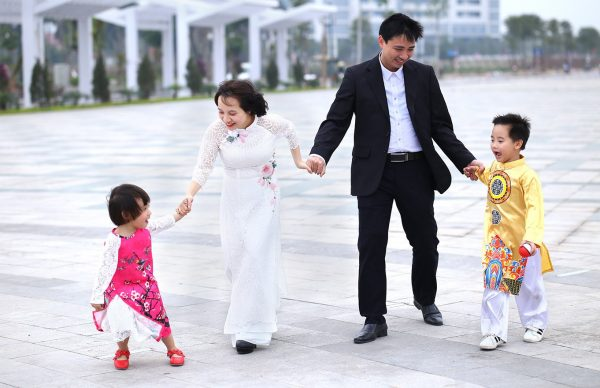

  <h3 align=center>翻墙必看 视频 http://111.241.99.25 </h3>

<table>
<tr>
<td>
目前，虽然科技、医术高度发达，疗养保健条件特别优越，运动方式方法多种多样，可是，在很多疾病面前，依然是无能为力，很多人仍然生活在病魔缠身的悲苦之中。尤其是还有很多人因为贫穷治不起病，只能等死。

也可能有人会说，人各有命， 在现实社会中，常人也有长命百岁、绝处逢生的；在名山大川中，修炼人也有几百岁，甚至几千岁的。这的确是事实。但是，这毕竟为数甚少，屈指可数。

法轮大法（也称法轮功）不是专门治病的一般气功。法轮大法是真正性命双修的佛家修炼大法，以宇宙特性“真、善、忍”法理为指导，辅以简单优美的五套功法，可以使学炼者身心健康，道德回升，开智开慧，达到洞悉人生和宇宙奥秘的自在境界。

一九九二年至一九九九年，法轮大法（也称法轮功）传遍神州大地，“真、善、忍”法理使一亿修炼者身心净化，道德升华。一九九五年三月，李洪志先生应邀到法国传功讲法，开始了法轮大法在海外的传播。如今法轮大法已洪传世界一百多个国家和地区。

法轮功在祛病健身方面有着普遍的神奇的效果，早在一九九八年，大陆医学界就为此作过五次医学调查，其后，北美及台湾的医学工作者也做了相关的健康调查。结果显示，法轮功祛病健身总有效率高达98%。

明慧网等媒体报道中，有无数事例证实，法轮大法不但能使人祛病健身有奇效， 而且在常人看来不可思议不可理解的事情，在海内外亿万修炼者群体中可以说是比比皆是。这其中就有无数各界精英罹患顽疾和绝症，可是，他们因各种因缘际遇修炼法轮大法（也称法轮功）之后，都得以绝处逢生，获得了身心的健康。

（转载希望之声）

</td>
</tr>
</table>

<a name=list><h4><a href="http://">目錄</a></h4>

<table>
<tr>
<td width=640><a href=#1>“三星”采购经理的故事</a></td>
<td width=240><a href=#1>希望之声</a></td>
</tr>

<tr>
<td width=640><a href=#2>中国大陆一位医学教授的自述</a></td>
<td width=240><a href=#2>希望之声</a></td>
</tr>

<tr>
<td width=640><a href=#3>【传奇人生】人生无悔 篮坛宿将(王金菊)的故事</a></td>
<td width=240><a href=#3>希望之声</a></td>
</tr>

</table>

<a href=#list><h4 align="right">回目錄</h4></a>

<a name=3><h2 align="center"><a href="http://">【传奇人生】人生无悔 篮坛宿将(王金菊)的故事</a></h2>

【希望之声2017年10月31日】

一九四八年的秋天，王金菊出生在山东省一个贫寒的农家，在八个孩子中， 金菊排行第七。 当时正逢院子里大片凌风傲霜的菊花盛开，爱好书法的父亲就给她起了名字，叫金菊，希望她能在苦寒中保持高洁、坚韧的品性。

金菊一岁时，出麻疹死了过去，大家把埋她的草都准备好了，可是第三天她又活了过来。金菊的家里很穷，年少的她总是吃不饱穿不暖。九岁那年赶上大跃进之后的三年大饥荒，村里一晚上就饿死十几个人，为了活命，姐姐带她去东北打工，她成了厂里最小的童工。

十九岁那年，金菊被部队体工队选中，进入军区和总后勤部篮球队。从球员到教练，她在球场上挥汗拼搏了十几年，获各类奖项无数，赢得了很高的赞誉。但是， 强烈运动后留下的创伤， 给金菊的身体埋下了隐患，给她日后的人生带来了极大的痛苦。

上个世纪的八十年代，中国进入了“改革开放”时期，金菊从部队转业到北京一所院校的教务处，从事管理工作。因为不适应复杂的人际关系，她想转行搞专业，靠着那股韧劲，金菊学会了影视编导技术，后来学院成立了影视制作公司，她担任主管技术的副总裁和制作部主任。

每天忙碌着拍专题片，拍广告、拍电影和电视，做电视台的媒体代理，生意非常好。随着公司生意的红火，金菊个人经济状况也发生了巨变：有了大房子、好车子，和各种高档名牌衣服，还有专职司机开车，也让母亲和家乡的亲人们过上了富裕的生活。金菊觉得她在人生道路上又一次扬起了风帆。

就在她踌躇满志，为事业拼搏之际，厄运突然降临。一九九五年的一天早上，金菊起床时，感觉全身动不了，突然瘫痪了！

亲友们抬着她四处寻医，找遍了名医。由于各种奇特的治疗方法，让她吃了很多的苦，却始终没得到治愈。 金菊孤独无助地躺在床上，她觉得与其这样活着，给亲人造成这么大的痛苦和负担，还不如就此了结，她想爬上阳台翻下去，可她连死的能力都没有！

年迈的姐姐一直忙前忙后的照料着她。几个月后她终于能撑着双拐站起来了，但身体特别脆弱。全身疼痛不断，不能吹风、不能拿重一点的东西、行走僵直、脱衣服都怕扭了腰，成了无法正常生活的残疾人。

回想人生，金菊真是欲哭无泪，40 多年过去了，由贫穷到富有，有过人生得意。但此时她却深深的体会到：“在生老病死的面前，人是无能为力的，就是用我全部的家产，也换不回健康的身体，访遍天下的名医，也找不回愉悦宁静的心境。金钱名利全是身外之物。人一旦失去了健康，真是一无所有啊。”

一九九六年，金菊的朋友送给她一本法轮功的书《转法轮》，并告诉她，周围很多患有严重疾病及绝症的人， 修炼法轮功后都康复了。这消息给金菊带来了重生的希望。 她一口气读完了《转法轮》，感到书中讲的句句是真理，把她所有的人生疑惑全解开了，她决定修炼法轮功。一个月后， 奇迹出现了，金菊站起来了，丢掉了拐杖，身体所有症状都消失了，有种脱胎换骨般的变化！

金菊激动的心情无以言表，内心对自己的师父充满了感激。她说：“我瘫痪时，悲伤欲绝的姐姐都不敢在我面前流泪，她只能跪求老天爷。这次瘫痪，姐姐亲眼见证了法轮功师父给了我第二次生命，她觉得师父的恩情大过天啊！姐姐也走上了修炼的路。居住在北京的众多亲人们看到了我的变化，全部都走进了大法的修炼。”

法轮功自1992 年传出后，短短几年时间就传遍了中国的大江南北。因为修炼法轮功的人都身心受益，于是，便心口相传， 把法轮功介绍给自己的亲朋好友。就这样，修炼法轮功的人越来越多。

金菊得法后的第一个新年到了，金菊家乡的亲人们来北京过年，亲眼目睹了金菊身体的神奇变化，都感到震撼。回乡后，他们带动大家族中几十个人走入了法轮大法的修炼。他们不仅改善了身体，提高了心性，家庭也变得更加和睦、幸福。

金菊说：“以前我想的是多赚钱， 给亲人们钱，帮他们脱贫致富。现在我觉得给他们一座金山，也不如带给他们法轮大法的福音，那是给生命的最好礼物！”基于这样的想法，金菊买了好多大法书，送给周围的同事和朋友，还专程回以前的部队，跟战友和领导分享大法的美好，他们中好多人也都开始修炼大法，并从大法中受益。

1999 年 7 月， 江泽民以“4· 25”法轮功学员和平上访为借口，一意孤行的发动了对法轮功的迫害。其实，在 1999 年 4 月 25日之前，中共江氏集团就预谋迫害法轮功。天津警察抓捕了40多名法轮功学员，迟迟不放人。万般无奈的情况下，金菊和众多法轮功学员到信访办和平上访，目的是希望争取到一个修炼“真善忍”的自由和权利。

金菊因为坚持信仰 “ 真 善 忍”， 被中共数次抓捕，遭受了严酷迫害。回忆当年的情景，金菊说：“我的好多亲人被抓，我自己也几次被捕。我跟警察说，在我瘫痪最无助的时候，是大法救了我，使我从新站了起来。人不是说‘受人滴水之恩，当以涌泉相报’吗？我师父对我有再造之恩，我怎么可能去听信那颠倒黑白的谎言而背叛师父呢？师父教我们按‘真善忍’做个处处为他人着想的好人，这是多么正的大法啊。九八年南方闹大洪水，我一次就捐助了两万块钱，这是我修炼前绝对做不到的。这样好的大法，当他受到诽谤，我能不出来说句公道话吗？”

“令人痛心的是，中共打压法轮功不知毁掉了多少人、毁了多少家庭！就说我大哥吧，修炼后无病一身轻，却因为无法承受连年的迫害，放弃了修炼，疾病复发而死亡。如果没有这场迫害，他现在应该还健康的活着啊！”

2004年， 金菊逃离了中共的迫害，来到了自由的国度加拿大。她和其他法轮功学员每天都去景点，给中国游客讲法轮功真相，用她的亲身经历告诉世人法轮功的美好，众多游客都静静地聆听，使这些可贵的中国人明白了真相，不再被中共谎言所欺骗。

在景点他们经常碰到感人的事情。金菊说到：“加拿大的冬天天寒地冻， 有一天，看着一辆辆的巴士满载着中国人而来，我们顾不上吃饭、喝水。一拨接一拨的给他们讲真相，不忍心落下任何一个中国游客。直到游客吃饭的空档，我们才打开自带的食物，发现都冻成了冰疙瘩，根本吃不了。这时，一个西人男子走到我们跟前，手里托着还冒着热气的饭菜，他眼里满是关切，要我们收下。真不知道他是从哪里来的，周围也没见到有餐饮店，也许是大法弟子救人的诚心，感动了天地与众生。”

金菊修炼法轮大法后得以绝处逢生，她亲身体会到法轮大法的美好。现在金菊那挺拔敏捷的身姿让人很难相信她已年过花甲，更难想像她当年曾瘫卧在床。她非常感慨地说：“法轮大法不仅把我从苦海中解救，净化了我的心灵，给了我第二次生命。还让我洞悉人生的真谛，知道了如何在困苦中修好自己，回归生命真正的家园，活得从未有过的踏实与怡然。今生能幸遇并修炼法轮大法，我感到无比幸福！”

金菊，正如她的名字，不畏中共残暴，在凌风傲霜中坚守着高洁。

听众朋友，篮坛宿将金菊的故事讲完了。感谢您的收听，我们下次再见。

责任编辑：香梅

<a href=#list><h4 align="right">回目錄</h4></a>

<a name=2><h2 align="center"><a href="http://">中国大陆一位医学教授的自述</a></h2>

人生苦短一场空 珍惜机缘到来时

【希望之声2018年10月26日】（本台记者慧光综合报导）

我出生在中国大陆，自幼喜欢读书，长大后考上了医科大学，毕业后留校并在省级三甲医院工作，是一名内科大夫。工作四年后又考上了国家重点医学院的研究生，读完硕士接着读博士，毕业后还是留在学校任教。三十二岁时晋升为副教授，是当时学院最年轻的副教授，被称为最有才华的教师。今年五十多岁了，早已升为医学教授。我从事过临床医学的实践和研究（包括对癌症的研究），以及处于现代医学科研尖端的分子细胞学研究，后来转为研究传统中医学。

我的一生比较顺利，工作、事业、家庭等方面都是风风光光。业余爱好也很多，琴、棋、书、画、武术等样样都会点儿，虽然不精，足以自乐。但我最大的爱好还是博览群书，古今中外，正史野史，只要能接触到的我都会研究。

虽然我是医生，可是对《易经》却十分投入，甚至达到如痴如醉的程度，购买了很多与此有关的书，而且预测越来越准，在当地颇有名气。突然有一天我被一个问题惊醒：既然人的一生、人的行为都能预测出来，说明这一切都是安排好的，那是谁安排了这些事情呢？难道人的命运真是天注定吗？难道真有“高级生命”存在？神佛真的存在吗？我从小就接受无神论教育，从心理上对这一切都是否定的，可无数的客观现实我又不能否认。我开始迷惘，也开始寻找答案。

当时国内还处在“气功热”，我就从气功中寻找出路。习练了多种气功，走访了不少民间“高人”，见过不少“奇人”，可没有一位能解开我心中诸多的“为什么”。后来我又研读了古代的佛道经典书籍，知道真正的正法大道都在深山里，所以就在心中发了一愿：等我儿子上了大学，我就远离世俗，进山寻道。

1996年，我来到北京读博士，在读书与科研之余，也留心观察着与修炼有关的事情。

1997年7月初的一天早晨，我在散步时，突然听到了一种祥和的音乐，循声找去，发现有一群人在双盘打坐，我被深深吸引。一位辅导员热心走过来向我介绍说这是法轮功，并无偿送我一本《转法轮》书，嘱咐我一定要一口气儿读完。

回到宿舍后，我迫不及待的开始读《转法轮》，读了几页我就明白了，这就是我一直苦苦追寻、发誓进山寻觅的大道正法，我当时激动的泪流满面。我用了一天的时间，一边看一边流泪，第一遍就是哭着读完的。书中的内容解开了我心中的一个个疑团，越读心里越豁亮。其中有关大周天、卯酉周天、元婴、性命双修、玄关设位、天目层次以及佛与道等法理，都是我闻所未闻的。我知道这就是高层次的修炼秘法，这是一部天书，我没有丝毫犹豫，当时就下决心走入修炼。

看书后的第三天，在夜晚入睡前的朦朦胧胧中，我看到有一个人影来到我的床边，似乎是依依不舍的在向我祈求着什么，把我吓醒了。我马上意识到这就是过去招惹的不好的灵体，它曾经在《易经》预测上帮过我，现在它当然不肯轻易离去。第二天，我焚烧了家里所有的与《易经》有关的书和那些假气功书，并烧了我亲自撰写的三十万字的《易医与人体科学》书稿。当天晚上我就做了一个梦，梦境至今仍然历历在目：成群的虎狼蛇等动物追我，跑着跑着我就飞了起来，越飞越高，越飞越高……，下面的动物变的越来越小。在空中我心生一念，不能让这些东西祸害人间，于是伸手发出功来，瞬间就将它们化为灰烬。我知道我过去读过的乱七八糟的书太多了，学过的东西太杂了，身体带的各种信息太乱了，如果不是师父把这些东西都给清理了，我可能永世都不能修炼了。

通过学法，我明白了修炼的真正内涵，时时刻刻按照“真、善、忍”的标准要求自己，从做好人做起，处处与人为善，工作兢兢业业，身体越来越强健，精神境界也得到不断升华。

修炼以后，大法也为我打开了一个全新的世界，使我对人体、生命等科学有了更深入的认识。

我是医学领域的专家，对现代医学的研究已经很深入了，可是面对众多的疾病仍然束手无策，甚至连它们的发病机理都只能推测，经常是眼睁睁的看着病人无奈的离去。

1998年，我参与了国内一万多人修炼法轮功后的祛病健身调查。我们按照现代科学研究方法设计量表、统计数据，得出的结论令人振奋。有很多癌症患者修炼后痊愈了，很多高血压患者血压正常了，有的是冠心病好了，有的是脑血栓后遗症痊愈了。更令我惊奇的是，几乎所有过了更年期的女士重新来了例假，出现了返老还童的变化。总的祛病有效率达到了百分之九十以上，一切都太令人惊奇了！

做医生的都知道，普通的发热、感冒属于自限性疾病，不治也能好，服药治疗只是缩短病程；对于常见的高血压、肝硬化、冠心病、糖尿病等，只能靠长期服药控制病情；对于像痛风、系统硬化病、红斑狼疮等疑难病，现代医学没有有效的治疗方法。至于说各种癌症，治疗的结果多半是人财两空。这些只有在“神话”中才能治好的人类疾病，作为一名医学教授，我却亲眼目睹了他们因修炼法轮功而恢复了健康。尤其是只要诚心念“法轮大法好，真善忍好”，同样能逢凶化吉，这是多大慈悲、多大机缘啊！

像冠心病、脑血栓、癌症等都能经CT、核磁共振、B超、化验等设备检查证实，都是肉眼可观察到的有形病，可是修炼大法后，这些病消失了，这难道不是现实版的“神话故事”吗？！

在修炼中，我还见证了许多修炼者遇难呈祥、车祸中平安无恙的实例，其中我儿子（当时是大二学生）也曾经遭遇车祸，那是一场不死也残废的车祸，在公路上被快速行驶的汽车迎面撞出去很远，头部又重重的摔在柏油马路上，结果是化险为夷。

在人生的长河中，很多人一直在寻找一种能解开人生之迷的“钥匙”，为此经历着生老病死的折磨，经历无数的精神痛苦和无奈选择。当遇到真正的机缘时，请千万别匆匆走过，认真读一读《转法轮》，一切答案尽在其中。他会掸去你数次轮回的封尘，唤醒你来世间的夙愿。

责任编辑：靳同

<a href=#list><h4 align="right">回目錄</h4></a>

<a name=1><h2 align="center"><a href="http://">“三星”采购经理的故事</a></h2>

三星集团越南采购部经理

【希望之声2018年10月23日】（本台记者慧光综合报导）她是国际著名的“三星”集团越南采购部经理，也称得上是“女强人”。但她的成功与家庭背景无关，而是源于她顽强的意志和倔强的性格，因为她从小就有远大的志向，渴望像男人一样做事，做成功人士。

她酷爱学习，毕业于越南岘港大学，这是越南中南部地区最大的高等学校。凭着优异的成绩，毕业后她进入一家属于新加坡财团的外国公司工作。之后她又到中国广东省的一家公司工作了两年，担任质量监督检验工程师。

在积累了丰富的专业知识和管理经验之后，她如愿进入“三星”集团工作。当事业稳定之后，她于2009年结婚成家，结束了漂泊生活，将自己安顿下来。

2012年，她进入公司管理层，之后工作越来越多，压力也越来越大，各种矛盾带来诸多烦恼，导致她疲惫不堪，脾气也变得暴躁，时常对员工进行责骂。即使回到家中，也时常与丈夫发生口角。她也意识到大多数情况下都是自己不对，可是不由自主，无法控制，最后总以工作繁忙为借口作为开脱的理由。

就在这一年，她怀孕了。虽然一切都在预料之中，没想到后来的情况是那样的错综复杂。怀孕六个月时她被任命为经理，怀孕八个月时却被诊断出患有妊娠期糖尿病，这一点也不奇怪，她的祖母和父亲都是糖尿病患者。

妊娠期糖尿病患者一般有多食、多饮、多尿的症状，可是她经常呕吐，厌倦饮食，但为了胎儿的营养而又不得不多吃。体内葡萄糖不能被很好利用同时分解过快，体能就无法得到充分补充，她时常感到很疲倦。更大的压力是对孩子出生后的发育会造成不良影响，使她忧心忡忡。

为了避免悲剧发生，她不得不遵照医生的嘱咐，每天要去健身房锻炼，然而这样做的结果并没有使身体变好，而是更加疲惫和虚弱。那期间她就是在极度痛苦中度过的。繁忙的工作并没有因她的情况特殊给她提供喘息的机会，而孩子的压力和越来越糟糕的身体状况也让她喘不过气来。

有一天她突然意识到，如果身体不行了，成功与否还有什么意义？财富多少有什么意义？于是她茫然了，不知道该怎么办。当她知道自己无法拯救自己时，她终于体会到，没有健康什么都谈不上。可是健康的出路在哪里？经多方努力和尝试之后，她一次又一次的失望了。

后来有一天，一个偶然的机会姨妈与她住在了一起。姨妈每天都练习一种气功，动作轻柔舒缓，优雅流畅，后来知道这是法轮功，她开始以为这是老人的一种锻炼方式，并没有引起重视。时间长了才发现，姨妈尽管年事已高，可是心态平和，精力充沛，健康开朗，这让她感到很好奇。

故事的主人公在阅读《转法轮》

在姨妈的推荐下，她开始阅读法轮功的主要指导书《转法轮》。她说：“读书过程中，自己有一种莫名其妙的感觉，就好像被淹没在波涛汹涌的大海中，突然遇到了救生圈一样。潜意识中告诉她，如果不抓住这个机会，就没有希望了。”这种奇妙的感觉促使她看了一遍又一遍。

非常神奇的是，一个月后，当她再去做健康检查时，被告知各项指标都正常了，糖尿病的症状消失了。这让她感到非常震惊，一直无法解决的痛苦和烦恼在不知不觉中就无影无踪了，一向善于思考的她被法轮功的强大内涵深深的吸引了。

故事主人公在练习法轮功第五套功法——静功

“修炼”对她来说本是一件陌生而又遥不可及的事情，而《转法轮》的神奇和“真、善、忍”的美好却让她看到了一个崭新的绚丽多彩的世界。当她用“真、善、忍”的原则指导自己的行为时，不仅仅是身体上出现了巨大变化，思想上的变化也出乎意料，而工作中也受益匪浅。

她说：“我的工作需要灵活的应急处理能力，从产品交付到空运、公路运输和海运，我必须确保采购和运输过程中的科学运筹管理都要做到最佳，而仅靠我一个人的力量是无法完成的，这需要一个强有力的团队。作为管理者，营造一个诚信的氛围和高效的工作环境就变得至关重要。”“多亏了大法给了我智慧，我感到我的思想是开放的，我可以忘我的工作而不感到疲倦，这在之前是做不到的。”

因为拥有健康的身体和旺盛的精力，后来她又生下了第二个孩子，同样是健康活泼，没有受到疾病的任何影响。

故事主人公的全家福合影，一家人其乐融融

她说：“当我放弃自私和自我时，我才明白真正的幸福是什么。法轮功将我从疾病和痛苦中解脱出来，并引导我走上了一条光明的人生旅途，我为我的余生感到幸运。”

“完全超出想象的是，大法修炼为我的工作和生活提供了一条完美和谐的解决方案。每天学法炼功，让我心态平和，平静宽容。而在修炼的同时，我仍然可以做一个敬业的管理者和一个拥有幸福家庭的女人。”

“在此分享个人的美好经历，就是想让世界上的善良人都知道，《转法轮》是一部无比珍贵的奇书，他能帮助人创造这个世界上的任何奇迹。”

（本文根据DKN.TV报道翻译整理）

b_ornament_24_0M.png
