

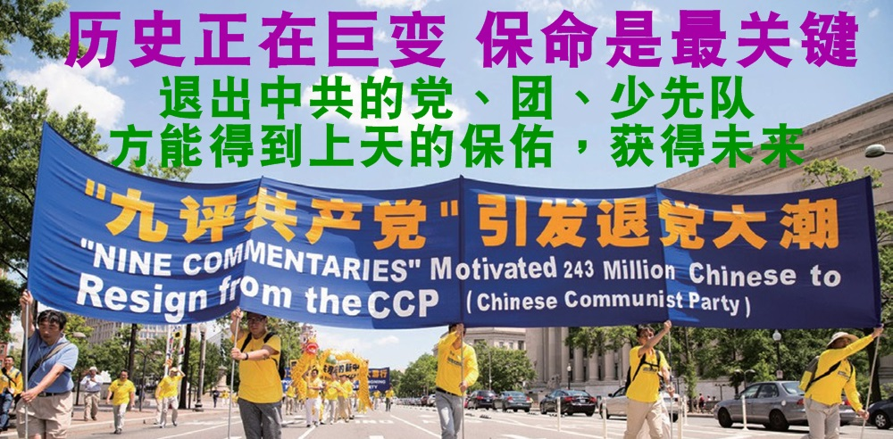
  <h3 align=center><a href="http://118.161.138.80">朋友,请珍惜这份难能可贵的缘份！翻墙了必看的视频 http://118.161.138.80</a></h3>

<table>
  <tr>
    <td>  
<h3><a href="http://">《九评共产党》【公告】</a></h3>

【大纪元11月19日讯】在前苏联和东欧各国共产党政权倒台十几年后的今天，世界共产主义运动早已被全世界所唾弃，中国共产党走入坟墓也只是一个时间的问题。 

但是中共在彻底垮台之前，却力图将其命运与具有五千年文明历史的中华古国绑在一起，这是我们民族的大不幸。如何看待共产党，如何过渡到一个没有共产党的社会，如何延续我们民族的薪火传承，已经是摆在中国人民面前的一个具体问题了。

大纪元将于今天开始发表特别系列社论《九评共产党》，给为祸人间一个多世纪的国际共产主义运动，特别是中国共产党盖棺论定。

纵观八十多年的中国共产党历史，其所到之处永远伴随着谎言、战乱、饥荒、独裁、屠杀和恐惧；传统的信仰和价值观被共产党强力破坏；原有的伦理观念和社会体系被强制解体；人与人之间的关爱与和谐被扭曲成斗争与仇恨；对天地自然的敬畏与珍惜变成妄自尊大的“战天斗地”，由此带来的社会道德体系和生态体系的全面崩溃，将中华民族乃至整个人类拖向深重的危机。而这一切灾难都在共产党精密的策划、组织和控制下发生著。

“无可奈何花落去”，现今苟延残喘的共产政权已经日暮途穷，它们的崩溃指日可待。在其彻底灭亡之前，我们有必要全面反思和揭露这个集古今中外邪恶之大全的最大邪教组织，让仍旧被共产政权欺骗的人们认清它十恶俱全的本质，从精神上肃清共产党的流毒，从心理上摆脱共产邪灵的控制，跳出恐惧的枷锁，放弃对共产党的一切幻想。

中国共产党的统治是中国历史上最黑暗，也最荒谬的一页，又以江泽民发动的对“真善忍”的镇压最为邪恶。这场运动给中共的棺材钉上了最后一颗钉子。反思这段历史，是为了让这样的悲剧永不再发生。同时我们每一个人也能由此省思自己的内心世界，是否很多本不该发生的悲剧却因为我们的懦弱和妥协而得以成全。

大纪元编辑部敬告

2004年11月18日(http://www.dajiyuan.com)

 </td>
   </tr>
  </table> 
  

  
  <table>
   <tr>
    <td width=440>

<a href="https://git.io/tgc">• 点阅《共产主义的终极目的》•</a>

</td>
  <td width=440>

<a href="https://git.io/sos">• 点阅《九评共产党》•</a>

</td>
  </tr> 
</table> 
 
 
 
   

<a name=list><h3><a href="https://"> 目錄 </a></h3>

 <table>
   <tr>
    <td width=880><a href=#◆>◆ 《九评》广受世人欢迎 好评如潮 </a> </td>
</tr> 
    </table>

 <table>
  <tr>
    <td width=880><a href=#a>◆ 民心觉醒 三退大潮席卷中国</a> 

     <a href=#a-1>1.湖南律师文东海宣布退党 网友赞赏勇气</a>
 
  <a href=#a-2> 2.压在我心头的恶魇</a>
    
   <a href=#a-3> 3.一位太子党谈真实的父亲 </a>
   
  <a href=#a-4> 4.党政军汇入三退大潮 </a>
     
   <a href=#a-5> 5.中国民众集体三退 </a>
   
    <a href=#a-6>  6.海外旅游点都成退党点 </a>

 <a href=#a-7>  7.退党正引领一场划时代的社会巨变 </a>

 </td></tr> 
    </table>

 <table>
   <tr>
    <td width=880><a href=#◆◆>◆ 全球各地声援三亿人退出中共</a> </td>
   </tr> </table>

<table>
  <tr>
    <td width=880><a href=#1>◆ 退党大潮新动态</a>  
 
   <a href=#1-1>1.美议员发起932号决议案 声援中国退党大潮</a>
 
   <a href=#1-2>2.美国会研讨会关注三亿人三退为世界带来希望</a>
 
   <a href=#1-3>3.捷克前总统哈维尔：用道德对抗共产党</a>
 
   <a href=#1-4>4.前乌克兰总统声援三退大潮：无人能阻挡</a>
 
   <a href=#1-5>5.爱沙尼亚前总理：中国前途在于脱离共产党</a>
 
   <a href=#1-6>6.国际人权律师：退党有助于停止对法轮功的迫害</a>
 
   <a href=#1-7>7.前欧议会副主席及议员褒奖全球退党服务中心</a>
 
   <a href=#1-8>8.新西兰政要：退党运动为中国带来光明</a>
 
   
  </td></tr> 
    </table>
  
  <table>
   <tr>
    <td width=880><a href=#◆◆◆2>◆  中国民众抛弃中共 三退得福报</a> </td>   
 </tr> </table>
 
<table>
   <tr>
    <td width=880><a href=#◆◆◆>◆ 坊间真言</a> </td>   
 </tr> </table>
 
  <table>
   <tr>
    <td width=880><a href=#◆◆◆◆>◆ 天象人间</a> </td>
     </tr>  </table>
  
  <table>
   <tr>
    <td width=880><a href=#◆◆◆◆◆>◆ 大纪元郑重声明 </a> </td>
     </tr>  </table>
  
  
  <table>
  <tr>
    <td width=880><a href=#◆◆◆◆◆1>◆ 退党、团、队方法</a> </td>
    </tr>  </table>
  
  
<a href=#list><h6 align="right">回目錄</h6></a>

<a name=◆>

</a>

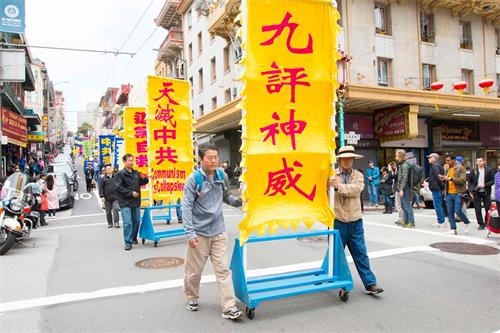

2004年11月19日大纪元发表系列社论《九评共产党》，给为祸人间一个多世纪的国际共产主义运动，特别是中国共产党盖棺论定。《九评》全面系统地回顾了中共的罪恶历史，剖析了其反天、反地、反人类的邪灵本质及给中华民族带来的深重苦难与危机，揭示这个毁坏人是非善恶标准、制造了人间地狱的共产信仰是附在中华民族身上的西来邪灵，帮助人找回道德良知与做人的尊严，给人指出一条希望的路。

看过《九评》，人们前所未有地震撼：原来自己一直生活在中共的谎言之中；原来这红魔就是中国社会的一切乱象、苦难和罪恶的根源，明白了“没有了共产党，中国才会有希望”。

<b>好评如潮 《九评》广受世人欢迎</b>

《九评共产党》发表不久立刻在国际社会上引起强烈反响。在全球已发行33语种版本；曾获得乌克兰书展“最佳出版奖”提名及2005年美国亚裔记者协会“网络报道类最佳奖”等褒奖。十多年来全球五大洲有上百城市举办各种《九评》相关研讨座谈会、新闻发布会、图片展等活动至少有二千场，帮助国际社会透彻了解中共的邪恶本质，有上万名政要领袖、专家学者、媒体人、受害人等都站出来齐声谴责中共。

旅居澳洲的前中共外交官陈用林认为：“《九评》帮助认清中共邪教本质，是一本震聋发聩的历史性文献 。”资深媒体人李勇说：“这么多年来，中国人遭受了这么多委屈，没有人为他们发声。《九评》是在为苦难的中国人发声。”历史学家辛灏年表示：“《九评》能够如此坚强地，彻底地，不隐讳地在海外揭露中国共产党的历史和现状，那是真正的爱国的表现，爱中华民族的表现。”

<b>《九评》促民心觉醒 认清中共本质</b>

在《九评》问世之前，面对中共带给中华大地的一片乱象，和对中国民众的伤害，大部分中国人都处于无奈与麻木之中。对于中共暴政的反应，也只有做顺民和暴民这两种有限的选择。

但《九评》出现后，中国民众第一次从根本上认清了中共的历史和本质，人们选择用声明退出中共组织的行动来做出选择。这是人性的觉醒， 这是生命的救赎。

在《九评》刚发表之际，香港正义之士用集装箱将《九评》源源不断运到大陆，数量达十几万册。有许多民众自发印制《九评》和退党资料。上海访民承森表示，他所在城市的几所大学都有卖《九评》，他买了好多送给朋友，当中包括政府部门的官员。北京的上访村也成为传播《九评》和退党基地。一位访民说，当他看到《九评》后心里
顿时亮堂起来，放下上访的念头开始集中精力传播《九评》促三退。还有访民回到家乡后带动那里的三退。

2010年大纪元时报曾报道云南一个民间组织成立不到一年已发展到18个县市，拥有会员11多万人。该组织人人均退出中共；他们每星期看一次《九评》光碟、学一节《九评》。现今大陆民众到处可见《九评》的传播，街头经常看见三退标语，人民币上的三退词句更是随处可见。

<b>三退大潮风起云涌</b>

2004年12月3日大纪元收到海外传来的第一则退出中国共产党的声明，2005年元旦海外50位华人专家学者集体声明退出中共邪党团队，拉开中华儿女群体脱离马列邪党的序幕。

2005年1月12日大纪元发表《郑重声明》并建立退党网站，帮助“所有参加过共产党与共产党其他组织的（被邪恶打上兽的印记的）人赶快退出，抹去邪恶的印记。”自此三退人数节节攀升，明白真相的中国人或上网、或公开张贴三退声明、或致电全球退党服务中心要求三退，更有大量到海外观光的民众在各国景点直接三退。

2005年4月21日在大纪元网站上声明退出中共党团队的人数突破一百万；2006年4月25日再破一千万；2011年8月7日三退人数冲破一亿；2015年4月14日二亿人；2018年3月23日突破三亿人。三退大潮已成为全世界最大的精神觉醒运动。

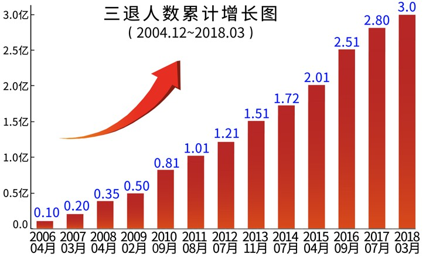

<a href=#list><h6 align="right">回目錄</h6></a>

<a name=a>

 </a> 

<a name=a-1><h2>
湖南律师文东海宣布退党 网友赞赏勇气 </a>  </h2> 

湖南律师文东海由于不满湖南省律师协会的抹黑，7月3日在网络发布“退出中国共产党声明”。

文东海律师因为代理包括法轮功信仰案、709维权律师大抓捕案等人权案，遭到中共当局的迫害，今年6月湖南司法厅吊销文东海律师执照。

文东海向记者透露，早在自己被吊销执照之前，湖南律协就在网上发表不实文章对他造谣诽谤。他说：“我对这个党支部感到非常失望，我觉得我有必要退出这个党支部。”

该退党声明获维权律师和大批网友点赞。网友表示，很多共产党员在精神上早已退党，但大多不敢公开决裂，文东海显现出罕见的勇气。

在文东海退党之前，大陆律师公开退党的还包括北京维权律师高智晟、上海维权律师郑恩宠、上海钟锦化律师等。

<a href=#list><h6 align="right">回目錄</h6></a>

<a name=a-2><h2>
压在我心头的恶魇</a>  </h2> 

多年前我早已退出共产党了，现在再次写退党声明，主要为了把一件压在我心头多年、一直恶梦不断、倍受良心折磨、但从未说出过的一个秘密说出来：我在新疆当兵时，被迫参加了一场灭绝回族村庄的行动。看着村子里那些无辜的男女老少、甚至吃奶的孩子，我根本无法让自己开枪。然而我们这个包围圈之外还有一层武器更精良的部队包围着我们，如果我们不开枪，顷刻之间后面就会对我们开枪。面对着这种救不了回族同胞还要搭上自己性命的情况，我一边流泪一边开了抢。我永远忘不了那个无法用语言形容的极端残酷而悲惨的场面。

回到家乡后我从不敢去回民区，一旦碰到回族人我连头都抬不起来，内心的痛苦难以言表。我本是一个正直善良的人，可以过着平静的正常生活，却被这个恶魇害得失去了幸福。在这里我奉劝所有还被恶党蒙骗的人，赶快清醒吧，早一天三退早一天得救，否则总有一天害了自己。这个恶党的本性就是害人，只不过今天利用一部分去害另一部分，明天又会残害给它卖过命的人，轮番害人决不会停息，即使灭亡也千方百计拽住人们给它做垫背，这就是共产党。现在我说出了多年来恶梦不断的真正原因，如果神能听见我的心里话，虔诚祈求让我今后不再被恶梦缠绕，使我得到一个平静的心灵。 陕西 陈潇叶

<a href=#list><h6 align="right">回目錄</h6></a>

<a name=a-3><h2>
一位太子党谈真实的父亲</a>  </h2> 

我为父亲感到骄傲，他没有贪污受贿，而且对儿女要求很严格。还有好多事情让我感到父亲是共产党里的好人。那时我最不能忍受的就是有人说共产党的坏话，谁一骂共产党，我就会立刻大辩特辩。看了《九评共产党》后，我清醒了许多，明白了“中共”不是“中国”的道理，也明白了中共是舶来货，是来欺压咱们中国人的。有一天，我再听《九评》光盘时，听出了更深的内涵，当时全身细胞都膨胀起来，泪水不住的流，我感到中共体制太残暴了，它不但害死了无数的炎黄子孙，也用另一种形式毒害着体制内的官员。

有一件事情让我刻骨难忘。某次，毛建造了一个秘密据点，为了防止事情外露，决定毒死所有相关的知情人员，这次任务不幸摊到了我父亲头上。虽然不是父亲亲手去执行的，但他无条件的服从，并传达下去。我写这一段回忆时，泪水不禁夺眶而出，我不能不痛心疾首，我敬重的父亲竟是那次屠杀的指挥者，但父亲在讲述这个血案时并没觉得是罪行，他认为那是在“工作”。在家里和在外面的父亲怎么会溶不到一起？对于父亲的双重人格，最后的答案还是在《九评》里找到的：“在中国，人们了解共产党员普遍的双重人格特征。在私下场合，共产党员多具有普通的人性，具有一般人的喜怒哀乐，也有普通世人的优点和缺点，他们或许是父亲，或许是丈夫，或许是好朋友，但凌驾在这些人性之上的，则是共产党最为强调的党性。而党性，按照共产党的要求，永远超越普遍人性而存在。人性当成相对的，可变的，而党性则是绝对的，不能被怀疑也不能被挑战。” 原来在家里让我们做个好人的父亲，在为党效力的时候，是绝对盲从的，党性把他弄成这个样子。可惜父亲在 《九评》出版之前已经过世了。我在读《九评》的时候，经常念出声儿来，象是在念给父亲听，我相信他在冥中是听的到的。当退党大潮汹涌而来时，我几次梦见了父亲，他似乎要向我说什么，我猜想是要我帮他退出共产党，于是我帮他发了一个退党声明。之后，父亲没有再出现过。（看中国网）

<a href=#list><h6 align="right">回目錄</h6></a>

<a name=a-4><h2>
党政军汇入三退大潮</a>  </h2> 

党政军是中共维系统治的核心力量，比老百姓更知道中共政权的真实情况，明白真相后的各级党政军官员纷纷为自己寻找出路，加入退党大潮。2005年3月中共军工系统46名党龄30到50年的老军人声明退党。2005年“七一”前夕47位前中共军官集体退党。他们表示几年前转业到地方后，生活困苦上访无门，在退党大潮的感召下决定集体退党。

原天津市国内安全保卫局、610办公室官员郝凤军、前中共国安部对外谍报警官李凤智等人相继公开声明退出中共组织。

<a href=#list><h6 align="right">回目錄</h6></a>

<a name=a-5><h2>
中国民众集体三退</a>  </h2> 

觉醒的大陆民众支持正义的行为越来越公开化。常常一人退党，带动全家和亲朋好友也退党。真名三退、公开退党、集体退党的事件越来越多。现在公开退党、集体退党的事件越来越多，人数从几百人、到几千人甚至是上万人都有。

2013年6月14日，湖南省五千多名放映员一致决定：强烈要求退出共产党，公开集体退党，并到北京上访。2015年“七一”中共建党日前，湖南湘潭市色织染整厂全体职工1003名工人绝望至极、集体要求退党，其中不乏有数十年党龄的老党员。

<a href=#list><h6 align="right">回目錄</h6></a>

<a name=a-6><h2>
海外旅游点都成退党点</a>  </h2> 

了解更多 https://git.io/zbdodo  
 

海内外中国民众出国三退成趋势，在海外各地旅游景点随处可见退党义工提供三退服务。一批批游客围着真相展板认真观看，上面都是在大陆被中共严密封锁看不到的消息。许多游客明白真相后整团三退，真名登记三退的人多了，还有中国游客从国内带着三退名单到景点交给退党义工办理三退。

各个海外风景点也不乏中共部级、局级官员、国安国保、610、员警出国退党。很多旅游团的领队、导游也都做了“三退”，游客还经常互相提醒退了再上车走，有大陆导游说，全球旅游景点都成退党点了！常有中国游客表示，三退后一身痛快轻松。

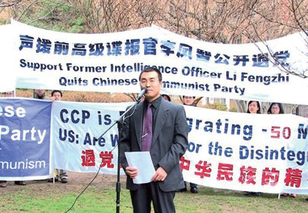

前中共国安部对外谍报官李凤智在华盛顿DC的大使馆前公开声明退党

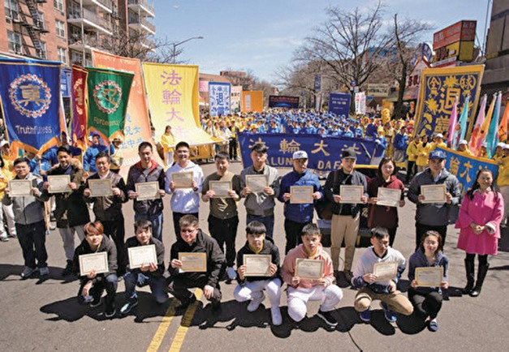

2018年4月22日全球退党中心主席颁发三退证书给18位公开三退的华人

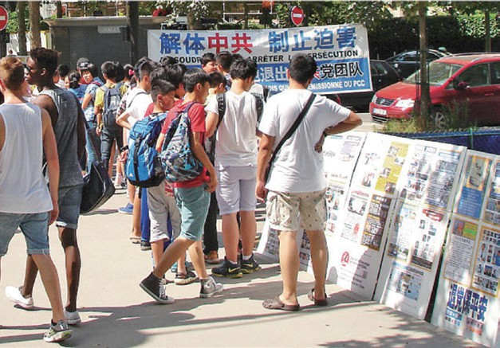

在巴黎的埃菲尔铁塔附近的法国退党服务中心帮助游客三退

许多大陆游客透过香港的真相退党点声明退出中共组织

<a href=#list><h6 align="right">回目錄</h6></a>

<a name=a-7><h2>
退党正引领一场划时代的社会巨变</a>  </h2> 

中国社会正面临着政治、经济、生态等多方面的问题和危机，究其造成问题和危机的根源，主要是共产党的因素。《九评》指引出一条终结中共暴政并使中国向未来和平过渡转型之路，那就是标志着人们精神觉醒的“三退”运动。

每天在退党网站数万人的三退声明代表着中国民众精神觉醒的步伐，这场道德回归、精神升华的运动，正在改变中共这个历史上最残暴的政权强加给中国社会的毁灭命运，并将继续引领一场划时代的社会巨变。

<a href=#list><h6 align="right">回目錄</h6></a>

<a name=◆◆>
</a>

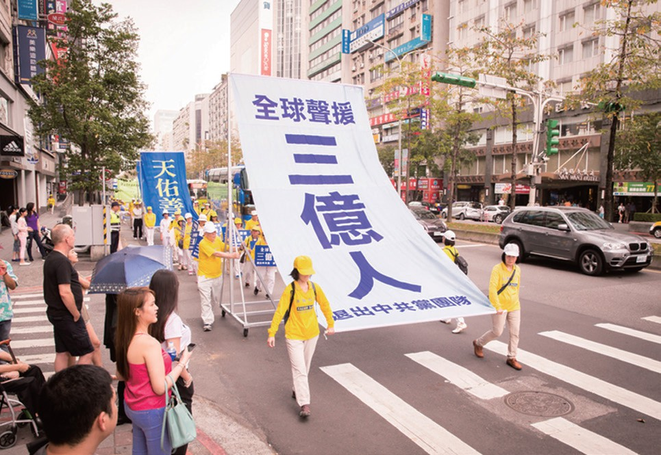

2004年大纪元发表的《九评共产党》全面系统地剖析共产党邪恶本质，触发中国广大民众“退党大潮”。十三年来，觉醒的中国民众在大纪元退党网站上公开声明退出中共党、团、队组织的人数已超过三亿。三亿人三退，意味着将近四分之一的中国人，脱离了中共及其一切邪恶组织，象征着一个中华民族全面觉醒，一个迅速解体中共的时代的到来。

<b>全球各地举行声援集会游行活动</b>

全球包括美国、加拿大、欧洲、澳洲、亚洲等各地的民众、法轮功学员以及退党服务中心纷纷举行盛大游行集会等活动，庆祝并声援三亿人抛弃中共。游行队伍手持横幅、标语，声援退出中共邪党组织的三亿民众，传递“法轮大法好”、“天要灭中共 三退保平安”的天机，庆贺他们摆脱邪恶枷锁、重获尊严和新生，为自己选择美好的未来；并呼吁更多中国民众觉醒，加入三退大潮。

活动受到在场民众的热烈响应和支持，川流不息的过往车辆与行人纷纷以鸣笛、拍照合影等方式声援这一正义之举。并有各界人士表示支持这场华人的精神觉醒运动

3月10日部分多伦多法轮功学员和民众在市中心举行声援近三亿人退出党团队的大游行。多伦多市民Faris Ahmed说：“我认为退党是应该做的正确之举，只要共产党还在杀人并伤害他人。我认为退党是一个非常勇敢的运动。”

3月11日约十万观众在纽约布鲁克林第八大道观看法轮功学员的游行，分为法轮大法好、停止迫害法轮功和三退保平安三个主题。全球退党服务中心义工在现场帮500多人办理三退。

3月18日，香港法轮功学员及一些市民在香港市中心举行盛大集会及游行活动，庆祝并声援近三亿人退出中共党、团、队组织，呼吁法办打压法轮功的元凶江泽民、结束迫害。

4月7日，旧金山湾区部分法轮功学员在旧金山中国城举行游行集会，向人们传递亿三中华儿女退出中共的讯息，同时昭示中共的邪恶，并鼓励他们克服恐惧，选择在中共解体前退出、做出自己良心救赎的选择。

4月22日超过五千名台湾法轮功学员在台北展开集会活动和盛大游行。中国游客纷纷拿起相机拍摄现场画面，一名林先生（化名）表示，他曾看过《九评》这本书，他觉得三退运动非常有意义，因此他全程参加完游行，并且最终选择退出中共。

4月28日南澳首府阿德莱德市中心举行声援三亿中国人三退的游行集会。来自南澳政界、媒体及各社团的七位嘉宾在本次集会上发言，表达了他们对三退勇士的赞赏和支持。

<b>退党潮是良知觉醒</b>

中国民主运动海外联席会议主席魏京生表示，很多中国老百姓生活在压抑之中，而退党运动为他们提供了吐露心声的机会，通过退党得以洗涤灵魂，是“内心的必需品”。

美国天主教大学机械系主任聂森教授说：“三退民众来自各行业级别、各年龄层、各省市地区，足见退党潮冲击社会的深度。”

旅居德国的名女诗人徐沛博士表示，三退大潮可以从根基上颠覆中共的极权暴政。她说：“我觉得三亿这个数字说明人心的归属，从三退人数急剧增长来看，说明中共已经失去了大陆民众的人心了，就像苏联垮台一样，当时也是共产党员开始唾弃苏共的。”

全球退党服务中心主席易蓉女士表示：“退党大潮上顺天意，下达民心，正以前所未有的速度净化人心，改变中国，和平解体中共。”

多伦多大游行声援三亿人抛弃中共

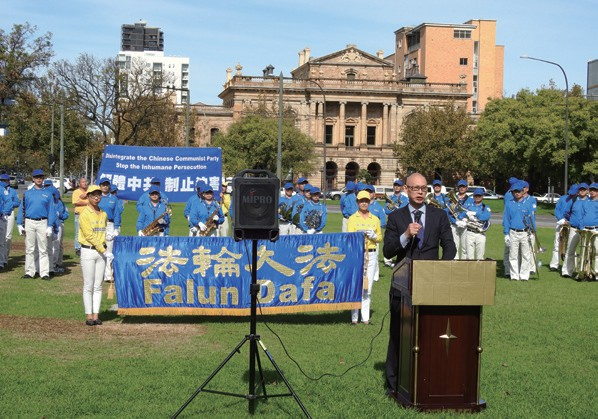

澳洲阿德莱德游行集会声援三退大潮

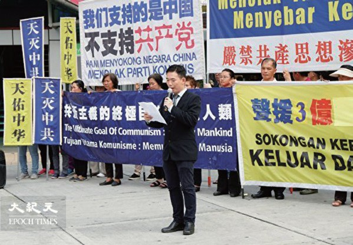

马来西亚声援三亿人三退集会

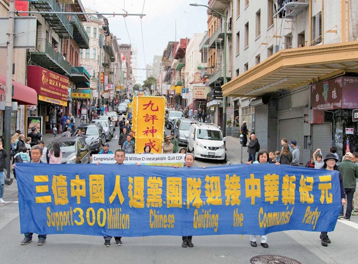

旧金山游行集会声援三亿人三退

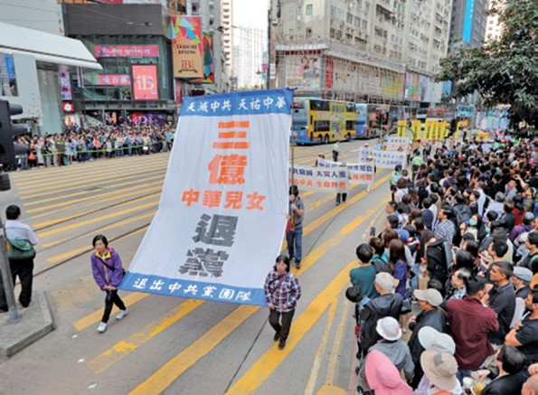

香港集会游行庆祝三亿人退出中共

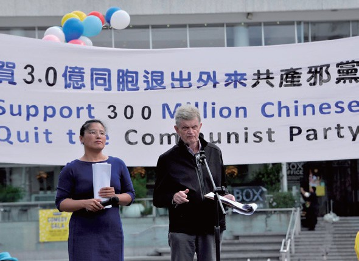

新西兰奥克兰举行庆祝三亿人三退活动

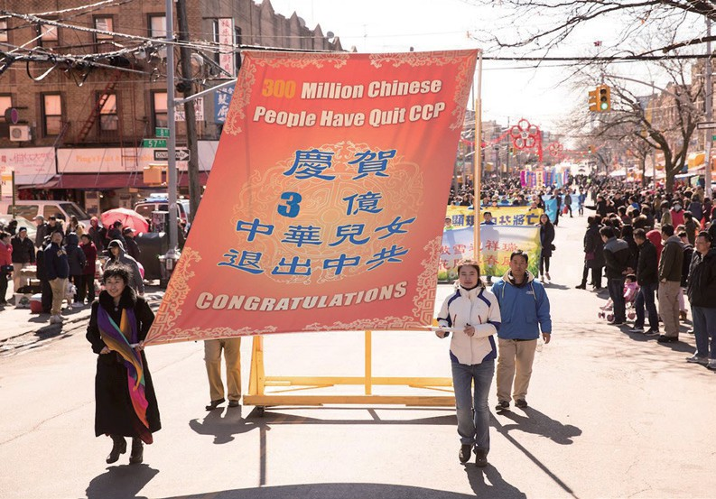

3月11日近千名法轮功学员在纽约举行盛大游行

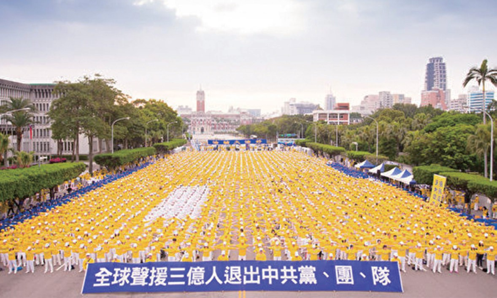

4月22日台北游行集会声援三亿人退出中

<a href=#list><h6 align="right">回目錄</h6></a>

<a name=1>

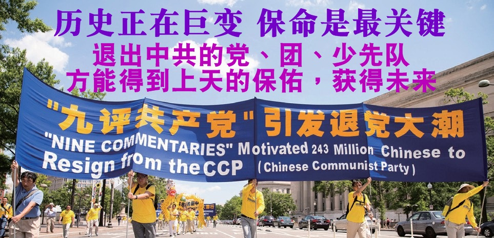 </a> 

<a name=1-8><h2>
 新西兰政要：退党运动为中国带来光明</a>  </h2> 

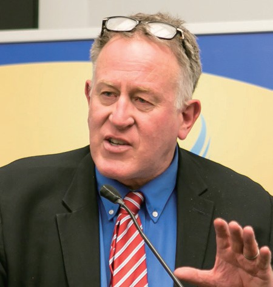

2018年5月9日在美国国会举办的“三亿中国人三退”研讨会上，前新西兰行动党副主席特雷弗．劳登先生表示，中共是对全人类自由的最大威胁，在对待中共的态度问题上，全世界的人们都在面临着重要的道德考验。劳登表示，中华文明已有数千年的历史，并孕育流传了令人惊叹的璀灿文化文化和内涵深厚的道德哲学。中共随后瘫痪了这个文明古国，摧毁了经济，捣毁了文化，破坏了人们的道德信仰，并夺走了数百万人的生命。退党运动能够帮助解体中共、重塑中国人的品格，将会为中国带来更美好的未来。

<a href=#list><h6 align="right">回目錄</h6></a>

<a name=1-7><h2>
 前欧议会副主席及议员褒奖全球退党服务中心</a>  </h2> 

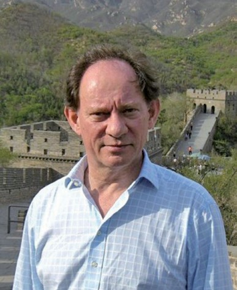

2012年7月，全球退党中心于华盛顿举办“解体中共，停止迫害法轮功、声援三退”大集会，欧洲议会副主席麦克米兰．史考特（McMillan Scott）、立陶宛政要安迪
克尼（Andrikiene）、爱沙尼亚议员克兰（Kelam）联名褒奖全球退党中心及声援一亿二千万退党大潮。

褒奖指出，退党运动是平和的精神觉醒运动，为世界人民构建了一个没有共产主义的新视野。麦克米兰．史考特以此公告向所有退出中共的勇士表示祝贺，并对退党
运动表示支持。

<a href=#list><h6 align="right">回目錄</h6></a>

<a name=1-6><h2>
 国际人权律师：退党有助于停止对法轮功的迫害</a>  </h2> 

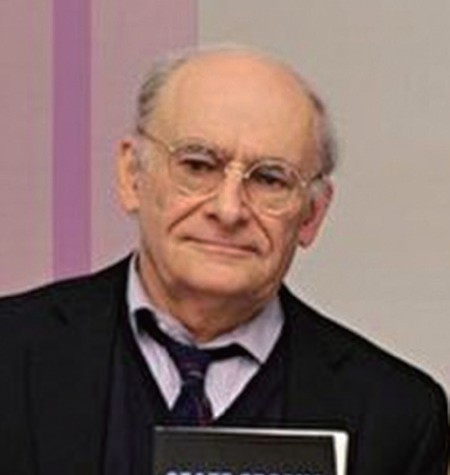

国际人权律师大卫．麦塔斯于2006年开始致力于调查中共迫害法轮功，特别是活摘法轮功学员器官的调查，他敦促早日结束中国非法器官移植，并期盼通过反活摘来改变中国人权。

在4月14日波士顿举行庆祝三亿人退党集会上，麦塔斯表示，三亿人退出中共象征着一个不可阻挡的、认清中共后而拒绝中共的趋势。他认为“三退”、反迫害和反活摘都是帮助中国人了解真相，在善恶之间做个正确的选择。麦塔斯说：“每位退出共产党相关组织的人都是在谴责共产党。庞大的人群离开共产党、抛弃共产党，本身也可成为变革的动力，有助于停止对法轮功的迫害，以及杀害法轮功学员摘取器官的罪恶。”

<a href=#list><h6 align="right">回目錄</h6></a>

<a name=1-5><h2>
 爱沙尼亚前总理：中国前途在于脱离共产党</a>  </h2> 

前爱沙尼亚总理马尔特．拉尔非常赞同中国民众的退党。他说：“我认为退出共产党是个绝好的办法，因为你不会去改变从骨子里边都腐烂的共产党，所以去改变这个国
家。”

“共产党是腐败的，因为绝对的权力造成绝对的腐败，所以我认为，中国的前途在于脱离共产党，也会像其它很多地方一样，拥有自由。”

对于仍处于中共政权统治下的中国民众，马尔特．拉尔认为，在极权统治下的人们必须找到自己的路，研究《九评》非常有帮助。当你知道历史，知道发生什么，那将是你拥有勇气的新起点。

<a href=#list><h6 align="right">回目錄</h6></a>

<a name=1-4><h2>
 前乌克兰总统声援三退大潮：无人能阻挡</a>  </h2> 

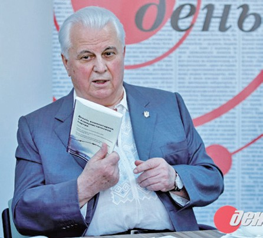

乌克兰首任总统列昂尼德．克拉夫丘克曾是前乌克兰共产党的总书记，在1991年8月就退出共产党，并随即在8月24日宣布乌克兰从当时的苏联独立。

克拉夫丘克先生表示，三退大潮是一个很好的过程，因为人们了解“共产党”和“共产主义”，其不仅在中国，而且在全世界都是与专制政权、迫害、饥饿和屠杀联系在一起
的。克拉夫丘克先生一直推崇《九评共产党》，并向各界推荐。
他对中国民众的三退大潮的前景充满希望。他表示，如果中国民众都非常地确信，不想与共产党为伍，他会支持他们。三退大潮是一个全球性的过程，没有人能阻挡得了这样的人权运动。

<a href=#list><h6 align="right">回目錄</h6></a>

<a name=1-3><h2>
 捷克前总统哈维尔：用道德对抗共产党</a>  </h2> 

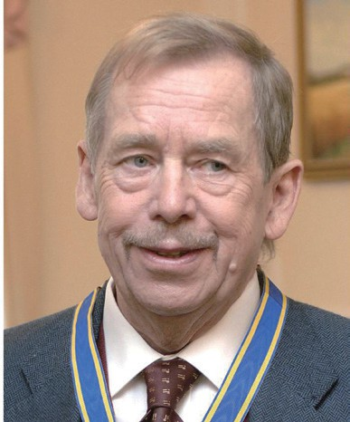

2005年捷克前总统哈维尔在回应由《九评共产党》所引发的中国退党浪潮和以和平方式令中共解体的看法时说：“对抗共产主义最好的武器，不是采用暴力武器，而是采
用道德、理念与知识的利器，顶着危险勇敢站出来坚持真理，这是最有效的办法。”

哈维尔先生说：“虽然捷克斯洛伐克在共产党统治时期的受难者，仍不了解在中国或其他共产铁幕统治下人们遭受的深层苦难，比如文化大革命运动所带来的苦难。但是我仍非常高兴和欣赏你们能够研究这个问题并把你们的发现公开发表出来。保护我们不受独裁统治之苦，并且不被其变相的、貌似民主的意识形态欺骗。”

<a href=#list><h6 align="right">回目錄</h6></a>

<a name=1-2><h2>
 美国会研讨会关注三亿人三退为世界带来希望 </a>  </h2> 

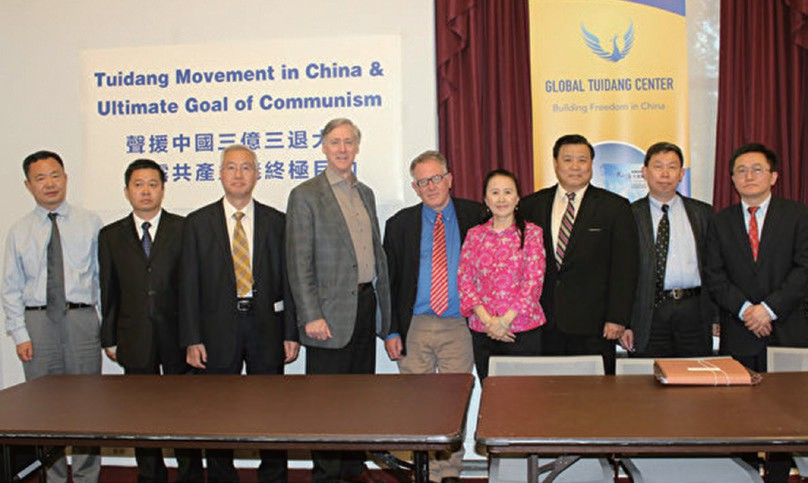

“三亿中国人三退”研讨会在美国国会举办

2018年5月9日下午，在美国国会举办的“三亿中国人三退”研讨会上，来自不同国家的政治家和中国问题专家表示，民众大规模的精神觉醒为中国的未来带来了光明的希
望，也令国际社会振奋。

全球退党服务中心主席易蓉介绍说，退党运动为所有中国人和平抛弃中共提供了精神典范，是解决当前中国社会问题最包容、最和善的方式。

美国国会及行政当局中国委员会主席史密斯议员致信支持退党运动，他在信中说：“通过你们和众多正义人士为中国自由所做的努力，我相信，一个更美好的明
天即将到来。”

资深众议员史蒂夫．金发出褒奖信，赞扬三退大潮对中国的重要意义，该褒奖信列入国会正式记录。金议员表示，退党不是一场政治运动，而是以一种平和的方式
指引中国人提升自己的道德与良知，除去一个人和共产主义在精神上的联系，从而使人重拾传统以及对神佛的信仰。

“中共内部的解体对整个世界而言都是有利的。退党让世界展望一个没有共产党的中国，以及一个没有共产主义者参与的国际社会。”

<a href=#list><h6 align="right">回目錄</h6></a>

<a name=1-1><h2>
 美议员发起932号决议案 声援中国退党大潮 </a>  </h2> 

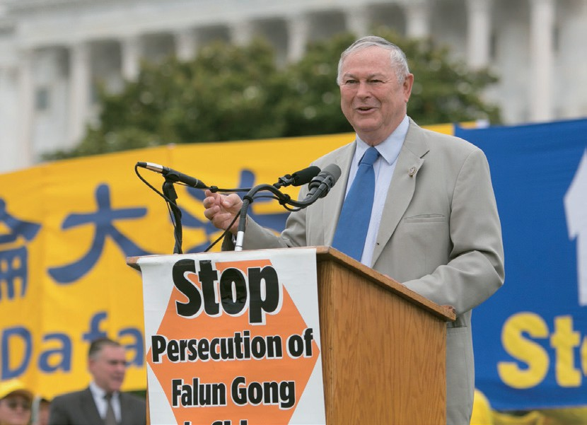

2018年6月8日，美国联邦众议员罗拉巴克发起第932号决议案，声援中国退党大潮，要求中共立即停止迫害法轮功。

第932号决议案指出，中共在中国至少造成六千万人非正常死亡，中共继续暴力镇压和平运动，包括长达19年、仍在持续的对法轮功的迫害。决议案中还说，退党大潮支持中国人民的自由及退出中国共产党及其附属组织，退出中共及其附属组织的民众在2018年达到约三亿人。

<b>第932号决议案提出：</b>

1. 表达声援法轮功学员及其家人；

2. 要求中国共产党立即停止迫害法轮功；

3. 表达声援中国退党大潮和中国民众追求一个自由民主的政府。

对于发起声援中国人退党的决议案，罗拉巴克议员说，“每当共产主义出现，基于马克思或列宁主义的无神论思想，就会导致大量杀戮，尤其在中国。”他表示，非常钦佩中国法轮功学员鼓励中国人退党的行为。

罗拉巴克议员认为：“退党大潮是当今世界上推动和平的最伟大力量之一，退党大潮的成功，会让我自己的孩子也生活在一个更安全的世界。”

美国联邦参众议员，2011年分别提起232号和416号提案，声援中国人三退。932号决议案是第三次以决议案形式声援三退，目前已提交众议院外交事务委员会。

<a href=#list><h6 align="right">回目錄</h6></a>

<a name=◆◆◆2>
</a>

了解更多 https://git.io/zbaaas   

<table>
  <tr>
    <td>
中国人加入中共时发誓把自己的一生献给“党”，为其奋斗终生。这样的誓言意味人的生命永远属于党。善恶有报是天理，人不治天治。天灭中共绝不是只针对一个空泛的组织机构，而是包括所有曾经加入过中共党、团、队，无论是主动或被动加入中共的，如果不退出它，就是它的一分子，就会跟着陪葬。因此只有用化名或真名公开声明三退，才能脱离那些带来不幸灾难的邪恶因素，才能避免成为中共灭亡的殉葬品，才能得到上天的护佑，才能远离灾难和危险。

这三亿“三退勇士”从思想中抛弃中共站到正义的一边，为自己选择了光明美好的未来！现在中国民间都在口耳相传：“三退保平安”、“三退得福报”。

 </td></tr></table>

<h2 align=center>明真相村民得福报劝三退</h2>

河北省村民老张快七十岁了，在2015年干活时不小心砸伤了腿，痛到完全无法走路。这时一位法轮功学员路过给他讲真相、做三退，还给了他一本《九评共产党》。老张一口气看完，感觉非常震撼，共产党真是太坏了！没想到一站起来发现腿竟然不疼了，能正常的走路了，他马上跑去找村里的党支书要求退出共产
党组织。

老张心想我受益了，也要让更多的人受益。所以他就用自己亲身受益的事实，劝说亲朋好友和邻村的村民退出中共党团队，也到集市去讲真相，劝三退和发真相资料。而且他还带动姐姐和姐姐的女儿一起去讲真相，姐姐的腿疼的老毛病竟也不治而愈。一年多的时间他们共劝退了一百五十多人，有乡村的干部、学校的校长、教导主任、老师和普通的民众，大多数人都是实名三退。

<h2 align=center>三退后死里逃生</h2>

小李做生意常到外地进货，一次他和外甥一起出门，由外甥开车，他坐在副驾驶座，没想到车子开到一座桥上突然翻覆掉入河中，车子是侧立着掉下去的，就插在淤泥里，副驾驶座被压在下面，结果没想到坐在驾驶座的外甥当场死亡，而小李却神奇地活着，还从车里爬出来打电话报警。

交警来捞车时，小李告诉交警，自己当时坐在副驾驶的位置上，他是从车子里爬出来的。交警根本不相信，认为他在撒谎并说：“怎么可能呢？如果说驾驶员活着还有可能，你在那个位置绝对活不了！”这时小李恍然大悟，车祸中他能死里逃生，是因为他早已明白真相，退出中共团队组织才有的福报，他后悔没早劝外甥也三退，这样他也不会送命了。当时在车祸现场有九十多人，看到后纷纷做了三退。

<h2 align=center>病房的人都一起出院了</h2>

王老头是晚期肺癌，瘦的皮包骨，不能吃东西，心脏也有问题，整天只能躺在病床上嗷嗷叫，医生说最多只能活两个月了。他同病房的病人也都是重病号。一位法轮功学员到医院探病时给王老头讲了法轮功的真相，他明白后同意三退。

第二天早上医生来查房，拿听诊器一听，惊讶的对王老头大声说：“哎呀！你怎么肺好了，心脏也没问题了，这是怎么回事！你怎么全都好了呢？你点滴也别打了，你可以下地走了。”王老头感到全身舒畅，他对女儿说：“咱们出院吧！”这一情景，全屋的人可都看明白了，同病房的其他病人也都高兴地做了三退，
一起出院了。

<h2 align=center>三退后重伤迅速痊愈</h2>

大陆民众昌昌退伍后在一家运输公司开大货车，一天半夜他去货场装货，被开吊车的驾驶员撞倒在地，七吨重的吊车车轮又从他右脚脚面碾压过去。他当场昏迷，血流一地，直到早上才被发现送医抢救。因延误送医，失血过多，脚面神经、肌肉已坏死。

医生说要截肢，昌昌坚决不同意，私企老板怕花钱，也不愿意管他的事情。他的脚因为打上石膏，伤部奇痒难忍，他便要求医生把石膏袋锯开。结果医生惊奇地发现，才一周的时间骨位复合的很好，尤其是死去的肌肉、神经都恢复得很好，一点残疾都没有留下，连医生都感到不可思议！昌昌心里知道是因为他明白了真相，早退出了中共党团队，才能逢凶化吉得福报。

顺天意做三退，退党保平安就是最明智的选择。希望善良的人都能得福报，为自己和家人，选择美好的未来！

<a href=#list><h6 align="right">回目錄</h6></a>

<a name=◆◆◆>
</a>

<h2>
道人之语蕴天机　七十年后终解迷</h2> 

我今年八十一岁，这里讲的是我亲身经历的一桩往事。

我娘家住在济南市南部山区。七十年前我很小的时候，就记着家里住着一位四十开外修行的道人。人很善良，农忙时，他就帮我家中干些活，闲时就外出行医、化斋，晚上回来也不点灯，在屋内修行。

在我十二岁那年，有几件记得最深事情：

有一天是晴空万里，他却不让我家人外出，但不说为啥。快到中午的时候天气大变，即刻狂风四起，飞沙走石，大树拔起折断，房子揭盖，对面伸手不见五指。大约一个小时左右，天才慢慢放亮，出来太阳。道人说：如果正面碰上这风头，人就会生场大病和扒几层皮，严重的甚至连命也难保。

这一年大旱，入伏的头三天才下雨，村里人都赶快抢种，道人却不让我们家种。三天后，又下了一场更大的雨，种上的也白种了，全让雨给冲坏了。大雨过后，地里很湿，他却催着赶快种，再不能耽误，否则种的庄稼就不好出苗了。

过了几年，道人对我父母说：我要走了，我不能在这里修行了，家里如果有事需要我帮忙的时候，可点上一根香叫我的名字，我就到……。家里人似信非信。

一年后，父亲背后长了个恶疮，花了很多钱也治不好，这才想起了道士他说的话，家里人还担心能有这么灵验吗？但此时也顾不得这么多了，试试吧。晚上奶奶拿了一把香在院子里点上后，叫着道士的名字快来。当时是寒冷的冬天，天还没亮的时候听见有人敲门，开门后一看是道人，只见他满头大汗，棉衣都被汗浸透了。第一句话就问家里出了什么大事？母亲把父亲的病情说了。他看了看父亲的恶疮后说没事，好治。然后把恶疮挖掉，上了药。第二天，父亲就能下床了。他临走时，父亲问他什么时候再回来看我们？道人说：“等山上有了楼、井里水淌到家、灯头朝了下、山剩半边、人死后没人埋的时候，我再回来看你们。那时大变样。”父母听完后，脸色都变了，说人死没人埋，这不是场人间大灾难吗？就没有解此难的办法吗？经父母的多次追问后，道人才说：“脸上有印看不见，抹去印记度劫难。”全家都深深记下这些话来，就是难解其中的意思。

七十年后的现在，他说的前四句话都一一实现了：现在山上山下都有楼房，井里的水也淌到了家（因以前都是到水湾里、井里去挑水喝），灯头朝了下是指的电灯，（以前都是用的煤油灯，所以灯头是朝上的）。因为我们这里是山区，但过度的开采，没有完整的山，多数是半边了。只有“人死后没人埋”这句还没应验。可我也始终没有解开“脸上有印看不见，抹去印记度劫难。”那两句话，还是迷。

不久前有一天早上开门时，门缝里夹着一张劝善真相传单，我就让孩子们念给我听听上面写的是什么。当我听到“大纪元”三个字时，我忽然想起了道士原先曾说大纪元是研究天象变化的。当念到上面写着：“老天要灭某某党，凡是举手入过党、团、少先队及作恶多端的人，脸上都带有印记，眼前面临一场大灾大难，要想度过这一场大劫难，可用小名、别名、化名，向大纪元声明退出即可，就能抹去脸上的‘兽’字印记，永保平安。” 此时我突然想起了道士说的那两句话来。这一张真相传单一下子给我解开了七十多年一直未解的“迷”，怪不得法轮功的传单让大家退党、团、队，原来是在行善让大家免灾难保平安啊！我们全家人明白真相后，都一一照办退出了党、团、队。

七十年前的道士预见了现在的人和事。我已经是八十多岁的老人了，如今也是子孙满堂。我今天也为了救人，才叫孩子们写出这桩事来。希望各位父老乡亲们别错过时机，都能平安无事，记住：宁可信其有，不可信其无这句老话。否则当灾难真的到来时，已后悔晚矣！千万 不要拿自己的生命开玩笑啊！

<a href=#list><h6 align="right">回目錄</h6></a>

<a name=◆◆◆◆>
 </a>

<h2>
亿年藏字石的启示</h2> 

2002年6月，在贵州境内发现了2.7亿岁的“藏字石”，五百年前崩裂的巨石断面内惊现六个排列整齐的大字“中国共产党亡”，其中那个“亡”字特别的大。中共媒体都报道了此新闻，但隐去“亡”字，光提“中国共产党”。

全国政协委员、中国科学院地学部副主任、中国科学院院士、著名地质学家李廷栋，中国科学院院士，著名地质专家刘宝君，中国地质大学教授、国土资源部国家地质公园评委、著名古生物学专家李凤麟等15人组成的“贵州平塘地质奇观--中国名家科学文化考察团”，于2003年12月5日至 8日深入掌布河谷重点对“藏字石”进行实地考察。

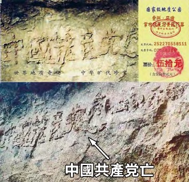

贵州省平塘县掌布乡风景区门票

专家一致认为，掌布河谷景区“藏字石”上的字位于距今2.7亿年左右的二叠统栖霞组深灰色岩中。“藏字石”上至今未发现人工雕凿及其它人为加工痕迹，堪称世界级奇观，具有不可估量的地质研究价值。

这次考察，人民日报、中央电视台、光明日报、科技日报、旅游卫视、中国国际广播电台等20多家媒体记者随团采访报道，人民网、新浪网、东方网、搜狐网、雅虎、新华网等互联网在内的100多家报纸、电视、网站转发了这一科学考察活动消息。

但是没有人敢提那第六个字“亡”，纷纷报导前五个字“中国共产党”，但每一个亲眼观看的人都心知肚明。（如上图，在网上搜索“藏字石”即可查到）。

几千年来的中国，在要出大事之前，就一定有奇事发生，上天或以瑞兆示吉，或以凶相警世。“藏字石”呈现“中国共产党亡”，是不是也在向人们预示着天机呢？回顾中共执政60多年以来的几十场政治运动，从土改、镇反、三反、五反、反右、大跃进、文革、六四到迫害法轮功，从普通百姓到国家主席，中国人有一半以上受到过中共的迫害。据不完全统计，有8000多万中国人在中共执政期间非正常死亡，这个数字是第一次世界大战死亡人数的8倍，是第二次世界大战死亡人数的1.5倍。再看当今中国社会：道德沦丧，工人失业，农民失地，贪官横行，官商勾结，警匪一家，百姓怨声载道。这样罪恶累累的中共，上天还能容它吗？由此看来，亿年古石如今突现“中国共产党亡”绝非偶然。了解更多 https://git.io/zaasfa    
  

<a href=#list><h6 align="right">回目錄</h6></a>

<a name=◆◆◆◆◆>
</a> 

<table>
  <tr>
    <td>
广大的中国民众：共产党的末日就要到了。但是这个邪恶的党（魔教）在历史上却对众生、对神佛犯下了滔天大罪，神一定要清算这个恶魔。

如果有一天，神指使人类的谁对共产党清算时，也一定不会放过那些所谓坚定的邪恶党徒。我们郑重声明：所有参加过共产党与共产党其它组织的(被邪恶打上兽的印记的)人，赶快退出，抹去邪恶的印记。一旦谁对这个魔教清算时，大纪元储存的记录可以为声明退出共产党和共产党其它组织的人作证。

天网恢恢，善恶分明；苦海有边，生死一念。曾被历史上最邪恶的魔教所欺骗的人，曾被邪恶打上兽的印记的人，请抓住这稍纵即逝的良机！

大纪元　

2005年1月12日

</td></tr></table>

<a href=#list><h6 align="right">回目錄</h6></a>

<a name=◆◆◆◆◆1>
  </a>  

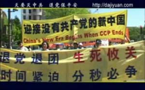

<table>
  <tr>
    <td>
有些人说，我思想中早退了，我也不交党费了；或是我加入团员、少先队员那是很久以前的事了，已经早就自动不算了；或是我去组织上退出了……这些都不能算是真正退出中共邪党相关组织，还是它其中的一份子。因为在那个血旗面前向天发毒誓时，您是说把一生、把生命都献给邪党了。所以只有采取公开的方式在大纪元退党网站上声明退出，有了这个行动，才能除掉这么大的毒誓，才能在天灭中共的时候保平安！声明主要是看人心，因此化名也同样有效。

孩子们也是一样，一定要帮他们退出少先队、退出共青团，让他们未来平安！早退早保障，希望您所有的亲人朋友都能声明退出共产党，获得生命的保障，祝福您们！

(注：退党声明是关系到生命的大事，帮人声明一定得经过本人同意。以下提供各种管道，包括上网、电话、传真等方式，择一即可。其中用电话、传真等途径者，将有专人负责帮您将声明上到大纪元退党网站，无须提供个人资料，方便又快速。)

( 鉴于大陆的特殊情况，从中国大陆退党退团的人士，用笔名、小名一样有效 )

* 退党、退团、退队电话：

利用国际长途电话告诉对方要退出的类别和声明人的名字 

美国热线电话: 

001-702-873-1734 

001-866-697-6570 

001-858-609-9088 

001-858-609-9099 

001-888-892-8757 

加拿大热线电话: 

001-416-361-9895 

001-514-342-1023 

001-604-276-2569

* 全球退党服务中心发现国内打退党热线电话接通后， 有一个国语的录音告诉拨号人：这是个空号，请不要打这个电话。 但是如果拨号人不挂电话，电话很快就能接通。

请大家互相通知立志退出中共的中国民众继续打退党热线电话， 把握这稍纵即逝的良机， 给自己留下美好的未来。

* 退退党、退团、退队传真：

将声明通过传真发到

　001-510-372-0176,　001-201-625-6301

 
 

* 进入以下网址,访问大纪元退党网站。 

https://git.io/722 请复制后，用谷歌浏览器访问。

* 您也可以利用出国的机会，将三退声明和人员名单在国外通过上述方式发出来。

* 暂时无法用以上管道声明退党, 可用笔名、化名先将声明张贴在公共场所，先起到公开表明心意的作用，以后找机会上网发表声明。

</td> </tr>
</table>
 

    

